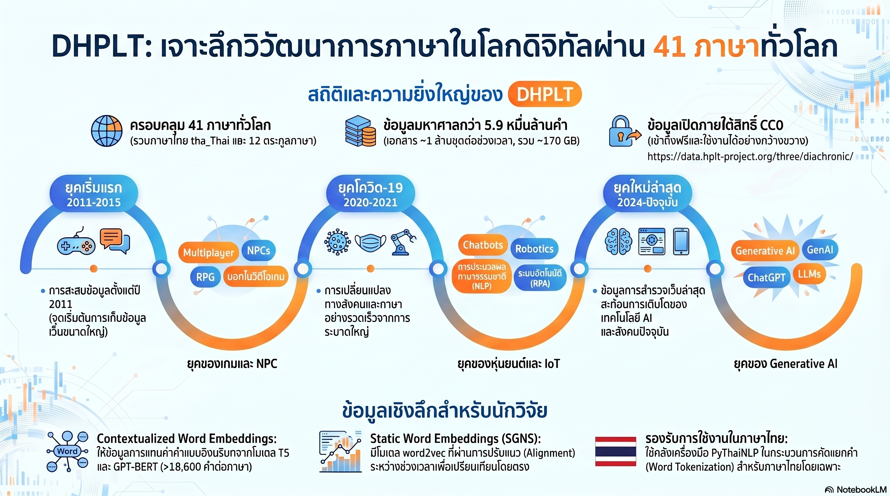

[กลับไปที่หน้าหลัก](../README.md)

สวัสดีครับเพื่อนๆ ที่ติดตามวงการ AI และภาษาศาสตร์! วันนี้มาเรื่องที่ตอบคำถามที่ว่า "ภาษาเปลี่ยนไปอย่างไรในยุค AI?" ด้วยโครงการ DHPLT (Diachronic HPLT) ที่ใช้ข้อมูล 50 TB สร้าง "ไทม์แมชชีนทางภาษา" ครอบคลุม 41 ภาษาทั่วโลก รวมถึงภาษาไทยด้วยครับ

คุณเคยสังเกตไหมครับว่า คำว่า "Remote" ที่แปลว่า "ห่างไกลทางภูมิศาสตร์" เมื่อ 10 ปีก่อน วันนี้กลับหมายถึง "วิธีทำงานและวิถีชีวิต" เกือบเต็มๆ โดยที่เราแทบไม่รู้สึกตัวว่าภาษารอบตัวเราเปลี่ยนไปแล้ว?

คุณรู้ไหมครับว่า มีโครงการวิจัยที่ใช้ข้อมูลเว็บไซต์กว่า 50 TB กลั่นกรองจนเหลือ 170 GB เพื่อสร้างฐานข้อมูล 5.9 หมื่นล้านคำใน 41 ภาษาจาก 12 ตระกูลภาษา โดยครอบคลุมภาษาไทยอย่างครบถ้วนทั้ง 3 ยุคสมัยด้วย?

และคุณเคยนึกไหมครับว่า การที่คำว่า "AI" ในภาษาอังกฤษปี 2011-2015 อยู่ใกล้กับคำว่า NPCs และ Gaming แต่ในปี 2024 อยู่ใกล้กับ ChatGPT และ LLMs นั้นคือการบันทึกประวัติศาสตร์มนุษยชาติที่ซื่อสัตย์และแม่นยำที่สุดรูปแบบหนึ่ง?

ภาษาคือ "สิ่งมีชีวิต" ที่วิวัฒนาการไปพร้อมกับเรา และ DHPLT คือเครื่องมือที่ทำให้เราเห็นการวิวัฒนาการนั้นในระดับที่ไม่เคยเป็นไปได้มาก่อนครับ

========================================

🤔 ทบทวนความเชื่อเดิมๆ: สิ่งที่เราคิดเกี่ยวกับภาษาและการเปลี่ยนแปลงของมัน

▪ "การเปลี่ยนแปลงความหมายของคำเป็นเรื่องช้ามาก ใช้เวลาเป็นร้อยๆ ปี ไม่มีจุดพลิกฉับพลัน" → "Remote" เปลี่ยนความหมายหลักภายในปี 2020-2021 เพียงปีเดียว โควิด-19 พิสูจน์ว่าวิกฤตการณ์สังคมสามารถ "ฉีดความหมายใหม่" เข้าไปในคำได้ภายในเวลาไม่ถึง 2 ปี และความหมายนั้นคงอยู่ถาวรครับ

▪ "การวิจัยภาษาเชิงประวัติศาสตร์ต้องใช้เอกสารที่มีวันที่ระบุชัดเจน ข้อมูลอินเทอร์เน็ตที่ไม่มีวันที่ไม่น่าเชื่อถือ" → Web crawl timestamps + Upper Bound concept ทำให้การระบุยุคสมัยของข้อมูลอินเทอร์เน็ตมีตรรกะที่แน่นหนา เอกสารที่เก็บในปี 2015 ไม่มีทางมีเนื้อหาจากปี 2024 ได้ เป็นขอบเขตที่รับประกันได้ครับ

▪ "การวิจัยภาษาดิจิทัลต้องโฟกัสที่ภาษาอังกฤษเท่านั้น เพราะภาษาอื่นไม่มีข้อมูลดิจิทัลเพียงพอ" → DHPLT ขยายสู่ 41 ภาษาจาก 12 ตระกูล รวมภาษาไทย (ใช้ pythainlp สำหรับ Tokenization) และมีข้อมูลครบถ้วนทั้ง 3 ยุคสมัยสำหรับภาษาไทย พิสูจน์ว่าการวิจัยหลายภาษาเป็นไปได้แล้วครับ

▪ "คำในภาษาต่างๆ วิวัฒนาการตามวัฒนธรรมท้องถิ่นของตัวเอง ยากที่จะเห็นรูปแบบข้ามภาษา" → Nearest Neighbors ของ "AI" ในภาษาอังกฤษ สเปน และรัสเซีย เดินทางมาถึงจุดเดียวกันคือ ChatGPT ใน 2024 สะท้อนว่าปรากฏการณ์ AI ข้ามพรมแดนภาษาและวัฒนธรรมได้จริงๆ ครับ

ความจริงที่น่าคิดคือ: ภาษาไม่ใช่แค่เครื่องมือสื่อสาร แต่คือบันทึกประวัติศาสตร์สังคมที่ซื่อสัตย์ที่สุด และตอนนี้เราเริ่มอ่านบันทึกนั้นได้ระดับที่ไม่เคยทำได้มาก่อนครับ

========================================

🧠 พื้นฐานที่ต้องเข้าใจก่อน: Semantic Change, Diachronic Analysis, SWE และ Upper Bound

=== Semantic Change คืออะไร? ===

Semantic Change = การเปลี่ยนแปลงความหมายของคำตามกาลเวลา ซึ่งเป็นปรากฏการณ์ตามธรรมชาติที่เกิดขึ้นในทุกภาษา

ประเภทของ Semantic Change:
▸ Broadening: คำขยายความหมายออก (เช่น "Virtual" จากแค่ "คอมพิวเตอร์" สู่ "ทุกอย่างที่ไม่ใช่กายภาพ")
▸ Narrowing: คำจำกัดความหมายลง
▸ Shift: ความหมายเปลี่ยนทิศทางโดยสิ้นเชิง (เช่น "Remote" จาก "ระยะทาง" สู่ "วิธีทำงาน")

เปรียบเทียบ: เหมือนแม่น้ำที่ไหลในเส้นทางเดิมมานาน แต่เมื่อเจอเหตุการณ์ใหญ่ (เช่นโควิด) อาจเปลี่ยนทิศทางอย่างถาวรในช่วงเวลาสั้นๆ ครับ

=== Diachronic Analysis คืออะไร? ===

Diachronic = ผ่านกาลเวลา (จากภาษากรีก dia = ผ่าน + chronos = เวลา)

Diachronic Analysis = การศึกษาภาษาโดยเปรียบเทียบข้ามช่วงเวลา เพื่อดูว่าเปลี่ยนแปลงอย่างไร

เปรียบเทียบ: ต่างกับการถ่ายภาพนิ่ง (Synchronic ศึกษาภาษา ณ จุดเวลาเดียว) Diachronic คือการถ่าย Time-lapse ที่เห็นการเปลี่ยนแปลงทั้งกระบวนการครับ

=== Static Word Embeddings (SWE) vs Contextualized Embeddings ===

[Static Word Embeddings (SWE)]
▸ แต่ละคำมีเวกเตอร์ตายตัวในแต่ละยุค ไม่ขึ้นกับบริบทประโยค
▸ ใช้ดู "เพื่อนบ้านที่ใกล้ชิด" ของคำในแต่ละช่วงเวลา
▸ เหมาะสำหรับติดตามว่าคำอยู่ใกล้กับคำไหนในแต่ละยุคสมัยครับ

[Contextualized Embeddings (T5 encoder)]
▸ ความหมายของคำเปลี่ยนตามบริบทประโยค
▸ จับการเปลี่ยนแปลงความหมายได้ละเอียดกว่า
▸ เหมาะสำหรับศึกษาว่าคำถูกใช้ใน "บริบทใหม่" อะไรบ้างครับ

เปรียบเทียบ: SWE เหมือนดูว่าคนนั้นนั่งอยู่โต๊ะกับใครในงานเลี้ยง, Contextualized เหมือนฟังว่าบทสนทนาเปลี่ยนไปจากอะไรสู่อะไรครับ

=== Upper Bound Timestamp คืออะไร? ===

Upper Bound = หลักการที่บอกว่า เอกสารที่ถูก Crawl (เก็บข้อมูล) ในปี X ไม่สามารถมีเนื้อหาจากหลังปี X ได้

Web crawl timestamps = วันเวลาที่หุ่นยนต์เก็บข้อมูลเว็บไซต์ ใช้เป็น Upper Bound สำหรับ "อายุ" ของเนื้อหา

ข้อจำกัด: เนื้อหาจริงอาจเก่ากว่าวันที่ Crawl (เช่น บทความที่เขียนปี 2010 อาจถูก Crawl ปี 2015) แต่ไม่มีทางใหม่กว่าวันที่ Crawl ครับ

=== Deduplication คืออะไร? ===

Deduplication = กระบวนการกำจัดข้อมูลซ้ำออกจากชุดข้อมูลขนาดใหญ่

ทำไมจำเป็น: เว็บไซต์มักคัดลอกเนื้อหากัน ข้อมูลซ้ำทำให้คำบางคำดู "ถี่" เกินจริง และ Bias ผลการวิเคราะห์

ผลลัพธ์: 50 TB (Raw) → 170 GB (คุณภาพสูง) ลดลง ~300 เท่า แต่คุณภาพสูงกว่ามากครับ

========================================

1️⃣ 41 ภาษา 12 ตระกูล: เมื่อ Linguistic Diversity กลายเป็นข้อมูล

=== ขนาดและความครอบคลุมของ DHPLT ===

โครงการ DHPLT ไม่ได้แค่ "ใหญ่" แต่ถูกออกแบบมาให้ครอบคลุมความหลากหลายทางภาษาอย่างแท้จริงครับ

[ตัวเลขสำคัญ]
▸ Raw Data: กว่า 50 TB (ข้อมูลเว็บขนาดมหาศาล)
▸ หลัง Deduplication + Cleaning: ~170 GB (ลด ~300 เท่า แต่คุณภาพสูงขึ้นมหาศาล)
▸ จำนวนคำรวม: 5.9 หมื่นล้านคำ (59 Billion words)
▸ การสุ่มตัวอย่าง: 1 ล้านเอกสารต่อช่วงเวลาต่อภาษา
▸ ภาษาไทย: มีข้อมูลครบถ้วนทั้ง 3 ช่วงเวลา ใช้ pythainlp สำหรับ Tokenizationครับ

[ความครอบคลุมทางตระกูลภาษา (Language Families)]
▸ Indo-European: อังกฤษ สเปน รัสเซีย ฝรั่งเศส ฯลฯ
▸ Afro-Asiatic: อาหรับ ฮีบรู ฯลฯ
▸ Tai-Kadai: ภาษาไทย
▸ รวม 12 ตระกูลภาษาที่มีโครงสร้างและวิธีคิดต่างกันโดยสิ้นเชิงครับ

=== ทำไมภาษาไทยถึงพิเศษในชุดข้อมูลนี้ ===

ภาษาไทยมีความซับซ้อนเฉพาะตัว: ไม่มีช่องว่างระหว่างคำ ทำให้การตัดคำ (Tokenization) ยากกว่าภาษายุโรปมาก ทีม DHPLT ตัดสินใจใช้ pythainlp ซึ่งเป็นไลบรารีเฉพาะทางที่นักภาษาศาสตร์ไทยยอมรับ แทนที่จะใช้ตัวตัดคำทั่วไป

เปรียบเทียบ: เหมือนการแกะของออกจากกล่องที่บรรจุแบบต่างกัน ภาษาอังกฤษใช้เทปตัดง่าย แต่ภาษาไทยต้องใช้มีดพิเศษที่รู้จักรูปแบบการบรรจุนั้นๆ ครับ

=== นัยสำคัญ: ทำไมความครอบคลุมหลายภาษาถึงสำคัญ ===

การมีข้อมูล 41 ภาษาทำให้สามารถตอบคำถามใหม่ได้:
▸ ปรากฏการณ์ทางภาษาไหนที่เกิดขึ้น "ข้ามภาษา" พร้อมกัน (Global event)
▸ ปรากฏการณ์ไหนที่เกิดเฉพาะภาษาเดียว (Culture-specific)
▸ AI บูมส่งผลต่อภาษาในทุกวัฒนธรรมเท่ากันหรือไม่ครับ

========================================

2️⃣ 3 ยุคสมัย + Upper Bound: สร้างไทม์ไลน์จากข้อมูลที่ไม่มีวันที่

=== โครงสร้าง 3 ช่วงเวลา ===

DHPLT เลือก 3 ยุคสมัยที่มีนัยสำคัญทางประวัติศาสตร์ครับ

[ยุคที่ 1: 2011-2015 — ยุค Social Media บูม]
▸ Smartphone เริ่มกลายเป็นอุปกรณ์หลัก
▸ Social Media ขยายตัวอย่างรวดเร็ว
▸ AI ยังเป็นเรื่องของนักวิทยาศาสตร์ ไม่ใช่คนทั่วไปครับ

[ยุคที่ 2: 2020-2021 — ยุคโควิด-19]
▸ วิกฤตการณ์โลกที่บังคับให้ภาษาเปลี่ยนเร็วผิดปกติ
▸ "Lockdown", "Quarantine", "Remote" เปลี่ยนความหมายในทุกภาษาพร้อมกัน
▸ Digital transformation เกิดขึ้นแบบถูกบังคับครับ

[ยุคที่ 3: 2024-ปัจจุบัน — ยุค AI บูม]
▸ ChatGPT เปลี่ยนโลกให้ภาษาเปลี่ยนตาม
▸ คำศัพท์ใหม่ระดับ "Generative AI", "LLM", "Hallucination" กลายเป็นภาษาชาวบ้าน
▸ บันทึกการเปลี่ยนแปลงครั้งใหญ่ที่สุดของภาษาในยุคดิจิทัลครับ

=== ความท้าทาย: ระบุ "อายุ" ของข้อมูลที่ไม่มีวันที่ ===

ปัญหาของข้อมูลอินเทอร์เน็ตคือเนื้อหาส่วนใหญ่ไม่มีวันที่เผยแพร่ที่ชัดเจน DHPLT แก้ด้วย Upper Bound Timestamp ครับ

[ตรรกะของ Upper Bound]
▸ IF เอกสารถูก Crawl ในปี 2015 THEN เนื้อหาต้องเขียนก่อนปี 2015 แน่นอน
▸ เอกสารอาจเขียนปี 2010 แต่ไม่มีทางเป็นปี 2020
▸ ทำให้กำหนดได้ว่าเนื้อหานั้น "เป็นไปได้" ในยุคไหนครับ

[ข้อจำกัดที่ต้องยอมรับ]
▸ ชุดข้อมูลปี 2024 อาจมีเนื้อหาเก่าสะสมมากกว่า (Cumulative noise)
▸ นักวิจัยต้องคำนึงถึง Bias นี้ในการวิเคราะห์
▸ แต่ก็ดีกว่าไม่มีการระบุเวลาเลยครับ

เปรียบเทียบ: เหมือนการหาอายุของของโบราณ เราไม่รู้อายุแน่นอน แต่รู้ว่ามันต้องเก่ากว่าชั้นดินที่มันฝังอยู่ Upper Bound ให้หลักฐานเชิงลบที่เชื่อถือได้ครับ

========================================

3️⃣ คำว่า "AI" ใน 3 ภาษา: จาก NPCs ในเกมสู่ ChatGPT ในชีวิตประจำวัน

=== Nearest Neighbors ของ "AI" ข้ามภาษาและข้ามยุค ===

การทดสอบ Sanity Check ที่ชัดเจนที่สุดของ DHPLT คือการดูว่า "เพื่อนบ้านที่ใกล้ที่สุด" ของคำว่า AI ในแต่ละภาษาเปลี่ยนไปอย่างไรครับ

[ภาษาอังกฤษ: AI]
▸ 2011-2015: NPCs, Gaming, Multiplayer ← AI = ตัวละครในวิดีโอเกม
▸ 2020-2021: Robotics, IoT, Chatbots ← AI = เทคโนโลยีอุตสาหกรรม
▸ 2024: Generative AI, ChatGPT, LLMs ← AI = เครื่องมือชีวิตประจำวัน

[ภาษาสเปน: IA (Inteligencia Artificial)]
▸ 2011-2015: BETA, PS, Jugabilidad (Game mechanics) ← IA = เกมอีกเช่นกัน
▸ 2020-2021: Algoritmos, Tecnología ← IA = เทคโนโลยีทั่วไป
▸ 2024: Generativa, ChatGPT ← IA = AI ยุคใหม่ เหมือนภาษาอังกฤษ

[ภาษารัสเซีย: ИИ (Искусственный интеллект)]
▸ 2011-2015: ข้อมูลไม่เพียงพอ (ความถี่ต่ำมาก) ← ИИ แทบไม่มีในภาษาเขียนทั่วไป
▸ 2020-2021: Intellect, Robots, Algorithms ← ИИ เริ่มมีพื้นที่
▸ 2024: ChatGPT, нейросети (Neural Networks) ← ИИ มาถึงจุดเดียวกับภาษาอื่น

=== บทเรียนจากภาษารัสเซีย: AI ข้ามพรมแดนได้จริง ===

กรณีรัสเซียน่าสนใจเป็นพิเศษครับ ในยุคแรกคำว่า ИИ แทบไม่มีที่ยืนในภาษาเขียนทั่วไป (ความถี่ต่ำเกินกว่าจะวิเคราะห์ได้) แต่ในปี 2024 ИИ อยู่เคียงข้างกับ ChatGPT เหมือนกับทุกภาษาทั่วโลก

เปรียบเทียบ: เหมือนดาวดวงหนึ่งที่แทบมองไม่เห็นด้วยตาเปล่า แต่กลับสว่างจ้าในช่วงเวลาเพียงทศวรรษเดียว การพุ่งขึ้นของ ИИ ในภาษารัสเซียคือหลักฐานที่ชัดเจนที่สุดว่า AI ไม่ใช่แค่ปรากฏการณ์ตะวันตกครับ

=== นัยสำคัญ: Global vs Local Semantic Change ===

ข้อมูลนี้ตอบคำถามสำคัญว่า: เมื่อ ChatGPT เปิดตัวปี 2022 มันเปลี่ยนภาษาของโลกพร้อมกันหรือเปล่า? คำตอบจาก DHPLT คือ ใช่ ครับ ปรากฏการณ์นี้เกิดขึ้นข้ามภาษา ข้ามวัฒนธรรม ในระยะเวลาใกล้เคียงกัน ซึ่งไม่เคยเกิดขึ้นในประวัติศาสตร์ภาษาศาสตร์มาก่อนครับ

========================================

4️⃣ "Remote" เปลี่ยนความหมาย และอนาคตของ DHPLT ในฐานะ Open Resource

=== T5 Contextualized Embeddings: จับการเปลี่ยนบริบทการใช้งาน ===

นอกจาก Static Word Embeddings แล้ว DHPLT ยังใช้ T5 encoder embeddings ซึ่งเป็น Contextualized model ที่เข้าใจความหมายในบริบทประโยค เพื่อจับการเปลี่ยนแปลงที่ละเอียดกว่าครับ

=== กรณีศึกษา: "Remote" และ "Remoto" ในยุคโควิด ===

คำว่า "Remote" (อังกฤษ) และ "Remoto" (สเปน) คือตัวอย่างที่ชัดเจนที่สุดของ Semantic Change ที่เกิดจากวิกฤตการณ์สังคมครับ

[ก่อนปี 2020: Remote = ระยะห่างทางกายภาพ]
▸ "Remote area" (พื้นที่ห่างไกล)
▸ "Remote control" (รีโมทคอนโทรล)
▸ "Remote server" (เซิร์ฟเวอร์ระยะไกลในเชิงเทคนิค)
▸ บริบท: ภูมิศาสตร์ เทคโนโลยีเครือข่ายครับ

[หลังปี 2020: Remote = วิถีชีวิตและวิธีทำงาน]
▸ "Remote work" (การทำงานจากที่บ้าน)
▸ "Remote learning" (การเรียนออนไลน์)
▸ "Going remote" (เปลี่ยนไปทำงานแบบไม่เข้าออฟฟิศ)
▸ บริบท: Flexibility, Virtual, Digital lifestyle ครับ

[สิ่งที่ T5 embeddings เปิดเผย]
▸ การขยับของ Vector ของคำว่า Remote จากกลุ่ม "Geography/Network" ไปสู่กลุ่ม "Work/Lifestyle"
▸ การเปลี่ยนนี้ชัดเจนมากในปี 2020-2021 และไม่กลับไปสู่จุดเดิม
▸ เกิดขึ้นทั้งในภาษาอังกฤษและสเปน สะท้อน Cross-linguistic shift จากเหตุการณ์เดียวกันครับ

เปรียบเทียบ: เหมือนแม่น้ำที่เปลี่ยนเส้นทางหลังน้ำท่วมครั้งใหญ่ เส้นทางใหม่คือสิ่งถาวรที่โลกต้องปรับตัวตามครับ

=== DHPLT ในฐานะ Open Resource ===

สิ่งที่ทำให้ DHPLT ต่างจากโครงการอื่นคือการตัดสินใจเผยแพร่ภายใต้ CC0 License (Creative Commons Zero) ซึ่งหมายความว่า

[CC0 License หมายความว่า]
▸ ใช้งานได้ฟรีโดยไม่มีเงื่อนไขใดๆ
▸ ไม่ต้องขออนุญาต ไม่ต้องอ้างอิง (แม้ควรทำ)
▸ ดัดแปลง แจกจ่าย หรือสร้างงานต่อยอดได้ทันที

[สิ่งที่นักวิจัยทั่วโลกทำต่อได้]
▸ ศึกษาจริยธรรมทางภาษา (เช่น Bias ในคำที่ใช้เกี่ยวกับกลุ่มต่างๆ)
▸ ติดตาม Disinformation ว่าแพร่กระจายผ่านภาษาอย่างไร
▸ เข้าใจวัฒนธรรมผ่านการเปลี่ยนแปลงของคำศัพท์
▸ พัฒนาโมเดลภาษาสำหรับภาษาที่มีข้อมูลน้อยครับ

========================================

🎯 สรุป: เมื่อภาษาคือกระจกเงาของมนุษยชาติ

DHPLT สรุปได้ด้วย 4 ความสำเร็จหลัก: ครอบคลุม 41 ภาษา 12 ตระกูล รวมภาษาไทย (50 TB → 170 GB, 59 พันล้านคำ), โครงสร้าง 3 ยุคที่จับช่วงเปลี่ยนผ่านสำคัญ + Upper Bound Timestamp, พิสูจน์ว่า AI เปลี่ยนภาษาของโลกพร้อมกันข้ามภาษา (ИИ รัสเซียจาก 0 สู่ ChatGPT), และจับ Semantic Shift ของ "Remote" จากระยะทางสู่ชีวิตใหม่ในโควิดด้วย T5 embeddings

สิ่งที่น่าสนใจกว่าตัวเลขคือสิ่งที่ DHPLT เปิดเผยเกี่ยวกับเราในฐานะมนุษยชาติครับ เราคิดว่าเราเลือกคำที่ใช้ แต่ความจริงคือเหตุการณ์รอบตัว (โควิด AI บูม) เลือกคำให้เรา และภาษาบันทึกทุกอย่างนั้นไว้โดยอัตโนมัติ

คำถามที่น่าคิดในอีก 10 ปีข้างหน้า: คำว่า "งาน" "ความสุข" และ "มนุษย์" ในภาษาไทยและภาษาอื่นๆ จะมีเพื่อนบ้านคำใดในยุคที่ AI หลอมรวมกับชีวิตเราอย่างสมบูรณ์ครับ?

========================================

💬 คำถามท้ายทาย: ลองคิดดูนะครับ

▪ "Remote" เปลี่ยนความหมายถาวรหลังโควิด ถ้าคุณต้องเดาว่าคำไทยคำไหนจะเปลี่ยนความหมายถาวรหลังยุค AI บูม คุณจะเลือกคำอะไร และมันจะเปลี่ยนไปในทิศทางใดครับ?

▪ ИИ ในภาษารัสเซียแทบไม่มีที่ยืนปี 2011 แต่ปี 2024 อยู่เคียงข้าง ChatGPT ถ้าภาษาบันทึกประวัติศาสตร์สังคมโดยอัตโนมัติ เราควรสอนประวัติศาสตร์โดยให้นักเรียน "ขุดค้น" การเปลี่ยนแปลงคำศัพท์แทนการอ่านตำราหรือเปล่าครับ?

▪ DHPLT ครอบคลุม 41 ภาษา แต่ยังมีภาษาอีกกว่า 7,000 ภาษาทั่วโลกที่อาจไม่มีข้อมูลดิจิทัลเพียงพอ ความเปลี่ยนแปลงของภาษาเหล่านั้นจะถูกบันทึกได้ไหม หรือจะหายไปพร้อมกับผู้พูดคนสุดท้ายโดยที่เราไม่รู้ตัวครับ?

▪ ข้อมูลปี 2024 มี Cumulative noise จากเนื้อหาเก่าที่สะสมมา ถ้า AI ในอนาคตถูกฝึกบนข้อมูลที่ผสมระหว่างภาษาเก่าและใหม่โดยไม่แยกยุคสมัย มันจะ "เข้าใจ" ความหมายปัจจุบันของคำได้แม่นยำแค่ไหนครับ?

========================================

References:
- DHPLT (Diachronic HPLT): Multilingual Diachronic Corpus for Semantic Change Analysis
- HPLT (High-Performance Language Technologies) Project
- pythainlp: Thai Natural Language Processing Library for Tokenization
- T5 Encoder Embeddings (Contextualized Word Representations)
- Static Word Embeddings (SWE) for Nearest Neighbor Analysis
- Semantic Scholar Citation Verification
- CC0 License (Creative Commons Zero)

ถ้าภาษาคือ DNA ของวัฒนธรรม DHPLT คือกล้องจุลทรรศน์ที่ทำให้เราเห็น DNA นั้นเปลี่ยนแปลงในเรียลไทม์ได้เป็นครั้งแรกในประวัติศาสตร์ครับ

#AI #NLP #Linguistics #DHPLT #SemanticChange #DigitalHumanities #Multilingual #ThaiNLP #LinguisticEvolution #BigData #WordEmbeddings #OpenData #HPLT #LanguageAI #ภาษาศาสตร์
