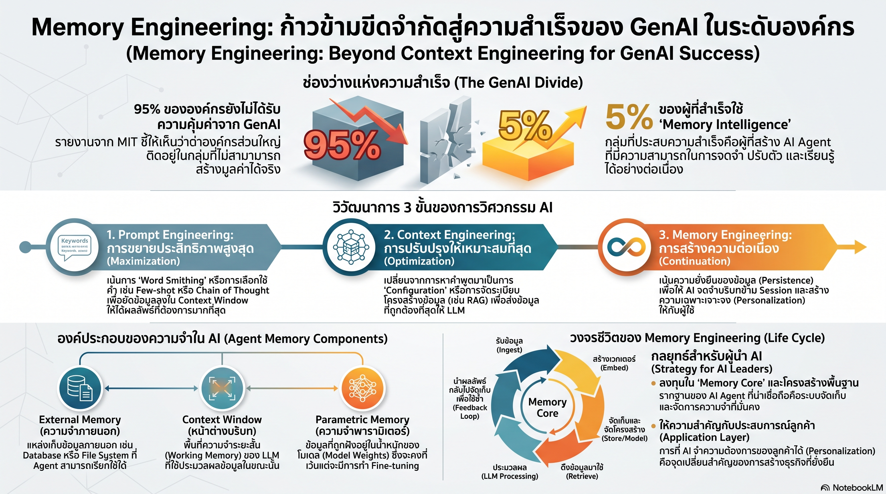

[กลับไปที่หน้าหลัก](../README.md)

สวัสดีครับเพื่อนๆ ที่ติดตามวงการ AI! รายงาน "The GenAI Divide" ของ MIT ระบุตัวเลขที่น่าตกใจว่ามีองค์กรเพียง 5% เท่านั้นที่สร้างมูลค่าที่จับต้องได้จาก AI ครับ Richmond Alake ผู้เชี่ยวชาญด้าน AI จาก Oracle บรรยายที่ DevCon Fall 2025 ว่าเส้นแบ่งระหว่าง 5% กับ 95% ที่เหลือนั้นไม่ใช่งบประมาณหรือขนาดของโมเดล แต่คือว่าองค์กรนั้นรู้จัก Memory Engineering หรือยังครับ — วิวัฒนาการจาก Prompt → Context → Memory ที่เปลี่ยน AI จากเครื่องมือฉลาดชั่วคราวกลายเป็น Foundational Asset ถาวรครับ

คุณเคยสังเกตไหมครับว่า AI ในองค์กรส่วนใหญ่ยังคง "ลืมทุกอย่าง" หลังจบการสนทนาครับ — คุณต้องบอกบริบทซ้ำทุกครั้ง ระบบไม่เคยเรียนรู้จาก Session ที่แล้ว และผู้ใช้คนละคนก็ต้องเริ่มต้นใหม่ทุกครั้งครับ? ทั้งที่ AI ที่จะทำงานแทนมนุษย์ได้จริงต้องจำได้ว่า "เราเคยทำอะไรไปแล้ว" ครับ

คุณรู้ไหมครับว่า Prompt Engineering ที่เราใช้กันอยู่นั้น Richmond เปรียบว่าเหมือนการสร้างเครื่องบินที่ "ขยับปีกได้" (Flapping Wings) ครับ — เลียนแบบธรรมชาติตรงๆ โดยยัดข้อมูลทั้งหมดลง Context Window ในคราวเดียวครับ แต่มันเปราะบางมาก แค่เปลี่ยนคำเดียวผลลัพธ์ก็พังครับ และไม่มีทางทำงานในระดับ Production ได้จริงครับ?

และคุณเคยนึกไหมครับว่า Computational Exocortex หรือ "สมองส่วนนอก" ของ AI นั้นมีสามชั้นที่ต้องบริหารจัดการพร้อมกัน ครับ — External Memory (Vector Database), Context Window (Working Memory), และ Parametric Memory (น้ำหนักในโมเดล) ครับ และงานของวิศวกร AI ที่แท้จริงคือการเคลื่อนย้ายข้อมูลระหว่างสามชั้นนี้อย่างไร้รอยต่อ ไม่ใช่การเขียน Prompt ให้สวยงามครับ?

งานวิจัยนี้กำลังบอกว่า: "องค์กรที่ล้มเหลวกับ AI ไม่ได้ล้มเหลวเพราะโมเดลไม่ดีพอ แต่เพราะพวกเขายังคิดว่า AI คือเครื่องมือที่ตอบคำถามครับ — ไม่ใช่ระบบที่ต้องสร้าง Memory ให้มันจำ เรียนรู้ และเก่งขึ้นจากประสบการณ์จริงครับ"

========================================

🤔 ทบทวนความเชื่อเดิมๆ: สิ่งที่เราคิดเกี่ยวกับการนำ AI มาใช้ในองค์กร

▪ "ถ้าเราเขียน Prompt ได้ดีพอ AI ก็จะทำงานได้ดีครับ — ปัญหาส่วนใหญ่แก้ได้ด้วย Prompt ที่ดีกว่าเดิม" → Prompt Engineering คือ "Words about the world" ไม่ใช่ความเข้าใจโลกจริงๆ ครับ มันมีเพดานชัดเจนที่ Context Window และเปราะบางอย่างมากครับ การเปลี่ยนคำเพียงคำเดียวอาจทำให้ผลลัพธ์พังทั้งระบบ ซึ่งไม่ใช่สิ่งที่ Production System จะยอมรับได้ครับ

▪ "เราแก้ปัญหาความจำด้วย RAG แล้ว — ใส่เอกสารใน Vector Database แล้ว Retrieve ก็พอครับ" → RAG คือ Context Retrieval ที่ดีขึ้นครับ แต่มันยังคงอยู่ในกรอบของ Context Engineering — แก้ Working Memory แต่ไม่สร้าง Continuity ครับ ทุกครั้งที่ Session จบ ความเข้าใจในบริบทของผู้ใช้คนนั้นก็หายไปหมดครับ ไม่มี Learning ที่แท้จริงเกิดขึ้นครับ

▪ "AI ที่เก่งขึ้นหมายความว่าต้องใช้โมเดลใหม่ที่ใหญ่กว่าเดิม — ความสามารถอยู่ที่ตัวโมเดลเป็นหลัก" → กลุ่ม 5% ที่ประสบความสำเร็จไม่ได้แตกต่างกันที่โมเดลครับ แต่อยู่ที่ Memory Infrastructure ครับ ระบบที่มี Feedback Loop ที่ดีทำให้ AI เก่งขึ้นจากการทำงานจริงโดยไม่ต้องเปลี่ยนโมเดลเลยครับ — Personalization สะสมตามเวลาครับ

▪ "Multi-agent System ซับซ้อนเกินไปสำหรับการใช้งานจริงในองค์กร — ดีแต่ในทฤษฎีครับ" → จุดติดขัดของ Multi-agent ไม่ได้อยู่ที่ความฉลาดของโมเดลครับ แต่อยู่ที่การขาด Coordination Memory ครับ Agent หลายตัวที่ไม่มี Shared Memory คือทีมที่ทุกคนทำงานในห้องแยก ไม่รู้ว่าคนอื่นทำอะไรไปแล้วครับ — แก้ที่ Infrastructure ไม่ใช่ที่โมเดลครับ

ความจริงที่น่าคิดคือ: "ปัญหาของ AI ในองค์กรส่วนใหญ่ไม่ใช่ปัญหา Intelligence ครับ แต่เป็นปัญหา Memory Architecture ครับ"

========================================

🧠 พื้นฐานที่ต้องเข้าใจก่อน: วิวัฒนาการ 3 ยุค, Computational Exocortex, Feedback Loop, และ Agent Stack

=== ยุคที่ 1 — Prompt Engineering: Maximization ===

ยุคแรกของการใช้ AI ในองค์กรคือการพยายาม "รีดเค้น" ประสิทธิภาพสูงสุดจาก LLM ผ่านการยัดข้อมูลลง Context Window ครับ ไม่ว่าจะเป็น Few-shot Examples, Chain-of-Thought, หรือ ReAct Framework ครับ

Richmond เรียกกลยุทธ์นี้ว่า Frontloading Cognition ครับ — ประเคนความรู้ทั้งหมดให้ AI ในคราวเดียว เหมือนสอนนักเรียนก่อนสอบโดยไม่ให้เวลาซึมซับครับ

ปัญหาคือสองข้อครับ ข้อแรก Context Window มีเพดานครับ ใส่ได้เท่าไหร่ก็เท่านั้นครับ ข้อสอง Fragility ครับ แค่เปลี่ยนคำเดียวผลลัพธ์อาจพังทั้งหมด เพราะ Prompt Engineering คือ "Word-smithing" ที่พึ่งพาการ Pattern Match ทางภาษาครับ ไม่ใช่ความเข้าใจที่แท้จริงครับ

=== ยุคที่ 2 — Context Engineering: Optimization ===

เมื่อการยัดข้อมูลติดเพดาน วิศวกรขยับมาสู่การ "สร้างโลก" (World Building) ให้กับ AI ผ่าน Context Engineering Flywheel ที่ประกอบด้วยสองชั้นครับ

Context Organization คือการจัดระเบียบข้อมูลให้เป็นโครงสร้างที่ AI ประมวลผลได้ง่ายครับ ไม่ใช่การยัด Raw Text แต่เป็นการออกแบบว่าข้อมูลจะถูกนำเสนอในรูปแบบใดครับ

Context Retrieval คือการออกแบบระบบดึงข้อมูลครับ โดยเฉพาะ RAG (Retrieval-Augmented Generation) ที่ช่วยให้ AI เข้าถึงข้อมูลนอก Context Window ได้ครับ

แต่ Context Engineering ยังคงมีข้อจำกัดใหญ่ครับ — มันจัดการ Working Memory ได้ดีขึ้น แต่ทุก Session ยังคงเริ่มต้นใหม่ทุกครั้งครับ ไม่มี Continuity ข้ามเวลาครับ

=== ยุคที่ 3 — Memory Engineering: Continuation ===

Memory Engineering คือจุดที่กลุ่ม 5% แตกต่างออกไปครับ มันไม่ใช่แค่การจัดการ Context ให้ดีขึ้น แต่คือการสร้าง Persistence — ทำให้ข้อมูล บริบท และความเข้าใจ "อยู่รอด" ข้ามเวลาได้ครับ

Richmond นิยามว่า Memory Engineering คือ "นั่งร้าน (Scaffolding) ที่เคลื่อนย้ายข้อมูลผ่านสามองค์ประกอบของความจำสำหรับ Agent" ครับ ซึ่งนำไปสู่แนวคิด Computational Exocortex ครับ

=== Computational Exocortex: สมองส่วนนอกสามชั้น ===

เหมือนสมองมนุษย์ที่มีความจำหลายระดับ ระบบ AI ที่ทำงานได้จริงต้องบริหารจัดการชั้นความจำสามชั้นพร้อมกันครับ

External Memory คือฐานข้อมูลภายนอกครับ โดยมากคือ Vector Database ที่เก็บข้อมูลในรูป Embedding ครับ เปรียบเหมือน Long-term Memory หรือ Episodic Memory ของมนุษย์ที่จำบรรยากาศงานปีที่แล้วได้ครับ ข้อมูลถาวร เข้าถึงได้ช้ากว่าแต่ความจุไม่จำกัดครับ

Context Window คือพื้นที่ทำงานชั่วคราว Working Memory ของ LLM ครับ เร็วมาก แต่จำกัดและหายไปเมื่อ Session จบครับ เหมือนการจำเบอร์โทรศัพท์ได้แค่ 5 วินาทีครับ

Parametric Memory คือความรู้ที่ถูกฝังอยู่ใน Model Weights ครับ เข้าถึงได้เร็วที่สุดแต่ Static ครับ เปลี่ยนได้เฉพาะผ่าน Fine-tuning หรือ Continued Pre-training ครับ

งานของวิศวกร AI ยุคใหม่คือการออกแบบระบบที่เคลื่อนย้ายข้อมูลระหว่างสามชั้นนี้ได้ถูกต้องและมีประสิทธิภาพครับ รวมถึงการออกแบบ Semantic Cache เพื่อลด Latency และ Coordination Memory สำหรับ Multi-agent System ที่ต้องรู้ว่ากันทำอะไรไปแล้วครับ

=== Feedback Loop: กลไกที่ทำให้ AI เก่งขึ้นจากการทำงานจริง ===

จุดสำคัญที่สุดของ Memory Engineering คือ Feedback Loop ครับ

โดยทั่วไป ข้อมูลไหลทางเดียวครับ User ถาม → AI ตอบ → จบครับ ไม่มีการเรียนรู้สะสมครับ

Feedback Loop ที่ดีทำให้กระบวนการเป็น Circular ครับ Output ของ LLM (Inference) ถูกส่งกลับไปจัดเก็บใน External Memory อย่างมีโครงสร้างครับ ครอบคลุมทั้ง Context ที่ใช้ในการสนทนา, Interaction Pattern ของผู้ใช้, และ Preference ที่สะสมมาครับ

ผลคือ AI ที่ทำงานใน Session วันนี้จะเก่งขึ้นใน Session วันพรุ่งนี้ครับ ไม่ต้องเปลี่ยนโมเดล ไม่ต้องเขียน Prompt ใหม่ครับ แค่ Memory Infrastructure ทำงานถูกต้องครับ นี่คือกลไกที่ทำให้ Personalization เกิดขึ้นได้จริงในระดับองค์กรครับ

=== Agent Stack: โครงสร้างที่ผู้นำต้องลงทุน ===

Richmond แนะนำให้ผู้นำองค์กรมองภาพ Agent Stack เป็นสองชั้นครับ

ชั้นบน Application and Interaction Layer คือสิ่งที่ผู้ใช้สัมผัสครับ Chat Interface, Voice Assistant, หรือ Dashboard ต่างๆ ครับ ชั้นนี้มองเห็นและวัดผลได้ง่ายครับ

ชั้นล่าง Memory Core and Infrastructure คือสิ่งที่ผู้ใช้ไม่เห็น แต่คือ Foundational Asset ที่แท้จริงขององค์กรครับ Vector Databases, Feedback Pipelines, Coordination Systems สำหรับ Multi-agent, และ Caching Infrastructure ครับ

ความผิดพลาดของ 95% คือลงทุนแค่ชั้นบนครับ สร้าง Interface สวยงาม แต่ไม่มี Memory ใต้ฐานครับ ผลคือระบบที่ดูดีในการ Demo แต่ไม่เรียนรู้และไม่ปรับตัวในการใช้งานจริงครับ

========================================

🎯 ประเด็นที่ควรคิดต่อ

— Memory ของ AI กำลังกลายเป็น Competitive Moat ที่สำคัญที่สุดในยุคนี้ครับ: ถ้า Feedback Loop ทำให้ AI เก่งขึ้นจากการทำงานจริง องค์กรที่เริ่มสร้าง Memory Infrastructure ก่อนจะสะสม "ความได้เปรียบจากประสบการณ์" ที่คู่แข่งไม่สามารถ Copy ได้เพียงแค่ซื้อ API เดียวกันครับ ยิ่ง Memory สะสมมากขึ้น ยิ่ง Personalization ดีขึ้น ยิ่งยากที่จะตามทันครับ — ซึ่งไม่ต่างจาก Network Effect ของ Platform Economy เลยครับ

— Semantic Cache และ Coordination Memory คือ Infrastructure ที่ยังไม่มีใคร Standardize ครับ: ในยุค Web ทุกคนใช้ Redis สำหรับ Cache และ Kubernetes สำหรับ Orchestration ครับ แต่ในยุค AI Agent ยังไม่มี Standard ที่ชัดเจนว่า Memory Architecture ควรมีหน้าตาอย่างไรครับ ทีมที่สร้าง Pattern ที่ใช้งานได้จริงและ Open Source ออกมาก่อนจะมีอิทธิพลอย่างมากต่อทิศทางของ Stack ทั้งอุตสาหกรรมครับ

— คำถามที่ผู้นำควรถามทีมไม่ใช่ "AI ของเราฉลาดแค่ไหน" แต่คือ "AI ของเราจำอะไรได้บ้างครับ": ระหว่าง AI ที่มี Intelligence สูงแต่ไม่มี Memory กับ AI ที่มี Intelligence ปานกลางแต่มี Memory ที่ดีและ Feedback Loop ที่ทำงานต่อเนื่อง ในระยะยาวอะไรจะสร้างคุณค่าให้ธุรกิจได้มากกว่าครับ? คำตอบของ MIT และ Richmond ชัดเจนครับ — Memory ชนะเสมอในระยะยาวครับ

#MemoryEngineering #GenAIDivide #ContextEngineering #PromptEngineering #AIAgent #ComputationalExocortex #VectorDatabase #RAG #FeedbackLoop #AgentStack #LLM #AIStrategy #Oracle #MIT #AIProductivity #PersonalizationAI
