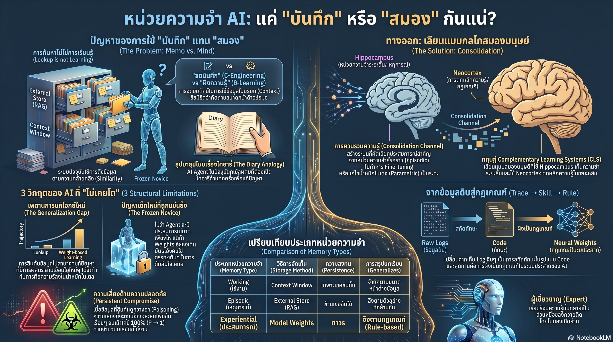

[กลับไปที่หน้าหลัก](../README.md)

สวัสดีครับเพื่อนๆ ที่ติดตามวงการ AI! วันนี้มาเรื่องที่ท้าทายสมมติฐานพื้นฐานของ AI Agent ในปัจจุบัน: "ยิ่งเพิ่ม Context และ RAG มากขึ้น AI ยิ่งฉลาดและมีประสบการณ์มากขึ้น" จากงานวิจัยที่พิสูจน์ว่าสิ่งที่เราเรียกว่า "หน่วยความจำ AI" ในปัจจุบันนั้น ไม่ใช่หน่วยความจำจริงๆ เลย แต่เป็นแค่ "การเปิดดูสมุดโน้ต" — และความสับสนนี้ไม่ใช่แค่เรื่องของนิยาม แต่คือขีดจำกัดทางคณิตศาสตร์ที่ RAG ยาวแค่ไหนก็ก้าวข้ามไม่ได้ครับ

คุณเคยสังเกตไหมครับว่า ถึงแม้เราจะให้ AI "จำ" ประวัติการสนทนาหลายพันครั้ง มี Vector Store ขนาดใหญ่ เพิ่ม Context Window เป็นล้านโทเคน แต่ AI ก็ยังไม่ได้ "ฉลาดขึ้น" ในแบบที่เราคาดหวัง — มันยังทำผิดพลาดแบบเดิมซ้ำๆ เหมือนไม่ได้เรียนรู้อะไรจากประสบการณ์เลยครับ?

คุณรู้ไหมครับว่า มีความแตกต่างทางคณิตศาสตร์ที่ขาดสะบั้นระหว่างระบบ Retrieval กับการเรียนรู้ผ่าน Weights: ระบบ RAG ต้องการข้อมูลเพิ่มขึ้นแบบยกกำลังสอง (k²) เพื่อครอบคลุมโดเมนใหม่ๆ ในขณะที่การเรียนรู้ผ่าน Weights ต้องการเพียง Linear (d) เพราะมันเรียนรู้ "กฎ" ไม่ใช่แค่เก็บ "ตัวอย่าง" ครับ?

และคุณเคยนึกไหมครับว่า ระบบ Agentic Memory ที่เก็บทุกอย่างลงฐานข้อมูลไม่ได้แค่ "ฉลาดขึ้นช้า" แต่ยังสร้างช่องโหว่ใหม่ที่งานวิจัย MINJA พบว่ามีอัตราความสำเร็จในการโจมตีถึง 98.2% เพราะคำสั่งพิษที่เข้าไปในฐานข้อมูลจะฝังอยู่ถาวรโดยที่เราตรวจสอบไม่ได้ครับ?

งานวิจัยนี้กำลังบอกว่า: เราไม่ได้สร้าง AI ที่ "เรียนรู้" — เรากำลังสร้าง AI ที่ "จดโน้ตได้มากขึ้นเรื่อยๆ" และนั่นเป็นคนละเรื่องกันอย่างสิ้นเชิงครับ

========================================

🤔 ทบทวนความเชื่อเดิมๆ: สิ่งที่เราคิดเกี่ยวกับหน่วยความจำและการเรียนรู้ของ AI

▪ "ยิ่งเพิ่ม Context Window และ RAG ให้ยาวขึ้น AI จะยิ่งฉลาดและมีประสบการณ์มากขึ้นตามข้อมูลที่มันเห็น — ปริมาณข้อมูลคือกุญแจ" → Sample Complexity Separation (Theorem 1) พิสูจน์ว่านี่คือทางตันครับ ระบบ Retrieval ต้องการข้อมูล k² เพื่อครอบคลุมโดเมนใหม่ ในขณะที่ Weight-based learning ต้องการเพียง d — Gap นี้ขยายใหญ่ขึ้นตลอดเวลาและไม่มีวันปิดได้ด้วยการเพิ่มข้อมูลเพียงอย่างเดียว

▪ "AI Agent ที่สะสมประสบการณ์เป็นพันๆ ครั้งและมี Vector Store ขนาดใหญ่จะค่อยๆ กลายเป็นผู้เชี่ยวชาญในโดเมนนั้น เพราะมันมี Reference ครบถ้วนกว่า" → Frozen Novice Problem พิสูจน์ตรงกันข้ามครับ ตราบใดที่ Weights ไม่ถูกปรับเปลี่ยน AI ยังคงเป็น "มือใหม่คนเดิมที่มีสมองชุดเดิม" แค่มีไดอารี่ที่หนาขึ้น ไม่ใช่ผู้เชี่ยวชาญที่เข้าใจ Deep Principles

▪ "ระบบ RAG และ Memory ที่ดีช่วยให้ AI ตอบได้ถูกต้องมากขึ้น และยิ่งใหญ่ขึ้น ยิ่งปลอดภัยกว่า เพราะมีบริบทครบถ้วนกว่า" → Persistent Memory Poisoning และ Auditability Gap เผยให้เห็นตรงกันข้ามครับ Vector Store ที่ใหญ่ขึ้นคือพื้นที่ที่ตรวจสอบได้น้อยลง งานวิจัย MINJA พบว่าการฉีดคำสั่งพิษผ่าน Memory มีอัตราความสำเร็จสูงถึง 98.2%

▪ "Sleep-time compute ที่ให้ AI สรุปและจัดระเบียบ Context ระหว่างที่ไม่ได้ใช้งาน (เช่นใน MemGPT) คือการแก้ปัญหา Learning ที่ขาดหายไป" → Sleep-time compute ยังคงเป็นแค่การ Rewrite Context ในสมุดโน้ตเล่มเดิม ไม่ได้เปลี่ยน θ (Weights) เลย เหมือนการจัดระเบียบชั้นวางหนังสือใหม่ แต่ไม่ได้ช่วยให้จำเนื้อหาหนังสือได้จริงๆ ครับ

ความจริงที่น่าคิดคือ: เรากำลังลงทุนมหาศาลในการทำให้ AI "จดโน้ต" ได้ดีขึ้น โดยไม่ได้ถามว่า "โน้ตที่ดีขึ้นจะทำให้ AI เรียนรู้ได้จริงไหม" — คำตอบคือไม่ครับ

========================================

🧠 พื้นฐานที่ต้องเข้าใจก่อน: Context (C) vs. Weights (θ), Sample Complexity Separation และ Generalization Gap

=== ความแตกต่างระหว่าง C (Context) และ θ (Weights) ===

[การเปลี่ยน C (Context) — สิ่งที่ RAG และ Memory ทำ]
▸ ป้อนข้อมูลเข้า Prompt หรือดึงจาก Vector Store
▸ เปรียบได้กับ: ยื่นสมุดโน้ตให้อ่านก่อนตอบคำถาม
▸ ข้อจำกัด: ตอบได้เฉพาะสิ่งที่ "เคยเห็นแล้ว" ในฐานข้อมูลครับ

[การเปลี่ยน θ (Weights) — สิ่งที่การเรียนรู้แท้จริงทำ]
▸ ปรับเปลี่ยนน้ำหนักภายในโครงข่ายประสาทผ่านการฝึก
▸ เปรียบได้กับ: เรียนรู้จน "เข้าเนื้อ" จนไม่ต้องเปิดหนังสือ
▸ ความสามารถพิเศษ: Generalization — สร้างคำตอบสำหรับสิ่งที่ "ไม่เคยเห็น" ผ่านกฎเกณฑ์ที่สรุปได้เองครับ

ความต่างสำคัญที่สุด: Recombination — ถ้าฉันรู้กฎ "บวก" และ "คูณ" แยกกัน ฉันสามารถแก้สมการที่ผสมทั้งสองได้โดยไม่ต้องเคยเห็นสมการนั้นมาก่อน แต่ระบบ Retrieval ต้องเคยเห็น "ตัวอย่างของสมการนั้นโดยตรง" ถึงจะตอบได้ครับ

=== Sample Complexity Separation (Theorem 1) คืออะไร? ===

Theorem 1 พิสูจน์ว่ามีความต่างทางคณิตศาสตร์ที่หนีไม่พ้นระหว่างสองแนวทาง:

Retrieval-based: ต้องการตัวอย่างข้อมูล k² เพื่อครอบคลุม Domain ใหม่ เพราะต้องเก็บตัวอย่างทุกความเป็นไปได้
Weight-based: ต้องการเพียง d (linear) เพราะเรียนรู้ "กฎ" ที่ Generalize ได้เอง

เมื่อ k เพิ่มขึ้น Gap จะขยายใหญ่ขึ้นแบบยกกำลัง — ไม่มีทางปิดได้ด้วยข้อมูลเพิ่มเติมครับ

========================================

1) Category Error: เราเรียก "การเปิดดูสมุดโน้ต" ว่า "ความจำ" มานานเกินไปแล้ว

งานวิจัยชี้ให้เห็น Category Error ที่ฝังรากลึกในวงการ AI Agent ครับ: เราเรียกระบบ Retrieval ว่า "Memory" เรียกการดึง Context ว่า "Experience" และเรียก Vector Store ว่า "Knowledge Base" ทั้งที่ในทางคณิตศาสตร์และทางปฏิบัติ สิ่งเหล่านี้คือคนละสิ่งกับความจำและความรู้ที่แท้จริง

งานวิจัยใช้ประโยคที่ตรงไปตรงมาครับ: "Treating a memo as a mind — การปฏิบัติกับสมุดจดบันทึกราวกับว่ามันคือจิตใจ"

เปรียบได้กับความต่างระหว่างแพทย์สองคน:

แพทย์คนแรก: ทุกครั้งที่ตรวจผู้ป่วย เปิดตำราดูก่อนทุกครั้ง ตอบได้ถูกต้องก็ต่อเมื่อตำราครอบคลุมอาการนั้น

แพทย์คนที่สอง: เรียนรู้ Physiology, Biochemistry, และ Pathology จนเข้าใจกลไกพื้นฐาน สามารถ "คิด" และ "ประยุกต์" กับอาการที่ไม่เคยเห็นในตำราได้ครับ

ระบบ AI ส่วนใหญ่ในปัจจุบันคือแพทย์คนแรก ที่มีตำราหนาขึ้นเรื่อยๆ แต่ยังไม่สามารถ "คิด" ได้โดยไม่เปิดตำราครับ

========================================

2) Generalization Gap: เพดานที่ Context Window ยาวแค่ไหนก็ทลายไม่ได้

นี่คือส่วนที่ท้าทายความเชื่อที่ฝังรากลึกที่สุดในวงการครับ Sample Complexity Separation พิสูจน์ว่ามีเพดานทางคณิตศาสตร์ที่ระบบ Retrieval ไม่สามารถก้าวข้ามได้ไม่ว่าจะเพิ่มข้อมูลมากแค่ไหน

ลองนึกภาพการสอนคณิตศาสตร์สองแบบ:

แบบที่ 1 (Retrieval): ให้นักเรียนท่องจำคำตอบของโจทย์ทุกข้อที่เคยออกในข้อสอบ ยิ่งมีโจทย์เก่าเยอะ ยิ่งทำได้ดี แต่ถ้าข้อสอบออกโจทย์ใหม่ที่ผสมหลักการที่ไม่เคยผสมกันมาก่อน นักเรียนจะทำไม่ได้เลยครับ

แบบที่ 2 (Weight-based): สอนให้นักเรียนเข้าใจ "ทำไม" ไม่ใช่แค่ "อะไร" เมื่อเข้าใจกฎพื้นฐานแล้ว นักเรียนสามารถแก้โจทย์ใหม่ที่ผสมหลักการหลายอย่างได้ แม้ไม่เคยเห็นโจทย์แบบนั้นมาก่อนครับ

ในทางเทคนิค สิ่งที่ Retrieval ทำไม่ได้คือ Compositionally Novel Tasks — โจทย์ที่ต้องผสมกฎหลายอย่างในรูปแบบใหม่ เพราะมันต้องการตัวอย่างของรูปแบบนั้นโดยตรง แต่ Weight-based learning Generalize ข้ามรูปแบบได้เพราะมันเรียนรู้กฎ ไม่ใช่ตัวอย่างครับ

========================================

3) Frozen Novice Problem: 10 ปีของประสบการณ์แต่ยังเป็นมือใหม่คนเดิม

นี่คือปรากฏการณ์ที่สรุปปัญหาของ AI Agent ในปัจจุบันได้ชัดเจนที่สุดครับ

เปรียบได้กับพนักงานใหม่ที่บันทึกทุกสิ่งที่เรียนรู้ในองค์กรลงในไดอารี่ 1,000 เล่มตลอด 10 ปี แต่ทุกเช้าที่ตื่นมา เขาลืมทุกอย่างและต้องกางไดอารี่อ่านใหม่ตั้งแต่ต้น ไม่ว่าจะเขียนโน้ตไปมากแค่ไหน เขาก็ยังเป็น "มือใหม่วันแรก" คนเดิมอยู่ครับ

ทำไม Structural Reorganization ถึงสำคัญ? เพราะความเชี่ยวชาญที่แท้จริงไม่ใช่แค่การมีข้อมูลมากขึ้น แต่คือการมองโจทย์แตกต่างออกไปครับ:

มือใหม่ (Novice): มองโจทย์ฟิสิกส์ว่า "เป็นเรื่องพื้นเอียง" — เห็น Surface Feature
ผู้เชี่ยวชาญ (Expert): มองโจทย์เดียวกันว่า "เป็นเรื่องกฎการอนุรักษ์พลังงาน" — เห็น Deep Principle

การเปลี่ยนจาก Novice เป็น Expert ไม่ได้เกิดจากการมีตัวอย่างโจทย์เพิ่มขึ้น แต่เกิดจากการปรับโครงสร้างความเข้าใจใหม่ — และนั่นต้องการการเปลี่ยน θ ไม่ใช่แค่การเพิ่ม Vector ครับ

AI Agent ที่มี Frozen Weights ไม่มีวันเปลี่ยนวิธีที่มัน "มอง" โจทย์ได้ เพราะวิธีการมองนั้นถูกเข้ารหัสไว้ใน Weights แล้วครับ

========================================

4) Persistent Memory Poisoning: เมื่อสมุดโน้ตที่ใหญ่ขึ้นกลายเป็นระเบิดเวลา

ปัญหาของ "จดโน้ตได้มากขึ้น" ไม่ได้มีแค่เรื่องความฉลาดครับ แต่ยังสร้างช่องโหว่ด้านความปลอดภัยที่รุนแรงกว่าระบบ Prompt Injection แบบเดิมมาก

ใน Prompt Injection ทั่วไป: คำสั่งพิษมีผลแค่ในการสนทนานั้น เมื่อ Session จบ ผลกระทบก็จบตามไปด้วย

ใน Agentic Memory ที่เก็บทุกอย่างถาวร: คำสั่งพิษที่เข้าไปอยู่ใน Vector Store จะฝังตัวอยู่ตลอดไป กลายเป็น Persistent Memory Poisoning ที่มีผลกระทบในทุก Session ถัดไปครับ

งานวิจัย MINJA พบว่า: อัตราความสำเร็จของการโจมตีผ่านระบบ Memory สูงถึง 98.2% เทียบกับ Prompt Injection ทั่วไปที่ป้องกันได้ง่ายกว่ามาก

Auditability Gap — ปัญหาที่ใหญ่กว่า: เราสามารถตรวจสอบความผิดปกติใน Model Weights ผ่านการวิเคราะห์ Activation ได้ แต่เราไม่สามารถตรวจสอบ Vector Store ที่มีหลักล้าน Entries ได้อย่างมีประสิทธิภาพว่ามีคำสั่งพิษฝังตัวอยู่ที่ไหนบ้าง

เปรียบได้กับห้องน้ำสาธารณะ: ถ้ามีคนวาดภาพลามกไว้บนผนัง เราเห็นและลบออกได้ แต่ถ้ามีคนแอบเติมสารพิษลงในอ่างน้ำ พร้อมปลอมเป็นน้ำสะอาด เราจะรู้ตัวก็ต่อเมื่อมีคนใช้แล้วครับ

========================================

5) Consolidation Channel: จาก Hippocampus สู่ Neocortex — บทเรียนจากสมองมนุษย์

หนทางออกที่งานวิจัยชี้ไม่ใช่การสร้างสมุดโน้ตที่ใหญ่ขึ้น แต่คือการสร้าง "Consolidation Channel" — ช่องทางที่ทำให้ AI กลั่นกรองประสบการณ์จาก Context เข้าสู่ Weights ได้ เหมือนการนอนหลับของมนุษย์ครับ

ทำไมต้องเลียนแบบสมองมนุษย์: ในสมองมนุษย์ Hippocampus เก็บประสบการณ์ระยะสั้น (คล้าย Context Window) และระหว่างการนอนหลับ ประสบการณ์สำคัญจะถูก "กลั่นกรอง" เข้าสู่ Neocortex (คล้าย Weights) กลายเป็นความรู้ระยะยาว

Sleep-time Compute (เช่นใน MemGPT) เป็นก้าวแรกที่ถูกทิศทางครับ แต่ยังไม่ถึงจุดหมาย เพราะมันยัง Rewrite Context ไม่ได้ Update Weights จริงๆ

สิ่งที่ต้องการจริงๆ คือ Continual Learning ที่:
— เปลี่ยนประสบการณ์จาก Vector Store ให้กลายเป็น Weight Updates
— ทำได้โดยไม่เกิด Catastrophic Forgetting (ลืมสิ่งที่รู้อยู่แล้วเมื่อเรียนสิ่งใหม่)
— มี Structural Reorganization เพื่อเปลี่ยนวิธีที่ AI "มองโจทย์" ไปตามประสบการณ์ที่สะสมครับ

========================================

🎯 สรุป: ปัญหาของ AI Memory ในปัจจุบันไม่ใช่เรื่องปริมาณข้อมูล แต่คือสถาปัตยกรรมการเรียนรู้

งานวิจัยนี้พิสูจน์สิ่งสำคัญ 5 ประการครับ:

หนึ่ง — Category Error ที่แพร่หลาย: เรียก "Retrieval" ว่า "Memory" และเรียก "Context" ว่า "Experience" สร้างความเข้าใจผิดที่นำไปสู่การลงทุนผิดทิศทาง "Treating a memo as a mind" ครับ

สอง — Sample Complexity Separation (Theorem 1): Retrieval ต้องการ k² data ในขณะที่ Weight-based ต้องการเพียง d — Gap นี้ขยายใหญ่ขึ้นตลอดเวลาและปิดไม่ได้ด้วยการเพิ่มข้อมูล

สาม — Frozen Novice Problem: AI ที่มี Frozen Weights ไม่มีวันเปลี่ยนจากมือใหม่เป็นผู้เชี่ยวชาญได้ ต่อให้มี Vector Store ขนาดใหญ่แค่ไหน เพราะ Structural Reorganization ต้องการการเปลี่ยน θ ครับ

สี่ — Persistent Memory Poisoning: MINJA พบ 98.2% Success Rate บวกกับ Auditability Gap ที่ Vector Store ขนาดใหญ่ตรวจสอบไม่ได้ — ระบบ Memory ที่ใหญ่ขึ้นคือพื้นที่โจมตีที่ใหญ่ขึ้น

ห้า — Consolidation Channel คือทิศทางที่ต้องการ: การเลียนแบบ Hippocampus → Neocortex Consolidation ผ่าน Continual Learning ที่ปรับ Weights จาก Experience จริงๆ ไม่ใช่แค่ Rewrite Context ครับ

เป้าหมายสำหรับวงการ: เลิกวัดแค่ว่า AI "จำได้" มากแค่ไหน (Recall) แล้วหันมาวัดว่า AI "เรียนรู้" และแก้โจทย์ใหม่จากประสบการณ์เดิมได้ดีขึ้นหรือไม่ (Compositional Generalization over Time) ครับ

========================================

💬 คำถามชวนคิด:

ถ้า Sample Complexity Separation พิสูจน์ว่า RAG มีเพดานทางคณิตศาสตร์ที่ก้าวข้ามไม่ได้ในงานที่ต้องการ Compositional Generalization คุณคิดว่า Use Case ไหนบ้างที่ RAG ยังคงเป็น "ทางออกที่เหมาะสม" และ Use Case ไหนบ้างที่เราต้องการ Continual Learning จริงๆ ครับ?

และในฐานะผู้ใช้งานหรือนักพัฒนา AI ถ้าระบบ Agentic Memory ในปัจจุบันมีความเสี่ยงด้าน Persistent Memory Poisoning ที่ตรวจสอบยาก คุณจะออกแบบกลไกอะไรเพื่อสร้าง "ระบบภูมิคุ้มกัน" ให้กับ Memory Store ของ AI Agent ครับ?

========================================

References:
- "Memory, Illusions, and the Limits of RAG" (2025) — งานวิจัยด้าน AI Memory System
- Sample Complexity Separation (Theorem 1): Retrieval k² vs. Weight-based d
- Frozen Novice Problem: Structural Reorganization ต้องการ Weight Update ไม่ใช่แค่ Context Expansion
- Category Error: C (Context/RAG) ≠ θ (Weights) — "Treating a memo as a mind"
- MINJA Research: 98.2% Success Rate ของ Memory Poisoning Attack
- Auditability Gap: Weights วิเคราะห์ผ่าน Activation Analysis ได้ แต่ Vector Store ตรวจสอบไม่ได้อย่างมีประสิทธิภาพ
- Generalization Gap: Compositionally Novel Tasks ที่ Retrieval ทำไม่ได้
- Hippocampus → Neocortex Consolidation: แบบจำลองจากสมองมนุษย์สำหรับ Continual Learning
- Sleep-time Compute (MemGPT): ก้าวแรกที่ถูกทิศทางแต่ยังไม่ Update Weights จริง

========================================

ความแตกต่างระหว่าง "การมีห้องสมุดขนาดใหญ่" กับ "การเป็นนักวิทยาศาสตร์ที่เชี่ยวชาญ" ไม่ได้อยู่ที่จำนวนหนังสือ แต่อยู่ที่ว่าใครสามารถค้นพบสิ่งที่ยังไม่มีอยู่ในหนังสือเล่มใดได้ครับ 📚

#AImemory #RAGlimits #ContinualLearning #FrozenNovice #WeightUpdate #SampleComplexity #MemoryPoisoning #MINJA #AIAgent #VectorStore #GeneralizationGap #HippocampusNeocortex #AIAlignment #LLM #DeepLearning #AIResearch #AIThailand
