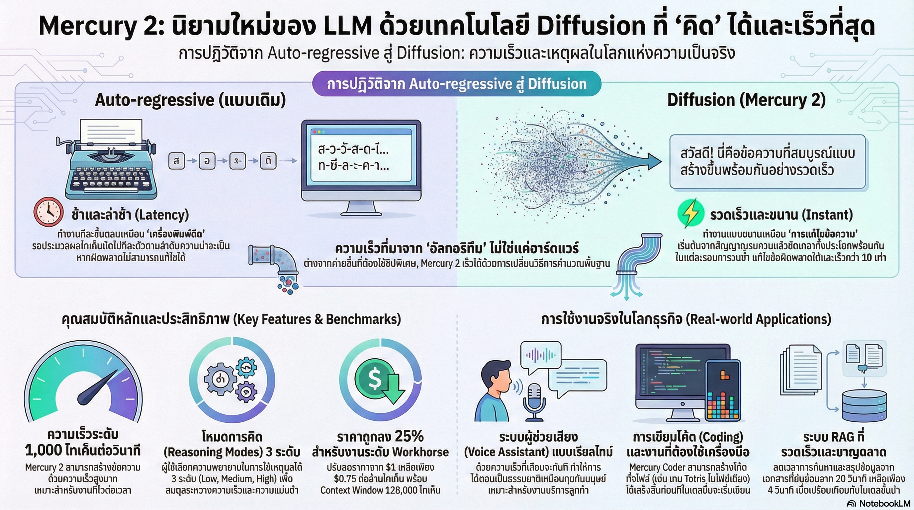

[กลับไปที่หน้าหลัก](../README.md)

สวัสดีครับเพื่อนๆ! วันนี้เรามาคุยเรื่องที่น่าตื่นเต้นมากๆ เกี่ยวกับ AI ที่กำลังจะเปลี่ยนโลกกันครับ นั่นก็คือ Mercury 2!

คุณเคยสังเกตไหมครับว่า เวลาใช้ ChatGPT, Gemini หรือ Claude มันจะค่อยๆ พิมพ์คำออกมาทีละตัวอักษร เหมือนคนกำลังพิมพ์ เห็นคำโผล่มาทีละตัวๆ?

นั่นไม่ใช่แค่ลูกเล่นการแสดงผล แต่เป็นข้อจำกัดทางสถาปัตยกรรมของ AI แบบ "Auto-regressive" ที่ต้องคิดและพิมพ์คำทีละคำตามลำดับ!

แต่ล่าสุด Inception Labs ได้สร้างปรากฏการณ์ใหม่ด้วยการเปิดตัว Mercury 2 โมเดลภาษาเชิงพาณิชย์รุ่นแรกของโลกที่ใช้เทคโนโลยี "Diffusion" ซึ่งเปลี่ยนวิธีคิดจากการ "เดาคำถัดไป" มาเป็นการ "ขัดเกลาทั้งประโยคพร้อมกัน"!

ผลลัพธ์? เร็วกว่าโมเดลทั่วไปถึง 10 เท่า และที่สำคัญที่สุดคือ มันเป็น Diffusion LLM รุ่นแรกของโลกที่สามารถ "คิด" (Reasoning) ได้!

วันนี้เรามาดูกันว่า Mercury 2 ทำงานยังไง และมันจะเปลี่ยนโลก AI ยังไงครับ

========================================

🤔 ทบทวนพื้นฐาน: AI ทำงานยังไงกันแน่?

ก่อนที่เราจะไปดู Mercury 2 มาทำความเข้าใจพื้นฐานกันก่อนนะครับ

=== Auto-regressive Models คืออะไร? ===

Auto-regressive = การทำงานแบบทีละขั้นตอน ตามลำดับ

ตัวอย่าง AI ที่เป็น Auto-regressive:
▸ ChatGPT (GPT-4)
▸ Google Gemini
▸ Claude
▸ AI ส่วนใหญ่ที่เราใช้กัน

วิธีทำงาน:

ขั้นที่ 1: รับคำถาม
"เขียนเรื่องสั้นให้หน่อย"

ขั้นที่ 2: คิดคำแรก
▸ เลือกคำแรกที่เหมาะสม เช่น "กาล"
▸ พิมพ์ "กาล"

ขั้นที่ 3: คิดคำที่สอง
▸ ดูคำแรก "กาล" แล้วคิดว่าคำถัดไปควรเป็น "ครั้ง"
▸ พิมพ์ "กาล ครั้ง"

ขั้นที่ 4: คิดคำที่สาม
▸ ดูคำที่ผ่านมา "กาล ครั้ง" แล้วคิดว่าควรเป็น "หนึ่ง"
▸ พิมพ์ "กาล ครั้ง หนึ่ง"

และทำแบบนี้ต่อไปเรื่อยๆ จนจบประโยค!

เปรียบเทียบ: เหมือนเครื่องพิมพ์ดีด
▸ พิมพ์ทีละตัวอักษร
▸ พิมพ์ผิดแล้วแก้ไม่ได้ (ถาวร)
▸ ต้องพิมพ์ไปตามลำดับจากซ้ายไปขวา

ปัญหา:
▸ ช้า! ต้องคิดทีละคำ
▸ ถ้าผิดแต่แรก จะผิดต่อไปเรื่อยๆ
▸ ไม่สามารถย้อนกลับไปแก้ไขได้

=== Diffusion Models คืออะไร? ===

Diffusion = การขัดเกลาจากความสับสนไปสู่ความชัดเจน

ตัวอย่าง Diffusion ที่เราคุ้นเคย:
▸ Stable Diffusion (สร้างภาพ)
▸ Midjourney (สร้างภาพ)
▸ DALL-E (สร้างภาพ)

วิธีทำงาน (ของ Diffusion ทั่วไป):

ขั้นที่ 1: เริ่มจากความสับสน (Noise)
▸ สุ่มภาพที่เป็นจุดสีสับสนๆ

ขั้นที่ 2: ขัดเกลาทีละนิด
▸ ปรับภาพให้ชัดขึ้นทีละนิด
▸ ทำหลายรอบ (เช่น 20 รอบ)

ขั้นที่ 3: ได้ภาพที่สวยงาม
▸ จากความสับสนกลายเป็นภาพที่ชัดเจนและสวยงาม

เปรียบเทียบ: เหมือนการแกะสลักหิน
▸ เริ่มจากก้อนหินที่เป็นรูปร่างคร่าวๆ
▸ ค่อยๆ สลักทีละนิด จนได้รูปที่สวยงาม
▸ สามารถแก้ไขรายละเอียดได้ระหว่างทาง

ข้อดี:
▸ สามารถแก้ไขได้ระหว่างทาง
▸ ทำหลายส่วนพร้อมกันได้ (Parallel)
▸ คุณภาพดี

=== Diffusion สำหรับข้อความ? ===

ปกติ Diffusion ใช้กับภาพ แต่ถ้าเอามาใช้กับข้อความล่ะ?

[ปัญหาเดิม]
▸ Diffusion มักใช้กับภาพหรือวิดีโอ
▸ เชื่อกันว่าใช้กับข้อความไม่ได้ เพราะภาษามีตรรกะที่ซับซ้อน

[Mercury 2 ทำลายความเชื่อนี้!]
▸ เป็น Diffusion LLM รุ่นแรกของโลกที่ทำงานได้จริง
▸ และยังสามารถ "คิด" (Reasoning) ได้อีกด้วย!

========================================

1. ⚡ จากเครื่องพิมพ์ดีดสู่โปรแกรมแก้ไข: การเปลี่ยนสถาปัตยกรรม

มาดูความแตกต่างระหว่าง Auto-regressive กับ Diffusion กันครับ

=== Auto-regressive (GPT, Gemini, Claude) ===

วิธีทำงาน: พิมพ์ทีละคำตามลำดับ

ตัวอย่าง:
▸ คำที่ 1: "กาล"
▸ คำที่ 2: "ครั้ง"
▸ คำที่ 3: "หนึ่ง"
▸ ...

เปรียบเทียบ: เครื่องพิมพ์ดีด (Typewriter)
▸ พิมพ์ทีละตัวอักษร
▸ ถ้าพิมพ์ผิดแก้ไขไม่ได้ (ถาวร)
▸ ต้องทำตามลำดับ

ข้อเสีย:
▸ ช้า
▸ ถ้าผิดตั้งแต่แรก จะผิดต่อไปเรื่อยๆ
▸ ไม่สามารถย้อนกลับไปแก้ไขได้

=== Diffusion (Mercury 2) ===

วิธีทำงาน: ขัดเกลาทั้งประโยคพร้อมกัน

ตัวอย่าง:

รอบที่ 1: "xxxxx xxxxx xxxxx" (ความสับสน)
รอบที่ 2: "กxล คxัง หxึ่ง" (เริ่มชัดขึ้น)
รอบที่ 3: "กาล ครั้ง หนึ่ง" (ชัดเจนแล้ว)

เปรียบเทียบ: โปรแกรมแก้ไขข้อความ (Text Editor)
▸ เขียนทั้งประโยคแบบร่างๆ ก่อน
▸ ค่อยๆ แก้ไขทีละนิด
▸ สามารถย้อนกลับไปแก้ไขได้

ข้อดี:
▸ เร็วมาก! ทำหลายส่วนพร้อมกัน (Parallel)
▸ สามารถแก้ไขได้ระหว่างทาง
▸ คุณภาพดีกว่า

"Auto-regressive models เปรียบเสมือนการทำงานกับเครื่องพิมพ์ดีด ทุกความผิดพลาดนั้นถาวรและแก้ไขไม่ได้ แต่ Diffusion เปรียบเสมือนโปรแกรมแก้ไขข้อความ ที่คุณสามารถย้อนเวลากลับไปแก้ไขข้อผิดพลาดระหว่างทางได้"

=== Trade-off ที่ต้องเข้าใจ ===

ถึงแม้ Diffusion จะเร็วกว่า แต่ก็มีข้อแลกเปลี่ยน:

[Time to First Token (TTFT)]
▸ เวลาที่ใช้จนกระทั่งเริ่มพ่นคำแรกออกมา

Auto-regressive:
▸ TTFT เร็ว เห็นคำแรกเร็ว
▸ แต่คำต่อไปจะช้า

Diffusion (Mercury 2):
▸ TTFT อาจจะช้ากว่าเล็กน้อย (ต้องประมวลผล Noise ก่อน)
▸ แต่เมื่อเริ่มแล้ว พ่นผลลัพธ์ออกมาเร็วมาก ทิ้งห่างคู่แข่ง!

เปรียบเทียบ:
▸ Auto-regressive = นักวิ่งระยะสั้น เริ่มเร็ว แต่เดินก่อนถึงเส้นชัย
▸ Diffusion = นักวิ่งระยะยาว เริ่มช้าหน่อย แต่พอวิ่งเต็มสปีดแล้ววิ่งทิ้งห่างมาก!

========================================

2. 🚄 ทะลุ 1,000 Tokens/Sec: ความเร็วที่มาจากอัลกอริทึม

สิ่งที่น่าทึ่งที่สุดของ Mercury 2 คือความเร็ว!

=== ความเร็วที่น่าทึ่ง ===

Mercury Coder Mini:
▸ ความเร็ว: 1,109 tokens/sec
▸ พิมพ์ได้ 1,109 คำต่อวินาที!

Mercury Coder Small:
▸ ความเร็ว: 737 tokens/sec
▸ พิมพ์ได้ 737 คำต่อวินาที!

เปรียบเทียบกับโมเดลอื่น:
▸ GPT-4o mini: ช้ากว่า Mercury ถึง 10 เท่า
▸ Gemini Flash: ช้ากว่า Mercury ถึง 10 เท่า

นี่หมายความว่า Mercury เร็วกว่า 10 เท่า!

=== มาจากอะไร? ไม่ใช่ฮาร์ดแวร์แพง! ===

สิ่งที่น่าสนใจคือ ความเร็วของ Mercury 2 ไม่ได้มาจากฮาร์ดแวร์พิเศษที่แพง!

[โมเดลอื่นที่เร็ว]
▸ ใช้ชิปพิเศษจาก Cerebras (แพงมาก)
▸ ใช้ฮาร์ดแวร์เฉพาะทาง

[Mercury 2]
▸ ใช้ฮาร์ดแวร์มาตรฐาน NVIDIA H100 (ธรรมดา)
▸ แต่ใช้ "Algorithmic Innovation" (นวัตกรรมอัลกอริทึม)
▸ เร็วเพราะวิธีคิดฉลาดกว่า!

สรุป: ฉลาดกว่า ไม่ใช่แพงกว่า!

=== ตัวอย่างการใช้งาน ===

สมมติคุณต้องการสรุปเอกสาร 10 หน้า

[GPT-4o mini]
▸ ใช้เวลา: 10 วินาที
▸ พิมพ์ช้าๆ ทีละคำ

[Mercury 2]
▸ ใช้เวลา: 1 วินาที
▸ พิมพ์เร็ว! เห็นผลลัพธ์ทันที

ประหยัดเวลา 9 วินาที!

========================================

3. 🧠 Thinking Diffusion: ครั้งแรกของโลกที่ Diffusion คิดได้!

สิ่งที่น่าทึ่งที่สุดคือ Mercury 2 สามารถ "คิด" ได้!

=== ความเชื่อเดิม ===

เดิมที Diffusion Model:
▸ ใช้กับภาพหรือวิดีโอได้ดี
▸ แต่เชื่อว่าใช้กับข้อความไม่ได้
▸ เพราะภาษามีตรรกะที่ซับซ้อน ต้อง "คิด"

=== Mercury 2 พิสูจน์ว่าผิด! ===

Mercury 2:
▸ เป็น Diffusion LLM รุ่นแรกของโลกที่สามารถ "คิด" (Reasoning) ได้!
▸ มีฐานข้อมูลความรู้ล่าสุดถึง มกราคม 2025

=== โหมดการทำงาน 2 แบบ ===

คุณสามารถเลือกได้ว่าต้องการความเร็วหรือคุณภาพ:

[Instant Mode] ← เน้นความเร็วสูงสุด

ลักษณะ:
▸ ปิดระบบการคิด
▸ ตอบเร็วที่สุด

เหมาะกับ:
▸ งานง่ายๆ ที่ต้องการคำตอบทันที
▸ เช่น สรุปข้อความสั้นๆ, แปลภาษา

[High Reasoning Mode] ← เน้นคุณภาพ

ลักษณะ:
▸ เปิดระบบการใช้เหตุผลเต็มรูปแบบ
▸ สามารถปรับระดับ Effort ใน API ได้ 3 ระดับ: Low, Medium, High

เหมาะกับ:
▸ งานที่ต้องคิดวิเคราะห์
▸ เช่น เขียนโค้ด, แก้ปัญหาซับซ้อน

=== กรณีศึกษา 1: Inverted Tetris ===

โจทย์: เขียนโค้ดเกม Tetris ที่บล็อกวิ่ง "ขึ้น" แทนที่จะ "ตกลงมา"

นี่เป็นโจทย์ที่ต้องคิดมาก เพราะ:
▸ Tetris ปกติบล็อกตกลงมา
▸ แต่ต้องเขียนให้บล็อกวิ่งขึ้น (ตรงกันข้าม)
▸ ต้องเปลี่ยนทิศทางแรงโน้มถ่วง

[Mercury 2 ในโหมด High Reasoning]
▸ เขียนโค้ด HTML ได้สมบูรณ์
▸ มีตรรกะที่ถูกต้อง (บล็อกวิ่งขึ้นจริงๆ)
▸ ใช้เวลาเพียงเสี้ยววินาที!

สรุป: คิดได้และคิดเร็ว!

=== กรณีศึกษา 2: Instruction Following ===

โจทย์: เขียนเรื่องสั้นที่แต่ละประโยคต้องมีความยาวเพิ่มขึ้นทีละ 1 คำจนถึง 20 คำ แล้ววนกลับมา

นี่เป็นโจทย์ที่ยาก เพราะต้อง:
▸ นับคำในแต่ละประโยค
▸ ประโยคแรกมี 1 คำ, ประโยคที่สองมี 2 คำ, ... ประโยคที่ 20 มี 20 คำ
▸ แล้ววนกลับมา ประโยคที่ 21 มี 19 คำ, ประโยคที่ 22 มี 18 คำ, ...
▸ ทั้งหมดต้องเป็นเรื่องเดียวกัน มีความต่อเนื่อง

[Mercury 2]
▸ ทำได้แม่นยำ!
▸ นับคำถูกทุกประโยค
▸ เรื่องมีความต่อเนื่อง มีบริบท (Coherency)

สรุป: รักษาบริบทและทำตามเงื่อนไขซับซ้อนได้!

========================================

4. 🤖 Workhorse Model: AI สำหรับงาน Agentic

Inception Labs วางตำแหน่ง Mercury 2 ให้เป็น "Workhorse Model" หรือโมเดลจอมพลัง!

=== Workhorse Model คืออะไร? ===

Workhorse = ม้างาน ที่ทำงานหนักได้

Workhorse Model = โมเดลที่เน้นการใช้งานจริง

ลักษณะ:
▸ เน้นการใช้งานจริง (Production-ready)
▸ เร็ว มั่นคง ทนทาน
▸ ไม่ได้เน้นความฉลาดรอบตัวที่สุดในโลก แต่เน้นทำงานได้จริง

เปรียบเทียบ:

Frontier Model (เช่น GPT-4, Claude Opus):
▸ เน้นความฉลาดรอบตัว
▸ ตอบได้ทุกเรื่อง
▸ แต่ช้า และแพง

Workhorse Model (Mercury 2):
▸ เน้นความเร็วและประสิทธิภาพ
▸ ทำงานเฉพาะทางได้ดีมาก
▸ เร็ว และคุ้มค่า

=== ทำไมความเร็วถึงสำคัญกับ AI Agent? ===

AI Agent คือ AI ที่ทำงานหลายขั้นตอน เช่น:

ตัวอย่าง: RAG Agent (Retrieval-Augmented Generation)

ขั้นตอนการทำงาน:
1. รับคำถามจากผู้ใช้
2. ค้นหาข้อมูลที่เกี่ยวข้อง
3. อ่านและเข้าใจข้อมูล
4. สรุปข้อมูล
5. ตอบคำถาม

ถ้า AI ช้า:
▸ ขั้นตอน 1: รอ 3 วินาที
▸ ขั้นตอน 2: รอ 4 วินาที
▸ ขั้นตอน 3: รอ 5 วินาที
▸ ขั้นตอน 4: รอ 4 วินาที
▸ ขั้นตอน 5: รอ 4 วินาที
▸ รวม: 20 วินาที! ดูเหมือนระบบ "ค้าง"

ถ้าใช้ Mercury 2:
▸ ขั้นตอน 1: รอ 0.5 วินาที
▸ ขั้นตอน 2: รอ 0.5 วินาที
▸ ขั้นตอน 3: รอ 1 วินาที
▸ ขั้นตอน 4: รอ 1 วินาที
▸ ขั้นตอน 5: รอ 1 วินาที
▸ รวม: 4 วินาที! เร็วกว่า 5 เท่า!

=== กรณีศึกษา: RAG Agent ===

เปรียบเทียบจริง:

[Gemini 1.5 Flash]
▸ เวลารวม: 17 วินาที
▸ รอนาน ผู้ใช้เบื่อ

[Mercury 2]
▸ เวลารวม: 4 วินาที
▸ เร็ว! ผู้ใช้พอใจ

ประหยัดเวลา 13 วินาที!

=== กรณีศึกษา: Real-time Voice Assistant ===

ตัวอย่าง: ระบบ Call Center อัจฉริยะ

องค์ประกอบ:
▸ Speech-to-Text (แปลงเสียงเป็นข้อความ)
▸ Mercury 2 (สมองส่วนกลาง คิดและตัดสินใจ)
▸ Text-to-Speech (แปลงข้อความเป็นเสียง)

ถ้า AI ช้า:
▸ ลูกค้าพูดเสร็จ
▸ รอ 5 วินาที AI คิด
▸ ลูกค้า: "หรือเครื่องเสีย?"
▸ ประสบการณ์แย่

ถ้าใช้ Mercury 2:
▸ ลูกค้าพูดเสร็จ
▸ AI ตอบทันที (ภายใน 1 วินาที)
▸ ลูกค้า: "เร็วจัง! เหมือนคุยกับคนจริงๆ"
▸ ประสบการณ์ดี!

สรุป: ความเร็วสำคัญมากสำหรับ Real-time Applications!

========================================

5. 💰 ประสิทธิภาพที่คุ้มค่า: ราคาและคุณสมบัติ

มาดูรายละเอียดของ Mercury 2 กันครับ

=== คุณสมบัติและราคา ===

[ความเร็วสูงสุด]
▸ 1,100+ Tokens ต่อวินาที
▸ เร็วที่สุดในตลาด!

[ราคา Output]
▸ $0.75 ต่อ 1 ล้าน Tokens
▸ ลดจากเดิม $1.00
▸ ลดราคา 25%!

[Context Window]
▸ 128,000 Tokens
▸ อ่านเอกสารยาวๆ ได้

[ความสามารถพิเศษ]
▸ Web Search (ค้นหาข้อมูลในอินเทอร์เน็ต)
▸ Tool Calling (เรียกใช้เครื่องมือภายนอก)
▸ Multi-token Parallel Prediction (ทำนายหลายคำพร้อมกัน)

[Knowledge Cutoff]
▸ มกราคม 2025
▸ ข้อมูลใหม่ล่าสุด!

=== เปรียบเทียบกับคู่แข่ง ===

[GPT-4o mini]
▸ ความเร็ว: ~100 tokens/sec
▸ ราคา: $0.60 ต่อ 1 ล้าน tokens (ถูกกว่า)
▸ แต่ช้ากว่ามาก (10 เท่า!)

[Gemini Flash]
▸ ความเร็ว: ~150 tokens/sec
▸ ราคา: $0.30 ต่อ 1 ล้าน tokens (ถูกกว่า)
▸ แต่ช้ากว่ามาก (7 เท่า!)

[Mercury 2]
▸ ความเร็ว: 1,100+ tokens/sec (เร็วที่สุด!)
▸ ราคา: $0.75 ต่อ 1 ล้าน tokens (กลางๆ)
▸ คุ้มค่า! เพราะเร็วมาก

สรุป: จ่ายเพิ่มหน่อย แต่ได้ความเร็วเพิ่มมาก คุ้มค่า!

========================================

สรุป: อนาคตที่ความเร็วไม่ใช่ข้อจำกัด

หลังจากที่เราได้เห็นรายละเอียดของ Mercury 2 แล้ว มาสรุปกันครับ

=== สิ่งที่เราได้เรียนรู้ ===

[1] การเปลี่ยนสถาปัตยกรรม
▸ จาก Auto-regressive (เครื่องพิมพ์ดีด)
▸ ไป Diffusion (โปรแกรมแก้ไขข้อความ)
▸ เร็วกว่า แก้ไขได้

[2] ความเร็วที่น่าทึ่ง
▸ 1,100+ tokens/sec
▸ เร็วกว่าคู่แข่งถึง 10 เท่า
▸ มาจากอัลกอริทึม ไม่ใช่ฮาร์ดแวร์แพง

[3] คิดได้!
▸ Diffusion LLM รุ่นแรกของโลกที่ "คิด" ได้
▸ มีโหมด Instant และ High Reasoning
▸ เขียนโค้ดซับซ้อนได้, ทำตามเงื่อนไขซับซ้อนได้

[4] เหมาะกับ AI Agent
▸ วางตำแหน่งเป็น Workhorse Model
▸ เน้นการใช้งานจริง
▸ ความเร็วสำคัญมากสำหรับ Agent ที่ต้องทำงานหลายขั้นตอน

[5] คุ้มค่า
▸ ราคา $0.75 ต่อ 1 ล้าน tokens
▸ ลดราคา 25% จากเดิม
▸ คุ้มค่ากับความเร็วที่ได้

=== ผลกระทบต่อวงการ AI ===

Mercury 2 กำลังเขย่าวงการ LLM โดย:

[พิสูจน์ว่า Diffusion ใช้กับภาษาได้]
▸ เดิมเชื่อว่าใช้ไม่ได้
▸ แต่ Mercury 2 พิสูจน์แล้ว

[ทำลายคอขวดด้าน Latency]
▸ ปัญหาเดิม: AI ช้า ต้องรอนาน
▸ Mercury 2: เร็วมาก ตอบทันที
▸ เปิดโอกาสให้สร้าง AI Agent ที่ทำงาน Real-time ได้

[เปิดโอกาสใหม่สำหรับธุรกิจ]
▸ สร้าง AI Agent ที่เร็วและคุ้มค่า
▸ ใช้ในงาน Real-time ได้ เช่น Call Center, Customer Service
▸ ปรับปรุงประสบการณ์ผู้ใช้

=== ข้อควรระวัง ===

แม้ Mercury 2 จะน่าทึ่ง แต่:

"The jury is still out" (ยังตัดสินไม่ได้ชัดเจน)
▸ เทคโนโลยี Diffusion สำหรับภาษายังอยู่ในช่วงเริ่มต้น
▸ ยังไม่รู้ว่าในระยะยาวจะโค่นล้ม Auto-regressive ได้จริงหรือไม่
▸ ต้องรอดูผลการใช้งานจริงในวงกว้าง

แต่สิ่งที่แน่ๆ คือ:
▸ Mercury 2 เปิดทางเลือกใหม่
▸ แสดงให้เห็นว่า Diffusion มีศักยภาพ
▸ กระตุ้นให้มีการพัฒนาต่อไป

=== คำถามท้ายทาย ===

หาก Latency (ความล่าช้า) ไม่ใช่อุปสรรคอีกต่อไป คุณจะนำพลังระดับ 1,000 tokens ต่อวินาทีไปสร้างนวัตกรรมอะไร?

ตัวอย่างแนวคิด:

[Call Center อัจฉริยะ]
▸ ตอบคำถามลูกค้าได้ทันที
▸ เหมือนคุยกับคนจริงๆ
▸ ลดต้นทุน เพิ่มความพึงพอใจ

[Personal Assistant แบบ Real-time]
▸ ช่วยงานได้ทันที ไม่ต้องรอ
▸ ค้นหาข้อมูล สรุป ตอบคำถาม
▸ เหมือนมีผู้ช่วยส่วนตัว

[Gaming AI]
▸ NPC ที่คุยได้เป็นธรรมชาติ
▸ ตอบสนองทันที ไม่มีการรอคอย
▸ ประสบการณ์การเล่นดีขึ้น

[Education]
▸ ติวเตอร์ AI ที่สอนแบบ Real-time
▸ ตอบคำถามได้ทันที
▸ ปรับแต่งการสอนตามความเร็วของนักเรียน

คุณจะใช้ Mercury 2 สร้างอะไร?

========================================

อ้างอิง:
• Mercury 2 from Inception Labs
• Diffusion LLM Technology
• Comparison with Auto-regressive Models
• Workhorse Model for Agentic AI

หวังว่าบทความนี้จะช่วยให้ทุกคนเห็นว่า Mercury 2 ไม่ใช่แค่ AI ตัวใหม่ แต่เป็นการเปลี่ยนแปลงครั้งใหญ่ของวงการที่อาจจะเปลี่ยนวิธีที่เราใช้ AI ไปตลอดกาล!

ถ้ามีความคิดเห็นหรือไอเดียว่าจะเอา Mercury 2 ไปใช้ทำอะไร มาแชร์กันได้เลยนะครับ 😊
