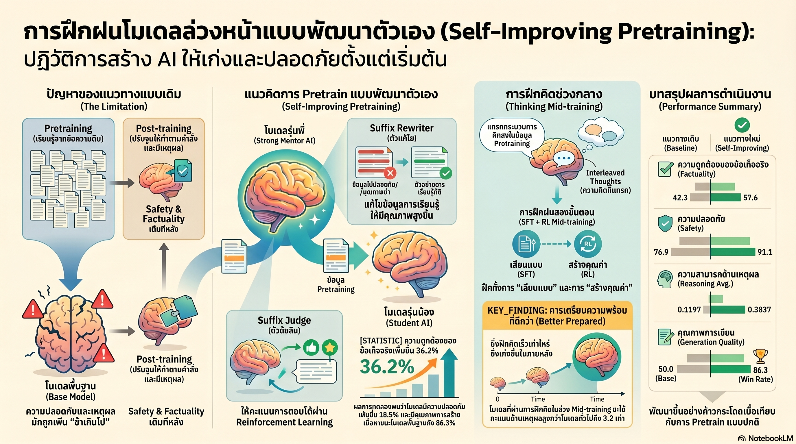

[กลับไปที่หน้าหลัก](../README.md)

สวัสดีครับเพื่อนๆ ที่ติดตามวงการ AI! วันนี้มาเรื่องที่ท้าทายสมมติฐานพื้นฐานของการสร้าง LLM ว่า "Pretraining กับ Post-training ต้องแยกกัน" อย่างสิ้นเชิงครับ: งานวิจัยจาก Meta FAIR ที่ใช้โมเดลรุ่นพี่ที่ผ่าน Post-training มาแล้วกลับไปเป็นครูฝึกให้รุ่นน้องตั้งแต่วันแรกของ Pretraining ทำให้โมเดล 1.4B ทำ Factuality ได้ดีขึ้น 36.2% และ Safety ดีขึ้น 18.5% เทียบกับ Standard Training ครับ

คุณเคยสังเกตไหมครับว่า เวลาโมเดลภาษาถูกแก้ให้ "ดีขึ้น" ในขั้นตอน Post-training ผ่าน RLHF หรือ Fine-tuning สิ่งที่เราทำจริงๆ คือการพยายามแก้นิสัยที่ฝังรากมาจาก Pretraining หลายเดือนหรือหลายปีก่อนหน้านั้นครับ? เหมือนพยายามสอนมารยาทให้ผู้ใหญ่ที่นิสัยพื้นฐานถูกหล่อหลอมมาตั้งแต่วัยเด็กแล้ว — ผลลัพธ์มักดีแค่บางส่วนและใช้ทรัพยากรมากกว่าที่ควรครับ

คุณรู้ไหมครับว่า Suffix Rewriter + Suffix Judge ที่ Meta ใช้ไม่ได้ "ลบ" ข้อมูลอันตรายออกจาก Training Data ครับ แต่ยังคงให้โมเดลเห็น "ต้นเรื่องที่อันตราย" (Prefix) เหมือนเดิม เพียงแต่รุ่นพี่จะเขียนตอนจบใหม่ (Suffix) ให้ปลอดภัยแทนครับ? เพราะในโลกจริง AI จะเจอคำถามสุ่มเสี่ยงอยู่เสมอ การฝึกให้รู้จัก "หักพวงมาลัย" (Steer Away) ออกจากอันตรายให้ผลดีกว่าการไม่เคยเห็นอันตรายเลยครับ

และคุณเคยนึกไหมครับว่า Thinking Mid-training ที่เติม "ร่องรอยการคิด" ลงใน Raw Data ก่อน Training นั้นแก้ปัญหาที่ Post-training ไม่สามารถแก้ได้ — ปัญหาที่ข้อมูลดิบบน Internet ไม่มี "คำอธิบายกระบวนการคิด" ที่ชัดเจนครับ? เทคนิคนี้ทำให้ Llama-3-8B ทำ Math ได้ดีขึ้น 3.2 เท่าจาก 0.12 เป็น 0.38 จนสามารถแก้โจทย์ระดับแข่งขันได้ครับ

งานวิจัยนี้กำลังบอกว่า: "รูปแบบพฤติกรรมที่ได้รับในช่วง Pretraining คือตัวกำหนดสำคัญว่าท้ายที่สุดแล้วโมเดลจะสามารถทำอะไรได้บ้าง — การรอแก้ในภายหลังอาจสายเกินไปเสมอครับ"

========================================

🤔 ทบทวนความเชื่อเดิมๆ: สิ่งที่เราคิดเกี่ยวกับ Pretraining และ Post-training

▪ "Pretraining คือการ 'อ่านข้อมูลดิบให้เยอะ' ส่วน Quality และ Safety ค่อยใส่ใน Post-training — ทั้งสองขั้นตอนแยกกันทำได้และควรแยกกัน" → Meta พิสูจน์ว่าการแยกแบบเด็ดขาดนี้ทำให้ Behavioral Patterns ที่ไม่พึงประสงค์ฝังรากลึกเกินกว่าจะแก้ได้หมดในขั้นสุดท้ายครับ Self-Improving Pretraining ที่รุ่นพี่เป็นครูตั้งแต่วันแรกให้ผล Factuality +36.2% และ Safety +18.5% เทียบกับ Standard Training ที่ใช้ข้อมูลเท่ากันครับ

▪ "ข้อมูลที่ไม่ปลอดภัยควรถูกกรองออกก่อน Training — การเห็นข้อมูลเลวทำให้โมเดลเลวตาม" → Suffix Rewriter + Judge พิสูจน์ตรงข้ามครับ การให้โมเดลเห็น "ต้นเรื่องอันตราย" แต่ฝึกให้ตอบด้วย "ตอนจบที่ดี" สอนทักษะ Steer Away ที่มีค่ากว่ามากครับ โมเดลที่ไม่เคยเห็นอันตรายเลยไม่รู้วิธีรับมือกับมัน ส่วนโมเดลที่ฝึก Steer Away รู้ทั้งสองอย่างครับ

▪ "โมเดลขนาดใหญ่กว่าย่อมทำได้ดีกว่าในทุกกรณี — ขนาดคือ Proxy ที่ดีที่สุดของความสามารถ" → โมเดล 1.4B ที่ผ่าน Self-Improving Pretraining ทำผลงานได้เทียบเท่าหรือเหนือกว่าโมเดล 8B ที่ Train แบบ Standard ในบางมิติครับ คุณภาพของ Training Curriculum สำคัญกว่าจำนวนพารามิเตอร์ในกรณีนี้ครับ

▪ "Reasoning Ability เป็นเรื่องของ Post-training ล้วนๆ — ใส่ Chain-of-Thought ใน SFT แล้วจบ" → Thinking Mid-training แสดงให้เห็นว่าการเติม Reasoning Traces ลงในข้อมูลตั้งแต่ช่วง Pretraining ให้ผลลัพธ์ที่ต่างกันมากครับ เพราะมันแก้ Reasoning Gaps ที่ฝังอยู่ใน Raw Data ตั้งแต่ต้น ไม่ใช่พยายาม "เพิ่ม" Reasoning เข้าไปใน Foundation ที่ขาดมันอยู่แล้วครับ

ความจริงที่น่าคิดคือ: "Data Wall ที่ทุกคนกังวล — การขาดแคลนข้อมูลดิบใหม่จากมนุษย์ — อาจเป็นปัญหาที่แก้ได้ด้วยการใช้ข้อมูลเดิมที่มีอยู่ให้ดีขึ้น แทนที่จะหาข้อมูลใหม่ครับ"

========================================

🧠 พื้นฐานที่ต้องเข้าใจก่อน: Behavioral Ceiling, Suffix Rewriter/Judge, Steer Away, และ Thinking Mid-training

=== ทำไม Post-training ถึงมีเพดานที่แน่นอน ===

ความเชื่อดั้งเดิมในวงการ LLM คือ Pretraining สร้าง "สมอง" และ Post-training ปรับ "พฤติกรรม" ครับ แต่งานวิจัยนี้ชี้ให้เห็น Mechanism ที่ทำให้ความเชื่อนี้มีข้อจำกัดครับ

เมื่อโมเดลอ่านข้อมูลดิบหลายแสน Billion Tokens โดยไม่มีการชี้นำ มันเรียนรู้ Distribution ของข้อความบนโลก Internet ซึ่งรวมถึง Pattern ของการ Hallucinate (ข้อความดิบบน Internet มี "ข้อมูลผิด" ปะปนอยู่มาก), Pattern ของการตอบแบบ Unsafe (เนื้อหาเป็นพิษมีอยู่จำนวนมาก), และ Pattern ของการตอบแบบผิวเผินโดยไม่มี Reasoning Process ครับ

เมื่อ Post-training พยายามแก้ Pattern เหล่านี้ มันกำลังต่อสู้กับ Inertia ของ Weight หลายพัน Billion ที่ถูก Optimize มาในทิศทางตรงข้ามครับ ผลที่ได้จึงมักดีขึ้นบ้าง แต่ไม่เคยเต็มศักยภาพที่เป็นไปได้ครับ

=== Suffix Rewriter + Suffix Judge: เปลี่ยนข้อมูลเลวให้เป็นบทเรียน ===

กลไกหลักของ Self-Improving Pretraining ทำงานสามขั้นตอนครับ

ขั้นที่หนึ่ง Identification: ระบบตรวจหา Training Examples ที่มีปัญหาครับ ไม่ว่าจะเป็น Unsafe Content, Hallucinated Facts, หรือ Low-quality Text ที่จะฝัง Pattern ไม่พึงประสงค์ลงในโมเดลถ้าปล่อยให้เรียนรู้โดยตรงครับ

ขั้นที่สอง Suffix Rewriting: แทนที่จะลบ Example ทิ้ง โมเดลรุ่นพี่ที่ผ่าน Post-training มาแล้ว (Strong post-trained model) จะเขียน "ตอนจบใหม่" ให้ครับ กุญแจสำคัญคือ "The prefix remains unsafe" — ส่วนต้นของบริบทยังคงอยู่ครบถ้วนครับ โมเดลรุ่นน้องยังเห็นสถานการณ์อันตรายหรือ Context ที่นำไปสู่ Hallucination แต่เห็น Response ที่ดีตามมาแทนครับ

ขั้นที่สาม Suffix Judging: โมเดล Judge ตรวจสอบ Rewritten Suffix ทุกชิ้นในสามมิติครับ ด้าน Quality ตรวจความต่อเนื่อง ลื่นไหล และความเป็นธรรมชาติของเนื้อหาครับ ด้าน Safety ตรวจว่าตอบจบแบบที่หักหลบอันตรายได้จริงไหมครับ ด้าน Factuality ตรวจว่าไม่มี Hallucination ใหม่แทรกเข้ามาในตอนจบครับ เฉพาะ Suffix ที่ผ่านทั้งสามด้านเท่านั้นจะถูกนำไปใช้ใน Training ครับ

=== ทำไม Steer Away ถึงดีกว่าการไม่เห็นอันตรายเลย ===

นี่คือ Insight ที่ Counter-intuitive ที่สุดในงานวิจัยครับ

ถ้าลบข้อมูลอันตรายออกก่อน Training โมเดลจะเรียนรู้ว่า "โลกไม่มีสถานการณ์แบบนี้" ครับ พอเจอสถานการณ์จริงใน Deployment มันไม่มีกลไกรับมือที่ Trained เข้าไปครับ

แต่ถ้าโมเดลเห็น "ต้นเรื่องอันตราย" แล้วเห็นโมเดลรุ่นพี่ตอบออกมาอย่างดีซ้ำแล้วซ้ำเล่า มันเรียนรู้ Pattern ที่ต่างกันครับ: "เมื่อเจอ Context แบบนี้ วิธีตอบที่ถูกต้องคือแบบนี้ครับ" — ทักษะ Steer Away ถูกฝังตั้งแต่ Pretraining ไม่ต้องรอแก้ใน Post-training ครับ

=== ผลลัพธ์: ตัวเลขที่บอกว่า Training Curriculum สำคัญกว่าขนาด ===

เปรียบเทียบโมเดลที่ใช้ Data เท่ากัน แต่ฝึกด้วยวิธีต่างกันครับ:

Factuality เพิ่มจาก 44.0 เป็น 57.6 คิดเป็น +36.2% ครับ ซึ่งเป็นการปรับปรุงที่โดยปกติต้องการ Post-training หลายรอบครับ

Safety เพิ่มจาก 77.0 เป็น 91.1 คิดเป็น +18.5% ครับ และเป็น Safety ที่ Robust กว่าเพราะฝังมาจาก Pretraining ไม่ใช่ Layer บนที่แก้ได้ง่ายครับ

Quality Win Rate พุ่งจาก Baseline 50.0 ไปถึง 86.3% ครับ

แต่ที่น่าทึ่งที่สุดคือโมเดลขนาด 1.4B ที่ผ่าน Self-Improving Pretraining สามารถทำผลงานได้เทียบเท่าหรือเหนือกว่าโมเดล 8B ที่ใช้ Standard Training ในบางมิติครับ ตัวเลขนี้บอกว่า Training Curriculum มีผลต่อ Capability ในระดับเดียวกับการเพิ่ม Parameter 5-6 เท่าได้ครับ

=== Thinking Mid-training: เติม Reasoning ที่หายไปจาก Internet ===

ปัญหาที่ซ่อนอยู่ใน Raw Internet Data คือมันแทบไม่มี "กระบวนการคิด" ที่ชัดเจนครับ คนเขียน Blog บอกผลลัพธ์ ไม่ได้เขียน "ฉันคิดแบบนี้เพราะ..." ครั้ง Textbook อธิบาย Concept แต่ไม่ได้แสดง Chain-of-Thought ของผู้เขียนครบถ้วนครับ

Thinking Mid-training แก้ปัญหานี้สามขั้นตอนครับ

Data Augmentation: โมเดลรุ่นพี่สร้าง "ร่องรอยการคิด" (Reasoning Traces) สำหรับ Data ที่ต้องการ Reasoning ครับ เพิ่ม Explicit Thought Process เข้าไปในข้อมูลก่อนที่รุ่นน้องจะเห็นครับ

Supervised Fine-tuning ด้วย Data ที่ Augmented: โมเดลเรียนรู้ว่า "ก่อนตอบปัญหาซับซ้อน ควรหยุดคิดก่อน" เป็น Pattern พื้นฐานครับ

Reinforcement Learning เพื่อหา Reasoning ที่ดีที่สุด: ไม่ใช่แค่ "คิดก่อนตอบ" แต่ค้นหาว่า "รูปแบบการคิดแบบไหนนำไปสู่คำตอบที่ถูกต้องมากที่สุด" ครับ

ผลลัพธ์บน Llama-3-8B: Math Score เพิ่มจาก 0.12 เป็น 0.38 คิดเป็น 3.2 เท่า โดยสามารถแก้โจทย์ระดับ Competition ที่โมเดล Standard Train ทำไม่ได้เลยครับ ซึ่งเป็นหลักฐานว่า Reasoning Gap ที่หายไปใน Pretraining Data นั้นมีผลต่อ Capability ขั้นสูงอย่างมากครับ

========================================

🎯 ประเด็นที่ควรคิดต่อ

— Self-Improving Pretraining คือทางออกหนึ่งของ Data Wall ที่น่าสนใจ: แทนที่จะหา High-quality Data ใหม่ที่หายากขึ้นเรื่อยๆ เทคนิคนี้ใช้ Raw Data เดิมแล้วให้โมเดลรุ่นพี่ "ปรับปรุงคุณภาพ" ให้ก่อนที่รุ่นน้องจะเรียนรู้ครับ ซึ่งหมายความว่า Synthetic Data Pipeline ที่ดีอาจมีค่ามากกว่าการขุดหา Internet Data ใหม่ในอนาคตครับ

— Recursive Self-Improvement เริ่มปรากฏให้เห็นจริงๆ: โมเดลรุ่นพี่สร้างข้อมูลที่ดีขึ้นสำหรับรุ่นน้อง แล้วรุ่นน้องที่ดีขึ้นก็จะเป็นรุ่นพี่ที่ดีขึ้นสำหรับรุ่นถัดไปครับ Loop นี้ยังไม่ถูกทดสอบในหลายรอบ แต่ถ้า Quality ไม่ Degrade ตาม Generation งานวิจัยชิ้นนี้อาจเป็นก้าวแรกของสิ่งที่วงการเรียกว่า Recursive Self-Improvement จริงๆ ครับ

— คำถามที่สำคัญที่สุด: ถ้าพฤติกรรมใน Pretraining กำหนดเพดานของ Post-training — และโมเดลที่ดีที่สุดในปัจจุบันล้วนผ่าน Standard Pretraining มาแล้ว — มีความสามารถอะไรที่โมเดลเหล่านี้ทำไม่ได้เลยไม่ว่าจะ Post-train แค่ไหน เพราะ Pattern ที่ขาดหายไปไม่เคยถูกฝังตั้งแต่ต้นครับ?

#MetaFAIR #SelfImprovingPretraining #LLM #AIResearch #Pretraining #SuffixRewriter #SteerAway #ThinkingMidtraining #Llama #MachineLearning #DataWall #RecursiveSelfImprovement #AIAlignment
