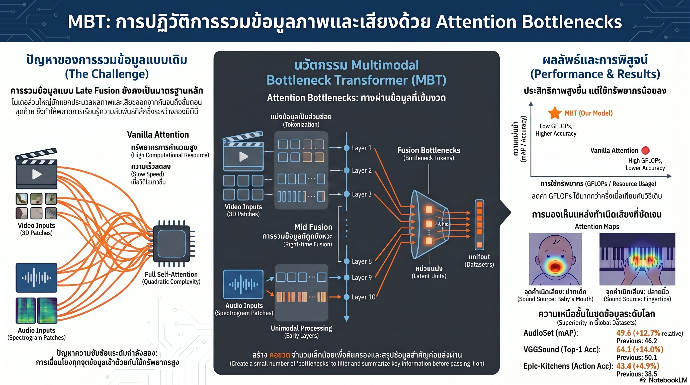

[กลับไปที่หน้าหลัก](../README.md)

สวัสดีครับเพื่อนๆ ที่ติดตามวงการ AI! วันนี้มาเรื่องที่ฟังดูขัดกับสัญชาตญาณมากที่สุดในปีนี้ว่า วิธีทำให้ AI "เข้าใจ" ภาพและเสียงพร้อมกันได้ดีขึ้น ไม่ใช่การเพิ่มข้อมูล ไม่ใช่การทำโมเดลใหญ่ขึ้น แต่คือการสร้าง "คอขวด" ให้ข้อมูลต้องผ่านครับ

คุณเคยสังเกตไหมครับว่า เวลาเราดูหนัง เราไม่ได้ดูภาพและฟังเสียงแยกกันแล้วค่อยนำมาประกอบกันในใจ แต่สมองผสานทั้งสองเข้าด้วยกันสดๆ ทันที จนรู้ทันทีว่าเสียงกระทบแก้วมาจากมือซ้ายหรือมือขวาของนักแสดง?

คุณเคยสงสัยไหมครับว่า ถ้า AI ได้ยินเสียงเปียโน มันรู้ไหมว่าต้อง "มอง" ที่ปลายนิ้วที่กดคีย์ ไม่ใช่ที่ตัวเปียโนทั้งหลัง หรือที่ใบหน้าของนักดนตรีที่นั่งอยู่ข้างๆ?

และคุณรู้ไหมครับว่า Google Research สร้างสถาปัตยกรรมที่ทำให้ AI ทำสิ่งนั้นได้จริง และทำคะแนน AudioSet SOTA ได้เหนือกว่าสถิติเดิม 12.7% โดยใช้ข้อมูลน้อยกว่าคู่แข่งถึง 4 เท่า?

สถาปัตยกรรมนี้ชื่อ Multimodal Bottleneck Transformer หรือ MBT และความลับอยู่ที่การบังคับให้ข้อมูลทุกอย่างต้องผ่าน "คอขวด" เล็กๆ เพียงไม่กี่จุดครับ

========================================

🤔 ทบทวนความเชื่อเดิมๆ: สิ่งที่เราคิดเกี่ยวกับ Multimodal AI

▪ "AI ที่เก่งเรื่องภาพและเสียงต้องให้ทั้งสองส่วนคุยกันมากที่สุดเท่าที่จะทำได้ ยิ่งสื่อสารกันมากยิ่งดี" → การให้ทุก Token ของภาพและเสียงสื่อสารกันทั้งหมด (Pairwise Attention) ทำให้ภาระการคำนวณพุ่งแบบ Quadratic ตามความยาววิดีโอ MBT พิสูจน์ว่าการบังคับให้ผ่านคอขวดน้อยๆ ให้ผลดีกว่าและประหยัดกว่ามากครับ

▪ "ยิ่งรวมข้อมูลเร็วยิ่งดี ควรผสมภาพและเสียงตั้งแต่เลเยอร์แรก" → Early Fusion ล้มเหลวเพราะข้อมูลดิบที่ยังไม่ผ่านการเรียนรู้ลักษณะเฉพาะของแต่ละสื่อนั้นปนเปกันเกินไป ผลลัพธ์แย่กว่า Mid Fusion ที่รอให้โมเดลเรียนรู้พื้นฐานของแต่ละสื่อก่อนครับ

▪ "AI เห็นภาพและได้ยินเสียงอยู่แล้ว แค่รวมผลลัพธ์ปลายทางก็พอ (Late Fusion)" → Late Fusion พลาดปฏิสัมพันธ์เชิงลึกที่เกิดขึ้น "ระหว่าง" การประมวลผล เหมือนให้สองแผนกทำงานแยกกันจนเสร็จแล้วค่อยประชุมรวม ข้อมูลสำคัญที่ต้องใช้กันระหว่างทางหายไปหมดแล้วครับ

▪ "ข้อจำกัดหรือคอขวดในสถาปัตยกรรมทำให้ AI สูญเสียข้อมูลสำคัญ" → คอขวดบังคับให้ AI คัดเลือกเฉพาะข้อมูลที่สำคัญที่สุด ผลคือ Attention Maps ของ MBT แม่นยำกว่าโมเดลทั่วไปอย่างเห็นได้ชัด โฟกัสไปที่ "ปลายนิ้วที่กดคีย์" แทนที่จะมองทั้งเวทีครับ

ความจริงที่น่าคิดคือ: ปัญหาของ Multimodal AI ไม่ใช่ว่ามีข้อมูลไม่พอ แต่คือไม่มีกลไกที่บังคับให้โมเดลเลือกว่า "ข้อมูลไหนสำคัญจริงๆ" ก่อนที่จะนำมาผสานกันครับ

========================================

🧠 พื้นฐานที่ต้องเข้าใจก่อน: Multimodal Fusion, Quadratic Complexity และ Attention

=== Multimodal Fusion คืออะไร? ===

Multimodal Fusion = กระบวนการรวมข้อมูลจากหลายประสาทสัมผัสหรือหลายสื่อเข้าด้วยกัน เช่น ภาพ + เสียง, ข้อความ + รูปภาพ

มีสามแนวทางหลักครับ

[Early Fusion]: รวมข้อมูลดิบทั้งหมดตั้งแต่เลเยอร์แรก ก่อนที่โมเดลจะเรียนรู้ลักษณะเฉพาะของแต่ละสื่อ
[Late Fusion]: ประมวลผลแต่ละสื่อแยกกันจนเสร็จ แล้วค่อยรวมผลลัพธ์ปลายทาง
[Mid Fusion (แบบของ MBT)]: ให้แต่ละสื่อเรียนรู้ลักษณะเฉพาะของตัวเองก่อน แล้วค่อยผสานกันที่จุดกลางที่เหมาะสมครับ

=== Quadratic Complexity คืออะไร? ===

Quadratic Complexity = ปัญหาที่เวลาการคำนวณเพิ่มตามกำลังสองของขนาดข้อมูล ถ้าวิดีโอยาวขึ้น 2 เท่า เวลาประมวลผลเพิ่มขึ้น 4 เท่า ถ้ายาวขึ้น 10 เท่า เวลาเพิ่มขึ้น 100 เท่า

เกิดจากการที่ Transformer ให้ทุก Token "มองหา" ทุก Token อื่น (Pairwise Attention) เมื่อมีทั้ง Token ของภาพและเสียงรวมกัน จำนวนคู่ที่ต้องคำนวณจะพุ่งขึ้นอย่างรวดเร็วครับ

เปรียบเทียบ: เหมือนการประชุมที่ถ้ามี 10 คนจะมีคู่สนทนา 45 คู่ แต่ถ้า 100 คนจะมี 4,950 คู่ เพิ่มขึ้น 110 เท่าในขณะที่คนเพิ่มแค่ 10 เท่า ครับ

=== FSN Tokens คืออะไร? ===

FSN (Fusion) Tokens = หน่วยแฝงขนาดเล็ก (Latent Units) จำนวนน้อยที่ทำหน้าที่เป็น "คอขวด" ระหว่างภาพและเสียง

แทนที่จะให้ทุก Token ของภาพและเสียงคุยกันตรงๆ โมเดลจะบังคับให้ข้อมูลต้องผ่าน FSN Tokens เหล่านี้เท่านั้น ทำให้ FSN ต้องทำหน้าที่ "กลั่น" เฉพาะแก่นสารที่สำคัญที่สุดออกมาจากแต่ละสื่อ ก่อนที่จะส่งให้อีกสื่อหนึ่งรับรู้ครับ

=== Attention Maps คืออะไร? ===

Attention Maps = ภาพแสดงว่าโมเดลกำลัง "โฟกัส" ไปที่ส่วนไหนของภาพในขณะที่ประมวลผลเสียง

ใช้เป็นเครื่องมือตรวจสอบว่าโมเดลเชื่อมโยงภาพกับเสียงได้ถูกต้องหรือเปล่า เช่น เมื่อได้ยินเสียงเปียโน Attention ควรไปที่มือของนักดนตรี ไม่ใช่ที่เพดานห้องครับ

========================================

1️⃣ คอขวดที่ฉลาด: ทำไม FSN Tokens จึงแก้ปัญหาได้สองอย่างพร้อมกัน

=== ปัญหาที่ต้องแก้พร้อมกัน ===

MBT ต้องการแก้ปัญหาสองอย่างพร้อมกันครับ

[ปัญหาที่ 1: Quadratic Complexity]
▸ ภาพวิดีโอมี Token หลักร้อยถึงหลักพัน
▸ เสียงก็มี Token จำนวนมากเช่นกัน
▸ ให้คุยกันทั้งหมดทำให้การคำนวณระเบิด

[ปัญหาที่ 2: ขาดการเลือก (Lack of Selection)]
▸ เมื่อทุกอย่างคุยกันได้ AI ไม่รู้ว่าอะไรสำคัญ
▸ ข้อมูลที่ไม่เกี่ยวข้องรบกวน (Noise) ข้อมูลที่สำคัญ

=== วิธีที่ FSN Tokens แก้ทั้งสองปัญหา ===

แทนที่จะให้ Token ภาพทุกตัวคุยกับ Token เสียงทุกตัว โมเดลกำหนดว่า

▸ Token ภาพ → คุยกับ FSN Tokens เท่านั้น
▸ FSN Tokens → กลั่นสาระจากภาพแล้วส่งให้ฝั่งเสียง
▸ Token เสียง → รับข้อมูลจาก FSN Tokens เท่านั้น

เปรียบเทียบ: เหมือนการประชุมข้ามแผนกที่แทนที่จะให้ทุกคนจาก 100 คนพูดคุยกันหมดเลย ให้แต่ละฝ่ายเลือกผู้แทน 3 คนที่สรุปสาระสำคัญมาแล้ว แล้วให้ผู้แทนสองกลุ่มนั้นคุยกัน ทั้งเร็วกว่า ชัดเจนกว่า และผลลัพธ์ดีกว่าครับ

ผลลัพธ์: ลด Complexity จาก O(N²) เป็น O(N × k) เมื่อ k คือจำนวน FSN Tokens ที่น้อยมากครับ

========================================

2️⃣ Layer 8 Sweet Spot: วิทยาศาสตร์ของ "จังหวะที่ใช่"

=== ทำไมจังหวะเวลาจึงสำคัญ? ===

งานวิจัยทดสอบว่าถ้าเริ่มทำ Fusion ที่เลเยอร์ต่างๆ กัน ผลลัพธ์จะเป็นยังไง

[Layer 0 — Early Fusion]
▸ ข้อมูลภาพและเสียงยังเป็น "ดิบ" ยังไม่ได้เรียนรู้ลักษณะเฉพาะอะไรเลย
▸ เหมือนให้คนที่เพิ่งเจอกันครั้งแรกร่วมโครงการทันที โดยยังไม่รู้ว่าแต่ละคนถนัดอะไร
▸ ประสิทธิภาพต่ำ กินทรัพยากรสูง

[Layer 8 — Sweet Spot สำหรับ Bottleneck Fusion]
▸ โมเดลเรียนรู้ลักษณะเฉพาะพื้นฐานได้แล้ว เช่น ขอบภาพ ความถี่เสียง รูปแบบการเคลื่อนไหว
▸ แต่ยังไม่ได้ตีความระดับสูง ทำให้ยังมีพื้นที่สำหรับการเรียนรู้ร่วมกัน
▸ ประสิทธิภาพสูงสุดสำหรับ Bottleneck Fusion

[Layer 10 — Sweet Spot สำหรับ Vanilla Cross-Attention]
▸ จุดที่เหมาะสมหากใช้ Cross-Attention ปกติ (ไม่มีคอขวด)

[Layer 12 — Late Fusion]
▸ โมเดลเรียนรู้ไปมากแล้วแต่แยกส่วนกัน ขาดการแลกเปลี่ยนกลางทาง
▸ ผลลัพธ์ตกลงเพราะโมเดลไม่ได้เรียนรู้ร่วมกันในช่วงที่สำคัญที่สุดครับ

=== บทเรียนจาก Sweet Spot ===

เลเยอร์แรกๆ ที่ทำงานแบบ Unimodal (แยกส่วน) ไม่ใช่การเสียเวลา แต่คือการลงทุนที่ทำให้การ Fusion ในภายหลังมีคุณภาพสูงกว่า เพราะแต่ละสื่อได้เรียนรู้ "ภาษาของตัวเอง" ก่อนที่จะต้อง "แปล" ให้อีกสื่อหนึ่งเข้าใจครับ

========================================

3️⃣ AI ที่ "มองเห็น" เสียง: เมื่อ Attention Maps เปิดเผยสิ่งที่โมเดลเข้าใจจริงๆ

=== ทดสอบด้วย Attention Rollout ===

Attention Rollout คือเทคนิคสะสม Attention จากทุกเลเยอร์เพื่อดูว่า Token ปลายทางให้ความสำคัญกับพิกเซลไหนในภาพต้นทาง

ผลที่ได้จาก MBT น่าประทับใจมากครับ

[เสียงเด็กทารกร้อง]
▸ MBT โฟกัสไปที่: ปาก ของเด็กทารกอย่างจำเพาะเจาะจง
▸ โมเดลทั่วไป: มองกระจายทั่วใบหน้า

[เสียงเปียโน]
▸ MBT โฟกัสไปที่: ปลายนิ้ว ที่กำลังกดคีย์
▸ โมเดลทั่วไป: มองที่ตัวเปียโนและนักดนตรีทั้งคน

[เสียงร้องเพลง]
▸ MBT โฟกัสไปที่: ใบหน้าและปาก ของนักร้อง
▸ โมเดลทั่วไป: มองกระจายทั่วเวที

=== ทำไม Bottleneck จึงสร้างความแม่นยำนี้? ===

เมื่อ FSN Tokens มีพื้นที่จำกัด พวกมันต้องตัดสินใจว่า "ข้อมูลภาพอะไรที่อธิบายเสียงนี้ได้ดีที่สุด?" แทนที่จะส่งทุกอย่างไปเหมือนกัน

ผลคือโมเดลเรียนรู้โดยปริยายว่าควรมองหา "การเคลื่อนไหวที่ก่อให้เกิดหรือปรับแต่งเสียง" ไม่ใช่แค่ "สิ่งที่อยู่ในภาพ"

เปรียบเทียบ: เหมือนความแตกต่างระหว่างช่างภาพที่ถ่ายทุกอย่างในงานเปิดตัวเพลงใหม่ กับช่างภาพที่รู้ว่าต้องโฟกัสไปที่มือของมือกีตาร์ขณะดีดสาย เพราะนั่นคือจุดที่เสียงเกิดขึ้นจริงๆ ครับ

========================================

4️⃣ ชนะด้วยสถาปัตยกรรม ไม่ใช่ปริมาณข้อมูล

=== ผล AudioSet SOTA ===

AudioSet คือ Benchmark มาตรฐานโลกสำหรับการจำแนกเสียงในวิดีโอ มี 527 ประเภทเสียง

[ผลของ MBT]
▸ 49.6 mAP (mean Average Precision)
▸ เหนือกว่าสถิติเดิม +5.9 mAP = +12.7% เมื่อเทียบกับ SOTA ก่อนหน้า

[สิ่งที่น่าสนใจกว่า]
▸ ฝึกด้วย AS-500K ซึ่งเป็นชุดข้อมูลที่คัดเลือกมาอย่างสมดุล (Greedily Balanced Subset)
▸ ขนาดน้อยกว่าชุดข้อมูลของคู่แข่ง 4 เท่า
▸ แต่ทำคะแนนได้สูงกว่าครับ

=== วิธีตัดสินใจขั้นสุดท้าย ===

MBT จำแนกประเภทเสียงโดยนำ CLS Tokens (Token สรุปข้อมูล) จากฝั่งภาพและฝั่งเสียงมาหาค่าเฉลี่ยของ Logits ก่อนตัดสิน

[ฝั่งภาพ]: "ฉันเห็นคนกดคีย์เปียโน → น่าจะเป็นเสียงเปียโน (90%)"
[ฝั่งเสียง]: "ฉันได้ยินเสียงความถี่สูง-ต่ำสลับกัน → น่าจะเป็นเสียงเปียโน (85%)"
[รวมกัน]: เฉลี่ย Logits ทั้งสองออกมาเป็นคำตอบสุดท้ายที่แม่นยำกว่าการใช้แค่อย่างใดอย่างหนึ่งครับ

=== บทพิสูจน์: สถาปัตยกรรมดีกว่าข้อมูลมาก ===

ผลนี้พิสูจน์ว่าการออกแบบสถาปัตยกรรมที่ถูกต้องสามารถชนะการโยนข้อมูลจำนวนมหาศาลได้ ทิศทางนี้สำคัญมากในยุคที่ข้อมูลมีราคาแพงขึ้นและสิ่งแวดล้อมต้องการ AI ที่ประหยัดพลังงานครับ

========================================

🎯 สรุป: 4 บทเรียนจาก MBT

▸ คอขวดที่ออกแบบมาดีไม่ใช่อุปสรรค แต่คือตัวกรองที่ทำให้ฉลาดขึ้น: FSN Tokens บังคับให้โมเดลต้องเลือกว่าข้อมูลอะไรสำคัญจริงๆ ก่อนผ่านไปยังอีกสื่อหนึ่ง ผลคือโฟกัสที่แม่นยำกว่าแทนที่จะกระจายไปทั่ว

▸ จังหวะเวลาของการ Fusion สำคัญพอๆ กับวิธีการ Fusion: Layer 8 ไม่ใช่เลข Magic แต่คือตัวแทนของหลักการว่า "เรียนรู้ให้พร้อมก่อน แล้วค่อยร่วมมือกัน" ซึ่งสะท้อนกลยุทธ์การเรียนรู้ที่ได้ผลในหลายมิติ

▸ Attention Maps เป็นเครื่องพิสูจน์ความเข้าใจ ไม่ใช่แค่ตัวชี้วัดประสิทธิภาพ: เมื่อโมเดลโฟกัสที่ปลายนิ้วที่กดคีย์แทนที่จะมองทั้งเวที มันไม่ได้แค่ทำคะแนนได้ดีขึ้น แต่แสดงว่ามันเข้าใจว่าเสียงเกิดขึ้นได้อย่างไรในโลกจริง

▸ สถาปัตยกรรมที่ดีชนะข้อมูลที่มากกว่าได้: ชนะ SOTA ด้วยข้อมูล 4 เท่าน้อยกว่าคือข้อพิสูจน์ที่ชัดเจนว่าเราควรลงทุนกับ Architecture Design ไม่แพ้กับการลงทุนกับการเก็บข้อมูล

หลักการสำคัญ: "ข้อจำกัดที่ออกแบบมาอย่างชาญฉลาดไม่ได้ทำให้ระบบอ่อนแอลง แต่บังคับให้ระบบต้องฉลาดขึ้นในการเลือกสิ่งที่สำคัญ เหมือนที่การมีเวลาจำกัดในการสอบมักทำให้คำตอบกระชับและตรงประเด็นกว่าการมีเวลาไม่จำกัด" ครับ

========================================

💬 คำถามท้ายทาย

1. MBT พิสูจน์ว่าคอขวดของ FSN Tokens บังคับให้โมเดลเรียนรู้ว่า "การเคลื่อนไหวที่ก่อให้เกิดเสียง" สำคัญกว่า "สิ่งที่อยู่ในภาพ" ทั่วไป ถ้าเราขยาย MBT ให้รองรับสื่อที่สาม เช่น ข้อความ หรือการสัมผัส Bottleneck จะต้องปรับเปลี่ยนอย่างไร และมีความเสี่ยงอะไรที่ข้อมูลสำคัญจะถูกกรองออกไปโดยไม่ตั้งใจครับ?

2. Sweet Spot ของ MBT อยู่ที่ Layer 8 สำหรับ AudioSet แต่ถ้าเปลี่ยน Task เช่น การวินิจฉัยโรคจากภาพ X-ray และเสียงหัวใจ หรือการตรวจจับอารมณ์จากภาพใบหน้าและน้ำเสียง Layer ที่เหมาะสมจะเปลี่ยนไปไหม และเราควรออกแบบ MBT ให้ค้นหา Sweet Spot ได้อัตโนมัติสำหรับแต่ละ Task ได้ไหมครับ?

3. Attention Maps ของ MBT แสดงว่าโมเดลโฟกัสที่ปลายนิ้วที่กดคีย์เปียโน แต่ในโลกจริงเสียงบางอย่างเกิดจากสิ่งที่มองไม่เห็นในภาพ เช่น เสียงลมที่เกิดจากการเคลื่อนที่ของมือ ถ้า Bottleneck บังคับให้ต้องหา "แหล่งที่มาของเสียงในภาพ" เสมอ AI จะจัดการกับเสียงที่ไม่มีแหล่งที่มาที่มองเห็นได้อย่างไรครับ?

4. MBT ชนะ SOTA ด้วยข้อมูลน้อยกว่า 4 เท่า ถ้าหลักการนี้ขยายไปยัง Domain ที่ข้อมูลหายากและมีราคาแพงมาก เช่น ข้อมูลทางการแพทย์ หรือข้อมูลอุบัติเหตุทางการจราจร สถาปัตยกรรมแบบ Bottleneck จะเป็นกุญแจสำคัญที่ทำให้ AI เข้าถึง Domain เหล่านี้ได้โดยไม่ต้องรวบรวมข้อมูลขนาดใหญ่ไหมครับ?

========================================

References:
▸ Multimodal Bottleneck Transformer (MBT) — Google Research, สถาปัตยกรรม Mid Fusion ด้วย Bottleneck Latents
▸ FSN (Fusion) Tokens — หน่วยแฝงคอขวดที่บังคับการไหลของข้อมูลระหว่าง Modalities
▸ Linguistic Duality ใน Multimodal Context — Compositional Reasoning vs Knowledge Retrieval ในมิติของภาพและเสียง
▸ Quadratic Complexity — ปัญหาหลักที่ MBT แก้ด้วย O(N × k) Complexity
▸ AudioSet SOTA — 49.6 mAP (+5.9 mAP / +12.7%) ด้วยชุดข้อมูล AS-500K ขนาดเล็กกว่าคู่แข่ง 4 เท่า
▸ Attention Rollout Analysis — พิสูจน์ว่า MBT โฟกัสที่ "การเคลื่อนไหวที่ก่อให้เกิดเสียง" อย่างจำเพาะเจาะจง
▸ Mid Fusion Sweet Spot — Layer 8 สำหรับ Bottleneck Fusion, Layer 10 สำหรับ Vanilla Cross-Attention

ในวันที่ AI เริ่มรู้ว่าเสียงเปียโนมาจากปลายนิ้ว ไม่ใช่จากทั้งเวที คำถามที่ตามมาคือ ความเข้าใจ "กลไกของโลก" ที่แท้จริงนั้นแตกต่างจากการจับคู่รูปแบบที่ถูกต้องอย่างไร และเมื่อไหรที่เราจะรู้ว่า AI เริ่ม "เข้าใจ" จริงๆ ไม่ใช่แค่ "ทำนายได้ถูก" ครับ ⚡

#MBT #MultimodalAI #BottleneckTransformer #AudioSet #MultimodalFusion #GoogleResearch #AIResearch #ComputerVision #SpeechAI #AIThailand #ปัญญาประดิษฐ์ #MachineLearning #AttentionMechanism #GreenAI

