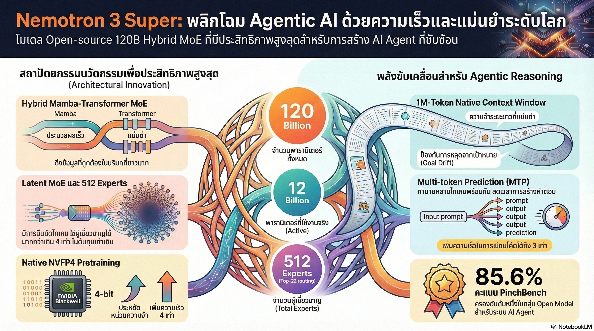

[กลับไปที่หน้าหลัก](../README.md)

สวัสดีครับเพื่อนๆ นักพัฒนาและคนรัก 𝐀𝐈! วันนี้มาพูดถึงโมเดลใหม่จาก 𝐍𝐕𝐈𝐃𝐈𝐀 ที่น่าจับตามองมากๆ ครับ
คุณเคยรู้สึกไหมครับว่า 𝐀𝐈 𝐀𝐠𝐞𝐧𝐭 ที่ใช้งานอยู่นั้น บางทีทำงานยาวๆ ไปซักพักแล้ว "ลืม" ว่าตัวเองกำลังทำอะไรอยู่? หรือทุกครั้งที่โจทย์ซับซ้อนขึ้น ค่าใช้จ่ายในการรันก็พุ่งขึ้นตามแบบไม่เป็นสัดส่วน?
และคุณเคยสงสัยไหมครับว่า ทำไม 𝐀𝐈 บางตัวถึง "เก่ง" แต่พอสั่งให้ทำงานอัตโนมัติหลายขั้นตอนจริงๆ กลับสะดุดทุกทีเลย?
นั่นคือปัญหา 𝟐 อย่างที่ 𝐍𝐕𝐈𝐃𝐈𝐀 มองเห็น แล้วตั้งใจแก้ตรงๆ ด้วย 𝐍𝐞𝐦𝐨𝐭𝐫𝐨𝐧 𝟑 𝐒𝐮𝐩𝐞𝐫 โมเดลที่ไม่ได้มาเพื่อเป็นแค่ 𝐋𝐚𝐧𝐠𝐮𝐚𝐠𝐞 𝐌𝐨𝐝𝐞𝐥 อีกตัว แต่ถูกสร้างมาให้เป็น "สมองของ 𝐀𝐠𝐞𝐧𝐭" โดยเฉพาะ
========================================
🤔 ทบทวนความเชื่อเดิมๆ: สิ่งที่เราเคยคิดเรื่อง 𝐀𝐈 สำหรับ 𝐀𝐠𝐞𝐧𝐭
▪ "ยิ่งโมเดลใหญ่ยิ่งดี ซื้อ 𝐆𝐏𝐔 เพิ่มแล้วกัน" → 𝐍𝐞𝐦𝐨𝐭𝐫𝐨𝐧 𝟑 𝐒𝐮𝐩𝐞𝐫 ใช้ 𝐀𝐜𝐭𝐢𝐯𝐞 𝐏𝐚𝐫𝐚𝐦𝐞𝐭𝐞𝐫𝐬 แค่ 𝟏𝟐𝐁 จาก 𝟏𝟐𝟎𝐁 ทั้งหมด แต่ประสิทธิภาพสูงกว่าโมเดล 𝐅𝐮𝐥𝐥-𝐬𝐢𝐳𝐞 หลายตัว
▪ "𝐂𝐨𝐧𝐭𝐞𝐱𝐭 𝐖𝐢𝐧𝐝𝐨𝐰 ยาวๆ ทำให้ 𝐀𝐈 จำได้เยอะขึ้น" → 𝐂𝐨𝐧𝐭𝐞𝐱𝐭 ยาวโดยไม่มีสถาปัตยกรรมที่ถูกต้องทำให้ 𝐀𝐈 "ลืมเป้าหมายหลัก" ต่างหาก
▪ "ฝึกโมเดลด้วย 𝟒-𝐛𝐢𝐭 จะทำให้คุณภาพแย่ลง" → 𝐍𝐕𝐈𝐃𝐈𝐀 พิสูจน์ว่า 𝐍𝐕𝐅𝐏𝟒 ตั้งแต่วันแรกให้ผลดีกว่าการทำ 𝐐𝐮𝐚𝐧𝐭𝐢𝐳𝐚𝐭𝐢𝐨𝐧 ทีหลัง
▪ "𝐌𝐨𝐄 คือการมีผู้เชี่ยวชาญหลายคน ยิ่งเยอะยิ่งดี" → การมี 𝐄𝐱𝐩𝐞𝐫𝐭 เยอะๆ โดยไม่บีบอัด 𝐓𝐨𝐤𝐞𝐧 ก่อนทำให้ต้นทุนการสื่อสารระหว่าง 𝐆𝐏𝐔 พุ่งสูง 𝐋𝐚𝐭𝐞𝐧𝐭 𝐌𝐨𝐄 แก้จุดนี้ครับ
ความจริงที่น่าสนใจคือ: 𝐍𝐞𝐦𝐨𝐭𝐫𝐨𝐧 𝟑 𝐒𝐮𝐩𝐞𝐫 ไม่ได้แค่ "ใหญ่กว่า" แต่มัน "ฉลาดกว่าในการจัดการทรัพยากรของตัวเอง"
========================================
🧠 พื้นฐานที่ต้องเข้าใจก่อน: 𝐌𝐨𝐄, 𝐋𝐚𝐭𝐞𝐧𝐭 𝐒𝐩𝐚𝐜𝐞 และ 𝐑𝐨𝐮𝐭𝐢𝐧𝐠 คืออะไร?
บทความนี้มีคำศัพท์เทคนิคหลายตัวที่ฟังดูน่ากลัว แต่จริงๆ แล้วเข้าใจง่ายมากถ้ามีตัวเปรียบเทียบครับ
=== 𝐌𝐨𝐄 (𝐌𝐢𝐱𝐭𝐮𝐫𝐞 𝐨𝐟 𝐄𝐱𝐩𝐞𝐫𝐭𝐬) คืออะไร? ===
𝐌𝐨𝐄 = โมเดลที่มี "ผู้เชี่ยวชาญ" หลายคนทำงานร่วมกัน แทนที่จะมีคนเดียวรู้ทุกอย่าง
เปรียบเทียบ: ลองนึกถึงโรงพยาบาลใหญ่ครับ แทนที่จะมีหมอคนเดียวที่รักษาได้ทุกโรค โรงพยาบาลมีผู้เชี่ยวชาญแยกแผนก เมื่อผู้ป่วยมาถึง "𝐆𝐚𝐭𝐞𝐤𝐞𝐞𝐩𝐞𝐫" (𝐑𝐨𝐮𝐭𝐞𝐫) จะดูอาการแล้วส่งไปยังแผนกที่เหมาะสม เช่น ปวดหัวก็ไปประสาทวิทยา ปวดท้องก็ไปอายุรกรรม
𝐀𝐈 แบบ 𝐌𝐨𝐄 ทำแบบเดียวกัน:
▸ รับ 𝐓𝐨𝐤𝐞𝐧 (ข้อมูล) เข้ามา
▸ 𝐑𝐨𝐮𝐭𝐞𝐫 ตัดสินใจว่า 𝐓𝐨𝐤𝐞𝐧 นี้ควรไปหาผู้เชี่ยวชาญคนไหน
▸ ส่งไปยัง 𝐄𝐱𝐩𝐞𝐫𝐭 ที่เหมาะสม 𝟏-𝟐𝟐 คนพร้อมกัน
▸ รวมผลลัพธ์กลับมาเป็นคำตอบ
ข้อดีหลัก: ใช้ 𝐄𝐱𝐩𝐞𝐫𝐭 ทำงานจริงแค่บางส่วน ทำให้โมเดลขนาดยักษ์ 𝟏𝟐𝟎𝐁 ทำงานเหมือนโมเดล 𝟏𝟐𝐁 ในแต่ละก้าวครับ!
=== 𝐋𝐚𝐭𝐞𝐧𝐭 𝐒𝐩𝐚𝐜𝐞 คืออะไร? ===
𝐋𝐚𝐭𝐞𝐧𝐭 = "ซ่อนอยู่" หรือ "บีบอัดแล้ว"
𝐋𝐚𝐭𝐞𝐧𝐭 𝐒𝐩𝐚𝐜𝐞 คือ "มิติที่บีบอัด" ของข้อมูล เหมือนการย่อรูปจาก 𝟒𝐊 เป็น 𝐓𝐡𝐮𝐦𝐛𝐧𝐚𝐢𝐥 ที่ยังจำหน้าคนได้ แต่ขนาดเล็กลงมาก
เปรียบเทียบ: ลองนึกถึงโน้ตย่อก่อนสอบครับ แทนที่จะเอาหนังสือทั้งเล่มไปห้องสอบ คุณย่อเนื้อหาสำคัญทั้งหมดลงในกระดาษ 𝐀𝟒 หน้าเดียว ข้อมูลยังครบ แต่ขนาดเล็กกว่ามาก 𝐋𝐚𝐭𝐞𝐧𝐭 𝐒𝐩𝐚𝐜𝐞 ทำแบบเดียวกันกับ 𝐓𝐨𝐤𝐞𝐧 ครับ
[𝐓𝐨𝐤𝐞𝐧 ปกติ] → มิติ 𝟒𝟎𝟗𝟔 ตัวเลข (ขนาดใหญ่)
[𝐓𝐨𝐤𝐞𝐧 ใน 𝐋𝐚𝐭𝐞𝐧𝐭 𝐒𝐩𝐚𝐜𝐞] → มิติ 𝟏𝟎𝟐𝟒 ตัวเลข (บีบเหลือ 𝟏/𝟒)
=== 𝐑𝐨𝐮𝐭𝐢𝐧𝐠 คืออะไร? ===
𝐑𝐨𝐮𝐭𝐢𝐧𝐠 = กระบวนการ "ตัดสินใจว่าจะส่ง 𝐓𝐨𝐤𝐞𝐧 ไปหาผู้เชี่ยวชาญคนไหน"
เปรียบเทียบ: เหมือนระบบเราติ้งจดหมายในไปรษณีย์ครับ จดหมายแต่ละใบมีที่อยู่ ระบบจะอ่านที่อยู่แล้วส่งไปยังสาขาที่ถูกต้อง 𝐓𝐨𝐩-𝟐𝟐 𝐑𝐨𝐮𝐭𝐢𝐧𝐠 หมายความว่า 𝐓𝐨𝐤𝐞𝐧 แต่ละตัวถูกส่งไปยัง 𝐄𝐱𝐩𝐞𝐫𝐭 ที่เหมาะสมที่สุด 𝟐𝟐 คนพร้อมกันครับ
=== 𝐌𝐚𝐦𝐛𝐚 คืออะไร? ===
𝐌𝐚𝐦𝐛𝐚 = สถาปัตยกรรม 𝐀𝐈 ที่ออกแบบมาจัดการข้อมูลลำดับยาวได้อย่างมีประสิทธิภาพ
[𝐓𝐫𝐚𝐧𝐬𝐟𝐨𝐫𝐦𝐞𝐫 แบบเดิม]
▸ อ่านทุกอย่างในหน่วยความจำพร้อมกัน
▸ ยิ่ง 𝐂𝐨𝐧𝐭𝐞𝐱𝐭 ยาว ยิ่งใช้หน่วยความจำเพิ่มแบบกำลังสอง (𝐎(𝐧²))
▸ 𝟏 ล้าน 𝐓𝐨𝐤𝐞𝐧? หน่วยความจำระเบิดแน่นอน!
[𝐌𝐚𝐦𝐛𝐚]
▸ ใช้ "𝐇𝐢𝐝𝐝𝐞𝐧 𝐒𝐭𝐚𝐭𝐞" เหมือนหน่วยความจำแบบเลื่อนไหล
▸ ยาวแค่ไหนก็ใช้หน่วยความจำเท่าเดิม (𝐎(𝐧))
▸ เหมือนการอ่านหนังสือโดยจำ "สาระสำคัญ" ไว้ในหัว แทนที่จะกลับไปอ่านทุกหน้าซ้ำทุกครั้ง
========================================
𝟏️⃣ 𝐋𝐚𝐭𝐞𝐧𝐭 𝐌𝐨𝐄: ผู้เชี่ยวชาญ 𝟒 เท่า ในราคาเท่าเดิม
=== ปัญหาของ 𝐌𝐨𝐄 แบบเดิม ===
𝐌𝐨𝐄 ทั่วไปมีปัญหาซ่อนอยู่ครับ เมื่อโมเดลมี 𝐄𝐱𝐩𝐞𝐫𝐭 เยอะขึ้น 𝐑𝐨𝐮𝐭𝐞𝐫 ต้องส่ง 𝐓𝐨𝐤𝐞𝐧 ขนาดใหญ่ (𝟒𝟎𝟗𝟔 มิติ) ไปหา 𝐄𝐱𝐩𝐞𝐫𝐭 ทีละหลายๆ คนพร้อมกัน
ปัญหาคือการส่งข้อมูลขนาดใหญ่ระหว่าง 𝐆𝐏𝐔 หลายตัวพร้อมกัน (𝐀𝐥𝐥-𝐭𝐨-𝐚𝐥𝐥 𝐂𝐨𝐦𝐦𝐮𝐧𝐢𝐜𝐚𝐭𝐢𝐨𝐧) มีต้นทุนสูงมาก เหมือนการส่งพัสดุกล่องใหญ่ไปพร้อมกัน 𝟐𝟎 คน แทนที่จะส่งจดหมายขนาดเล็กกว่า ค่าส่งพุ่งเยอะมากครับ!
=== 𝐋𝐚𝐭𝐞𝐧𝐭 𝐌𝐨𝐄: บีบก่อน แล้วค่อยส่ง ===
𝐍𝐕𝐈𝐃𝐈𝐀 แก้ปัญหานี้ด้วยการเพิ่มขั้นตอน "บีบอัด" ก่อนส่ง:
[𝐌𝐨𝐄 แบบเดิม]
▸ 𝐓𝐨𝐤𝐞𝐧 (𝟒𝟎𝟗𝟔 มิติ) → 𝐑𝐨𝐮𝐭𝐞𝐫 → ส่งตรงไปหา 𝐄𝐱𝐩𝐞𝐫𝐭 (ต้นทุนสูง)
▸ 𝐄𝐱𝐩𝐞𝐫𝐭 มีได้ไม่เยอะ เพราะต้นทุนสื่อสารจะระเบิด
[𝐋𝐚𝐭𝐞𝐧𝐭 𝐌𝐨𝐄]
▸ 𝐓𝐨𝐤𝐞𝐧 (𝟒𝟎𝟗𝟔 มิติ) → บีบลง 𝐋𝐚𝐭𝐞𝐧𝐭 𝐒𝐩𝐚𝐜𝐞 (𝟏𝟎𝟐𝟒 มิติ) → 𝐑𝐨𝐮𝐭𝐞𝐫 → ส่งไปหา 𝐄𝐱𝐩𝐞𝐫𝐭 (ต้นทุนต่ำ)
▸ ส่งข้อมูลเล็กกว่า 𝟒 เท่า ทำให้มี 𝐄𝐱𝐩𝐞𝐫𝐭 ได้มากกว่าเดิม 𝟒 เท่า!
เปรียบเทียบ: เหมือนการที่แทนที่จะส่งโน้ตบุ๊กทั้งเล่มไปปรึกษาผู้เชี่ยวชาญ 𝟐𝟎 คน คุณสรุปประเด็นสำคัญลงใน 𝐏𝐨𝐬𝐭-𝐢𝐭 𝐍𝐨𝐭𝐞 ก่อน แล้วค่อยส่งให้ผู้เชี่ยวชาญ 𝟖𝟎 คน ประหยัดเวลาและค่าใช้จ่ายกว่ามากครับ!
=== ผลลัพธ์ที่ได้ ===
▸ จำนวน 𝐄𝐱𝐩𝐞𝐫𝐭 รวม: 𝟓𝟏𝟐 คน (เพิ่มขึ้น 𝟒 เท่าจาก 𝐌𝐨𝐄 ทั่วไป)
▸ การ 𝐑𝐨𝐮𝐭𝐢𝐧𝐠: 𝐓𝐨𝐩-𝟐𝟐 (ส่งไปปรึกษา 𝟐𝟐 คนพร้อมกัน)
▸ ต้นทุนการสื่อสาร: เท่าเดิม (เพราะส่งข้อมูลเล็กกว่า)
▸ ความเชี่ยวชาญเฉพาะทาง: ละเอียดกว่ามาก!
ตัวอย่างความเชี่ยวชาญที่แยกได้ชัดขึ้น:
▸ 𝐄𝐱𝐩𝐞𝐫𝐭 กลุ่ม 𝐀: 𝐏𝐲𝐭𝐡𝐨𝐧 𝐒𝐲𝐧𝐭𝐚𝐱 โดยเฉพาะ
▸ 𝐄𝐱𝐩𝐞𝐫𝐭 กลุ่ม 𝐁: 𝐒𝐐𝐋 𝐋𝐨𝐠𝐢𝐜 โดยเฉพาะ
▸ 𝐄𝐱𝐩𝐞𝐫𝐭 กลุ่ม 𝐂: การวางแผน 𝐌𝐮𝐥𝐭𝐢-𝐬𝐭𝐞𝐩 𝐓𝐚𝐬𝐤𝐬
▸ 𝐄𝐱𝐩𝐞𝐫𝐭 กลุ่ม 𝐃: การตรวจสอบความถูกต้องของผลลัพธ์
เมื่อ 𝐀𝐠𝐞𝐧𝐭 ต้องเขียนโค้ดแล้วรันใน 𝐃𝐚𝐭𝐚𝐛𝐚𝐬𝐞 มันเรียก 𝐄𝐱𝐩𝐞𝐫𝐭 ที่ถูกต้องสำหรับแต่ละขั้นตอน ไม่ใช่ใช้คนเดิมทำทุกอย่างครับ!
========================================
𝟐️⃣ 𝐇𝐲𝐛𝐫𝐢𝐝 𝐌𝐚𝐦𝐛𝐚-𝐓𝐫𝐚𝐧𝐬𝐟𝐨𝐫𝐦𝐞𝐫: จำได้ 𝟏 ล้าน 𝐓𝐨𝐤𝐞𝐧 โดยไม่หลงทาง
=== ปัญหา 𝐂𝐨𝐧𝐭𝐞𝐱𝐭 𝐄𝐱𝐩𝐥𝐨𝐬𝐢𝐨𝐧 ===
ลองนึกภาพ 𝐀𝐠𝐞𝐧𝐭 ที่ต้องอ่านโค้ดทั้งโปรเจกต์แล้วแก้บั๊กครับ โปรเจกต์ใหญ่อาจมีข้อมูลหลายแสน 𝐓𝐨𝐤𝐞𝐧
[𝐓𝐫𝐚𝐧𝐬𝐟𝐨𝐫𝐦𝐞𝐫 แบบเดิมทำไม่ได้]
▸ 𝐂𝐨𝐧𝐭𝐞𝐱𝐭 ยาวขึ้น 𝟐 เท่า → ใช้หน่วยความจำเพิ่ม 𝟒 เท่า
▸ 𝟏 ล้าน 𝐓𝐨𝐤𝐞𝐧 → หน่วยความจำล้น 𝐆𝐏𝐔 แทบทุกตัวในตลาด
[แม้ 𝐂𝐨𝐧𝐭𝐞𝐱𝐭 ได้ 𝐌𝐚𝐦𝐛𝐚 บริสุทธิ์ก็ยังมีปัญหา]
▸ 𝐌𝐚𝐦𝐛𝐚 ดีเรื่องจำข้อมูลยาวๆ ได้
▸ แต่อ่อนแอเรื่อง 𝐀𝐬𝐬𝐨𝐜𝐢𝐚𝐭𝐢𝐯𝐞 𝐑𝐞𝐜𝐚𝐥𝐥 หรือการ "ดึงข้อมูลเฉพาะจุด" กลับมาในทันที
▸ เหมือนคนที่จำเรื่องราวทั้งหมดได้ แต่บอกไม่ได้ว่า "ชื่อตัวละครในบทที่ 𝟑 คืออะไร"
=== 𝐇𝐲𝐛𝐫𝐢𝐝 𝐀𝐫𝐜𝐡𝐢𝐭𝐞𝐜𝐭𝐮𝐫𝐞: ได้ดีของทั้งสองโลก ===
𝐍𝐞𝐦𝐨𝐭𝐫𝐨𝐧 𝟑 𝐒𝐮𝐩𝐞𝐫 ผสาน 𝐌𝐚𝐦𝐛𝐚-𝟐 และ 𝐓𝐫𝐚𝐧𝐬𝐟𝐨𝐫𝐦𝐞𝐫 เข้าด้วยกันอย่างชาญฉลาด:
[𝐌𝐚𝐦𝐛𝐚-𝟐 𝐋𝐚𝐲𝐞𝐫𝐬: ทำหน้าที่หลัก]
▸ จัดการข้อมูลลำดับยาว (𝐋𝐨𝐧𝐠-𝐫𝐚𝐧𝐠𝐞 𝐃𝐞𝐩𝐞𝐧𝐝𝐞𝐧𝐜𝐢𝐞𝐬)
▸ 𝐂𝐨𝐧𝐭𝐞𝐱𝐭 𝟏 ล้าน 𝐓𝐨𝐤𝐞𝐧 ด้วยหน่วยความจำเท่าเดิม
▸ เหมือนสมองส่วน "ความจำระยะยาว" ที่บันทึกทุกอย่างไว้
[𝐓𝐫𝐚𝐧𝐬𝐟𝐨𝐫𝐦𝐞𝐫 𝐋𝐚𝐲𝐞𝐫𝐬: แทรกในตำแหน่งเชิงยุทธศาสตร์]
▸ ทำหน้าที่เป็น "𝐆𝐥𝐨𝐛𝐚𝐥 𝐀𝐧𝐜𝐡𝐨𝐫𝐬" หรือสมอยึดความจำ
▸ ดึงข้อมูลเฉพาะจุดได้แม่นยำ (𝐀𝐬𝐬𝐨𝐜𝐢𝐚𝐭𝐢𝐯𝐞 𝐑𝐞𝐜𝐚𝐥𝐥)
▸ เหมือนสมองส่วน "ค้นหาข้อมูล" ที่บอกได้ทันทีว่าข้อมูลที่ต้องการอยู่ที่ไหน
เปรียบเทียบทั้งระบบ: นึกถึงนักสืบที่มีสองความสามารถครับ ความสามารถแรกคือจำทุกเหตุการณ์ในคดีได้ทั้งหมด (𝐌𝐚𝐦𝐛𝐚) และความสามารถที่สองคือเปิดสมุดโน้ตหาเบาะแสเฉพาะได้ทันที (𝐓𝐫𝐚𝐧𝐬𝐟𝐨𝐫𝐦𝐞𝐫) สองอย่างนี้ทำงานร่วมกันทำให้ 𝐀𝐠𝐞𝐧𝐭 ไม่หลงทางแม้งานจะยาวแค่ไหนก็ตาม
=== ผลลัพธ์ ===
▸ 𝐂𝐨𝐧𝐭𝐞𝐱𝐭 𝐖𝐢𝐧𝐝𝐨𝐰: 𝟏 ล้าน 𝐓𝐨𝐤𝐞𝐧 (รับโค้ดทั้งโปรเจกต์ได้ในครั้งเดียว)
▸ 𝐆𝐨𝐚𝐥 𝐀𝐥𝐢𝐠𝐧𝐦𝐞𝐧𝐭: ไม่ลืมเป้าหมายหลักแม้ทำงานต่อเนื่องนานๆ
▸ 𝐓𝐡𝐫𝐨𝐮𝐠𝐡𝐩𝐮𝐭: เร็วกว่าโมเดลคู่แข่งถึง 𝟐.𝟐 เท่า
========================================
𝟑️⃣ 𝐌𝐮𝐥𝐭𝐢-𝐓𝐨𝐤𝐞𝐧 𝐏𝐫𝐞𝐝𝐢𝐜𝐭𝐢𝐨𝐧 (𝐌𝐓𝐏): 𝐀𝐈 ที่ "มองไปข้างหน้า" ก่อนพูด
=== ทำไม 𝐒𝐩𝐞𝐞𝐝 ถึงสำคัญสำหรับ 𝐀𝐠𝐞𝐧𝐭? ===
เวลา 𝐀𝐈 𝐀𝐠𝐞𝐧𝐭 ทำงาน มันต้องวนซ้ำ (𝐋𝐨𝐨𝐩) หลายรอบมากครับ:
▸ คิด → ตัดสินใจ → รันเครื่องมือ → ดูผลลัพธ์ → คิดใหม่ → ...
ถ้า 𝐀𝐈 สร้าง 𝐓𝐨𝐤𝐞𝐧 ได้ทีละตัว และแต่ละ 𝐋𝐨𝐨𝐩 ต้องสร้างหลายร้อย 𝐓𝐨𝐤𝐞𝐧 งานง่ายๆ อาจใช้เวลานานมากครับ
=== 𝐌𝐓𝐏: สร้างหลาย 𝐓𝐨𝐤𝐞𝐧 พร้อมกัน ===
[𝐀𝐈 แบบเดิม: ทำทีละก้าว]
▸ สร้าง 𝐓𝐨𝐤𝐞𝐧 ที่ 𝟏 → รอ → สร้าง 𝐓𝐨𝐤𝐞𝐧 ที่ 𝟐 → รอ → ...
▸ เหมือนพิมพ์ดีดที่กด 𝟏 ปุ่มแล้วต้องรอ 𝟏 วินาทีก่อนกดปุ่มถัดไป
[𝐌𝐓𝐏: ทำหลายก้าวพร้อมกัน]
▸ สร้าง 𝐓𝐨𝐤𝐞𝐧 ที่ 𝟏, 𝟐, 𝟑 พร้อมกันในการประมวลผลครั้งเดียว
▸ เหมือนนักพิมพ์ดีดมืออาชีพที่นิ้วเคลื่อนไปข้างหน้าล่วงหน้าโดยอัตโนมัติ
=== 𝐒𝐡𝐚𝐫𝐞𝐝-𝐰𝐞𝐢𝐠𝐡𝐭 𝐃𝐞𝐬𝐢𝐠𝐧: สิ่งที่ทำให้ 𝐍𝐞𝐦𝐨𝐭𝐫𝐨𝐧 แตกต่าง ===
𝐌𝐓𝐏 ทั่วๆ ไปมีปัญหาครับ: หัวคาดการณ์หลายตัว (𝐏𝐫𝐞𝐝𝐢𝐜𝐭𝐢𝐨𝐧 𝐇𝐞𝐚𝐝𝐬) มักเรียนรู้ต่างกัน ทำให้ช่วงฝึก (𝐓𝐫𝐚𝐢𝐧𝐢𝐧𝐠) กับช่วงใช้งานจริง (𝐈𝐧𝐟𝐞𝐫𝐞𝐧𝐜𝐞) ไม่ตรงกัน ผลคือโมเดล "โกง" ตอนฝึก แต่พอใช้งานจริงคุณภาพตก
𝐍𝐕𝐈𝐃𝐈𝐀 แก้ด้วย 𝐒𝐡𝐚𝐫𝐞𝐝-𝐰𝐞𝐢𝐠𝐡𝐭 𝐃𝐞𝐬𝐢𝐠𝐧 → หัวคาดการณ์ทุกตัวใช้น้ำหนักร่วมกัน:
▸ ฝึกและใช้งานด้วยตรรกะเดียวกัน
▸ ไม่มี 𝐓𝐫𝐚𝐢𝐧𝐢𝐧𝐠-𝐈𝐧𝐟𝐞𝐫𝐞𝐧𝐜𝐞 𝐆𝐚𝐩
▸ ทำงานเหมือน 𝐒𝐩𝐞𝐜𝐮𝐥𝐚𝐭𝐢𝐯𝐞 𝐃𝐞𝐜𝐨𝐝𝐢𝐧𝐠 ในตัวโดยไม่ต้องพึ่งโมเดลช่วยภายนอก
เปรียบเทียบ: เหมือนนักบาสเกตบอลที่ฝึกซ้อมด้วยลูกบอลและสนามเดียวกับที่แข่งจริงทุกครั้ง ไม่มีความแปลกใหม่ตอนลงสนามจริงครับ ทำให้ประสิทธิภาพสม่ำเสมอกว่า
=== ผลพลอยได้ที่คาดไม่ถึง: 𝐑𝐞𝐚𝐬𝐨𝐧𝐢𝐧𝐠 ดีขึ้นด้วย! ===
การบังคับให้ 𝐀𝐈 ต้อง "มองไปข้างหน้า" ระหว่างฝึก ทำให้มันต้องเข้าใจโครงสร้างตรรกะระยะยาวด้วย เหมือนกับการที่นักหมากรุกที่ฝึกคิดล่วงหน้า 𝟓 กระดานจะเข้าใจสถานการณ์โดยรวมได้ดีกว่าคนที่คิดแค่กระดานเดียวครับ
ผลคือ 𝐂𝐡𝐚𝐢𝐧-𝐨𝐟-𝐓𝐡𝐨𝐮𝐠𝐡𝐭 𝐑𝐞𝐚𝐬𝐨𝐧𝐢𝐧𝐠 แข็งแกร่งขึ้นโดยอัตโนมัติ!
========================================
𝟒️⃣ 𝐍𝐚𝐭𝐢𝐯𝐞 𝐍𝐕𝐅𝐏𝟒 𝐏𝐫𝐞𝐭𝐫𝐚𝐢𝐧𝐢𝐧𝐠: ฝึกด้วย 𝟒-𝐛𝐢𝐭 ตั้งแต่วันแรก
=== 𝐐𝐮𝐚𝐧𝐭𝐢𝐳𝐚𝐭𝐢𝐨𝐧 คืออะไร และทำไมมันสำคัญ? ===
โมเดล 𝐀𝐈 เก็บน้ำหนัก (𝐖𝐞𝐢𝐠𝐡𝐭𝐬) เป็นตัวเลขทศนิยม ยิ่งละเอียด ยิ่งใช้หน่วยความจำมาก:
▸ 𝐅𝐏𝟑𝟐 (𝟑𝟐-𝐛𝐢𝐭): ละเอียดที่สุด หนักที่สุด
▸ 𝐅𝐏𝟏𝟔 (𝟏𝟔-𝐛𝐢𝐭): ใช้กันทั่วไป ครึ่งหนึ่งของ 𝐅𝐏𝟑𝟐
▸ 𝐅𝐏𝟖 (𝟖-𝐛𝐢𝐭): เริ่มเป็นที่นิยม เล็กกว่า 𝐅𝐏𝟏𝟔 อีกครึ่ง
▸ 𝐍𝐕𝐅𝐏𝟒 (𝟒-𝐛𝐢𝐭): ใหม่มาก! เล็กกว่า 𝐅𝐏𝟖 อีกครึ่ง!
เปรียบเทียบ: เหมือนการเลือกความละเอียดภาพครับ 𝟒𝐊, 𝟏𝟎𝟖𝟎𝐩, 𝟕𝟐𝟎𝐩, 𝟒𝟖𝟎𝐩 ยิ่งต่ำยิ่งประหยัดพื้นที่แต่คุณภาพอาจตก ปัญหาคือ 𝐀𝐈 ส่วนใหญ่ฝึกด้วยความละเอียดสูง แล้วค่อยบีบลงทีหลัง (𝐏𝐨𝐬𝐭-𝐭𝐫𝐚𝐢𝐧𝐢𝐧𝐠 𝐐𝐮𝐚𝐧𝐭𝐢𝐳𝐚𝐭𝐢𝐨𝐧) ซึ่งมักสูญเสียคุณภาพไปบ้าง
=== 𝐍𝐕𝐈𝐃𝐈𝐀 ทำสิ่งที่คนอื่นไม่กล้า ===
𝐍𝐞𝐦𝐨𝐭𝐫𝐨𝐧 𝟑 𝐒𝐮𝐩𝐞𝐫 ฝึกด้วย 𝐍𝐕𝐅𝐏𝟒 ตั้งแต่ 𝐓𝐨𝐤𝐞𝐧 แรกบนชุดข้อมูล 𝟐𝟓 ล้านล้าน 𝐓𝐨𝐤𝐞𝐧 เลยครับ ไม่ใช่บีบทีหลัง!
[ทำไมคนอื่นไม่กล้าทำ?]
▸ ระหว่างฝึก พบปัญหา "𝐙𝐞𝐫𝐨-𝐯𝐚𝐥𝐮𝐞𝐝 𝐰𝐞𝐢𝐠𝐡𝐭 𝐠𝐫𝐚𝐝𝐢𝐞𝐧𝐭𝐬" สูงถึง 𝟕% ในช่วงท้าย
▸ 𝐆𝐫𝐚𝐝𝐢𝐞𝐧𝐭 = สัญญาณที่บอกโมเดลว่าต้องปรับตัวยังไง
▸ ถ้า 𝐆𝐫𝐚𝐝𝐢𝐞𝐧𝐭 เป็นศูนย์ = โมเดลหยุดเรียนรู้ในส่วนนั้น!
ทีม 𝐍𝐕𝐈𝐃𝐈𝐀 ลองแก้ด้วยการทำ "𝐇𝐞𝐚𝐥𝐢𝐧𝐠" คือสลับไปใช้ 𝐌𝐗𝐅𝐏𝟖 ก่อนจบการฝึก ผล 𝐋𝐨𝐬𝐬 ดูดีขึ้นในกระดาษ แต่พอทดสอบกับงานจริง ไม่ได้ดีขึ้นเลย!
สุดท้าย 𝐍𝐕𝐈𝐃𝐈𝐀 ตัดสินใจอยู่กับ 𝐍𝐕𝐅𝐏𝟒 ตลอดสาย ผลที่ได้:
▸ โมเดลมีความเสถียรสูงและประหยัดหน่วยความจำ
▸ ความเร็ว 𝐈𝐧𝐟𝐞𝐫𝐞𝐧𝐜𝐞 บน 𝐁𝟐𝟎𝟎 เร็วกว่า 𝐅𝐏𝟖 บน 𝐇𝟏𝟎𝟎 ถึง 𝟒 เท่า!
▸ คุณภาพเทียบเท่าโมเดลที่ฝึกด้วยความละเอียดสูงกว่า
เปรียบเทียบ: เหมือนนักกีฬาที่ฝึกซ้อมบนสนามทรายหนักๆ ตลอดชีวิต พอออกไปแข่งในสนามปกติกลับวิ่งได้เร็วกว่าคนที่ฝึกในสนามดีๆ มาตลอดครับ ร่างกายปรับตัวมาให้รับมือกับสภาวะยากกว่าเดิมตั้งแต่ต้น
========================================
𝟓️⃣ 𝐎𝐩𝐞𝐧 𝐄𝐯𝐞𝐫𝐲𝐭𝐡𝐢𝐧𝐠: โปร่งใสจนคู่แข่งอึ้ง
=== 𝐎𝐩𝐞𝐧𝐖𝐞𝐢𝐠𝐡𝐭𝐬 + 𝐎𝐩𝐞𝐧𝐃𝐚𝐭𝐚𝐬𝐞𝐭𝐬 + 𝐎𝐩𝐞𝐧 𝐑𝐞𝐜𝐢𝐩𝐞𝐬 ===
𝐍𝐕𝐈𝐃𝐈𝐀 ปล่อยทุกอย่างออกมาแบบเปิดกว้างครับ ไม่ใช่แค่ตัวโมเดล:
▸ 𝐎𝐩𝐞𝐧𝐖𝐞𝐢𝐠𝐡𝐭𝐬: น้ำหนักโมเดลครบทุก 𝐋𝐚𝐲𝐞𝐫 สามารถนำไปใช้และปรับแต่งได้เอง
▸ 𝐎𝐩𝐞𝐧𝐃𝐚𝐭𝐚𝐬𝐞𝐭𝐬: ชุดข้อมูลที่ใช้ฝึก โปร่งใสว่าเรียนรู้จากอะไรบ้าง
▸ 𝐎𝐩𝐞𝐧 𝐑𝐞𝐜𝐢𝐩𝐞𝐬: สูตรการฝึกทั้งหมด ตั้งแต่ 𝐋𝐞𝐚𝐫𝐧𝐢𝐧𝐠 𝐑𝐚𝐭𝐞 𝐒𝐜𝐡𝐞𝐝𝐮𝐥𝐞 ไปจนถึงเทคนิค 𝐂𝐡𝐞𝐜𝐤𝐩𝐨𝐢𝐧𝐭 𝐌𝐞𝐫𝐠𝐢𝐧𝐠
=== กลเม็ดเพิ่มคะแนนโดยไม่ต้องฝึกใหม่ ===
𝐍𝐕𝐈𝐃𝐈𝐀 เปิดเผยเทคนิคพิเศษที่เรียกว่า 𝐎𝐟𝐟𝐥𝐢𝐧𝐞 𝐂𝐡𝐞𝐜𝐤𝐩𝐨𝐢𝐧𝐭 𝐌𝐞𝐫𝐠𝐢𝐧𝐠:
เปรียบเทียบ: ลองนึกถึงครูสอนพิเศษหลายคนครับ แทนที่จะเลือกว่าจะเรียนกับครูคนไหน เราเอา "สมุดโน้ตของครูทุกคน" มาผสมกัน ผลคือได้ความรู้ที่ครอบคลุมกว่าทุกคนรวมกัน
ผลลัพธ์: คะแนน 𝐁𝐞𝐧𝐜𝐡𝐦𝐚𝐫𝐤 เพิ่มขึ้น 𝟐-𝟒 จุดโดยไม่ต้องเปลืองทรัพยากรฝึกใหม่เลยครับ!
=== กลยุทธ์ 𝐒𝐮𝐩𝐞𝐫 + 𝐍𝐚𝐧𝐨: ใช้ให้ถูกงาน ===
𝐍𝐕𝐈𝐃𝐈𝐀 แนะนำให้ใช้โมเดล 𝟐 ตัวร่วมกันในระบบ 𝐀𝐠𝐞𝐧𝐭:
[𝐍𝐞𝐦𝐨𝐭𝐫𝐨𝐧 𝟑 𝐍𝐚𝐧𝐨: งานเล็ก เร็ว ถูก]
▸ งานที่มีรูปแบบตายตัว เช่น แปลงข้อมูล, จัดรูปแบบ, ตรวจสอบ 𝐒𝐲𝐧𝐭𝐚𝐱
▸ งานที่ทำซ้ำๆ และไม่ต้องคิดมาก
▸ 𝐂𝐨𝐬𝐭 ต่ำ ตอบสนองเร็ว
[𝐍𝐞𝐦𝐨𝐭𝐫𝐨𝐧 𝟑 𝐒𝐮𝐩𝐞𝐫: งานหนัก ซับซ้อน สำคัญ]
▸ การวางแผน (𝐏𝐥𝐚𝐧𝐧𝐢𝐧𝐠) 𝐌𝐮𝐥𝐭𝐢-𝐬𝐭𝐞𝐩 𝐓𝐚𝐬𝐤𝐬
▸ การแก้ปัญหาที่ต้องใช้เหตุผลเชิงลึก
▸ การตัดสินใจในสถานการณ์ที่ไม่เคยเจอมาก่อน
เปรียบเทียบ: เหมือนบริษัทที่มีทั้งพนักงาน 𝐄𝐧𝐭𝐫𝐲-𝐥𝐞𝐯𝐞𝐥 และ 𝐒𝐞𝐧𝐢𝐨𝐫 𝐌𝐚𝐧𝐚𝐠𝐞𝐫 ครับ ไม่ควรให้ 𝐒𝐞𝐧𝐢𝐨𝐫 𝐌𝐚𝐧𝐚𝐠𝐞𝐫 ทำงานเอกสารทุกชิ้น แต่ก็ไม่ควรให้ 𝐄𝐧𝐭𝐫𝐲-𝐥𝐞𝐯𝐞𝐥 ตัดสินใจกลยุทธ์บริษัทเช่นกัน
=== ข้อควรระวัง: โมเดลนี้ "พูดมาก" ===
𝐍𝐕𝐈𝐃𝐈𝐀 ซื่อสัตย์มากในการบอกว่าโมเดลมีจุดอ่อนครับ นั่นคือ 𝐕𝐞𝐫𝐛𝐨𝐬𝐢𝐭𝐲 หรือ "ความพูดมาก" ในระหว่างการ 𝐑𝐞𝐚𝐬𝐨𝐧𝐢𝐧𝐠
[ผลจากการทดสอบ]
▸ โมเดลสร้าง 𝐓𝐨𝐤𝐞𝐧 มากกว่าค่าเฉลี่ยหลายเท่า
▸ ข้อดี: อธิบายละเอียด เหตุผลครบถ้วน
▸ ข้อเสีย: ในงาน 𝐀𝐠𝐞𝐧𝐭 𝐋𝐨𝐨𝐩 ที่ต้องทำซ้ำหลายร้อบ ความได้เปรียบด้านความเร็วอาจหายไป
[วิธีแก้ที่ 𝐍𝐕𝐈𝐃𝐈𝐀 เตรียมไว้]
▸ ปรับ 𝐑𝐞𝐚𝐬𝐨𝐧𝐢𝐧𝐠 𝐌𝐨𝐝𝐞 𝐎𝐍/𝐎𝐅𝐅 ได้ในตัว
▸ ใช้ 𝐏𝐫𝐨𝐦𝐩𝐭 𝐄𝐧𝐠𝐢𝐧𝐞𝐞𝐫𝐢𝐧𝐠 เพื่อบังคับให้ตอบกระชับ
▸ ใช้ 𝐍𝐚𝐧𝐨 สำหรับงานที่ต้องการความเร็วสูง ปล่อย 𝐒𝐮𝐩𝐞𝐫 ทำแต่งานซับซ้อน
========================================
🎯 สรุป: ทำไม 𝐍𝐞𝐦𝐨𝐭𝐫𝐨𝐧 𝟑 𝐒𝐮𝐩𝐞𝐫 ถึงน่าจับตามอง
สิ่งที่ 𝐍𝐕𝐈𝐃𝐈𝐀 นำมาเสนอในครั้งนี้:
▸ 𝐋𝐚𝐭𝐞𝐧𝐭 𝐌𝐨𝐄: 𝐄𝐱𝐩𝐞𝐫𝐭 เพิ่ม 𝟒 เท่าในต้นทุนเท่าเดิม ด้วยการบีบ 𝐓𝐨𝐤𝐞𝐧 ก่อน 𝐑𝐨𝐮𝐭𝐞
▸ 𝐇𝐲𝐛𝐫𝐢𝐝 𝐌𝐚𝐦𝐛𝐚-𝐓𝐫𝐚𝐧𝐬𝐟𝐨𝐫𝐦𝐞𝐫: 𝐂𝐨𝐧𝐭𝐞𝐱𝐭 𝟏 ล้าน 𝐓𝐨𝐤𝐞𝐧 โดยไม่หลงทาง ได้ดีของทั้งสองโลก
▸ 𝐌𝐓𝐏 𝐒𝐡𝐚𝐫𝐞𝐝-𝐰𝐞𝐢𝐠𝐡𝐭: เร็วขึ้น 𝟑 เท่าในการ 𝐆𝐞𝐧𝐞𝐫𝐚𝐭𝐞 𝐂𝐨𝐝𝐞 พร้อม 𝐑𝐞𝐚𝐬𝐨𝐧𝐢𝐧𝐠 ที่ดีขึ้น
▸ 𝐍𝐚𝐭𝐢𝐯𝐞 𝐍𝐕𝐅𝐏𝟒: ฝึก 𝟒-𝐛𝐢𝐭 ตั้งแต่วันแรก เร็วกว่า 𝐅𝐏𝟖 บน 𝐇𝟏𝟎𝟎 ถึง 𝟒 เท่าบน 𝐁𝟐𝟎𝟎
▸ 𝐎𝐩𝐞𝐧 𝐄𝐯𝐞𝐫𝐲𝐭𝐡𝐢𝐧𝐠: เปิดหมด ทั้งน้ำหนัก ข้อมูล และสูตรการฝึก
▸ 𝐓𝐡𝐫𝐨𝐮𝐠𝐡𝐩𝐮𝐭: เร็วกว่าคู่แข่งระดับเดียวกัน 𝟐.𝟐 เท่า
หลักการสำคัญ: "การเป็น 𝐀𝐈 ที่ดีสำหรับ 𝐀𝐠𝐞𝐧𝐭 ไม่ได้วัดที่ขนาด แต่วัดที่ว่าสถาปัตยกรรมออกแบบมาเพื่องาน 𝐀𝐠𝐞𝐧𝐭 จริงๆ หรือเปล่า"
========================================
💬 คำถามท้าทาย
𝟏. ถ้า 𝐋𝐚𝐭𝐞𝐧𝐭 𝐌𝐨𝐄 ทำให้ 𝐄𝐱𝐩𝐞𝐫𝐭 เพิ่มได้โดยไม่เพิ่มต้นทุน คุณคิดว่าอีก 𝟐-𝟑 ปีข้างหน้า โมเดลจะมี 𝐄𝐱𝐩𝐞𝐫𝐭 ได้กี่พันคนครับ?
𝟐. 𝐂𝐨𝐧𝐭𝐞𝐱𝐭 𝐖𝐢𝐧𝐝𝐨𝐰 𝟏 ล้าน 𝐓𝐨𝐤𝐞𝐧 ที่สามารถรับโค้ดทั้งโปรเจกต์ได้ จะเปลี่ยนวิธีที่ 𝐃𝐞𝐯𝐞𝐥𝐨𝐩𝐞𝐫 ทำงานร่วมกับ 𝐀𝐈 อย่างไร?
𝟑. 𝐇𝐲𝐛𝐫𝐢𝐝 𝐌𝐚𝐦𝐛𝐚-𝐓𝐫𝐚𝐧𝐬𝐟𝐨𝐫𝐦𝐞𝐫 คือการผสานสถาปัตยกรรม 𝟐 แบบเข้าด้วยกัน คุณคิดว่าในอนาคตจะมีการผสานสถาปัตยกรรมอื่นๆ อีกไหม และจะผสมอะไรกับอะไร?
𝟒. 𝐍𝐕𝐈𝐃𝐈𝐀 เปิดเผยข้อมูลทุกอย่าง ตั้งแต่ 𝐎𝐩𝐞𝐧𝐖𝐞𝐢𝐠𝐡𝐭𝐬 ถึง 𝐎𝐩𝐞𝐧 𝐑𝐞𝐜𝐢𝐩𝐞𝐬 ในมุมมองธุรกิจ นี่เป็นกลยุทธ์ที่ฉลาดหรือเปล่าครับ?
========================================
𝐑𝐞𝐟𝐞𝐫𝐞𝐧𝐜𝐞𝐬:
▸ 𝐍𝐕𝐈𝐃𝐈𝐀 𝐓𝐞𝐜𝐡𝐧𝐢𝐜𝐚𝐥 𝐁𝐥𝐨𝐠 — 𝐍𝐞𝐦𝐨𝐭𝐫𝐨𝐧 𝟑 𝐒𝐮𝐩𝐞𝐫 𝐀𝐫𝐜𝐡𝐢𝐭𝐞𝐜𝐭𝐮𝐫𝐞 𝐎𝐯𝐞𝐫𝐯𝐢𝐞𝐰
▸ 𝐏𝐢𝐧𝐜𝐡𝐁𝐞𝐧𝐜𝐡 — มาตรฐาน 𝐁𝐞𝐧𝐜𝐡𝐦𝐚𝐫𝐤 สำหรับ 𝐀𝐈 𝐀𝐠𝐞𝐧𝐭 𝐏𝐞𝐫𝐟𝐨𝐫𝐦𝐚𝐧𝐜𝐞
▸ 𝐌𝐚𝐦𝐛𝐚-𝟐 𝐏𝐚𝐩𝐞𝐫 — 𝐒𝐭𝐚𝐭𝐞 𝐒𝐩𝐚𝐜𝐞 𝐌𝐨𝐝𝐞𝐥𝐬 𝐟𝐨𝐫 𝐋𝐨𝐧𝐠-𝐫𝐚𝐧𝐠𝐞 𝐃𝐞𝐩𝐞𝐧𝐝𝐞𝐧𝐜𝐢𝐞𝐬
▸ 𝐌𝐨𝐄 𝐀𝐫𝐜𝐡𝐢𝐭𝐞𝐜𝐭𝐮𝐫𝐞 𝐒𝐮𝐫𝐯𝐞𝐲 — 𝐌𝐢𝐱𝐭𝐮𝐫𝐞 𝐨𝐟 𝐄𝐱𝐩𝐞𝐫𝐭𝐬 𝐢𝐧 𝐋𝐚𝐫𝐠𝐞 𝐋𝐚𝐧𝐠𝐮𝐚𝐠𝐞 𝐌𝐨𝐝𝐞𝐥𝐬
▸ 𝐍𝐕𝐅𝐏𝟒 𝐏𝐫𝐞𝐭𝐫𝐚𝐢𝐧𝐢𝐧𝐠 𝐑𝐞𝐬𝐞𝐚𝐫𝐜𝐡 — 𝐍𝐚𝐭𝐢𝐯𝐞 𝟒-𝐛𝐢𝐭 𝐓𝐫𝐚𝐢𝐧𝐢𝐧𝐠 𝐨𝐧 𝐁𝐥𝐚𝐜𝐤𝐰𝐞𝐥𝐥 𝐀𝐫𝐜𝐡𝐢𝐭𝐞𝐜𝐭𝐮𝐫𝐞
ถ้าทำงานด้าน 𝐀𝐈 𝐀𝐠𝐞𝐧𝐭, 𝐈𝐧𝐟𝐫𝐚𝐬𝐭𝐫𝐮𝐜𝐭𝐮𝐫𝐞 หรือกำลังมองหาโมเดลสำหรับ 𝐄𝐧𝐭𝐞𝐫𝐩𝐫𝐢𝐬𝐞 𝐃𝐞𝐩𝐥𝐨𝐲𝐦𝐞𝐧𝐭 ลองศึกษา 𝐍𝐞𝐦𝐨𝐭𝐫𝐨𝐧 𝟑 𝐒𝐮𝐩𝐞𝐫 ดูนะครับ 𝐎𝐩𝐞𝐧 𝐖𝐞𝐢𝐠𝐡𝐭𝐬 หมายความว่ารันบน 𝐈𝐧𝐟𝐫𝐚𝐬𝐭𝐫𝐮𝐜𝐭𝐮𝐫𝐞 ตัวเองได้เลยโดยไม่ต้องพึ่ง 𝐀𝐏𝐈 ภายนอก 😊
#𝐍𝐕𝐈𝐃𝐈𝐀 #𝐍𝐞𝐦𝐨𝐭𝐫𝐨𝐧 #𝐀𝐈𝐀𝐠𝐞𝐧𝐭 #𝐌𝐨𝐄 #𝐌𝐚𝐦𝐛𝐚 #𝐎𝐩𝐞𝐧𝐒𝐨𝐮𝐫𝐜𝐞 #𝐋𝐋𝐌 #𝐄𝐧𝐭𝐞𝐫𝐩𝐫𝐢𝐬𝐞𝐀𝐈
