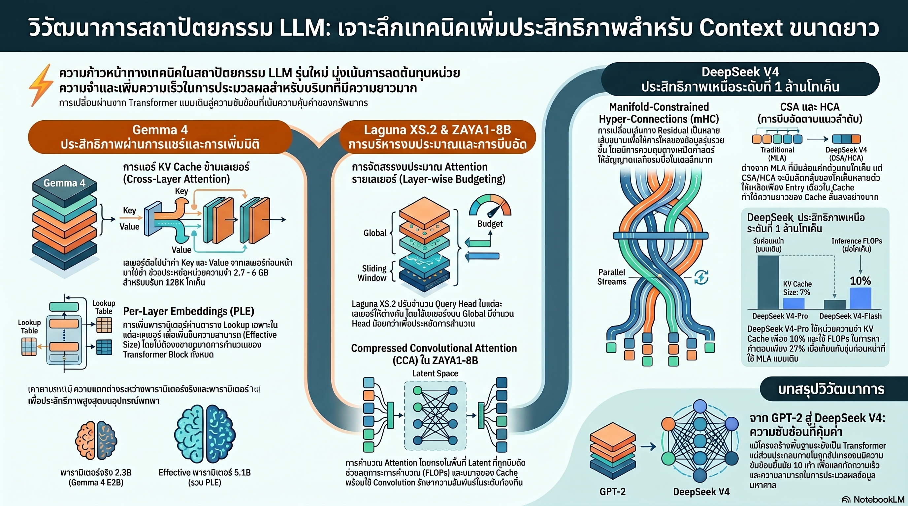

[กลับไปที่หน้าหลัก](../README.md)

สวัสดีครับเพื่อนๆ ที่ติดตามวงการ AI! วันนี้มาในหัวข้อที่นักพัฒนาปวดหัวที่สุดในยุค Long Context: KV Cache ที่กินหน่วยความจำมหาศาล ครับ งานวิจัยและโมเดลใหม่หลายตัวพร้อมกันกำลังเสนอทางออกที่น่าสนใจมาก ตั้งแต่ Cross-Layer KV Sharing ของ Gemma 4, Per-Layer Embeddings ที่ทำให้ 2.3B ฉลาดเท่า 5.1B, Attention Budgeting ของ Laguna, CCA ของ ZAYA1 ไปจนถึง mHC+HCA ของ DeepSeek V4 ที่รัน 1M Token ด้วย KV Cache เพียง 10% ของรุ่นก่อน ครับ

คุณเคยสังเกตไหมครับว่า ปัญหาที่ทำให้ Long Context LLM แพงและช้าไม่ได้อยู่ที่ Attention Computation อย่างเดียว แต่อยู่ที่ KV Cache ที่ต้องเก็บ Key-Value ของทุก Token ในทุก Layer ไว้ตลอดเวลาครับ? ยิ่งบริบทยาว ยิ่ง Cache หนัก และในโมเดลที่มี 40+ Layer ข้อมูลชุดเดิมถูกเก็บซ้ำหลายสิบครั้งโดยไม่จำเป็นเสมอไปครับ

คุณรู้ไหมครับว่า Per-Layer Embeddings (PLE) ของ Gemma 4 ทำให้ตัวเลข "Effective Parameters" และ "Total Parameters" ต่างกันได้ถึงสองเท่าครับ รุ่น E2B มี Effective Parameters เพียง 2.3B แต่ Total รวมถึง 5.1B เพราะ PLE เพิ่มความจุผ่าน Embedding Table แยกต่างหากที่ใช้ FLOPs ต่ำกว่า Matrix Multiplication ปกติมาก ทำให้โมเดลฉลาดขึ้นโดยที่ความเร็วไม่ลดลงครับ?

และคุณเคยนึกไหมครับว่า DeepSeek V4 แก้ปัญหา 1M Token Context ด้วย HCA (Heavily Compressed Attention) ที่บีบอัด 128 Tokens เหลือเพียง 1 Entry ครับ? มันเหมือนการทำ "สรุปของสรุป" ให้โมเดลมองเห็นภาพกว้างของล้าน Token ได้ในราคาถูก ในขณะที่ CSA จัดการบริบทระยะกลาง และ mHC เพิ่ม Residual Path ขนาน n=4 สายเพื่อให้ข้อมูลไหลได้ดีขึ้นครับ

งานวิจัยเหล่านี้กำลังบอกว่า: "การแข่งขัน AI ในยุคนี้ไม่ได้วัดกันที่ใครสร้างโมเดลใหญ่ที่สุด แต่ที่ใครรู้จักบริหารทรัพยากรทุก Byte และทุก FLOP ได้ชาญฉลาดที่สุดครับ"

========================================

🤔 ทบทวนความเชื่อเดิมๆ: สิ่งที่เราคิดเกี่ยวกับ KV Cache และ Transformer Architecture

▪ "ทุก Layer ต้องคำนวณและเก็บ KV ของตัวเอง — นั่นคือหัวใจของ Transformer Multi-head Attention" → Cross-Layer KV Sharing ของ Gemma 4 พิสูจน์ว่าเลเยอร์ส่วนใหญ่สามารถใช้ KV จากเลเยอร์ก่อนหน้าได้โดยยังคำนวณ Query ของตัวเองอยู่ครับ ใน E2B เพียง 15 ใน 35 Layer คำนวณ KV เอง ลด Cache ลงเกือบครึ่ง ประหยัดได้ถึง 2.7GB ที่ 128K Token ครับ

▪ "จำนวนพารามิเตอร์คือตัวชี้วัดความฉลาด — โมเดล 5B ต้องทำงานได้ดีกว่า 2B เสมอ" → PLE ทำให้ Effective Parameters ต่างจาก Total Parameters ได้สองเท่าครับ Gemma 4 E2B มีความเร็วของโมเดล 2.3B แต่เก็บความรู้ได้เท่า 5.1B เพราะ PLE เป็น Lookup-style ที่ใช้ FLOPs ต่ำกว่า Matrix Multiplication มากครับ — โมเดลที่ "ฉลาดแต่ไม่ช้าลง" เป็นไปได้ครับ

▪ "ทุก Layer ควรมองบริบทได้กว้างเท่ากัน — ยิ่ง Global Attention มากยิ่งดี" → Layer-Wise Attention Budgeting ของ Laguna XS.2 แสดงว่า 30 ใน 40 Layer ที่เน้น Local Context (Sliding-window 512 tokens) สามารถมี 8 Query Heads ได้ ในขณะที่ 10 Global Layers มีแค่ 6 Heads ครับ การแบ่งงบตามความจำเป็นให้ผลดีกว่าการแจกเท่ากันทุก Layer ครับ

▪ "Attention ต้องคำนวณใน Full-dimensional Space เพื่อรักษาคุณภาพ — Compression ทำให้เสียรายละเอียดสำคัญ" → CCA ของ ZAYA1 คำนวณ Attention ใน Compressed Latent Space โดยตรง แล้วแก้ปัญหา Local Context ที่อาจหายไปด้วย Convolutional Mixing ที่ Q และ K ครับ ผลคือลดทั้ง KV Cache และ Prefill FLOPs ไปพร้อมกันโดยไม่เสียคุณภาพครับ

ความจริงที่น่าคิดคือ: "Transformer ที่เราใช้อยู่วันนี้เริ่มไม่เหมือน Transformer ดั้งเดิมแล้วครับ ทั้ง Cross-layer Sharing, PLE, HCA และ mHC ล้วนเป็นการ 'ศัลยกรรม' สถาปัตยกรรมครั้งใหญ่ที่เกิดขึ้นพร้อมกันในหลายทีมครับ"

========================================

🧠 พื้นฐานที่ต้องเข้าใจก่อน: KV Sharing, PLE, Attention Budgeting, CCA, และ mHC+HCA

=== นวัตกรรมที่ 1: Cross-Layer KV Sharing ใน Gemma 4 ===

ใน Standard Transformer ทุก Layer มี KV Cache ของตัวเองครับ ถ้ามี 35 Layer และ Context ยาว 128K Token หน่วยความจำที่ต้องใช้คูณด้วย 35 ทันทีครับ

Gemma 4 E2B แก้ปัญหานี้ด้วยการให้เพียง 15 Layer แรกคำนวณ KV เองครับ อีก 20 Layer ที่เหลือ "หยิบ" KV จาก Layer ก่อนหน้ามาใช้โดยตรง แต่ยังคำนวณ Query ของตัวเองอยู่ครับ ทำให้แต่ละ Layer ยังมี Attention Pattern เป็นอิสระ เพียงแต่ไม่ต้องสร้าง Key-Value ซ้ำ

ผลลัพธ์คือลด KV Cache ลงได้เกือบครึ่งครับ E2B ประหยัดได้ 2.7GB และ E4B ประหยัดได้ 6GB ที่ Context ยาว 128K Token ตัวเลขนี้มีความหมายมากสำหรับการ Deploy บนอุปกรณ์ที่หน่วยความจำจำกัดครับ

=== นวัตกรรมที่ 2: Per-Layer Embeddings และความหมายของ Effective Parameters ===

PLE คือคำตอบของ Google สำหรับคำถามว่า "จะเพิ่มความจุโมเดลโดยไม่เพิ่ม FLOPs ได้ไหมครับ?"

วิธีการทำงานคือในแต่ละ Layer หลังจาก FFN เสร็จแล้ว Hidden State จะถูกใช้เป็น Gate เพื่อดึง PLE Vector จาก Embedding Table ที่แยกต่างหากของ Layer นั้นครับ แล้วนำมาบวกกลับเข้า Residual Path ตามลำดับ [Attention] → [FFN] → [Gated PLE] ครับ

ความแตกต่างสำคัญจาก FFN ปกติคือ PLE เป็น Lookup-style ครับ การดึงข้อมูลจาก Embedding Table ใช้ FLOPs น้อยกว่า Matrix Multiplication มากครับ ดังนั้น Parameter ใน PLE จึงไม่เพิ่มค่าใช้จ่ายการคำนวณในระดับเดียวกับ Parameter ใน Attention หรือ FFN ครับ

นั่นคือเหตุผลที่ E2B มี Effective Parameters เพียง 2.3B (เร็วเท่าโมเดลขนาดนั้น) แต่ Total Parameters ถึง 5.1B (เก็บความรู้ได้มากเท่านั้น) ครับ

=== นวัตกรรมที่ 3: Layer-Wise Attention Budgeting ใน Laguna XS.2 ===

Poolside ออกแบบ Laguna XS.2 ด้วยแนวคิดว่า "ไม่ใช่ทุก Layer ต้องมองกว้างเท่ากัน" ครับ

40 Layers แบ่งออกเป็นสองกลุ่มครับ กลุ่มแรก 30 Layers ทำ Sliding-window Attention ที่มองบริบทแค่ 512 Token รอบตัวเองครับ เนื่องจากงานส่วนใหญ่ของ Layer กลุ่มนี้คือการสร้าง Local Pattern จึงได้รับงบ Query Heads สูงถึง 8 Heads ครับ กลุ่มที่สอง 10 Layers ทำ Global Attention ที่มองทั้ง Sequence ซึ่งแพงกว่ามาก จึงถูกจำกัดไว้ที่ 6 Query Heads เพื่อชดเชยต้นทุนครับ

KV Heads ถูกคงไว้ที่ 8 คงที่ทุก Layer ครับ ทำให้สามารถใช้ KV Cache Pool ร่วมกันได้อย่างมีประสิทธิภาพและหลีกเลี่ยง Fragmentation ครับ

=== นวัตกรรมที่ 4: CCA ใน ZAYA1 — คำนวณใน Compressed Space โดยตรง ===

CCA แตกต่างจาก KV Compression แบบอื่นตรงที่มันไม่แค่ "บีบข้อมูลก่อนเก็บ" แต่คำนวณ Attention ทั้งกระบวนการใน Compressed Latent Space ตั้งแต่ต้นครับ

ปัญหาของการบีบอัดก่อนคำนวณคือ Local Context ที่ละเอียดอาจหายไปครับ CCA แก้ปัญหานี้ด้วยการใส่ Convolutional Mixing เข้าไปที่ Query และ Key ก่อนทำ Attention ครับ Convolution เก่งในการจับ Local Pattern ตามลำดับ ดังนั้นมันจึงช่วยฟื้นฟู Local Context ที่อาจสูญหายจากการ Compression ครับ

ผลลัพธ์คือลดทั้ง KV Cache Size และ Prefill FLOPs ไปพร้อมกันครับ สำหรับโมเดลที่มี Active Parameters เพียง 700M อย่าง ZAYA1 นี่คือกุญแจสำคัญที่ทำให้สามารถรัน Long Context ได้โดยไม่เสียคุณภาพครับ

=== นวัตกรรมที่ 5: mHC + CSA/HCA ใน DeepSeek V4 ===

DeepSeek V4 นำเสนอสามนวัตกรรมที่ทำงานร่วมกันเพื่อรัน 1M Token Context ครับ

mHC (Manifold-Constrained Hyper-Connections): แทนที่จะมี Residual Stream เส้นเดียว mHC เพิ่มเป็น n=4 Parallel Paths ครับ แต่ละ Path ส่งข้อมูลอิสระจากกัน ก่อนที่จะถูก Aggregate กลับมาครับ Manifold Constraint ควบคุมให้ทั้ง 4 Paths อยู่ใน Manifold เดียวกัน ป้องกัน Divergence และรักษาความเสถียรของ Training ครับ ผลลัพธ์คือ Throughput เพิ่มขึ้นโดยที่ Latency แทบไม่เพิ่มครับ

CSA (Compressed Sparse Attention): บีบอัดบริบทระดับกลางและเลือก Attend เฉพาะส่วนที่ Sparse Selector ระบุว่าสำคัญครับ เหมาะสำหรับส่วนกลางของ Context ที่ไม่ใช่ Local ไม่ใช่ Global ครับ

HCA (Heavily Compressed Attention): นี่คือหัวใจของ 1M Token Capability ครับ HCA บีบอัด 128 Tokens เหลือเป็น 1 Entry ซึ่งเปรียบเหมือนการสร้าง "สรุปของสรุป" ที่ให้โมเดลมองเห็นภาพรวมของล้าน Token ได้ในราคา Attention ที่ถูกลงมหาศาลครับ

ผลรวมของทั้งสามครับ: DeepSeek V4-Pro ใช้ KV Cache เหลือเพียง 10% และใช้ FLOPs ในการ Inference เพียง 27% เมื่อเทียบกับรุ่นก่อนที่ Context 1M Token ครับ

========================================

🎯 ประเด็นที่ควรคิดต่อ

— ห้าเทคนิคนี้มีทิศทางเดียวกันแต่มาจากทีมต่างกัน: Cross-layer Sharing (Google), PLE (Google), Attention Budgeting (Poolside), CCA (Zyphra), mHC+HCA (DeepSeek) ล้วน Converge ที่คำถามเดียวกัน — "จะทำให้ KV Cache เล็กลงโดยไม่เสียความสามารถได้อย่างไร?" ครับ การ Convergence นี้บอกว่าปัญหา Memory Efficiency คือ Bottleneck จริงๆ ที่ทุกทีมกำลังแก้พร้อมกันครับ

— Effective Parameters แยกจาก Total Parameters คือ Metric ใหม่ที่ต้องจับตา: PLE ทำให้เราต้องถามว่า "Parameter นี้เพิ่ม FLOPs ด้วยไหม?" ไม่ใช่แค่นับจำนวนครับ ในอนาคตการเปรียบเทียบโมเดลอาจต้องใช้ทั้ง Effective Parameters, Total Parameters, FLOPs per Token, และ KV Cache Size at Context Length ที่กำหนดครับ ตัวเลขเดียวไม่พอแล้วครับ

— คำถามที่สำคัญที่สุด: HCA ของ DeepSeek บีบ 128 Tokens เป็น 1 Entry เพื่อมองภาพกว้างของล้าน Token ครับ แต่การบีบอัดขนาดนั้นต้องทิ้งข้อมูลบางอย่างไปแน่นอนครับ คำถามคือ "ข้อมูลอะไรที่หายไป และโมเดลรู้ว่าตัวเองไม่รู้ไหมครับ?" — ถ้า Compressed Memory ทำให้โมเดลตอบผิดแต่มั่นใจ นั่นอาจเป็นปัญหาที่สำคัญกว่า Memory Efficiency ครับ

#KVCache #Transformer #Gemma4 #DeepSeekV4 #ZAYA1 #Laguna #AttentionMechanism #LLMEfficiency #AIArchitecture #LongContext #PerLayerEmbeddings #CompressedAttention #MachineLearning
