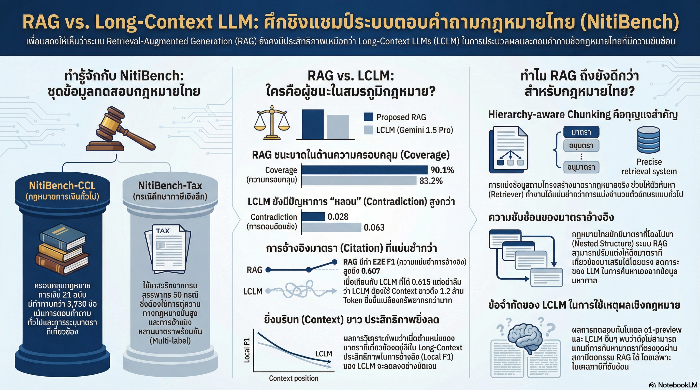

[กลับไปที่หน้าหลัก](../README.md)

สวัสดีครับเพื่อนๆ! วันนี้เรามาดูงานวิจัย AI ของไทยอีกชิ้นหนึ่งกันครับ นั่นก็คือ "NitiBench" เกณฑ์มาตรฐานสำหรับทดสอบความสามารถของ AI ในการตอบคำถามกฎหมายไทย!

คุณเคยได้ยินเรื่อง "Thanoy" (ท่านอยท์) ระบบ AI ที่ช่วยตอบคำถามกฎหมายไทยไหมครับ? ฟังดูเจ๋งนะ แต่ปัญหาจริงๆ ของระบบพวกนี้คือ AI มักจะ "หลอน" (Hallucination) แต่งข้อมูลขึ้นมาเอง หรือไม่ก็อ้างอิงมาตรากฎหมายผิด!

ในวงการกฎหมาย ความผิดพลาดเพียงมาตราเดียวอาจหมายถึงความเสียหายมหาศาล ไม่เหมือนงานอื่นที่ผิดนิดหน่อยยังไม่เป็นไร นี่คือเหตุผลที่กฎหมายเป็นหนึ่งใน "ปราการด่านสุดท้าย" ที่ AI พยายามจะเอาชนะ

วันนี้เรามาดู 5 บทเรียนสำคัญจาก NitiBench ที่นักพัฒนาและนักกฎหมายต้องรู้กันครับ!

========================================

🤔 ทบทวนปัญหาเดิมๆ: AI กับกฎหมายไทยมีปัญหาอะไรบ้าง?

ก่อนที่เราจะไปดูบทเรียนจาก NitiBench มาทำความเข้าใจปัญหาก่อนนะครับ:

ปัญหาของ AI ในการตอบคำถามกฎหมายไทย:

▪ "หลอน" (Hallucination): แต่งข้อมูลขึ้นมาเอง อ้างมาตราที่ไม่มีจริง
▪ อ้างอิงมาตราผิด: อ้างถูกหมายเลขแต่เนื้อหาไม่ตรง หรืออ้างมาตราที่ไม่เกี่ยวข้อง
▪ ตีความผิด: อ่านมาตราได้แต่ตีความหมายผิด
▪ ขาดความเชื่อมโยง: ไม่เห็นความสัมพันธ์ระหว่างมาตราต่างๆ

ตัวอย่างปัญหาจริง:

คำถาม: "การขายที่ดินต้องเสียภาษีอะไรบ้าง?"

AI ตอบผิด: "ต้องเสียภาษี VAT ตามมาตรา 123 แห่งประมวลรัษฎากร"
▸ ผิดเพราะ: การขายที่ดินไม่ต้องเสีย VAT แต่เสียภาษีธุรกิจเฉพาะ
▸ ผิดเพราะ: ไม่มีมาตรา 123 ที่เกี่ยวข้อง (หลอน!)

นี่คือปัญหาที่ NitiBench พยายามจะวัดและแก้ไขครับ!

========================================

1. 📚 การแบ่งข้อความที่เข้าใจโครงสร้างกฎหมาย: กำแพง 20%

บทเรียนแรกที่สำคัญมากคือ "วิธีการแบ่งข้อความกฎหมาย" ครับ

=== ปัญหาของการแบ่งข้อความแบบทั่วไป ===

[Naive Chunking (การแบ่งข้อความแบบธรรมดา)]

วิธีการทั่วไป:
▸ แบ่งตามจำนวนคำ: เช่น ทุกๆ 500 คำ
▸ แบ่งตามบรรทัด: เช่น ทุกๆ 20 บรรทัด
▸ ไม่สนใจโครงสร้างของเนื้อหา

ปัญหาที่เกิดขึ้น:

สมมติมีมาตรา 77/2 แห่งประมวลรัษฎากร ที่มีเนื้อหายาว:

มาตรา 77/2 การขายสินค้าหรือการให้บริการในราชอาณาจักร...
(1) การขายสินค้า หมายความว่า...
(2) การให้บริการ หมายความว่า...
(3) อัตราภาษี...
(4) การยกเว้น...
(5) วิธีการคำนวณ...

ถ้าแบ่งแบบธรรมดา:
▸ ชิ้นที่ 1: มาตรา 77/2... (1) การขายสินค้า... (2) การให้บริการ...
▸ ชิ้นที่ 2: ...(3) อัตราภาษี... (4) การยกเว้น... (5) วิธีการคำนวณ...

ผลคือ:
▸ ชิ้นที่ 1 มีแค่คำจำกัดความ ไม่มีวิธีคำนวณ
▸ ชิ้นที่ 2 มีวิธีคำนวณ แต่ไม่รู้ว่าคำนวณอะไร
▸ ทั้งสองชิ้นไม่สมบูรณ์! AI จะสับสน!

นี่คือการทำลาย "ความเป็นเอกเทศทางกฎหมาย" (Legal Atomicity)

=== Hierarchy-aware Chunking (การแบ่งข้อความที่เข้าใจโครงสร้าง) ===

วิธีการที่ถูกต้อง:
▸ แบ่งตามโครงสร้างมาตรา: ทั้งมาตรารวมกันเป็นชิ้นเดียว
▸ รักษาความสมบูรณ์: ตัวบท-การกระทำ-บทลงโทษ อยู่ชิ้นเดียวกัน
▸ เคารพ Hierarchy: หมวด > มาตรา > วรรค > อนุวรรค

ผลลัพธ์:
▸ แต่ละชิ้นมีข้อมูลครบถ้วนในตัวเอง
▸ AI เข้าใจได้ง่ายขึ้น
▸ ไม่เกิดความสับสน

=== กำแพง 20%: ความท้าทายที่แท้จริง ===

จากการวิจัยพบว่า ประมาณ 20% ของมาตรากฎหมายทั้งหมดมีความยาวเกินกว่าที่การแบ่ง Chunk แบบธรรมดาจะครอบคลุมได้หมดในชิ้นเดียว!

นี่คือ "กำแพง 20%" ที่ทำให้ AI ส่วนใหญ่สอบตก!

ตัวอย่างมาตราที่ยาวมาก:
▸ มาตราเกี่ยวกับภาษีเงินได้บุคคลธรรมดา
▸ มาตราเกี่ยวกับภาษีมูลค่าเพิ่ม
▸ มาตราเกี่ยวกับการยกเว้นภาษี

ถ้าแบ่งผิดวิธี:
▸ มาตราถูก "สับ" ออกเป็นส่วนๆ
▸ AI สูญเสียความเชื่อมโยง
▸ ตอบคำถามผิด!

"Each chunk comprehensively represents a self-contained legal concept or rule, preserving the integrity of the original document."

สรุป: การแบ่งข้อความต้องเข้าใจโครงสร้างกฎหมาย ไม่ใช่แค่ตัดตามจำนวนคำ!

========================================

2. 🔍 RAG ยังคงครองแชมป์: Long-Context LLMs ยังไม่พอ

บทเรียนที่สองนี้จะทำลายความเชื่อผิดๆ ที่หลายคนมีครับ

=== ความเชื่อผิดที่หลายคนมี ===

"เมื่อเรามีโมเดลอย่าง Gemini 1.5 Pro ที่อ่านได้ถึง 2 ล้าน Token เราก็ไม่จำเป็นต้องทำระบบ RAG อีกต่อไป แค่ยัดกฎหมายทั้งเล่มเข้าไปก็จบ!"

ความจริงคือ: ผิด! RAG ยังคงทำงานได้ดีกว่ามาก!

=== RAG คืออะไร? ===

RAG (Retrieval-Augmented Generation) คือระบบที่ทำงาน 2 ขั้นตอน:

ขั้นตอนที่ 1: Retrieval (สืบค้น)
▸ เมื่อมีคำถาม ระบบจะสืบค้นหามาตรากฎหมายที่เกี่ยวข้อง
▸ ดึงเฉพาะมาตราที่จำเป็นมา (เช่น 5-10 มาตรา)
▸ ไม่เอาทั้งเล่ม!

ขั้นตอนที่ 2: Generation (ตอบคำถาม)
▸ เอามาตราที่ดึงมาให้ AI อ่าน
▸ AI ตอบคำถามจากมาตราเหล่านั้น
▸ ได้คำตอบที่แม่นยำ

=== Long-Context LLM คืออะไร? ===

Long-Context LLM (LCLM) คือโมเดลที่อ่านข้อความยาวๆ ได้มาก เช่น:
▸ Gemini 1.5 Pro: อ่านได้ 2 ล้าน tokens
▸ Claude 3.5: อ่านได้ 200,000 tokens

แนวคิดคือ: ยัดกฎหมายทั้งเล่มเข้าไปเลย แล้ว AI จะอ่านและตอบเอง

=== เปรียบเทียบ RAG กับ LCLM ===

มาดูข้อดี-ข้อเสียกันครับ:

[RAG-based System (ระบบ RAG)]

ข้อดี:
▸ ประสิทธิภาพสูง: ตอบคำถามได้แม่นยำกว่า
▸ การอ้างอิงแม่นยำ: บอกได้ชัดว่าใช้มาตราไหน
▸ เหตุผลลึกซึ้ง: คิดได้ดีกว่าเพราะไม่มี Noise
▸ ประหยัดต้นทุน: ใช้ Token น้อยกว่ามาก

ข้อเสีย:
▸ ซับซ้อน: ต้องทำ Retriever, Reranker
▸ ต้องดูแล: ถ้า Retriever ห่วย ตอบผิด

[Long-Context LLM (LCLM)]

ข้อดี:
▸ สะดวก: แค่ยัดข้อมูลเข้าไปก็เสร็จ
▸ ไม่ต้องทำ Retriever: ไม่ซับซ้อน

ข้อเสีย:
▸ ประสิทธิภาพต่ำกว่า: ตอบคำถามไม่แม่นเท่า RAG
▸ การอ้างอิงแย่: เมื่อ Context ยาวเกิน 1.2M Tokens อ้างอิงผิดมาก
▸ เหตุผลตื้นเขิน: มี Noise เยอะ คิดไม่ดี
▸ แพงมาก: ต้นทุน Token สูงมหาศาล

=== ทำไม LCLM ถึงแย่กว่า? ===

จุดตายของ LCLM คือ "Performance Degradation" หรือประสิทธิภาพที่ถดถอย

เมื่อยัดข้อมูลกฎหมายจำนวนมหาศาลเข้าไป:
▸ AI สับสนในการอ้างอิงมาตราที่ถูกต้อง
▸ แม้จะมีข้อมูลอยู่ในมือก็ตาม
▸ เหมือนให้คนอ่านหนังสือทั้งเล่มแล้วตอบคำถามทันที

เปรียบเทียบ:

RAG = ครูมอบหมายให้อ่านบทที่ 5 แล้วตอบคำถาม
▸ นักเรียนอ่านแค่บทที่ 5 (เฉพาะเรื่อง)
▸ โฟกัสได้ดี ตอบได้แม่นยำ

LCLM = ครูให้อ่านหนังสือทั้งเล่ม 1,000 หน้า แล้วตอบคำถาม
▸ นักเรียนสับสน มีข้อมูลเยอะเกินไป
▸ ไม่รู้ว่าจะโฟกัสตรงไหน
▸ ตอบได้ไม่แม่นยำเท่า

สรุป: RAG ยังคงเป็นวิธีที่ดีที่สุดสำหรับงานกฎหมาย!

========================================

3. 🎯 ปัญหา "มาตรา 77/2" และการสืบค้นมาตราทั่วไป

บทเรียนที่สามนี้เป็นบทเรียนที่ล้ำค่าที่สุดจาก NitiBench ครับ

=== Generic Section Retrieval Challenge คืออะไร? ===

นี่คือปัญหาที่โมเดลระดับโลกอย่าง Claude 3.5 Sonnet หรือ GPT-4o ก็ "ตกม้าตาย" ได้!

ปัญหาคือ: ระบบมักจะพลาดมาตรา "ทั่วไป" หรือ "หัวใจ" ของเรื่อง แต่ไปหามาตรา "เฉพาะเจาะจง" ที่มีคีย์เวิร์ดตรงกับคำถามมาแทน

=== ตัวอย่างจริงที่เกิดขึ้น ===

คำถาม: "การขายสารเคมีและเวชภัณฑ์สัตว์ต้องเสียภาษีมูลค่าเพิ่มหรือไม่?"

[สิ่งที่ระบบทำผิด]

Retriever (ตัวสืบค้น) วิ่งไปหา:
▸ มาตราที่เกี่ยวกับ "สารเคมี" โดยตรง
▸ มาตราที่เกี่ยวกับ "เวชภัณฑ์สัตว์" โดยตรง
▸ เพราะมีคีย์เวิร์ดตรงเป้า!

แต่พลาด:
▸ มาตรา 77/2 แห่งประมวลรัษฎากร
▸ ซึ่งเป็น "หัวใจ" ที่บอกว่า "การขายสินค้าหรือให้บริการในราชอาณาจักร... อยู่ในบังคับต้องเสียภาษีมูลค่าเพิ่ม"

[สิ่งที่ควรทำ]

ระบบควรหา:
▸ มาตรา 77/2 (บททั่วไป) = หัวใจของเรื่อง
▸ มาตราเกี่ยวกับสารเคมี (บทเฉพาะ) = รายละเอียด
▸ มาตราเกี่ยวกับเวชภัณฑ์สัตว์ (บทเฉพาะ) = รายละเอียด

ต้องมีทั้ง "หัว" และ "หาง" ถึงจะตอบได้ถูก!

=== ทำไมถึงพลาด? ===

เหตุผลที่มาตรา 77/2 ถูกพลาด:
▸ ไม่มีคีย์เวิร์ดเฉพาะเจาะจง (ไม่มีคำว่า "สารเคมี" หรือ "เวชภัณฑ์สัตว์")
▸ เป็นมาตราทั่วไป (Generic) ที่ใช้กับทุกกรณี
▸ แต่เป็น "หัวใจ" ที่ขาดไม่ได้!

มาตรา 77/2 คือ "Head" ของสายโซ่เหตุผล แต่มันไม่มีคีย์เวิร์ดเฉพาะเจาะจง

=== 3 สาเหตุหลักที่ AI สอบตกวิชาภาษี ===

[1] Hidden Hierarchical Information (ข้อมูลลำดับชั้นที่ซ่อนอยู่)

ปัญหา:
▸ มาตราที่เนื้อหาคล้ายกันแต่อยู่คนละหมวด
▸ เช่น "ขั้นตอนการประเมิน" vs "ภาษีมูลค่าเพิ่ม"
▸ AI สับสน ไม่รู้ว่าควรใช้มาตราไหน

ตัวอย่าง:
▸ มาตรา A: การประเมินภาษีเงินได้
▸ มาตรา B: การประเมินภาษีมูลค่าเพิ่ม
▸ ทั้งสองมาตราใช้คำว่า "การประเมิน" เหมือนกัน
▸ แต่อยู่คนละหมวด! AI มักจะสับสน

[2] Nested Structure (โครงสร้างแบบซ้อน)

ปัญหา:
▸ การอ้างอิงแบบโยงกันเป็นทอดๆ (Cross-referencing)
▸ มาตรา A อ้างถึงมาตรา B, มาตรา B อ้างถึงมาตรา C
▸ AI ไม่สามารถไล่สายได้เอง

ตัวอย่าง:
▸ มาตรา 77/2 บอกว่า "ต้องเสียภาษีมูลค่าเพิ่ม"
▸ แต่ต้องดูมาตรา 81 ว่า "อัตราเท่าไหร่"
▸ และต้องดูมาตรา 82 ว่า "มีการยกเว้นไหม"
▸ ต้องอ่านทั้งสามมาตราถึงจะตอบได้ครบ!

[3] Complex Queries (คำถามที่ซับซ้อน)

ปัญหา:
▸ คำถามภาษีจริงมีความยาวเฉลี่ยถึง 996 ตัวอักษร!
▸ ยากต่อการแปลงเป็น Vector ที่แม่นยำ
▸ คีย์เวิร์ดที่สำคัญกระจัดกระจายทั่วคำถาม

ตัวอย่างคำถามจริง:
"บริษัทผลิตสารเคมีและเวชภัณฑ์สัตว์ มีรายได้จากการขายสินค้าในประเทศ 10 ล้านบาท และส่งออกไปต่างประเทศ 5 ล้านบาท ต้องเสียภาษีมูลค่าเพิ่มอย่างไร และมีการยกเว้นไหม และถ้ามีการยกเว้น ต้องทำอย่างไรบ้าง..."

คำถามยาวมาก มีหลายประเด็น:
▸ สารเคมี + เวชภัณฑ์สัตว์
▸ ขายในประเทศ + ส่งออก
▸ ภาษีมูลค่าเพิ่ม + การยกเว้น
▸ วิธีการดำเนินการ

AI ต้องเข้าใจทุกประเด็นพร้อมกัน ถึงจะตอบได้ถูก!

สรุป: งานภาษีไทยยากมาก แม้แต่ AI ระดับโลกก็ตกม้าตายได้!

========================================

4. 💰 ทางลัดราคาประหยัด: Auto-Finetuning

บทเรียนที่สี่นี้เป็นข่าวดีสำหรับนักพัฒนาชาวไทยครับ!

=== ปัญหาของการสร้างข้อมูลฝึก AI ===

ในภาษาที่มีทรัพยากรจำกัด (Resource-constrained languages) อย่างภาษาไทย การสร้างข้อมูลเพื่อสอน AI นั้นแพงมาก!

ต้นทุนจริงจาก NitiBench:
▸ จ้างผู้เชี่ยวชาญทางกฎหมาย 34 คน
▸ สร้างและตรวจสอบชุดข้อมูล
▸ ค่าใช้จ่ายรวม: $8,076 (ประมาณ 274,240 บาท)

นี่แพงมาก! โดยเฉพาะสำหรับ Startup หรือทีมเล็กๆ

=== Auto-Finetuning: ทางลัดที่คุ้มค่า ===

นักวิจัยพบวิธีที่ลดต้นทุนได้มหาศาล นั่นคือ Auto-Finetuning

แนวคิดคือ: ใช้ AI "รุ่นพี่" มาช่วยสอนโมเดล "รุ่นน้อง"!

วิธีการ:
▸ ใช้ BGE-M3 Reranker (โมเดลที่เก่งแล้ว) เป็นครู
▸ สร้างข้อมูลฝึกโดยอัตโนมัติ
▸ ใช้ข้อมูลนี้ฝึกโมเดลรุ่นน้อง

=== BGE-M3 คืออะไร? ===

BGE-M3 เป็นโมเดล Reranker ที่มีโครงสร้าง "Three-Headed" หรือ 3 หัว:

[Head ที่ 1: Dense]
▸ ใช้ Vector เข้มข้น
▸ เข้าใจความหมายเชิงลึก

[Head ที่ 2: Multi-vector/ColBERT-style]
▸ ใช้ Vector หลายตัว
▸ เข้าใจความหมายละเอียด

[Head ที่ 3: Sparse/BM25-style]
▸ ใช้คีย์เวิร์ด
▸ เข้าใจความหมายตรงๆ

รวมกันแล้ว = เก่งมาก!

=== กระบวนการ Auto-Finetuning ===

ขั้นตอนที่ 1: ให้ BGE-M3 ให้คะแนน
▸ มีคำถามกฎหมาย 1 ข้อ
▸ มีมาตราผู้สมัคร 100 มาตรา
▸ BGE-M3 ให้คะแนนว่ามาตราไหนเกี่ยวข้องมากน้อยแค่ไหน

ขั้นตอนที่ 2: สร้างข้อมูลฝึก
▸ เอาคะแนนที่ BGE-M3 ให้มาเป็นข้อมูลฝึก
▸ เช่น มาตรา A ได้ 0.95 (เกี่ยวข้องมาก), มาตรา B ได้ 0.12 (เกี่ยวข้องน้อย)

ขั้นตอนที่ 3: ฝึกโมเดลรุ่นน้อง
▸ ใช้ข้อมูลที่สร้างขึ้นฝึกโมเดลใหม่
▸ โมเดลใหม่เรียนรู้จาก "ครู BGE-M3"

=== ผลลัพธ์ ===

ผลลัพธ์ที่ได้:
▸ ความแม่นยำใกล้เคียงกับการใช้มนุษย์ผู้เชี่ยวชาญตรวจ!
▸ แต่ลดต้นทุนไปได้มหาศาล
▸ ไม่ต้องจ้างผู้เชี่ยวชาญ 34 คน

เปรียบเทียบต้นทุน:

Human-Finetuning (ใช้มนุษย์):
▸ ต้นทุน: $8,076 (274,240 บาท)
▸ ความแม่นยำ: สูงมาก
▸ เวลา: นานมาก

Auto-Finetuning (ใช้ AI):
▸ ต้นทุน: เกือบฟรี (แค่ค่าประมวลผล)
▸ ความแม่นยำ: ใกล้เคียงกับมนุษย์!
▸ เวลา: เร็วมาก

นี่คือโอกาสทองสำหรับนักพัฒนาชาวไทย:
▸ สร้าง Legal AI ได้ในงบประมาณที่จำกัด
▸ ไม่ต้องมีเงินเป็นแสน
▸ แค่มีโมเดลที่เก่งมาช่วยก็พอ!

========================================

5. ⚠️ คำเตือน: Context มากขึ้น ≠ คำตอบดีขึ้น

บทเรียนสุดท้ายเป็นคำเตือนสำคัญมากครับ!

=== ความเชื่อผิดที่หลายคนมี ===

"ยิ่งดึงข้อมูลมาเยอะ AI ก็ยิ่งตอบได้ดีขึ้น"

ความจริง: ผิด! บางทีข้อมูลมากเกินไปกลับทำให้แย่ลง!

=== NitiLink: ระบบช่วยดึงมาตราอ้างอิง ===

NitiLink คือระบบที่ช่วยดึงมาตราอ้างอิงมาให้อัตโนมัติ

วิธีทำงาน:
▸ ระบบดึงมาตราที่เกี่ยวข้องมา (เช่น 5 มาตรา)
▸ แล้วดูว่ามาตราเหล่านี้อ้างถึงมาตราอื่นไหม
▸ ถ้าอ้างถึง ก็ดึงมาตราที่ถูกอ้างถึงมาด้วย
▸ จนได้มาตราทั้งหมดที่เกี่ยวข้อง

เป้าหมาย:
▸ เพิ่ม Recall (ความครอบคลุม) ให้ได้มาตราที่เกี่ยวข้องทั้งหมด

=== ผลลัพธ์ที่น่าแปลกใจ ===

แม้ NitiLink จะช่วยเพิ่ม Recall ได้ดี:
▸ ดึงมาตราที่เกี่ยวข้องได้ครบถ้วนมากขึ้น

แต่กลับทำให้ End-to-End Performance (ประสิทธิภาพรวม) แย่ลง!
▸ AI ตอบคำถามได้แย่ลงเสียอีก!

=== ทำไมถึงเป็นแบบนี้? ===

เหตุผลคือ: ข้อมูลที่ดึงมาเพิ่มขึ้นกลายเป็น "Noise" (ข้อมูลรบกวน)!

สถานการณ์ที่เกิดขึ้น:

[ก่อนใช้ NitiLink]
▸ ดึงมาตราที่เกี่ยวข้องมา 5 มาตรา
▸ ทั้ง 5 มาตราเกี่ยวข้องโดยตรง
▸ AI อ่านแล้วตอบได้ถูก

[หลังใช้ NitiLink]
▸ ดึงมาตราที่เกี่ยวข้องมา 5 มาตรา
▸ ดึงมาตราที่ถูกอ้างถึงมาอีก 10 มาตรา
▸ รวมแล้วได้ 15 มาตรา
▸ แต่ 10 มาตราที่เพิ่มมา บางมาตราไม่เกี่ยวข้องโดยตรง
▸ AI สับสน! ไม่รู้ว่าควรโฟกัสมาตราไหน
▸ ตอบผิด!

เปรียบเทียบ:

น้อยแต่แม่น = ให้นักเรียนอ่านหนังสือ 5 หน้าที่เกี่ยวข้อง
▸ โฟกัสได้ดี ตอบถูก

เยอะแต่มี Noise = ให้นักเรียนอ่านหนังสือ 15 หน้า แต่ 10 หน้าไม่ค่อยเกี่ยวข้อง
▸ สับสน ไม่รู้ว่าควรโฟกัสตรงไหน ตอบผิด

=== บทเรียนสำคัญ ===

"Context ที่มากขึ้น ไม่ได้หมายถึงคำตอบที่ดีขึ้นเสมอไป"

หัวใจสำคัญไม่ได้อยู่ที่:
❌ การดึงข้อมูลมาให้มากที่สุด

แต่อยู่ที่:
✅ การสร้าง Knowledge Graph ที่เชื่อมโยงมาตราอย่างชาญฉลาด
✅ การใช้โมเดลที่มี Reasoning สูง เพื่อกรองข้อมูล
✅ การให้เฉพาะข้อมูลที่เกี่ยวข้องโดยตรง

=== คำแนะนำสำหรับนักพัฒนา ===

เมื่อสร้างระบบ Legal AI:
▸ อย่ามุ่งแค่ดึงข้อมูลให้เยอะ
▸ มุ่งที่ดึงข้อมูลที่ "ถูกต้องและเกี่ยวข้อง" มาให้
▸ ใช้ Reranker กรองข้อมูล
▸ ใช้โมเดลที่มี Reasoning สูง

คุณภาพ > ปริมาณ เสมอ!

========================================

สรุป: อนาคตของ Legal Tech ไทย

หลังจากที่เราได้เห็นบทเรียนทั้ง 5 ข้อจาก NitiBench แล้ว มาสรุปกันครับ

=== สิ่งที่เราได้เรียนรู้ ===

[1] การแบ่งข้อความต้องเข้าใจโครงสร้างกฎหมาย
▸ ไม่ใช่แค่ตัดตามจำนวนคำ
▸ ต้องรักษาความเป็นเอกเทศของมาตรา
▸ ระวัง "กำแพง 20%" ที่มาตรายาวมาก

[2] RAG ยังคงเป็นวิธีที่ดีที่สุด
▸ ดีกว่า Long-Context LLM
▸ แม่นยำกว่า ประหยัดกว่า
▸ ถึงแม้ว่าจะซับซ้อนกว่า

[3] มาตราทั่วไปสำคัญมาก
▸ อย่าพลาดมาตราอย่างมาตรา 77/2
▸ มันคือ "หัวใจ" ของการตีความ
▸ แม้จะไม่มีคีย์เวิร์ดเฉพาะเจาะจง

[4] Auto-Finetuning ช่วยลดต้นทุน
▸ ใช้ AI สอน AI
▸ ลดต้นทุนได้มหาศาล
▸ โอกาสทองสำหรับนักพัฒนาชาวไทย

[5] คุณภาพสำคัญกว่าปริมาณ
▸ อย่ามุ่งแค่ดึงข้อมูลให้เยอะ
▸ มุ่งที่ดึงข้อมูลที่ถูกต้อง
▸ Context มากเกินไปกลับทำให้แย่ลง

=== ก้าวต่อไปของ Legal Tech ไทย ===

เราต้องเลิกสร้างแค่ "แชทบอท" แต่เป็นการสร้าง "ผู้ช่วยนักกฎหมาย" ที่:

▸ เข้าใจโครงสร้างความสัมพันธ์ของตัวบทอย่างเป็นระบบ
▸ รู้ว่ามาตราไหนเป็น "หัวใจ" มาตราไหนเป็น "รายละเอียด"
▸ สามารถไล่สายการอ้างอิงข้ามมาตราได้
▸ กรองข้อมูลที่ไม่เกี่ยวข้องออกได้
▸ ตอบคำถามได้แม่นยำและตรวจสอบได้

=== บทบาทของนักกฎหมายในยุค AI ===

ในวันที่ AI เริ่มสืบค้นกฎหมายได้แม่นยำกว่ามนุษย์ แต่ยังตีความเหตุผลที่ซับซ้อนไม่ได้ เราควรวางบทบาทของนักกฎหมายอย่างไร?

คำตอบคือ:

[บทบาทที่ AI ทำได้ดี]
▸ สืบค้นมาตรา
▸ อ้างอิงมาตราที่เกี่ยวข้อง
▸ สรุปเนื้อหามาตรา
▸ ตรวจสอบการอ้างอิงข้ามมาตรา

[บทบาทที่นักกฎหมายยังจำเป็น]
▸ ตีความกฎหมายในบริบทที่ซับซ้อน
▸ พิจารณาเจตนารมณ์ของกฎหมาย
▸ ชั่งน้ำหนักผลประโยชน์ระหว่างฝ่ายต่างๆ
▸ วางกลยุทธ์คดี
▸ เจรจาต่อรอง
▸ แนะนำและให้คำปรึกษาที่ต้องใช้ประสบการณ์

นักกฎหมายจะเปลี่ยนจาก:
▸ "ผู้ค้นหา" → "ผู้ตีความและให้คำปรึกษา"
▸ "ผู้สืบค้น" → "ผู้วางกลยุทธ์"
▸ "ผู้ทำงานรูทีน" → "ผู้เชี่ยวชาญที่ใช้ดุลยพินิจ"

=== ข้อเสนอแนะสำหรับนักพัฒนา ===

ถ้าคุณกำลังจะสร้างระบบ Legal AI ไทย:

[1] เริ่มจากการทำ RAG ที่ดี
▸ ลงทุนใน Retriever ที่เข้าใจโครงสร้างกฎหมาย
▸ ใช้ Hierarchy-aware Chunking
▸ ใช้ Reranker กรองผลลัพธ์

[2] ใช้ Auto-Finetuning
▸ ประหยัดต้นทุน
▸ ใช้โมเดลที่เก่งช่วยสอนโมเดลใหม่

[3] อย่ามุ่งแค่ปริมาณ
▸ มุ่งที่คุณภาพของข้อมูล
▸ น้อยแต่แม่นดีกว่าเยอะแต่สับสน

[4] สร้าง Knowledge Graph
▸ เชื่อมโยงความสัมพันธ์ระหว่างมาตรา
▸ ช่วยให้ AI เข้าใจการอ้างอิงข้ามมาตรา

[5] ทดสอบกับ NitiBench
▸ ใช้เป็นมาตรฐานวัดผล
▸ เปรียบเทียบกับโมเดลอื่นๆ

========================================

คำถามท้ายทาย

ในวันที่ AI สามารถสืบค้นกฎหมายได้แม่นยำและรวดเร็วกว่ามนุษย์ แต่ยังตีความเหตุผลที่ซับซ้อนและใช้ดุลยพินิจไม่ได้ คุณคิดว่า:

▸ นักกฎหมายรุ่นใหม่ควรเรียนรู้ทักษะอะไรเพิ่มเติม?
▸ คณะนิติศาสตร์ควรปรับหลักสูตรยังไง?
▸ AI จะเป็นเพื่อนร่วมงานที่ดีหรือคู่แข่งที่น่ากลัว?

นี่คือคำถามที่ทุกคนในวงการกฎหมายต้องคิดกันแล้วครับ! 🤔

========================================

อ้างอิง:
• NitiBench: Legal QA Benchmark for Thai Law
• Thanoy: Thai Legal AI System
• RAG (Retrieval-Augmented Generation)
• BGE-M3 Reranker
• Auto-Finetuning Techniques

หวังว่าบทความนี้จะช่วยให้ทุกคนเห็นว่า การสร้าง Legal AI ไทยไม่ใช่เรื่องง่าย แต่ก็ไม่ใช่เรื่องเป็นไปไม่ได้ด้วย!

ถ้ามีคำถามหรือประสบการณ์จากการพัฒนา Legal AI มาแชร์กันได้เลยนะครับ 😊
