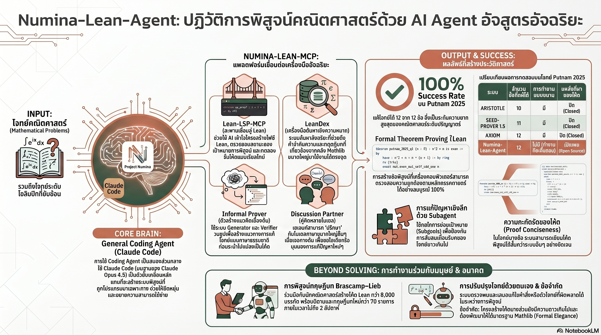

[กลับไปที่หน้าหลัก](../README.md)

สวัสดีครับเพื่อนๆ ที่ติดตามวงการ AI! วันนี้มาเรื่องที่ท้าทายคำถามพื้นฐานที่สุดในวงการคณิตศาสตร์: "AI พิสูจน์ทฤษฎีบทได้จริงหรือ?" จากความสำเร็จของ Numina-Lean-Agent ที่ทำคะแนนเต็ม 12/12 ใน Putnam 2025 การแข่งขันคณิตศาสตร์ระดับอุดมศึกษาที่โหดหินที่สุดในโลก และทำได้โดยไม่ใช้การสุ่มค้นหาแบบขนาน แต่อาศัยสถาปัตยกรรม Agentic Reasoning อย่างบริสุทธิ์ครับ

คุณเคยสงสัยไหมครับว่า สิ่งที่ทำให้ AI พิสูจน์ทฤษฎีบทคณิตศาสตร์ได้ไม่ใช่การฝึกให้มันเชี่ยวชาญคณิตศาสตร์โดยเฉพาะ แต่คือการให้มันเป็น "นักเขียนโค้ดทั่วไปที่ฉลาด" ที่มีเครื่องมือที่ออกแบบมาถูกต้อง?

คุณรู้ไหมครับว่า ในการพิสูจน์ทฤษฎีบท Brascamp-Lieb ที่มนุษย์อาจใช้เวลาเป็นทศวรรษ AI และมนุษย์ร่วมกันเขียนโค้ด Lean กว่า 8,000 บรรทัด สร้างนิยามใหม่กว่า 70 รายการ ภายในเวลาเพียงไม่กี่สัปดาห์?

และคุณเคยนึกไหมครับว่า บทพิสูจน์คณิตศาสตร์ที่ AI สร้างขึ้นยังมีช่องว่างสำคัญที่มนุษย์มีแต่ AI ยังไม่มี นั่นคือ "ความสวยงาม" และ "สง่างาม" ซึ่งอาจกลายเป็นปราการด่านสุดท้ายที่นิยามว่าทำไมนักคณิตศาสตร์มนุษย์ยังมีความหมายอยู่ครับ?

Numina-Lean-Agent กำลังพูดถึงความเปลี่ยนแปลงที่ลึกกว่าเรื่องการแก้โจทย์: ว่าในยุคที่ AI สามารถสร้างโครงสร้างตรรกะที่สมบูรณ์ตรวจสอบได้ทุกบรรทัด บทบาทของนักคณิตศาสตร์มนุษย์กำลังเลื่อนจาก "ผู้พิสูจน์" ไปสู่ "สถาปนิกทางความคิด" ครับ

========================================

🤔 ทบทวนความเชื่อเดิมๆ: สิ่งที่เราคิดเกี่ยวกับ AI กับคณิตศาสตร์ขั้นสูง

▪ "AI ที่เก่งคณิตศาสตร์ต้องถูกฝึกมาเพื่อคณิตศาสตร์โดยเฉพาะ โมเดลทั่วไปไม่มีทางสู้ Task-specific Model ที่เทรนมาถูกทาง" → Numina-Lean-Agent ใช้ Claude Opus 4.5 ซึ่งเป็น General Coding Agent ไม่ใช่โมเดลคณิตศาสตร์เฉพาะทาง และทำ 12/12 ได้โดยอาศัยการออกแบบ Tool Architecture ที่ดีผ่าน MCP ครับ

▪ "AI Agent ที่ทำคะแนนสูงในการแข่งขันคณิตศาสตร์ต้องใช้การสุ่มค้นหาจำนวนมาก (Large-scale Ensembles) หรือการประมวลผลแบบขนาน (Parallelization) เพื่อเพิ่มโอกาสถูก" → Numina-Lean-Agent ทำงานแบบ Strictly Sequential ไม่มี Parallelization ไม่มี Large-scale Ensemble และยังคงทำ 12/12 ได้ด้วย Computational Efficiency สูงกว่าระบบอื่นๆ ครับ

▪ "การพิสูจน์ทฤษฎีบทด้วย AI ต้องเริ่มจากการเขียนโค้ด Formal Proof ตั้งแต่แรก การวางแผนแบบภาษาธรรมดาก่อนไม่มีประโยชน์" → Vibe Proving ด้วย Blueprint แบบ DAG พิสูจน์ว่าการวางโครงร่างด้วยภาษาธรรมชาติก่อน แล้วค่อย Formalize ทีหลัง ทำให้ระบบยืดหยุ่นและ Debug ได้ง่ายกว่าการกระโดดเขียน Lean โค้ดตั้งแต่แรกครับ

▪ "AI ที่พิสูจน์ทฤษฎีบทได้ถูกต้องย่อมหมายความว่ามันเข้าใจคณิตศาสตร์ในระดับเดียวกับนักคณิตศาสตร์มนุษย์" → AI ยังติดขัดกับ Type Conversion พื้นฐาน เช่น Real → NNReal ที่มนุษย์ข้ามผ่านโดยไม่ต้องคิด และบทพิสูจน์ที่ได้ยังเยิ่นเย้อและขาด Formal Elegance ที่ชุมชน Mathlib ยึดถือเป็นมาตรฐานครับ

ความจริงที่น่าคิดคือ: AI ที่ "ผ่าน" การแข่งขันคณิตศาสตร์ระดับโลกกับ AI ที่ "เข้าใจ" คณิตศาสตร์อาจเป็นคนละเรื่องกัน และช่องว่างระหว่างสองอย่างนั้นคือจุดที่นักคณิตศาสตร์มนุษย์ยังมีความหมายอยู่ครับ

========================================

🧠 พื้นฐานที่ต้องเข้าใจก่อน: Lean, Theorem Proving, MCP, DAG และ Formal Elegance

=== Lean คืออะไร และทำไมถึงสำคัญ? ===

Lean = ภาษาโปรแกรมสำหรับการพิสูจน์ทฤษฎีบทอย่างเป็นทางการ (Formal Theorem Proving) ทุกบรรทัดของ Lean ถูกตรวจสอบโดยคอมไพเลอร์ที่ไม่มีการ "เชื่อใจ" ใครทั้งนั้น

ต่างจาก Proof ทั่วไป: นักคณิตศาสตร์ในวารสารเขียนหลักฐานแบบ "ให้มนุษย์เชื่อ" ซึ่งอาจมีจุดกระโดดตรรกะที่ผู้อ่านเข้าใจเอง แต่ Lean ต้องสมบูรณ์ทุกก้าว ไม่มีการละไว้ในฐานที่เข้าใจครับ

เปรียบเทียบ: เหมือนความต่างระหว่างการเขียนสัญญาโดยทนายความที่ต้องระบุทุกเงื่อนไขอย่างชัดเจน กับการตกลงด้วยวาจาระหว่างเพื่อนสนิทที่เข้าใจกันเองอยู่แล้วครับ

=== Theorem Proving vs การคำนวณธรรมดา ===

[การคำนวณธรรมดา]
▸ มีสูตร → แทนค่า → ได้คำตอบ
▸ AI ทำได้ดีมานานแล้ว
▸ ตรวจสอบโดยเปรียบเทียบคำตอบครับ

[Theorem Proving]
▸ ต้องสร้างโครงสร้างตรรกะที่พิสูจน์ว่า "ถ้า A แล้ว B เสมอ" โดยไม่มีข้อยกเว้น
▸ ไม่มีสูตรสำเร็จ แต่ละโจทย์มีแนวทางพิสูจน์หลายร้อยวิธีที่อาจถูกหรือผิด
▸ ตรวจสอบโดย Lean Compiler ที่ reject ทุกก้าวที่ไม่สมบูรณ์ครับ

=== MCP (Model Context Protocol) คืออะไร? ===

MCP = โปรโตคอลที่ช่วยให้ AI Agent เรียกใช้เครื่องมือภายนอกได้อย่างมาตรฐาน เหมือน "ปลั๊กไฟมาตรฐาน" ที่ทำให้เครื่องมือทุกชนิดต่อเข้ากับ AI ได้โดยไม่ต้องออกแบบใหม่ทุกครั้งครับ

=== DAG (Directed Acyclic Graph) ในบริบทการพิสูจน์ ===

DAG ของ Lemmas = แผนผังของ "บทพิสูจน์ย่อยๆ" ที่มีความสัมพันธ์พึ่งพากัน

ตัวอย่าง: ถ้าจะพิสูจน์ทฤษฎีบท X ต้องพิสูจน์ Lemma A ก่อน, Lemma B ใช้ผล Lemma A, ทฤษฎีบท X ต้องการทั้ง A และ B จึงจะสมบูรณ์ — ความสัมพันธ์แบบนี้คือ DAG ครับ

=== Formal Elegance คืออะไร? ===

Formal Elegance = ความสวยงามของบทพิสูจน์ในแง่ที่ว่าสั้น กระชับ สะท้อนโครงสร้างที่แท้จริงของปัญหา และนำไปต่อยอดได้ง่าย

บทพิสูจน์ที่ขาด Elegance: ถูกแต่เยิ่นเย้อ มีก้าวที่ไม่จำเป็น อ่านแล้วเข้าใจยากว่าทำไมจึงทำแบบนั้น — เหมือนโค้ดที่รันผ่านแต่ไม่มีใครอยากอ่านครับ

========================================

1️⃣ General Coding Agent ชนะ Task-specific Model: เมื่อ Architecture ดีกว่าการ Fine-tune

=== จุดเปลี่ยนที่หักปากกาเซียน ===

ความเชื่อดั้งเดิมในการพัฒนา AI คณิตศาสตร์คือ "เทรนโมเดลให้เก่งคณิตศาสตร์ก่อน แล้วค่อยใช้งาน" Numina-Lean-Agent พิสูจน์ว่าความเชื่อนี้อาจผิดทั้งหมดครับ

[สิ่งที่ Numina-Lean-Agent ทำ]
▸ ใช้ Claude Opus 4.5 ซึ่งเป็น General Coding Agent ไม่ใช่โมเดลคณิตศาสตร์เฉพาะทาง
▸ แทนที่จะ Fine-tune ทำคณิตศาสตร์ ให้มัน "เขียนโค้ด Lean" แทน
▸ ส่วนที่ต่างจากระบบอื่นคือ Tool Architecture ที่ออกแบบผ่าน MCP ครับ

[4 เครื่องมือใน Numina-Lean-MCP]

▸ Lean-LSP-MCP (สะพานสู่ Lean Kernel)
  → ช่วยให้ AI อ่าน Diagnostic Messages จาก Lean Compiler โดยตรง
  → เหมือนให้ AI "ได้ยิน" ข้อผิดพลาดที่ compiler พูดแทนที่จะเดาเองครับ

▸ LeanDex (Semantic Search ใน Mathlib)
  → ค้นหาทฤษฎีบทและนิยามที่เกี่ยวข้องจากคลังคณิตศาสตร์ขนาดมหึมา
  → ไม่ต้องจำทุกอย่างด้วยตัวเอง เพราะมีระบบค้นหาช่วยครับ

▸ Informal Prover (ร่างบทพิสูจน์แบบภาษาธรรมชาติ)
  → วางโครงร่างความคิดก่อนที่จะเริ่มเขียนโค้ด Lean จริงๆ
  → เหมือนร่าง Outline ก่อนเขียนบทความ ไม่ใช่พิมพ์ตั้งแต่ประโยคแรกครับ

▸ Discussion Partner (คุยกับโมเดลอื่นเมื่อติดขัด)
  → AI สามารถ "ขอความเห็นที่สอง" จากโมเดลอื่นเมื่อเจอทางตัน
  → เหมือนนักวิจัยที่เดินไปถามเพื่อนร่วมห้องแล็บแทนที่จะนั่งคิดคนเดียวครับ

[เหตุผลที่ General Agent ชนะ Task-specific Model]
▸ Mathlib อัปเดตตลอดเวลา โมเดลที่ Fine-tune แล้วตาม Mathlib เก่าไม่ทัน
▸ เมื่อ Base Model ดีขึ้น ระบบทั้งหมดดีขึ้นโดยไม่ต้องเทรนใหม่
▸ General Agent ยืดหยุ่นกว่าในการจัดการกับกรณีที่ไม่คาดคิดครับ

เปรียบเทียบ: เหมือนความต่างระหว่างจ้างพ่อครัวที่รู้สูตรผัดไทยดีที่สุดในโลก กับจ้างเชฟที่มีทักษะพื้นฐานครบและมีสมุดสูตรอาหารที่ครบที่สุด เชฟคนหลังทำเมนูใหม่ได้เมื่อลูกค้าขอครับ

========================================

2️⃣ 12/12 Putnam 2025: คะแนนเต็มที่ไม่ต้องใช้กำลังสุ่ม

=== ความสำเร็จที่น่าสนใจกว่าตัวเลข ===

คะแนน 12/12 สำหรับ Putnam 2025 น่าประทับใจแน่นอน แต่สิ่งที่น่าสนใจกว่าคือ "วิธีที่ได้มา" ครับ

[สถิติเปรียบเทียบ Putnam 2025]
▸ Numina-Lean-Agent: 12/12 (Open Source)
▸ AxiomProver: 12/12 (Closed Source)
▸ Seed-Prover 1.5: 11/12
▸ Aristotle: 10/12

[สิ่งที่ Numina-Lean-Agent ไม่ได้ใช้]
▸ ไม่ใช้ Parallelization (รันหลาย Instance พร้อมกัน)
▸ ไม่ใช้ Large-scale Ensembles (สุ่มหลายครั้งแล้วเอาคำตอบที่ดีที่สุด)
▸ ไม่ใช้กลยุทธ์ "ยิงกระสุนทีละพันนัดจนถูก"

[สิ่งที่ใช้แทน]
▸ Strictly Sequential: ประมวลผลเป็นลำดับขั้นตอนอย่างมีเหตุมีผล
▸ Computational Efficiency สูงกว่าระบบที่คะแนนเท่ากัน
▸ บทพิสูจน์ Problem-B1 สั้นและกระชับกว่า AxiomProver และ Seed-Prover 1.5 อย่างชัดเจนครับ

[ความหมายของ Open Source]
▸ AxiomProver ก็ทำ 12/12 ได้ แต่เป็น Closed Source
▸ Numina-Lean-Agent เผยแพร่ Framework ให้ทุกคนนำไปต่อยอดได้
▸ ในวงการวิทยาศาสตร์ Open Source = ความก้าวหน้าที่สะสมได้และแบ่งปันได้ครับ

เปรียบเทียบ: เหมือนความต่างระหว่างนักวิ่งที่ชนะด้วยการวิ่ง 100 รอบแล้วเอาเวลาดีที่สุด กับนักวิ่งที่ชนะด้วยการวิ่งรอบเดียวแล้วชนะ — คนหลังทำได้อย่างที่น่าประทับใจกว่ามากครับ

========================================

3️⃣ Vibe Proving และ Blueprint แบบ DAG: เมื่อ AI วางแผนก่อนพิสูจน์

=== แนวคิดที่เปลี่ยนทุกอย่าง ===

ชื่อ "Vibe Proving" อาจฟังดู Casual แต่หลักการเบื้องหลังคือวิธีที่นักคณิตศาสตร์มนุษย์ฝีมือดีทำงานจริงๆ นั่นคือ "รู้สึกก่อนว่ามันน่าจะจริง" แล้วค่อยพิสูจน์ทีหลังครับ

=== Blueprint = DAG ของ Lemmas ===

[กระบวนการ Plan-Formalize-Refine]

▸ ขั้นที่ 1: Plan (วางแผน)
  → สร้าง Blueprint แบบ DAG ว่าต้องพิสูจน์ Lemma อะไรบ้าง และ Lemma ไหนพึ่งพา Lemma ไหน
  → ยังไม่เขียน Lean Code เลย แค่วางโครงร่างความคิดครับ

▸ ขั้นที่ 2: Formalize (เขียน Lean Code)
  → แปลงแต่ละ Lemma ใน Blueprint ให้กลายเป็น Lean Code จริงๆ
  → ทีละ Node ใน DAG ตามลำดับความสัมพันธ์ครับ

▸ ขั้นที่ 3: Refine (ปรับปรุงเมื่อติด)
  → เมื่อ Lean Compiler ปฏิเสธโค้ด ระบบจะ Recursive Refinement
  → กลับไปแก้ Blueprint ในระดับ "โครงสร้างทางคณิตศาสตร์" ไม่ใช่แค่แก้ Syntax
  → วน Loop จนโค้ดทั้งหมดผ่านครับ

[Case Study: ทฤษฎีบท Brascamp-Lieb]
▸ มนุษย์อาจใช้เวลาเป็นทศวรรษในการพิสูจน์อย่างสมบูรณ์ใน Lean
▸ AI + มนุษย์ร่วมกัน: โค้ด Lean กว่า 8,000 บรรทัด, นิยามใหม่กว่า 70 รายการ ในเวลาไม่กี่สัปดาห์
▸ "ร่วมกัน" หมายความว่า มนุษย์วางกลยุทธ์ระดับสูง AI จัดการรายละเอียดครับ

=== ทำไม DAG จึงดีกว่าแผนเส้นตรง? ===

แผนเส้นตรง: A → B → C → D (ถ้า B พัง ทุกอย่างหยุด)

DAG: สามารถทำ C และ D ที่ไม่พึ่ง B ต่อได้ระหว่างที่แก้ B และเมื่อแก้ B แล้ว สามารถเชื่อมกลับเข้าสู่ Network ได้ทันทีครับ

เปรียบเทียบ: เหมือนการสร้างบ้านที่มีแผนผังชัดเจนว่าห้องไหนต้องใช้ผลจากห้องไหน ทีมช่างสามารถทำงานในส่วนที่ไม่รอกันได้พร้อมกัน และเมื่อแก้ปัญหาชิ้นหนึ่งได้ ก็รู้ทันทีว่าชิ้นไหนต่อไปที่สามารถทำได้แล้วครับ

========================================

4️⃣ A5 Subagent Strategy: เมื่อโจทย์ยากเกินกว่า Context Window เดียวจะรับได้

=== ปัญหาของ Context Window ในงานซับซ้อน ===

โจทย์ A5 ใน Putnam 2025 ต้องการบทพิสูจน์ที่ยาวและซับซ้อนจนเมื่อ Context Window ของโมเดลเต็ม ปรากฏการณ์ที่เรียกว่า "Instruction Degradation" เริ่มเกิดขึ้นครับ

[Instruction Degradation คืออะไร?]
▸ เมื่อ Context Window บวมเกินขีดจำกัด โมเดลเริ่ม "ลืม" คำสั่งและบริบทเก่าๆ
▸ ผลลัพธ์: โมเดลเริ่มทำงานไม่ตรงกับที่วางแผนไว้
▸ ในงานพิสูจน์ที่ต้องการความแม่นยำ 100% สิ่งนี้คือความล้มเหลวครับ

=== Subagent Strategy: แตกงานก่อนที่จะล้น ===

[กลยุทธ์]
▸ แทนที่จะให้ Orchestrator รับผิดชอบทุก Subgoal ใน Context เดียว
▸ แตก Subgoals ออกมาแล้วส่งให้ Subagents รับไปทำแยกต่างหาก
▸ แต่ละ Subagent มี Context Window สะอาดของตัวเอง
▸ Orchestrator รับแค่ Summary ของผลลัพธ์ ไม่ใช่กระบวนการทั้งหมดครับ

[ทำไมมันได้ผลในคณิตศาสตร์?]
▸ แต่ละ Lemma ใน DAG เป็น Subgoal ที่ชัดเจน มี Input และ Expected Output ครัดเจน
▸ Subagent ที่รับ Lemma หนึ่งไปทำไม่ต้องรู้เรื่องทั้งหมดของโจทย์ใหญ่
▸ Orchestrator รู้แค่ว่า Lemma นั้น "พิสูจน์แล้ว" หรือ "ยังไม่ผ่าน" ครับ

[ความสำคัญสำหรับ Olympiad-level Math]
▸ โจทย์ระดับโอลิมปิกต้องการความแม่นยำยาวนาน ไม่ใช่แค่ก้าวแรกไม่กี่ก้าว
▸ Subagent Strategy ทำให้ระบบสามารถ "รักษาความแม่นยำ" ตลอดบทพิสูจน์ยาวครับ

เปรียบเทียบ: เหมือนการเขียนหนังสือที่ยาวมากโดยการแบ่งให้นักเขียนหลายคนรับผิดชอบบทของตัวเอง แต่ละคนเขียนได้ดีเพราะไม่ต้องจำรายละเอียดของทุกบทพร้อมกัน และบรรณาธิการหลักดูแค่ว่าแต่ละบทสอดคล้องกับโครงเรื่องใหญ่ครับ

========================================

5️⃣ Self-Correction และช่องว่างสุดท้าย: สิ่งที่ AI ยังทำได้ไม่เหมือนมนุษย์

=== ความสามารถที่น่าทึ่ง: AI รู้ว่าโจทย์ผิด ===

หนึ่งในความสามารถที่ซับซ้อนที่สุดที่ Numina-Lean-Agent แสดงให้เห็นคือการตรวจจับว่า "โจทย์หรือสูตรที่ได้รับมานั้นผิด" และแก้ไขด้วยตัวเองครับ

[ตัวอย่าง: Degenerate Case]
▸ เมื่อมิติของพื้นที่ฐาน = 0 (กรณีที่ซับซ้อนที่มักถูกละเว้นในสูตรทั่วไป)
▸ AI วิเคราะห์และตรวจพบว่าทฤษฎีบทในรูปแบบที่ได้รับมาไม่เป็นจริงในกรณีนี้
▸ AI เพิ่มเงื่อนไข β = 0 เข้าไปเพื่อทำให้ทฤษฎีบทเป็นจริงโดยสมบูรณ์
▸ นี่ไม่ใช่การ "ทำตามคำสั่ง" แต่คือการ "เข้าใจว่าคำสั่งไม่สมบูรณ์" ครับ

=== ช่องว่างที่ยังเหลืออยู่: Formal Elegance ===

[1. ปัญหาบทพิสูจน์ที่เยิ่นเย้อ]
▸ บทพิสูจน์ที่ AI สร้างมักเป็นแบบ Result-oriented: "ทำทุกอย่างจนผ่าน Compiler"
▸ ชุมชน Mathlib มีมาตรฐาน Elegance: บทพิสูจน์ควรสั้น ชัดเจน และสะท้อนความจริงเชิงลึก
▸ บทพิสูจน์ของ AI ผ่านการตรวจสอบ แต่นักคณิตศาสตร์มนุษย์อาจไม่อยากอ่านครับ

[2. อุปสรรค Type Conversion: สิ่งเล็กๆ ที่ขัดขา]
▸ การแปลง Real → NNReal (Non-negative Real) เป็นสิ่งที่มนุษย์ข้ามผ่านโดยไม่รู้ตัว
▸ ใน Lean ต้องระบุอย่างชัดเจน และ AI ยังติดขัดกับก้าวพื้นฐานนี้บ่อยครั้ง
▸ ปัญหานี้สะท้อนว่า AI ยังขาด "ความเข้าใจเชิงประเภท" ที่นักคณิตศาสตร์มีโดยธรรมชาติครับ

=== ความหมายของช่องว่างนี้ ===

ถ้า AI ทำคะแนนเต็มในการแข่งขันแต่ยังผลิตบทพิสูจน์ที่ขาด Elegance นั่นหมายความว่า:

▸ AI สามารถ "พิสูจน์" ได้ แต่ยังไม่สามารถ "เข้าใจ" ในแบบที่นักคณิตศาสตร์เข้าใจ
▸ ความสวยงามของบทพิสูจน์ไม่ใช่แค่สุนทรียภาพ แต่สะท้อนว่าเราเข้าใจโครงสร้างที่แท้จริง
▸ บทพิสูจน์ที่ Elegant มักนำไปต่อยอดได้ง่ายกว่าบทพิสูจน์ที่เยิ่นเย้อครับ

เปรียบเทียบ: เหมือนโปรแกรมที่รันผ่านและให้คำตอบถูกแต่มี Spaghetti Code ที่ไม่มีใครอยากแก้ไขต่อ เทียบกับโปรแกรมที่รันผ่านเหมือนกันแต่โค้ดสะอาดและทุกคนเข้าใจทันที ทั้งสองผ่าน Test แต่คุณค่าของมันต่างกันมากครับ

========================================

🎯 สรุป: Agentic Reasoning กับอนาคตของนักคณิตศาสตร์

Numina-Lean-Agent สรุปด้วย 5 บทเรียนหลัก: General Coding Agent + MCP Architecture เหนือกว่า Task-specific Model ที่ Fine-tune มาเฉพาะทาง, 12/12 Putnam 2025 ด้วย Strictly Sequential โดยไม่ต้องใช้ Parallelization หรือ Large-scale Ensembles, Vibe Proving ด้วย Blueprint แบบ DAG และ Plan-Formalize-Refine Loop ทำให้ระบบยืดหยุ่นและ Debug ได้, Subagent Strategy แก้ปัญหา Instruction Degradation ใน Context Window, และ Self-Correction ที่น่าทึ่งแต่ยังมีช่องว่าง Formal Elegance และ Type Conversion ที่มนุษย์ยังทำได้ดีกว่าครับ

สิ่งที่ Numina-Lean-Agent เปิดเผยไม่ใช่แค่ว่า "AI แก้โจทย์ Putnam ได้" แต่คือหลักการว่า "เมื่อ AI จัดการรายละเอียดตรรกะซับซ้อนได้ บทบาทของมนุษย์เลื่อนขึ้นไปสู่การวางกลยุทธ์ระดับสูง" ซึ่งคือทิศทางที่ความร่วมมือระหว่างมนุษย์กับ AI จะเป็นในวงการวิทยาศาสตร์ครับ

========================================

💬 คำถามท้ายทาย: ลองคิดดูนะครับ

▪ Numina-Lean-Agent พิสูจน์ว่า General Coding Agent + เครื่องมือที่ดี เหนือกว่า Task-specific Model ถ้าหลักการนี้เป็นจริงในวงกว้าง อนาคตของการพัฒนา AI จะเปลี่ยนจาก "เทรนโมเดลเฉพาะทาง" ไปเป็น "สร้าง Tool Ecosystem รอบๆ General Model" ไหม และนั่นจะเปลี่ยนอุตสาหกรรม AI อย่างไรครับ?

▪ AI ทำ 12/12 ใน Putnam ได้ แต่บทพิสูจน์ยังขาด Formal Elegance ถ้าเป้าหมายของคณิตศาสตร์คือ "ทำความเข้าใจ" ไม่ใช่แค่ "พิสูจน์ว่าจริง" Elegance ที่หายไปนั้นสำคัญแค่ไหน และเราควรนับบทพิสูจน์แบบ AI ว่า "ความรู้ที่แท้จริง" หรือแค่ "คำตอบที่ถูกต้อง" ครับ?

▪ Case Study ทฤษฎีบท Brascamp-Lieb แสดงว่า AI + มนุษย์ทำในไม่กี่สัปดาห์สิ่งที่อาจใช้เวลาเป็นทศวรรษ ถ้าเป็นเช่นนี้ในอีก 10 ปีข้างหน้า "ความช้า" ของกระบวนการวิทยาศาสตร์ที่เคยเป็นกลไกคุณภาพจะยังทำงานได้ไหม และเราควรออกแบบกระบวนการ Peer Review ใหม่อย่างไรครับ?

▪ AI สามารถ Self-correct เมื่อพบว่าโจทย์ผิด เพิ่มเงื่อนไข β = 0 เพื่อทำให้ทฤษฎีบทสมบูรณ์ นั่นคือระดับของ "การเข้าใจ" แค่ไหน และเส้นแบ่งระหว่าง "ทำตามกฎ" กับ "เข้าใจจริงๆ" ในบริบทของคณิตศาสตร์ฟอร์มัลนั้นอยู่ที่ไหนครับ?

========================================

References:
- Numina-Lean-Agent: Formal Mathematics via Agentic Reasoning with General Coding Agents
- Putnam 2025 Results: Numina-Lean-Agent 12/12, AxiomProver 12/12, Seed-Prover 1.5 11/12, Aristotle 10/12
- Base Model: Claude Opus 4.5 (General Coding Agent)
- Tool Architecture: Numina-Lean-MCP (Lean-LSP-MCP, LeanDex, Informal Prover, Discussion Partner)
- Approach: Vibe Proving, Blueprint as DAG, Plan-Formalize-Refine Closed Loop
- Case Study: Brascamp-Lieb Theorem — 8,000+ lines Lean code, 70+ new definitions
- A5 Solution: Subagent Mechanism for Context Window management
- Limitations: Formal Elegance gap, Type Conversion (Real → NNReal), Verbose proofs
- Self-Correction: Degenerate Case handling (β = 0)

ถ้าคำถามที่สำคัญที่สุดในคณิตศาสตร์ยุคใหม่คือ "ใครพิสูจน์ก็ได้ ขอแค่ถูก" หรือ "ความเข้าใจที่ทำให้เห็นว่าทำไมถึงจริงนั้นสำคัญกว่า" งานวิจัยนี้บอกเราว่า AI เลือกคำตอบแรก — แต่ยังไม่รู้ว่ามันตอบถูกคำถามหรือเปล่าครับ

#AI #Mathematics #TheoremProving #NuminaLeanAgent #Lean #Putnam2025 #AgenticAI #FormalMathematics #MCP #ClaudeAI #OpenSource #Mathlib #VibeMath #AIResearch #ComputationalMathematics
