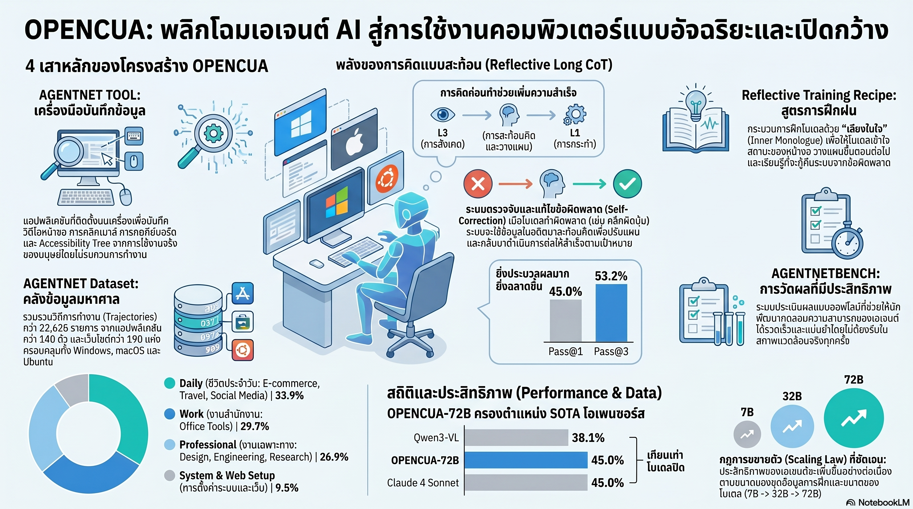

[กลับไปที่หน้าหลัก](../README.md)

สวัสดีครับเพื่อนๆ ที่ติดตามวงการ AI! วันนี้มาเรื่องที่ท้าทายสมมติฐานที่หลายคนยึดถือในวงการ Computer-Use AI: "โมเดลแบบเปิดไม่มีวันไล่กวดโมเดลแบบปิดของบริษัทยักษ์ใหญ่ได้ในงานที่ซับซ้อน" จากงานวิจัย OpenCUA (Open Foundations for Computer-Use Agents) ที่พิสูจน์ว่า Open-source AI สามารถนั่งทำงานหน้าคอมพิวเตอร์ได้แม่นยำถึง 45.0% บน OSWorld-Verified เหนือ OpenAI CUA (31.4%) และทัดเทียม Claude 4 Sonnet (43.9%) ครับ

คุณเคยนึกภาพไหมครับว่า แทนที่จะต้องนั่งคลิกหน้าจอเองเป็นชั่วโมง คุณเพียงแค่บอก AI ว่า "ช่วยรวบรวมข้อมูลจากเว็บ 5 แห่งแล้วใส่ใน Spreadsheet ให้หน่อย" แล้วมันก็ลงมือทำได้จริงๆ โดยใช้คอมพิวเตอร์เหมือนที่มนุษย์ใช้ ไม่มี API พิเศษ ไม่มีการเขียนโค้ด เปิดโปรแกรม คลิก พิมพ์ ปิด แล้วรายงานผลครับ

คุณรู้ไหมครับว่า เหตุผลที่ Computer-Use AI ก้าวหน้าช้ามาตลอด ไม่ใช่เพราะโมเดลไม่ฉลาดพอ แต่เพราะ AI ขาดกระบวนการ "หยุดคิดก่อนคลิก" เหมือนที่มนุษย์ทำโดยธรรมชาติ ระบบเดิมที่ทำคะแนนได้เพียง 4.4% นั้นไม่ใช่เพราะโมเดลอ่อนแอ แต่เพราะมันขาด Inner Monologue ที่บอกให้มันสังเกต วางแผน แล้วค่อยลงมือทำครับ

และคุณเคยนึกไหมครับว่า ถ้าข้อมูลฝึก AI ครอบคลุมทั้งเส้นทางที่ถูกต้องและเส้นทางที่ผิดพลาด แล้วมีระบบ "ผู้ตรวจสอบภายใน" ที่วิเคราะห์ว่าผิดตรงไหน AI จะเรียนรู้การแก้ไขตัวเองได้ในแบบที่ไม่ต่างอะไรกับพนักงานใหม่ที่เรียนรู้จากประสบการณ์จริงครับ?

งานวิจัยนี้กำลังบอกว่า: กำแพงระหว่างโลก Open-source และโลก Proprietary ในวงการ Computer-Use AI ไม่ได้เกิดจากขนาดโมเดล แต่เกิดจากวิธีการสอน และวิธีการสอนนั้นกำลังจะเป็น Open ให้ทุกคนเข้าถึงได้แล้วครับ

========================================

🤔 ทบทวนความเชื่อเดิมๆ: สิ่งที่เราคิดเกี่ยวกับ Computer-Use AI และโมเดล Open-source

▪ "Computer-Use AI ระดับโลกต้องการ Infrastructure และข้อมูลลับที่มีแต่บริษัทยักษ์ใหญ่อย่าง Anthropic หรือ OpenAI เท่านั้นที่เข้าถึงได้ Open-source ทำได้แค่ตาม" → OpenCUA-72B ทำ OSWorld-Verified 45.0% เหนือ OpenAI CUA (31.4%) และทัดเทียม Claude 4 Sonnet (43.9%) โดยใช้เฟรมเวิร์กที่เปิดสาธารณะทั้งหมด — กำแพงนั้นพังลงแล้วครับ

▪ "AI Agent ที่ใช้ข้อมูล HTML หรือ Accessibility Tree (AxTree) ในการอ่านหน้าจอจะแม่นยำกว่าโมเดลที่มองเพียงแค่ Screenshot เพราะมีข้อมูลโครงสร้างที่ครบถ้วนกว่า" → Pure Vision-based Agent ที่มองแค่ Screenshot กลับมีความทนทาน (Robustness) สูงกว่าใน 3 ระบบปฏิบัติการพร้อมกัน เพราะไม่ได้ผูกกับโครงสร้าง HTML ที่แตกต่างกันในแต่ละเว็บและแต่ละ App ครับ

▪ "ข้อมูลฝึกที่มีคุณภาพสูงสุดต้องเป็นเส้นทางที่ถูกต้องสมบูรณ์เท่านั้น ข้อมูลที่มีข้อผิดพลาดจะทำให้โมเดลเรียนรู้พฤติกรรมที่ผิดโดยไม่รู้ตัว" → Non-gold trajectories (เส้นทางที่มีข้อผิดพลาด) เมื่อผ่านระบบ Reflector จะกลายเป็นข้อมูลฝึก Self-correction ที่มีคุณค่าสูง ช่วยให้ AI เรียนรู้การตรวจจับและแก้ไขความผิดพลาดระหว่างทำงานครับ

▪ "AI ที่เก่งขึ้นต้องการข้อมูลฝึกเพิ่มขึ้นเป็นหลัก โครงสร้างการสอน (Curriculum) มีผลน้อยกว่าปริมาณข้อมูลมาก" → Staged Curriculum ที่แยก Grounding (มองเห็น) ออกจาก Planning & Reasoning (คิดวางแผน) ทำให้โมเดลเดิมที่ทำได้เพียง 4.4% พุ่งขึ้นเป็น 45.0% — โครงสร้างการสอนสำคัญกว่าปริมาณข้อมูลมากครับ

ความจริงที่น่าคิดคือ: ความแตกต่างระหว่าง AI ที่ใช้คอมพิวเตอร์ได้แย่กับ AI ที่ใช้ได้ดีนั้นไม่ได้อยู่ที่ว่า "รู้มากแค่ไหน" แต่อยู่ที่ว่า "คิดก่อนทำหรือเปล่า" ซึ่งเป็นความจริงที่ใช้ได้กับมนุษย์ด้วยเช่นกันครับ

========================================

🧠 พื้นฐานที่ต้องเข้าใจก่อน: OpenCUA, Pure Vision Agent, Reflective CoT L3-L2-L1 และ Reflector

=== Computer-Use Agent คืออะไร และต่างจาก Chatbot อย่างไร? ===

[Chatbot ทั่วไป]
▸ รับ Input เป็นข้อความ → ตอบเป็นข้อความ
▸ ไม่สามารถ "ลงมือทำ" อะไรในระบบจริงได้
▸ เหมือนที่ปรึกษาที่ให้คำแนะนำแต่ไม่ได้ทำงานแทน

[Computer-Use Agent]
▸ รับ Task เป็นภาษาธรรมชาติ → มองหน้าจอ → คลิก พิมพ์ เลื่อน → ทำงานจริงในระบบจริง
▸ ใช้คอมพิวเตอร์ได้เหมือนมนุษย์โดยไม่ต้องมี API พิเศษ
▸ เหมือนพนักงานจริงที่นั่งทำงานแทนเราได้ครับ

=== Pure Vision vs HTML/AxTree Approach ===

[HTML/Accessibility Tree Approach]
▸ AI อ่านโครงสร้าง HTML เพื่อเข้าใจหน้าจอ
▸ ข้อจำกัด: แต่ละเว็บและ App มีโครงสร้างต่างกัน บางระบบไม่ Expose AxTree ด้วยครับ

[Pure Vision (OpenCUA)]
▸ AI มองเฉพาะ Screenshot เหมือนมนุษย์มองหน้าจอ
▸ ข้อดี: ทำงานได้บนทุก OS ทุก App ทุกเว็บ ไม่ต้อง Integrate พิเศษ
▸ ความท้าทาย: ต้องเข้าใจตำแหน่ง Layout และ Context จากภาพล้วนๆ ครับ

=== Reflective CoT L3-L2-L1 คืออะไร? ===

นี่คือ "เสียงในหัว" ที่ OpenCUA ฝึกให้ AI คิดก่อนทุก Action:

L3 (Observation) — สังเกตและบรรยาย: "ฉันเห็นหน้าต่าง PowerPoint เปิดอยู่ มีตารางที่แถวที่ 2 ที่ยังว่างอยู่ ปุ่ม Insert อยู่บน Ribbon ด้านบน"
L2 (Thought) — วางแผนและเชื่อมกับความจำ: "เป้าหมายคือเพิ่ม 5 แถว ฉันทำ Step ก่อนหน้าได้ถูกต้องแล้ว ขั้นต่อไปควรคลิกขวาที่ตารางและเลือก Insert Rows"
L1 (Action) — ลงมือทำ: "คลิกที่พิกัด (412, 287)"

โครงสร้างนี้เปลี่ยนโมเดลจาก 4.4% เป็น 45.0% ครับ

========================================

1) Pure Vision + Inner Monologue: จาก 4.4% สู่ 45.0% ด้วยการสอนให้ "คิดก่อนคลิก"

ตัวเลขที่น่าทึ่งที่สุดในงานวิจัยนี้ไม่ใช่ 45.0% แต่คือ 4.4% — คะแนนของโมเดลเดียวกันก่อนที่จะได้รับการฝึกด้วย Reflective CoT ครับ

นึกภาพช่างเทคนิคมือใหม่ที่รู้ทุกอย่างเกี่ยวกับเครื่องมือ แต่พอได้รับงานจริงก็รีบหยิบประแจแรกที่เห็นและหมุนโดยไม่ดูก่อนว่าต้องขนาดไหน ผลคืองานพัง — ความรู้มีแต่ขาด Process ครับ

Reflective Long CoT แก้ปัญหานี้โดยฝึกให้ AI ทำ 3 สิ่งก่อนทุก Action:

L3 — บรรยายสิ่งที่เห็นอย่างละเอียด: ไม่ใช่แค่ "เห็นหน้าจอ" แต่ "เห็น Dialog Box ที่มีช่องกรอก Email อยู่ตรงกลาง ปุ่ม Submit สีน้ำเงินด้านล่าง และข้อความ Error สีแดงบรรทัดบน" ครับ

L2 — เชื่อมสิ่งที่เห็นกับเป้าหมายและประวัติ: "ฉันทำ Step 1-3 ไปแล้ว ข้อความ Error บอกว่า Email format ผิด ฉันต้องแก้ก่อนที่จะกด Submit ได้" ครับ

L1 — ลงมือทำอย่างแม่นยำ: พิกัด action ที่ชัดเจนครับ

ผลคือ AI ที่ "รู้ว่าตัวเองกำลังทำอะไร และทำไม" แทนที่จะแค่ "คลิกไปเรื่อยๆ จนโชคดีถูก" ครับ

========================================

2) AgentNet + Staged Curriculum: หัดมองก่อนหัดคิด ก่อนจะหัดทำ

ชุดข้อมูล AgentNet ที่มาพร้อมกับ OpenCUA ประกอบด้วย Trajectories 22,600 รายการ ครอบคลุม Apps กว่า 100 ตัว เว็บไซต์กว่า 200 แห่ง บน Windows, macOS และ Ubuntu ครับ

แต่ความพิเศษอยู่ที่ลำดับการสอนครับ:

Stage 1 — Grounding (สอนให้มอง):
เปรียบได้กับการสอนเด็กอนุบาลให้รู้จักตัวอักษรก่อนอ่านหนังสือ — AI ต้องเรียนรู้ก่อนว่า "ปุ่ม" อยู่ตรงไหน "เมนู" หน้าตาเป็นอย่างไร และ "ช่องกรอกข้อมูล" แตกต่างจาก "ป้ายข้อความ" ยังไง ถ้าข้ามขั้นนี้ไป AI จะเห็นหน้าจอแต่ "อ่าน" ไม่ออกครับ

Stage 2 — Planning & Reasoning (สอนให้คิด):
เมื่อ AI มองเห็นได้แล้ว ขั้นต่อไปคือการฝึกให้มัน "วางแผนข้ามขั้นตอน" โดยใช้ Screenshot ย้อนหลัง 3 ภาพเป็น Context ครับ — งานวิจัยพบว่า 3 ภาพคือจุดสมดุลที่ดีที่สุด: มากพอที่จะเข้าใจ Context แต่ไม่มากจนสิ้นเปลือง Compute

ทำไม Staged Curriculum ถึงสำคัญ? เพราะถ้าสอน Planning ก่อน Grounding AI จะพยายามวางแผนโดยไม่เข้าใจว่ากำลังมองอะไรอยู่ — เหมือนสอนให้เขียนเรียงความก่อนที่เด็กจะรู้จักตัวอักษรครับ

========================================

3) Reflector (AI Auditor): เรียนจากความผิดพลาด ไม่ใช่แค่จากความถูกต้อง

หนึ่งในนวัตกรรมที่น่าประทับใจที่สุดของ OpenCUA คือการไม่ทิ้งข้อมูลที่ผิดพลาดครับ

ในการฝึก AI แบบดั้งเดิม: ถ้า Trajectory ไหน "ไม่ถูกต้อง 100%" ก็โยนทิ้งไป เหลือแต่ข้อมูลที่สมบูรณ์แบบ ผลคือ AI ไม่เคยเรียนรู้วิธีรับมือกับสถานการณ์ที่พลาดไปแล้วระหว่างงานครับ

OpenCUA ใช้ Reflector (Internal Auditor) แทน:

กระบวนการทำงาน:
— Reflector รับ Non-gold Trajectory ที่มีข้อผิดพลาด
— วิเคราะห์ว่า "พลาดตรงไหน และทำไม"
— แปลงข้อมูลนั้นให้กลายเป็น "บทเรียน Self-correction" สำหรับฝึกโมเดลครับ

ตัวอย่างที่ชัดเจน: AI ทำงานใน PowerPoint แล้วพิมพ์จำนวนแถวเป็น "1" แทนที่จะเป็น "5"

โมเดลที่ไม่ผ่าน Reflective CoT: เดินหน้าต่อโดยไม่รู้ว่าผิดพลาด → งานเสร็จแต่ผิดทั้งหมด
โมเดลที่ผ่านการฝึกกับ Reflector: ใน L2 (Thought) ของ Step ถัดไป จะตรวจพบว่า "ตารางมีเพียง 1 แถว ซึ่งไม่ตรงกับ Task ที่ต้องการ 5 แถว" แล้วแก้ไขตัวเองได้ทันทีครับ

เปรียบได้กับพนักงานที่ดี: ไม่ใช่คนที่ไม่เคยผิดพลาด แต่คือคนที่รู้ตัวเร็วและแก้ไขได้ก่อนที่ความเสียหายจะลุกลามครับ

========================================

4) OSWorld-Verified: ผลลัพธ์ที่พูดแทนตัวเอง

บน OSWorld-Verified — Benchmark ที่ทดสอบ AI บนระบบปฏิบัติการจริง ไม่ใช่ Simulation ครับ:

— OpenCUA-72B: 45.0% ✓
— Claude 4 Sonnet: 43.9% (ทัดเทียมโมเดล Proprietary ระดับท็อป)
— OpenAI CUA: 31.4% (OpenCUA เหนือกว่า 13.6 percentage point)

ตัวเลขเหล่านี้ไม่ใช่การทดสอบบน Benchmark ที่ออกแบบมาเพื่อให้ได้คะแนนสวยงาม แต่คือการทดสอบว่า AI ทำงานจริงในระบบจริงได้สำเร็จหรือไม่ครับ

และเมื่อให้ AI "ลองหลายครั้ง" ผ่าน Pass@n:
— Pass@3 (ลอง 3 ครั้ง): 53.2%
— ยิ่งให้ AI มีเวลาคิดและลองมากขึ้น Ceiling ยังไม่ถึงครับ

นี่คือ Scaling Law ของ Test-time Compute ที่บอกว่า: ยิ่งให้ AI มีโอกาสสะท้อนคิดและลองใหม่ ประสิทธิภาพยิ่งพุ่งขึ้น — ซึ่งหมายความว่าการลงทุนใน "กระบวนการคิด" ระหว่างทำงานยังให้ผลตอบแทนที่ไม่มีขีดจำกัดที่สิ้นสุดครับ

========================================

5) Digital Employee: ก้าวต่อไปจาก "AI ที่ตอบ" สู่ "AI ที่ทำ"

OpenCUA ไม่ใช่แค่โครงการวิจัย แต่คือการวาง Open Foundation ที่เปลี่ยน Paradigm ของ AI ในองค์กรได้จริงครับ

เปรียบได้กับวิวัฒนาการของเครื่องมือในโรงงาน: ยุคแรกคือ "เครื่องมือที่มนุษย์ต้องจับทำทุกขั้นตอน" ยุคถัดมาคือ "เครื่องจักรที่ทำตามคำสั่งทีละขั้น" และยุคปัจจุบันคือ "ระบบอัตโนมัติที่รับ Task ระดับสูงแล้วหาวิธีทำเอง" — OpenCUA คือประตูสู่ยุคที่สามครับ

สิ่งที่ OpenCUA เปิดให้ทำได้จริง:
— นักพัฒนา: ต่อยอด Framework ที่เปิดสาธารณะเพื่อสร้าง Vertical AI Agent สำหรับงานเฉพาะด้าน
— องค์กร: ไม่ต้องพึ่งพา API ที่ผูกกับบริษัทเดียวอีกต่อไป
— นักวิจัย: มีฐานที่วัดผลได้ชัดเจนสำหรับการพัฒนาต่อยอดครับ

แต่คำถามที่สำคัญกว่าตัวเลขคือ: เมื่อ AI สามารถทำงานหน้าจอแทนมนุษย์ได้เกือบทั้งหมด บทบาทของมนุษย์จะเลื่อนขึ้นไปอยู่ที่ระดับ "กำหนดทิศทางและตัดสินใจ" ซึ่งต้องการทักษะที่ต่างออกไปอย่างสิ้นเชิง — และนั่นคือทักษะที่เราต้องเตรียมพร้อมตั้งแต่วันนี้ครับ

========================================

🎯 สรุป: OpenCUA ไม่ใช่แค่โมเดลที่ดีขึ้น แต่คือ Open Foundation ที่เปลี่ยนสมการของ Computer-Use AI

OpenCUA พิสูจน์สิ่งสำคัญ 5 ประการครับ:

หนึ่ง — Open-source Computer-Use AI ทะลุกำแพง Proprietary ได้จริง: OpenCUA-72B 45.0% บน OSWorld-Verified เหนือ OpenAI CUA (31.4%) และทัดเทียม Claude 4 Sonnet (43.9%) ด้วย Framework ที่เปิดสาธารณะทั้งหมดครับ

สอง — Reflective Long CoT (L3 Observation → L2 Thought → L1 Action) คือหัวใจที่เปลี่ยนโมเดลจาก 4.4% เป็น 45.0% — "Inner Monologue" ที่ทำให้ AI คิดก่อนคลิกเป็นความแตกต่างที่ใหญ่ที่สุดครับ

สาม — Staged Curriculum (Grounding ก่อน Planning) สำคัญกว่าปริมาณข้อมูล: AgentNet 22,600 Trajectories ครอบคลุม 100+ Apps และ 200+ เว็บไซต์บน 3 OS สอนในลำดับที่ถูกต้องครับ

สี่ — Reflector (Internal Auditor) แปลงข้อมูลผิดพลาด (Non-gold Trajectories) ให้เป็นบทเรียน Self-correction: เหมือนพนักงานที่เรียนรู้จากประสบการณ์จริงมากกว่าจากหนังสือเรียนครับ

ห้า — Test-time Scaling ยังมีผลต่อเนื่อง: Pass@3 ที่ 53.2% พิสูจน์ว่าการให้ AI "ลองอีกครั้ง" ยังให้ผลดีขึ้นได้เสมอ หมายความว่า Ceiling ของ Computer-Use AI ยังอยู่ไกลมากครับ

========================================

💬 คำถามชวนคิด:

ถ้า OpenCUA พิสูจน์ว่า "วิธีการสอน" สำคัญกว่า "ขนาดโมเดล" ในงาน Computer-Use คุณคิดว่าในด้านไหนบ้างที่ "วิธีการสอน AI" ยังยังไม่ได้รับความสนใจเพียงพอ และมีโอกาสที่จะ "กระโดด" ประสิทธิภาพได้แบบเดียวกับที่ Reflective CoT ทำใน OpenCUA ครับ?

และเมื่อ AI ที่ใช้คอมพิวเตอร์ได้ดีกลายเป็น Open-source ที่ทุกคนเข้าถึงได้ บทบาทใดของมนุษย์ในที่ทำงานที่คุณคิดว่าจะมีคุณค่ามากขึ้น (ไม่ใช่ลดลง) เมื่อ AI ดูแลงาน Routine Tasks ได้ครบถ้วนครับ?

========================================

References:
- OpenCUA: Open Foundations for Computer-Use Agents (2025)
- OSWorld-Verified Benchmark: OpenCUA-72B 45.0% vs OpenAI CUA 31.4% vs Claude 4 Sonnet 43.9%
- Base Recipe (ก่อน Reflective CoT): 4.4%
- Reflective Long Chain-of-Thought: L3 (Observation) → L2 (Thought: Memory + Planning) → L1 (Action)
- AgentNet Dataset: 22,600 Trajectories, 100+ Apps, 200+ Websites, Windows/macOS/Ubuntu
- Staged Curriculum: Stage 1 Grounding → Stage 2 Planning & Reasoning (3-Screenshot History)
- Reflector (Internal Auditor): Non-gold Trajectory → Self-correction Training Data
- Pass@n Results: Pass@3 = 53.2%
- Pure Vision-based Agent (Screenshot only, no HTML/AxTree)

========================================

เมื่อ AI ที่ "คิดก่อนคลิก" ทำคะแนนเหนือกว่า AI ที่ "คลิกเร็วกว่า" มันพิสูจน์อีกครั้งว่าสิ่งที่แยก "ทำงานเก่ง" ออกจาก "ทำงานเร็ว" ไม่ใช่ความเร็วในการลงมือ แต่คือวินัยในการหยุดคิดก่อนครับ 🖥️

#OpenCUA #ComputerUseAI #AIAgent #DigitalEmployee #OpenSource #ReflectiveCoT #OSWorld #AgentNet #PureVision #SelfCorrection #Reflector #StagedCurriculum #InnerMonologue #TestTimeScaling #MultimodalAI #AIAutomation #AIThailand
