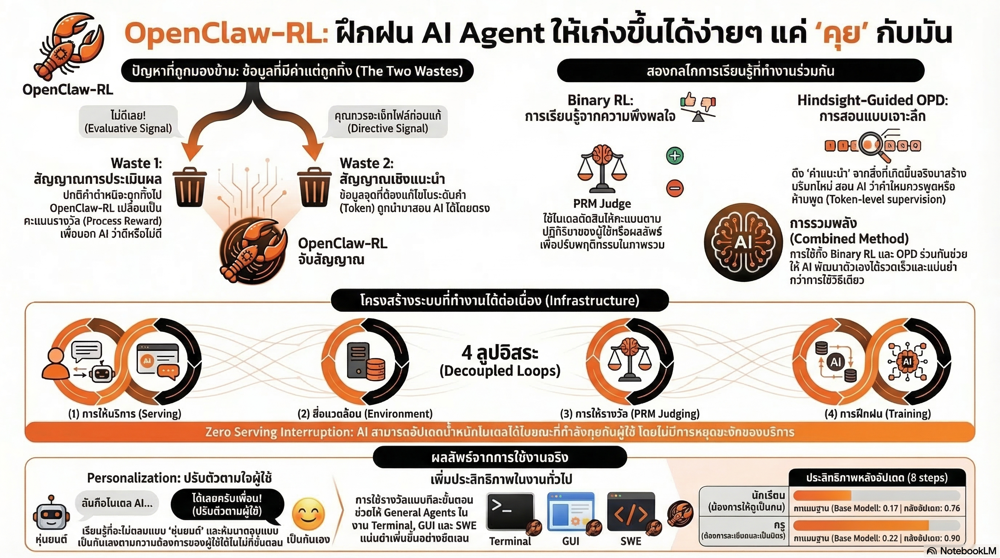

[กลับไปที่หน้าหลัก](../README.md)

สวัสดีครับเพื่อนๆ ที่สนใจ AI! วันนี้มาพูดถึงเรื่องที่อาจเปลี่ยนความสัมพันธ์ระหว่างเรากับ AI ไปตลอดกาล
คุณเคยหงุดหงิดไหมครับที่บอก AI ว่า "ตอบยาวไป ย่อให้หน่อย" แล้วคราวหน้ามันก็ยังตอบยาวเหมือนเดิม?
หรือเคยแก้โค้ดที่ AI เขียนผิดซ้ำๆ แบบเดิมทุกสัปดาห์ ทั้งที่บอกไปแล้วว่าอย่าทำแบบนั้น?
และคุณเคยสงสัยไหมครับว่า... ทุกครั้งที่เราด่า AI, แก้ไขงานมัน, หรือบอกว่า "ไม่ใช่แบบนี้" ข้อมูลเหล่านั้นไปไหน?
คำตอบที่น่าเศร้าคือ: มันหายไปในความว่างเปล่าครับ ทุกครั้งที่ปิดหน้าต่างแชท AI ก็ "ลืม" ทุกอย่างที่เราสอนไป แล้วกลับมาเป็นหุ่นยนต์ตัวเดิมอีกครั้งในคราวถัดไป
แต่ทีมนักวิจัยจาก Princeton University เพิ่งเปิดตัวสิ่งที่เรียกว่า OpenClaw-RL ที่กำลังจะเปลี่ยนทุกอย่างครับ แนวคิดง่ายๆ แต่ทรงพลังมาก: แทนที่จะทิ้งข้อมูลเหล่านั้น ทำไมไม่เอามันมาเทรน AI แบบ Real-time ตรงนั้นเลย?
🤔 ทบทวนความเชื่อเดิมๆ: สิ่งที่เราคิดเกี่ยวกับการเทรน AI

    "การเทรน AI ต้องทำในศูนย์ข้อมูลขนาดยักษ์โดยทีมวิศวกร ไม่เกี่ยวกับเรา" → OpenClaw-RL พิสูจน์ว่าทุกการสนทนาปกติคือการเทรนได้!

    "AI เก่งขึ้นได้ก็ต่อเมื่อออกเวอร์ชันใหม่" → ด้วย Online Learning AI เก่งขึ้นระหว่างที่คุณคุยอยู่ครับ ไม่ต้องรอ Update

    "ข้อมูลที่มีค่าที่สุดคือข้อมูลที่บริษัทรวบรวมมา" → ข้อมูลล้ำค่าที่สุดอยู่ในปฏิกิริยาของคุณต่อ AI ทุกวินาที

    "RL (Reinforcement Learning) ต้องการรางวัล 'ถูก/ผิด' เป็นตัวเลขเท่านั้น" → OPD อ่าน "คำอธิบาย" จากผู้ใช้ได้ด้วย ละเอียดกว่ามาก
    ความจริงที่น่าตกใจคือ: ทุกวันเราทิ้งข้อมูลอันล้ำค่าหลายล้านชิ้นทั่วโลก เพียงเพราะไม่มีระบบที่จะจับมันไว้ใช้ประโยชน์

🧠 พื้นฐานที่ต้องรู้ก่อน: RL, Online Learning และ OPD คืออะไร?

บทความนี้มีคำศัพท์สำคัญหลายตัวที่ต้องทำความเข้าใจก่อนครับ

=== Reinforcement Learning (RL) คืออะไร? ===
RL = วิธีเทรน AI โดยให้มัน "ลองผิดลองถูก" แล้วเรียนรู้จากรางวัลและบทลงโทษ
เปรียบเทียบ: ลองนึกถึงการฝึกสุนัขครับ เมื่อสุนัขนั่งเมื่อสั่ง เราให้ขนม (รางวัล) เมื่อมันเห่าคนอื่น เราส่งเสียง "ไม่ได้!" (บทลงโทษ) เมื่อทำซ้ำหลายรอบ สุนัขก็เรียนรู้ว่าพฤติกรรมแบบไหนได้รางวัล
AI ที่ฝึกด้วย RL ทำแบบเดียวกัน แต่ "รางวัล" คือคะแนน และ "บทลงโทษ" คือการลดคะแนนนั่นเอง

=== ปัญหาของ RL แบบเดิม: Binary Reward ===
RL แบบเดิมส่วนใหญ่ใช้รางวัลแบบ Binary (0 หรือ 1):

    โค้ดรันผ่าน = ได้ 1 คะแนน

    โค้ดรันไม่ผ่าน = ได้ 0 คะแนน
    เปรียบเทียบ: เหมือนครูที่ตรวจการบ้านแล้วให้แค่ "ผ่าน/ไม่ผ่าน" โดยไม่บอกว่าผิดตรงไหนหรือควรแก้ยังไง นักเรียนก็ยังงงอยู่ดีครับ ถึงรู้ว่าตัวเองผิด แต่ไม่รู้ว่าต้องแก้อะไร!

=== Online Learning คืออะไร? ===
Online Learning (ในที่นี้ไม่ใช่การเรียนออนไลน์!) คือการเทรน AI "แบบต่อเนื่องระหว่างใช้งาน" แทนที่จะเทรนครั้งใหญ่แล้วหยุด
[แบบเดิม: Batch Learning]

    รวบรวมข้อมูล → เทรนในศูนย์ข้อมูล → ออกเวอร์ชันใหม่ → รวบรวมข้อมูลใหม่ → ...

    วงจรนี้ใช้เวลาหลายเดือน AI ไม่ได้เรียนรู้ระหว่างนั้น
    [แบบใหม่: Online Learning]

    AI ใช้งาน → ได้ Feedback → เรียนรู้ทันที → ใช้งานต่อ → ได้ Feedback ใหม่ → ...

    เหมือนมนุษย์ที่เรียนรู้ตลอดเวลาจากประสบการณ์ ไม่ต้องหยุดทำงานไปเข้าโรงเรียน

=== Evaluative Signal VS Directive Signal ===
OpenClaw-RL ค้นพบว่า Feedback จากผู้ใช้มีสองระดับ:
[Evaluative Signal: บอกว่า "ดีหรือแย่"]

    ผู้ใช้กด Thumbs Down

    ผู้ใช้ถามซ้ำเพราะไม่เข้าใจ

    โค้ดรันไม่ผ่าน

    เหมือนเกรดสอบ: รู้แค่ว่าผ่านหรือตก
    [Directive Signal: บอกว่า "ควรทำยังไง"]

    ผู้ใช้บอกว่า "คุณควรเช็คไฟล์ก่อนแก้สิ"

    ผู้ใช้แก้ข้อความแล้วส่งกลับมา

    Error Message ที่บอกว่าผิดบรรทัดไหน

    เหมือนคำแนะนำจากครู: รู้ทั้งว่าผิดและต้องแก้ยังไง
    OpenClaw-RL เก็บทั้งสองอย่างมาใช้เทรน ในขณะที่ระบบเดิมเก็บแค่อย่างแรกครับ!

1️⃣ หยุดโศกนาฏกรรมข้อมูลสูญเปล่า

=== ทุกวินาที ข้อมูลล้ำค่ากำลังหายไป ===
ลองนึกภาพนี้ครับ: มีคน 100 ล้านคนทั่วโลกคุยกับ AI ทุกวัน แต่ละคนแก้ไข บ่น แนะนำ และสอนสิ่งใหม่ให้ AI อยู่ตลอดเวลา
แต่เมื่อปิดหน้าต่าง ทุกอย่างหายไปครับ AI กลับไปเป็นเหมือนเดิมราวกับว่าการสนทนานั้นไม่เคยเกิดขึ้น
เปรียบเทียบ: เหมือนบริษัทที่จ้างพนักงานฝึกงาน 100 ล้านคน แต่ทุกคืนพนักงานทุกคนลืมทุกอย่างที่เรียนรู้มาตลอดวัน แล้วต้องเริ่มใหม่ตั้งแต่ต้นทุกเช้า ทั้งที่พวกเขาเรียนรู้มามากมายมหาศาลครับ!

=== OpenClaw-RL: ดักจับก่อนทิ้ง ===
OpenClaw-RL ออกแบบระบบดักจับ Feedback 2 ระดับ:
[Feedback ระดับที่ 1: Evaluative Signal]

    ผู้ใช้ถามซ้ำ → AI รู้ว่าตอบผิด

    โปรแกรมรันผ่าน/ไม่ผ่าน → AI รู้ว่าโค้ดถูกต้อง

    ผู้ใช้กดลบแล้วเริ่มใหม่ → AI รู้ว่าผลลัพธ์ไม่เป็นที่พอใจ
    [Feedback ระดับที่ 2: Directive Signal]

    "คุณควรเช็คไฟล์ก่อนแก้สิ" → AI รู้ว่าต้องเพิ่มขั้นตอนไหน

    ผู้ใช้แก้ประโยคแล้วส่งกลับ → AI เห็นโดยตรงว่าต้องเปลี่ยนยังไง

    Error Trace บรรทัดที่ 47 → AI รู้ว่าปัญหาอยู่ตรงไหนพอดี
    ผลลัพธ์: แทนที่จะเห็นแค่ "ผ่าน/ไม่ผ่าน" AI ได้รับ "คอมเมนต์จากครู" ที่บอกทั้งว่าผิดและต้องแก้อะไรในทันทีครับ

2️⃣ เทรน AI ได้แค่ "คุยปกติ": ผลลัพธ์ที่น่าตกใจ

=== ทดสอบ Case 1: นักเรียนที่ไม่อยากให้ดูเหมือน AI เขียน ===
โจทย์: ต้องการให้ AI ช่วยแก้โจทย์คณิตศาสตร์ แต่ต้องเขียนแบบมนุษย์ธรรมดา ไม่ใช่หุ่นยนต์
[ก่อน: AI ตอบแบบหุ่นยนต์จ๋า]

    ใช้ตัวหนาเยอะมาก

    แบ่งขั้นตอน 1. 2. 3. แข็งทื่อ

    ภาษาทางการเกินไป รู้ทันทีว่า AI เขียน
    [หลัง 8 ขั้นตอนการเรียนรู้: AI ปรับตัวแล้ว]

    เลิกใช้ Format ซ้ำซาก

    น้ำเสียง Casual เหมือนเพื่อนอธิบาย

    เรียบเรียงประโยคแบบมนุษย์
    คะแนนความพึงพอใจ: พุ่งจาก 0.17 → 0.76 ใน 8 ขั้นตอนเท่านั้นครับ!

=== ทดสอบ Case 2: ครูที่ต้องการน้ำเสียงเป็นกันเอง ===
โจทย์: ต้องการให้ AI ตรวจงานด้วยน้ำเสียงอบอุ่น ให้กำลังใจ และบอกรายละเอียดที่เจาะจง
[ก่อน: AI ตรวจงานเย็นชา]

    "Correct. Well done!"

    ไม่มีรายละเอียด ไม่มีอารมณ์ รู้สึกว่ากำลังคุยกับเครื่องจักร
    [หลัง 8 ขั้นตอนการเรียนรู้: AI อบอุ่นขึ้น]

    ใส่ Emoji ให้กำลังใจ

    อธิบายว่า "คุณแปลงหน่วยจากสัปดาห์เป็นวันได้แม่นยำมาก นี่คือจุดที่คนส่วนใหญ่มักพลาด!"

    ชี้เฉพาะว่า "ส่วนนี้ทำได้ดีมาก ส่วนนั้นลองคิดใหม่อีกครั้งนะ"
    คะแนนความพึงพอใจ: พุ่งจาก 0.22 → 0.90 ใน 8 ขั้นตอนครับ!
    เปรียบเทียบ: ลองนึกถึงน้องใหม่ในออฟฟิศที่ฝึกงานแค่ 8 วัน แล้วเข้าใจสไตล์การทำงานของหัวหน้าได้เกือบ 100% โดยไม่ต้องมีใครบอกโดยตรงเลย นั่นคือสิ่งที่ OpenClaw-RL ทำครับ!

3️⃣ OPD: เปลี่ยน AI จากเห็นโลกขาวดำ สู่การเห็นโลกเต็มสี

=== ปัญหาของ RL แบบเดิม: เห็นแค่ขาวกับดำ ===
เปรียบเทียบ: ลองนึกถึงนักดนตรีที่ฝึกโดยมีคนบอกแค่ "ดี" หรือ "แย่" หลังเล่นจบ ไม่มีใครบอกว่าโน้ตตัวไหนเพี้ยน จังหวะตรงไหนผิด หรือต้องฝึกส่วนไหนเพิ่ม นักดนตรีคนนั้นจะพัฒนาได้ช้ามากครับ!
RL แบบ Binary มีปัญหาเดียวกัน ได้แค่ "ถูก/ผิด" แต่ไม่รู้ว่า "ผิดตรงไหน และแก้ยังไง"

=== OPD (On-Policy Distillation): เห็นโลกเป็นสี High Definition ===
Hindsight-Guided On-Policy Distillation หรือ OPD คือวิธีใหม่ที่ให้ข้อมูลละเอียดกว่ามาก
ทำงานยังไง?

    AI ตอบไปแล้ว

    ผู้ใช้ Feedback มา (ทั้ง Evaluative และ Directive)

    ระบบสกัด "คำใบ้" (Textual Hints) จาก Feedback

    ส่งให้ "โมเดลตัวเดิม" แต่เสริมด้วยบริบทที่อัปเกรดแล้ว (Teacher Context)

    โมเดลเกิด "อ๋อ! ต้องตอบแบบนี้สิ"

    นำความรู้นั้นมาปรับปรุงในระดับ Token (รายคำ)
    เปรียบเทียบ: แทนที่โค้ชจะบอกแค่ "แพ้แล้ว" OPD เหมือนโค้ชที่นั่งดูวิดีโอซ้ำพร้อมนักกีฬา แล้วบอกทีละเฟรมว่า "ตรงนี้ควรเลี้ยงซ้าย", "จังหวะนี้ควรยิงเร็วกว่านี้" การฝึกแบบนี้เร็วกว่าและแม่นยำกว่ามากครับ!

=== เปรียบเทียบ Binary RL กับ OPD ===
[Binary RL แบบเดิม]

    ประเภทสัญญาณ: บอกแค่ "ดี/แย่"

    ความละเอียด: ระดับภาพรวม (เห็นแค่ว่าผ่านหรือไม่ผ่าน)

    ความหนาแน่นข้อมูล: ต่ำ เหมือนเห็นโลกเป็นขาวดำ

    แหล่งข้อมูล: ปฏิกิริยาทั่วไป
    [OPD แบบใหม่]

    ประเภทสัญญาณ: บอกว่า "ควรแก้อย่างไร" ด้วย

    ความละเอียด: ระดับรายคำ (รู้ว่าประโยคไหน คำไหน ที่ต้องเปลี่ยน)

    ความหนาแน่นข้อมูล: สูง เหมือนเห็นโลกเป็นสี HD

    แหล่งข้อมูล: การแก้ไขที่เจาะจงจากผู้ใช้จริงๆ

4️⃣ Slime Framework: เบื้องหลังที่ทำงานโดยไม่ขัดจังหวะ

=== ความท้าทาย: เทรนและให้บริการพร้อมกันได้ยังไง? ===
ปัญหาใหญ่ของ Online Learning คือ: จะเทรนโมเดลและให้บริการผู้ใช้พร้อมกันได้อย่างไร โดยผู้ใช้ไม่รู้สึกถึงความหน่วง?
ลองนึกภาพว่า ถ้าทุกครั้งที่คุณคุยกับ AI แล้วมันต้องหยุดเทรนตัวเองก่อน 5 นาทีแล้วค่อยตอบ คงไม่มีใครใช้ครับ!

=== Slime: ระบบวิ่งผลัดแบบ Asynchronous ===
NVIDIA และ Princeton แก้ปัญหานี้ด้วยสถาปัตยกรรม Asynchronous Pipeline บน Slime Framework ที่ทำงานพร้อมกันโดยไม่รอกัน
เปรียบเทียบกับการวิ่งผลัด: ในการวิ่งผลัดปกติ ต้องรอให้คนหนึ่งถึงจุดส่งก่อนคนถัดไปจึงเริ่มวิ่งได้ Slime เหมือนการวิ่งผลัดที่ทุกคนวิ่งพร้อมกัน แต่ละคนทำหน้าที่ต่างกันโดยไม่รบกวนกันครับ!

[ส่วนที่ 1: SGLang — Policy Server (ด่านหน้า)]

    หน้าที่: คุยกับผู้ใช้แบบ Real-time

    เหมือน: พนักงาน Front Desk ที่รับลูกค้าตลอดเวลา

    ไม่หยุด แม้ระบบอื่นกำลังทำงานอยู่
    [ส่วนที่ 2: PRM Server — The Judge (ผู้ตัดสิน)]

    หน้าที่: วิเคราะห์และให้คะแนน Feedback อยู่เบื้องหลัง

    เหมือน: Quality Control ที่ตรวจงานและเขียนรายงานโดยไม่หยุดสายการผลิต

    PRM = Process Reward Model: ให้รางวัลแบบ "ก้าวต่อก้าว" ไม่ใช่แค่ผลสุดท้าย
    [ส่วนที่ 3: Megatron — The Trainer (โรงยิม)]

    หน้าที่: อัปเดต "น้ำหนักโมเดล" (Weights) จากข้อมูลที่ PRM ส่งมา

    เหมือน: Personal Trainer ที่ออกแบบโปรแกรมฝึกตามรายงานของ Quality Control

    ทำงานแบบ Asynchronous: ฝึกอยู่เบื้องหลัง ไม่รบกวนด่านหน้า
    [ส่วนที่ 4: Environment Server (ตัวเชื่อมต่อโลกจริง)]

    หน้าที่: เชื่อมต่อกับระบบจริงของผู้ใช้ เช่น Terminal, Browser, หรือ Cloud

    เหมือน: ล่ามที่แปลระหว่าง AI กับโลกภายนอก

=== ผลลัพธ์: Zero Serving Interruption ===
ระบบทั้ง 4 ทำงานพร้อมกันแบบ Asynchronous ผู้ใช้คุยต่อเนื่องได้โดยไม่รู้สึกหน่วงหรือสะดุด ขณะที่ AI กำลังเรียนรู้จากการสนทนาล่าสุดอยู่เบื้องหลังนั่นเองครับ!
5️⃣ ไม่ใช่แค่แชทบอท: สมองสำหรับ Agent ทุกรูปแบบ

=== ขยายจากแชท สู่ทุก Agent ในโลกจริง ===
OpenClaw-RL ไม่ได้หยุดอยู่แค่การปรับแต่งรูปแบบการตอบ แต่ถูกออกแบบมาให้เป็น "กลไกเรียนรู้" ของ Agent ทุกประเภท:
[Terminal และ SWE Agents: นักพัฒนา Software]

    Feedback: Error Trace และผลการรันโค้ด

    AI เรียนรู้: รูปแบบ Bug ที่พบบ่อยในโปรเจกต์นี้โดยเฉพาะ

    ผล: เขียนโค้ดผิดน้อยลงทุกวัน โดยไม่ต้องบอกซ้ำ
    [GUI Agents: ผู้ช่วยควบคุมหน้าจอ]

    Feedback: การเปลี่ยนแปลงบนหน้าจอ, การคลิกที่ถูกต้อง

    AI เรียนรู้: Layout ของซอฟต์แวร์และ Workflow ที่ผู้ใช้ชอบ

    ผล: นำทางบนหน้าจอได้แม่นขึ้นโดยรู้จักนิสัยของคุณ
    [Tool-call Agents: ผู้ช่วยเรียกใช้ API]

    Feedback: ผลลัพธ์จากการเรียก API และเครื่องมือต่างๆ

    AI เรียนรู้: ว่าเมื่อไหรควรเรียก Tool ไหน ในลำดับอะไร

    ผล: ทำงานอัตโนมัติได้แม่นยำขึ้นในบริบทเฉพาะของคุณ

=== Outcome Reward VS Process Reward ===
นวัตกรรมสำคัญอีกอย่างของ OpenClaw-RL คือการเปลี่ยนจาก "รางวัลตอนจบ" เป็น "รางวัลทุกก้าว":
[Outcome Reward: รางวัลตอนจบ]

    ทำงาน 10 ขั้นตอน → ดูผลลัพธ์สุดท้าย → ได้หรือเสียรางวัล

    ปัญหา: ถ้าล้มเหลวในขั้นตอนที่ 7 ไม่รู้ว่า 9 ขั้นก่อนหน้านั้นดีหรือแย่
    [Process Reward: รางวัลทุกก้าว]

    ทำงานแต่ละขั้นตอน → ได้ Feedback ทันที → ปรับปรุงขั้นถัดไป

    เหมือน GPS ที่บอก "เลี้ยวซ้าย" ทุกหัวถนน แทนที่จะรอถึงที่หมายแล้วบอกว่า "เส้นทางผิดตั้งแต่ต้น"
    ผลการทดสอบ: เมื่อเปลี่ยนจาก Outcome เป็น Process Rewards ความแม่นยำเพิ่มขึ้นในทุกโหมดการทำงานครับ!

🎯 สรุป: เมื่อเส้นแบ่งระหว่าง "ใช้งาน" กับ "เทรน" หายไป

สิ่งที่ OpenClaw-RL นำมาเสนอในครั้งนี้:

    ดักจับ Feedback 2 ระดับ: Evaluative (ดี/แย่) และ Directive (ควรแก้ยังไง) แทนที่จะทิ้งทั้งหมด

    OPD: เปลี่ยนจาก "เห็นโลกขาวดำ" สู่ "เห็นโลกสี HD" ด้วยการเรียนรู้ระดับ Token

    Slime Framework: เทรนและให้บริการพร้อมกันแบบ Zero Interruption

    ผลลัพธ์ที่วัดได้: คะแนนพุ่ง 0.17 → 0.76 และ 0.22 → 0.90 ใน 8 ขั้นตอนเท่านั้น

    ขยายไปทุก Agent: Terminal, GUI, Tool-call ล้วนเรียนรู้จาก Feedback จริงได้หมด

    Open Source: โค้ดและสูตรเปิดสาธารณะบน GitHub ใครก็นำไปสร้างต่อได้

หลักการสำคัญ: "AI ที่ดีที่สุดไม่ใช่ AI ที่เทรนมาแล้วเก่งตั้งแต่วันแรก แต่คือ AI ที่เรียนรู้จากการใช้งานจริงของคุณทุกวัน"
💬 คำถามท้าทาย

เมื่อ AI เริ่มเรียนรู้จากทุกปฏิกิริยาของเราแบบ Real-time:

    ถ้า AI ของคุณเรียนรู้จากนิสัยการทำงานของคุณเป็นเวลา 1 ปี คุณคิดว่าประสิทธิภาพของมันจะเพิ่มขึ้นกี่เปอร์เซ็นต์เมื่อเทียบกับ AI ของคนอื่นที่ใช้รุ่นเดียวกัน?

    ถ้า AI เรียนรู้จากเราตลอดเวลา ข้อมูลการสนทนาและ Feedback เหล่านั้นควรเป็น "ทรัพย์สินของใคร" ระหว่างผู้ใช้กับบริษัท AI?

    มีความเป็นไปได้ไหมที่เราอาจ "สอน" นิสัยไม่ดีให้กับ AI โดยไม่ตั้งใจ และถ้าเกิดขึ้น ควรแก้ยังไง?

    ถ้า OpenClaw-RL กลายเป็นมาตรฐาน คนที่ใช้ AI เก่งกว่าจะได้ AI ที่ฉลาดกว่า ซึ่งทำให้ได้เปรียบมากขึ้น คุณคิดว่านี่เป็น "ข้อดี" หรือ "ความเหลื่อมล้ำ" ของอนาคต?

References:

    OpenClaw-RL Research Paper — Princeton University

    GitHub Repository — OpenClaw-RL Open Source Framework

    GSM8K — มาตรฐาน Benchmark สำหรับโจทย์คณิตศาสตร์

    Slime Framework — Asynchronous Pipeline Architecture

    PRM (Process Reward Model) — วิธีให้รางวัล AI แบบก้าวต่อก้าว

    Megatron — เฟรมเวิร์กฝึก LLM จาก NVIDIA

ถ้าคุณเป็นนักพัฒนาที่อยากทดลอง OpenClaw-RL ไปดูที่ GitHub ได้เลยครับ มัน Open Source ทั้งหมด และถ้าคิดว่าบทความนี้มีประโยชน์ แชร์ให้เพื่อนๆ ในวงการด้วยนะครับ 😊
#AI #ReinforcementLearning #OnlineLearning #AIAgent #PersonalizedAI #OpenSource #Princeton #OpenClawRL
