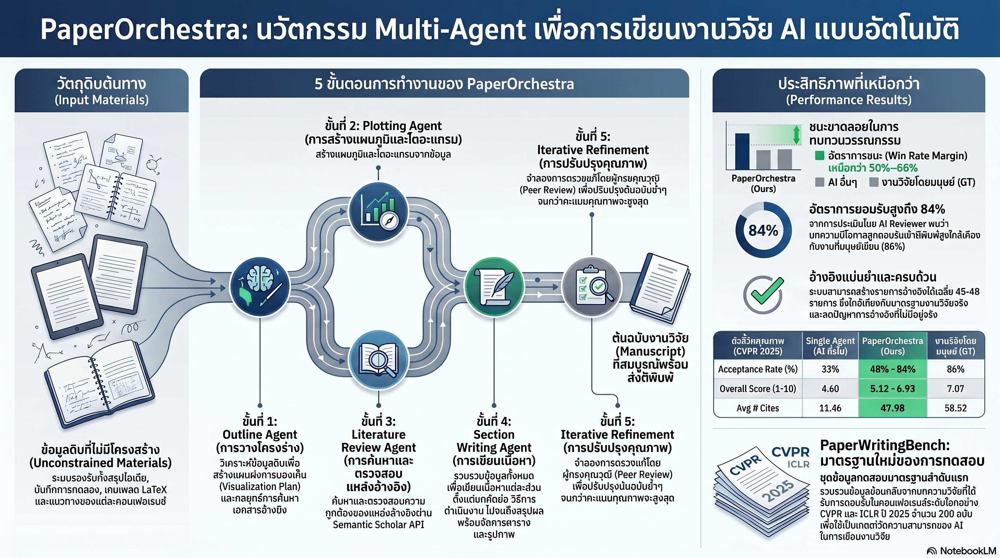

[กลับไปที่หน้าหลัก](../README.md)

สวัสดีครับเพื่อนๆ ที่ติดตามวงการ AI! วันนี้มาเรื่องที่ท้าทายคำถามสำคัญที่สุดในแวดวงวิชาการว่า "AI เขียนงานวิจัยได้แค่ไหน?" จากทีม Google Research ด้วย PaperOrchestra เฟรมเวิร์ก Multi-Agent ที่เปลี่ยนไอเดียบนกระดาษให้กลายเป็น Submission-ready Paper ระดับ CVPR ครับ

คุณเคยสงสัยไหมครับว่า ทำไมการใช้ AI เขียนงานวิจัยทั้งฉบับด้วย Prompt เดียวมักได้ผลลัพธ์ที่ตื้นเขิน มี Hallucination สูง และอ้างอิงงานวิชาการผิดๆ ทั้งที่โมเดลดูจะฉลาดมาก?

คุณรู้ไหมครับว่า AI ที่แบ่งงานเป็น 5 เอเจนต์ทำงานแบบคู่ขนานสามารถสร้างงานวิจัยระดับ CVPR ที่มีอัตราการตอบรับ 84% (เทียบกับมนุษย์ที่ 86%) ได้ในเวลาเฉลี่ยเพียง 39.6 นาที โดยไม่ต้องให้ผู้ใช้ระบุสูตรคณิตศาสตร์ใดๆ เลย?

และคุณเคยนึกไหมครับว่า ปัญหาที่แท้จริงของ AI นักเขียนงานวิจัยไม่ใช่ "เขียนไม่เก่ง" แต่คือ "อ้างอิงงานวิจัยเฉลี่ยเพียง 9-14 ชิ้น" ในขณะที่มนุษย์อ้างถึง 59 ชิ้น ซึ่งหมายความว่า AI ขาดความลึกในการสืบค้นวิชาการ ไม่ใช่ขาดความสามารถในการเขียน?

สิ่งที่ PaperOrchestra กำลังพิสูจน์คือ "วงออเคสตราที่มีนักดนตรีหลายคนเล่นพร้อมกัน" ทรงพลังกว่า "นักดนตรีคนเดียวที่พยายามเล่นทุกเครื่องพร้อมกัน" เสมอครับ

========================================

🤔 ทบทวนความเชื่อเดิมๆ: สิ่งที่เราคิดเกี่ยวกับ AI กับการเขียนงานวิจัย

▪ "ถ้าอยากให้ AI เขียนงานวิจัยได้ดี แค่ต้องเขียน Prompt ให้ละเอียดและยาวพอ" → Monolithic Prompt ยิ่งยาว ยิ่งเสี่ยง Hallucination เพราะโมเดลต้องบาลานซ์งานหลายมิติพร้อมกัน Multi-Agent แบบ PaperOrchestra ที่แบ่งหน้าที่ชัดเจน 5 เอเจนต์ ให้ผลดีกว่า +14-38% Win rate บน PaperWritingBenchครับ

▪ "F1 Score สูงหมายความว่า Citation Quality ดีและ AI อ้างอิงครบถ้วน" → Mathematical Artifact พลิกความเชื่อนี้ AI ที่อ้างอิงแค่ 9-14 ชิ้นมี F1 สูงแบบลวงตา เพราะ Precision สูง (ของที่อ้างถูกต้อง) แต่ Recall ต่ำมาก (พลาดงานที่ควรอ้างไปมหาศาล) P1 Recall คือตัววัดที่บอกความจริงครับ

▪ "AI เขียนงานวิจัยได้แต่วาดแผนภาพแนวคิด (Conceptual Diagram) ไม่ได้ เพราะต้องการความเข้าใจเชิงโครงสร้างที่ลึกมาก" → PaperBanana + VLM Critic พิสูจน์ว่า AI สร้าง Conceptual Diagrams จากศูนย์ได้ และ Self-correct ซ้ำๆ จนได้ภาพที่สมบูรณ์โดยมีระบบ VLM เป็นผู้ตรวจสอบอัตโนมัติครับ

▪ "AI ที่เขียนงานวิจัยได้ดีคือ AI ที่มาแทนนักวิจัย เป็นภัยต่อวงการวิชาการ" → PaperOrchestra ถูกออกแบบให้เป็น Assistive Tool ที่ทรงพลัง มนุษย์ยังต้องเป็น Accountable Author ที่รับผิดชอบความถูกต้องเชิงเนื้อหาและจริยธรรมทั้งหมด AI ทำหน้าที่ "แปลงวัตถุดิบเป็นร่างแรก" ไม่ใช่ "คิดแทนมนุษย์" ครับ

ความจริงที่น่าคิดคือ: ปัญหาของ AI นักเขียนงานวิจัยไม่เคยอยู่ที่ความสามารถในการเรียบเรียง แต่อยู่ที่ความลึกของการสืบค้น ความถูกต้องของการอ้างอิง และความสามารถในการ Self-correct ซึ่ง PaperOrchestra แก้ได้ครบทั้ง 3 ข้อครับ

========================================

🧠 พื้นฐานที่ต้องเข้าใจก่อน: PaperWritingBench, P1 Recall, Sparse Idea และ AgentReview

=== PaperWritingBench คืออะไร? ===

PaperWritingBench = ชุดข้อมูลทดสอบที่ Reverse-engineer จากงานวิจัยจริง 200 ฉบับใน CVPR และ ICLR

วิธีการ: เอาเปเปอร์จริงมา "ถอดรหัส" เป็นชุด Input (ไอเดีย + ข้อมูลดิบ) แล้วทดสอบว่า AI สร้างเปเปอร์ที่ใกล้เคียงกับต้นฉบับจริงได้มากแค่ไหน

เปรียบเทียบ: เหมือนทดสอบเชฟโดยให้เมนูอาหารต้นฉบับและส่วนผสม แล้ววัดว่าอาหารที่ทำออกมาใกล้เคียงรสชาติต้นตำรับแค่ไหนครับ

=== P1 Recall (Good-to-Cite) vs F1 Score ===

F1 Score = ค่ากลางระหว่าง Precision (ความถูกต้องของสิ่งที่อ้าง) และ Recall (ความครอบคลุมของสิ่งที่ควรอ้าง)

ปัญหา: ถ้า AI อ้างอิงน้อยมาก (9-14 ชิ้น) แต่ทุกชิ้นถูกต้อง F1 จะสูงแบบ "Mathematical Artifact" แม้ว่าจริงๆ พลาดงานสำคัญไปมากมาย

P1 Recall (Good-to-Cite) = ค่าที่วัดเฉพาะความสามารถในการค้นพบงานวิจัยที่ "ควรอ้าง" แต่ไม่ใช่งานหลักที่ทุกคนรู้จัก

เปรียบเทียบ: เหมือนวัดว่านักสืบค้นวิชาการค้นพบเอกสารสำคัญที่ซ่อนอยู่ลึกในคลังได้แค่ไหน ไม่ใช่แค่หยิบหนังสือขายดีจากชั้นหน้าร้านครับ

=== Sparse Idea คืออะไร? ===

Sparse Idea = การที่ผู้ใช้ให้เพียงคำอธิบายเชิงแนวคิดระดับสูง โดยไม่มีสูตรคณิตศาสตร์หรือรายละเอียดเทคนิค

ทดสอบ: ถ้า AI ยังสร้างงานวิจัยคุณภาพดีได้จาก Sparse Idea นั่นหมายความว่ามันเข้าใจ "ความหมาย" ไม่ใช่แค่ "สูตร"

เปรียบเทียบ: เหมือนบอกเชฟว่า "อยากได้อาหารรสเข้มข้น ออกหวานนิดหน่อย ดูอบอุ่น" โดยไม่ต้องบอกสูตรแล้วเชฟรู้ว่าต้องหาวัตถุดิบอะไรเอง ต้องการทักษะเชิงแนวคิดที่ลึกกว่าการทำตามสูตรครับ

=== AgentReview และ Self-correction Loop ===

AgentReview = ระบบจำลอง Peer-review ที่ฝังอยู่ใน PaperOrchestra ทำหน้าที่ขัดเกลาเนื้อหาในขั้นตอนสุดท้าย

Logic ของ Self-correction:
▸ แก้ไขเนื้อหา → ประเมินคะแนน
▸ IF คะแนนเพิ่มขึ้น → Accept การเปลี่ยนแปลง
▸ IF คะแนนลดลง → Halt + Revert สู่เวอร์ชันที่ดีกว่าทันที

เปรียบเทียบ: เหมือนประแจ Ratchet ที่ขันได้ทิศทางเดียว เนื้อหาจะมีแต่ดีขึ้นหรือคงเดิม ไม่มีทางแย่ลงได้จากกระบวนการขัดเกลาครับ

=== Semantic Scholar API Verification ===

กลไกป้องกัน Hallucination ใน Literature Review:
▸ Phase 1: ค้นหา Candidate Papers ผ่าน Web Search
▸ Phase 2: ยืนยันความมีอยู่จริงผ่าน Semantic Scholar API

เปรียบเทียบ: เหมือนนักข่าวที่ไม่แค่ "จำข่าว" มาเล่า แต่ต้องตรวจสอบกับฐานข้อมูลก่อนทุกครั้งว่าเหตุการณ์นั้นเกิดขึ้นจริงครับ

========================================

1️⃣ จาก Monolithic Prompt สู่ Multi-Agent Harmony: 5 เอเจนต์ 39.6 นาที

=== ปัญหาของ Single Agent / Monolithic Prompt ===

เมื่อสั่งให้ AI เขียนงานวิจัยทั้งฉบับด้วย Prompt เดียว มันต้องบาลานซ์งานที่ต้องการทักษะต่างกันพร้อมกันทั้งหมดครับ

[งานที่ต้องทำพร้อมกัน]
▸ วางโครงสร้างเนื้อหาอย่างมีตรรกะ
▸ สืบค้นวรรณกรรมอย่างครอบคลุม
▸ สร้างแผนภาพแนวคิดที่สื่อความหมายได้
▸ เขียนเนื้อหาในรายละเอียดทุกส่วน
▸ ขัดเกลาจนได้คุณภาพพร้อม Submission

[ผลลัพธ์ที่มักเกิดขึ้น]
▸ Hallucination: อ้างชื่อเปเปอร์ที่ไม่มีอยู่จริง
▸ Shallow depth: เขียนได้กว้างแต่ไม่ลึก
▸ งานขาดความสอดคล้องระหว่างส่วนต่างๆ ครับ

=== สถาปัตยกรรม 5 เอเจนต์ของ PaperOrchestra ===

[เอเจนต์ที่ 1: Outline Agent]
▸ วางโครงสร้างบทความและแผนการนำเสนอภาพ
▸ กำหนดทิศทางที่เอเจนต์อื่นๆ จะทำงานตาม

[เอเจนต์ที่ 2: Plotting Agent (PaperBanana)]
▸ ออกแบบและสร้างแผนภูมิ + Conceptual Diagrams
▸ ทำงานคู่ขนานกับ Literature Review Agent ได้พร้อมกัน

[เอเจนต์ที่ 3: Literature Review Agent]
▸ สืบค้นและวิเคราะห์งานวิจัยที่เกี่ยวข้องอย่างเจาะลึก
▸ ตรวจสอบทุกการอ้างอิงผ่าน Semantic Scholar API

[เอเจนต์ที่ 4: Section Writing Agent]
▸ เขียนเนื้อหาในแต่ละส่วนอย่างละเอียด
▸ รับข้อมูลจาก Outline + Literature + Plots พร้อมกัน

[เอเจนต์ที่ 5: Content Refinement Agent (AgentReview)]
▸ ขัดเกลาเนื้อหาผ่านระบบจำลอง Peer-review
▸ Self-correct โดย Revert อัตโนมัติเมื่อคุณภาพลดลงครับ

[ผลลัพธ์]
▸ เวลาเฉลี่ย: 39.6 นาทีต่อฉบับ (Parallelism ช่วยลดเวลามหาศาล)
▸ Win rate: +14-38% เหนือ AI รุ่นเดิมบน PaperWritingBench (200 เปเปอร์จาก CVPR/ICLR)

========================================

2️⃣ Sparse Idea Robustness: เขียนงานวิจัยลึกได้แม้ผู้ใช้ไม่รู้สูตรคณิตศาสตร์

=== ทำไม Sparse Idea ถึงเป็นบทพิสูจน์ที่สำคัญ ===

ถ้า AI เขียนงานวิจัยได้ดีเฉพาะเมื่อได้รับข้อมูลครบถ้วน มันแค่ "ประกอบชิ้นส่วน" แต่ถ้าทำได้แม้จากแนวคิดเริ่มต้นเพียงอย่างเดียว นั่นแสดงว่ามัน "เข้าใจ" ครับ

[สิ่งที่ Sparse Idea มีให้]
▸ High-level conceptual narrative เท่านั้น
▸ ไม่มี Mathematical notation
▸ ไม่มีรายละเอียดเทคนิค

[สิ่งที่ Literature Review Agent ต้องทำเอง]
▸ ค้นหา Research Gap จากฐานข้อมูลงานวิจัยจริง
▸ ระบุว่างานในอดีตแก้อะไรได้บ้างและยังขาดอะไร
▸ สร้าง Context ที่ทำให้ไอเดียใหม่มีความหมายครับ

=== Two-Phase Verification: วิธีที่ AI หยุด Hallucinate ===

[Phase 1: Web Search]
▸ ระบุ Candidate Papers ที่น่าจะเกี่ยวข้อง
▸ กว้าง เร็ว แต่ยังไม่ตรวจสอบความมีอยู่จริง

[Phase 2: Semantic Scholar API Authentication]
▸ ยืนยันทุกรายการว่ามีอยู่ในฐานข้อมูลงานวิจัยจริง
▸ ถ้าไม่พบ → ตัดออก ไม่ใส่ไปเป็น Citation

เปรียบเทียบ: เหมือนการทำรายงานที่ไม่แค่ "จำชื่อหนังสือ" มาใส่ แต่ต้องไปตรวจที่ห้องสมุดว่าหนังสือเล่มนั้นมีอยู่จริงและหน้าที่อ้างถึงตรงกับเนื้อหาที่กล่าวถึงครับ

ผลลัพธ์: AI ไม่สามารถ "สร้างชื่อเปเปอร์ขึ้นมาเอง" ได้อีกต่อไป เพราะทุกการอ้างอิงต้องผ่านการตรวจสอบจากฐานข้อมูลจริงครับ

========================================

3️⃣ Shallow Citation Crisis: จาก 9 รายการสู่ 45 รายการ และ P1 Recall ที่พุ่งจาก 0% สู่ 17%

=== ตารางเปรียบเทียบคุณภาพการอ้างอิง ===

[Single Agent]
▸ จำนวน Citations เฉลี่ย: 9-11 รายการ
▸ P1 Recall (Good-to-Cite): ~3.2%

[AI Scientist-v2]
▸ จำนวน Citations เฉลี่ย: 14 รายการ
▸ P1 Recall (Good-to-Cite): ~3.3%

[PaperOrchestra]
▸ จำนวน Citations เฉลี่ย: 45-48 รายการ
▸ P1 Recall (Good-to-Cite): 16-17%

[Human (Ground Truth)]
▸ จำนวน Citations เฉลี่ย: ~59 รายการ
▸ P1 Recall (Good-to-Cite): 100% (Baseline)

=== ทำไม F1 สูงของ AI รุ่นเก่าจึงเป็นแค่ Illusion ===

AI Scientist-v2 มี F1 ที่ดูดี เพราะอ้างอิงน้อยมาก (14 ชิ้น) แต่ทุกชิ้นเป็นงานดังที่ถูกต้อง ทำให้ Precision สูง แต่ P1 Recall แค่ 3.3% หมายความว่ามันพลาดงานที่ "ควรอ้าง" ไปถึง 96.7%

เปรียบเทียบ: เหมือนนักสืบค้นวิชาการที่อ้างแค่หนังสือขายดี 5 เล่มในห้องสมุดได้ถูกต้องทั้งหมด แต่พลาดเอกสารสำคัญหลายร้อยชิ้นที่ซ่อนอยู่ในชั้นลึก ซึ่งคือสิ่งที่แยก "งานวิจัยดี" ออกจาก "งานวิจัยดีมาก" ครับ

=== นัยสำคัญของ P1 Recall ที่ 16-17% ===

แม้ 16-17% จะยังห่างจาก 100% ของมนุษย์ แต่การก้าวจาก ~3% เป็น ~17% คือการปลดล็อควิธีที่ AI สืบค้นวรรณกรรมออกจาก "แค่รู้จักงานดัง" ไปสู่ "เริ่มเจาะลึกเข้าไปในเครือข่ายวิชาการ" ซึ่งคือคุณสมบัติที่ขาดหายไปโดยสิ้นเชิงจาก AI รุ่นก่อนครับ

========================================

4️⃣ PaperBanana + VLM Critic + AgentReview: เมื่อ AI ออกแบบและขัดเกลางานด้วยตัวเอง

=== PaperBanana: AI ที่วาดรูปและ Self-correct ===

งานวิจัยสมัยใหม่ต้องการมากกว่าข้อความ Conceptual Diagram ที่อธิบายสถาปัตยกรรมโมเดลเป็นสิ่งที่ Reviewer ใช้ตัดสินคุณภาพงานอย่างรวดเร็วครับ

[ความสามารถของ PaperBanana]
▸ สร้าง Conceptual Diagrams จากศูนย์ ไม่ใช่แค่ Plot กราฟจากตัวเลข
▸ VLM Critic (Vision-Language Model) ตรวจสอบภาพที่สร้างขึ้น
▸ ถ้าพบ Visual Artifacts หรือความหมายผิดเพี้ยน → สั่ง Redraw อัตโนมัติ
▸ วนซ้ำจนได้ภาพที่สมบูรณ์โดยไม่ต้องมีมนุษย์ตรวจทานครับ

เปรียบเทียบ: เหมือนมีบรรณาธิการภาพที่ตรวจทุกภาพประกอบก่อนส่งตีพิมพ์ แต่ทำงานแบบอัตโนมัติและไม่เคยเหนื่อยครับ

=== AgentReview: Peer-review ในตัว ===

Content Refinement Agent จำลอง Peer-review มาไว้ใน PaperOrchestra เพื่อขัดเกลาเนื้อหาก่อน Submission จริง

[Self-correction Logic]
▸ แก้ไขเนื้อหา → ประเมินคะแนนใหม่
▸ คะแนนเพิ่มขึ้น → Commit การเปลี่ยนแปลง (Accept)
▸ คะแนนลดลง → Halt + Revert สู่เวอร์ชันที่ดีกว่าทันที

[ผลลัพธ์เชิงตัวเลข]
▸ Acceptance Rate ในระบบจำลองเพิ่ม: +19-22%
▸ CVPR Acceptance Rate: 84% (เทียบมนุษย์ 86%)

เปรียบเทียบ: เหมือนนักกีฬาที่มีระบบ Video Analysis ติดตัวตลอดเวลา ทุกการเคลื่อนไหวถูกประเมินทันที และบันทึกเฉพาะฟอร์มที่ดีขึ้น ไม่เคยถดถอยจากจุดที่ดีที่สุดครับ

=== บทบาทที่ถูกต้องของ PaperOrchestra ===

[สิ่งที่ PaperOrchestra ทำ]
▸ แปลง Raw Ideas → Submission-ready Draft ใน 39.6 นาที
▸ สืบค้นวรรณกรรมลึกกว่า AI รุ่นเดิม 5 เท่า (45-48 vs 9-14 citations)
▸ สร้างภาพประกอบและขัดเกลาเนื้อหาด้วยตัวเอง

[สิ่งที่ PaperOrchestra ไม่ทำ]
▸ ไม่ได้ "คิด" ไอเดียวิจัยใหม่ขึ้นมาเอง
▸ ไม่ได้รับผิดชอบความถูกต้องเชิงเนื้อหาและจริยธรรม
▸ ไม่ได้แทนที่การทดลองจริงและการตีความผลที่ต้องการความเชี่ยวชาญ

มนุษย์ยังต้องเป็น Accountable Author เสมอ ซึ่งคือผู้ที่รับผิดชอบว่างานชิ้นนั้นถูกต้องและซื่อสัตย์ต่อวงการวิชาการครับ

========================================

🎯 สรุป: เมื่อ AI เปลี่ยนจาก "เครื่องพิมพ์ดีด" เป็น "วงออเคสตราวิชาการ"

PaperOrchestra สรุปได้ด้วย 4 นวัตกรรมหลัก: Multi-Agent Parallelism (5 เอเจนต์, 39.6 นาที, Win rate +14-38%), Sparse Idea Robustness (ไม่ต้องให้สูตรคณิตศาสตร์), Deep Citation Pipeline (45-48 citations, P1 Recall 16-17% จาก 3%), และ AgentReview Self-correction (CVPR Acceptance 84% เทียบ Human 86%)

สิ่งที่น่าสนใจกว่าตัวเลขคือนัยต่อวงการวิชาการครับ ถ้า AI สามารถทำงานร่าง (Draft) ที่ใช้เวลามนุษย์หลายสัปดาห์ให้เสร็จใน 39.6 นาที คำถามไม่ใช่ "AI จะแทนนักวิจัยได้ไหม" แต่คือ "บทบาทที่มนุษย์ควรโฟกัสคืออะไร" ซึ่งคำตอบที่ PaperOrchestra บอกคือ การตั้งคำถามที่แหลมคม การออกแบบการทดลองที่ลึกซึ้ง และการตีความผลลัพธ์ที่ต้องการประสบการณ์จริง ซึ่งคือสิ่งที่ยังไม่มีอัลกอริทึมใดทำแทนได้ครับ

========================================

💬 คำถามท้ายทาย: ลองคิดดูนะครับ

▪ PaperOrchestra ทำ P1 Recall ได้ 16-17% ในขณะที่มนุษย์ทำได้ 100% ช่องว่างที่เหลือ 83% นั้นคืออะไรกันแน่ คือความจำ? ความเชี่ยวชาญ? หรือ "สัญชาตญาณวิชาการ" ที่ยังถ่ายทอดเป็นอัลกอริทึมไม่ได้ครับ?

▪ ถ้า AI เขียน Draft งานวิจัยได้ใน 39.6 นาที แต่มนุษย์ใช้เวลาหลายสัปดาห์ เวลาที่ประหยัดได้นั้นควรนำไปลงทุนกับอะไร เพื่อให้วงการวิชาการก้าวหน้าไปได้เร็วขึ้นจริงๆ ครับ?

▪ AgentReview จำลอง Peer-review ได้ดีพอให้ Acceptance Rate ขึ้น +19-22% ถ้า AI เริ่มเข้าใจว่า "Reviewer อยากเห็นอะไร" ระบบ Peer-review ของวงการวิชาการในปัจจุบันยังเชื่อถือได้แค่ไหน หรือมันกำลังถูก Optimize โดยไม่รู้ตัวครับ?

▪ PaperOrchestra กำหนดให้มนุษย์ต้องเป็น Accountable Author เสมอ แต่ถ้า 90% ของเนื้อหาสร้างโดย AI ขอบเขตของ "ความรับผิดชอบ" ของมนุษย์ในงานวิชาการควรถูกนิยามใหม่อย่างไรครับ?

========================================

References:
- PaperOrchestra: Multi-Agent Framework for Research Paper Generation (Google Research)
- PaperWritingBench: Benchmark Derived from 200 CVPR/ICLR Papers
- Semantic Scholar API for Citation Verification
- PaperBanana: Visual Intelligence Module with VLM Critic
- AgentReview: Simulated Peer-review Self-refinement System
- Comparison: Single Agent / AI Scientist-v2 / PaperOrchestra / Human Baseline

ถ้าวงออเคสตราต้องการทั้ง "นักดนตรีที่เก่ง" และ "ผู้ควบคุมวงที่มีวิสัยทัศน์" วงวิจัย AI ในอนาคตก็คงต้องการทั้ง "เอเจนต์ที่แม่นยำ" และ "นักวิจัยที่รู้ว่ากำลังถามคำถามอะไร" ครับ

#AI #ArtificialIntelligence #PaperOrchestra #MultiAgent #GoogleResearch #AcademicWriting #LLM #ResearchAutomation #CitationQuality #CVPR #ICLR #PeerReview #LiteratureReview #AgentAI #AcademicAI
