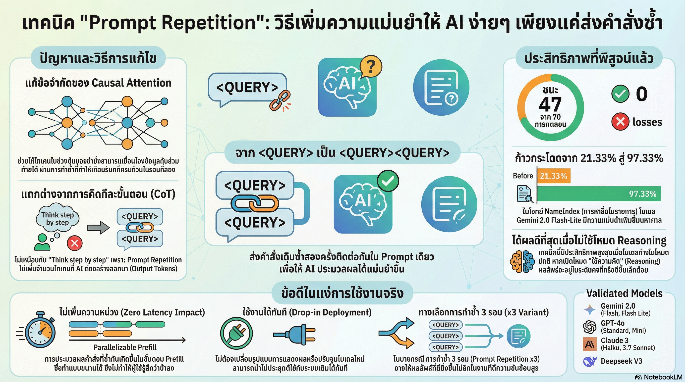

[กลับไปที่หน้าหลัก](../README.md)

สวัสดีครับเพื่อนๆ! วันนี้เรามาคุยเรื่องที่น่าแปลกใจมากๆ เกี่ยวกับการใช้ AI กันครับ

คุณเคยสงสัยไหมว่า ทำไมบางทีเราถามอะไร AI แล้วมันตอบผิดๆ ถูกๆ? แล้วถ้าบอกว่ามีเทคนิคง่ายๆ ที่แค่ "Copy-Paste คำสั่งเดิมซ้ำๆ" ก็ทำให้ AI ตอบถูกต้องขึ้นได้ คุณจะเชื่อไหม?

ฟังดูแปลกมากใช่ไหมครับ? เหมือนเป็น "บั๊ก" มากกว่า "ฟีเจอร์" เลย!

แต่งานวิจัยล่าสุดจากทีม Google Research พบว่า การส่ง Prompt (คำสั่ง) เดิมซ้ำสองรอบในข้อความเดียว ช่วยเพิ่มความแม่นยำให้โมเดล AI รุ่นท็อปๆ ได้อย่างน่าทึ่ง!

มันเหมือนกับตอนที่เราพูดกับเพื่อน แล้วเขาทำหน้ามึนๆ เราก็มักจะ "พูดประโยคเดิมซ้ำอีกรอบ" เพื่อให้เขาเข้าใจชัดขึ้น ใช่ไหมครับ?

วันนี้เรามาดูกันว่า Prompt Repetition ทำงานยังไง และทำไมถึงได้ผลครับ!

========================================

🤔 ทบทวนพื้นฐาน: Prompt คืออะไร?

ก่อนที่เราจะไปดูเทคนิค มาทำความเข้าใจพื้นฐานกันก่อนนะครับ

=== Prompt คืออะไร? ===

Prompt = คำสั่งหรือคำถามที่เราส่งให้ AI

ตัวอย่าง:
▸ "สรุปเอกสารนี้ให้หน่อย"
▸ "แปลภาษาอังกฤษเป็นไทย"
▸ "หาชื่อคนที่ 5 ในรายการนี้"

=== ปัญหาของ AI ===

บางทีเราถาม AI แล้ว:
▸ มันตอบผิด
▸ มันไม่เข้าใจคำถาม
▸ มันตอบไม่ตรงประเด็น

ตัวอย่างปัญหาจริง:

คำถาม: "หาชื่อคนที่ 5 ในรายการนี้: John, Mary, Peter, Susan, David, Lisa"

AI ตอบ: "Peter" (ผิด! ที่ 5 คือ David)

นี่คือปัญหาที่เราจะมาแก้กันครับ!

========================================

1. 📊 ยิ่งพูดย้ำ ยิ่งแม่นยำ: สถิติ "ชนะ 47 แพ้ 0"

มาดูผลการทดสอบจริงกันครับ น่าทึ่งมาก!

=== การทดสอบ ===

ทีมวิจัยได้ทดสอบ Prompt Repetition กับโมเดลชั้นนำในตลาด:

[Google]
▸ Gemini 2.0 Flash
▸ Gemini 2.0 Flash-Lite

[OpenAI]
▸ GPT-4o
▸ GPT-4o-mini

[Anthropic]
▸ Claude 3 Haiku
▸ Claude 3.7 Sonnet

[DeepSeek]
▸ DeepSeek V3

=== ผลการทดสอบ ===

ทดสอบ 70 ครั้ง ในสภาวะที่ไม่มีการเปิดโหมด Reasoning

ผลลัพธ์:
▸ ชนะ: 47 ครั้ง (ให้ผลลัพธ์ดีกว่าเดิม)
▸ เสมอ: 23 ครั้ง (ไม่ต่างจากเดิม)
▸ แพ้: 0 ครั้ง (ไม่มีครั้งไหนที่แย่กว่าเดิม!)

นี่หมายความว่า:
▸ แทบทุกครั้งที่ใช้เทคนิคนี้ ผลลัพธ์จะดีขึ้น หรือเท่าเดิม
▸ ไม่เคยทำให้แย่ลงเลย!
▸ มีแต่ได้กับได้!

สรุป: การลงทุนเพียงแค่การ Copy-Paste คือทางเลือกที่มีแต่ 'เจ๊า' กับ 'เจี๊ยะ' เท่านั้น!

========================================

2. 🔬 เบื้องหลังความมหัศจรรย์: ทำไมถึงได้ผล?

มาดูเหตุผลทางเทคนิคกันครับ ว่าทำไมการพูดซ้ำถึงได้ผล

=== Causal Language Models คืออะไร? ===

AI ส่วนใหญ่ถูกฝึกมาเป็น Causal Language Models

หมายถึง:
▸ ประมวลผลข้อมูลตามลำดับจากซ้ายไปขวา
▸ โทเคน (คำ) ที่อยู่ข้างหน้า "มองไม่เห็น" โทเคนที่จะตามมา
▸ เหมือนเราอ่านหนังสือทีละคำ จากซ้ายไปขวา ไม่สามารถย้อนกลับมาดูก่อนหน้าได้

ตัวอย่าง:

เมื่อ AI อ่านประโยค: "สรุป เอกสาร นี้"

ขณะอ่านคำว่า "สรุป":
▸ AI รู้แค่คำว่า "สรุป"
▸ ยังไม่รู้ว่าต่อไปจะมีคำว่า "เอกสาร" หรือ "นี้"
▸ ไม่สามารถมองข้างหน้าได้

นี่คือ "Information Bottleneck" หรือคอขวดของข้อมูล!

=== Prompt Repetition แก้ปัญหายังไง? ===

เมื่อเราส่งคำสั่งแบบนี้:

"สรุปเอกสารนี้ สรุปเอกสารนี้"

สิ่งที่เกิดขึ้น:

[รอบที่ 1: AI อ่านคำสั่งครั้งแรก]
▸ AI อ่านทีละคำ จากซ้ายไปขวา
▸ ยังไม่เข้าใจบริบทเต็มที่

[รอบที่ 2: AI อ่านคำสั่งครั้งที่สอง]
▸ AI ได้ "เห็น" บริบททั้งหมดจากการอ่านรอบแรกแล้ว!
▸ โทเคนในรอบที่สองมี "hindsight" หรือความเข้าใจย้อนหลัง
▸ เชื่อมโยงข้อมูลได้แม่นยำขึ้น!

เปรียบเทียบ:

รอบเดียว = อ่านโจทย์ครั้งเดียว แล้วลงมือทำทันที
▸ อาจจะพลาดรายละเอียดบางอย่าง

สองรอบ = อ่านโจทย์ซ้ำอีกรอบ ก่อนลงมือทำ
▸ เข้าใจชัดเจนขึ้น
▸ จับประเด็นได้ดีกว่า

"สิ่งนี้ช่วยให้แต่ละโทเคนใน Prompt สามารถให้ความสนใจ (Attend) กับโทเคนอื่นๆ ใน Prompt ได้ครบทุกตัว"

========================================

3. 💰 ของฟรีมีอยู่จริง: เก่งขึ้นโดยแทบไม่มีต้นทุนเพิ่ม

สิ่งที่น่าทึ่งที่สุดคือ เทคนิคนี้แทบไม่มีต้นทุนเพิ่ม!

=== ปกติเก่งขึ้น = แลกมาด้วยความช้า ===

[เทคนิคอื่นๆ ที่ทำให้ AI เก่งขึ้น]

ตัวอย่าง: "Think step by step"

วิธีการ:
▸ บอก AI ให้คิดทีละขั้นตอน
▸ AI เขียนกระบวนการคิดยาวเหยียด

ผลลัพธ์:
▸ AI เก่งขึ้น ตอบถูกต้องขึ้น
▸ แต่ต้องรอนานขึ้น
▸ เสียค่า Token ขาออกเพิ่ม (คำตอบยาวขึ้น)

=== Prompt Repetition = Zero-cost Gain! ===

[เทคนิค Prompt Repetition]

วิธีการ:
▸ Copy-Paste คำสั่งเดิมซ้ำสองรอบ

ผลลัพธ์:
▸ AI เก่งขึ้น
▸ แต่ไม่ช้าลง!
▸ ไม่เสียค่า Token ขาออกเพิ่ม!

ทำไมถึงไม่ช้าลง?

เพราะกระบวนการประมวลผลคำสั่งที่ยาวขึ้นเกิดขึ้นในช่วง "Prefill Stage"

Prefill Stage คืออะไร?
▸ ช่วงที่ AI อ่านคำสั่งของเรา
▸ ระบบสามารถประมวลผลแบบขนาน (Parallelizable) ได้
▸ อ่านคำทั้งหมดพร้อมกัน ไม่ได้อ่านทีละคำ

ดังนั้น:
▸ แม้คำสั่งจะยาวขึ้น 2 เท่า
▸ เวลาที่ใช้ก็แทบไม่เพิ่ม
▸ ความเร็วในการตอบกลับแทบไม่ต่างจากเดิม

และที่สำคัญ:
▸ ไม่เพิ่มจำนวน Token ที่ AI พิมพ์ตอบออกมา
▸ ดังนั้นไม่เสียค่าใช้จ่ายเพิ่ม!

=== ข้อควรสังเกต ===

สำหรับงานที่คำสั่งยาวมากๆ (เช่น เอกสารหลายหน้า):
▸ ผู้ใช้ Claude Haiku หรือ Sonnet อาจจะรู้สึกว่า AI ใช้เวลาประมวลผลในช่วงเริ่มนานขึ้นเล็กน้อย

แต่สำหรับงานทั่วไป:
▸ ผลกระทบแทบไม่มีนัยสำคัญ

สรุป: เก่งขึ้นฟรีๆ แทบไม่มีต้นทุนเพิ่ม!

========================================

4. 🚀 พลังทำลายล้างในโจทย์ยาก: จาก 21% พุ่งสู่ 97%

เทคนิคนี้โดดเด่นที่สุดในงานที่ยาก!

=== งานประเภท "งมเข็มในมหาสมุทร" ===

ลักษณะงาน:
▸ การค้นหาข้อมูลในบริบทที่ซับซ้อน
▸ เช่น หาชื่อคนลำดับที่ 5 ในรายการยาวๆ
▸ หาข้อมูลเฉพาะจุดในเอกสารจำนวนมาก

Benchmark ที่ใช้ทดสอบ:
▸ NameIndex (การหาชื่อลำดับที่ระบุ)
▸ MiddleMatch (การจับคู่ข้อมูลกลางๆ)

=== ผลลัพธ์ที่น่าทึ่ง! ===

ตัวอย่างที่ชัดเจนที่สุด: Gemini 2.0 Flash-Lite

[ไม่ใช้ Prompt Repetition]
▸ ความแม่นยำ: 21.33%
▸ ตอบถูกแค่ 2 ใน 10 ครั้ง

[ใช้ Prompt Repetition x2]
▸ ความแม่นยำ: 97.33%
▸ ตอบถูกเกือบ 10 ใน 10 ครั้ง!

การเพิ่มขึ้น:
▸ จาก 21.33% เป็น 97.33%
▸ เพิ่มขึ้นเกือบ 4 เท่า!

นี่คือการปรับปรุงที่น่าทึ่งมากๆ!

=== Pro-tip: x3 สำหรับงานที่ยากมาก ===

งานวิจัยยังพบอีกว่า:
▸ สำหรับงานที่ยากระดับ Extreme
▸ การใช้ Prompt Repetition x3 (Copy-Paste 3 รอบ)
▸ ให้ผลลัพธ์ดีกว่าการทำแค่ 2 รอบเสียอีก!

ตัวอย่าง:

x1: "หาชื่อคนที่ 5 ในรายการนี้: [รายการ]"

x2: "หาชื่อคนที่ 5 ในรายการนี้: [รายการ] หาชื่อคนที่ 5 ในรายการนี้: [รายการ]"

x3: "หาชื่อคนที่ 5 ในรายการนี้: [รายการ] หาชื่อคนที่ 5 ในรายการนี้: [รายการ] หาชื่อคนที่ 5 ในรายการนี้: [รายการ]"

ผลลัพธ์: x3 > x2 > x1

========================================

5. 🤖 แล้วโมเดลสาย Reasoning ล่ะ?

คำถามสำคัญ: ถ้าใช้โมเดลที่มีโหมด Thinking อยู่แล้วล่ะ?

=== โมเดลสาย Reasoning คือ? ===

ตัวอย่าง:
▸ OpenAI o1
▸ Claude Thinking

คุณสมบัติ:
▸ เปิดโหมด Reasoning ได้
▸ AI จะ "คิด" ก่อนตอบ
▸ ทวนโจทย์ในความคิดของตัวเองก่อน

=== ผลการทดสอบกับ Reasoning Models ===

ทดสอบ 28 รายการ

ผลลัพธ์:
▸ ชนะ: 5 ครั้ง
▸ แพ้: 1 ครั้ง
▸ เสมอ (Neutral): 22 ครั้ง

สรุป:
▸ ไม่ได้ช่วยให้เก่งขึ้นแบบผิดหูผิดตา
▸ แต่ก็ยังไม่มีข้อเสียร้ายแรง
▸ ส่วนใหญ่ผลลัพธ์เท่าเดิม

=== ทำไมถึงเป็นแบบนี้? ===

เหตุผล:
▸ โมเดลสาย Reasoning ถูกฝึกมาให้ "ทวนโจทย์" ในความคิดของตัวเองอยู่แล้ว
▸ มันอ่านโจทย์หลายรอบในหัว
▸ ดังนั้นการย้ำจากภายนอกจึงไม่ได้ช่วยเพิ่มมากนัก

แต่ข้อดีคือ:
▸ ยังไม่มีข้อเสีย
▸ ลองใช้ดูก็ได้ ไม่ทำให้แย่ลง

========================================

6. 📝 กลยุทธ์: เมื่อไหร่ที่ควร "พูดซ้ำ"?

มาสรุปกันว่าควรใช้เทคนิคนี้เมื่อไหร่ครับ

=== ควรใช้ Prompt Repetition เมื่อ: ===

[1] Extraction & Classification]
▸ การสกัดข้อมูลจากข้อความยาวๆ
▸ การจัดหมวดหมู่ข้อมูล

ตัวอย่าง:
▸ "สกัดชื่อ, อีเมล, เบอร์โทรจากข้อความนี้"
▸ "จัดหมวดหมู่คำติชมลูกค้า"

[2] Long-context Retrieval
▸ การหาข้อมูลเฉพาะจุดในเอกสารจำนวนมาก
▸ งานประเภท "งมเข็มในมหาสมุทร"

ตัวอย่าง:
▸ "หาชื่อคนที่ 5 ในรายการนี้"
▸ "หาข้อมูลเกี่ยวกับ X ในเอกสาร 100 หน้านี้"

[3] Non-reasoning Tasks
▸ งานทั่วไปที่ไม่ต้องใช้การคิดวิเคราะห์หลายชั้น
▸ งานที่ต้องการความแม่นยำสูง

=== ไม่จำเป็นต้องใช้เมื่อ: ===

[1] Creative Writing
▸ งานเขียนเชิงสร้างสรรค์
▸ เช่น เขียนบทกวี, เขียนเรื่องสั้น

[2] Casual Chat
▸ การแชททั่วไป
▸ ถามตอบเรื่องทั่วไป

[3] Reasoning Models
▸ ถ้าเปิดโหมด Thinking อยู่แล้ว
▸ อาจไม่ได้ผลมากนัก

=== วิธีใช้ง่ายๆ ===

แทนที่จะพิมพ์:
"สรุปเอกสารนี้"

ให้พิมพ์:
"สรุปเอกสารนี้ สรุปเอกสารนี้"

หรือ Copy-Paste คำสั่งเดิมซ้ำอีกรอบ!

========================================

สรุป: "ก๊อปวาง" คือทางลัดสู่ความฉลาด

หลังจากที่เราได้เห็นข้อมูลทั้งหมดแล้ว มาสรุปกันครับ

=== สิ่งที่เราได้เรียนรู้ ===

[1] สถิติพูดไม่โกหก
▸ ชนะ 47 ครั้ง แพ้ 0 ครั้ง
▸ มีแต่ได้กับได้
▸ ไม่มีข้อเสียอะไรเลย

[2] เหตุผลทางเทคนิค
▸ แก้ปัญหา Information Bottleneck
▸ โทเคนรอบที่สองมี hindsight
▸ เชื่อมโยงข้อมูลได้ดีกว่า

[3] แทบไม่มีต้นทุนเพิ่ม
▸ ไม่ช้าลง
▸ ไม่เสียค่า Token ขาออกเพิ่ม
▸ เก่งขึ้นฟรีๆ

[4] ผลลัพธ์น่าทึ่งในงานยาก
▸ จาก 21% เป็น 97%
▸ เพิ่มขึ้นเกือบ 4 เท่า
▸ Pro-tip: ใช้ x3 สำหรับงานที่ยากมาก

[5] Reasoning Models
▸ ไม่ได้ช่วยเพิ่มมากนัก
▸ แต่ก็ไม่มีข้อเสีย

[6] เมื่อไหร่ควรใช้
▸ Extraction & Classification
▸ Long-context Retrieval
▸ Non-reasoning Tasks

=== Prompt Repetition คือ Default Standard ใหม่ ===

ในฐานะผู้ใช้งาน เราควรเริ่มมองว่า:
▸ Prompt Repetition คือ "มาตรฐานใหม่" ในการสั่งงาน AI
▸ โดยเฉพาะสำหรับงานที่ต้องการความแม่นยำสูง

วิธีการใช้:
▸ แค่ Copy-Paste คำสั่งเดิมซ้ำอีกรอบ
▸ ใช้เวลาเพิ่มแค่ไม่กี่วินาที
▸ แต่ได้ผลลัพธ์ที่แม่นยำกว่าเดิมเท่าตัว!

=== คำถามท้ายทาย ===

ในเมื่อการ "ก๊อปวาง" คำสั่งเดิมซ้ำๆ คือ:
▸ ทางลัดสู่ความฉลาดที่พิสูจน์แล้วด้วยสถิติ
▸ ไม่มีต้นทุนเพิ่ม
▸ มีแต่ได้กับได้

คุณพร้อมจะเสียเวลาเพิ่มอีกเพียงไม่กี่วินาทีเพื่อผลลัพธ์ที่แม่นยำกว่าเดิมเท่าตัวในงานชิ้นถัดไปของคุณแล้วหรือยัง?

=== ตัวอย่างการใช้งานจริง ===

มาลองดูตัวอย่างการใช้งานจริงกันครับ

[งาน: สกัดข้อมูลจากเอกสาร]

แบบเดิม:
"สกัดชื่อ, อีเมล, และเบอร์โทรจากข้อความนี้: [ข้อความยาว]"

แบบใหม่:
"สกัดชื่อ, อีเมล, และเบอร์โทรจากข้อความนี้: [ข้อความยาว] สกัดชื่อ, อีเมล, และเบอร์โทรจากข้อความนี้: [ข้อความยาว]"

ผลลัพธ์: แม่นยำขึ้นมาก!

---

[งาน: หาข้อมูลในรายการยาว]

แบบเดิม:
"หาชื่อคนที่ 5 ในรายการนี้: [รายการยาว 100 คน]"

แบบใหม่:
"หาชื่อคนที่ 5 ในรายการนี้: [รายการยาว 100 คน] หาชื่อคนที่ 5 ในรายการนี้: [รายการยาว 100 คน]"

ผลลัพธ์: จาก 21% เป็น 97% ความแม่นยำ!

========================================

อ้างอิง:
• Google Research: Prompt Repetition Study
• Tested on: Gemini, GPT-4o, Claude, DeepSeek
• Benchmarks: NameIndex, MiddleMatch

หวังว่าบทความนี้จะช่วยให้ทุกคนใช้ AI ได้มีประสิทธิภาพมากขึ้น แค่เพิ่มเทคนิค "ก๊อปวาง" ง่ายๆ ก็ได้ผลลัพธ์ที่ดีขึ้นเท่าตัวแล้ว!

ลองไปใช้กันดูนะครับ แล้วมาแชร์ประสบการณ์กันได้เลย 😊
