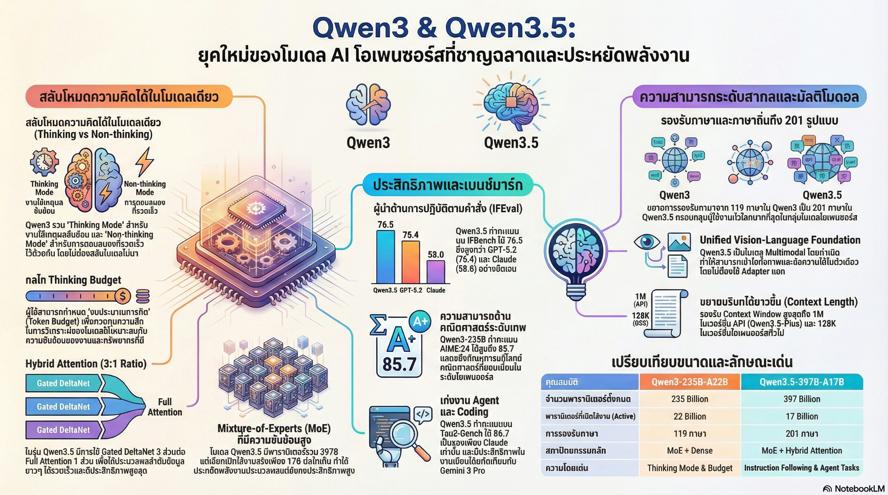

[กลับไปที่หน้าหลัก](../README.md)

สวัสดีครับเพื่อนๆ นักพัฒนา AI! วันนี้เรามาคุยเรื่องโมเดล AI ตัวใหม่จากจีนที่กำลังสร้างความฮือฮากันมากครับ นั่นก็คือ Qwen3.5 จาก Alibaba!

คุณเคยได้ยินเรื่อง "สงครามอาวุธทางปัญญา" (AI Arms Race) ในจีนไหมครับ? ช่วงต้นปี 2026 บริษัทเทคโนโลยีจีนแข่งกันปล่อยโมเดล AI ตัวใหม่ก่อนช่วงเทศกาลวันหยุดอย่างบ้าคลั่ง!

มีโมเดลใหม่ๆ ออกมาเรื่อยๆ:
▪ Kimi K2.5 - ปลายเดือนมกราคม
▪ GLM-5 - กลางเดือนกุมภาพันธ์
▪ MiniMax M2.5 - กลางเดือนกุมภาพันธ์
▪ Qwen3.5-397B-A17B - ตัวล่าสุด!

แต่ Qwen3.5 นี่ไม่ใช่แค่โมเดลตัวใหม่ธรรมดาๆ นะครับ มันเป็นการประกาศอิสรภาพจากความเชื่อเดิมๆ เกี่ยวกับสถาปัตยกรรม Transformer และเป็นการปูทางสู่ยุค Agentic AI อย่างแท้จริง!

วันนี้เรามาดู 5 จุดเปลี่ยนสำคัญของ Qwen3.5 กันครับ

========================================

🤔 ทบทวนพื้นฐาน: Transformer คืออะไร?

ก่อนที่เราจะไปดูจุดเปลี่ยนของ Qwen3.5 มาทำความเข้าใจพื้นฐานกันก่อนนะครับ

=== Transformer คืออะไร? ===

Transformer คือสถาปัตยกรรมพื้นฐานของโมเดลภาษาสมัยใหม่ เช่น GPT, Claude, Gemini

ส่วนประกอบหลักคือ "Attention Mechanism" ที่ทำให้ AI สามารถ:
▸ จดจำบริบทของคำในประโยค
▸ เข้าใจความสัมพันธ์ระหว่างคำต่างๆ
▸ สร้างคำตอบที่สอดคล้องกับบริบท

ปัญหาของ Transformer แบบเดิม:
▸ ใช้ทรัพยากรเยอะ: ยิ่งข้อความยาว ยิ่งกินทรัพยากรแบบกำลังสอง (Quadratic)
▸ จำกัดความยาว: ไม่สามารถจัดการข้อความยาวๆ ได้ดี
▸ ช้า: ประมวลผลช้าเมื่อต้องจัดการข้อมูลเยอะ

Qwen3.5 มาแก้ปัญหาเหล่านี้!

========================================

1. 🔄 Hybrid Attention: การสิ้นสุดยุค Full Attention

จุดเปลี่ยนแรกและสำคัญที่สุดคือ "Hybrid Attention" ครับ

=== Full Attention แบบเดิมมีปัญหาอะไร? ===

[Full Attention (Softmax-style)] ← วิธีแบบเดิม

วิธีการทำงาน:
▸ เมื่อ AI อ่านคำใหม่ ต้องดูความสัมพันธ์กับทุกคำที่ผ่านมา
▸ ยิ่งข้อความยาว ยิ่งต้องดูเยอะ
▸ เป็นการคำนวณแบบกำลังสอง (Quadratic)

ปัญหา:
▸ ข้อความ 1,000 คำ → ต้องคำนวณ 1,000,000 ครั้ง
▸ ข้อความ 10,000 คำ → ต้องคำนวณ 100,000,000 ครั้ง!
▸ ช้าและกินทรัพยากรมาก

เปรียบเทียบ:
▸ เหมือนคุณอ่านหนังสือ และทุกครั้งที่อ่านประโยคใหม่
▸ ต้องย้อนกลับไปอ่านทุกประโยคที่ผ่านมา ทั้งหมด!
▸ อ่านครบ 100 หน้า = ต้องกลับไปอ่านทุกหน้าซ้ำทุกครั้ง
▸ ช้าและเหนื่อยมาก!

=== Hybrid Attention แก้ปัญหายังไง? ===

Qwen3.5 ใช้ Hybrid Attention ที่ผสมผสาน 2 เทคนิคเข้าด้วยกัน:

[1] Linear Attention (DeltaNet)
[2] Full Attention (Softmax-style)

โดยใช้ในอัตราส่วน 3:1

=== โครงสร้าง 3:1 คืออะไร? ===

ใน Qwen3.5 ทุกๆ 4 ชั้น (4 Transformer blocks):
▸ 3 ชั้นใช้ Linear Attention (DeltaNet)
▸ 1 ชั้นใช้ Full Attention

ทำไมถึงทำแบบนี้?

[Linear Attention (DeltaNet)] ← 3 ชั้น

ข้อดี:
▸ เร็วมาก: คำนวณแบบเส้นตรง (Linear) ไม่ใช่กำลังสอง
▸ ประหยัดทรัพยากร: กินทรัพยากรน้อยกว่ามาก
▸ จัดการข้อความยาวได้: ถึง 1 ล้าน tokens!

ข้อเสีย:
▸ อาจจะพลาด Global Context: ความเชื่อมโยงระหว่างส่วนต่างๆ ที่ห่างกัน

[Full Attention] ← 1 ชั้น

ใช้ทุกๆ ชั้นที่ 4 เพื่อ:
▸ รักษา Global Coherency (ความเชื่อมโยงระดับโลก)
▸ ให้ AI เห็นภาพรวมของเนื้อหาทั้งหมด
▸ แก้ไขจุดอ่อนของ Linear Attention

ผลลัพธ์:
▸ ได้ทั้งความเร็วจาก Linear Attention
▸ และความแม่นยำจาก Full Attention
▸ Best of both worlds!

=== เปรียบเทียบกับเทคนิคอื่น ===

Qwen3.5 เลือกใช้ Gated DeltaNet ซึ่งพัฒนาต่อจาก Mamba2

[Mamba2] ← เทคนิคที่มีมาก่อน

ปัญหา:
▸ Attention Sinks: ข้อมูลบางส่วน "รั่ว" ไป
▸ Massive Activations: เกิดค่าที่ใหญ่เกินไป
▸ ทำให้การฝึกโมเดลไม่เสถียร

[Gated DeltaNet] ← ที่ Qwen3.5 ใช้

ข้อดี:
▸ แก้ปัญหา Attention Sinks ได้
▸ แก้ปัญหา Massive Activations ได้
▸ การฝึกโมเดลเสถียรกว่า
▸ เร็วและแม่นยำกว่า

=== ผลลัพธ์ที่ได้ ===

ด้วย Hybrid Attention:
▸ ประมวลผล Context ได้ยาวถึง 1 ล้าน tokens!
▸ เร็วกว่า Full Attention แบบเดิมมาก
▸ ประหยัดทรัพยากรอย่างมาก
▸ ยังคงความแม่นยำไว้ได้

"กลไก Attention กลายเป็นสมรภูมิรบใหม่ไปแล้ว"

นี่คือการสร้างมาตรฐานใหม่ในการชิงความได้เปรียบด้านความเร็วและความยาว Context!

========================================

2. 🧠 Unified Framework: ระบบความคิดที่สั่งได้

จุดเปลี่ยนที่สองคือ "Unified Framework" ที่ทำให้ Qwen3.5 เป็นมากกว่าแค่ Chatbot ธรรมดา

=== ปัญหาของโมเดลแบบเดิม ===

ปกติโมเดล AI จะแบ่งเป็น 2 ประเภท:

[โมเดล Chat] ← สำหรับสนทนา
▸ ตอบเร็ว
▸ แต่คิดไม่ลึก

[โมเดล Reasoning] ← สำหรับคิดเชิงลึก
▸ คิดได้ลึก
▸ แต่ช้า

ปัญหา:
▸ ต้องสลับโมเดลไปมาตามงาน
▸ ยุ่งยาก ไม่สะดวก

=== Unified Framework แก้ปัญหายังไง? ===

Qwen3.5 ยุบรวมทั้งสองโมเดลเข้าด้วยกัน!

ผลลัพธ์:
▸ โมเดลเดียว ทำได้ทั้งสนทนาและคิดเชิงลึก
▸ สลับโหมดได้ตามต้องการ
▸ ไม่ต้องเปลี่ยนโมเดล

=== Mode Switching: สลับโหมดได้ง่าย ===

คุณสามารถควบคุมโหมดการทำงานผ่าน Flag:

[Thinking Mode] ← โหมดคิดเชิงลึก

คำสั่ง: /think

ใช้เมื่อไหร่:
▸ โจทย์คณิตศาสตร์ซับซ้อน
▸ การวิเคราะห์ตรรกะ
▸ การแก้ปัญหาที่ต้องคิดหลายขั้นตอน

ผลลัพธ์:
▸ AI จะใช้เวลาคิดก่อนตอบ
▸ ได้คำตอบที่ลึกซึ้งและแม่นยำกว่า
▸ แต่ช้ากว่า

[Fast Mode] ← โหมดตอบเร็ว

คำสั่ง: /no think

ใช้เมื่อไหร่:
▸ สนทนาทั่วไป
▸ คำถามง่ายๆ
▸ ต้องการความเร็ว

ผลลัพธ์:
▸ AI ตอบทันที ไม่ต้องคิดนาน
▸ เร็วมาก
▸ เหมาะกับงานที่ไม่ซับซ้อน

=== Thinking Budget: กำหนดงบประมาณความคิดได้! ===

นี่คือฟีเจอร์ระดับ Expert ที่เจ๋งมากครับ!

คุณสามารถกำหนด "งบประมาณความคิด" ได้:
▸ บอก AI ว่าให้คิดได้นานแค่ไหน
▸ เช่น คิดได้ไม่เกิน 100 tokens
▸ หรือคิดได้ไม่เกิน 5 วินาที

วิธีทำงาน:

ขั้นตอนที่ 1: คุณกำหนดงบประมาณ
▸ เช่น "คิดได้ไม่เกิน 100 tokens"

ขั้นตอนที่ 2: AI เริ่มคิด
▸ AI เริ่มวิเคราะห์ปัญหา
▸ คิดทีละขั้นตอน
▸ นับ tokens ที่ใช้ไป

ขั้นตอนที่ 3: ถ้าใกล้หมดงบประมาณ
▸ AI จะได้รับคำสั่งพิเศษ (Stop-instruction)
▸ "Considering the limited time by the user, I have to give the solution based on the thinking directly now."
▸ บังคับให้สรุปคำตอบทันที!

ประโยชน์:
▸ บริหารจัดการทั้งประสิทธิภาพและความเร็ว
▸ ไม่ให้ AI คิดนานเกินไป
▸ ได้คำตอบที่ดีที่สุดในงบประมาณที่กำหนด

เปรียบเทียบ:

ไม่มี Thinking Budget:
▸ AI อาจจะคิดนานมากๆ
▸ ใช้ทรัพยากรเยอะ แพง
▸ รอนาน

มี Thinking Budget:
▸ AI คิดแค่ที่จำเป็น
▸ ประหยัดทรัพยากร
▸ ได้คำตอบเร็วขึ้น

========================================

3. 🎯 Agentic Workloads: เกณฑ์วัดผลที่เปลี่ยนไป

จุดเปลี่ยนที่สามคือการเปลี่ยนโฟกัสจาก "Chatbot" ไปเป็น "Agentic AI"

=== Chatbot vs Agentic AI ===

[Chatbot] ← แบบเดิม
▸ คุยกับคน ตอบคำถาม
▸ ทำงานเดียว ตอบครั้งเดียว
▸ ไม่ได้ "ทำงาน" จริงๆ

[Agentic AI] ← แบบใหม่
▸ ทำงานแทนคน ตัดสินใจเอง
▸ ทำงานหลายขั้นตอน ซับซ้อน
▸ "ทำงาน" จริงๆ เหมือนพนักงาน

=== คะแนนที่โดดเด่นของ Qwen3.5 ===

Qwen3.5 แสดงผลงานได้ยอดเยี่ยมใน Benchmarks ที่วัด Agentic Workloads:

[IFBench: Instruction Following]

วัดความสามารถในการทำตามคำสั่ง

คะแนน Qwen3.5: 76.5
เปรียบเทียบ:
▸ GPT-5.2: 75.4
▸ Claude: 58.0

Qwen3.5 ชนะ! ทำตามคำสั่งได้ดีที่สุด!

=== บทเรียนจาก BrowseComp ===

BrowseComp เป็น Benchmark ที่วัดความสามารถในการค้นหาข้อมูลและตอบคำถาม

สิ่งที่น่าสนใจคือ Qwen3.5 มีคะแนน 2 ชุด:
▸ คะแนนชุดที่ 1: 69.0
▸ คะแนนชุดที่ 2: 78.6

ทำไมต่างกัน?

เพราะเปลี่ยนกลยุทธ์การจัดการ Context (Scaffolding):
▸ วิธีที่ 1: เก็บ Context ทั้งหมดไว้
▸ วิธีที่ 2: ใช้แบบ "Discard-all" (ทิ้งข้อมูลที่ไม่จำเป็น)

ผลลัพธ์:
▸ Discard-all ได้คะแนนสูงกว่ามาก! (78.6 vs 69.0)

บทเรียนสำคัญ:
▸ ในโลกของ Agentic AI ความฉลาดของโมเดลเป็นเพียงครึ่งเดียว
▸ อีกครึ่งหนึ่งคือ "Scaffolding Choices" หรือวิธีการออกแบบโครงสร้างการทำงาน
▸ วิธีที่เราจัดการข้อมูลรอบๆ โมเดลสำคัญมาก!

สรุป: ไม่ใช่แค่โมเดลต้องเก่ง แต่เราต้องเก่งในการออกแบบวิธีใช้โมเดลด้วย!

========================================

4. 🌍 Multilingual และ Native Multimodal

จุดเปลี่ยนที่สี่คือความหลากหลายของภาษาและความสามารถ Multimodal ที่แท้จริง

=== รองรับ 201 ภาษา! ===

Qwen3.5 รองรับภาษาและสำเนียงถึง 201 ภาษา!

นี่คือสถิติสูงสุดของโมเดลแบบ Open Model ในขณะนี้

ประโยชน์:
▸ ใช้ได้กับภาษาส่วนใหญ่ในโลก
▸ เข้าถึงคนได้มากขึ้น
▸ ไม่จำกัดแค่ภาษาอังกฤษ

=== Native Multimodal: เข้าใจภาพและข้อความพร้อมกัน ===

สิ่งที่น่าสนใจยิ่งกว่าคือ Qwen3.5 เป็น Native Multimodal ที่แท้จริง!

[โมเดลแบบเดิม]

วิธีทำ:
▸ มีส่วนอ่านข้อความ (Text Model)
▸ มีส่วนอ่านภาพ (Vision Model) แยกกัน
▸ เอามาต่อกันด้วย Vision Adapter
▸ เหมือนสองคนคุยกันผ่านล่าม

ปัญหา:
▸ ไม่ค่อยเข้าใจกันดี
▸ การเชื่อมโยงไม่ราบรื่น

[Qwen3.5: Native Multimodal]

วิธีทำ - Early Fusion:
▸ ตั้งแต่วันแรกที่เริ่มฝึก ให้โมเดลเห็นภาพและข้อความพร้อมกัน!
▸ มองว่า tokens ของภาพและข้อความเป็นสิ่งเดียวกัน
▸ ไม่มี Vision Adapter แยกส่วน

เปรียบเทียบ:
▸ โมเดลเดิม = คนสองคนคุยผ่านล่าม
▸ Qwen3.5 = คนเดียวที่พูดได้ทั้งสองภาษาตั้งแต่เกิด

ผลลัพธ์:
▸ เข้าใจความสัมพันธ์ระหว่างภาพและข้อความได้ดีกว่ามาก
▸ การประมวลผลราบรื่นกว่า

=== คะแนนที่โดดเด่น ===

Qwen3.5 ทำคะแนนได้สูงมากใน Benchmarks ที่วัด Multimodal:

[MMMU: Multimodal Understanding]
▸ คะแนน: 85.0
▸ วัดความเข้าใจภาพและข้อความรวมกัน

[OmniDocBench: Document Understanding]
▸ คะแนน: 90.8
▸ วัดความเข้าใจเอกสารที่ซับซ้อน

[ZEROBench: Visual Reasoning]
▸ คะแนน: 12
▸ เปรียบเทียบ: Gemini 3 Pro ได้ 10
▸ วัดความสามารถในการใช้เหตุผลกับภาพ

สรุป: Qwen3.5 เก่งมากในการประมวลผลข้อมูลภาพและเอกสารที่ซับซ้อน!

========================================

5. ⚡ 10x Efficiency: Distillation ที่เก่งกว่าเดิม

จุดเปลี่ยนสุดท้ายคือเทคนิค Distillation ที่ช่วยให้โมเดลเล็กๆ เก่งได้เหมือนโมเดลใหญ่

=== Distillation คืออะไร? ===

Distillation หรือ "การถ่ายทอดความรู้" คือกระบวนการที่:
▸ โมเดลใหญ่ (Teacher) สอนโมเดลเล็ก (Student)
▸ โมเดลเล็กเรียนรู้จากโมเดลใหญ่
▸ ทำให้โมเดลเล็กเก่งขึ้นโดยไม่ต้องใช้ทรัพยากรมาก

=== ปัญหาของการฝึกโมเดลเล็กแบบเดิม ===

ปกติถ้าต้องการโมเดลเล็กที่เก่ง:
▸ ต้องฝึกด้วย Reinforcement Learning (RL)
▸ ใช้ทรัพยากรมหาศาล: 17,920 GPU hours!
▸ แพงมาก เวลานาน

=== Strong-to-Weak Distillation ===

Qwen3.5 ใช้เทคนิค On-policy Distillation:

วิธีการ:

[ขั้นตอนที่ 1: โมเดลครูทำงาน]
▸ โมเดลใหญ่ (เช่น 235B) ทำงาน
▸ บันทึก Logits (ความน่าจะเป็นของคำแต่ละคำ)

[ขั้นตอนที่ 2: โมเดลนักเรียนเรียนรู้]
▸ โมเดลเล็ก (เช่น 8B) เรียนรู้จาก Logits ของครู
▸ พยายามทำให้เหมือนครู

[ขั้นตอนที่ 3: ได้โมเดลเล็กที่เก่ง]
▸ โมเดลเล็กเก่งเกือบเท่าโมเดลใหญ่
▸ แต่ใช้ทรัพยากรน้อยกว่ามาก!

=== ผลลัพธ์ที่น่าทึ่ง: ประหยัด 10 เท่า! ===

การทดสอบในโมเดลขนาด 8B:

[ฝึกด้วย Reinforcement Learning (RL)]
▸ ใช้ทรัพยากร: 17,920 GPU hours
▸ แพงมาก!

[ฝึกด้วย Distillation]
▸ ใช้ทรัพยากร: 1,800 GPU hours
▸ ประหยัดกว่า 10 เท่า!

แต่สำคัญมาก:
▸ คุณภาพใกล้เคียงกัน!
▸ รักษา Thinking abilities ไว้ได้
▸ สามารถสลับโหมดได้เหมือนเดิม

นี่คือความลับที่ทำให้โมเดลเล็กของ Qwen (ตั้งแต่ 0.6B ถึง 32B) เก่งกาจเกินตัว!

========================================

สรุป: ก้าวสู่ยุค Million-Agent Environments

หลังจากที่เราได้เห็นจุดเปลี่ยนทั้ง 5 ข้อของ Qwen3.5 แล้ว มาสรุปกันครับ

=== สิ่งที่เราได้เรียนรู้ ===

[1] Hybrid Attention: การปฏิวัติสถาปัตยกรรม
▸ ผสม Linear Attention กับ Full Attention
▸ เร็วและแม่นยำพร้อมกัน
▸ จัดการ Context ยาวได้ถึง 1 ล้าน tokens

[2] Unified Framework: โมเดลเดียวทำได้หมด
▸ สลับระหว่างโหมดสนทนากับโหมดคิดเชิงลึกได้
▸ กำหนดงบประมาณความคิดได้
▸ ยืดหยุ่นและประหยัด

[3] Agentic Workloads: มุ่งเน้นการทำงานจริง
▸ ไม่ใช่แค่สนทนา แต่ทำงานได้จริง
▸ คะแนน IFBench สูงสุด 76.5
▸ วิธีการออกแบบ Scaffolding สำคัญมาก

[4] Multilingual + Multimodal: ครอบคลุมทุกมิติ
▸ รองรับ 201 ภาษา
▸ Native Multimodal ที่เข้าใจภาพและข้อความอย่างแท้จริง
▸ คะแนนสูงในทุก Benchmark

[5] Distillation ประสิทธิภาพสูง: ประหยัด 10 เท่า
▸ โมเดลเล็กเก่งได้เท่าโมเดลใหญ่
▸ ใช้ทรัพยากรน้อยกว่า 10 เท่า
▸ ทำให้ AI เข้าถึงได้ง่ายขึ้น

=== ผลกระทบต่อวงการ AI ===

Qwen3.5 ไม่ใช่แค่ความสำเร็จของ Alibaba แต่เป็นการปักหมุดทิศทางใหม่ของวงการ AI ทั่วโลก:

[ลดช่องว่าง Open-source vs Proprietary]
▸ โมเดล Open-source เริ่มเก่งเท่า Proprietary (GPT, Claude)
▸ ทุกคนเข้าถึง AI ที่ทรงพลังได้มากขึ้น
▸ ไม่ต้องพึ่งบริษัทใหญ่อย่างเดียว

[ยุค Agentic AI]
▸ AI ไม่ใช่แค่ตอบคำถาม แต่ "ทำงาน" ได้จริง
▸ AI เป็น "พนักงาน" ที่ช่วยทำงานซับซ้อน
▸ ไม่ใช่แค่ "ผู้ช่วย" ที่ตอบคำถาม

[มุ่งสู่ Million-Agent Environments]
▸ อนาคตที่ Qwen กำลังวาดคือการฝึก AI ในสภาพแวดล้อมที่มีล้านๆ Agent
▸ เพื่อเตรียมความพร้อมสำหรับงานที่ซับซ้อนในโลกจริง
▸ AI หลายตัวทำงานร่วมกันแก้ปัญหาใหญ่ๆ

=== คำถามท้ายทาย ===

เมื่อ "Agentic AI" เหล่านี้สามารถ:
▸ คิดเป็นระบบ
▸ ทำงานแทนเราได้อย่างสมบูรณ์
▸ ภายใต้งบประมาณที่เรากำหนด

คำถามสำคัญคือ:
▸ เราจะปรับตัวอย่างไร?
▸ งานไหนที่มนุษย์ยังจำเป็น?
▸ ทักษะอะไรที่เราต้องเรียนรู้เพิ่ม?

นี่คือคำถามที่ทุกคนต้องคิดในยุค AI ครับ!

=== ข้อคิดสำหรับนักพัฒนา ===

ถ้าคุณกำลังพัฒนา AI Application:

[1] ใช้ Hybrid Attention
▸ เพื่อจัดการ Context ยาวๆ ได้ดี
▸ ประหยัดทรัพยากร

[2] ออกแบบ Scaffolding ให้ดี
▸ ไม่ใช่แค่โมเดลต้องเก่ง
▸ แต่วิธีการออกแบบรอบๆ โมเดลสำคัญมาก

[3] ใช้ Distillation
▸ สร้างโมเดลเล็กที่เก่ง
▸ ประหยัดต้นทุน

[4] มุ่งเป้าที่ Agentic Use Cases
▸ ไม่ใช่แค่ Chatbot
▸ แต่ AI ที่ทำงานได้จริง

========================================

อ้างอิง:
• Qwen3.5-397B-A17B from Alibaba
• Hybrid Attention Architecture
• Gated DeltaNet
• Strong-to-Weak Distillation
• Agentic AI Benchmarks

หวังว่าบทความนี้จะช่วยให้ทุกคนเห็นว่า Qwen3.5 ไม่ใช่แค่โมเดลตัวใหม่ แต่เป็นการเปลี่ยนแปลงครั้งใหญ่ของวงการ AI ที่กำลังมุ่งหน้าสู่ยุค Agentic AI!

ถ้ามีคำถามหรือความคิดเห็น มาคุยกันได้เลยนะครับ 😊
