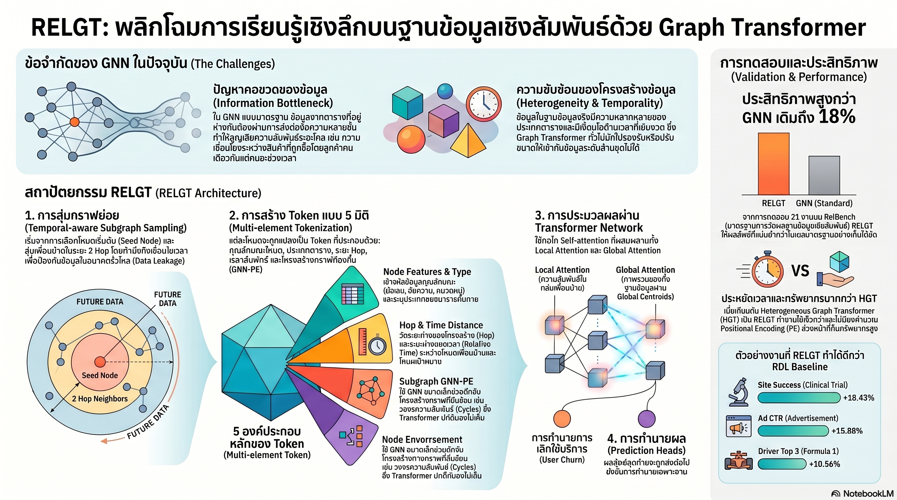

[กลับไปที่หน้าหลัก](../README.md)

สวัสดีครับเพื่อนๆ ที่ติดตามวงการ AI และ Data Science! วันนี้มาเรื่องที่ท้าทายสมมติฐานที่วงการ Enterprise AI ยึดถือมานาน: "ถ้าจะให้ AI เข้าใจฐานข้อมูลเชิงสัมพันธ์ได้ดี ต้องลงทุนใน Feature Engineering อย่างหนักก่อน" จากงานวิจัยของ Stanford และ Kumo.AI ที่นำเสนอ RELGT (Relational Graph Transformer) สถาปัตยกรรม Graph Transformer รุ่นแรกของโลกที่ออกแบบมาสำหรับฐานข้อมูลเชิงสัมพันธ์โดยเฉพาะ — และเอาชนะ GNN รุ่นเดิมได้ถึง 18.43% บนบางภารกิจโดยไม่ต้องการการคำนวณล่วงหน้าที่แพงเลยครับ

คุณเคยสังเกตไหมครับว่า ข้อมูลที่มีค่าที่สุดในองค์กรส่วนใหญ่ไม่ได้อยู่ใน Spreadsheet เดียว แต่กระจายอยู่ในตารางที่เชื่อมโยงกันซับซ้อน เช่น ลูกค้า → ธุรกรรม → สินค้า → ผู้ขาย — และรูปแบบพฤติกรรมที่สำคัญที่สุดมักซ่อนอยู่ใน "ความสัมพันธ์ข้ามหลายตาราง" ที่ AI แบบเดิมมองไม่ถึงครับ?

คุณรู้ไหมครับว่า GNN (Graph Neural Networks) ที่เราใช้กันอยู่มีข้อจำกัดที่เรียกว่า Information Bottleneck — ข้อมูลระหว่างโหนดที่อยู่ห่างกันหลาย Hop จะ "เดินทางไปไม่ถึง" กัน เหมือนการส่งข่าวผ่านคนกลางหลายชั้นจนข้อมูลบิดเบือนหายไปในที่สุดครับ?

และคุณเคยนึกไหมครับว่า ถ้า Tokenization ของ AI รู้จักแยกแยะระหว่าง "ลูกค้า" กับ "สินค้า" เข้าใจ "ระยะห่างของตาราง" รู้จัก "ความเร็วของพฤติกรรมในมิติเวลา" และเรียนรู้ "โครงสร้างของกราฟ" โดยไม่ต้องการการคำนวณล่วงหน้าเลย — มันจะเปลี่ยนวิธีที่ AI มอง Relational Database ไปอย่างสิ้นเชิงครับ?

งานวิจัยนี้กำลังบอกว่า: ยักษ์หลับแห่งโลกองค์กรที่ชื่อ "Relational Database" กำลังจะตื่นขึ้นมา เพราะในที่สุดก็มี AI ที่เข้าใจภาษาของมันได้จริงๆ โดยไม่ต้องผ่านนักแปลที่ชื่อ Feature Engineering อีกต่อไปครับ

========================================

🤔 ทบทวนความเชื่อเดิมๆ: สิ่งที่เราคิดเกี่ยวกับ AI กับฐานข้อมูลเชิงสัมพันธ์

▪ "ก่อนที่ AI จะทำงานกับ Relational Database ได้ นักวิทยาศาสตร์ข้อมูลต้องลงทุนใน Manual Feature Engineering อย่างหนักเพื่อแปลงความสัมพันธ์ระหว่างตารางให้ AI เข้าใจ" → RELGT ทำสิ่งนี้โดยอัตโนมัติผ่าน Multi-Element Tokenization 5 องค์ประกอบที่อ่านโครงสร้างของ Schema, ระยะห่างระหว่างตาราง, มิติเวลา และรูปทรงของกราฟได้เองโดยตรงครับ

▪ "GNN คือทางออกที่ดีที่สุดในปัจจุบันสำหรับการ Model ความสัมพันธ์ในฐานข้อมูล ข้อจำกัดของมันสามารถแก้ได้ด้วยการเพิ่ม Layer มากขึ้น" → Information Bottleneck ของ GNN ไม่ได้แก้ได้ด้วยการเพิ่ม Layer ครับ เพราะปัญหาอยู่ที่ Local Message Passing ที่ไม่สามารถสื่อสารข้ามหลาย Hop ได้อย่างมีประสิทธิภาพ RELGT แก้ที่ระดับสถาปัตยกรรมด้วย Self-attention แบบ All-pair

▪ "Graph Transformer ที่ใช้ Positional Encoding ที่ซับซ้อนอย่าง Laplacian PE จะให้ผลที่ดีกว่าในการเข้าใจโครงสร้างของกราฟ แม้จะแลกมาด้วยต้นทุนการคำนวณที่สูง" → HGT ที่ใช้ Laplacian PE ใช้เวลาประมวลผลนานกว่า 8.6 เท่า แต่ RELGT ด้วย Stochastic GNN PE ทำได้ดีกว่าด้วยต้นทุนที่ต่ำกว่าอย่างมีนัยสำคัญ เพราะแนวคิด "สุ่มใหม่ทุก Step" นั้นประสิทธิภาพมากกว่า "คำนวณแม่นยำล่วงหน้า" ในบริบทนี้ครับ

▪ "AI ที่ดีสำหรับฐานข้อมูลต้องเลือกระหว่างความแม่นยำในระดับรายละเอียด (Local) หรือความเข้าใจภาพรวม (Global) — ยากที่จะทำได้ทั้งสองอย่างพร้อมกันอย่างมีประสิทธิภาพ" → Hybrid Attention ของ RELGT ทำทั้งสองอย่างพร้อมกันผ่าน Local Module (Sampled Subgraphs) และ Global Module (Global Centroids + EMA K-Means) โดย Trade-off ด้าน Scalability ยังคงยอมรับได้สำหรับ Production ครับ

ความจริงที่น่าคิดคือ: Relational Database ไม่ใช่ข้อจำกัด แต่คือสินทรัพย์ที่รอการปลดล็อก — และ RELGT อาจเป็นกุญแจดอกแรกที่ทำสำเร็จจริงๆ ครับ

========================================

🧠 พื้นฐานที่ต้องเข้าใจก่อน: Information Bottleneck, Self-attention All-pair, Multi-Element Tokenization และ Hybrid Attention

=== ทำไม GNN แบบเดิมถึงมีข้อจำกัดกับ Relational Database? ===

[GNN (Graph Neural Networks) — แนวทางเดิม]
▸ ทำงานผ่าน Message Passing: แต่ละโหนดรับข้อมูลจากโหนดข้างเคียงและส่งต่อออกไป
▸ ปัญหา: ข้อมูลระหว่างโหนดที่อยู่ห่างกัน 5+ Hop จะลดทอนลงอย่างมาก (Over-smoothing)
▸ เปรียบได้กับ: การโทรศัพท์ผ่านล่ามหลายคนต่อกัน — ข้อความที่ถึงปลายทางอาจไม่ใช่ข้อความต้นฉบับอีกต่อไปครับ

[RELGT — แนวทางใหม่]
▸ Self-attention แบบ All-pair: ทุกโหนดสามารถ "มองเห็น" และสื่อสารกับทุกโหนดอื่นได้โดยตรง
▸ ไม่มี Information Bottleneck: Long-range Dependencies ข้ามหลายตารางไม่สูญหาย
▸ เปรียบได้กับ: การประชุมที่ทุกคนในห้องคุยกันได้โดยตรง ไม่ต้องผ่านตัวกลางครับ

=== Multi-Element Tokenization 5 องค์ประกอบคืออะไร? ===

RELGT ไม่ได้แค่ "แปลงข้อมูลเป็น Token" แต่ใส่บริบทที่สำคัญ 5 ชั้นในแต่ละ Token:

1. Features: ข้อมูลดิบจากคอลัมน์ — สิ่งที่ GNN แบบเดิมก็ทำได้
2. Type: ประเภทของ Entity (ลูกค้า vs สินค้า vs ธุรกรรม) — รักษา Schema Semantics
3. Hop Distance: ระยะห่างจาก Query Node — รักษาโครงสร้างเชิงพื้นที่ของกราฟ
4. Time: ความต่างของเวลาระหว่าง Event — เข้าใจ Velocity ของพฤติกรรมและป้องกัน Temporal Leakage
5. Local Structure (Stochastic GNN PE): สุ่ม Feature ใหม่ทุก Training Step เพื่อรักษา Permutation Equivariance โดยไม่ต้องการการคำนวณ Positional Encoding ล่วงหน้าครับ

========================================

1) Information Bottleneck และ All-pair Self-attention: เปิดทางให้ "ห้องประชุม" แทน "โทรศัพท์ผ่านล่าม"

ปัญหาหลักของ GNN กับ Relational Database ในโลกจริงครับ: ธุรกรรมทางการเงินที่น่าสงสัยอาจซ่อนรูปแบบที่เชื่อมโยงกันข้ามตาราง Account → Transaction → Merchant → Industry → Risk Profile อย่างน้อย 4-5 Hop

ใน GNN แบบเดิม: ข้อมูลที่ Hop ที่ 1 จะถูก Aggregate รวมกับข้อมูลอื่นๆ ก่อนส่งต่อไป Hop ที่ 2 แล้วรวมอีกครั้งที่ Hop ที่ 3 ถึงตอนที่ข้อมูลถึงปลายทาง รายละเอียดเฉพาะที่สำคัญอาจเจือจางหายไปนานแล้วครับ

เปรียบได้กับเกม Telephone ในห้องเรียน: ถ้าคุณกระซิบ "ลูกค้า 00123 โอนเงินผิดปกติ 3 ครั้งในวันเดียวกัน" ผ่านคน 5 คน สิ่งที่คนสุดท้ายได้ยินอาจเป็น "ลูกค้าโอนเงิน" เท่านั้น

RELGT แก้ปัญหานี้ด้วย Self-attention All-pair: เหมือนกับการย้ายทุกคนเข้าห้องประชุมเดียวกัน ที่ "ลูกค้า 00123" สามารถ "คุย" กับ "Industry Risk Profile" ได้โดยตรงโดยไม่ผ่านตัวกลางครับ รูปแบบที่ซ่อนในความสัมพันธ์ระยะไกลจึงมองเห็นได้อย่างชัดเจน

========================================

2) Multi-Element Tokenization: 5 ชั้นบริบทที่ทำให้ AI "อ่าน" ฐานข้อมูลได้จริง

องค์ประกอบที่ 4 — Time — คือหัวใจที่ทำให้ RELGT โดดเด่นอย่างแท้จริงในบริบทธุรกิจครับ

Temporal Leakage คืออะไร: ถ้า AI ฝึกโดยใช้ข้อมูล "วันนี้" เพื่อทำนาย "เมื่อวาน" — มันกำลังโกง ในฐานข้อมูลที่มีการอัปเดตต่อเนื่อง ปัญหานี้เกิดขึ้นได้ง่ายถ้าไม่ระวัง Time Token ใน RELGT ป้องกันสิ่งนี้โดยให้โมเดลรู้ว่าข้อมูลแต่ละชิ้น "เกิดขึ้นก่อนหรือหลัง" Query Point ครับ

เปรียบได้กับการสอนให้เด็กทำนายผลฟุตบอล: ถ้าเด็กแอบดูผลการแข่งขันก่อนทำนาย คะแนนจะสูงแต่ไม่มีประโยชน์ Time Token ทำให้แน่ใจว่า AI ไม่ได้ "แอบดูอนาคต" ครับ

Velocity ของพฤติกรรม: ไม่ใช่แค่รู้ว่า "เคยซื้อ" แต่รู้ว่า "ซื้อบ่อยแค่ไหน" และ "ความถี่กำลังเพิ่มหรือลด" — ข้อมูลนี้สำคัญมากในงาน Churn Prediction หรือ Fraud Detection ครับ

Stochastic GNN PE (องค์ประกอบที่ 5): แทนที่จะคำนวณ Positional Encoding แบบตายตัวล่วงหน้า (ซึ่งแพงและช้า) RELGT "สุ่ม" Feature ใหม่ทุก Training Step — ทำให้โมเดลเรียนรู้รูปทรงของกราฟได้ โดยไม่มี Overhead ที่ทำให้ HGT ช้ากว่า 8.6 เท่าครับ

========================================

3) Hybrid Attention: เลนส์คู่ที่มองทั้งต้นไม้และป่าพร้อมกัน

สถาปัตยกรรม Dual-Lens ของ RELGT ทำงานพร้อมกันสองระดับครับ:

Local Module — โฟกัสที่รายละเอียด:
เปรียบได้กับผู้จัดการร้านที่รู้ว่าลูกค้า A ชอบกาแฟดำและมักซื้อในวันพุธ — ความเข้าใจระดับรายบุคคลที่มาจาก Sampled Subgraphs รอบ Query Node ครับ

Global Module — มองภาพรวม:
เปรียบได้กับเจ้าของเชนร้านกาแฟที่รู้ว่า "ลูกค้ากลุ่ม Young Professional ทั่วประเทศเริ่มสั่ง Cold Brew มากขึ้น 30% ในช่วง 3 เดือนที่ผ่านมา" — Global Centroids ที่อัปเดตแบบไดนามิกด้วย EMA K-Means ในทุก mini-batch ครับ

EMA K-Means คืออะไรในบริบทนี้: แทนที่จะคำนวณ Centroids ใหม่ทั้งหมดทุกครั้ง (ซึ่งแพงมากสำหรับข้อมูลขนาดใหญ่) ระบบ "อัปเดตแบบค่อยๆ เลื่อน" (Exponential Moving Average) เมื่อเห็น mini-batch ใหม่ ทำให้ Global Centroids สะท้อนแนวโน้มปัจจุบันได้โดยไม่ต้อง Recompute ทุกอย่างใหม่ครับ

ประโยชน์ทางธุรกิจของ Dual-Lens:
— ถามได้ว่า "ลูกค้าคนนี้จะ Churn ไหม?" (Local)
— ถามได้ว่า "กลุ่มลูกค้าไหนมีแนวโน้ม Churn สูงที่สุดในไตรมาสนี้?" (Global)
— โดยใช้โมเดลเดียวที่ตอบได้ทั้งสองคำถามพร้อมกันครับ

========================================

4) ผลลัพธ์บน RelBench: ตัวเลขที่พูดแทนตัวเอง

RelBench คือ Benchmark มาตรฐานสำหรับการทดสอบ AI บนฐานข้อมูลเชิงสัมพันธ์ ครอบคลุมข้อมูลจริงจากหลายอุตสาหกรรม RELGT เอาชนะ GNN รุ่นเดิมทั้ง 21 ภารกิจหลักครับ

ตัวเลขที่โดดเด่น:
— site-success (ทำนายความสำเร็จของโครงการวิจัยทางการแพทย์): +18.43% — ช่วยให้ Capital Allocation สำหรับการทดลองทางคลินิกแม่นยำขึ้นมหาศาล
— ad-ctr (ทำนายอัตราการคลิกโฆษณา): +15.85% — ใน E-commerce ที่ทุก 1% ของ CTR คือรายได้มหาศาล
— driver-top3 (ทำนายผลการแข่งขันกีฬา): +10.56% — พิสูจน์ว่า RELGT ไม่ได้ทำงานได้ดีเฉพาะโดเมนใดโดเมนหนึ่ง

Computational Efficiency เทียบกับ HGT:
— HGT + Laplacian PE: ช้ากว่า 8.6 เท่าในการ Precompute Positional Encoding
— RELGT + Stochastic GNN PE: ได้ผลดีกว่า ด้วยต้นทุนที่ต่ำกว่าอย่างมีนัยสำคัญ

นี่คือหลักฐานที่พิสูจน์ว่า "Stochastic แทน Deterministic" ในการสร้าง Positional Encoding เป็นความฉลาดทางสถาปัตยกรรมที่แท้จริงครับ

========================================

5) Foundation Model สำหรับ Tabular Data: วิสัยทัศน์ที่ใหญ่กว่าโมเดลคาดการณ์

สิ่งที่ทำให้ RELGT น่าจับตามองไม่ใช่แค่ตัวเลขบน Benchmark แต่คือวิสัยทัศน์ที่กว้างกว่าครับ:

Feature Engineering หายไปจากขั้นตอน: นักวิทยาศาสตร์ข้อมูลไม่ต้องตัดสินใจว่า "ควรสร้าง Feature อะไรบ้างจากความสัมพันธ์ระหว่างตาราง" เพราะ RELGT เรียนรู้สิ่งนี้โดยตรงจากโครงสร้างของ Schema

Schema Agnostic: โมเดลเดียวใช้ได้กับฐานข้อมูลที่มี Schema ต่างกันโดยไม่ต้องปรับแต่งใหม่ทั้งหมด เพราะ Type Token รักษาความเข้าใจของ Entity ประเภทต่างๆ ไว้

เปรียบได้กับ: GPT เปลี่ยนวิธีที่เราทำงานกับ Unstructured Text โดยไม่ต้องทำ Manual Feature Engineering ด้าน NLP — RELGT กำลังทำสิ่งเดียวกันกับ Structured Relational Data ครับ

ถ้า RELGT พัฒนาต่อไปถึงระดับ Pre-training บน Relational Data ขนาดใหญ่ได้ มันอาจเป็น "GPT ของโลก Enterprise Database" ที่บริษัทใหม่ไม่ต้องเริ่มฝึกโมเดลจากศูนย์ แต่ Fine-tune บน Foundation ที่เข้าใจโครงสร้างฐานข้อมูลอยู่แล้วครับ

========================================

🎯 สรุป: RELGT ไม่ใช่แค่ GNN ที่ดีขึ้น แต่คือ Paradigm Shift ของ AI กับ Relational Database

RELGT (Stanford + Kumo.AI) พิสูจน์สิ่งสำคัญ 5 ประการครับ:

หนึ่ง — Information Bottleneck ของ GNN แก้ได้ด้วย Self-attention All-pair ไม่ใช่ด้วยการเพิ่ม Layer: ทุกโหนดในฐานข้อมูลสามารถสื่อสารกันได้โดยตรง ทำลายขีดจำกัดของ Long-range Dependencies

สอง — Multi-Element Tokenization 5 องค์ประกอบ (Features + Type + Hop Distance + Time + Local Structure): แต่ละ Token พกบริบทครบถ้วน ทั้ง Schema Semantics, โครงสร้าง, มิติเวลา (Velocity + Anti-Temporal Leakage) และรูปทรงของกราฟ

สาม — Stochastic GNN PE แทน Laplacian PE: "สุ่มใหม่ทุก Step" ดีกว่า "คำนวณแม่นยำล่วงหน้า 8.6 เท่า" ในบริบทนี้ — Permutation Equivariance ด้วยต้นทุนที่ต่ำกว่ามาก

สี่ — Hybrid Attention (Local Subgraph + Global Centroids EMA K-Means): มองทั้ง Individual Behavior และ Population Trend ด้วยโมเดลเดียว บน 21 ภารกิจ RelBench ที่ชนะทั้งหมด

ห้า — วิสัยทัศน์ Foundation Model สำหรับ Tabular Data: เหมือนที่ GPT ทำกับ Text RELGT กำลังเดินบนเส้นทางที่จะทำกับ Relational Database ซึ่งคือ "หัวใจ" ของข้อมูลองค์กรส่วนใหญ่ครับ

========================================

💬 คำถามชวนคิด:

ถ้า RELGT สามารถเรียนรู้โครงสร้างของ Relational Database โดยไม่ต้องการ Feature Engineering อีกต่อไป คุณคิดว่าบทบาทของ "Data Engineer" และ "Data Scientist" ในองค์กรจะเปลี่ยนไปอย่างไรใน 5 ปีข้างหน้าครับ?

และถ้า RELGT สามารถพัฒนาต่อไปถึงระดับ Pre-trained Foundation Model สำหรับ Relational Data ได้จริง บริษัทขนาดเล็กที่ไม่มีทรัพยากรฝึก AI ของตัวเองจะได้รับประโยชน์จากสิ่งนี้อย่างไร และมีความเสี่ยงอะไรบ้างที่ต้องระวังครับ?

========================================

References:
- RELGT: Relational Graph Transformer (Stanford + Kumo.AI, 2025)
- RelBench: Benchmark สำหรับ Relational Database AI — RELGT ชนะทั้ง 21 ภารกิจหลัก
- ผลลัพธ์สำคัญ: site-success +18.43%, ad-ctr +15.85%, driver-top3 +10.56%
- Multi-Element Tokenization: Features + Type + Hop Distance + Time + Local Structure (Stochastic GNN PE)
- Hybrid Attention: Local Module (Sampled Subgraphs) + Global Module (Global Centroids + EMA K-Means)
- Computational Efficiency: RELGT vs HGT+Laplacian PE — ดีกว่าด้วยต้นทุนที่ต่ำกว่า 8.6x
- Temporal Leakage Prevention + Velocity Learning ผ่าน Time Token
- Permutation Equivariance ผ่าน Stochastic Initialization (Zero Expensive Precomputation)

========================================

เมื่อ AI เริ่มอ่าน "ภาษา" ของ Relational Database ได้โดยตรง ข้อมูลที่องค์กรสะสมมาหลายสิบปีจะกลายเป็นทรัพย์สินที่มีมูลค่าเพิ่มขึ้นทุกวัน ไม่ใช่ภาระที่ต้องจ้างทีมวิศวกรมาแปลครับ 🗄️

#RELGT #GraphTransformer #RelationalDatabase #RelationalDeepLearning #GNN #FeatureEngineering #MultiElementTokenization #HybridAttention #TemporalLeakage #Stanford #KumoAI #RelBench #TabularAI #FoundationModel #EnterpriseAI #DataScience #AIResearch #AIThailand
