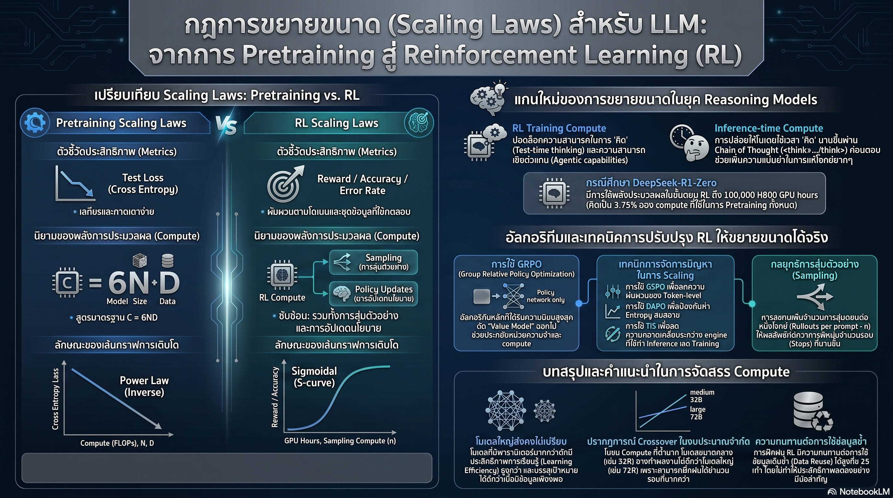

[กลับไปที่หน้าหลัก](../README.md)

สวัสดีครับเพื่อนๆ ที่ติดตามวงการ AI และ Machine Learning! วันนี้มาเรื่องที่กำลังเขย่าพื้นฐานความเข้าใจของนักวิจัย AI ทั่วโลก: "กฎการขยายตัว (Scaling Laws) สำหรับ Reasoning Models ไม่ได้ทำงานแบบเดิมอีกต่อไปแล้วครับ" — และสูตรลับที่เคยใช้ได้ในยุค Pretraining อาจทำให้คุณเสียเงินหลายล้านดอลลาร์โดยเปล่าประโยชน์ถ้านำมาใช้ใน Reinforcement Learning ยุคใหม่ครับ

คุณเคยสังเกตไหมครับว่า ในยุค GPT-3 และ Llama นักวิจัยสามารถ "พยากรณ์" ได้ล่วงหน้าก่อนเทรนว่าโมเดลที่ใช้ Compute เท่านั้นเท่านี้จะได้ผลลัพธ์ระดับไหน เหมือนมีสูตรคำนวณแม่นๆ ในมือ — แต่พอเปลี่ยนมาเทรน Reasoning Model ด้วย Reinforcement Learning สูตรเดิมกลับพังโดยสิ้นเชิง ทำให้ทีมวิจัยต้องหวนกลับไปลองผิดลองถูกแบบ "Tinkering" เหมือนยุคก่อน Scaling Laws ครับ?

คุณรู้ไหมครับว่า ถ้าเราโยน Compute ลงไปใน RL Training โดยไม่เข้าใจกฎ Sigmoidal ที่ซ่อนอยู่เบื้องหลัง เราอาจกำลังจ่ายค่า GPU แพงๆ เพื่อให้โมเดลฉลาดขึ้นแค่หัวขนเดียว ทั้งที่ถ้าปรับกลยุทธ์การสุ่ม (Sampling) ให้ถูกวิธี ผลลัพธ์เดียวกันอาจใช้ทรัพยากรน้อยกว่าครึ่งครับ?

และคุณเคยนึกไหมครับว่า ใน Compute Budget ที่เท่ากัน โมเดล 32B บางครั้งสามารถเอาชนะโมเดล 72B ได้ — ไม่ใช่เพราะมันฉลาดกว่า แต่เพราะมัน "เทรนได้มากกว่า" ในเวลาและงบประมาณเดียวกัน ซึ่งนี่คือบทเรียนที่ทีม Qwen ค้นพบและเปลี่ยนวิธีการออกแบบ Training Pipeline ของพวกเขาไปอย่างสิ้นเชิงครับ?

งานวิจัยนี้กำลังบอกว่า: ยุคใหม่ของ Scaling Laws สำหรับ RL ไม่ใช่แค่การ "สาด Compute" เหมือนเดิม — แต่คือการบริหาร "ศิลปะแห่งการสุ่ม, การจัดสรรทรัพยากร และการรักษาเสถียรภาพของการเรียนรู้" ในสมการที่ซับซ้อนกว่า Power Law ธรรมดาหลายเท่าครับ

========================================

🤔 ทบทวนความเชื่อเดิมๆ: สิ่งที่เราคิดเกี่ยวกับการ Scale AI Reasoning

▪ "Scaling Laws สำหรับ AI คือ Power Law เสมอ — ยิ่งใส่ Compute มากเท่าไหร่ ผลลัพธ์ก็ยิ่งดีขึ้นในอัตราที่ทำนายได้" → สำหรับ RL นั้นไม่ใช่ครับ เส้นกราฟไม่ใช่เส้นตรงใน Log-scale แต่เป็นเส้นโค้งรูปตัว S (Sigmoidal) ที่มีเพดาน (Ceiling) ชัดเจน ซึ่งหมายความว่าไม่ว่าจะสาด Compute ไปมากแค่ไหน ก็ไม่สามารถ "ซื้อ" ความฉลาดที่เกินจาก Asymptote ของโมเดลได้ครับ

▪ "วิธีเพิ่มประสิทธิภาพ RL Training ที่ดีที่สุดคือเทรนให้นานขึ้น (เพิ่ม Training Steps)" → การเพิ่ม Update Steps (M) มีประสิทธิภาพเฉพาะในช่วงที่โมเดลพบคำตอบถูกต้องบ่อยพอแล้วครับ สำหรับโจทย์ยากที่โมเดลยังแก้ไม่ได้ สิ่งที่ต้องทำก่อนคือเพิ่ม Rollouts ต่อโจทย์ (n) เพื่อให้มี "โอกาส" พบเส้นทางการใช้เหตุผลที่ถูกต้องก่อน — เหมือนต้องลองพลิกหน้ากระดาษเพื่อหาคำตอบก่อน จะเพิ่มระยะเวลาท่องจำไปก็เปล่าประโยชน์ครับ

▪ "โมเดลที่ใหญ่กว่าจะให้ผลลัพธ์ที่ดีกว่าในทุกสถานการณ์ — โดยเฉพาะในงาน Reasoning" → ในสภาวะที่ Compute จำกัด โมเดล 32B อาจเอาชนะ 72B ได้ในงาน RL ครับ เพราะโมเดลที่เล็กกว่าสามารถทำ Training Steps ได้มากกว่าในงบเดียวกัน และ Learning Efficiency ต่อพารามิเตอร์ของโมเดลใหญ่มากจะถึงจุดอิ่มตัว (Saturate) เร็วกว่าที่เราคาดครับ

▪ "ข้อมูลใหม่ที่ไม่ซ้ำกันคือสิ่งสำคัญที่สุดใน RL Training — การใช้ข้อมูลซ้ำจะทำให้โมเดล Overfit" → งานวิจัยพิสูจน์ว่าเราสามารถใช้ข้อมูลชุดเดิมซ้ำได้ถึง 25 รอบ (Data Reuse Factor τ = 25) โดยประสิทธิภาพไม่ลดลงอย่างมีนัยสำคัญ ถ้าออกแบบ Curriculum และ Difficulty Distribution ให้ถูกต้องครับ — ความสดของข้อมูลไม่ใช่คำตอบ แต่ความหลากหลายของระดับความยากต่างหากที่สำคัญครับ

ความจริงที่น่าคิดคือ: การทำ RL ให้ดีคือการ "บริหารการสุ่มสำรวจ" ไม่ใช่แค่การเพิ่ม Compute — และทีมที่เข้าใจ Sigmoidal Dynamics จะใช้งบน้อยกว่าแต่ได้ผลลัพธ์ที่ดีกว่าทีมที่แค่สาด GPU ครับ

========================================

🧠 พื้นฐานที่ต้องเข้าใจก่อน: Sigmoidal Curve, IsoCompute Playbook, Learning Efficiency และ ScaleRL

=== ทำไม Power Law ของ Pretraining ถึงไม่ใช้ได้กับ RL? ===

ในยุค Pretraining เราคุ้นเคยกับสมการ Loss ∝ C^(-α) ที่บอกว่า Training Loss จะลดลงในอัตราคงที่ตาม Compute (C) ที่เพิ่มขึ้น เส้นกราฟใน Log-scale จะเป็นเส้นตรง ทำนายได้สวยงาม

แต่ใน RL บริบทต่างออกไปโดยสิ้นเชิง:

— Reward Signal มีความหายากและไม่ต่อเนื่อง: โมเดลต้องค้นหา "Reasoning Path" ที่ถูกต้องซึ่งอาจเกิดขึ้นแค่ 1 ใน 1,000 การสุ่มก่อน แล้วค่อยเรียนรู้จากมัน เหมือนนักกอล์ฟที่ต้องลองสวิงหลายแบบก่อนจะ "รู้สึก" ได้ว่าแบบไหนให้ผลดี — ไม่ใช่การเพิ่มเวลาฝึกสวิงแบบเดิมซ้ำๆ ครับ

— Exploration ต้องมาก่อน Exploitation: ในช่วงต้น โมเดลยังไม่รู้ว่า "เส้นทางที่ถูกต้อง" คืออะไร การเทรนให้นานขึ้น (เพิ่ม M) โดยไม่มีตัวอย่างที่ดีพอ จึงเหมือนการ Optimize ทิศทางที่ผิดให้แม่นขึ้น ผลลัพธ์คือโมเดลที่ "ผิดอย่างมั่นใจ" ครับ

— Non-stationarity: ทุกครั้งที่ Policy อัปเดต การกระจายตัวของ Reward ก็เปลี่ยน ทำให้สภาพแวดล้อมการเรียนรู้ไม่เสถียรเหมือน Pretraining ที่ Target Distribution คงที่ครับ

=== Sigmoidal Curve: กฎใหม่ที่พยากรณ์ความฉลาดของ Reasoning Models ===

เมื่อนักวิจัยวิเคราะห์ข้อมูล RL Training อย่างละเอียด พวกเขาพบว่าพฤติกรรมที่แท้จริงนั้นสอดคล้องกับสมการ Sigmoidal:

Reward Gain = A × 1 / (1 + (C_mid / C)^B)

ตัวแปรทั้งสามตัวนี้มีนัยยะที่ลึกซึ้งมากครับ:

A — Asymptotic Reward Ceiling (เพดานสูงสุด): คือขีดจำกัดสูงสุดที่โมเดลนี้จะเก่งขึ้นได้ ไม่ว่าจะใส่ Compute ไปมากแค่ไหน เหมือนนักดนตรีที่มี Ceiling ของพรสวรรค์ — การซ้อมเพิ่มจะไม่ทำให้ก้าวข้าม Ceiling ได้โดยไม่เปลี่ยนวิธีการสอนครับ ค่า A นี้ถูกกำหนดโดย Base Model (Pretraining Quality) และ Task Difficulty เป็นหลัก

C_mid — Midpoint (จุดกึ่งกลาง): ปริมาณ Compute ที่ทำให้เกิดการกระโดดของประสิทธิภาพอย่างมีนัยสำคัญ ถ้า Compute น้อยกว่า C_mid มาก โมเดลยังอยู่ใน "ช่วงสำรวจ" ที่ Reward แทบไม่ขยับ ถ้าเกิน C_mid แล้วโมเดลจะเข้าสู่ "ช่วงเรียนรู้เร็ว" ก่อนจะชะลอลงเมื่อใกล้ A ครับ

B — Efficiency Exponent (ความชัน): บ่งบอกว่า Compute ถูกแปลงเป็นความฉลาดได้มีประสิทธิภาพแค่ไหน ค่า B สูงหมายถึงการเปลี่ยนผ่านจาก "ยังไม่ฉลาด" เป็น "ฉลาดมาก" เกิดขึ้นอย่างรวดเร็วเมื่อ Compute ผ่านจุด C_mid ครับ

ข้อค้นพบที่ทรงพลังที่สุดคือ: เราสามารถใช้ข้อมูลจากช่วงต้นของ Training (Early-phase data) มา Fit สมการนี้ แล้วทำนาย "จุดอิ่มตัว" ของโมเดลได้ก่อนที่จะ Commit งบประมาณ GPU ก้อนใหญ่ — เหมือนการชิมน้ำซุปทีแรกแล้วรู้ได้ว่าต้มต่ออีกนานแค่ไหนก็ไม่อร่อยขึ้นแล้วครับ

=== IsoCompute Playbook: ศิลปะการจัดสรรทรัพยากรสามมิติ ===

เมื่อมีงบ Compute จำกัด คำถามสำคัญคือ "ควรแบ่งใช้ยังไง?" ระบบ RL มีทรัพยากรสามส่วนที่ต้องสมดุล:

B_p (Prompts per batch) — ความหลากหลายของโจทย์: ยิ่งมีโจทย์หลากหลายในหนึ่งรอบ โมเดลยิ่งไม่ Overfit กับปัญหาเฉพาะกลุ่มครับ เหมือนแพทย์ฝึกหัดที่ต้องเห็นผู้ป่วยหลายโรค ไม่ใช่แค่ผู้ป่วยโรคเดียวหลายคน

n (Rollouts per prompt) — จำนวนการสุ่มตอบต่อโจทย์: นี่คือ "ความกว้างของการสำรวจ" สำหรับโจทย์ยาก การเพิ่ม n เปรียบเหมือนการให้นักสืบลองสมมติฐานหลายๆ แบบก่อนตัดสินใจ — ยิ่งสมมติฐานมากขึ้น โอกาสที่จะ "สะดุด" กับเส้นทางที่ถูกต้องก็มากขึ้นครับ

M (Update steps) — จำนวนรอบการอัปเดตนโยบาย: คือ "ความลึกของการเรียนรู้" เมื่อโมเดลพบคำตอบที่ถูกต้องแล้ว M ที่มากขึ้นช่วยให้นโยบาย (Policy) แข็งแกร่งและทั่วไป (Generalize) ครับ

กลยุทธ์ที่ IsoCompute Playbook แนะนำ:

ขั้นที่ 1: เพิ่ม n จนถึงจุดอิ่มตัวก่อนเสมอ — โดยเฉพาะในโจทย์ยาก Pass@K จะพุ่งขึ้นชัดเจน แต่เมื่อ n ถึงจุดที่โมเดลพบคำตอบที่ถูกต้องบ่อยแล้ว Marginal Return ของการเพิ่ม n จะลดลงครับ

ขั้นที่ 2: โยก Compute ส่วนที่เหลือไปที่ M — เมื่อโมเดลมีตัวอย่างที่ดีพอแล้ว การเพิ่ม Update Steps จะช่วยให้ Policy แข็งแกร่งขึ้นจริงๆ ครับ

ขั้นที่ 3: รักษา B_p ให้หลากหลายเพียงพอ — การใช้โจทย์น้อยเกินไปในหนึ่ง Batch ทำให้โมเดล Overfit กับ Pattern เฉพาะครับ

ความแตกต่างระหว่างโจทย์ง่ายและยากที่น่าสนใจมากคือ: สำหรับโจทย์ง่าย (Pass Rate > 50%) การเพิ่ม n ช่วยปรับ Avg@K — คือคำตอบโดยเฉลี่ยดีขึ้น แต่สำหรับโจทย์ยาก (Pass Rate < 10%) n คือกุญแจสำคัญในการปลดล็อก Pass@K — คือความสามารถในการ "หาคำตอบที่ถูกได้เลย" ครับ

=== The 32B vs 72B Crossover: เมื่อขนาดไม่ใช่คำตอบเสมอไป ===

ปรากฏการณ์นี้ขัดกับสัญชาตญาณของคนส่วนใหญ่ครับ ผลการวิจัยจากตระกูล Qwen พบว่า Learning Efficiency K(N) — ซึ่งวัดว่าโมเดลขนาด N พารามิเตอร์เรียนรู้ได้มากแค่ไหนต่อหน่วย Compute — จะเริ่มถึงจุดอิ่มตัวเมื่อโมเดลใหญ่มากๆ ครับ

เปรียบได้กับห้องเรียนสองห้อง: ห้องเรียนเล็ก (32B) มีนักเรียน 32 คน สามารถสอนซ้ำได้ 72 รอบในเวลาชั่วโมงเดียว ส่วนห้องเรียนใหญ่ (72B) มีนักเรียน 72 คน สอนซ้ำได้แค่ 32 รอบในเวลาเดียวกัน ในงานที่ต้องการการฝึกซ้ำมากๆ ห้องเล็กจะ "เก่งขึ้น" เร็วกว่าแม้มีนักเรียนน้อยกว่าครับ

อย่างไรก็ตาม ปรากฏการณ์นี้เกิดเฉพาะใน Compute-constrained regime ครับ ถ้ามีงบและเวลาไม่จำกัด โมเดลใหญ่กว่าจะชนะเสมอ เพราะ Sample Efficiency ต่อหน่วยข้อมูลสูงกว่า — แต่ในโลกจริงที่งบประมาณจำกัด บางครั้งการเลือก 32B อาจให้ผลลัพธ์ดีกว่าอย่างประหลาดใจครับ

=== ScaleRL Recipe: สูตรลับความเสถียรสำหรับการเทรนขนาดใหญ่ ===

การเทรน RL ในระดับ 100,000 GPU-hours คือมหากาพย์แห่ง Engineering Stability ครับ ความผิดพลาดเล็กๆ ใน Architecture ของ Training Pipeline สามารถขยายตัวจนทำให้ทั้ง Run พัง

วิวัฒนาการ GRPO และปัญหา Length Bias:

GRPO (Group Relative Policy Optimization) ถูกพัฒนาขึ้นเพื่อตัดตัวโมเดล Critic ออกจาก PPO ทำให้ประหยัด Compute ได้มาก แต่เกิดปัญหาใหม่ขึ้นครับ: Response-level Length Bias

ปัญหาเกิดเพราะระบบหาร Loss ด้วยจำนวน Token ทั้งหมด ทำให้ Gradient ถูกบิดเบือนตามความยาวคำตอบ โมเดลจึงเรียนรู้ว่า "ยิ่งตอบยาวยิ่งปลอดภัย" และพัฒนาพฤติกรรม "เขียนยาวแต่วนเวียน" เพื่อโกงรางวัลครับ — เหมือนนักเรียนที่รู้ว่าครูให้คะแนนตามหน้ากระดาษ แทนที่จะให้คะแนนตามเนื้อหา

Dr. GRPO และ DAPO แก้ปัญหานี้ด้วยการ Normalize Loss ในระดับ Token แทนระดับ Response ทำให้ทุก Token มีน้ำหนักเท่าเทียมกัน ไม่ว่าคำตอบจะสั้นหรือยาวครับ

สูตร ScaleRL ที่ทีมวิจัยค้นพบ:

PipelineRL (โครงสร้างแบบ Asynchronous): แยก Inference Engine และ Training Engine ให้ทำงานพร้อมกันโดยไม่ต้องรอกัน ลด GPU Idle time ลงอย่างมีนัยสำคัญ แต่ต้องควบคุมค่า K=8 Bound ไม่ให้ Policy อัปเดตนำหน้า Rollout เกิน 8 Steps — เพราะถ้านำหน้ามากเกินไป Rollout จะ Stale ไม่สอดคล้องกับ Policy ปัจจุบันครับ

12K Reasoning Budget + Forced Interruptions: กำหนดเพดานการคิดที่ 12,000 Token พร้อมระบบบังคับตัดจบการคิดเมื่อถึงเวลาที่กำหนด วิธีนี้สร้างสมดุลระหว่าง "คิดลึก" และ "ใช้ทรัพยากรอย่างมีประสิทธิภาพ" โดยไม่ให้โมเดลติดนิสัยเขียนยาวไม่มีที่สิ้นสุดครับ เหมือนการให้นักสอบมีเวลาจำกัด — บางทีทำให้ตัดสินใจได้ดีกว่าการนั่งคิดไม่มีกำหนดครับ

Full Precision (float32) Head: ชั้นสุดท้ายของโมเดลที่คำนวณ Logprobs ต้องใช้ความแม่นยำสูง เพราะถ้าใช้ fp16 หรือ bf16 เหมือนชั้นอื่นๆ ค่า Logprobs จาก Inference Engine และ Training Engine จะ Mismatch กันเล็กน้อย ซึ่งในสเกลใหญ่จะสะสมจนกลายเป็น Policy Gradient ที่ผิดเพี้ยนรุนแรงครับ

Truncated Importance Sampling (TIS): เทคนิคในการแก้ไข Mismatch ระหว่าง Inference Engine ที่มักทำงานด้วย fp8/int8 เพื่อความเร็ว กับ Training Engine ที่ต้องการความแม่นยำสูงกว่า TIS ตัดค่า Importance Weight ที่สูงเกินไปออก ป้องกัน Gradient Variance ที่รุนแรงจนทำให้ Policy พังครับ

=== Data Reuse Factor τ: ข้อมูลซ้ำไม่ใช่ศัตรู ===

ค้นพบที่น่าประหลาดใจที่สุดอีกอย่างในงานวิจัยนี้คือ ใน RL ความใหม่ของข้อมูลไม่สำคัญเท่าความหลากหลายของระดับความยากครับ

การใช้ข้อมูลซ้ำถึง 25 รอบ (τ = 25) ยังคงให้ประสิทธิภาพที่ดี ถ้าปฏิบัติตามเงื่อนไขสำคัญ:

Difficulty Subsets: ต้องแบ่งข้อมูลเป็นกลุ่มตามความยากและสุ่มซ้ำโดยรักษา Distribution นี้ไว้ เหมือนชุดฝึกซ้อมของนักกีฬาที่ต้องมีทั้งโจทย์ง่าย กลาง และยาก ไม่ใช่แค่โจทย์ระดับเดียวซ้ำๆ ครับ

Curriculum Learning: จัดลำดับจากง่ายไปยากในช่วงต้น เพื่อให้โมเดลมี Success Rate ที่พอดี — ถ้ายากเกินไปตั้งแต่ต้น โมเดลจะเข้าสู่ Entropy Collapse คือหยุดสำรวจและตอบมั่วไปเรื่อยๆ เหมือนนักเรียนที่เจอข้อสอบยากเกินจนยอมแพ้แทนที่จะพยายามครับ

No Positive Resampling: เมื่อโมเดลแก้โจทย์ใดโจทย์หนึ่งได้ถึง Pass Rate > 90% แล้ว ให้ตัดโจทย์นั้นออกจาก Training Batch เพราะ Compute ที่ใช้ไปกับโจทย์ที่โมเดลชำนาญแล้วคือ Compute ที่สูญเปล่าครับ — เหมือนนักเรียนที่แม่นบวกเลขแล้วไม่ต้องฝึกบวกเลขต่อ แต่ควรไปฝึกคูณหารที่ยังไม่แม่นแทนครับ

========================================

🔬 ผลลัพธ์ที่น่าสนใจ: ตัวเลขที่พิสูจน์ว่า Scaling Laws ใหม่ได้ผล

ประสิทธิภาพของ IsoCompute Playbook เมื่อเทียบกับ Baseline ที่ไม่ได้ปรับ Sampling Strategy:
— โจทย์ที่ยาก (Pass Rate < 10%): การเพิ่ม n จาก 4 เป็น 16 ให้ผลที่ดีกว่าการเพิ่ม M ในอัตราส่วนเดียวกันอย่างมีนัยสำคัญ
— Data Reuse τ = 25: ประสิทธิภาพลดลงน้อยมากเมื่อเทียบกับการใช้ข้อมูลใหม่ทั้งหมด แต่ประหยัด Cost ในการ Collect ข้อมูลได้มหาศาล
— 32B vs 72B Crossover: ในงบ Compute เดียวกัน 32B อาจเหนือกว่า 72B ในช่วง 20-40% ของ Training Timeline ก่อนที่ 72B จะตามทัน

การใช้สมการ Sigmoidal Fit กับ Early Training Data (ใช้ข้อมูลแค่ 20% แรก):
— ทำนาย Final Performance ได้ด้วย Error margin ที่ยอมรับได้
— ช่วยให้ตัดสินใจ "Kill Run ที่ไม่มีอนาคต" ได้ก่อนเสีย GPU เพิ่ม

========================================

🎯 ประเด็นที่ควรคิดต่อ

การค้นพบ Scaling Laws ยุคใหม่ในโลก RL นี้มีนัยยะที่ลึกกว่าแค่การประหยัดเงินค่า GPU ครับ มันกำลังบอกว่า:

— ทิศทางการพัฒนา AI เชิงกลยุทธ์: ทีมที่เข้าใจ Sigmoidal Dynamics และ IsoCompute Optimization จะสามารถ "ยิงแม่น" ในการลงทุนพัฒนาโมเดลได้ดีกว่าทีมที่แค่มีงบ GPU มากกว่า ซึ่งหมายความว่า Scaling Laws ยุคใหม่นี้อาจ "Democratize" การแข่งขันในโลก AI ได้บ้างครับ

— ขีดจำกัดที่แท้จริงของ Reasoning Models: ค่า A (Asymptotic Ceiling) บอกว่า Base Model Quality คือปัจจัยที่ RL ไม่สามารถเอาชนะได้ นั่นหมายความว่าการลงทุนใน Pretraining คุณภาพสูงยังคงสำคัญมากแม้ในยุค RL ครับ RL ขยายความสามารถที่มีอยู่ แต่ไม่สามารถสร้างความสามารถที่ไม่มีได้ตั้งแต่ต้นครับ

— คำถามที่น่าคิดที่สุด: ถ้า Scaling Laws กำลังถูกเขียนใหม่อีกครั้ง คราวนี้จากโลก RL — ขีดจำกัดต่อไปที่จะทำให้กฎเหล่านี้ต้องเขียนใหม่อีกครั้งคืออะไร? และเมื่อถึงตอนนั้น เรายังจะสามารถ "พยากรณ์" ความฉลาดของ AI ได้ล่วงหน้าอยู่ไหม — หรือมันจะเปลี่ยนแปลงเร็วเกินกว่าที่กฎข้อใดจะตามทันได้ครับ?

ถ้าคำตอบคือ "ไม่ได้" — นั่นอาจหมายความว่าเรากำลังเข้าสู่ยุคที่ความฉลาดของ AI ไม่ใช่แค่เรื่องของ Engineering อีกต่อไป แต่กลายเป็น Emergent Phenomenon ที่ไม่มีใครคาดเดาได้ล่วงหน้าครับ

#ScalingLaws #ReinforcementLearning #ReasoningModels #GRPO #IsoCompute #AIResearch #MachineLearning #DeepLearning #LargeLanguageModels #AITraining
