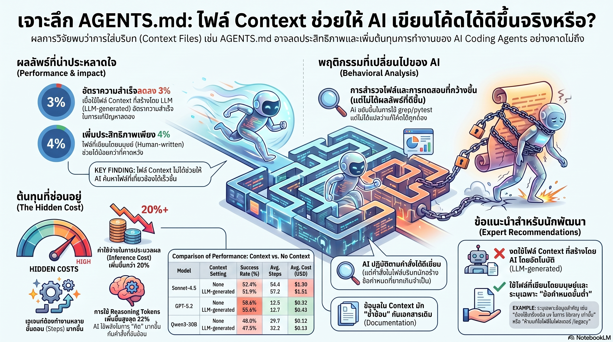

[กลับไปที่หน้าหลัก](../README.md)

AGENTS.md: "ภาษีความวุ่นวาย" ที่ทำให้ AI ของคุณทำงานแย่ลงและแพงขึ้น 20%

มันเป็นเรื่องตลกร้ายในวงการ AI Engineering เมื่อบริษัทผู้สร้าง Coding Agent ยักษ์ใหญ่อย่าง Anthropic และ OpenAI กำลังให้คำแนะนำที่ทำให้ Agent ของตัวเองทำงานแย่ลงและมีราคาแพงขึ้นโดยไม่รู้ตัว

เทรนด์การสร้างไฟล์บริบทระดับ Repository เช่น AGENTS.md หรือ CLAUDE.md กลายเป็นมาตรฐานใหม่ที่ทุกคนเชื่อว่าจะช่วยให้ AI เข้าใจโครงสร้างโปรเจกต์ได้ดีขึ้น แต่คำถามเชิงกลยุทธ์ที่เหล่านักพัฒนาและ Tech Leaders ต้องหยุดคิดคือ "มันช่วยได้จริง หรือแค่สร้าง Noise?"

งานวิจัยล่าสุดจาก ETH Zurich และ LogicStar.ai ได้ทำการทดสอบสมมติฐานนี้อย่างเข้มงวดผ่าน AGENTBENCH (Benchmark ใหม่สำหรับ Repository ขนาดเล็กและเฉพาะทาง) และผลลัพธ์ที่ได้นั้นเป็นสัญญาณเตือนที่ชัดเจนสำหรับทุกคนที่กำลังใช้คำสั่ง /init เพื่อสร้างไฟล์บริบทอัตโนมัติ

--------------------------------------------------------------------------------

1. ความขัดแย้งของประสิทธิภาพ: ยิ่งข้อมูลมาก (จาก AI) ยิ่งแย่ (The Performance Paradox)

ผลลัพธ์ที่น่าตกใจที่สุดจากการทดสอบคือ เมื่อใช้ไฟล์บริบทที่สร้างโดย LLM ประสิทธิภาพในการแก้ปัญหาของ Agent กลับ ลดลงเฉลี่ย 3% ใน AGENTBENCH และลดลง 0.5% ใน SWE-BENCH LITE

งานวิจัยเปิดเผย "ความจริงที่น่าสนใจ" ว่าไฟล์บริบทที่ AI สร้างขึ้นจะมีประโยชน์ (ประสิทธิภาพเพิ่มขึ้น +2.7%) ก็ต่อเมื่อใน Repository นั้นไม่มีเอกสารใดๆ เลย (Naked Repository) เท่านั้น แต่ถ้าโปรเจกต์ของคุณมี README.md หรือเอกสารมาตรฐานที่ดีอยู่แล้ว ไฟล์บริบทที่ AI สร้างขึ้นจะกลายเป็น "ขยะทางข้อมูล" ที่เข้าไปซ้ำซ้อนและสร้างความสับสนมากกว่าการให้คำแนะนำ

"เราพบว่าข้อกำหนดที่ไม่จำเป็นในไฟล์บริบททำให้งานยากขึ้น และไฟล์บริบทที่สร้างโดย LLM มีแนวโน้มที่จะลดอัตราความสำเร็จของ Agent ในทุกโมเดลและทุก Prompt ที่ใช้สร้าง"

--------------------------------------------------------------------------------

2. "ภาษีการคิด" ที่เพิ่มขึ้นกว่า 20% (The 20% Surcharge)

การใส่ไฟล์บริบทที่สร้างโดย LLM เข้าไป ไม่ได้แค่ทำให้งานเสร็จช้าลง แต่ยังเป็นการจ่าย "ภาษีการคิด" (Cognitive Tax) ที่แพงเกินความจำเป็น โดยเฉพาะเมื่อใช้กับโมเดลระดับ Frontier (เช่น GPT-5.2 หรือ Sonnet 4.5) ซึ่งผลการวิจัยชี้ให้เห็นว่าแม้โมเดลจะฉลาดขึ้นแค่ไหน ก็ไม่สามารถจัดการกับบริบทที่ซ้ำซ้อนได้ดีไปกว่าเดิม:

* ค่าใช้จ่าย (Inference Cost) พุ่งสูงขึ้นกว่า 20%: ในทุกการทดสอบ Agent มีค่าใช้จ่ายที่สูงขึ้นโดยไม่ได้ผลลัพธ์ที่ดีขึ้น
* เผาผลาญ Reasoning Tokens เพิ่มขึ้น: สำหรับโมเดล GPT-5.2 มีการใช้ Reasoning Tokens เพิ่มขึ้นถึง 22% และ 14% สำหรับ GPT-5.1 Mini
* ขั้นตอนการทำงาน (Steps) เพิ่มขึ้น: Agent ใช้ขั้นตอนในการทำงานมากขึ้นเฉลี่ย 2.45 ถึง 3.92 ขั้นตอนต่อภารกิจ เพราะเสียเวลาไปกับการ "สำรวจ" ในจุดที่ไม่จำเป็น

--------------------------------------------------------------------------------

3. บทลงโทษของการเชื่อฟัง: เมื่อการทำตามคำสั่งทำลายตรรกะ (The Obedience Penalty)

ปัญหาที่เกิดขึ้นไม่ได้มาจาก Agent "ไม่เชื่อฟัง" แต่เกิดจาก "การเชื่อฟังที่เคร่งครัดเกินไป" (Strict Instruction-Following) จนทำให้เสียสมาธิจากการแก้ปัญหาที่แท้จริง

จากการวิเคราะห์ Trace analysis พบว่าไฟล์บริบทมักระบุให้ใช้เครื่องมืออย่าง uv หรือ pytest อย่างละเอียดเกินความจำเป็น ส่งผลให้ Agent มุ่งเน้นไปที่การทำ "Busy Work" เช่น การเรียกใช้ uv เพิ่มขึ้นจากเกือบ 0 เป็น 1.6 ครั้งต่อภารกิจ เพื่อทำการสำรวจไฟล์ในวงกว้าง (Broad Exploration) แทนที่จะพุ่งเป้าไปที่การแก้ไขโค้ดแบบเจาะจง (Surgical Fix)

นี่คือกับดักของการทำตามคำสั่ง (Instruction-Following Trap) ที่ไฟล์บริบทสร้าง "ความรู้สึกว่าต้องทำ" ให้กับ AI จนมันหลงทางไปจากเป้าหมายหลัก

--------------------------------------------------------------------------------

4. กลยุทธ์สำหรับการใช้งานจริง: มนุษย์ยังคงเหนือกว่า (Minimalist Strategy)

ในขณะที่ไฟล์ที่ AI สร้างนั้นล้มเหลว แต่ไฟล์บริบทที่ "มนุษย์เขียนเอง" ยังคงแสดงให้เห็นถึงความได้เปรียบโดยช่วยเพิ่มประสิทธิภาพได้ราว 4% อย่างไรก็ตาม หัวใจสำคัญไม่ใช่การเขียนให้ยาว แต่คือการเขียนให้ "คม"

คำแนะนำเชิงปฏิบัติ (Actionable Advice):

1. ยึดหลัก Minimalism & Delta: ไฟล์บริบทควรบรรจุเฉพาะสิ่งที่ AI "หาเองไม่ได้" จากการอ่านโครงสร้างไฟล์ (เช่น Environment variables เฉพาะตัว หรือ internal tools ที่ไม่เป็นมาตรฐาน)
2. นโยบาย "No Overview": ผลวิจัยชี้ชัดว่าการใส่ Codebase Overview ไม่ได้ช่วยให้ Agent หาไฟล์ที่เกี่ยวข้องได้เร็วขึ้นเลย ดังนั้นควรตัดเนื้อหาส่วนนี้ออกเพื่อลด Noise
3. ระบุเฉพาะเครื่องมือที่จำเป็น (Specific Tooling): ระบุคำสั่ง Test หรือ Build ที่เป็นความลับของโปรเจกต์เท่านั้น
4. หยุดใช้ /init ทันที: ณ ปัจจุบัน ควรยกเลิกการใช้คำสั่งสร้างไฟล์บริบทอัตโนมัติจาก Agent เพราะมันคือการสร้าง "Tax" ให้กับโปรเจกต์ของคุณโดยเปล่าประโยชน์

--------------------------------------------------------------------------------

บทสรุป: ก้าวต่อไปของการสร้าง "คู่มือสำหรับ AI"

งานวิจัยชิ้นนี้เป็นเครื่องเตือนใจว่าเรายังอยู่ในยุคเริ่มต้นของการสื่อสารกับ Coding Agents สิ่งที่เราคิดว่าเป็น "บริบท" (Context) บ่อยครั้งกลับกลายเป็น "สิ่งรบกวน" (Distraction) ที่ลดทอนประสิทธิภาพและเพิ่มต้นทุน

เป้าหมายสูงสุดของ AI Engineering Strategy ไม่ใช่การประโคมข้อมูลใส่ AI ให้มากที่สุด แต่เป็นการคัดเลือกข้อมูลที่ "คม" และ "จำเป็น" ที่สุด เพื่อให้ Agent ใช้พลังการคิดไปกับการแก้ปัญหา ไม่ใช่การหลงทางอยู่ในกองเอกสารที่ซ้ำซ้อน

คำถามชวนคิดทิ้งท้าย: "ในอนาคต เราจะพัฒนา AI ให้มีความสามารถในการแยกแยะ 'สัญญาณ' (Signal) ออกจาก 'สิ่งรบกวน' (Noise) ในไฟล์บริบทได้อย่างไร เพื่อไม่ให้การเชื่อฟังคำสั่งกลายเป็นอุปสรรคต่อการทำงาน?"
