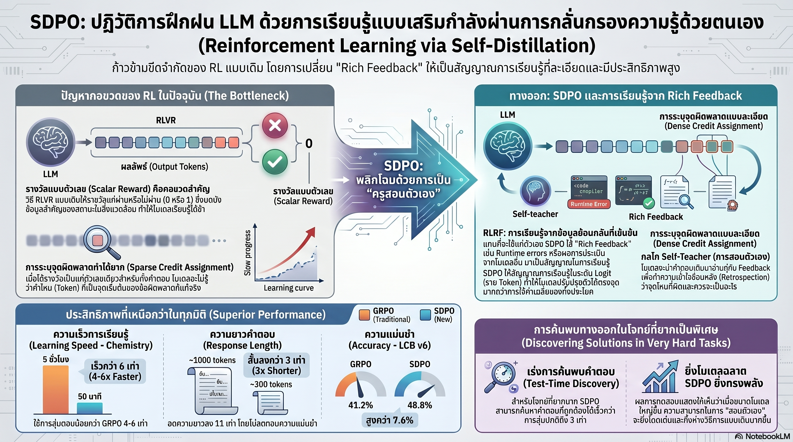

[กลับไปที่หน้าหลัก](../README.md)

สวัสดีครับเพื่อนๆ ที่ติดตามวงการ AI! วันนี้มาเรื่องที่ดูเหมือนเรื่องทางเทคนิค แต่จริงๆ แล้วเกี่ยวข้องกับทุกคนที่เคยรู้สึกหงุดหน่ายกับ AI ที่ตอบวนไปวนมา เรื่องของการเปลี่ยนวิธีที่โมเดลเรียนรู้จากตัวเองอย่างถึงแก่น ครับ

คุณเคยสังเกตไหมครับว่า AI ที่เก่งมากบางครั้งกลับตอบยาวเป็นหางว่าวแต่วนไปวนมาไม่ได้เรื่อง เห็น "Hmm... wait... no... I'm going in circles..." เต็มไปหมด?

คุณเคยสงสัยไหมครับว่า ทำไมการให้คะแนนแค่ "ถูก" หรือ "ผิด" ถึงไม่เพียงพอสำหรับการฝึก AI ให้คิดได้จริงๆ?

และคุณรู้ไหมครับว่า มีวิธีที่ทำให้ AI เรียนรู้จากความผิดพลาดของตัวเองในระดับ "คำต่อคำ" แทนที่จะรู้แค่ว่า "ผิด" แบบเหมาๆ และนั่นคือหัวใจของ SDPO?

SDPO หรือ Self-Distillation Policy Optimization จาก ETH Zurich, MIT และ Stanford เปลี่ยน AI ให้กลายเป็นทั้ง "ครู" และ "นักเรียน" ในร่างเดียวกัน ผลคือตอบสั้นลง 3-11 เท่าแต่แม่นยำขึ้น และแก้โจทย์ที่ AI ทั่วไปทำไม่ได้เลยได้สำเร็จถึง 70% ครับ

========================================

🤔 ทบทวนความเชื่อเดิมๆ: สิ่งที่เราคิดเกี่ยวกับการฝึก AI

▪ "ยิ่ง AI คิดนานและตอบยาว ยิ่งแปลว่ามันฉลาด" → ในโจทย์เคมีข้อเดียวกัน GRPO ใช้ 5,549 Tokens เต็มไปด้วยการพึมพำ แต่ SDPO ใช้แค่ 764 Tokens แล้วตอบถูก ความยาวไม่ใช่ความฉลาด มันคือสัญญาณของความไม่มั่นใจ

▪ "ปัญหาของ AI ที่คิดไม่ตกอยู่ที่อัลกอริทึม RL" → งานวิจัยพิสูจน์ว่าอัลกอริทึม RL ไม่ใช่ตัวปัญหา แต่ตัวปัญหาคือ "คะแนนดิบ 0/1" ที่ให้ข้อมูลน้อยเกินไปจนโมเดลไม่รู้ว่าตัวเองผิดตรงไหน

▪ "AI ทุกตัวสามารถเรียนรู้จากตัวเองได้ถ้าใช้เทคนิคที่ดีพอ" → ความสามารถในการสอนตัวเองเป็น Emergent Phenomenon ที่ต้องการขนาดและความฉลาดถึงระดับหนึ่งก่อน โมเดลขนาดเล็กอย่าง Qwen2.5-1.5B ยังทำไม่ได้

▪ "การแก้โจทย์ยาก ยิ่งลองตอบหลายรอบยิ่งมีโอกาสเจอคำตอบ" → Best-of-k (สุ่มตอบหลายรอบ) วนซ้ำที่จุดเดิมเพราะไม่มีการเรียนรู้ SDPO ใช้ Test-Time Self-Distillation ที่ "อัปเกรดสมองทันที" หลังทำผิดแต่ละครั้ง ทำให้ค้นพบคำตอบเร็วกว่า 3 เท่า

ความจริงที่น่าคิดคือ: คอขวดของ AI ไม่ได้อยู่ที่ความฉลาด แต่อยู่ที่ "คุณภาพของสัญญาณที่ใช้เรียนรู้" ครับ

========================================

🧠 พื้นฐานที่ต้องเข้าใจก่อน: RLVR, Information Bottleneck, Credit Assignment และ Self-Distillation

=== RLVR คืออะไร? ===

RLVR = Reinforcement Learning with Verifiable Rewards วิธีฝึก AI ที่ใช้กันอยู่ในปัจจุบัน

หลักการง่ายมากครับ: ให้โมเดลลองตอบ → ถ้าถูกได้ +1, ถ้าผิดได้ 0 → โมเดลพยายามทำให้ได้คะแนนมากขึ้น

ปัญหาคือข้อมูลที่โมเดลได้คือตัวเลขเดียวสำหรับคำตอบทั้งก้อน ไม่บอกว่าผิดตรงไหนหรือทำไมครับ

=== Information Bottleneck คืออะไร? ===

Information Bottleneck = "คอขวดของข้อมูล" ที่เกิดขึ้นเมื่อสัญญาณการเรียนรู้ถูกบีบให้เหลือแค่ตัวเลข 0 หรือ 1

เปรียบเทียบ: เหมือนส่งนักเรียนสอบแล้วส่งคืนมาแค่ว่า "สอบตก" โดยไม่บอกว่าผิดข้อไหน บรรทัดไหน หรือเพราะอะไร นักเรียนจะเรียนรู้ได้ยากมากครับ

=== Credit Assignment คืออะไร? ===

Credit Assignment = ความสามารถในการชี้ได้ว่า "ขั้นตอนที่ 4 จาก 10 ขั้น — ตรงนี้แหละที่เป็นต้นตอของความผิดพลาด"

[สิ่งที่ RLVR ทำได้] ชี้ได้แค่ว่า "คำตอบสุดท้ายถูกหรือผิด"
[สิ่งที่ RLVR ทำไม่ได้] ชี้ได้ว่า Token ที่ 47 จากทั้งหมด 200 คือจุดที่กระบวนการคิดเริ่มออกนอกทาง

=== Token คืออะไร? ===

Token = หน่วยย่อยที่ AI อ่านและเขียนทีละชิ้น ประมาณ 1 Token ≈ 3/4 ของคำภาษาอังกฤษ

คำตอบ 5,549 Tokens ≈ ข้อความยาว 4,000 คำ หรือบทความ 8 หน้า A4 ครับ

=== Self-Distillation คืออะไร? ===

Self-Distillation = กระบวนการที่โมเดลเวอร์ชัน "ฉลาดกว่า" (ที่ได้รับ Rich Feedback) กลั่นความรู้ถ่ายทอดกลับให้โมเดลเวอร์ชันปกติของตัวเอง

เปรียบเทียบ: เหมือนนักเรียนที่ได้รับคำติชมละเอียดจากครู กลับมาเขียนโน้ตสอนตัวเองใหม่ในภาษาที่ตัวเองเข้าใจที่สุดครับ

=== Dense Signal vs Scalar Reward ต่างกันอย่างไร? ===

[Scalar Reward] = ตัวเลขเดียวสำหรับคำตอบทั้งก้อน (0 หรือ 1)
[Dense Signal] = สัญญาณในระดับ Token ต่อ Token บอกได้ว่าคำไหนควรไปต่อ คำไหนควรย้อนกลับมาแก้

เปรียบเทียบ: เหมือนความต่างระหว่างครูที่เขียนว่า "F" กับครูที่ขีดเส้นใต้ทีละบรรทัดแล้วอธิบายว่าทำไมครับ

========================================

1️⃣ ทำลาย Information Bottleneck ด้วย Rich Feedback และ Credit Assignment ที่แม่นยำ

=== ปัญหาที่แท้จริง ===

คำ Quote จากงานวิจัย SDPO ที่กินใจที่สุดคือ

"คอขวดสำคัญที่ขัดขวางการพัฒนา AI ไม่ใช่ตัวอัลกอริทึม RL แต่คือ Information Bottleneck ที่เกิดจากการใช้เพียง Scalar Rewards ซึ่งบดบังสถานะที่แท้จริงของความผิดพลาดในสิ่งแวดล้อมนั้นๆ"

พูดให้ชัดคือ: โมเดลไม่ฉลาดขึ้นไม่ได้เพราะอัลกอริทึมผิด แต่เพราะสัญญาณที่ให้มันเรียนรู้นั้นมีข้อมูลน้อยเกินไปครับ

=== RLRF แก้ปัญหาอย่างไร? ===

SDPO ใช้ RLRF หรือ Reinforcement Learning with Rich Feedback แทนที่จะให้แค่คะแนน 0 หรือ 1 ระบบส่งข้อมูลที่ "เข้มข้น" กว่ามากให้โมเดล เช่น

▸ Runtime Errors จากการรันโค้ดจริง — ไม่ใช่แค่ "โค้ดผิด" แต่รู้ว่า "บรรทัดที่ 7: TypeError เพราะ input เป็น string แต่ต้องการ integer"

▸ คำแนะนำเชิงโครงสร้างจากระบบตรวจข้อสอบ — ชี้ว่าขั้นตอนที่ 3 ขาดสมมติฐานอะไรไป

=== Retrospection: การทบทวนตัวเองอย่างละเอียด ===

ข้อมูล Rich Feedback เหล่านี้ถูกส่งให้โมเดลทำ Retrospection คือมองย้อนกลับไปทบทวนกระบวนการคิดของตัวเองทีละ Token ว่าจุดไหนคือต้นตอของความผิดพลาด

ผลคือ Dense Signal ในระดับคำต่อคำ ที่บอกได้อย่างแม่นยำว่าอะไรควร "ไปต่อ" และอะไรควร "ย้อนกลับมาแก้ไข"

เปรียบเทียบ: เหมือนเปลี่ยนจากครูที่เขียน "F" กลับมา เป็นครูที่นั่งข้างๆ แล้วชี้ทีละบรรทัดพร้อมอธิบายว่า "ตรงนี้ดี — ตรงนี้พอใช้ — ตรงนี้ผิดพลาดเพราะ..." นักเรียนจะเรียนรู้ได้เร็วกว่ามากครับ

========================================

2️⃣ เลิกพึมพำ: เมื่อ AI เรียนรู้ที่จะ "คิดให้ตรงประเด็น" ไม่ใช่ "คิดให้ยาว"

=== ตัวเลขที่น่าตกใจ ===

SDPO ลดความยาวคำตอบได้ 3-11 เท่าในขณะที่ความแม่นยำสูงขึ้น ตัวเลขนี้ทำลายความเชื่อที่ว่า "ยิ่งคิดนานยิ่งฉลาด" อย่างสิ้นเชิงครับ

=== เปรียบเทียบโจทย์เคมีข้อเดียวกัน ===

[GRPO — วิธีเดิม]
▸ ใช้ 5,549 Tokens (ยาวประมาณ 8 หน้า A4)
▸ เต็มไปด้วย "Hmm", "No", "Wait" ซ้ำกันหลายสิบครั้ง
▸ บ่นกับตัวเองว่า "Wait I'm going in circles" แล้วก็วนต่อไปอีกโดยไม่หยุด
▸ เหมือนคนหลงในป่าแล้วเดินวนรอบต้นไม้ต้นเดิมซ้ำๆ โดยไม่รู้ตัว

[SDPO — วิธีใหม่]
▸ ใช้ 764 Tokens (สั้นกว่าเกือบ 7 เท่า!)
▸ ไม่มีการพึมพำ ไม่มีการวน
▸ วิเคราะห์โครงสร้างปัญหา → วางขั้นตอน → ลงมือแก้ทีละจุด
▸ ตอบถูกต้อง

เปรียบเทียบ: เหมือนความต่างระหว่างนักศึกษาที่เขียน "น่าจะ... คงจะ... หรือว่า..." เต็มกระดาษ กับนักศึกษาที่เขียนน้อยกว่าแต่ตรงประเด็นทุกบรรทัด ความยาวไม่ใช่ความฉลาด มันคือสัญญาณของความไม่มั่นใจครับ

========================================

3️⃣ Emergent Phenomenon: ความสามารถที่อุบัติขึ้นมาเองเมื่อโมเดลฉลาดถึงระดับหนึ่ง

=== จุดหักเหที่สำคัญ ===

งานวิจัยพบว่าความสามารถในการทำ Retrospection อย่างแม่นยำไม่ใช่สิ่งที่สั่งให้เกิดได้ มันเป็น Emergent Phenomenon ที่ต้องการโมเดลขนาดและความฉลาดในระดับหนึ่งก่อนครับ

=== เส้นแบ่ง: ก่อนและหลัง Threshold ===

[โมเดลขนาดเล็ก — Qwen2.5-1.5B]
▸ SDPO ให้ผลไม่ดีนัก
▸ โมเดลยัง "ฉลาดไม่พอ" ที่จะมองเห็นความผิดพลาดของตัวเองได้อย่างแม่นยำ
▸ เปรียบเหมือนเด็กอนุบาลที่ยังไม่มีพัฒนาการ Metacognition — ยังไม่รู้ว่าตัวเองไม่รู้อะไร

[โมเดลขนาดใหญ่ — Qwen3-8B ขึ้นไป]
▸ SDPO ให้ผลก้าวกระโดด
▸ ยิ่งโมเดลใหญ่มากเท่าไหร่ ช่องว่างระหว่าง SDPO และ GRPO ยิ่งกว้างขึ้นเท่านั้น
▸ Self-teaching กลายเป็นพลังที่ขยายตัวเองออกไปเรื่อยๆ

นัยสำคัญที่ซ่อนอยู่ในนี้คือ: ยิ่งเราสร้าง AI ที่ฉลาดขึ้น มันยิ่งต้องการมนุษย์มาคอย "ป้อนข้อมูล" น้อยลง และสามารถยกระดับตัวเองได้มากขึ้นครับ

========================================

4️⃣ Test-Time Self-Distillation: อัปเกรดสมองแบบ Realtime เพื่อแก้โจทย์ที่เคยแก้ไม่ได้

=== ปัญหาของ Hard Tasks ===

โจทย์ระดับ Hard Tasks มี Discovery Rate ต่ำกว่า 3% ซึ่งหมายความว่าไม่ว่าโมเดลจะลองตอบกี่รอบ มันมักวนซ้ำที่จุดเดิมและหาคำตอบที่ถูกต้องไม่ได้ครับ

วิธีแก้แบบเดิม

[Best-of-k] = สุ่มตอบหลายสิบรอบแล้วเลือกอันที่ดีที่สุด → ยังวนที่จุดเดิม เพราะไม่มีการเรียนรู้ระหว่างรอบ
[Multi-turn] = คุยโต้ตอบหลายรอบ → ดีขึ้นบ้าง แต่ยังติด Context ที่สะสมความผิดพลาดเดิม

=== Test-Time Self-Distillation ต่างกันอย่างไร? ===

แนวคิดหลักคือ Compressing context into weights — แทนที่จะจำความผิดพลาดไว้ใน Context (หน่วยความจำระยะสั้น) โมเดลซึมความผิดพลาดนั้นลงไปใน Weights (กล้ามเนื้อ) ของตัวเองทันที

ทุกครั้งที่ทำโจทย์ผิด โมเดลจะทำ Retrospection → สร้าง Dense Signal → นำมา Fine-tune น้ำหนักของตัวเองสำหรับโจทย์ข้อนั้นทันทีในตอนนั้นเลย

เปรียบเทียบ: เหมือนนักยิงธนูที่แทนที่จะจดโน้ตว่า "ยิงครั้งที่แล้วเบี้ยงซ้าย 5 องศา" แล้วพยายามแก้โดยการคิด เขากลับฝึกซ้ำทันทีจนกล้ามเนื้อ "จำ" การปรับแก้นั้นได้เองโดยอัตโนมัติครับ

=== ตัวเลขที่พิสูจน์ได้ ===

▸ ค้นพบคำตอบเร็วกว่าเดิม 3 เท่า เมื่อเทียบกับ Best-of-k
▸ Discovery Rate พุ่งจาก <3% ขึ้นไปที่ 70% สำหรับโจทย์ระดับเดียวกัน
▸ ไม่วนซ้ำที่จุดตัน เพราะทุกความผิดพลาดคือการอัปเกรดสมองทันที ไม่ใช่แค่ข้อมูลที่โยนทิ้ง

========================================

🎯 สรุป: 4 บทเรียนจาก SDPO

▸ Information Bottleneck คือศัตรูตัวจริง: ไม่ใช่อัลกอริทึมที่ผิด แต่คือคุณภาพของสัญญาณการเรียนรู้ที่ต้องยกระดับ

▸ ความยาวไม่ใช่ความฉลาด: AI ที่ตอบสั้นและตรงประเด็นคือเครื่องหมายของการเรียนรู้ที่ดี ไม่ใช่ AI ที่พึมพำเป็นพันบรรทัด

▸ Self-teaching เป็น Emergent Phenomenon: ยิ่งโมเดลฉลาดขึ้น ยิ่งสอนตัวเองได้ดีขึ้น และยิ่งต้องพึ่งมนุษย์น้อยลง

▸ Test-Time Self-Distillation เปิดประตูใหม่: การ "อัปเกรดสมองทันที" หลังทำผิดแต่ละครั้งทำลาย Ceiling ของโจทย์ที่เคยแก้ไม่ได้

หลักการสำคัญ: "คอขวดที่แท้จริงของ AI ไม่ได้อยู่ที่ความฉลาดของโมเดล แต่อยู่ที่คุณภาพของสิ่งที่มันเรียนรู้จาก ยิ่งสัญญาณที่ให้เข้มข้นและละเอียดมากเท่าไหร่ โมเดลก็ยิ่งก้าวกระโดดได้มากขึ้นเท่านั้น" ครับ

========================================

💬 คำถามท้ายทาย

1. ถ้า Test-Time Self-Distillation ทำให้ AI สามารถ "อัปเกรดตัวเองได้ทันทีระหว่างแก้โจทย์" ขอบเขตของโจทย์ที่ AI จะแก้ได้ในอนาคตอันใกล้จะขยายออกไปถึงไหนครับ? และอะไรที่จะยังคงเป็น "สิ่งที่มนุษย์ทำได้แต่ AI ทำไม่ได้" อีกนานแค่ไหน?

2. การที่ Self-teaching เป็น Emergent Phenomenon ที่เกิดขึ้นเมื่อโมเดลถึง Threshold หนึ่ง สะท้อนอะไรเกี่ยวกับวิธีที่ความฉลาดของมนุษย์พัฒนาขึ้นตามวุฒิภาวะ? มี "Threshold" แบบเดียวกันนี้ในพัฒนาการของมนุษย์ไหมครับ?

3. SDPO พิสูจน์ว่า Rich Feedback เหนือกว่า Scalar Reward ในการฝึก AI ถ้าหลักการนี้ถูกต้อง วิธีที่เราประเมินและให้ Feedback กับมนุษย์ในองค์กร (เช่น Performance Review แบบ "ผ่าน/ไม่ผ่าน") ควรจะเปลี่ยนไปอย่างไรครับ?

4. ถ้า AI ที่ฉลาดขึ้นยิ่งต้องการ Human Supervision น้อยลงเพราะสอนตัวเองได้มากขึ้น จะถึงจุดหนึ่งไหมที่ AI ที่ฉลาดที่สุดแทบจะไม่ต้องการ Human Feedback เลย และนั่นหมายความว่าอะไรกับทิศทางการพัฒนา AI ในระยะยาว?

========================================

References:
▸ งานวิจัย SDPO (Self-Distillation Policy Optimization) — ETH Zurich, MIT, Stanford
▸ ระบบฝึกที่เปรียบเทียบ: GRPO (Group Relative Policy Optimization) vs SDPO ภายใต้กรอบ RLRF
▸ โมเดลที่ทดสอบ: Qwen2.5-1.5B และ Qwen3-8B เพื่อแสดง Emergent Threshold
▸ Benchmark หลัก: โจทย์เคมีและคณิตศาสตร์ระดับ Hard Tasks, Discovery Rate <3% ก่อน SDPO
▸ Figure 7 ในงานวิจัย: เปรียบเทียบ GRPO 5,549 Tokens vs SDPO 764 Tokens บนโจทย์เดียวกัน

ในวันที่ AI เริ่มสามารถยกระดับตัวเองได้โดยไม่ต้องรอมนุษย์มาสอน คำถามที่เราควรถามไม่ใช่แค่ "AI จะเก่งได้แค่ไหน?" แต่คือ "เราพร้อมหรือยังกับยุคที่ขีดจำกัดของ AI ถูกกำหนดโดยตัวมันเองมากกว่าโดยมนุษย์?" ครับ ⚡

#SDPO #SelfDistillation #AIResearch #ReinforcementLearning #ETHZurich #MIT #Stanford #ReasoningAI #LLM #AIThailand #ปัญญาประดิษฐ์ #MachineLearning #SelfEvolvingAI #RLVR #RLRF
