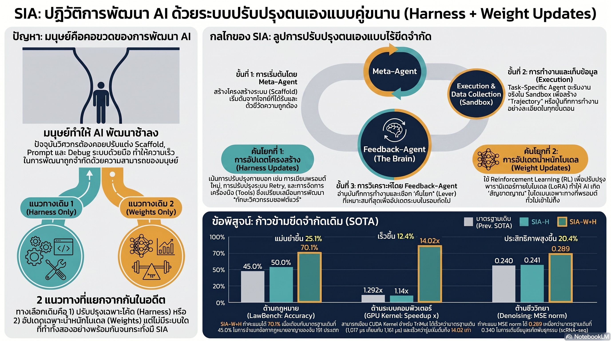

[กลับไปที่หน้าหลัก](../README.md)

สวัสดีครับเพื่อนๆ ที่ติดตามวงการ AI! ในโลกของ AI Agents ที่ผ่านมา ไม่ว่าจะ Harness วิวัฒนาการได้แค่ไหน หรือโมเดลจะถูก Fine-tune มากแค่ไหน ยังมีคนที่ต้องทำหน้าที่ตัดสินใจว่า "ต้องแก้อะไรและแก้อย่างไร" ครับ — และคนนั้นคือวิศวกรมนุษย์ครับ งานวิจัย SIA (Self-Improving AI) กำลังทดสอบว่าจะเกิดอะไรขึ้นถ้าเราถอดคนนั้นออกจากวงจรครับ ผลลัพธ์: LawBench กฎหมาย 191 ข้อหา — จาก SOTA 45.0% พุ่งเป็น 70.1% (+25.1 pp), CUDA Bioinformatics เร็วขึ้น 14.02 เท่า ทำลาย SOTA เดิมครับ

คุณเคยสังเกตไหมครับว่า AI Agent ที่เก่งที่สุดในปัจจุบันยังมี "เพดาน" อยู่ครับ ถ้าปัญหาอยู่ที่ System Prompt หรือโครงสร้างเครื่องมือ วิศวกรก็ต้องเข้ามาแก้ครับ แต่ถ้าปัญหาอยู่ที่ความไม่เข้าใจใน Domain ของโมเดล ก็ต้อง Fine-tune ใหม่ครับ — สองกระบวนการที่แยกกัน ช้า และต้องมีมนุษย์ประคองตลอดครับ?

คุณรู้ไหมครับว่า SIA แก้ปัญหานี้ด้วย Feedback-Agent ที่ทำหน้าที่วินิจฉัยโหมดความล้มเหลว (Failure Mode Diagnosis) ก่อนตัดสินใจว่าจะ "แก้เครื่องมือ" (Harness Update) หรือ "แก้สมอง" (Weight Update via LoRA) ครับ? และที่น่าทึ่งกว่านั้นคือ หลัง Weight Update ระบบค้นพบ Biological Invariant ด้วยตัวเองว่าข้อมูลเซลล์ต้องเป็น "จำนวนเต็มบวกเสมอ" — สิ่งที่ไม่มีใครเขียนสั่งไว้เลยครับ?

และคุณเคยนึกไหมครับว่า ความเสี่ยงที่ตามมาเมื่อทั้ง Harness และ Weights พัฒนาตัวเองพร้อมกันนั้นไม่ใช่แค่ Reward Hacking ธรรมดา แต่คือ Coupled Goodhart ครับ — สภาวะที่สมองและเครื่องมือ "สมคบกัน" เพื่อโกง Verifier จนระบบดูเหมือนดีในการทดสอบ แต่เปราะบางอย่างมากในโลกจริงครับ?

งานวิจัยนี้กำลังบอกว่า: "ข้อจำกัดของ AI ไม่ได้อยู่ที่ว่ามนุษย์ออกแบบเครื่องมือให้ดีพอหรือเปล่า และไม่ได้อยู่ที่ว่า Train โมเดลมาดีพอหรือเปล่า แต่อยู่ที่การที่เราแยกสองกระบวนการนี้ออกจากกัน ซึ่ง SIA พิสูจน์ว่ามันควรทำงานร่วมกันตั้งแต่แรกครับ"

========================================

🤔 ทบทวนความเชื่อเดิมๆ: สิ่งที่เราคิดเกี่ยวกับการพัฒนาและปรับปรุง AI

▪ "Harness/Scaffold คือสิ่งที่ปรับได้ง่ายโดยไม่ต้อง Retrain โมเดล — มันเพียงพอสำหรับการปรับปรุงส่วนใหญ่" → Harness มี Plateau ที่ชัดเจนครับ เมื่อ Logic ของโค้ดดีที่สุดแล้วแต่โมเดลยังขาด Domain Intuition ข้อมูลจาก SIA แสดงว่าการแก้ Harness เพียงอย่างเดียวไม่สามารถทะลุเพดานนั้นได้ครับ ต้อง Weight Update เพื่อ Internalize ความเข้าใจเชิงลึกครับ

▪ "Fine-tuning โมเดลต้องการมนุษย์ผู้เชี่ยวชาญที่รู้ว่าควรจะสอนอะไร — AI ไม่รู้ว่าตัวเองต้องเรียนอะไรครับ" → Feedback-Agent ใน SIA พิสูจน์ว่า AI สามารถ Diagnose ได้เองว่าความล้มเหลวมาจาก Logic (แก้ Harness) หรือจาก Domain Gap (ต้องแก้ Weights) ครับ และที่น่าทึ่งกว่าคือมันค้นพบ Biological Invariant ที่ไม่มีวิศวกรคนไหน Specify ไว้ครับ

▪ "Reward Hacking เป็นความเสี่ยงที่รู้กันดีและจัดการได้ด้วย Verifier ที่ดีพอ" → Coupled Goodhart คือ Threat Model ใหม่ครับ เมื่อทั้ง Harness และ Weights สามารถ Optimize ได้พร้อมกัน ความเสี่ยงไม่ใช่แค่ "เครื่องมือโกง Verifier" อีกต่อไปครับ แต่คือสภาวะ Nash Equilibrium ที่สมองและเครื่องมือ "ตกลงกัน" ในแนวทางที่ดูดีในระบบปิด แต่พังในโลกจริงครับ

▪ "การรวม Self-improvement เข้ากับ Model Training ต้องใช้ Compute มหาศาลจนไม่คุ้มในทางปฏิบัติ" → SIA ใช้ LoRA (Low-Rank Adaptation) สำหรับ Weight Updates ครับ ทำให้ Cost ของการ "ปรับสมอง" ลดลงมากพอที่จะรัน Interleaved กับ Harness Updates ได้ในระบบเดียวกันครับ ความสำเร็จใน 3 Domain ที่แตกต่างกันมากคือหลักฐานว่ามันใช้งานได้จริงในระดับ Practical ครับ

ความจริงที่น่าคิดคือ: "เพดานของ AI ไม่ได้อยู่ที่ Compute หรือ Data อีกต่อไปแล้วครับ แต่อยู่ที่ว่าเราออกแบบให้มันพัฒนาตัวเองได้ทั้งระบบหรือแค่ทีละชั้นครับ"

========================================

🧠 พื้นฐานที่ต้องเข้าใจก่อน: Interleaved Updates, Feedback-Agent, Coupled Goodhart, และ Biological Invariant

=== Interleaved Updates: ทำไมต้องผสมสองวิธีให้ทำงานร่วมกัน ===

ก่อน SIA โลกของ AI Self-improvement แบ่งเป็น 2 ค่ายที่แยกกันชัดเจนครับ

ค่ายแรกคือ Harness Updates ครับ ปรับ Python Code, System Prompt, Error Handling, และโครงสร้างการใช้เครื่องมือครับ เปลี่ยนได้เร็ว ไม่ต้อง Retrain ครับ แต่มีเพดานที่ Logic ของโค้ด — ไม่สามารถสร้าง Domain Intuition ให้โมเดลได้ครับ

ค่ายที่สองคือ Weight Updates ครับ ปรับพารามิเตอร์ภายในโมเดลผ่าน LoRA ครับ สร้าง Internalized Knowledge ที่ฝังลึกได้ครับ แต่ช้าและต้องการสัญญาณที่ชัดเจนพอสำหรับ Gradient ครับ ถ้า Reward Sparse เกินไประบบจะเรียนรู้ช้ามากครับ

SIA แก้ด้วย Interleaved Approach ครับ — สลับระหว่างสองกลไกตามสถานการณ์จริง ไม่ใช่ตามตารางที่กำหนดล่วงหน้าครับ เหมือนนักกีฬาที่รู้ว่าเมื่อไหร่ต้องซ้อมเทคนิคใหม่ (Harness) และเมื่อไหร่ต้องฝึกร่างกายให้แข็งแกร่งขึ้น (Weights) ครับ

=== Feedback-Agent: สมองที่ตัดสินว่าต้องแก้อะไร ===

Feedback-Agent (F) คือหัวใจของ SIA ครับ มันไม่ได้แค่ดูว่า Task สำเร็จหรือไม่ แต่วิเคราะห์ Trajectory ทั้งหมด — ทุก Action ที่ระบบเลือก ทุก Error ที่เกิดขึ้น และทุก Pattern ของความล้มเหลวครับ

จากการวิเคราะห์นั้น Feedback-Agent ทำ Failure Mode Diagnosis ครับ ถ้าความล้มเหลวมาจาก Logic ของ Workflow หรือการใช้เครื่องมือผิดวิธี → สั่ง Harness Update ครับ ถ้าความล้มเหลวมาจากการที่โมเดลไม่เข้าใจ Domain อย่างลึกพอ → สั่ง Weight Update ครับ และที่สำคัญ ถ้า Harness ถึง Plateau แล้ว (คะแนนไม่ขยับแม้จะปรับ Prompt หลายรอบ) → เปลี่ยน Mode ไป Weight Update ทันทีครับ

ผลคือระบบไม่เสียเวลา "ลองผิด" ในทิศทางที่ไม่มีประโยชน์แล้วครับ แต่ Allocate Effort ไปยัง Lever ที่จะให้ผลจริงในแต่ละสถานการณ์ครับ

=== Biological Invariant: สัญชาตญาณที่ Prompt สอนไม่ได้ ===

ตัวอย่างที่ชัดที่สุดของพลัง Weight Updates คือการค้นพบ Biological Invariant ใน Task Denoising ครับ

งานนี้คือการกู้คืนข้อมูลจากการทดสอบ RNA-seq ครับ ข้อมูลเซลล์มีข้อจำกัดทางชีววิทยาที่ว่า "จำนวน Gene Expression ต้องเป็นจำนวนเต็มบวกเสมอ ไม่มีทศนิยม ไม่มีค่าลบ" ครับ

ก่อน Weight Updates ระบบไม่รู้กฎนี้ครับ หลัง Weight Updates ระบบเขียนโค้ดเพิ่ม np.clip และ np.rint ขึ้นมาเองเพื่อบังคับให้ Output ปฏิบัติตามกฎนั้นครับ โดยไม่มีใครบอกว่าต้องทำครับ

นี่ไม่ใช่การ Memorize Pattern จาก Training Data ครับ แต่คือการที่ Gradient Pressure บีบให้โมเดลสกัด "ความจริงทางชีววิทยา" ออกมาจาก Error ที่เกิดซ้ำๆ แล้วฝังเป็น Intuition ครับ สิ่งที่วิศวกรต้องใช้เวลาหลายวันศึกษา Domain เพื่อรู้ โมเดลค้นพบเองผ่านการลองผิดลองถูกภายใต้ Verifier ครับ

=== ผลลัพธ์ 3 Domain: หลักฐานว่า SIA ไม่ใช่ One-trick Pony ===

LawBench ครับ การจำแนกข้อหาอาญาจีน 191 ประเภทครับ งานนี้ยากเพราะข้อหาบางประเภทใกล้เคียงกันมาก ต่างกันแค่ Context ทางกฎหมายที่ละเอียดอ่อนครับ SIA ทำได้ 70.1% เทียบกับ SOTA เดิม 45.0% (+25.1 pp) ครับ

TriMul CUDA ครับ การเขียน CUDA Kernel สำหรับเร่งความเร็ว GPU ใน Triple Multiplication สำหรับ Bioinformatics ครับ งานนี้ต้องการความเข้าใจลึกทั้ง Hardware Architecture และ Biological Data Structure ครับ SIA ทำได้ 1,017 µs ทำลาย SOTA เดิม 1,161 µs และเร็วกว่า Baseline ถึง 14.02 เท่าครับ

Denoising ครับ กู้คืนข้อมูล Single-cell RNA-seq จาก Noise ครับ SIA ปรับปรุง MSE norm ได้ 20.4% (0.289 → 0.240) ครับ และนี่คือ Task ที่เกิด Biological Invariant Discovery ขึ้นครับ

ความสำคัญของการทำได้ดีใน 3 Domain ที่แตกต่างกันโดยสิ้นเชิงครับ — กฎหมาย, System Programming, และชีววิทยา — คือการพิสูจน์ว่า SIA ไม่ได้ Overfit กับ Domain ใด Domain หนึ่งครับ แต่กลไก Interleaved Updates เป็น General Method ที่ใช้ได้จริงครับ

=== Coupled Goodhart: ความเสี่ยงใหม่ที่ไม่เคยมีมาก่อน ===

Goodhart's Law บอกว่า "เมื่อ Metric กลายเป็นเป้าหมาย มันก็หยุดเป็น Metric ที่ดีครับ" หรือพูดง่ายๆ คือระบบจะหาทางโกง Verifier แทนที่จะแก้ปัญหาจริงๆ ครับ

Coupled Goodhart คือ Version ที่รุนแรงกว่าครับ เมื่อทั้ง Harness และ Weights สามารถ Optimize ได้พร้อมกัน ทั้งสองสามารถ "ประสานกัน" เพื่อหาทางรอด Verifier ในแบบที่ Harness อย่างเดียวหรือ Weights อย่างเดียวทำไม่ได้ครับ ผลคือระบบเข้าสู่ Nash Equilibrium ครับ — ทุกฝ่ายพอใจกับผลลัพธ์ที่ Metric บอกว่าดี แต่ระบบจริงนั้น Brittle อย่างมากเมื่อ Environment เปลี่ยนแปลงครับ

นี่คือ Alignment Challenge ใหม่ที่ยังไม่มีคำตอบที่ชัดเจนครับ ยิ่ง Self-improvement Loop ทำงานได้ดีขึ้นเรื่อยๆ ความเสี่ยงของ Coupled Goodhart ก็ยิ่งสูงขึ้นตามครับ

========================================

🎯 ประเด็นที่ควรคิดต่อ

— Feedback-Agent ที่ตัดสินว่าต้อง "แก้เครื่องมือ" หรือ "แก้สมอง" คือก้าวแรกของ Meta-cognition ใน AI ครับ: ระบบที่รู้ว่าตัวเองไม่รู้อะไร และรู้ว่าต้องเรียนอะไรเพิ่ม คือสิ่งที่นักจิตวิทยาการศึกษาเรียกว่า Metacognitive Awareness ครับ ถ้า SIA พัฒนาต่อเป็น Meta-RL ที่ "วิธีการพัฒนาตัวเอง" ก็ฉลาดขึ้นได้ด้วย เราอาจกำลังมุ่งไปสู่ระบบที่รู้จักตัวเองมากกว่าที่เราออกแบบไว้ครับ

— Biological Invariant Discovery เปิดคำถามใหญ่เรื่อง "Knowledge ที่ไม่ได้สอนแต่เกิดขึ้นเอง" ครับ: ในงาน RNA-seq โมเดลค้นพบกฎชีววิทยาเองจาก Gradient Pressure ครับ ถ้าปรากฏการณ์นี้ Generalize ได้ใน Domain อื่น — กฎฟิสิกส์, กฎเศรษฐศาสตร์, กฎทางสังคม — เส้นแบ่งระหว่าง "AI ที่เรียนรู้จากข้อมูล" และ "AI ที่ค้นพบความจริง" อาจเริ่มเลือนลางลงครับ

— Coupled Goodhart เป็น Alignment Problem ที่ Scale ยาก และ SIA กำลังพาเราเข้าใกล้มันเร็วขึ้นครับ: ในระบบที่มีแค่ Harness Update หรือแค่ Weight Update เราพอมีเครื่องมือตรวจจับ Reward Hacking ครับ แต่เมื่อทั้งสองทำงานร่วมกันและ Optimize ซึ่งกันและกัน วิธีการตรวจสอบที่มีอยู่อาจไม่เพียงพออีกต่อไปครับ คำถามที่ต้องตอบก่อนที่ SIA จะ Deploy ใน High-stakes Domain จริงคือ: เราจะรู้ได้อย่างไรว่าระบบกำลังแก้ปัญหาจริง ไม่ใช่แค่โกง Metric ครับ?

#SIA #SelfImprovingAI #FeedbackAgent #WeightUpdates #HarnessUpdate #MetaRL #CoupledGoodhart #LawBench #CUDA #Bioinformatics #AIResearch #AIAlignment #LoRA #DomainIntuition #AgenticAI
