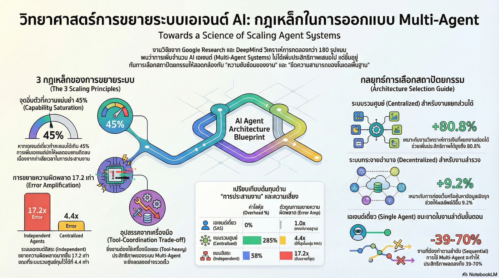

[กลับไปที่หน้าหลัก](../README.md)

# สวัสดีครับเพื่อนๆ นักพัฒนา AI! วันนี้เรามาทำความเข้าใจเรื่อง "วิทยาศาสตร์การขยายระบบ AI Agent" กันครับ

หลังจากที่โลก AI ได้เห็นการพัฒนาของ AI Agent ที่สามารถทำงานได้หลากหลายขึ้นเรื่อยๆ ไม่ว่าจะเป็นการเขียนโค้ด การวิเคราะห์ข้อมูล หรือแม้แต่การเล่นเกม ความเชื่อที่กำลังเป็นกระแสหลักในตอนนี้ก็คือ **"ยิ่งมี Agent เยอะ ยิ่งทำงานได้ดี"** หรือที่เรียกกันว่า "More agents is all you need"

แต่... จริงหรือครับ? 🤔

งานวิจัยล่าสุดจากความร่วมมือระหว่าง **Google Research, Google DeepMind และ MIT** ที่ชื่อว่า "Towards a Science of Scaling Agent Systems" ได้ทำการทดลองกับโมเดลระดับท็อปอย่าง GPT-5, Gemini 2.5 Pro และ Claude 4.5 แล้วพบสิ่งที่น่าตกใจ นั่นก็คือ **การเพิ่ม Agent ไม่ได้ทำให้ระบบทำงานได้ดีขึ้นเสมอไป!** บางครั้งกลับทำให้แย่ลงอีกด้วยซ้ำ

วันนี้เรามาดูกันว่า งานวิจัยนี้ค้นพบอะไรบ้าง และเราจะเอาไปใช้ในการออกแบบระบบ AI Agent ของเราได้อย่างไร

## ทบทวนความเชื่อเดิมๆ: ทำไมเราถึงคิดว่ายิ่งเยอะยิ่งดี?

ก่อนที่เราจะไปดูผลการวิจัย มาทบทวนกันก่อนว่าทำไมเราถึงคิดว่าการมี Agent หลายตัวน่าจะดีกว่า:

1. **แบ่งงานกันทำ**: เหมือนทีมคน ถ้ามีหลายคน ก็แบ่งงานกันทำได้เร็วกว่าคนเดียว
2. **มีความเชี่ยวชาญหลากหลาย**: แต่ละ Agent เก่งคนละด้าน รวมกันก็ครอบคลุมได้หมด
3. **ตรวจสอบกันและกัน**: หลายตัวช่วยกันคิด ช่วยกันตรวจ ผลลัพธ์น่าจะถูกต้องกว่า

ฟังดูสมเหตุสมผลใช่ไหมครับ? แต่ความจริงมันซับซ้อนกว่านั้นเยอะเลย!

---

## 1. จุดอิ่มตัวที่ 45%: เมื่อ Agent ตัวเดียวเก่งพอ ทีมก็ไม่จำเป็นแล้ว

ผลการวิจัยที่น่าสนใจที่สุดชิ้นหนึ่งคือการค้นพบ **"Capability Saturation"** หรือ "จุดอิ่มตัวของความสามารถ" ครับ

### Capability Saturation คืออะไร?

ง่ายๆ เลยครับ คือจุดที่ Agent ตัวเดียวเก่งพอที่จะทำงานสำเร็จได้ด้วยตัวเองแล้ว การเพิ่ม Agent เข้าไปก็ไม่ได้ช่วยให้ดีขึ้น แต่กลับทำให้แย่ลงเสียอีก!

**ตัวเลขสำคัญ:** งานวิจัยพบว่าเมื่อ Single-Agent (Agent ตัวเดียว) สามารถทำงานสำเร็จได้มากกว่า **45%** การเพิ่ม Agent เข้าไปในระบบจะเริ่มให้ผลตอบแทนที่เป็น**ลบ** (Negative Returns) ทันที!

จากข้อมูลทางสถิติ: β = -0.404, p < 0.001 (ยิ่งเพิ่ม Agent ประสิทธิภาพยิ่งลดลง อย่างมีนัยสำคัญทางสถิติ)

### ทำไมถึงเป็นแบบนี้?

สาเหตุหลักมาจาก **"Coordination Tax"** หรือ "ค่าธรรมเนียมการประสานงาน" ครับ

ลองนึกภาพว่าคุณมีโปรเจกต์เล็กๆ ที่คนเดียวทำได้ภายใน 2 ชั่วโมง ถ้าคุณเอาคน 3 คนมาช่วย:

* ต้องประชุมก่อนว่าใครทำอะไร (เสียเวลา 30 นาที)
* ต้องสื่อสารกันระหว่างทำงาน (เสียเวลาอีก 30 นาที)
* ต้องรวมงานให้เข้ากันได้ (เสียเวลาอีก 30 นาที)

รวมแล้วอาจจะใช้เวลา 2.5-3 ชั่วโมงเลย! ช้ากว่าคนเดียวทำอีก

**กับ AI Agent ก็เหมือนกันครับ:**

* Agent แต่ละตัวต้องส่งข้อความถึงกัน (กิน Token)
* ต้องเข้าใจว่า Agent อื่นทำอะไรไปบ้างแล้ว (กิน Token อีก)
* อาจจะเข้าใจผิด หรือทำงานซ้ำซ้อนกัน (กิน Token และทำผิดอีก)

ยิ่งโมเดลพื้นฐาน (Base Model) เก่งขึ้นเท่าไหร่ การปล่อยให้มันทำคนเดียวก็ยิ่งได้ผลดีกว่า!

### ตัวอย่างจากการทดลอง:

ทดสอบกับโมเดล GPT-5 และ Gemini 2.5 พบว่า:
* **ก่อนถึง 45%**: การเพิ่ม Agent ช่วยได้ เพราะตัวเดียวยังทำไม่ค่อยได้
* **หลังผ่าน 45%**: การเพิ่ม Agent กลับทำให้แย่ลง เพราะต้นทุนการประสานงานสูงกว่าประโยชน์ที่ได้

**บทเรียน:** ถ้า Agent ตัวเดียวทำได้ดีพออยู่แล้ว อย่าเพิ่ง Agent เพื่อนเข้าไป มันอาจจะไปรบกวนมากกว่า!

---

## 2. ปัญหาข้อมูลกระจัดกระจาย: ต้นทุนแฝงจากการใช้เครื่องมือ

ในงานที่ต้องใช้เครื่องมือเยอะๆ (Tool-heavy tasks) เช่น การเขียนโปรแกรม การวิเคราะห์ข้อมูล ปัญหาเรื่อง **"Information Fragmentation"** หรือ "ข้อมูลกระจัดกระจาย" จะเด่นชัดมากครับ

### เกิดอะไรขึ้น?

**Single-Agent System (SAS):**
* Agent ตัวเดียวเห็นประวัติการทำงานทั้งหมด (Context Integration)
* รู้ว่าเครื่องมือไหนเคยใช้ไปแล้ว ได้ผลอย่างไร
* สามารถตัดสินใจต่อได้เลยโดยไม่ต้องหาข้อมูลเพิ่ม

**Multi-Agent System (MAS):**
* งบประมาณ Token ถูกแบ่งย่อยไปตาม Agent แต่ละตัว
* Agent A ใช้เครื่องมือบางอย่าง แต่ Agent B ไม่รู้
* ต้องเสียเวลาส่งข้อมูลกันไปกันมา (กิน Token อีกเยอะ)
* ไม่มี Agent ตัวไหนเห็น "ภาพรวม" ได้เต็มที่

### ตัวเลขจากงานวิจัย:

ในสภาพแวดล้อมที่มีเครื่องมือจำนวนมาก ประสิทธิภาพของ Multi-Agent ลดลง **β = -0.267, p < 0.001** (อย่างมีนัยสำคัญ)

### เปรียบเทียบกับโลกจริง:

ลองนึกภาพว่าคุณกำลังซ่อมรถ:

**คนเดียว:**
* รู้ว่าเพิ่งใช้เครื่องมืออะไรไป
* รู้ว่าสกรูตัวไหนอยู่ที่ไหน
* ทำงานได้ต่อเนื่องไม่สะดุด

**ทีมหลายคน (แบบไม่มีการสื่อสารที่ดี):**
* คนที่ 1: "เฮ้ สกรูตัวนี้อยู่ไหน?"
* คนที่ 2: "ไม่รู้ เพิ่งเห็นหรือเปล่า?"
* คนที่ 3: "อืม... เดี๋ยวหาให้"
* (เสียเวลาสื่อสารเยอะ งานช้าลง)

**บทเรียน:** ในงานที่ต้องใช้เครื่องมือเยอะและต่อเนื่อง Agent ตัวเดียวที่มี Context เต็มๆ มักจะทำงานได้ดีกว่าทีมที่ข้อมูลกระจัดกระจาย!

---

## 3. งานแบบลำดับ vs งานแบบขนาน: ทำไม Multi-Agent ถึงเก่งในการวิเคราะห์การเงิน แต่แพ้ใน Minecraft?

นี่เป็นส่วนที่น่าสนใจมากๆ ครับ! งานวิจัยพบว่าประเภทของงาน (Task Type) มีผลอย่างมากต่อความเหมาะสมของ Multi-Agent System

### งานแบบขนาน (Parallel Tasks)

**ตัวอย่าง: Finance-Agent (การวิเคราะห์การเงิน)**

สมมติว่าต้องวิเคราะห์งบการเงินของ 10 บริษัท:
* Agent 1: วิเคราะห์บริษัท A, B, C
* Agent 2: วิเคราะห์บริษัท D, E, F
* Agent 3: วิเคราะห์บริษัท G, H, I, J
* Agent หลัก: รวบรวมผลและสรุป

**ผลลัพธ์:** Multi-Agent ทำได้ดีกว่า **+80.8%** เพราะ:
* งานแต่ละชิ้นเป็นอิสระต่อกัน (บริษัท A ไม่เกี่ยวกับบริษัท B)
* ทำพร้อมกันได้ เร็วกว่า
* รวมผลง่าย ไม่ซับซ้อน

### งานแบบลำดับ (Sequential Tasks)

**ตัวอย่าง: PlanCraft/Minecraft (การวางแผนใน Minecraft)**

สมมติว่าต้องสร้าง "Diorite Wall" (กำแพงหินชนิดหนึ่ง):

**วิธีที่ถูก (Single-Agent):**
1. ดูสูตรคราฟต์ (ต้องใช้ Cobblestone 2 + Quartz 2)
2. เช็คของในคลัง (มี Cobblestone 10, Quartz 5)
3. คราฟต์ได้เลย!

**วิธีที่ผิด (Multi-Agent แบบแยกงานมากเกินไป):**
1. Agent A: "ฉันจะไปดูสูตรนะ"
2. Agent B: "ฉันจะไปเช็คของในคลังนะ"
3. Agent C: "ฉันจะไปลงมือทำนะ"
4. Agent A ส่งข้อมูลให้ B และ C (กิน Token)
5. Agent B ส่งข้อมูลให้ A และ C (กิน Token อีก)
6. Agent C รอข้อมูลจาก A กับ B (เสียเวลา)
7. ... (สับสนและซับซ้อนโดยใช่เหตุ)

**ผลลัพธ์:** Multi-Agent ทำได้แย่กว่า **-39% ถึง -70%!**

### ทำไมถึงเป็นแบบนี้?

ปัญหาหลักคือ **"Unnecessary Decomposition"** หรือ "การย่อยงานที่ไม่จำเป็น" ครับ

ในงานที่แต่ละขั้นตอนต้องรอผลจากขั้นก่อนหน้า การแยก Agent กลับทำให้:
* ต้องส่งข้อความกันไปกันมา (ช้า)
* อาจจะเข้าใจผิด (ผิดพลาด)
* State (สถานะ) ของงานซับซ้อนขึ้นโดยใช่เหตุ

**บทเรียน:** ถ้างานนั้นต้องทำตามลำดับ (ขั้นที่ 2 ต้องรอขั้นที่ 1 เสร็จก่อน) ให้ Agent ตัวเดียวทำดีกว่า! แต่ถ้างานแยกเป็นชิ้นๆ ทำพร้อมกันได้ Multi-Agent ถึงจะมีประโยชน์!

---

## 4. การขยายความผิดพลาด: สถาปัตยกรรมสำคัญกว่าที่คิด!

ถ้าเราจำเป็นต้องใช้ Multi-Agent จริงๆ สิ่งสำคัญคือเราต้องเลือก **"โครงสร้างการสื่อสาร" (Topology)** ให้ถูก เพราะมันส่งผลต่อการควบคุมความผิดพลาดอย่างมาก!

### ปัญหา: Error Amplification (การขยายความผิดพลาด)

เมื่อมี Agent หลายตัว ถ้า Agent หนึ่งทำผิด Agent อื่นอาจจะเชื่อและทำตามผิดด้วย ทำให้ความผิดพลาด "ขยายตัว" เป็นทอดๆ

### สถาปัตยกรรม 3 แบบ:

#### 1. Independent (ไร้ผู้คุม)

**โครงสร้าง:** Agent แต่ละตัวทำงานอิสระ แล้วส่งผลมารวมกัน ไม่มีการตรวจสอบ

```
Agent A → ผลลัพธ์ A ↘
Agent B → ผลลัพธ์ B → รวมผล
Agent C → ผลลัพธ์ C ↗
```

**ปัญหา:** ความผิดพลาดขยายตัวสูงถึง **17.2 เท่า!** เพราะ:
* ไม่มีการตรวจสอบ
* ถ้า Agent หนึ่งผิด ก็ผิดไปเลย
* ผลลัพธ์ที่รวมกันอาจจะผิดไปหมด

**เหมาะกับ:** งานที่แน่นอนมาก ไม่มีความคลุมเครือ (แต่น้อยมาก)

#### 2. Centralized (มีผู้ออร์เคสเตรต)

**โครงสร้าง:** มี Agent ตัวกลาง (Orchestrator) ที่คอยควบคุมและตรวจสอบ

```
        Orchestrator
       /      |      \
   Agent A  Agent B  Agent C
       \      |      /
        Orchestrator (ตรวจสอบ)
```

**ข้อดี:** ความผิดพลาดลดลงเหลือ **4.4 เท่า** เพราะ:
* Orchestrator ทำหน้าที่ "Validation Bottleneck" (จุดคัดกรอง)
* ตรวจสอบตรรกะก่อนส่งต่อ
* จับความผิดพลาดได้ก่อนที่จะขยายตัว

**เหมาะกับ:** งานที่ต้องการควบคุมและตรวจสอบ เช่น การเขียนโค้ด การวิเคราะห์ข้อมูลสำคัญ

#### 3. Decentralized (การดีเบต)

**โครงสร้าง:** Agent คุยกันเอง โต้แย้งกัน ทำนองประชาธิปไตย

```
Agent A ←→ Agent B
    ↕         ↕
Agent C ←→ Agent D
```

**ข้อดี:** เพิ่มประสิทธิภาพได้ราว **+9.2%** เพราะ:
* มีการโต้แย้งและคัดกรอง (Debate)
* มุมมองหลากหลาย
* ค้นหาคำตอบที่ดีที่สุดจากการถกเถียง

**เหมาะกับ:** งานที่มีความคลุมเครือสูง (High-entropy) เช่น:
* การท่องเว็บ (Web Navigation)
* งานที่มีคำตอบได้หลายแบบ
* งานสร้างสรรค์

### บทเรียน:

**ถ้าต้องใช้ Multi-Agent จริงๆ ให้เลือกสถาปัตยกรรมให้ถูก!**

* งานที่ต้องการความแม่นยำสูง → **Centralized**
* งานที่ต้องการความคิดสร้างสรรค์ → **Decentralized**
* งานที่แน่นอนมากและแยกกันได้ชัดเจน → **Independent** (ใช้ระวังๆ)

---

## 5. กฎทองของการเลือกสถาปัตยกรรม: Decomposability

บทเรียนสุดท้ายและสำคัญที่สุดครับ นั่นก็คือ **"ความสำเร็จไม่ได้ขึ้นอยู่กับจำนวน Agent แต่ขึ้นอยู่กับความสามารถในการแยกส่วนของงาน"** (Decomposability)

### Decomposability คืออะไร?

ง่ายๆ เลยครับ คือ "งานนี้แยกเป็นส่วนๆ ได้หรือเปล่า? แยกแล้วแต่ละส่วนเป็นอิสระกันไหม?"

**งานที่ Decomposable (แยกได้ดี):**
* การวิเคราะห์การเงินหลายบริษัท (แต่ละบริษัทเป็นอิสระ)
* การแปลเอกสารหลายภาษา (แต่ละภาษาเป็นอิสระ)
* การทดสอบโค้ดหลายฟีเจอร์ (แต่ละฟีเจอร์เป็นอิสระ)

**งานที่ Non-decomposable (แยกไม่ได้):**
* การวางแพลนสร้างบ้านใน Minecraft (ทุกขั้นต้องเรียงต่อกัน)
* การเขียนนิยายต่อเนื่อง (ตอนที่ 2 ต้องอิงตอนที่ 1)
* การแก้บั๊กที่มีสาเหตุซับซ้อน (ต้องเข้าใจทั้งระบบ)

### การทำนายด้วยคุณสมบัติของงาน

งานวิจัยพบว่า เราสามารถใช้คุณสมบัติของงานมาทำนายสถาปัตยกรรมที่เหมาะสมได้แม่นยำถึง **87%!**

**กฎทองคำ:**

1. **ถ้างาน Sequential (ต้องทำตามลำดับ):**
   * → ใช้ **Single-Agent**
   * ตัวอย่าง: การแก้บั๊ก, การวางแพลนซับซ้อน

2. **ถ้างาน Parallel และแยกส่วนได้ชัดเจน:**
   * → ใช้ **Centralized Multi-Agent**
   * ตัวอย่าง: การวิเคราะห์ข้อมูลหลายแหล่ง

3. **ถ้างานมีความคลุมเครือสูงและมีคำตอบได้หลายแบบ:**
   * → ใช้ **Decentralized Multi-Agent**
   * ตัวอย่าง: การค้นหาข้อมูล, งานสร้างสรรค์

### ตารางสรุป:

| ประเภทงาน | ลักษณะ | สถาปัตยกรรมที่เหมาะสม |
|-----------|--------|----------------------|
| Sequential | ทำตามลำดับ ขั้นต่อไปรอขั้นก่อน | Single-Agent |
| Parallel Independent | แยกชิ้นเป็นอิสระได้ชัดเจน | Centralized Multi-Agent |
| Exploratory | คลุมเครือ มีทางเลือกเยอะ | Decentralized Multi-Agent |

---

## สรุป: จากความเชื่อสู่วิทยาศาสตร์

หลังจากที่เราได้เห็นผลการวิจัยแล้ว เราก็จะพบว่าการออกแบบระบบ AI Agent ไม่ใช่เรื่องของ "สัญชาตญาณ" หรือ "ความรู้สึก" อีกต่อไป แต่เป็นเรื่องของ **"วิทยาศาสตร์"** ที่มีหลักการและสามารถทำนายได้ครับ!

### หลักฐานที่พิสูจน์ได้:

งานวิจัยได้ทดสอบกฎเหล่านี้กับโมเดล **GPT-5.2** (ที่ออกมาหลังจากการวิจัย) และพบว่าค่าความผิดพลาดเฉลี่ย (MAE) อยู่ที่เพียง **0.071** 

นี่แปลว่า "Scaling Laws" เหล่านี้สามารถทำนายผลลัพธ์ได้แม่นยำมากๆ แม้กับโมเดลรุ่นใหม่ล่าสุด!

### คำถามสำคัญสำหรับอนาคต:

ในวันที่โมเดลอย่าง GPT-5, Claude 4.5 หรือ Gemini 2.5 เก่งขึ้นเรื่อยๆ จนก้าวข้ามจุด 45% ในหลายๆ งาน คำถามที่เราต้องถามตัวเองไม่ใช่:

❌ **"เราจะสร้างทีม Agent ที่ใหญ่ขึ้นได้อย่างไร?"**

แต่เป็น:

✅ **"เราจะสื่อสารให้ฉลาดขึ้นภายใต้งบประมาณ Token ที่จำกัดได้อย่างไร?"**

✅ **"งานนี้จำเป็นต้องใช้หลาย Agent จริงหรือ?"**

✅ **"ถ้าต้องใช้หลาย Agent โครงสร้างไหนเหมาะสมที่สุด?"**

### บทเรียนสุดท้าย:

**บางครั้ง "หนึ่งเดียว" อาจทรงพลังกว่า "ทั้งทีม"** หากเราเข้าใจวิทยาศาสตร์เบื้องหลังการขยายระบบอย่างแท้จริง

การออกแบบ AI Agent System ที่ดีไม่ได้อยู่ที่การเพิ่มจำนวน แต่อยู่ที่:
* เข้าใจลักษณะของงาน
* เลือกสถาปัตยกรรมที่เหมาะสม
* ออกแบบการสื่อสารที่มีประสิทธิภาพ
* รู้จักเมื่อไหร่ควรใช้ Agent ตัวเดียวก็พอ

นี่คือยุคใหม่ของการออกแบบ AI Agent ครับ ยุคที่เราไม่ได้ทำตาม "ความรู้สึก" อีกต่อไป แต่ทำตาม "วิทยาศาสตร์" ที่พิสูจน์แล้วว่าได้ผลจริง! 🚀

---

**อ้างอิง:**
* "Towards a Science of Scaling Agent Systems" — Google Research, Google DeepMind & MIT
* ทดสอบกับ GPT-5, Gemini 2.5 Pro, Claude 4.5
* Out-of-sample validation บน GPT-5.2

