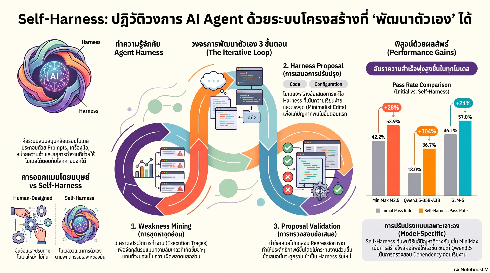

[กลับไปที่หน้าหลัก](../README.md)

สวัสดีครับเพื่อนๆ ที่ติดตามวงการ AI! เราเคยคุยเรื่อง HarnessX ที่ใช้ AEGIS Engine ขับเคลื่อนการวิวัฒนาการของ Harness และต้องการ Feedback-agent แยก แต่วันนี้มา Self-Harness ซึ่งเป็นแนวคิดที่ Radical กว่าครับ — โมเดลตัวเดียวกันนั้นเองวินิจฉัยจุดอ่อนของตัวเอง เสนอการแก้ไข และทดสอบว่า Generalize ได้ไหม โดยไม่ต้องพึ่งโมเดลภายนอกเลยครับ ผลบน Terminal-Bench-2.0: Qwen3.5 +138% บน Held-in tasks, MiniMax M2.5 จาก 40.5% → 61.9% บน Held-out tasks ครับ

คุณเคยสังเกตไหมครับว่า AI Agent ที่ล้มเหลวส่วนใหญ่ไม่ได้ล้มเหลวเพราะโมเดลไม่ฉลาดพอครับ แต่ล้มเหลวเพราะ Harness รอบๆ โมเดลไม่เข้ากับพฤติกรรมเฉพาะตัวของโมเดลนั้นครับ — บางโมเดลชอบสำรวจมากเกินไปจนวนลูป บางโมเดลสับสนกับ Structured Output ครับ แต่ Harness ที่วิศวกรมนุษย์เขียนแบบ One-size-fits-all ไม่รู้ความแตกต่างนั้นเลยครับ?

คุณรู้ไหมครับว่า Self-Harness แก้ด้วยการให้โมเดลทำ Weakness Mining จาก Execution Traces ของตัวเองครับ ไม่ใช่แค่ดูว่า "Task สำเร็จหรือไม่" แต่จัดกลุ่มความล้มเหลวตาม Failure Signature เพื่อระบุว่าปัญหาอยู่ที่กลไกไหนของ Harness ก่อนจะเสนอ Minimal Modification ที่แก้จุดนั้นโดยไม่รื้อทั้งระบบครับ?

และคุณเคยนึกไหมครับว่า ผลการวิเคราะห์เชิงคุณภาพพบว่า Self-Harness ดึงลักษณะเฉพาะของโมเดลแต่ละรุ่นออกมาได้ครับ Qwen3.5 ถูก Steer ให้ตรวจ Dependency ก่อนเริ่มงาน, MiniMax M2.5 ให้สร้าง Output File เร็วขึ้นและจัดการ Structured Tool Output ระมัดระวังขึ้น, GLM-5 ให้รักษาสภาพแวดล้อมให้คงที่ครับ — Harness ที่ดีไม่ใช่ Harness กลางๆ แต่คือ Harness ที่รู้ว่าตัวเองกำลังห่อหุ้มโมเดลไหนอยู่ครับ?

งานวิจัยนี้กำลังบอกว่า: "ขีดจำกัดของ AI ไม่ได้อยู่ที่ว่าโมเดลฉลาดแค่ไหน แต่อยู่ที่ว่า Harness รอบๆ โมเดลเข้าใจพฤติกรรมเฉพาะตัวของมันดีแค่ไหนครับ และถ้าโมเดลออกแบบ Harness ของตัวเองได้ เราก็กำลังข้ามเส้นจาก Tool ไปสู่ Self-evolving System ครับ"

========================================

🤔 ทบทวนความเชื่อเดิมๆ: สิ่งที่เราคิดเกี่ยวกับการออกแบบ Harness และ AI Agent

▪ "Harness ที่ดีคือ System Prompt ที่ชัดเจนและ Tool Set ที่ครบครันครับ — วิศวกรที่เชี่ยวชาญเขียนครั้งเดียวใช้ได้นานครับ" → โมเดลแต่ละรุ่นมี Behavioral Fingerprint ที่ต่างกันครับ Harness กลางๆ ที่วิศวกรเขียนจาก Best Practice อาจ Mis-align กับพฤติกรรมจริงของโมเดลนั้นๆ ครับ Self-Harness ที่ดึงความล้มเหลวจาก Execution Traces ของโมเดลตัวนั้นโดยเฉพาะจะ Align ได้แม่นยำกว่าเสมอครับ

▪ "การปรับปรุง Harness ต้องการโมเดลที่เก่งกว่า (Meta-Harness) มาเป็นครู — โมเดลเดิมไม่มีทางวิเคราะห์จุดอ่อนของตัวเองได้" → Self-Harness พิสูจน์ว่าโมเดลตัวเดิมสามารถทำ Weakness Mining จาก Failure Signature ของตัวเองได้ครับ โดยไม่ต้องพึ่ง Teacher Model ครับ Qwen3.5 +138% บน Held-in tasks มาจากการที่โมเดลวิเคราะห์และแก้ไข Harness ของตัวเองล้วนๆ ครับ

▪ "การแก้ไข Harness ที่ดีต้องครอบคลุมและ Systematic — การแก้ทีละจุดเล็กๆ จะไม่ได้ผลเพียงพอ" → Harness Proposal Step ใน Self-Harness มีกฎเหล็กว่าต้องเสนอ Minimal Modification ครับ การรื้อ Harness ใหม่ทั้งหมดทำให้ส่วนที่ทำงานดีอยู่พังไปด้วยครับ (Systemic Collapse) ครับ Localized Fixes ที่ตรงกับ Failure Signature ให้ผลดีกว่าและปลอดภัยกว่าครับ

▪ "AI ที่ปรับปรุงตัวเองได้จะ Overfit กับ Training Cases และทำงานได้แย่ลงกับ Situation ใหม่ที่ไม่เคยเห็น" → Proposal Validation Step ทดสอบ Generalization บน Held-out Tasks เป็น Gate บังคับก่อน Deploy ทุกครั้งครับ MiniMax M2.5 ที่พุ่งจาก 40.5% → 61.9% บน Held-out tasks คือหลักฐานว่า Self-Harness ไม่แค่แก้ปัญหาเฉพาะหน้า แต่สร้างกฎที่ใช้ได้จริงในสถานการณ์ใหม่ครับ

ความจริงที่น่าคิดคือ: "โมเดลที่เก่งที่สุดไม่ใช่โมเดลที่มีพารามิเตอร์มากที่สุด แต่คือโมเดลที่รู้ว่าตัวเองล้มเหลวตรงไหนและแก้ไขได้ครับ"

========================================

🧠 พื้นฐานที่ต้องเข้าใจก่อน: Harness ในฐานะระบบ, สามกระบวนทัศน์, Self-Harness Loop, และ Behavioral Fingerprint

=== Harness ไม่ใช่แค่ System Prompt ===

คำว่า "Harness" ในงานวิจัยนี้ครอบคลุมกว้างกว่าที่นักพัฒนาส่วนใหญ่นึกถึงครับ มันคือระบบทั้งหมดที่ห่อหุ้มโมเดลไว้ครับ

System Prompts คือชั้นแรกที่เห็นได้ชัดครับ แต่มีอีกห้าชั้นที่ซ่อนอยู่ครับ Tools ชุดเครื่องมือที่โมเดลเรียกใช้ได้ครับ Runtime Mechanisms กลไกควบคุม Flow การทำงาน เช่น Timeout และ Retry Logic ครับ Verification Rules กฎตรวจสอบว่างานสำเร็จหรือไม่ครับ Orchestration Logic การประสานงานระหว่าง Sub-tasks ครับ และ Failure-recovery Procedures ขั้นตอนกู้คืนเมื่อเกิด Error ครับ

ทำไมจึงสำคัญที่ต้องรู้ว่า Harness กว้างแค่ไหนครับ เพราะปัญหาของ Agent ที่วนลูปหรือ Stall มักไม่ได้อยู่ที่ System Prompt แต่อยู่ที่ชั้นล่างลงไปครับ เช่น Failure-recovery ที่ไม่รู้จะทำอะไรเมื่อ Tool ตอบผิดรูปแบบครับ

=== สามกระบวนทัศน์ของการสร้าง Harness ===

Human Harness Engineering คือยุคแรกครับ วิศวกรนั่งเขียน System Prompt, กำหนด Tool Schema, และเขียน Recovery Logic ด้วยมือครับ ปัญหาคือช้า, ขยายผลยาก, และ Harness ที่ได้มักเป็น Generalist ที่ไม่ได้ปรับให้ตรงกับพฤติกรรมเฉพาะของโมเดลนั้นครับ

Meta-Harness คือการใช้โมเดลที่เก่งกว่า (เช่น GPT-4) วิเคราะห์ความล้มเหลวของโมเดลที่อ่อนกว่าและเขียน Harness ให้ครับ ดีกว่า Human แต่มีต้นทุนสูง ต้องเข้าถึงโมเดล Teacher ที่ดีกว่า และ Teacher อาจไม่เข้าใจ Behavior ของ Student ได้ดีเท่าตัว Student เองครับ

Self-Harness คือกระบวนทัศน์ที่สามครับ โมเดลตัวเดิมที่มีปัญหาเป็นผู้วินิจฉัยปัญหาและเสนอทางแก้เองครับ Self-contained ครับ ไม่ต้องพึ่ง External Teacher ครับ และรู้ Behavioral Fingerprint ของตัวเองดีที่สุดครับ

=== Self-Harness Loop: สามขั้นตอนที่เปลี่ยนความล้มเหลวเป็นการอัปเกรด ===

Weakness Mining ครับ ขั้นตอนแรกคือการไม่มองความผิดพลาดว่าเป็น "Task ล้มเหลว" แต่เป็นข้อมูลดิบครับ ระบบดึง Execution Traces ทั้งหมดออกมา แล้วจัดกลุ่มตาม Failure Signature ครับ เช่น "Loop ที่เกิดจาก Tool Output ไม่ตรง Format", "Stall ที่เกิดจาก Environment Variable หาย", หรือ "Infinite Exploration ที่ไม่มีเงื่อนไขหยุด" ครับ การกลุ่มตาม Pattern ทำให้ระบบรู้ว่าต้องแก้กลไกไหน ไม่ใช่เดาสุ่มครับ

Harness Proposal ครับ โมเดลสวมบทบาทเป็น Harness Designer และเสนอการแก้ไขครับ กฎเหล็กคือ Minimal Modification ครับ แก้เฉพาะจุดที่ Failure Signature ชี้ครับ ไม่รื้อ Harness ทั้งหมดแม้ว่าการรื้อใหม่อาจดูง่ายกว่าครับ เหตุผลคือ Systemic Collapse Risk ครับ — Harness ที่ทำงานดีในส่วนอื่นจะพังไปพร้อมกันด้วยถ้าเปลี่ยนมากเกินไปครับ

Proposal Validation ครับ ก่อน Deploy การแก้ไขใดๆ ต้องผ่าน Gate สองด่านครับ Regression Testing บน Tasks เดิมว่าไม่แย่ลง และ Generalization Test บน Held-out Tasks ที่ไม่เคยเห็นว่าดีขึ้นจริงครับ Gate ที่สองนี้คือหัวใจที่แยก Self-Harness ออกจากการ Overfit ครับ ถ้า Proposal ผ่านแค่ Task เดิมแต่ไม่ Generalize → ปฏิเสธครับ ต้อง Generalize ได้จึงจะ Deploy ครับ

=== Behavioral Fingerprint: ทำไม Self-Harness ถึงรู้จักโมเดลดีกว่ามนุษย์ ===

การวิเคราะห์เชิงคุณภาพของงานวิจัยเผยข้อค้นพบที่สำคัญมากครับ Self-Harness ไม่ได้สร้าง Harness ที่เหมือนกันสำหรับทุกโมเดลครับ มันดึง Behavioral Fingerprint เฉพาะตัวออกมาและสร้าง Harness ที่ตอบโจทย์นั้นครับ

MiniMax M2.5 มีแนวโน้ม Under-deliver Output ครับ Self-Harness ของมันจึงเน้นการสร้าง Output File เร็วขึ้นและจัดการ Structured Tool Output อย่างระมัดระวัง ลดการสำรวจที่ไร้จุดหมายครับ

Qwen3.5 มีแนวโน้มทำงานซ้ำซ้อนครับ Self-Harness ของมันจึงเน้นการตรวจ Dependency ก่อนเริ่มงานและสร้าง Middleware ดักจับ Error ป้องกันการสั่งคำสั่งเดิมซ้ำๆ ครับ

GLM-5 มีแนวโน้มหลุด Environment Setting ครับ Self-Harness ของมันจึงเน้นการรักษา State ให้คงที่ตลอดการทำงาน ทำให้ย้ายจาก Exploration ไปสู่ Implementation ได้เร็วขึ้นครับ

Harness กลางๆ ที่วิศวกรมนุษย์เขียนไม่มีทางรู้ความแตกต่างเหล่านี้ได้ก่อนที่จะเห็น Execution Traces จำนวนมากพอครับ — แต่ Self-Harness สะสมและเรียนรู้จาก Traces เหล่านั้นโดยอัตโนมัติครับ

=== ผลลัพธ์เชิงตัวเลขบน Terminal-Bench-2.0 ===

Terminal-Bench-2.0 เป็น Benchmark ที่ทดสอบ Agent ใน Real Terminal Environment ครับ ต้องจัดการ File System, รัน Commands, และ Debug Error จริงๆ ครับ ไม่ใช่ Simulated Environment ครับ

Qwen3.5 Held-in Tasks: +138% ครับ นี่คือการพิสูจน์ว่า Self-Harness แก้ Failure Pattern หลักของโมเดลนี้ได้จริงครับ

MiniMax M2.5 Held-out Tasks: 40.5% → 61.9% ครับ เพิ่มขึ้น 21.4pp บน Tasks ที่ไม่เคยใช้ใน Self-improvement Process เลยครับ พิสูจน์ว่า Generalization ทำงานครับ

GLM-5 Held-out Tasks: 42.9% → 57.1% ครับ เพิ่มขึ้น 14.2pp บน Unseen Tasks ครับ สอดคล้องกับ Pattern ที่ Self-harness สร้างกฎที่ใช้ได้จริงในระยะยาว ไม่ใช่แค่แก้เฉพาะหน้าครับ

========================================

🎯 ประเด็นที่ควรคิดต่อ

— Behavioral Fingerprint ที่ Self-Harness ค้นพบควรเป็น Public Knowledge ครับ: ถ้า Self-Harness ของ Qwen3.5 ค้นพบว่า Dependency Check ก่อนเริ่มงานแก้ปัญหาหลักของโมเดลนั้น ข้อมูลนั้นน่าจะเป็นประโยชน์กับทุกคนที่ Deploy Qwen3.5 ครับ Community ที่รวบรวม Self-Harness Insights จากโมเดลต่างๆ และ Share เป็น Harness Library สาธารณะอาจเป็น Infrastructure ที่สำคัญมากสำหรับ Agentic AI ในอนาคตครับ

— Minimal Modification Principle ของ Self-Harness สอดคล้องกับ Seesaw Constraint ใน HarnessX ครับ: ทั้งสองงานวิจัยค้นพบ Principle เดียวกันจากคนละทิศทางครับ แก้เฉพาะจุดที่มีปัญหาและ Verify ว่าส่วนอื่นไม่พังครับ ในขณะที่ HarnessX ใช้ Deterministic Gate (Seesaw Constraint) บังคับ Non-regression, Self-Harness ใช้ Held-out Test เป็น Generalization Gate ครับ Pattern เดียวกัน Implementation ต่างกัน — น่าสนใจมากที่ทั้งสองมาถึงจุดเดียวกันโดยอิสระครับ

— Self-Harness เปลี่ยนนิยามของ "การ Deploy โมเดล" ไปอย่างสิ้นเชิงครับ: ถ้า Harness ที่ดีที่สุดสำหรับโมเดลใดโมเดลหนึ่งคือ Harness ที่โมเดลนั้นสร้างให้ตัวเอง การ Deploy โมเดลในอนาคตอาจต้องมีขั้นตอน Self-harness Warm-up ก่อนใช้งานจริงครับ ทำให้แต่ละ Deployment ได้ Harness ที่ Calibrate กับ Environment จริงของมันครับ ไม่ใช่ Default Harness ที่ทีม Research เขียนไว้โดยไม่รู้ว่าโมเดลจะถูก Deploy ใน Context ไหนครับ

#SelfHarness #AIAgent #HarnessEngineering #WeaknessMining #FailureSignature #BehavioralFingerprint #TerminalBench #SelfEvolvingAI #MinimalModification #AgentHarness #LLM #AIResearch #Qwen35 #MiniMax #GLM5
