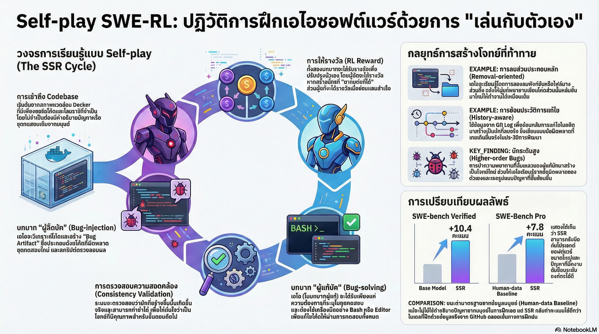

[กลับไปที่หน้าหลัก](../README.md)

สวัสดีครับเพื่อนๆ นักพัฒนาและคนรัก AI! วันนี้เรามาคุยเรื่องที่น่าตื่นเต้นมากๆ เกี่ยวกับ AI ที่สามารถ "สอนตัวเองเขียนโค้ด" ได้แล้วครับ!

คุณเคยใช้ GitHub Copilot หรือ ChatGPT ช่วยเขียนโค้ดไหมครับ? มันเก่งดีนะ แต่มันยังต้องรอให้เรา "สั่ง" ว่าต้องการอะไร มันเป็นแค่ "ผู้ช่วย" ที่ทำตามคำสั่งเท่านั้น

แต่ถ้าบอกว่า AI สามารถเรียนรู้เขียนโค้ดด้วยตัวเองโดยไม่ต้องให้คนสอน ไม่ต้องรอให้คนบอกว่าโค้ดผิดตรงไหน แต่มันสร้างปัญหาขึ้นมาเอง แล้วก็แก้เอง จนเก่งขึ้นเรื่อยๆ... คุณจะเชื่อไหมครับ?

นี่ไม่ใช่เรื่องในอนาคตอีกต่อไป! งานวิจัยล่าสุดจาก Meta FAIR ได้พัฒนาเทคนิคที่ชื่อว่า Self-play SWE-RL (SSR) ที่ทำให้ AI กลายเป็น "วิศวกรซอฟต์แวร์อิสระ" ที่สามารถเรียนรู้และพัฒนาตัวเองได้จริงๆ

วันนี้เรามาดูกันว่า AI ตัวนี้ทำงานยังไง และทำไมมันถึงเป็นก้าวสำคัญสู่ "Superintelligent Software Agents" ที่อาจจะฉลาดกว่ามนุษย์ในอนาคต

========================================

🤖 ทบทวนความเชื่อเดิมๆ: AI เก่งได้แค่ไหน?

ก่อนที่เราจะไปดูเทคนิคใหม่ มาทบทวนความเชื่อและข้อจำกัดของ AI ในปัจจุบันกันก่อนครับ:

▪ "AI เก่งได้ก็แค่ทำตามที่เราสอน" → จริง แต่ถ้า AI สอนตัวเองได้ล่ะ?
▪ "AI ต้องเรียนรู้จากข้อมูลที่คนเตรียมให้" → จริง แต่ถ้า AI หาข้อมูลเองล่ะ?
▪ "AI ทำได้แค่เลียนแบบมนุษย์" → จริง แต่ถ้า AI คิดเองได้ล่ะ?
▪ "AI จะไม่มีวันฉลาดกว่ามนุษย์" → แน่ใจหรือ?

ความจริงคือ AI ในปัจจุบันส่วนใหญ่ยังติดอยู่กับ "Human-centric bottlenecks" หรือคอขวดที่ยึดโยงกับความรู้ของมนุษย์

กล่าวคือ:
▸ AI เรียนรู้จากโค้ดที่มนุษย์เขียนบน GitHub
▸ AI เรียนรู้จากรายงานปัญหา (Issues) ที่มนุษย์เขียน
▸ AI เรียนรู้จาก Test cases ที่มนุษย์สร้าง
▸ AI ทำได้ดีแค่เท่าที่มนุษย์สอน

แต่ถ้าเราต้องการให้ AI ก้าวไปสู่ระดับ "Superintelligence" ที่สามารถสร้างซอฟต์แวร์ที่ซับซ้อนเกินกว่าจินตนาการของมนุษย์ มันจำเป็นต้องเลิกเดินตามรอยเท้าของคน และเริ่มเรียนรู้ที่จะพัฒนาทักษะด้วยตัวเอง!

"การพึ่งพาความรู้และการคัดกรองข้อมูลโดยมนุษย์นั้น ไม่น่าจะสามารถขยายขอบเขตความสามารถของ AI ไปได้อย่างไม่มีที่สิ้นสุด"

นี่คือเหตุผลที่ Self-play SWE-RL (SSR) ถูกพัฒนาขึ้นมาครับ!

========================================

1. 🎮 Self-play: เรียนรู้ผ่านการเล่นกับตัวเอง

ข้อค้นพบแรกและสำคัญที่สุดคือ "Self-play" หรือการเรียนรู้ผ่านการเล่นกับตัวเอง ซึ่งเป็นเทคนิคเดียวกับที่ทำให้ AlphaGo ชนะมนุษย์ในเกมหมากล้อมได้!

=== Self-play คืออะไร? ===

Self-play คือการให้ AI เล่นกับตัวเองซ้ำๆ จนเก่งขึ้นเรื่อยๆ โดยไม่ต้องให้มนุษย์มาสอน

ในกรณีของ AlphaGo:
▸ AI A เล่นหมากล้อมกับ AI B
▸ ทั้งสองตัวเรียนรู้จากการแข่งกัน
▸ เล่นซ้ำๆ หลายล้านเกม
▸ จนเก่งกว่ามนุษย์ที่เล่นมาหลายพันปี!

=== แล้วนำมาใช้กับการเขียนโค้ดได้ยังไง? ===

ทีม Meta FAIR พัฒนา Self-play SWE-RL (SSR) โดยให้โมเดล LLM ตัวเดียวสวมบทบาท 2 ตัวละครที่ "แข่งและสอน" กันเอง:

[ตัวละครที่ 1: เอเจนต์ฉีดบั๊ก (Bug-injection Agent)] 🦠
▸ สำรวจ Codebase (โค้ดในโปรเจกต์)
▸ จงใจสร้างบั๊ก (ปัญหา) เชิงลึกขึ้นมา
▸ ทำให้โค้ดพัง ระบบไม่ทำงาน
▸ เหมือนเป็น "ผู้ร้าย" ที่พยายามทำลาย

[ตัวละครที่ 2: เอเจนต์แก้บั๊ก (Bug-solving Agent)] 🛠️
▸ วิเคราะห์ปัญหาที่เกิดขึ้น
▸ หาวิธีแก้ไขให้ระบบกลับมาทำงานได้
▸ เหมือนเป็น "ฮีโร่" ที่พยายามซ่อมแซม

แล้วทั้งสองตัวจะทำงานวนซ้ำๆ:
▸ บั๊กอินเจนต์สร้างบั๊ก → โซลเวอร์แก้ → บั๊กอินเจนต์สร้างบั๊กที่ยากกว่า → โซลเวอร์แก้ได้ → ...
▸ ยิ่งทำซ้ำ ทั้งสองฝ่ายยิ่งเก่งขึ้น!

=== ทำไมถึงทรงพลังกว่าการอ่านตำรา? ===

[การเรียนแบบเดิม: อ่านตำราและเลียนแบบ]
▸ AI อ่านโค้ดที่มนุษย์เขียนบน GitHub
▸ เรียนรู้วิธีแก้ปัญหาที่มนุษย์เคยทำไว้แล้ว
▸ ทำได้แค่เลียนแบบ ไม่มีอะไรใหม่

[การเรียนแบบ Self-play: สร้างและแก้เอง]
▸ AI สร้างปัญหาขึ้นมาเอง
▸ AI แก้ปัญหาด้วยตัวเอง
▸ ค้นพบวิธีการใหม่ๆ ที่มนุษย์อาจไม่เคยคิด!

ข้อดีหลักๆ ของ Self-play:

[1] การค้นพบแบบอิสระ (Independent Discovery)
▸ แทนที่จะแค่เลียนแบบมนุษย์
▸ AI เริ่มค้นพบประเภทของบั๊กและโซลูชันใหม่ๆ
▸ อยู่นอกเหนือจากคลังข้อมูลของมนุษย์

[2] สร้างบทเรียนได้ไม่จำกัด
▸ ไม่ต้องรอให้มนุษย์เขียน Issue ใหม่
▸ ตราบใดที่มี Codebase ให้สำรวจ
▸ AI สามารถสร้าง "โจทย์" ได้มหาศาล

[3] การเข้าถึงแก่นแท้
▸ การรู้วิธี "ทำลาย" ระบบในจุดที่ซับซ้อนที่สุด
▸ คือบทเรียนที่ดีที่สุดในการเรียนรู้วิธี "สร้าง" ระบบให้แข็งแกร่ง
▸ เหมือนนักออกแบบอาคารต้องรู้ว่าอาคารจะพังได้อย่างไร

เปรียบเทียบ:

อ่านตำรา = นักเรียนอ่านหนังสือที่ครูเขียนไว้
▸ เรียนรู้วิธีแก้ปัญหาที่ครูสอน
▸ ทำได้แค่ทำตามตัวอย่าง

Self-play = นักเรียนทำโจทย์ด้วยตัวเอง ลองผิดลองถูก
▸ สร้างโจทย์เอง แก้เอง เรียนรู้จากความผิดพลาด
▸ ค้นพบวิธีการใหม่ที่ครูอาจไม่เคยสอน!

========================================

2. 🗂️ เรียนรู้จาก "ความว่างเปล่า" โดยไม่ต้องพึ่งมนุษย์

ข้อค้นพบที่สองที่น่าทึ่งมากๆ คือ AI ตัวนี้เรียนรู้ได้โดยแทบไม่ต้องพึ่งข้อมูลจากมนุษย์เลย!

=== Minimal Data Assumptions คืออะไร? ===

Minimal Data Assumptions หมายถึง "การแทบไม่พึ่งพาข้อมูลสนับสนุนจากมนุษย์เลย"

SSR ต้องการเพียงแค่:
▸ Docker Image ของโปรเจกต์ซอฟต์แวร์
▸ Dependencies (ไลบรารีที่ต้องใช้)
▸ แค่นั้นแหละ!

ที่เหลือ AI จะต้อง "คลำทาง" เองทั้งหมด!

=== เปรียบเทียบการฝึกแบบเดิมกับ Self-play ===

มาเปรียบเทียบกันครับ:

[การฝึกแบบเดิม (Human-based RL)]

ข้อมูลนำเข้าหลัก:
▸ รายงานปัญหา (Issues) เป็นภาษามนุษย์
▸ มนุษย์เขียนบรรยายปัญหาให้ AI อ่าน

การกำหนดโจทย์:
▸ มนุษย์บรรยายปัญหาเป็นข้อความ
▸ AI อ่านแล้วพยายามเข้าใจและแก้

โครงสร้างการทดสอบ:
▸ พึ่งพาระบบ Test Runner ที่คนเตรียมไว้
▸ ทุกอย่างพร้อมใช้งานแล้ว

การตรวจสอบความถูกต้อง:
▸ ใช้ชุดทดสอบเดิมที่มีอยู่แล้ว
▸ ไม่ต้องสร้างอะไรใหม่

[Self-play (SSR)]

ข้อมูลนำเข้าหลัก:
▸ โค้ดต้นฉบับใน Docker Image เท่านั้น
▸ ไม่มีคำอธิบายจากมนุษย์เลย

การกำหนดโจทย์:
▸ AI กำหนดโจทย์เองผ่าน Oracle Test Patch
▸ สร้างบั๊กขึ้นมาเอง แล้วแก้เอง

โครงสร้างการทดสอบ:
▸ AI สร้างชุดทดสอบและ Parser ขึ้นเอง
▸ คลำทางทุกอย่างเอง

การตรวจสอบความถูกต้อง:
▸ ใช้ระบบ Consistency Checks ที่ AI สร้างขึ้น
▸ ตรวจสอบคุณภาพด้วยตัวเอง

=== AI ต้อง "คลำทาง" อะไรบ้าง? ===

เมื่อ AI ได้รับแค่ Docker Image มาอย่างเดียว มันต้องเรียนรู้ทุกอย่างเองตั้งแต่ศูนย์:

[1] ค้นหาวิธีรัน Test
▸ โปรเจกต์แต่ละตัวรัน Test คนละวิธี
▸ บางโปรเจกต์ใช้ pytest, บางตัวใช้ unittest, บางตัวใช้ nose
▸ AI ต้องเรียนรู้เองว่าโปรเจกต์นี้ใช้วิธีไหน

[2] สร้าง Test Parser
▸ Test แต่ละโปรเจกต์มี Output format ต่างกัน
▸ AI ต้องสร้าง Parser ขึ้นมาเองเพื่ออ่านผลลัพธ์
▸ เพื่อรู้ว่า Test ผ่านหรือไม่ผ่าน

[3] เข้าใจโครงสร้าง Codebase
▸ ไฟล์ไหนทำอะไร
▸ ฟังก์ชันไหนเรียกฟังก์ชันไหน
▸ Dependencies มีอะไรบ้าง

[4] สร้างระบบตรวจสอบความถูกต้อง
▸ วิธีการ Verify ว่าบั๊กที่สร้างขึ้นมีคุณภาพ
▸ วิธีการ Verify ว่าการแก้บั๊กถูกต้อง

เปรียบเทียบ:

การฝึกแบบเดิม = นักเรียนได้รับตำราเรียน + แบบฝึกหัด + เฉลย + คำแนะนำจากครู
▸ ทุกอย่างเตรียมไว้ให้แล้ว
▸ แค่ทำตาม

Self-play = นักเรียนได้รับแค่ห้องสมุด (Codebase)
▸ ต้องหาหนังสือเอง
▸ ต้องสร้างโจทย์เอง
▸ ต้องแก้เอง
▸ ต้องตรวจเอง
▸ เรียนรู้จากการลองผิดลองถูก 100%!

"เป้าหมายคือการสร้างระบบที่เข้าใจการสร้างซอฟต์แวร์ได้ลึกซึ้งกว่ามนุษย์... จนถึงระดับที่สามารถสร้างซอฟต์แวร์ใหม่จากศูนย์ได้อย่างอิสระ"

========================================

3. 💣 วิธีการ "ทำลาย" ที่ชาญฉลาดและการตรวจสอบคุณภาพ

ข้อค้นพบที่สามคือ การสร้างบั๊กไม่ใช่แค่สุ่มๆ แต่ต้องมี "ศิลปะ" และ "วิทยาศาสตร์" ด้วย!

=== Agentic Bug Injection คืออะไร? ===

Agentic Bug Injection คือการ "ฉีดบั๊กเชิงเอเจนต์" ที่ใช้เทคนิคชั้นสูง ไม่ใช่สร้างแบบสุ่มๆ

เทคนิคการสร้างบั๊ก 2 แบบหลัก:

[เทคนิคที่ 1: Code Removal (การลบโค้ด)]

วิธีการ:
▸ เลือกลบฟังก์ชันสำคัญออกจากโค้ด
▸ ทำให้โปรแกรมไม่ทำงาน

จุดประสงค์:
▸ ฝึกให้ Solver สร้างฟังก์ชันนั้นขึ้นมาใหม่
▸ เรียนรู้วิธีสร้างฟีเจอร์จากศูนย์

ตัวอย่าง:
▸ ลบฟังก์ชัน calculate_tax() ออกจากโปรแกรม
▸ Solver ต้องสร้างฟังก์ชันนี้ขึ้นมาใหม่
▸ เรียนรู้วิธีคำนวณภาษี

[เทคนิคที่ 2: Historical Change Reversion (การย้อนการแก้ไขในอดีต)]

วิธีการ:
▸ ใช้ Git logs ดูประวัติการแก้ไขโค้ด
▸ ย้อนกลับการแก้ไขในอดีต
▸ ทำให้บั๊กที่เคยมีเกิดขึ้นใหม่

จุดประสงค์:
▸ สร้างบั๊กที่ "เหมือนจริง" ในเชิงประวัติศาสตร์
▸ ฝึกให้ Solver แก้ปัญหาที่เคยเกิดขึ้นจริง

ตัวอย่าง:
▸ เดือนมกราคม 2023: มีบั๊กเรื่อง memory leak
▸ เดือนกุมภาพันธ์ 2023: แก้ไขแล้ว
▸ AI ย้อนกลับไปเดือนมกราคม → บั๊กเกิดขึ้นใหม่
▸ Solver ต้องหาวิธีแก้เหมือนที่นักพัฒนาทำจริง

=== Consistency Validation: ตรวจสอบคุณภาพบั๊ก ===

ไม่ใช่บั๊กทุกตัวที่สร้างขึ้นจะมีคุณภาพนะครับ! SSR มีระบบตรวจสอบคุณภาพที่ชื่อว่า "Consistency Validation"

เทคนิคสำคัญคือ Inverse Mutation Testing:

วิธีการทำงาน:
[1] สร้างบั๊กโดยแก้ไขหลายไฟล์ (เช่น 3 ไฟล์)
[2] ลองลบการแก้ไขแต่ละไฟล์ออก ทีละไฟล์
[3] ตรวจสอบว่าบั๊กยังเกิดขึ้นอยู่ไหม

ตรรกะการตรวจสอบ:
▸ ถ้าลบการแก้ไขไฟล์ A ออก แล้วบั๊กยังเกิด → ไฟล์ A ไม่จำเป็น (ไม่ใช่ต้นเหตุ)
▸ ถ้าลบการแก้ไขไฟล์ B ออก แล้วบั๊กหาย → ไฟล์ B จำเป็น (เป็นต้นเหตุจริงๆ)

ทำไมต้องตรวจสอบ?
▸ บางทีการแก้ไขหลายไฟล์พร้อมกัน แต่บั๊กเกิดจากแค่ไฟล์เดียว
▸ การแก้ไขไฟล์อื่นๆ เป็นแค่ "Noise" (ข้อมูลรบกวน)
▸ ถ้าไม่กรอง AI จะสับสน เรียนรู้สิ่งที่ผิด

ผลลัพธ์:
▸ ระบบจะคัดกรองบั๊กที่ไม่มีคุณภาพทิ้ง
▸ AI ได้เรียนรู้จากปัญหาที่ "สะอาด" และ "ชัดเจน" เท่านั้น
▸ ทำให้การเรียนรู้มีประสิทธิภาพ

เปรียบเทียบ:

ไม่มี Consistency Validation = นักเรียนทำโจทย์ที่โจทย์ผิด
▸ เรียนรู้สิ่งที่ผิด
▸ สับสน ไม่เข้าใจ

มี Consistency Validation = นักเรียนทำโจทย์ที่คัดกรองแล้ว
▸ ทุกโจทย์มีคุณภาพ
▸ เรียนรู้สิ่งที่ถูกต้อง ชัดเจน

========================================

4. 🎓 Higher-order Bugs: เรียนรู้จากความล้มเหลวของตัวเอง

ข้อค้นพบที่สี่นี้เจ๋งมากๆ ครับ นั่นคือ AI สามารถเรียนรู้จากความผิดพลาดของตัวเองด้วย!

=== Higher-order Bugs คืออะไร? ===

Higher-order bugs คือ "บั๊กลำดับสูง" ที่เกิดจากการแก้บั๊กผิด!

กล่าวคือ:
▸ บั๊กธรรมดา (Order 1) = บั๊กที่ Bug-injection Agent สร้างขึ้นตั้งแต่แรก
▸ บั๊กลำดับสูง (Order 2+) = บั๊กที่เกิดจากการที่ Solver แก้บั๊กผิด!

=== กระบวนการเกิด Higher-order Bugs ===

ลำดับเหตุการณ์:

[รอบที่ 1]
▸ Bug-injection Agent: สร้างบั๊ก A
▸ Solver: พยายามแก้บั๊ก A
▸ ผลลัพธ์: แก้ผิด! สร้างโค้ดที่มีปัญหาใหม่ขึ้นมา

[รอบที่ 2]
▸ ระบบเก็บโค้ดที่ผิดพลาดนั้นไว้
▸ นำมาเป็น "บั๊ก B" (Higher-order bug)
▸ Solver ต้องแก้บั๊ก B ต่อ

[รอบที่ 3]
▸ ถ้าแก้บั๊ก B ผิดอีก
▸ ก็จะเกิด "บั๊ก C" (Order 3)
▸ และวนต่อไปเรื่อยๆ

=== ทำไมถึงสำคัญ? ===

[1] สร้าง Evolving Curriculum (หลักสูตรที่วิวัฒนาการ)

ลักษณะของหลักสูตร:
▸ ปรับระดับความยากตามความสามารถที่แท้จริงของโมเดล
▸ ถ้า AI แก้ง่าย ก็จะได้บั๊กที่ยากขึ้นจากความผิดพลาดของตัวเอง
▸ ถ้า AI แก้ยาก ก็จะได้บั๊กที่ง่ายลงมา

เหมือนเกมที่ปรับระดับความยากตามฝีมือผู้เล่น!

[2] พบ Layered Failure Patterns (รูปแบบความล้มเหลวที่ซ้อนทับ)

ลักษณะของปัญหา:
▸ บั๊กลำดับสูงมักจะซับซ้อนและสมจริงมาก
▸ เพราะเป็นผลมาจากการแก้ปัญหาผิด ซึ่งเป็นเรื่องที่เกิดขึ้นจริงในการพัฒนาซอฟต์แวร์
▸ หาได้ยากในข้อมูลทั่วไปจากมนุษย์

ตัวอย่าง:

[สถานการณ์จริงในการพัฒนาซอฟต์แวร์]
▸ นักพัฒนาพบบั๊ก → แก้ไข → เกิดบั๊กใหม่ → แก้ไขอีก → เกิดบั๊กอีก → ...
▸ นี่คือสิ่งที่เกิดขึ้นจริงทุกวัน!

[SSR จำลองสถานการณ์นี้]
▸ Solver แก้บั๊ก → แก้ผิด → เกิดบั๊กใหม่ → ต้องแก้อีก → ...
▸ ฝึกให้ AI เจอสถานการณ์แบบนี้บ่อยๆ
▸ เรียนรู้วิธีจัดการกับความซับซ้อนที่เกิดจากการแก้ไข

=== ข้อดีของ Higher-order Bugs ===

▸ AI ได้เรียนรู้จากความผิดพลาดของตัวเอง
▸ ได้เจอปัญหาที่ซับซ้อนและสมจริงมาก
▸ พัฒนาทักษะการแก้ไขปัญหาที่ซับซ้อนขึ้น
▸ เตรียมพร้อมสำหรับสถานการณ์จริงที่อาจจะซับซ้อนกว่าที่เคยเจอ

เปรียบเทียบ:

เรียนจากตำรา = ทำโจทย์ที่ครูเตรียมไว้
▸ โจทย์มีระดับความยากตายตัว
▸ ไม่ได้ปรับตามฝีมือนักเรียน

Higher-order Bugs = ทำโจทย์ที่สร้างจากความผิดพลาดของตัวเอง
▸ โจทย์ยากขึ้นตามฝีมือที่พัฒนา
▸ ได้เรียนรู้จากความผิดพลาดจริงๆ
▸ เหมือนครูที่สร้างโจทย์ใหม่ทุกครั้งตามจุดอ่อนของนักเรียน!

========================================

5. 📊 ผลลัพธ์ที่พิสูจน์แล้ว: ยิ่งอิสระ ยิ่งเก่ง!

ข้อค้นพบสุดท้ายคือผลลัพธ์จริงจากการทดสอบที่พิสูจน์ว่า Self-play ดีกว่าจริงๆ!

=== ทดสอบบนมาตรฐานระดับโลก ===

ทีม Meta FAIR ได้ทดสอบโมเดลบนเกณฑ์มาตรฐานระดับโลก 2 ชุด:

[1] SWE-bench Verified
[2] SWE-Bench Pro

ทั้งสองชุดนี้เป็นมาตรฐานที่ใช้วัดความสามารถของ AI ในการแก้ปัญหาซอฟต์แวร์จริงๆ จากโปรเจกต์โอเพนซอร์สชื่อดัง

=== ผลลัพธ์ที่น่าทึ่ง! ===

คะแนนเพิ่มขึ้นอย่างก้าวกระโดด:

▪ SWE-bench Verified: +10.4 จุด
▪ SWE-Bench Pro: +7.8 จุด

นี่คือการเพิ่มขึ้นที่มากมายมหาศาล แสดงให้เห็นว่า Self-play มีประสิทธิภาพจริงๆ!

=== สิ่งที่น่าทึ่งที่สุด! ===

ในการทดสอบเหล่านี้ AI ต้องแก้โจทย์ที่เป็นภาษามนุษย์ (Natural language issues) เช่น:

"The login button doesn't work when the user is not logged in"
(ปุ่มล็อกอินไม่ทำงานเมื่อผู้ใช้ยังไม่ได้ล็อกอิน)

แต่ตอนฝึกด้วย SSR AI ไม่เคยเห็น Issue เป็นภาษามนุษย์เลย!

มันฝึกจาก:
▸ การแก้บั๊กที่ถูกระบุด้วย Oracle Test Patch
▸ ชุดทดสอบที่แม่นยำ
▸ ไม่มีภาษามนุษย์เข้ามาเกี่ยวข้องเลย!

แต่ทำไมมันถึงแก้ปัญหาที่อธิบายเป็นภาษามนุษย์ได้?

=== คำตอบอยู่ที่ "ความเข้าใจเชิงลึก" ===

เพราะว่า การที่ AI ได้เรียนรู้ผ่านการลองผิดลองถูกใน Codebase จริง ช่วยให้มันเข้าใจ:

▸ โครงสร้างของซอฟต์แวร์
▸ ตรรกะการทำงาน
▸ ความสัมพันธ์ระหว่างส่วนต่างๆ
▸ รูปแบบของปัญหาที่เกิดขึ้น

เมื่อเข้าใจลึกซึ้งขนาดนี้ แม้จะไม่เคยเห็นคำอธิบายเป็นภาษามนุษย์ มันก็สามารถแปลความต้องการของมนุษย์ไปสู่การแก้ปัญหาได้!

เปรียบเทียบ:

[โมเดลที่ฝึกแบบเดิม: เลียนแบบ]
▸ เรียนรู้จากการอ่านโค้ดและคำอธิบายของมนุษย์
▸ ท่องจำวิธีแก้ปัญหาที่มนุษย์เคยทำ
▸ ได้ผลดีกับปัญหาที่คุ้นเคย
▸ แต่ติดขัดกับปัญหาใหม่ๆ

[โมเดลที่ฝึกด้วย Self-play: เข้าใจ]
▸ เรียนรู้จากการลงมือทำจริง
▸ เข้าใจโครงสร้างและตรรกะจริงๆ
▸ สามารถแปลความต้องการของมนุษย์ไปสู่การแก้ปัญหาได้
▸ จัดการกับปัญหาใหม่ๆ ได้ดีกว่า!

สรุป: "ประสบการณ์ตรง" ของ AI นั้นทรงพลังเพียงใด!

========================================

สรุป: อนาคตที่ AI เป็นมากกว่าผู้ช่วย

หลังจากที่เราได้เห็นข้อค้นพบทั้ง 5 ข้อแล้ว มาสรุปภาพรวมกันครับ

=== สิ่งที่เราได้เรียนรู้วันนี้ ===

[1] Self-play: เรียนรู้ผ่านการเล่นกับตัวเอง
▸ AI สวมบทบาท 2 ตัว: สร้างบั๊กและแก้บั๊ก
▸ เรียนรู้จากการแข่งและสอนกันเอง
▸ ค้นพบวิธีการใหม่ๆ ที่มนุษย์อาจไม่เคยคิด

[2] เรียนรู้จากความว่างเปล่า
▸ ไม่ต้องพึ่งข้อมูลจากมนุษย์
▸ แค่มี Docker Image ก็เริ่มเรียนรู้ได้
▸ คลำทางทุกอย่างเอง จนเก่งขึ้นเรื่อยๆ

[3] วิธีทำลายที่ชาญฉลาด
▸ ใช้เทคนิคชั้นสูงในการสร้างบั๊ก
▸ มีระบบตรวจสอบคุณภาพบั๊ก
▸ AI เรียนรู้จากปัญหาที่มีคุณภาพเท่านั้น

[4] เรียนรู้จากความผิดพลาดของตัวเอง
▸ Higher-order bugs จากการแก้บั๊กผิด
▸ หลักสูตรที่ปรับตามความสามารถ
▸ พบปัญหาที่ซับซ้อนและสมจริง

[5] ผลลัพธ์ที่พิสูจน์แล้ว
▸ คะแนนเพิ่มขึ้นอย่างมาก (+10.4 และ +7.8 จุด)
▸ แก้ปัญหาที่อธิบายเป็นภาษามนุษย์ได้
▸ แม้ไม่เคยเห็นภาษามนุษย์ตอนฝึก!

=== Self-play SWE-RL (SSR) คืออะไร? ===

SSR ไม่ใช่เพียงแค่เทคนิคการฝึก AI แบบใหม่ แต่มันคือการเปิดประตูสู่ยุคของ "Superintelligent Software Agents" ครับ!

นี่คือเอเจนต์ที่สามารถ:
▸ ดูแลตัวเอง (Self-maintaining)
▸ พัฒนาตัวเอง (Self-improving)
▸ แก้ไขปัญหาที่มนุษย์อาจยังไม่เคยเจอ (Novel problem-solving)

=== จากผู้ช่วยสู่ผู้สร้างสรรค์ ===

เรากำลังเคลื่อนที่จาก:

[ยุคเก่า: Copilot - ผู้ช่วย]
▸ AI ทำตามคำสั่งมนุษย์
▸ เลียนแบบโค้ดที่มนุษย์เขียน
▸ ช่วยเร่งความเร็ว แต่ไม่สร้างสรรค์สิ่งใหม่

[ยุคใหม่: Autonomous Agent - ผู้สร้างสรรค์]
▸ AI เข้าใจระบบซอฟต์แวร์ได้ลึกซึ้งกว่ามนุษย์
▸ วิวัฒนาการทักษะอย่างต่อเนื่อง
▸ รับผิดชอบการสร้างและดูแลระบบได้อย่างอิสระ

=== ผลกระทบต่ออนาคต ===

[ต่อวงการซอฟต์แวร์]
▸ การพัฒนาซอฟต์แวร์จะเร็วขึ้นมาก
▸ AI สามารถจัดการโค้ดเบสขนาดใหญ่ได้ดีกว่า
▸ ระบบซอฟต์แวร์จะซับซ้อนและทรงพลังขึ้น

[ต่อโปรแกรมเมอร์]
▸ บทบาทเปลี่ยนจาก "คนเขียนโค้ด" เป็น "ผู้วางวิสัยทัศน์"
▸ ต้องเรียนรู้วิธีทำงานร่วมกับ AI ที่ฉลาดขึ้นเรื่อยๆ
▸ มุ่งเน้นไปที่การแก้ปัญหาระดับสูง ไม่ใช่เขียนโค้ดระดับต่ำ

[ต่อเทคโนโลยี]
▸ AI จะพัฒนาไปสู่ระดับ Superintelligence
▸ สามารถสร้างสรรค์สิ่งที่เกินจินตนาการมนุษย์
▸ เปลี่ยนโลกในแบบที่เราอาจจะคาดไม่ถึง

========================================

คำถามท้ายทาย

สุดท้ายนี้ ลองคิดตามนะครับ:

"ในวันที่ AI สามารถ 'สอนตัวเอง' ให้สร้างสรรค์ซอฟต์แวร์ที่สมบูรณ์แบบได้ หน้าที่ของมนุษย์ในฐานะโปรแกรมเมอร์จะเปลี่ยนจาก 'คนเขียนโค้ด' ไปสู่ 'ผู้วางวิสัยทัศน์' (Architect of Vision) มากขึ้นเพียงใด?"

คำถามสำหรับทุกคน:
▸ คุณพร้อมหรือยังสำหรับโลกที่ AI เขียนโค้ดได้เก่งกว่ามนุษย์?
▸ ในฐานะโปรแกรมเมอร์ คุณจะปรับตัวยังไงในโลกที่ AI กลายเป็น Superintelligent?
▸ ทักษะอะไรที่มนุษย์ยังจำเป็นต้องมี เมื่อ AI ทำงานเทคนิคได้หมดแล้ว?

นี่คือคำถามที่ทุกคนในวงการเทคโนโลยีต้องคิดกันแล้วครับ! 🤔

=== ทิศทางในอนาคต ===

ในอนาคตอันใกล้ เราอาจจะเห็น:

▸ AI ที่สามารถพัฒนาโปรเจกต์ทั้งหมดด้วยตัวเอง
▸ AI ที่สามารถรักษาและอัปเดต codebase อย่างต่อเนื่อง
▸ AI ที่สามารถคิดค้นสถาปัตยกรรมใหม่ๆ ที่มนุษย์อาจไม่เคยคิดถึง
▸ ระบบซอฟต์แวร์ที่ซับซ้อนเกินกว่าที่มนุษย์จะเข้าใจได้ทั้งหมด

แต่สิ่งหนึ่งที่แน่ๆ คือ มนุษย์ยังคงเป็นผู้กำหนดทิศทาง กำหนดจุดประสงค์ และกำหนดจริยธรรม

เราอาจจะไม่ใช่ผู้เขียนโค้ดทุกบรรทัดอีกต่อไป แต่เราจะเป็นผู้ที่กำหนดว่า "เทคโนโลยีนี้จะถูกใช้เพื่ออะไร"

นั่นคือบทบาทที่สำคัญที่สุดครับ! 🚀

========================================

อ้างอิง:
• Meta FAIR: Self-play SWE-RL (SSR)
• Code World Model (CWM-sft)
• SWE-bench Verified & SWE-Bench Pro
• AlphaGo Self-play Methodology

หวังว่าบทความนี้จะเปิดมุมมองใหม่ให้ทุกคนเห็นว่า AI กำลังพัฒนาไปในทิศทางที่น่าตื่นเต้นมากๆ ครับ!

ถ้ามีความคิดเห็นหรือข้อสงสัย มาแชร์กันได้เลยนะครับ อยากรู้ว่าทุกคนคิดยังไงกับอนาคตที่ AI สอนตัวเองได้ 😊
