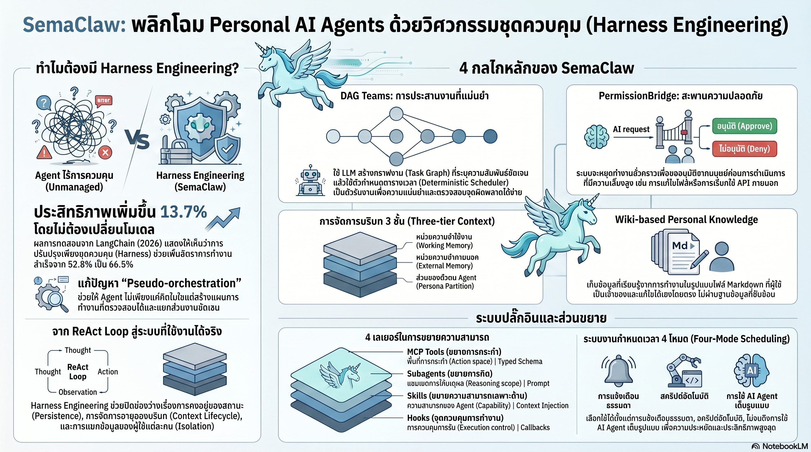

[กลับไปที่หน้าหลัก](../README.md)

สวัสดีครับเพื่อนๆ ที่ติดตามวงการ AI! วันนี้มาเรื่องที่เปลี่ยนคำถามจาก "เราควรใช้ AI โมเดลไหน?" เป็น "เราควรสร้างระบบรอบ AI อย่างไร?" ซึ่งเป็นคำถามที่สำคัญกว่ามากในยุคที่โมเดล AI เริ่มฉลาดใกล้เคียงกันแล้วครับ

คุณเคยสังเกตไหมครับว่า บางทีเราใช้ AI ที่ "ฉลาดกว่า" แต่ผลลัพธ์กลับไม่ดีขึ้นเท่าที่ควร หรือบางทีระบบที่ออกแบบดีกว่ากลับให้ผลที่น่าเชื่อถือกว่า AI ที่ฉลาดที่สุดใช้แบบดิบๆ?

คุณเคยสงสัยไหมครับว่า ทำไม AI Agent ที่ดูแลนัดหมาย ค้นหาข้อมูล หรือจัดการอีเมลให้เรา ถึงยังมักเกิดปัญหาเรื่องทำเกินสิทธิ์ ทำงานไม่สมบูรณ์ หรือ "ลืม" ทุกอย่างที่เรียนรู้มาเมื่อเริ่มเซสชันใหม่?

และคุณรู้ไหมครับว่า การปรับปรุงแค่ "โครงสร้างระบบรอบโมเดล" โดยไม่เปลี่ยนโมเดลเลยสักนิด สามารถเพิ่มอัตราความสำเร็จของงานได้ถึง 13.7 จุดเปอร์เซ็นต์ จาก 52.8% เป็น 66.5% ได้?

เฟรมเวิร์กที่พิสูจน์สิ่งนี้ชื่อ SemaClaw และมันกำลังเปลี่ยนวิธีที่เราคิดถึงการสร้าง Personal AI Agent จากการไล่ตามโมเดลที่ฉลาดกว่า มาเป็นการสร้างระบบที่ดีกว่าแทนครับ

========================================

🤔 ทบทวนความเชื่อเดิมๆ: สิ่งที่เราคิดเกี่ยวกับการสร้าง AI Agent ที่ดี

▪ "ถ้าอยากให้ AI ทำงานได้ดีขึ้น ต้องรอให้โมเดลฉลาดขึ้น GPT-5 หรือ Claude รุ่นถัดไปจะแก้ปัญหาได้เอง" → Terminal Bench 2.0 พิสูจน์ว่าการปรับปรุงเฉพาะ Harness โดยใช้โมเดลตัวเดิมเพิ่มประสิทธิภาพ 13.7 percentage points ในยุคที่โมเดลต่างๆ เริ่มฉลาดใกล้เคียงกัน (Model Convergence) จุดแข่งขันย้ายไปอยู่ที่ Harness Layer แล้วครับ

▪ "ความปลอดภัยของ AI คือการตั้ง Prompt ให้ AI บอกว่าจะไม่ทำอะไรที่ผิด" → SemaClaw แยก Model Safety (ป้องกันไม่ให้พูดสิ่งผิด) ออกจาก Behavioral Safety (ป้องกันไม่ให้ทำสิ่งผิด) PermissionBridge เปลี่ยนสิทธิ์การเข้าถึงจาก "คำขอความร่วมมือ" เป็น "ข้อกำหนดทางเทคนิค" ที่ AI ข้ามไม่ได้ครับ

▪ "ความจำของ AI เก็บอยู่ในระบบ Vector Database ที่ซับซ้อน เป็นเรื่องเทคนิคที่เราเข้าไปยุ่งได้ยาก" → SOUL.md และ MEMORY.md ใน SemaClaw คือไฟล์ Markdown ธรรมดาที่มนุษย์อ่านออก แก้ไขได้ และเป็นเจ้าของได้จริงโดยไม่ต้องพึ่ง AI ครับ

▪ "AI ตัวเดียวที่ฉลาดพอทำทุกงานย่อมดีกว่า AI หลายตัวที่ต้องประสานงานกัน" → Monolithic Agent สร้างปัญหา Black Box ที่ไม่รู้ว่ากำลังคิดอะไรหรือพลาดตรงไหน DAG Teams ที่แยก Dynamic Planning ออกจาก Deterministic Execution ทำให้ตรวจสอบแผนก่อนเริ่มงานได้ ลด Token สูญเปล่า และรันแบบขนานได้ครับ

ความจริงที่น่าคิดคือ: ในยุคที่โมเดล AI ทุกตัวฉลาดพอๆ กัน ผู้ที่ชนะไม่ใช่คนที่มีโมเดลดีที่สุด แต่คือคนที่สร้างระบบรอบโมเดลได้ดีที่สุดครับ

========================================

🧠 พื้นฐานที่ต้องเข้าใจก่อน: Harness Engineering, PermissionBridge และ DAG

=== Harness Engineering คืออะไร? ===

Harness = โครงสร้างระบบทั้งหมดที่ล้อมรอบ Base LLM ประกอบด้วยระบบจัดการ Context, กลไกควบคุมสิทธิ์, หน่วยความจำข้ามเซสชัน และวิธีส่งงานให้โมเดลในแต่ละขั้นตอน

Harness Engineering = ศาสตร์ของการออกแบบระบบเหล่านี้ให้ดีที่สุด แทนที่จะหมกมุ่นกับการเลือกโมเดล

เปรียบเทียบ: เหมือนทีมแพทย์ในห้องผ่าตัด ศัลยแพทย์คือโมเดล แต่ประสิทธิภาพของการผ่าตัดขึ้นอยู่กับโครงสร้างของห้องผ่าตัด การจัดเรียงเครื่องมือ พยาบาลที่ส่งของถูกเวลา และระบบติดตามสัญญาณชีพ ศัลยแพทย์เก่งแค่ไหนก็สำคัญน้อยลงถ้าระบบรอบข้างยุ่งเหยิงครับ

=== Model Convergence คืออะไร? ===

Model Convergence = แนวโน้มที่โมเดล AI ชั้นนำต่างๆ มีความสามารถใกล้เคียงกันมากขึ้นเรื่อยๆ ในงานส่วนใหญ่

ผลคือความแตกต่างของโมเดลแต่ละตัวลดลง แต่ความแตกต่างของระบบที่ห่อโมเดลกลับสำคัญขึ้นครับ

=== DAG (Directed Acyclic Graph) คืออะไร? ===

DAG = โครงสร้างกราฟที่แสดงความเกี่ยวเนื่องของงาน โดยมีทิศทาง (Directed) และไม่วนซ้ำ (Acyclic)

ใช้แทนแผนการทำงานที่บอกว่างาน A ต้องเสร็จก่อนงาน B ส่วนงาน C และ D ทำพร้อมกันได้

[ตัวอย่าง DAG สำหรับวิจัยข้อมูล]
▸ Step 1: ค้นหาแหล่งข้อมูล (ต้องเสร็จก่อน)
▸ Step 2A + 2B: อ่านบทความ X และ Y (ทำพร้อมกันได้)
▸ Step 3: สรุปรวม (รอ 2A และ 2B เสร็จก่อน) ครับ

=== Behavioral Safety vs Model Safety ===

Model Safety = ป้องกันไม่ให้ AI พูดหรือสร้างเนื้อหาที่เป็นอันตราย ฝังอยู่ในตัวโมเดล

Behavioral Safety = ป้องกันไม่ให้ AI กระทำสิ่งที่ไม่ได้รับอนุญาต เช่น ลบไฟล์, เรียก API ภายนอก, เข้าถึงข้อมูลส่วนตัว ต้องออกแบบในชั้น Harness ครับ

========================================

1️⃣ Harness Engineering: เมื่อโครงสร้างสำคัญกว่าความฉลาด

=== หลักฐานที่ชัดเจนที่สุด ===

LangChain ทดสอบบน Terminal Bench 2.0 และพบว่า

[ใช้โมเดลเดิม + Harness เดิม]: 52.8% Task Completion
[ใช้โมเดลเดิม + Harness ที่ดีขึ้น]: 66.5% Task Completion
[เพิ่มขึ้น]: +13.7 Percentage Points โดยไม่เปลี่ยนโมเดลเลย

ตัวเลขนี้ท้าทายสมมติฐานที่ว่า "โมเดลที่ฉลาดกว่าคือคำตอบ" อย่างตรงไปตรงมาครับ

=== sema-code-core: Runtime เบื้องหลังที่จัดการทุกอย่าง ===

SemaClaw ออกแบบบน sema-code-core ซึ่งทำหน้าที่เป็น Runtime ที่จัดการ

▸ Context Lifecycle — ข้อมูลอะไรเข้า-ออก Context ในแต่ละขั้น
▸ Tool Connectivity — การเชื่อมต่อเครื่องมือต่างๆ
▸ Permission Routing — ตรวจสอบสิทธิ์ก่อนทุก Action

เปรียบเทียบ: เหมือน OS ของโทรศัพท์ที่ทำงานอยู่เบื้องหลัง ไม่ว่าจะเปิดแอปอะไร OS จัดการเรื่อง Memory, Battery, Network และ Permission ให้ทั้งหมด แอปแต่ละตัว (โมเดล) จึงทำงานได้เสถียรและปลอดภัยโดยไม่ต้องจัดการเองครับ

========================================

2️⃣ PermissionBridge: เปลี่ยนความปลอดภัยจาก "ความร่วมมือ" เป็น "โครงสร้าง"

=== ทำไม Model Safety ไม่พอ? ===

เวลาเราบอก AI ว่า "อย่าลบไฟล์สำคัญ" มันพยายามปฏิบัติตาม แต่นั่นคือการ "ขอความร่วมมือ" ซึ่งสามารถถูก Override ได้โดย Prompt ที่ซับซ้อนหรือ Edge Case ที่ไม่ได้คาดการณ์ไว้ครับ

=== PermissionBridge ทำงานอย่างไร? ===

PermissionBridge ใช้หลักการ Least Privilege — สิทธิ์เท่าที่จำเป็นเท่านั้น โดยแบ่งเครื่องมือเป็น 2 ชั้นชัดเจน

[Internal Tools — Pre-authorized]
▸ การค้นหาความจำส่วนตัว
▸ การอ่านไฟล์ที่กำหนดไว้ล่วงหน้า
▸ การคำนวณและประมวลผลภายใน
▸ → ได้รับอนุญาตล่วงหน้า ทำได้ทันที ไม่ต้องรอครับ

[External Tools — Requires Human Approval]
▸ การเข้าถึง API ภายนอก
▸ การแก้ไขหรือลบไฟล์
▸ การส่งอีเมลหรือข้อความ
▸ → ต้องผ่านการอนุมัติจากเจ้าของทุกครั้ง ผ่านปุ่มกดใน Telegram, Line หรือ Web UI ครับ

เปรียบเทียบ: เหมือนระบบกุญแจในอาคารสำนักงาน พนักงานทั่วไปเข้าโซน Common Area ได้ทันที แต่ต้องขอกุญแจพิเศษจากผู้จัดการเพื่อเข้า Server Room ไม่ว่าพนักงานคนนั้นจะน่าเชื่อถือแค่ไหน ระบบไม่มีข้อยกเว้น ครับ

=== ทำไมนี่จึงสำคัญกว่าที่คิด? ===

AI Agent ที่ทำงานในชีวิตจริงต้องเข้าถึงข้อมูลส่วนตัว บัญชี และระบบต่างๆ ในแต่ละวัน ถ้าเกิดข้อผิดพลาดหรือ Prompt Injection ความเสียหายจะเกิดในระดับที่แก้ไขไม่ได้ PermissionBridge คือ Fail-safe ที่อยู่ในชั้น Architecture ไม่ใช่แค่ในชั้น Prompt ครับ

========================================

3️⃣ Knowledge Sedimentation: เปลี่ยนความจำระยะสั้นให้กลายเป็นทรัพย์สินส่วนตัว

=== ปัญหาของ AI Memory ในปัจจุบัน ===

AI ส่วนใหญ่มีสองปัญหาหลักด้าน Memory

[ปัญหาที่ 1: Amnesia ทุกเซสชัน]
▸ จบการสนทนาแล้วลืมทุกอย่าง
▸ ต้องอธิบายบริบทเดิมซ้ำทุกครั้ง

[ปัญหาที่ 2: ความจำที่เราเข้าไม่ถึง]
▸ เก็บอยู่ใน Database หรือ Vector Store ที่เราอ่านไม่ออก
▸ ถูกระบบบริษัทจัดการ ไม่ใช่ของเรา

=== Knowledge Sedimentation แก้อย่างไร? ===

SemaClaw เก็บความจำในรูปแบบไฟล์ Markdown ธรรมดาที่จัดเป็นโครงสร้าง Wiki

[SOUL.md — สมอเรือ]
▸ นิยามตัวตนและพฤติกรรมหลักของ Agent
▸ "ฉันคือ Agent ที่ทำงานในสไตล์นี้ ให้ความสำคัญกับสิ่งเหล่านี้"
▸ ทำให้ Agent คงเส้นคงวาข้ามเซสชันและข้ามงาน

[MEMORY.md — ดัชนีความรู้]
▸ ความรู้ที่เรียนรู้จากเจ้าของข้ามเซสชัน
▸ "คุณชอบรายงานแบบสั้น, คุณใช้ PyTorch ไม่ใช่ TensorFlow, คุณมีประชุมทุกวันจันทร์"
▸ สะสมและเพิ่มพูน (Compound) ตามกาลเวลา

เปรียบเทียบ: เหมือนผู้ช่วยส่วนตัวที่มีสมุดโน้ตที่เราเปิดอ่านเองได้ตลอดเวลา ไม่ใช่ผู้ช่วยที่จำทุกอย่างไว้ในหัว แต่เราไม่รู้ว่าจำอะไรบ้าง และถ้าวันหนึ่งเขาลาออก ความรู้ทั้งหมดก็หายไปด้วย ความแตกต่างนี้สำคัญมากในระยะยาวครับ

=== ทำไม Markdown จึงเป็นตัวเลือกที่ถูกต้อง? ===

▸ มนุษย์อ่านออกและแก้ไขได้โดยไม่ต้องมี AI
▸ ความรู้ไม่ "ติดคุก" ในระบบปิดของบริษัทใด
▸ Portable ย้ายไปยังระบบอื่นได้ทันที
▸ Version Control ด้วย Git ได้ครับ

========================================

4️⃣ DAG Teams และ Four-mode System: วางแผนก่อนเริ่ม และเลือกพลังงานให้เหมาะงาน

=== ทำไม Monolithic Agent จึงล้มเหลว? ===

เมื่อให้ AI ตัวเดียวจัดการงานซับซ้อนทั้งหมด ปัญหาที่เกิดขึ้นซ้ำๆ คือ

▸ Black Box: ไม่รู้ว่ากำลังทำอะไรอยู่และพลาดตรงไหน
▸ Token Waste: ใช้ Token คิดงานที่ควรรันเป็น Script ธรรมดา
▸ ไม่สามารถทำงานขนานได้ ทำทีละขั้นตอนเสมอครับ

=== DAG Teams แก้ปัญหาอย่างไร? ===

DAG Teams แยกสองบทบาทออกจากกันชัดเจน

[Orchestrator — ผู้วางแผน]
▸ ใช้ AI วางแผนงานออกเป็น DAG ก่อนเริ่มงานจริง
▸ เจ้าของสามารถตรวจสอบและอนุมัติแผนก่อนที่ Token จะถูกใช้ในขั้นตอนทำงานจริง
▸ ถ้าแผนผิด แก้ตรงนี้เลย ไม่ต้องรอให้งานพังครึ่งทางครับ

[Scheduler — ผู้สั่งการ]
▸ โปรแกรมคำสั่งที่แน่นอน (Deterministic) ไม่ใช่ AI
▸ ส่งงานให้ Worker Agents ตามลำดับ DAG
▸ จัดการงานขนานโดยอัตโนมัติในจุดที่ทำได้ครับ

เปรียบเทียบ: เหมือนโปรเจกต์ก่อสร้างที่สถาปนิกวาดแผนผังก่อน ผู้รับเหมาทั่วไปรับแผน แล้วช่างแต่ละทีมทำงานในส่วนของตัวพร้อมกัน แทนที่จะให้ช่างคนเดียวคิดและทำทุกอย่างด้วยตัวเองครับ

=== Four-mode System: ไม่ใช่ทุกงานที่ต้องใช้ AI ===

SemaClaw ออกแบบ 4 โหมดสำหรับ Scheduled Tasks

[1. Pure Notification]
▸ แจ้งเตือนตามเวลาที่กำหนด
▸ Zero Token Cost ไม่ใช้ AI เลย
▸ เหมาะกับ: "แจ้งเตือนประชุมทุกวันจันทร์ 9 โมง"

[2. Pure Script]
▸ รันสคริปต์คำสั่งที่แน่นอน
▸ Zero Token Cost ไม่ใช้ AI เลย
▸ เหมาะกับ: "ดึงราคาหุ้นและบันทึกทุกวัน"

[3. Pure Agent]
▸ AI วางแผนและทำงานเต็มรูปแบบ
▸ ใช้ Token เต็มที่
▸ เหมาะกับ: "วิเคราะห์สถานการณ์ตลาดและแนะนำการปรับพอร์ต"

[4. Hybrid]
▸ Script ดึงข้อมูล → AI สรุปและวิเคราะห์
▸ ประหยัด Token และแม่นยำที่สุด
▸ เหมาะกับงานส่วนใหญ่ที่ต้องการทั้งข้อมูลแม่นยำและการตีความครับ

เปรียบเทียบ: เหมือนการเดินทาง เราไม่ขึ้นเครื่องบินไปซื้อขนมที่ร้านใกล้บ้าน แต่ก็ไม่เดินเท้าไปกรุงเทพถ้ามีรถ Four-mode System ทำให้เราเลือกพาหนะให้เหมาะกับระยะทางและเวลาที่มีครับ

========================================

🎯 สรุป: 4 บทเรียนจาก SemaClaw

▸ Model Convergence เปลี่ยนสนามแข่งจาก "ใครมีโมเดลดีกว่า" เป็น "ใครสร้าง Harness ดีกว่า": +13.7% จากการปรับ Harness โดยไม่เปลี่ยนโมเดลคือตัวเลขที่พูดแทนทุกอย่าง ในยุคที่โมเดลฉลาดพอๆ กัน Architecture คือความได้เปรียบที่แท้จริง

▸ Behavioral Safety ต้องอยู่ในชั้น Architecture ไม่ใช่ใน Prompt: การให้ AI รับผิดชอบความปลอดภัยของตัวเองคือการวางใจผิดที่ PermissionBridge พิสูจน์ว่าสิทธิ์ที่ถูกกำหนดในระดับระบบดีกว่าคำสั่งที่เขียนใน System Prompt ครับ

▸ ความจำที่เจ้าของอ่านออกคือทรัพย์สิน ความจำที่อยู่ในระบบปิดคือความเสี่ยง: SOUL.md และ MEMORY.md เป็น Markdown ธรรมดาที่เราเปิดแก้ไขได้เสมอ ความรู้ที่ AI สะสมกลายเป็นของเรา ไม่ใช่ของระบบใดระบบหนึ่ง

▸ วางแผนก่อนทำงานเสมอ และเลือกเครื่องมือให้เหมาะกับงาน: DAG Teams ทำให้เราตรวจสอบแผนได้ก่อนเสีย Token Four-mode System ทำให้เราไม่ใช้ AI ในงานที่ Script ธรรมดาทำได้ดีกว่า ทั้งสองหลักการลดต้นทุนและเพิ่มความเสถียรได้พร้อมกัน

หลักการสำคัญ: "ในยุคที่โมเดล AI ฉลาดพอๆ กัน ความแตกต่างไม่ได้อยู่ที่ความฉลาดของ AI แต่อยู่ที่ว่าเราออกแบบระบบรอบ AI ได้ฉลาดแค่ไหน เหมือนที่นักเล่นหมากรุกที่เก่งที่สุดไม่ใช่คนที่เดินหมากได้แรงที่สุด แต่คือคนที่วางแผนได้ดีที่สุดก่อนที่มือจะหยิบหมาก" ครับ

========================================

💬 คำถามท้ายทาย

1. SemaClaw ใช้ SOUL.md เพื่อรักษา "ตัวตน" ของ Agent ให้คงเส้นคงวา แต่ถ้า AI เรียนรู้จากเราไปเรื่อยๆ ผ่าน MEMORY.md "ตัวตน" ของมันจะเปลี่ยนแปลงตามเราโดยธรรมชาติ เส้นแบ่งระหว่าง Agent ที่ "เรียนรู้และพัฒนา" กับ Agent ที่ "เปลี่ยนพฤติกรรมโดยไม่ได้ตั้งใจ" อยู่ตรงไหนครับ และเราควรออกแบบกลไก Version Control ของ SOUL.md อย่างไรดี?

2. PermissionBridge ให้มนุษย์อนุมัติ External Tool ทุกครั้ง แต่ถ้า Agent ทำงาน 24 ชั่วโมงในขณะที่เรานอนหลับ งานที่ต้องการ External Access กลางดึกจะต้องรอเราตื่น ในงานที่มีความเร่งด่วนสูง เราควรออกแบบ Trust Level แบบไหนที่ปลอดภัยพอแต่ยังยืดหยุ่นได้ครับ?

3. Knowledge Sedimentation สะสมความรู้เกี่ยวกับเรา ความชอบ วิธีทำงาน และบริบทชีวิต ถ้า MEMORY.md ของเราถูก Compromise หรือรั่วไหล ความเสียหายจะแตกต่างจากการที่ข้อมูลส่วนตัวทั่วไปรั่วไหลอย่างไร เพราะมันไม่ใช่แค่ข้อมูล แต่คือ "แบบจำลองของตัวเรา" ครับ?

4. Four-mode System บอกให้เราเลือกโหมดที่เหมาะสมกับงาน แต่ในอนาคตที่ AI ฉลาดขึ้น AI ควรเลือกโหมดเองได้ไหม และถ้า AI ตัดสินใจว่างานนี้ "ควรใช้ Pure Agent" แทนที่จะเป็น Hybrid ในขณะที่เจ้าของคิดว่า Hybrid พอ ใครควรมีสิทธิ์ตัดสินใจขั้นสุดท้ายครับ?

========================================

References:
▸ SemaClaw Framework — Harness Engineering สำหรับ Personal AI Agent ที่เน้น Safety และ Observability
▸ Terminal Bench 2.0 (LangChain) — Harness Improvement +13.7 percentage points (52.8% → 66.5%) บนโมเดลตัวเดิม
▸ sema-code-core — Runtime เบื้องหลังสำหรับ Context Lifecycle, Tool Connectivity และ Permission Routing
▸ PermissionBridge — Least Privilege System แยก Internal (Pre-authorized) vs External (Human Approval) Tools
▸ SOUL.md + MEMORY.md — Markdown-based Knowledge Sedimentation สำหรับ Cross-session Memory
▸ DAG Teams — Orchestrator (Dynamic Planning) + Scheduler (Deterministic Execution) + Worker Agents
▸ Four-mode Scheduled Task System — Pure Notification, Pure Script, Pure Agent, Hybrid
▸ Vibe Learning vs Vibe Working — แนวคิดการสะสม Residue ความรู้จากการทำงานร่วมกับ AI

ในวันที่ AI ที่ดีที่สุดไม่ใช่ AI ที่ฉลาดที่สุด แต่คือ AI ที่อยู่ในระบบที่ออกแบบมาดีที่สุด คำถามสำคัญสำหรับทุกคนที่ใช้ AI ในชีวิตประจำวันคือ เราแค่ใช้ AI เป็นครั้งๆ ไป หรือเรากำลังสร้างระบบที่ทำให้ทุกการทำงานทิ้งบางอย่างที่มีคุณค่าเอาไว้ให้เราเสมอครับ ⚡

#SemaClaw #HarnessEngineering #AIAgent #PersonalAI #PermissionBridge #KnowledgeSedimentation #DAGTeams #BehavioralSafety #AIResearch #AIThailand #ปัญญาประดิษฐ์ #MachineLearning #AgenticAI #VibeLearning
