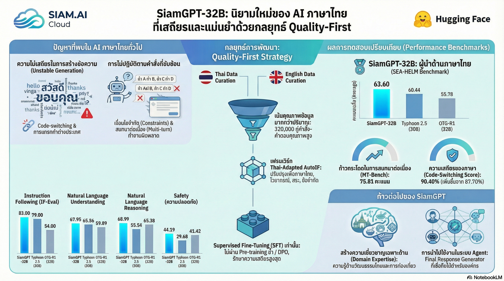

[กลับไปที่หน้าหลัก](../README.md)

สวัสดีครับเพื่อนๆ นักพัฒนา AI! วันนี้เรามาคุยกันเรื่อง SiamGPT-32B โมเดลภาษาไทยที่กำลังสร้างความฮือฮากันในวงการ AI

หลังจากที่เราได้เห็นการพัฒนาของ AI โมเดลภาษาต่างๆ มาอย่างต่อเนื่อง ไม่ว่าจะเป็น GPT, Claude, Gemini หรือแม้แต่โมเดลโอเพนซอร์สอย่าง Qwen และ Gemma ที่เก่งมากในภาษาอังกฤษ แต่พอมาใช้กับภาษาไทย... ปัญหาก็เกิดขึ้นเต็มๆ ครับ!

========================================

ย้อนดูปัญหาเดิมๆ: ทำไม AI ถึงพูดภาษาไทยไม่เป็น?

เรามาทบทวนกันสั้นๆ ก่อนว่าปัญหาที่ AI ภาษาไทยเจออะไรบ้าง:

▪ พูดไทยคำคำอื่นคำ: บางครั้งอ่านแล้วงงว่ามันพูดอะไร ประโยคไม่เชื่อมกัน
▪ Code-switching แบบบังคับ: แทรกภาษาจีนหรืออักษรแปลกปลอมเข้ามาดื้อๆ ทำให้อ่านแล้วสับสน
▪ ชื่อเฉพาะผิดเพี้ยน: ชื่อแบรนด์ ชื่อบุคคล ชื่อสถานที่ เพี้ยนไปจนกู่ไม่กลับ

ปัญหาเหล่านี้ทำให้ธุรกิจที่อยากเอา AI ไปใช้งานจริงหน้าตาองค์กรลังเล เพราะกลัวว่าลูกค้าจะเจอข้อความแปลกๆ แล้วเสียภาพลักษณ์

แต่... ล่าสุด SiamGPT-32B มาพร้อมกับแนวคิดที่สวนกระแสหลักอย่างน่าสนใจ นั่นก็คือ "Quality-First" หรือเน้นคุณภาพมากกว่าปริมาณ!

วันนี้เรามาดูกันว่า SiamGPT-32B ทำอะไรได้บ้าง และทำไมถึงสร้างความแตกต่างได้ขนาดนี้

========================================

1. กลยุทธ์ "น้อยแต่เป๊ะ": เมื่อคุณภาพชนะปริมาณ

หัวใจสำคัญของ SiamGPT-32B คือการใช้กลยุทธ์ "Quality-First" ครับ แทนที่จะไปตามกระแสที่ทุกคนพูดถึงการใช้ข้อมูลขนาดมหาศาล (Terabytes ของข้อมูล) ทีม SiamGPT กลับเลือกเดินในทางที่ต่างออกไป

=== Minimalist Recipe คืออะไร? ===

ทีมพัฒนาใช้สิ่งที่เรียกว่า "Minimalist, Pareto-optimal corpus" ซึ่งแปลง่ายๆ คือ "ชุดข้อมูลที่คัดสรรมาแล้วว่าให้ผลลัพธ์ดีที่สุดในสัดส่วนที่น้อยที่สุด"

ลองนึกภาพว่า แทนที่จะมีข้อมูล 1 ล้านประโยค แต่มีแค่ 50% ที่มีคุณภาพ ทีม SiamGPT เลือกที่จะใช้แค่ 100,000 ประโยค แต่คุณภาพ 100% ทุกประโยค!

ชุดข้อมูลหลักที่ใช้:
▪ QuixiAI/SystemChat-2.0
▪ SiamAI_AutoIF

ทั้งสองชุดนี้มีความหนาแน่นของเหตุผล (Reasoning density) สูงมาก หมายความว่าข้อมูลแต่ละชิ้นมีการคิดวิเคราะห์และให้เหตุผลที่ดี ไม่ใช่แค่คำตอบสั้นๆ

=== การค้นพบที่น่าตกใจ: ยิ่งเยอะยิ่งแย่! ===

ส่วนที่น่าสนใจที่สุดคือผลจาก Ablation Studies (การทดลองเอาส่วนต่างๆ ออกดู) ทีมงานพบว่า:

"การเพิ่มปริมาณข้อมูลให้มากขึ้น กลับทำให้ความเสถียรและความสอดคล้องของโมเดลลดลงอย่างเห็นได้ชัด!"

นี่เป็นสิ่งที่ขัดกับความเชื่อเดิมๆ มากเลยครับ เราคิดว่ายิ่งมีข้อมูลเยอะยิ่งดี แต่ความจริงคือ ถ้าข้อมูลไม่มีคุณภาพ ยิ่งเยอะยิ่งทำให้โมเดลสับสน!

=== ทำไมไม่ใช้ DPO? ===

นอกจากนี้ ทีมงานยังพบว่าการใช้เทคนิค DPO (Direct Preference Optimization) ที่กำลังฮิตกันอยู่ แม้จะช่วยเรื่องการทำตามคำสั่งได้บ้าง แต่กลับทำให้สมรรถนะในมิติอื่นๆ เกิดการถดถอย (Regressions) อย่างน่ากังวล

เพราะเหตุนี้ SiamGPT-32B จึงเลือกใช้เพียง Supervised Fine-Tuning (SFT) บนชุดข้อมูลคุณภาพสูงเท่านั้น เพื่อรักษาความสะอาดและความแม่นยำของภาษาไว้ให้ได้มากที่สุด

=== เปรียบเทียบกับโลกจริง ===

ลองนึกภาพว่าคุณกำลังเรียนภาษาใหม่:

▸ วิธีที่ 1 (ปริมาณ): อ่านหนังสือ 100 เล่ม แต่มีแค่ 50 เล่มที่เขียนถูกต้อง อีก 50 เล่มเต็มไปด้วยไวยากรณ์ผิด
▸ วิธีที่ 2 (คุณภาพ): อ่านหนังสือ 20 เล่ม แต่ทั้ง 20 เล่มเขียนโดยครูภาษาที่เก่งจริง มีตัวอย่างประโยคที่ถูกต้องทุกประโยค

แน่นอนว่าวิธีที่ 2 จะทำให้คุณพูดภาษาได้ถูกต้องและเป็นธรรมชาติกว่ามาก!

========================================

2. ปราบอาการ "สับสนทางภาษา" ให้เป็น AI มืออาชีพ

สำหรับธุรกิจที่อยากเอา AI ไปใช้งานจริง ความท้าทายใหญ่ไม่ใช่แค่การที่ AI "คิดเลขเก่ง" หรือ "วางแพลนแม่น" แต่อยู่ที่การเป็น "Final Response Generator" หรือตัวแทนที่ส่งมอบคำตอบสุดท้ายให้กับลูกค้าอย่างมืออาชีพ

=== Code-Switching Score: ตัวชี้วัดความเสถียร ===

SiamGPT-32B ถูกปรับแต่งมาเพื่อแก้ปัญหาความไม่เสถียรโดยเฉพาะ โดยสามารถเพิ่มคะแนน Code-Switching Score ได้สูงถึง:

▪ Base Model (Qwen3-32B): 87.70
▪ SiamGPT-32B: 90.40

คะแนนนี้วัดอะไร? คะแนน Code-Switching วัดว่าโมเดลสามารถ "ยึดมั่น" กับภาษาที่กำลังพูดอยู่ได้ดีแค่ไหน โดยไม่แทรกภาษาอื่นเข้ามาโดยไม่จำเป็น

=== ทำไมสำคัญ? ===

ลองนึกภาพสถานการณ์นี้:

ลูกค้า: "ผมอยากทราบข้อมูลเกี่ยวกับบริษัท ABC Co., Ltd."

AI แบบเก่า: "บริษัท ABC 公司 เป็นบริษัทที่ตั้งอยู่ที่ 曼谷 และมีผลิตภัณฑ์ที่ดี"
(แทรกภาษาจีนเข้ามา ทำให้อ่านยาก และไม่น่าเชื่อถือ)

SiamGPT-32B: "บริษัท ABC Co., Ltd. เป็นบริษัทที่ตั้งอยู่ที่กรุงเทพมหานคร และมีผลิตภัณฑ์ที่มีคุณภาพสูง"
(พูดภาษาไทยได้สะอาด ไม่แทรกภาษาอื่น)

เห็นไหมครับว่าความแตกต่างทำให้ภาพลักษณ์ขององค์กรเปลี่ยนไปอย่างมาก!

=== ประโยชน์ในการใช้งานจริง ===

▸ ปกป้องชื่อเฉพาะ: ชื่อแบรนด์ ชื่อบุคคล ชื่อสถานที่ ออกมาถูกต้อง
▸ รักษาโทนการสนทนา: พูดจาเป็นมืออาชีพตลอด ไม่สลับภาษาแปลกๆ
▸ เพิ่มความน่าเชื่อถือ: ลูกค้ารู้สึกว่ากำลังคุยกับคนจริงๆ ไม่ใช่หุ่นยนต์

========================================

3. จากตอบครั้งเดียว สู่การสนทนาต่อเนื่อง

ความสำเร็จที่โดดเด่นที่สุดของ SiamGPT-32B คือการยกระดับจากการเป็นแค่ AI ที่ "ตอบคำถามทีละครั้ง" ไปสู่การสนทนาโต้ตอบที่ต่อเนื่องและไว้ใจได้

=== คะแนน SEA-MTBench: วัดความสามารถในการสนทนา ===

SEA-MTBench (Southeast Asia Multi-Turn Benchmark) เป็นมาตรฐานในการวัดว่าโมเดลสามารถสนทนาหลายรอบ (Multi-turn) ได้ดีแค่ไหน โดยคะแนนที่ได้มีการเปลี่ยนแปลงอย่างน่าทึ่ง:

▪ Qwen3-32B (Base Model): 57.94 คะแนน
▪ SiamGPT-32B: 75.81 คะแนน
▪ Typhoon 2.5 (ผู้นำตลาด): 76.16 คะแนน

นี่คือการกระโดดขึ้นไปเกือบ 18 คะแนน! และเกือบจะทัดเทียมกับ Typhoon 2.5 ซึ่งเป็นหนึ่งในผู้นำของวงการ AI ไทยในปัจจุบัน

=== Multi-turn Robustness คืออะไร? ===

Multi-turn Robustness หมายถึงความสามารถในการจดจำบริบทจากการสนทนาก่อนหน้า และตอบสนองได้อย่างเหมาะสม

ตัวอย่างการสนทนาหลายรอบ:

[รอบที่ 1]
ผู้ใช้: "บอกวิธีทำข้าวผัดหน่อย"
AI: "ข้าวผัดทำได้ง่ายครับ เริ่มจากตั้งกระทะใส่น้ำมัน..."

[รอบที่ 2]
ผู้ใช้: "ถ้าไม่มีไข่ล่ะ?"
AI ที่ดี: "ถ้าไม่มีไข่ สามารถทำข้าวผัดแบบไม่มีไข่ได้เลยครับ โดย..."
AI ที่แย่: "ไม่มีไข่อะไร? คุณถามเรื่องอะไรครับ?" (ลืมบริบท)

[รอบที่ 3]
ผู้ใช้: "ใส่ผักอะไรได้บ้าง?"
AI ที่ดี: "สำหรับข้าวผัดที่เรากำลังพูดถึง ใส่ผักได้เช่น..."
AI ที่แย่: "ผักสำหรับอาหารอะไรครับ?" (ลืมบริบทอีก)

SiamGPT-32B มีความแข็งแกร่งในการจดจำและตอบสนองบริบทแบบหลายรอบ ทำให้การสนทนารู้สึกเป็นธรรมชาติและไหลลื่น

========================================

4. Thai-Adapted AutoIF: การควบคุมความเป๊ะด้วยกฎเกณฑ์

อีกหนึ่งเทคนิคที่น่าสนใจมากคือการปรับปรุง AutoIF framework ให้เข้ากับบริบทไทยโดยเฉพาะ

=== AutoIF คืออะไร? ===

AutoIF (Automated Instruction Following) เป็นเฟรมเวิร์กที่ช่วยให้โมเดลสามารถทำตามคำสั่งได้แม่นยำขึ้น แต่ปัญหาคือ AutoIF เดิมออกแบบมาสำหรับภาษาอังกฤษ ภาษาไทยมีกฎเกณฑ์ที่ต่างออกไปมาก!

=== การปรับให้เข้ากับภาษาไทย ===

ทีม SiamGPT สร้าง Thai seed instructions 39 ชุด ที่เน้นเรื่อง:

▪ การวางสระ: สระอยู่ก่อนหรือหลังพยัญชนะ
▪ พยัญชนะ: การใช้ ก-ฮ อย่างถูกต้อง
▪ โครงสร้างไวยากรณ์: ประโยคไทยสร้างอย่างไร
▪ Orthographic correctness: การสะกดที่ถูกต้อง

=== Deterministic Verification: ตรวจสอบด้วยโปรแกรม ไม่ใช่ AI ===

สิ่งที่ทำให้เทคนิคนี้เหนือกว่าการเทรนทั่วไปคือการใช้ "Deterministic verification" ครับ

วิธีเก่า (LLM-as-a-judge):
▸ ให้ AI ตัวหนึ่งมาตรวจคะแนน AI อีกตัว
▸ ปัญหา: AI ตัวตรวจอาจมีความลำเอียง หรืออาจจะผิดเองด้วยซ้ำ!

วิธีใหม่ (Executable scripts):
▸ เขียนโปรแกรม (Scripts) ที่มีกฎเกณฑ์ชัดเจน
▸ ตรวจสอบความถูกต้องตามกฎที่ตั้งไว้อย่างเข้มงวด
▸ ไม่มีความลำเอียง ตรวจได้ซ้ำได้เสมอ

ตัวอย่าง:
▸ กฎ: "ถ้าคำลงท้ายด้วย 'ะ' ต้องไม่มีตัวสะกด"
▸ โปรแกรมจะตรวจว่า AI เขียนคำที่ลงท้าย 'ะ' ถูกต้องหรือไม่
▸ ผิด → ไม่ผ่าน, ถูก → ผ่าน (ไม่มีเทา)

=== ผลลัพธ์: คะแนนสูงสุดในกลุ่ม ===

ด้วยเทคนิคนี้ SiamGPT-32B ได้คะแนน SEA-IFEval ที่ 83.00 ซึ่งสูงที่สุดในกลุ่มโมเดลขนาด 30B-32B!

SEA-IFEval วัดความสามารถในการทำตามคำสั่ง (Instruction Following) เช่น:
▸ "เขียนบทความ 5 ย่อหน้า โดยย่อหน้าละไม่เกิน 100 คำ"
▸ "สรุปข้อความนี้ให้เหลือ 3 ประโยค"
▸ "เขียนโค้ด Python ที่มี comment อธิบายทุกบรรทัด"

SiamGPT-32B สามารถทำตามคำสั่งเหล่านี้ได้แม่นยำมาก!

========================================

สรุป: Trade-off ที่คุ้มค่าเพื่อความเสถียร

ปัจจุบัน SiamGPT-32B คือโมเดลที่ครองแชมป์คะแนนเฉลี่ยสูงสุดในกลุ่ม 30B-32B บน SEA-HELM Leaderboard

แต่... เราต้องซื่อสัตย์กับข้อมูลนะครับ ไม่มีอะไรที่สมบูรณ์แบบ 100%

=== ข้อแลกเปลี่ยน (Trade-off) ===

ทีมพัฒนาเลือกที่จะแลกความลื่นไหลในงานแปลหรืองานสร้างสรรค์ (NLG - Natural Language Generation) เพื่อให้ได้ความเสถียรระดับโปร

คะแนน NLG (Natural Language Generation):
▪ SiamGPT-32B: 42.06
▪ Typhoon 2.5: 56.70

NLG วัดอะไร? วัดความสามารถในการสร้างข้อความที่ "สละสลวย" "ไหลลื่น" เช่น:
▸ การแปลภาษา
▸ การเขียนเรื่องสั้น
▸ การเขียนบทกวี
▸ การบรรยายอารมณ์

=== แล้วเราควรเลือกอะไร? ===

มันขึ้นอยู่กับว่าคุณต้องการใช้ AI ทำอะไรครับ:

[กรณีที่เหมาะกับ SiamGPT-32B]
▸ งานธุรกิจที่ต้องการความเสถียรสูง
▸ Customer Service ที่ต้องตอบลูกค้าอย่างมืออาชีพ
▸ งาน Agent ที่ความผิดพลาดเท่ากับศูนย์
▸ การทำตามคำสั่งที่ต้องแม่นยำ

[กรณีที่อาจเหมาะกับโมเดลอื่น]
▸ งานแปลภาษาที่ต้องการความสละสลวย
▸ งานเขียนสร้างสรรค์เช่นนิยาย บทกวี
▸ งานที่ต้องการ "อารมณ์" ในข้อความ

=== บทเรียนสำคัญ ===

SiamGPT-32B พิสูจน์ให้เห็นว่า:

[1] การสร้าง AI ภาษาไทยที่มีเสถียรภาพสูง ไม่จำเป็นต้องพึ่งพา:
▸ การขยายขนาดข้อมูลมหาศาล
▸ การเทรนซ้ำ (Continual Pretraining)

[2] เพียงแค่การขัดเกลาข้อมูลให้คมและเข้มงวดด้วยกฎเกณฑ์ ก็เพียงพอแล้วที่จะแก้ปัญหาพื้นฐานที่ AI ไทยเผชิญมาตลอด

[3] บางครั้ง "น้อยแต่แม่น" ดีกว่า "เยอะแต่เละ"

========================================

ก้าวต่อไป: เพิ่มความรอบรู้ทางวัฒนธรรมไทย

ก้าวต่อไปของ SiamGPT คือการบรรจุ "ความรอบรู้ทางวัฒนธรรมไทย" (Thai Cultural Knowledge) ลงไปในตัวโมเดล เช่น:

▪ ประเพณีไทย: รู้เรื่องสงกรานต์ ลอยกระทง ไหว้พระ
▪ อาหารไทย: เข้าใจว่า "แกงเขียวหวาน" คืออะไร ผัดไทยต้องมีอะไรบ้าง
▪ สำนวนไทย: เข้าใจคำว่า "ขึ้นบ้านใหม่" "ถึงคราวผู้ใหญ่" หมายถึงอะไร
▪ ความเข้าใจบริบททางสังคม: รู้จักการใช้คำสุภาพ "ครับ/ค่ะ" ที่เหมาะสม

เพื่อให้มันกลายเป็น Native Expert อย่างแท้จริง!

========================================

คำถามท้ายทาย

สุดท้ายนี้ ผมอยากทิ้งคำถามไว้ให้คิดครับ:

"ในโลกที่ AI แข่งกันสะสมข้อมูลมหาศาล คุณภาพของข้อมูลเพียงหยิบมือที่คัดสรรมาอย่างดี หรือปริมาณข้อมูลจากอินเทอร์เน็ต อะไรกันแน่ที่จะพา AI ไทยไปได้ไกลและมั่นคงกว่ากัน?"

คำตอบอาจจะไม่มีใครรู้แน่ชัด แต่ SiamGPT-32B กำลังพิสูจน์ให้เห็นว่า "คุณภาพ" เป็นหนทางที่น่าสนใจมากๆ เลยทีเดียว!

========================================

อ้างอิง:
• Technical Report: SiamGPT-32B
• SEA-HELM Leaderboard
• QuixiAI/SystemChat-2.0
• Thai-Adapted AutoIF Framework

หวังว่าบทความนี้จะเป็นประโยชน์สำหรับทุกคนที่สนใจ AI ภาษาไทยนะครับ! ถ้ามีคำถามหรืออยากคุยเพิ่มเติม ก็ comment ได้เลยครับ 😊

