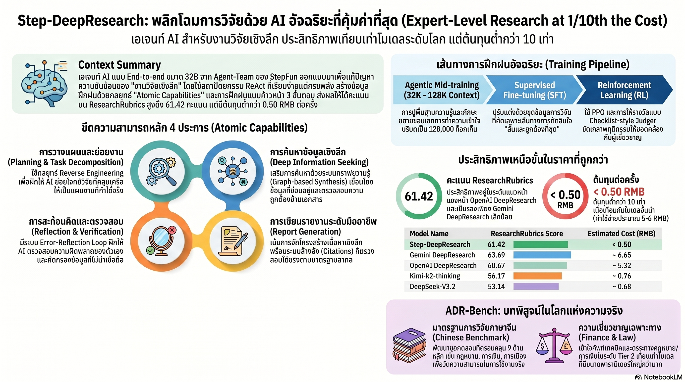

[กลับไปที่หน้าหลัก](../README.md)

สวัสดีครับเพื่อนๆ ที่สนใจ AI! วันนี้มาเรื่องที่อาจจะทำให้คุณมองงานวิจัยด้วย AI ในแบบที่ต่างออกไปโดยสิ้นเชิงครับ

คุณเคยนึกสงสัยไหมครับว่า เวลาเราให้ ChatGPT หรือ AI ไปหาข้อมูลมา แล้วได้ลิงก์มาร้อยกว่าลิงก์ สรุปเนื้อหาหน้าเว็บมาสิบหน้า นั่นคือ "การวิจัย" จริงๆ หรือเปล่า?

คุณเคยสงสัยไหมครับว่า โมเดล AI ที่มีพารามิเตอร์แค่ 32,000 ล้านตัว จะเอาชนะโมเดลของ OpenAI ที่ใช้งบพัฒนาหลักพันล้านดอลลาร์ได้อย่างไร?

และคุณรู้ไหมครับว่า มีโมเดล AI ที่ทำรายงานวิจัยคุณภาพสูงได้ในราคาแค่ 0.50 หยวน (ประมาณ 2-3 บาท) ขณะที่คู่แข่งชั้นนำเก็บ 5-6 หยวนต่อรายงาน?

StepFun เพิ่งเผยแพร่ Step-DeepResearch โมเดลที่ท้าทายความเชื่อเดิมว่า "ยิ่งใหญ่ยิ่งฉลาด" และพิสูจน์ว่าวิธีฝึกที่ถูกต้องสำคัญกว่าขนาดโมเดลครับ

========================================

🤔 ทบทวนความเชื่อเดิมๆ: สิ่งที่เราคิดเกี่ยวกับ AI กับการวิจัย

▪ "AI ที่ดีต้องมีพารามิเตอร์มหาศาล ยิ่งใหญ่ยิ่งฉลาด" → Step-DeepResearch ใช้แค่ 32B พารามิเตอร์แต่เอาชนะ OpenAI DeepResearch และไล่บี้ Gemini DeepResearch บน Benchmark ระดับโลก

▪ "AI ที่ Search ข้อมูลได้เยอะ = AI ที่วิจัยได้ดี" → Search คือการหาลิงก์ Research คือการสังเคราะห์ความรู้ สองอย่างนี้ต่างกันโดยสิ้นเชิง และ AI ส่วนใหญ่ยังทำแค่อย่างแรกครับ

▪ "AI ที่แพงกว่าย่อมดีกว่า ถ้าจะจ่ายเงินก็ต้องจ่ายให้ OpenAI หรือ Google" → ต้นทุนต่อรายงานของ Step-DeepResearch ต่ำกว่า OpenAI ถึง 10 เท่า และต่ำกว่า Gemini ถึง 13 เท่า แต่คะแนนใกล้เคียงกันมาก

▪ "ระบบ Multi-agent ที่ซับซ้อนย่อมให้ผลดีกว่า Agent ตัวเดียว" → งานวิจัยนี้พิสูจน์ว่า Single-agent ที่ถูกฝึกมาดีกว่า ทำงานลื่นไหลและแม่นยำกว่า Multi-agent ที่ซับซ้อนแต่ขาดความรู้ฝังตัว

ความจริงที่น่าคิดคือ: ยุคที่ "ขนาดโมเดล" เป็นตัวบ่งชี้ความสามารถหลักกำลังสิ้นสุดลง ยุคของ "วิธีฝึก" และ "โครงสร้างความสามารถ" กำลังเริ่มต้นครับ

========================================

🧠 พื้นฐานที่ต้องเข้าใจก่อน: Deep Research, ReAct, Atomic Capabilities และ Benchmark

=== Search VS Research ต่างกันอย่างไร? ===

นี่คือแก่นของทั้งบทความครับ ลองดูความต่างให้ชัดก่อน:

[Search = การค้นหา]
▸ ป้อน Keyword → ได้ลิงก์และสรุปเนื้อหา
▸ ตอบคำถามแบบ "มีข้อมูลอยู่ที่ไหน?"
▸ เหมาะกับคำถามที่มีคำตอบตรงๆ อยู่ในเว็บ

[Research = การวิจัย]
▸ วิเคราะห์ → เปรียบเทียบ → สังเคราะห์ → สรุปเชิงกลยุทธ์
▸ ตอบคำถามแบบ "ข้อมูลเหล่านี้บอกเราว่าอะไร?"
▸ เหมาะกับปัญหาที่ซับซ้อน ข้อมูลขัดแย้งกัน ต้องตัดสินใจเชิงกลยุทธ์

เปรียบเทียบ: Search คือการไปห้องสมุดแล้วบอกว่าหนังสือเรื่องนี้อยู่ชั้นไหน Research คือการอ่านหนังสือหลายเล่มแล้วสรุปว่านักวิชาการส่วนใหญ่เห็นด้วยกับอะไร และมีมุมมองอะไรที่ยังขัดแย้งกันอยู่ครับ

=== ReAct-style Agent คืออะไร? ===

ReAct (Reasoning + Acting) = สถาปัตยกรรม AI ที่สลับระหว่างการ "คิด" และ "กระทำ" เป็นวงรอบต่อเนื่อง

เปรียบเทียบ: เหมือนนักสืบที่ทำงานแบบนี้: สังเกตหลักฐาน → คิดว่าหมายความว่าอะไร → ไปหาข้อมูลเพิ่ม → คิดอีกรอบ → ไปสัมภาษณ์พยาน → สรุป แทนที่จะแค่ Google แล้วส่งผลลัพธ์แรกที่เจอครับ

=== Atomic Capabilities คืออะไร? ===

Atomic Capabilities = ความสามารถพื้นฐานที่แยกออกเป็นส่วนย่อยๆ ที่ฝึกได้อย่างตรงเป้า

เปรียบเทียบ: แทนที่จะฝึกให้โมเดล "เก่งทุกอย่าง" แบบกว้างๆ นักวิจัยแยกความสามารถออกเป็น 4 ทักษะหลัก แล้วฝึกแต่ละทักษะอย่างเข้มข้น เหมือนนักกีฬาที่ฝึกความแข็งแกร่ง ความเร็ว ความแม่นยำ และการอ่านเกมแยกกัน แทนที่จะฝึกแบบ "เล่นเกมไปเรื่อยๆ" ครับ

=== ResearchRubrics คืออะไร? ===

ResearchRubrics = Benchmark ที่ออกแบบมาเพื่อวัดคุณภาพของ "รายงานวิจัย" ที่ AI สร้างขึ้น ไม่ใช่แค่ความถูกต้องของคำตอบสั้นๆ วัดทั้งความลึก, ความครอบคลุม, ความสอดคล้องของตรรกะ และคุณภาพการอ้างอิงครับ

========================================

1️⃣ โมเดล 32B ที่คว่ำ OpenAI: เมื่อ "วิธีฝึก" สำคัญกว่า "ขนาด"

=== ผลการทดสอบที่น่าตกใจ ===

บน ResearchRubrics ซึ่งเป็น Benchmark ระดับโลกที่วัดคุณภาพรายงานวิจัยแบบครอบคลุม:

[ผลลัพธ์ที่ใครก็ไม่คาดคิด]
▸ Gemini DeepResearch: 63.69 (อันดับ 1 ยังครองแชมป์)
▸ Step-DeepResearch: 61.42 (อันดับ 2 ตามหลังแค่ 2 คะแนน)
▸ OpenAI DeepResearch: 60.67 (อันดับ 3 ถูก Step แซงแล้ว!)
▸ Kimi-Researcher: 53.67 (ตามหลังมาก)

[ทำไมถึงน่าตกใจ?]
▸ Step-DeepResearch ใช้ฐาน Qwen2.5-32B ซึ่งเป็นโมเดลขนาดกลางที่ทุกคนเข้าถึงได้
▸ OpenAI และ Google ใช้งบพัฒนาโมเดลนับพันล้านดอลลาร์
▸ ช่องว่างคะแนนระหว่าง Step กับ OpenAI มีแค่ 0.75 คะแนนเท่านั้น!
▸ แต่ช่องว่างค่าใช้จ่ายต่างกัน 10 เท่า

เปรียบเทียบ: เหมือนทีมฟุตบอลสโมสรเล็กๆ ที่มีงบประมาณแค่ 1 ใน 10 ของ Real Madrid แต่เล่นแล้วแพ้แค่ 1 ประตู ความสำเร็จแบบนี้ไม่ได้มาจากงบ แต่มาจาก "ระบบการฝึก" ที่ถูกต้องครับ

=== นัยสำคัญสำหรับอุตสาหกรรม ===

ถ้าโมเดลขนาดกลางฝึกมาดีพอสามารถแข่งกับโมเดลยักษ์ได้ แสดงว่า:
▸ บริษัทเล็กและ Startup มีโอกาสมากขึ้นในการสร้าง AI ที่แข่งขันได้จริงๆ
▸ การลงทุนใน "วิธีฝึก" มีผลตอบแทนสูงกว่าการลงทุนใน "ขนาดโมเดล" ในหลายกรณี
▸ ยุค Arms Race ของการใช้พารามิเตอร์มากที่สุดอาจกำลังถึงจุดเปลี่ยน

========================================

2️⃣ จาก Token ถัดไป สู่ Action ถัดไป: การเปลี่ยนกระบวนทัศน์ของ AI

=== ปัญหาที่ซ่อนอยู่ใน AI ทั่วไป ===

AI ส่วนใหญ่ถูกฝึกให้ "ทำนายคำถัดไป" (Next Token Prediction) ซึ่งเหมาะกับการตอบคำถามสั้นๆ แต่ไม่เหมาะกับงานวิจัยระยะยาวที่ต้องวางแผน ตรวจสอบ และปรับทิศทางครับ

[ปัญหาที่งานวิจัยระบุ: Multi-hop QA Trap]
▸ AI ส่วนใหญ่เก่งที่การตอบคำถามหลายขั้นตอน เช่น "เมืองหลวงของประเทศที่มี GDP สูงสุดในเอเชียตะวันออกเฉียงใต้คือ?"
▸ แต่งานวิจัยจริงๆ ไม่ได้มีคำตอบที่ถูกต้องชัดเจน มีแต่ข้อมูลที่ขัดแย้งกัน มุมมองที่หลากหลาย และประเด็นที่ต้องชั่งน้ำหนัก

[สิ่งที่ Step-DeepResearch เปลี่ยน]
▸ แทนที่จะทำนาย "คำถัดไป" → ตัดสินใจว่า "จะทำอะไรถัดไป"
▸ แทนที่จะ Search แล้วสรุป → วางแผน → ค้นหา → ตรวจสอบข้ามแหล่ง → สังเคราะห์ → รายงาน
▸ ถ้าเส้นทางที่เลือกไม่นำไปสู่คำตอบที่ดี → กล้า "เริ่มต้นใหม่" แทนที่จะยืนกรานในทิศทางผิด

=== Single-agent VS Multi-agent: ทำไมง่ายกว่าถึงชนะ? ===

[Multi-agent Orchestration (วิธีที่หลายบริษัทใช้)]
▸ โมเดลหลายตัวทำงานประสานกัน แต่ละตัวเชี่ยวชาญงานต่างกัน
▸ ดูซับซ้อน ดูทรงพลัง แต่มีปัญหาเรื่องการส่งต่อข้อมูลระหว่างโมเดล และจุดอ่อนของแต่ละตัวสะสมกัน

[Single-agent ReAct (วิธีของ Step-DeepResearch)]
▸ Agent ตัวเดียวที่ฝึกมาให้มีความสามารถทุกอย่างในตัว
▸ ไม่มีปัญหา "Lost in translation" ระหว่างโมเดล
▸ ตัดสินใจได้เร็วกว่า ใช้ทรัพยากรน้อยกว่า และสอดคล้องกันตลอดกระบวนการ

เปรียบเทียบ: เหมือนผู้รับเหมาบ้านที่มีฝีมือครบทุกด้านในคนเดียว กับการจ้างช่างหลายคนมาทำงานร่วมกัน แบบแรกอาจดูน้อยกว่า แต่ทำงานได้ราบรื่นกว่ามาก เพราะไม่ต้องนัดหมาย ไม่ต้องส่งต่องาน ไม่ต้องรอใครครับ

========================================

3️⃣ สูตรลับ 3 เฟส: วิธีฝึกที่ทำให้โมเดลเล็กชนะโมเดลใหญ่

=== กลยุทธ์ Atomic Capabilities Data Synthesis ===

แทนที่จะหาข้อมูลฝึกมาเยอะๆ แบบสุ่ม StepFun แยกความสามารถออกเป็น 4 ทักษะหลัก แล้วฝึกแต่ละทักษะอย่างเข้มข้น:

[ทักษะที่ 1: Planning — วางแผนก่อนลงมือ]
▸ วิธีฝึก: Reverse Engineering Synthesis
▸ นำรายงานวิจัยคุณภาพสูง (Financial Reports, Academic Surveys) มาให้ AI "ย้อนรอย" ว่าถ้าจะสร้างงานระดับนี้ต้องวางแผนอย่างไร
▸ เหมือนการให้นักเรียนอ่านบทความที่เขียนดีมากแล้วถามว่า "คุณคิดว่าคนเขียนเริ่มต้นคิดอย่างไร?"

[ทักษะที่ 2: Information Seeking — สืบค้นอย่างชาญฉลาด]
▸ ไม่ใช่แค่ Google แต่ใช้ Knowledge Graphs (Wikidata5m / CN-DBpedia) เดิน "ตามเส้นเชื่อมต่อ" ของความรู้
▸ เหมือนการไม่แค่ถามคนหนึ่ง แต่ถามว่า "คนนี้รู้จักใครอีกที่รู้เรื่องนี้ดีกว่า?" แล้วตามไปถามต่อ
▸ วิธีนี้ช่วยค้นพบความสัมพันธ์ของข้อมูลที่ไม่ปรากฏในการ Search ทั่วไป

[ทักษะที่ 3: Reflection — ตรวจสอบตัวเองก่อนส่งงาน]
▸ ฝึกผ่าน Error-Reflection Loop: ให้โมเดลประเมินคำตอบของตัวเอง หาจุดอ่อน และปรับปรุง
▸ ที่สำคัญกว่านั้น: ฝึกให้ "กล้าเริ่มต้นใหม่" ถ้าทิศทางเดิมผิด ไม่ยึดติดกับงานที่ทำไปแล้ว
▸ เหมือนนักวิจัยที่ยอมทิ้ง Draft ทั้งหมดถ้ารู้ว่า Hypothesis เดิมผิดพลาด แทนที่จะดื้อรั้นแก้ไขปะผุ

[ทักษะที่ 4: Reporting — สังเคราะห์เป็นรายงานที่ใช้งานได้จริง]
▸ เปลี่ยนข้อมูลกระจัดกระจายให้เป็นรายงานที่มีตรรกะและโครงสร้างที่ชัดเจน
▸ ระบบ Citation ที่เข้มงวด อ้างอิงแหล่งที่มาได้ตรวจสอบได้
▸ ผู้อ่านต้องนำไปใช้ตัดสินใจได้จริง ไม่ใช่แค่อ่านแล้วรู้สึกว่า "ได้ข้อมูล"

=== 3 เฟสของการฝึก ===

[เฟส 1: Mid-training — ใส่ความรู้เฉพาะทางลงในโมเดล]
▸ ให้โมเดลเรียนรู้ Domain Knowledge ของงาน (กฎหมาย, การเงิน, วิทยาศาสตร์) ก่อนที่จะเริ่มฝึกทักษะ Agent
▸ เพราะถ้าโมเดลไม่รู้เรื่องพื้นฐาน ต่อให้ระบบ Workflow ดีแค่ไหน ผลลัพธ์ก็จะไม่ดีครับ

[เฟส 2: SFT — ฝึกด้วยตัวอย่างคุณภาพสูง]
▸ ใช้ข้อมูลที่สังเคราะห์ขึ้นจาก Atomic Capabilities แต่ละด้านฝึกโมเดล
▸ ทำให้โมเดลรู้ว่า "ควรทำอะไร" ในสถานการณ์ต่างๆ

[เฟส 3: RL — ปรับแต่งด้วย Reinforcement Learning]
▸ ให้รางวัลเมื่อรายงานที่สร้างออกมามีคุณภาพสูง ลงโทษเมื่อผลลัพธ์ไม่ดีพอ
▸ โมเดลค่อยๆ เรียนรู้ที่จะ "เลือก" กลยุทธ์ที่ได้ผลดีที่สุดสำหรับแต่ละสถานการณ์

เปรียบเทียบทั้ง 3 เฟส: เหมือนการฝึกทหาร เฟส 1 คือการเรียนในห้องเรียน (ความรู้พื้นฐาน) เฟส 2 คือการฝึกซ้อมตามสถานการณ์จำลอง และเฟส 3 คือการฝึกในสนามจริงพร้อม Feedback ว่าทำดีหรือไม่ดีครับ

========================================

4️⃣ เศรษฐศาสตร์ใหม่ของ AI: ต้นทุนต่ำกว่า 10 เท่า คุณภาพใกล้เคียงกัน

=== ตัวเลขที่เปลี่ยนสมการธุรกิจ ===

[เปรียบเทียบต้นทุนต่อรายงานวิจัย]
▸ Step-DeepResearch: ต่ำกว่า 0.50 หยวน (ประมาณ 2-3 บาท)
▸ OpenAI DeepResearch: ประมาณ 5.32 หยวน (แพงกว่า ~10 เท่า คะแนนต่ำกว่า)
▸ Gemini DeepResearch: ประมาณ 6.65 หยวน (แพงกว่า ~13 เท่า คะแนนสูงกว่านิดเดียว)
▸ Kimi-Researcher: ประมาณ 2.66 หยวน (แพงกว่า ~5 เท่า คะแนนต่ำกว่ามาก)

=== นัยสำคัญสำหรับองค์กร ===

[สถานการณ์จำลอง: บริษัทที่ต้องการรายงานวิจัย 1,000 ฉบับต่อปี]
▸ ใช้ OpenAI: ~5,320 หยวน = ราว 25,000 บาท
▸ ใช้ Step: ~500 หยวน = ราว 2,500 บาท
▸ ประหยัดได้ 22,500 บาทต่อปีในระดับ 1,000 รายงาน ถ้าต้องการหลายหมื่นรายงาน ตัวเลขนี้เพิ่มขึ้นแบบทวีคูณครับ

[Cost-Efficiency Frontier ที่เปลี่ยนไป]
▸ ก่อนหน้านี้: จ่ายแพงกว่า = ได้คุณภาพดีกว่า (เส้นตรง)
▸ ตอนนี้: จ่ายน้อยกว่า 10 เท่าแต่ได้คุณภาพใกล้เคียงกัน (เส้นโค้งที่เอื้อประโยชน์กับผู้ใช้)
▸ นี่คือสัญญาณว่าตลาด AI Research Tool กำลังเข้าสู่ช่วง Commoditization ครับ

เปรียบเทียบ: เหมือนยุคที่กล้องดิจิทัลแทนที่ฟิล์ม คุณภาพดีขึ้นแต่ต้นทุนต่อภาพลดลงแทบเป็นศูนย์ อุตสาหกรรมที่ยึดติดกับโมเดลต้นทุนสูงก็จะต้องเปลี่ยนแปลงตัวเองครับ

========================================

5️⃣ ADR-Bench และบทเรียนสำคัญ: Workflow ดีแค่ไหนก็ชดเชยความโง่ไม่ได้

=== Benchmark ใหม่สำหรับโลกความจริง ===

StepFun ไม่ได้แค่ทดสอบด้วย Benchmark ที่มีอยู่แล้ว แต่สร้าง ADR-Bench (Automated Deep Research Benchmark) ขึ้นมาใหม่เพื่อทดสอบสถานการณ์ที่ใกล้เคียงการใช้งานจริงมากขึ้น โดยเฉพาะในโดเมนที่ต้องการความแม่นยำสูงอย่างกฎหมายและการเงินครับ

[ทำไม ADR-Bench ถึงสำคัญ?]
▸ Benchmark ทั่วไปออกแบบมาวัดความฉลาดทั่วไป แต่งานวิจัยจริงๆ ต้องการความรู้เฉพาะทาง
▸ ADR-Bench ทดสอบว่าโมเดลสามารถวิจัยในโดเมนที่ซับซ้อนและมี Context เฉพาะตัวได้ไหม
▸ ทดสอบด้วยคำถามที่ต้องอาศัย Domain Knowledge จริงๆ ไม่ใช่แค่การค้นหาข้อมูลในเว็บ

=== ข้อสรุปที่สำคัญที่สุดจากงานวิจัยนี้ ===

งานวิจัยระบุชัดมากครับว่า "ระบบ Agentic Framework ไม่สามารถชดเชยความเขลาในตัวโมเดลได้"

แปลว่า: ถ้าโมเดลไม่รู้เรื่องกฎหมายพื้นฐาน ต่อให้ระบบ Workflow ซับซ้อนแค่ไหน Agent ประสานงานกันกี่ตัว ก็ไม่ช่วยให้วิจัยเรื่องกฎหมายได้ดีขึ้นครับ

[นัยสำหรับการออกแบบระบบ AI]
▸ ลงทุนใน Domain Knowledge (เฟส Mid-training) ก่อนออกแบบ Workflow
▸ "ปัญญา" ต้องมาก่อน "ระบบ" เสมอ
▸ Framework ที่ดีกับโมเดลที่โง่ = ผลลัพธ์แย่
▸ Framework ธรรมดากับโมเดลที่ฉลาดจริงๆ = ผลลัพธ์ดี

เปรียบเทียบ: เหมือนการให้เครื่องมือผ่าตัดที่ดีที่สุดในโลกกับคนที่ไม่ใช่หมอ เครื่องมือที่แพงและซับซ้อนไม่ช่วยให้ผลการผ่าตัดดีขึ้นเลย แต่ถ้าให้หมอที่เก่งจริงๆ แม้แต่เครื่องมือธรรมดาก็ยังผ่าตัดได้ดีกว่าครับ

========================================

🎯 สรุป: 5 บทเรียนจาก Step-DeepResearch

▸ ขนาดโมเดลไม่ใช่ทุกอย่าง: 32B ที่ฝึกมาดีเอาชนะโมเดลที่ใช้งบพัฒนาสูงกว่าหลายเท่าได้
▸ Search ≠ Research: AI ที่แท้จริงต้องวางแผน ตรวจสอบข้ามแหล่ง สังเคราะห์ และกล้าเริ่มใหม่
▸ Atomic Capabilities + 3 เฟส: ฝึกทักษะพื้นฐานให้แน่นก่อน แล้วค่อยรวมร่างเป็นระบบที่สมบูรณ์
▸ Cost-Efficiency ใหม่: คุณภาพใกล้เคียงกันในราคาต่ำกว่า 10-13 เท่า เปลี่ยนเศรษฐศาสตร์ของ AI Research
▸ Knowledge ก่อน Framework: Workflow ดีแค่ไหนก็ชดเชยโมเดลที่ขาดความรู้ไม่ได้

หลักการสำคัญ: "เมื่อกำแพงต้นทุนในการสร้าง Insight ระดับผู้เชี่ยวชาญลดลงเหลือเพียง 2-3 บาทต่อรายงาน และทุกคนเข้าถึงได้เพียงปลายนิ้ว มูลค่าของงานที่ 'แค่หาข้อมูล' จะหายไป แต่มูลค่าของงานที่ 'รู้ว่าจะถามอะไร และทำอะไรกับคำตอบ' จะเพิ่มขึ้นครับ"

========================================

💬 คำถามท้ายทาย

1. ถ้า AI สามารถวิจัยและสังเคราะห์รายงานคุณภาพสูงในราคา 2-3 บาทได้แล้ว งานของนักวิเคราะห์ นักวิจัย และที่ปรึกษาจะเปลี่ยนไปอย่างไร? ทักษะอะไรที่ยังมีคุณค่าที่ AI ทำแทนไม่ได้?

2. บทเรียนที่ว่า "Agentic Framework ไม่ชดเชยความเขลาในโมเดลได้" ใช้ได้กับมนุษย์ไหมครับ? ถ้าองค์กรมีกระบวนการทำงานที่ดีเยี่ยม แต่คนในองค์กรขาดความรู้เฉพาะทาง กระบวนการนั้นจะช่วยอะไรได้บ้าง?

3. ถ้าคุณเป็น CTO ของบริษัทที่กำลังจะลงทุนใน AI Research Tool ระหว่าง OpenAI DeepResearch ที่แพงกว่า 10 เท่า กับ Step-DeepResearch ที่คะแนนใกล้เคียงกันแต่ถูกกว่ามาก คุณจะตัดสินใจอย่างไร และปัจจัยอะไรที่ทำให้ราคาแพงกว่า 10 เท่ายังคุ้มค่าอยู่บ้างในบางกรณี?

4. Single-agent ที่ฝึกมาดีชนะ Multi-agent ที่ซับซ้อน บทเรียนนี้สะท้อนอะไรเกี่ยวกับการบริหารองค์กรของมนุษย์ไหม? ระหว่าง "คนเก่งคนเดียว" กับ "ทีมใหญ่ที่ประสานงานซับซ้อน" ในสถานการณ์ไหนที่แต่ละแบบจะได้เปรียบ?

========================================

References:
▸ Step-DeepResearch Technical Report — StepFun (arXiv)
▸ ResearchRubrics Benchmark — มาตรฐานวัดคุณภาพรายงานวิจัยของ AI
▸ ADR-Bench — Automated Deep Research Benchmark สร้างโดย StepFun สำหรับโดเมนกฎหมายและการเงิน
▸ Qwen2.5-32B-Base — โมเดลฐานที่ใช้พัฒนา Step-DeepResearch (Alibaba Cloud)
▸ ReAct: Synergizing Reasoning and Acting in Language Models — Yao et al., 2022
▸ Wikidata5m — Knowledge Graph ที่ใช้ในการฝึก Information Seeking
▸ CN-DBpedia — Knowledge Graph ภาษาจีนที่ใช้ในการฝึก

ในโลกที่ข้อมูลล้นเกิน ทักษะที่หายากที่สุดไม่ใช่การหาข้อมูล แต่คือการรู้ว่าข้อมูลไหนสำคัญ ถามคำถามอะไรให้ถูก และนำ Insight ไปสู่การตัดสินใจที่ดีกว่าครับ 💡

#StepDeepResearch #DeepResearch #AIResearch #LLM #ResearchAI #StepFun #Qwen #AIEfficiency #CostEfficiency #AIAgent
