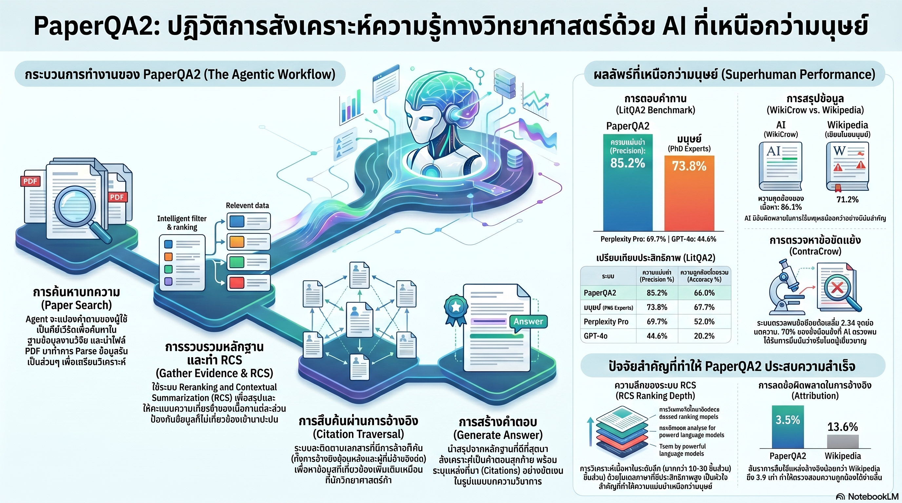

[กลับไปที่หน้าหลัก](../README.md)

สวัสดีครับเพื่อนๆ ที่ติดตามวงการ AI! วันนี้มาเรื่องที่พลิกโฉมคำถามพื้นฐานที่สุดของวงการวิชาการ: "AI เชื่อถือได้ไหมเมื่อต้องค้นหาความจริงทางวิทยาศาสตร์?" จากงานวิจัยของ FutureHouse ที่สร้าง PaperQA2 และพิสูจน์แล้วว่ามันสามารถตรวจสอบงานวิจัยวิทยาศาสตร์ได้แม่นยำเหนือกว่าผู้เชี่ยวชาญระดับปริญญาเอกเป็นครั้งแรกของโลกครับ

คุณเคยสงสัยไหมครับว่า ในเมื่อมีงานวิจัยใหม่ถูกตีพิมพ์ออกมานับล้านฉบับต่อปี ถึงจุดไหนที่ "สมองมนุษย์คนเดียว" จะไม่สามารถรู้ทันเนื้อหาในสาขาของตัวเองได้อีกต่อไป และ AI อาจเป็นคำตอบเดียวที่เหลืออยู่?

คุณรู้ไหมครับว่า เมื่อให้ PhD และ Postdoc ตอบคำถามจากงานวิจัยที่เพิ่งตีพิมพ์ใหม่ โดยให้ใช้อินเทอร์เน็ตได้ไม่จำกัดและมีเวลาหนึ่งสัปดาห์ พวกเขาทำความแม่นยำ (Precision) ได้เพียง 73.8% ในขณะที่ PaperQA2 ทำได้ 85.2% และใช้เวลาเพียงไม่กี่นาที?

และคุณเคยนึกไหมครับว่า ถ้า AI สามารถสแกนงานวิจัยหลายพันฉบับเพื่อค้นหา "จุดขัดแย้ง" ที่มนุษย์อ่านไม่ทันในชีวิตเดียว เราอาจเพิ่งค้นพบว่าวงการวิทยาศาสตร์มีข้อผิดพลาดซ่อนอยู่มากกว่าที่เคยคิดมาตลอดครับ?

งานวิจัย PaperQA2 กำลังพูดถึงความเปลี่ยนแปลงที่ใหญ่ที่สุดของกระบวนการทางวิทยาศาสตร์: จากโลกที่ "มนุษย์อ่านงานวิจัย" ไปสู่โลกที่ "AI อ่านแทนและฉลาดกว่า" ครับ

========================================

🤔 ทบทวนความเชื่อเดิมๆ: สิ่งที่เราคิดเกี่ยวกับ AI กับการวิจัยวิทยาศาสตร์

▪ "AI ใช้ค้นหาข้อมูลได้ แต่ไม่ควรเชื่อถือผลลัพธ์เพราะมันมักสร้างข้อมูลปลอม (Hallucinate)" → PaperQA2 พิสูจน์ว่าด้วย Architecture แบบ Agentic RAG ที่ออกแบบมาถูก AI สามารถตอบคำถามจากงานวิจัยจริงด้วย Precision 85.2% เหนือกว่า PhD ที่ทำได้ 73.8% และมีอัตรา Hallucination ต่ำกว่าการเขียนสารานุกรมโดยมนุษย์ครับ

▪ "Wikipedia ที่เขียนโดยมนุษย์ผู้เชี่ยวชาญย่อมแม่นยำและอ้างอิงถูกต้องกว่า AI ที่เพิ่งเรียนรู้ข้อมูลมา" → WikiCrow ซึ่งเป็นระบบ AI ที่เขียนบทความเกี่ยวกับยีนมนุษย์ทำ Precision ได้ 86.1% เหนือ Wikipedia เวอร์ชันมนุษย์ที่ 71.2% และมีอัตราการอ้างอิงผิดพลาดเพียง 13.5% เทียบกับมนุษย์ที่ผิดถึง 24.9% ครับ

▪ "การตรวจจับความขัดแย้งในงานวิจัยต้องอาศัยผู้เชี่ยวชาญเฉพาะทางที่เชี่ยวชาญสาขานั้นอย่างลึกซึ้ง AI ทำได้แค่สรุปเนื้อหา ไม่ใช่วิเคราะห์ความขัดแย้ง" → ContraCrow พบความขัดแย้งที่แท้จริงเฉลี่ย 1.64 จุดต่อบทความยีนหนึ่งบทความ โดยแม้แต่ผู้เชี่ยวชาญที่เป็นมนุษย์ยังยอมรับว่างานนี้คือ "ภารกิจที่ยากที่สุดเท่าที่เคยทำมา" ครับ

▪ "RAG (Retrieval-Augmented Generation) มาตรฐานก็เพียงพอแล้วสำหรับการค้นหาข้อมูลวิชาการ ไม่จำเป็นต้องซับซ้อนกว่านี้" → RAG มาตรฐานดึงแค่ Abstract และ Keyword Match ส่วน PaperQA2 ใช้ Agentic RAG ที่อ่าน Main Body จริง วางแผนการค้นหา และไล่ตาม Citation Network ทำให้ได้ข้อมูลที่ "ซ่อนอยู่ลึก" ซึ่ง RAG ธรรมดาไม่มีทางเห็นครับ

ความจริงที่น่าคิดคือ: ปัญหาของ AI ในการวิจัยที่ผ่านมาไม่ใช่ว่า "ฉลาดไม่พอ" แต่คือ "ใช้เครื่องมือผิด" เมื่อให้ AI วางแผนการค้นหาเองและอ่านเนื้อหาจริงๆ แทนที่จะแค่จับ Keyword ผลลัพธ์เปลี่ยนไปอย่างสิ้นเชิงครับ

========================================

🧠 พื้นฐานที่ต้องเข้าใจก่อน: LitQA2, Agentic RAG, Precision vs Accuracy และ Information Overload

=== LitQA2 คืออะไร? ===

LitQA2 = ชุดคำถามสุดหินที่ออกแบบเพื่อทดสอบกึ๋นนักวิทยาศาสตร์โดยเฉพาะ คำถามทุกข้อถูกออกแบบให้ตอบได้จากงานวิจัยที่ตีพิมพ์ไม่เกิน 36 เดือน ซึ่งใหม่เกินกว่าที่ AI ทั่วไปจะมีในข้อมูลฝึก และคำตอบไม่อยู่ใน Abstract แต่ซ่อนอยู่ในเนื้อหาหลัก (Main Body) ของงานวิจัยจริงๆ ครับ

ความยากของ LitQA2 คือมันทดสอบ "ผลลัพธ์ย่อยที่เฉพาะเจาะจง" ซึ่งต้องอ่านงานวิจัยจริงหลายฉบับเพื่อดึง "เข็มเล่มที่ถูกต้อง" ออกมาจากฟางกองมหาศาลครับ

=== Precision vs Accuracy ต่างกันอย่างไร? ===

[Precision (ความแม่นยำ)]
▸ วัดจาก: บรรดาคำตอบที่ AI ยอมตอบ มีกี่เปอร์เซ็นต์ที่ถูก?
▸ AI ที่มี Precision สูง = เลือกตอบเฉพาะเมื่อมั่นใจ ถ้าไม่มั่นใจจะยอมรับว่า "ไม่รู้"
▸ PaperQA2: 85.2%, PhD/Postdoc: 73.8%

[Accuracy (ความถูกต้องรวม)]
▸ วัดจาก: จากคำถามทั้งหมด ตอบถูกกี่เปอร์เซ็นต์ (รวมคำถามที่เลือกไม่ตอบ = ผิดทั้งหมด)
▸ PaperQA2: 66.0%, PhD/Postdoc: 67.7%
▸ Accuracy ที่ใกล้กันนี้ไม่ได้แปลว่าพอๆ กัน แต่แปลว่า AI "ระมัดระวังกว่า" คือตอบน้อยกว่าแต่ตอบถูกกว่าครับ

เปรียบเทียบ: เหมือนแพทย์ที่วินิจฉัยเฉพาะเมื่อมั่นใจ กับแพทย์ที่วินิจฉัยทุกเคส ตัวเลขรวมอาจใกล้กัน แต่คุณภาพของ "การวินิจฉัยที่ออกมา" ต่างกันมากครับ

=== Agentic RAG vs RAG มาตรฐาน ===

[RAG มาตรฐาน (Retrieval-Augmented Generation)]
▸ ทำงานแบบ: ค้นหา Keyword → ดึง Chunk ที่เกี่ยวข้อง → สรุปผล
▸ ปัญหา: จับได้แค่สิ่งที่ "ตรงกับ Keyword" ข้อมูลที่ซ่อนอยู่ลึกในเนื้อหาหลักมักหลุดรอดครับ

[Agentic RAG]
▸ ทำงานแบบ: วางแผนการค้นหา → อ่าน Main Body จริงๆ → ประเมินผล → วางแผนค้นต่อ → สรุป
▸ AI ตัดสินใจเองว่าจะค้นหาอะไรต่อ เหมือน "นักสืบ" ที่วิเคราะห์เบาะแสและเลือกทิศทางสืบสวนเองครับ

=== Information Overload ในวงการวิทยาศาสตร์ ===

ปัจจุบันมีงานวิจัยตีพิมพ์มากกว่า 5 ล้านฉบับต่อปีทั่วโลก นักวิจัยมนุษย์แม้จะอ่านตลอดชีวิตก็ตามทันได้ไม่เกิน 0.001% ของงานวิจัยในสาขาตัวเองครับ นี่คือเหตุผลที่ AI อ่านและสังเคราะห์งานวิจัยได้จึงไม่ใช่แค่ "ดีกว่า" แต่อาจเป็นความจำเป็นเพื่อความอยู่รอดของวิทยาศาสตร์ในยุคข้อมูลท่วมครับ

========================================

1️⃣ LitQA2: เมื่อ AI ตอบคำถามวิทยาศาสตร์ได้แม่นยำกว่า PhD

=== ชุดคำถามที่ออกแบบมาเพื่อให้ยากที่สุด ===

FutureHouse ออกแบบ LitQA2 โดยมีกฎสำคัญสองข้อ: คำถามทุกข้อต้องตอบได้จากงานวิจัยที่ตีพิมพ์ไม่เกิน 36 เดือน และคำตอบต้องซ่อนอยู่ใน Main Body ของงานวิจัย ไม่ใช่ใน Abstract หรือ Title ที่ใครๆ ก็อ่านครับ

ความท้าทายนี้หมายความว่า AI ไม่สามารถ "โกง" โดยอาศัยข้อมูลในข้อมูลฝึกได้ เพราะงานวิจัยใหม่เกินกว่าจะรู้มาก่อน และต้องอ่านเนื้อหาจริงๆ ไม่ใช่แค่สรุปจาก Abstract ครับ

[ผลการทดสอบ]
▸ PaperQA2 Precision: 85.2%
▸ PhD/Postdoc Precision: 73.8% (ใช้อินเทอร์เน็ตได้ไม่จำกัด + เวลา 1 สัปดาห์)
▸ ช่องว่าง: 11.4% โดย AI ใช้เวลาไม่กี่นาทีครับ

[ทำไม Precision จึงสำคัญกว่า Accuracy ในบริบทนี้]
▸ ในงานวิจัยวิทยาศาสตร์ "ตอบผิดอย่างมั่นใจ" อันตรายกว่า "ยอมรับว่าไม่รู้"
▸ PaperQA2 มี Accuracy 66.0% เทียบกับมนุษย์ 67.7% — ใกล้กัน
▸ แต่ PaperQA2 มี Precision 85.2% เทียบกับมนุษย์ 73.8% — ห่างกันมาก
▸ ความหมาย: เมื่อ AI ยืนยันว่า "รู้คำตอบ" คุณเชื่อถือมันได้มากกว่าที่จะเชื่อถือ PhD ในสัดส่วนที่ชัดเจนครับ

"Language model agents are now capable of exceeding domain experts across meaningful tasks on scientific literature." — ทีมวิจัย FutureHouse

เปรียบเทียบ: เหมือนนักสืบที่พูดน้อยแต่ทุกคำที่พูดออกมาล้วนมีหลักฐานรองรับ เทียบกับนักสืบที่พูดมากแต่ผิดบ้างถูกบ้าง ในการสืบสวนที่ผิดพลาดได้เพียงครั้งเดียวก็อาจจบชีวิต นักสืบคนแรกมีค่ามากกว่าครับ

========================================

2️⃣ WikiCrow: เมื่อ AI เขียนสารานุกรมได้แม่นยำและผิดพลาดน้อยกว่ามนุษย์

=== บทพิสูจน์ที่ตรงไปตรงมาที่สุด ===

ทีมงานทดลองให้ WikiCrow เขียนบทความเกี่ยวกับยีนมนุษย์ชุดเดียวกับที่มี Wikipedia เวอร์ชันมนุษย์อยู่แล้ว จากนั้นให้ผู้เชี่ยวชาญประเมินทั้งสองเวอร์ชันโดยไม่รู้ว่าอันไหนเป็น AI หรือมนุษย์ครับ

[ผลการเปรียบเทียบ]
▸ WikiCrow Precision: 86.1%
▸ Wikipedia มนุษย์ Precision: 71.2%
▸ ช่องว่าง: 14.9% ในทิศทางที่ AI เหนือกว่าครับ

[ประเภทของข้อผิดพลาด]
▸ Cited but unsupported (อ้างอิงแหล่งที่มาแต่เนื้อหาไม่ตรงกัน):
   → WikiCrow: 13.5%
   → Wikipedia มนุษย์: 24.9%
▸ Uncited (ไม่มีที่มา): AI ผิดพลาดน้อยกว่ามนุษย์ถึง 3.9 เท่า
▸ Reasoning Errors (ข้อผิดพลาดด้านการสรุปเหตุผล): AI น้อยกว่าอย่างเห็นได้ชัดในบริบทชีววิทยาครับ

[ทำไม AI จึงทำผิดน้อยกว่า?]
▸ มนุษย์มักจำสิ่งที่เคยอ่านมาและเขียนโดยไม่กลับไปตรวจแหล่งอ้างอิงทุกครั้ง
▸ AI ที่ออกแบบถูกต้องจะค้นหาหลักฐานใหม่ทุกครั้งก่อนเขียนประโยคแต่ละประโยค
▸ ความจำมนุษย์ดัดแปลงเนื้อหาโดยไม่รู้ตัว AI ไม่มีการ "ดัดแปลงโดยไม่รู้ตัว" แบบนั้นครับ

เปรียบเทียบ: เหมือนการเปรียบระหว่างนักข่าวที่จดจำสิ่งที่เห็นมาเขียน กับนักข่าวที่กลับไปดูวิดีโอต้นฉบับทุกครั้งก่อนพิมพ์ข้อความ คนหลังผิดพลาดน้อยกว่าไม่ใช่เพราะฉลาดกว่า แต่เพราะมีวินัยในกระบวนการมากกว่าครับ

=== นัยสำคัญ: วิกฤตของแหล่งอ้างอิงสาธารณะ ===

ถ้า Wikipedia ซึ่งเป็นฐานข้อมูลความรู้ที่มนุษย์ทั่วโลกใช้อ้างอิงมีอัตราการอ้างอิงผิดพลาดสูงกว่า AI ที่ออกแบบถูกต้อง นั่นหมายความว่าความรู้ที่เราสร้างสะสมมาในระบบปัจจุบันมีข้อผิดพลาดมากกว่าที่เราเคยตระหนักครับ

========================================

3️⃣ ContraCrow: นักสืบที่ค้นหาความขัดแย้งในกองเอกสารที่มนุษย์ไม่มีวันอ่านทัน

=== ภารกิจที่เกินขีดจำกัดมนุษย์คนเดียว ===

ContraCrow ถูกออกแบบมาเพื่อสแกนงานวิจัยเกี่ยวกับยีนมนุษย์แต่ละยีน และค้นหาจุดที่งานวิจัยฉบับต่างๆ "ขัดแย้งกันเอง" ซึ่งเป็นงานที่ต้องอ่านงานวิจัยนับพันฉบับพร้อมกันครับ

[ผลการทดสอบ ContraCrow]
▸ ความขัดแย้งที่พบเฉลี่ย: 2.34 จุดต่อบทความ
▸ ความขัดแย้งที่ได้รับการยืนยันจากผู้เชี่ยวชาญ: 1.64 จุดต่อบทความ
▸ อัตราการยืนยัน: ~70% ของสิ่งที่ AI ตั้งข้อสงสัยพิสูจน์ว่า "จริงและสำคัญ" ครับ

[ตัวอย่างความขัดแย้งที่ค้นพบ]
▸ ZNF804A: งานวิจัยฉบับหนึ่งระบุว่ายีนนี้ส่งผลดีต่อสมองของผู้ป่วยโรคจิตเภท (Schizophrenia) แต่งานวิจัยอีกฉบับระบุว่ามันเพิ่มความเสี่ยงของโรคแทน — ความขัดแย้งที่อยู่กลางวงการวิจัยโดยไม่มีใครสังเกตครับ
▸ LEF1: ความขัดแย้งในผลวิจัยเรื่องความสัมพันธ์ของยีนนี้กับอัตราการรอดชีวิตในผู้ป่วยมะเร็งลำไส้ใหญ่ (Colorectal Carcinoma) ที่งานวิจัยหลายฉบับให้ผลตรงข้ามกันครับ
▸ GBP Protein: ความขัดแย้งที่ AI ชี้ให้เห็นว่าไม่ใช่ความผิดพลาดของใคร แต่คือ "ธรรมชาติของการค้นพบทางวิทยาศาสตร์" ที่ความรู้ใหม่ปรับปรุงความรู้เดิมตลอดเวลาครับ

=== ทำไมการค้นหาความขัดแย้งจึงสำคัญ? ===

ในวงการวิทยาศาสตร์ ความขัดแย้งที่ไม่ได้รับการแก้ไขคือ "หนี้ทางความรู้" ที่สะสมอยู่ใต้ดิน ถ้าไม่มีใครพบมัน งานวิจัยอาจถูกนำไปใช้ต่อยอดในทิศที่ผิดครับ

เปรียบเทียบ: เหมือนผู้ตรวจสอบบัญชีที่อ่านบัญชีหลายร้อยบริษัทพร้อมกันเพื่อหาว่าตัวเลขชุดไหนขัดกัน งานที่มนุษย์คนเดียวทำได้แค่หนึ่งบริษัทต่อหนึ่งวัน แต่ AI ทำได้พันบริษัทพร้อมกันโดยไม่ล้าครับ

=== นัยสำคัญ: วิทยาศาสตร์ที่ซื่อสัตย์ต่อตัวเองมากขึ้น ===

เมื่อ AI สามารถค้นหาความขัดแย้งในวงการได้อย่างเป็นระบบ นั่นหมายความว่าวงการวิทยาศาสตร์จะมี "กระจก" สะท้อนจุดอ่อนของตัวเองที่ซื่อสัตย์กว่าเดิม ซึ่งในระยะยาวคือกลไกที่ทำให้วิทยาศาสตร์พัฒนาได้เร็วขึ้นครับ

========================================

4️⃣ Agentic RAG: เบื้องหลังความฉลาดที่ทำให้ PaperQA2 ต่างจาก AI ตัวอื่น

=== สองเทคนิคที่เปลี่ยนทุกอย่าง ===

ความสำเร็จของ PaperQA2 ไม่ได้มาจากการใช้ Language Model ที่ใหญ่กว่า แต่มาจากการออกแบบ "กระบวนการ" ที่ดีกว่าครับ

[RCS — Reranking and Contextual Summarization]

ปัญหาของ RAG มาตรฐาน: เมื่อดึงเนื้อหามาหลายร้อย Chunk Context Window เต็มและ AI ต้องประมวลผลข้อมูลดิบจำนวนมากที่มีสัญญาณรบกวนสูง

วิธีของ PaperQA2: ก่อนส่งเนื้อหาเข้า Context Window ระบบจะย่อยเนื้อหา 2,250 tokens แต่ละก้อนให้กลายเป็น "สรุปที่มีคุณภาพสูง" ก่อน ทำให้ Context Window เต็มไปด้วย "ข้อสรุปที่เลือกสรรแล้ว" แทนที่จะเต็มไปด้วยข้อมูลดิบ

เปรียบเทียบ: เหมือนที่ปรึกษาที่อ่านรายงาน 1,000 หน้าให้คุณก่อน แล้วสรุปเป็น Bullet Points ที่เลือกเฉพาะประเด็นที่เกี่ยวข้องกับคำถามของคุณ แทนที่จะให้คุณนั่งอ่านทั้ง 1,000 หน้าด้วยตัวเองครับ

[Citation Traversal — การแกะรอยตามเครือข่ายอ้างอิง]

การค้นหาแบบ Keyword ธรรมดาหาได้แค่งานวิจัยที่ "คล้ายชื่อ" กับสิ่งที่ถาม แต่ Citation Traversal ของ PaperQA2 ทำงานต่างออกไปครับ:

▸ Backward Traversal: ไล่ดู References ของงานวิจัยที่พบ ค้นหาต้นทางของข้อมูล
▸ Forward Traversal: ค้นหา Forward Citations ว่ามีใครอ้างอิงงานนี้ต่อบ้าง และผลลัพธ์เป็นอย่างไร
▸ ผลลัพธ์: AI พบงานวิจัยที่เกี่ยวข้องซึ่ง Keyword Search ไม่มีทางเห็น เพราะความสัมพันธ์เชื่อมโยงกันผ่านห่วงโซ่การอ้างอิง ไม่ใช่ความคล้ายของคำครับ

เปรียบเทียบ: เหมือนความต่างระหว่างการหาหนังสือโดยค้น Title ในห้องสมุด กับการหยิบหนังสือหนึ่งเล่ม แล้วไล่ตามชื่อที่ถูกอ้างอิงต่อกันไปเรื่อยๆ จนเจองานสำคัญที่ไม่มีในผลการค้นหาธรรมดาครับ

=== Agentic Loop: วางแผน → ค้นหา → ประเมิน → วางแผนต่อ ===

สิ่งที่ทำให้ PaperQA2 เป็น "Agentic" จริงๆ คือมันไม่ได้ค้นหาแค่รอบเดียว แต่ตัดสินใจเองว่าหลังจากได้ข้อมูลชุดแรกแล้วควรค้นหาอะไรต่อ ทำซ้ำจนมั่นใจพอที่จะตอบหรือยอมรับว่า "ไม่มีข้อมูลเพียงพอ" ครับ

นี่คือความต่างระหว่าง "เครื่องมือค้นหา" กับ "ผู้ช่วยวิจัยที่คิดได้เอง" ครับ

========================================

🎯 สรุป: จากโลกที่มนุษย์อ่านงานวิจัย สู่โลกที่ AI อ่านแทนและแม่นกว่า

PaperQA2 สรุปด้วย 4 ผลการค้นพบหลัก: LitQA2 พิสูจน์ว่า AI ทำ Precision ได้ 85.2% เหนือ PhD 73.8% โดยใช้เวลาไม่กี่นาทีแทนหนึ่งสัปดาห์, WikiCrow พิสูจน์ว่า AI เขียนสารานุกรมได้แม่นยำกว่า Wikipedia มนุษย์ (86.1% vs 71.2%) และอ้างอิงผิดพลาดน้อยกว่าเกือบครึ่ง, ContraCrow พบความขัดแย้งในงานวิจัยเฉลี่ย 1.64 จุดต่อยีนที่มนุษย์ไม่มีทางพบด้วยตัวคนเดียว, และ Agentic RAG ด้วย RCS + Citation Traversal คือกลไกที่ทำให้ทั้งหมดนี้เป็นไปได้ครับ

สิ่งที่งานวิจัยนี้เปิดเผยไม่ใช่แค่ว่า "AI ฉลาดขึ้น" แต่คือ "กระบวนการค้นหาความรู้ทางวิทยาศาสตร์กำลังเปลี่ยนไปโดยพื้นฐาน" เมื่อ AI สามารถอ่านและสังเคราะห์งานวิจัยได้แม่นยำกว่ามนุษย์ บทบาทของนักวิทยาศาสตร์จะเลื่อนจาก "ผู้อ่านและสรุป" ไปเป็น "ผู้ตั้งคำถามและตีความ" ครับ

========================================

💬 คำถามท้ายทาย: ลองคิดดูนะครับ

▪ ถ้า AI มี Precision สูงกว่า PhD ในการตอบคำถามจากงานวิจัยใหม่ แต่มี Accuracy ต่ำกว่านิดเดียว (เพราะเลือกที่จะ "ไม่รู้" มากกว่า) ในระบบ Peer Review ของวงการวิชาการ เราควรให้ AI มีบทบาทในการตรวจสอบงานวิจัยอย่างเป็นทางการได้ไหม และควรมีขอบเขตอย่างไรครับ?

▪ Wikipedia ถูกสร้างขึ้นบนหลักการว่า "ผู้เชี่ยวชาญมนุษย์ที่ช่วยกันเขียนให้ความรู้ที่เชื่อถือได้" แต่ถ้า WikiCrow เขียนได้แม่นยำกว่า เราควรแทนที่กระบวนการนั้นทั้งหมด หรือควรใช้ AI เป็นเครื่องมือตรวจสอบแทนครับ?

▪ ContraCrow พบความขัดแย้งในงานวิจัยเฉลี่ย 1.64 จุดต่อยีน ถ้าขยายไปยังทุกสาขาวิชา วิทยาศาสตร์โลกอาจมีความขัดแย้งที่ยังไม่ได้รับการแก้ไขเป็นล้านจุด การรู้ว่ามีความขัดแย้งเหล่านั้นอยู่จะทำให้เราเชื่อถือฐานความรู้ที่สะสมมาน้อยลงหรือมากขึ้นครับ?

▪ PaperQA2 ทำงานได้เพราะมีการออกแบบ "กระบวนการ" ที่ดี ไม่ใช่เพราะใช้โมเดลที่ใหญ่ที่สุด ถ้าเป็นเช่นนั้น ในระบบวิจัย AI ยุคหน้า ความได้เปรียบแข่งขันจะมาจาก "การออกแบบ Agentic Workflow" มากกว่า "การสร้าง Foundation Model ที่ใหญ่ขึ้น" ไหมครับ?

========================================

References:
- PaperQA2: Large Language Model Agentic Scientific Literature Search (FutureHouse)
- LitQA2 Benchmark: Scientific literature QA with obscure intermediate findings
- WikiCrow: AI-generated human gene articles vs. Wikipedia
- ContraCrow: Automated contradiction detection in scientific literature
- Key metrics: Precision 85.2% (PaperQA2) vs. 73.8% (PhD/Postdoc), Accuracy 66.0% vs. 67.7%
- WikiCrow vs. Wikipedia: Precision 86.1% vs. 71.2%, Cited unsupported 13.5% vs. 24.9%
- Techniques: Agentic RAG, RCS (Reranking and Contextual Summarization), Citation Traversal

ถ้าความท้าทายที่ยิ่งใหญ่ที่สุดของวิทยาศาสตร์ยุคนี้คือ "ข้อมูลมากเกินกว่าที่มนุษย์จะอ่านทัน" งานวิจัยนี้บอกเราว่าคำตอบอาจไม่ใช่ "อ่านให้เร็วขึ้น" แต่คือ "ยอมรับว่ามีผู้ช่วยที่อ่านได้แม่นกว่า" ครับ

#AI #ArtificialIntelligence #PaperQA2 #FutureHouse #AgenticRAG #ScientificResearch #LitQA2 #WikiCrow #ContraCrow #RAG #LLM #Research #AcademicAI #CitationTraversal #ScienceAI
