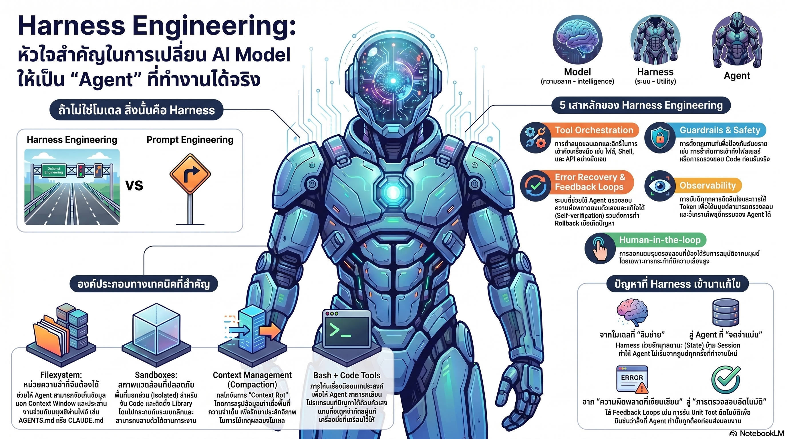

[กลับไปที่หน้าหลัก](../README.md)

สวัสดีครับเพื่อนๆ ที่ติดตามวงการ AI! วันนี้มาเรื่องที่ท้าทายความเชื่อพื้นฐานที่หลายคนยึดถือในการพัฒนา AI Agent จากมุมมองของ AI Systems Architect ที่เห็นว่าสิ่งที่คนส่วนใหญ่มองข้ามคือสิ่งที่สำคัญที่สุดครับ

คุณเคยสงสัยไหมครับว่า ทำไม AI Model ที่ทำคะแนน Benchmark ได้น่าทึ่งมาก กลับทำงานในระบบจริง (Production) ได้แย่กว่าที่คาดไว้ ล้มเหลวในจุดที่ไม่ควรพลาด หรือแม้แต่หยุดทำงานไปดื้อๆ เมื่อเจองานยาวเกินไป?

คุณรู้ไหมครับว่า โมเดลเดิมที่ไม่ได้อัปเกรดเลยแม้แต่บิตเดียว แค่ปรับปรุง "ระบบรอบๆ" มันสามารถเพิ่มประสิทธิภาพขึ้น +13.7pp ได้ทันทีบน Terminal Bench 2.0 ซึ่งมากกว่าการเปลี่ยนโมเดลใหม่ในหลายกรณี?

และคุณเคยนึกไหมครับว่า ทีมวิศวกรเพียง 3 คนสร้างโค้ดกว่า 1 ล้านบรรทัดได้ เพราะพวกเขาไม่ได้เขียนโค้ดเองเลย แต่ทุ่มเทออกแบบ "สภาพแวดล้อม" ที่ให้ AI เขียนแทนอย่างมีระเบียบและปลอดภัย?

สิ่งที่ทั้งหมดนี้ชี้ไปคือแนวคิด Harness Engineering และมันกำลังเปลี่ยนวิธีที่เราสร้าง AI Agent ทั้งหมดครับ

========================================

🤔 ทบทวนความเชื่อเดิมๆ: สิ่งที่เราคิดเกี่ยวกับ AI Agent และการพัฒนามัน

▪ "ถ้าอยากให้ AI ฉลาดขึ้น ต้องอัปเกรดโมเดลให้แพงขึ้นและใหญ่ขึ้นเท่านั้น" → Terminal Bench 2.0 พิสูจน์ตรงกันข้าม โมเดลเดิม + Self-verification loops + Loop detection ใน Harness = คะแนนเพิ่ม +13.7pp ทันที เพราะ Harness เพิ่มชั้น Deterministic Logic เข้าไปห่อหุ้มความไม่แน่นอนของโมเดลครับ

▪ "Prompt Engineering คือทักษะสำคัญที่สุดของยุค AI ใครเขียน Prompt เก่งคือได้เปรียบ" → Harness Engineering คือระดับถัดไปที่สูงกว่า Prompt Engineering คือคำสั่ง "เลี้ยวขวาที่สี่แยก" แต่ Harness Engineering คือการสร้าง "ถนน ราวกันอันตราย และระบบจราจรทั้งหมด" เพื่อให้รถทุกคันไปถึงเป้าหมายอย่างปลอดภัยครับ

▪ "Context Window ขนาดใหญ่ขึ้นแก้ปัญหา AI ทำงานยาวๆ ไม่ได้" → Context Rot ไม่ได้เกิดจากขนาด Context Window แต่เกิดจากการที่ข้อมูลที่ไม่จำเป็นสะสมอยู่จนรบกวนการใช้เหตุผล Harness ที่ดีต้องมี Compaction, Tool call offloading, และ Progressive Disclosure เพื่อรักษา "IQ" ของ Agent ให้คงที่ตลอดงานครับ

▪ "บทบาทวิศวกรซอฟต์แวร์จะหายไปเมื่อ AI เขียนโค้ดได้เอง" → บทบาทไม่ได้หายไปแต่เปลี่ยนรูปแบบ จากการเขียนโค้ดบรรทัดต่อบรรทัด เป็นการออกแบบ Environment ผ่าน AGENTS.md, Mechanical Invariants, และ Rigid Sandboxes ที่กำหนดกรอบให้ AI ทำงานได้อย่างถูกต้องและปลอดภัยครับ

ความจริงที่น่าคิดคือ: โมเดลคือ "ม้า" ที่มีพละกำลัง แต่ Harness คือ "บังเหียน อานม้า และเหล็กปาก" ที่ถ่ายโอนพลังนั้นสู่ทิศทางที่มีจุดหมาย ม้าที่เก่งที่สุดก็ไร้ประโยชน์ถ้าขาดอุปกรณ์ควบคุมครับ

========================================

🧠 พื้นฐานที่ต้องเข้าใจก่อน: Harness, Context Rot, Deterministic Layer และ Ralph Loops

=== Harness คืออะไร? ===

Harness (Martin Fowler) = เครื่องมือและแนวทางปฏิบัติที่ใช้ควบคุม AI Agent ให้ทำงานอยู่ในร่องในรอย

สมการหลัก: Agent = Model + Harness
▸ Model = ความฉลาด (Intelligence) ที่มีความไม่แน่นอน (Probabilistic)
▸ Harness = ระบบควบคุม (Utility) ที่เพิ่มความแน่นอน (Deterministic layer)
▸ ลำพัง Raw Model ไม่ใช่ Agent เพราะไม่มี State, ทำงานกับไฟล์ไม่ได้, และไม่มีกลไกตรวจสอบครับ

=== Context Rot คืออะไร? ===

Context Rot = ปรากฏการณ์ที่ความสามารถในการใช้เหตุผลของ AI เสื่อมลงเมื่อ Context Window สะสมข้อมูลที่ไม่จำเป็นมากขึ้นเรื่อยๆ

เปรียบเทียบ: เหมือนนักกีฬาที่ต้องทำงานหลายชั่วโมงโดยไม่มีการพักและล้างข้อมูลที่ไม่จำเป็นออก ฟอร์มจะตกลงเรื่อยๆ แม้ว่าร่างกายยังไม่ได้เปลี่ยนแปลงครับ

=== Deterministic Layer คืออะไร? ===

Deterministic Layer = ชั้นของ Logic ที่ "คาดเดาผลลัพธ์ได้แน่นอน" ที่ Harness เพิ่มเข้าไปรอบๆ โมเดล

เปรียบเทียบ: เหมือนระบบเบรค ABS ในรถยนต์ที่ไม่ว่าคนขับจะเหยียบเบรคแรงแค่ไหน ระบบจะควบคุมให้รถหยุดอย่างปลอดภัยเสมอ แม้ว่า "คนขับ" (โมเดล) จะไม่ได้สมบูรณ์แบบ 100% ครับ

=== Ralph Loops คืออะไร? ===

Ralph Loops = รูปแบบการทำงานใน Harness ที่ออกแบบมาสำหรับ Long-horizon Tasks

กลไก: Harness ดักจับเมื่อโมเดลพยายามจบงานก่อนเวลาหรือจบแบบผิดพลาด → ส่ง Prompt กลับเข้าไปใหม่ใน Clean context → บังคับให้ Agent ทำงานต่อจนบรรลุเป้าหมายจริง

เปรียบเทียบ: เหมือนหัวหน้างานที่คอยดักจับรายงานที่ยังไม่สมบูรณ์ก่อนส่งออกไป และส่งกลับให้แก้ไขในพื้นที่ทำงานที่สะอาดแทนที่จะปล่อยให้ผ่านครับ

=== Mechanical Invariants และ Progressive Disclosure ===

Mechanical Invariants = กฎเหล็กที่ตรวจสอบอัตโนมัติ (Linters, Type Checkers) ที่ AI ห้ามก้าวข้ามในระบบ CI

Progressive Disclosure = การส่งมอบเครื่องมือให้ AI เฉพาะที่จำเป็นในขั้นตอนนั้นๆ ไม่ใช่ส่งทั้งหมดพร้อมกัน

เปรียบเทียบ: เหมือนการสอนพนักงานใหม่ที่ให้ทำแค่ขั้นตอนที่ 1 ก่อน ไม่ใช่ส่งคู่มือ 500 หน้าทั้งเล่มตั้งแต่วันแรกครับ

========================================

1️⃣ Agent = Model + Harness: ทำไม Raw Model ถึงไม่ใช่ Agent

=== 3 สิ่งที่ Raw Model ขาด ===

เมื่อนำ AI Model มาใช้งานตรงๆ โดยไม่มี Harness มันจะล้มเหลวในปัญหาพื้นฐาน 3 ประการที่ไม่มีทางแก้ด้วยการปรับ Prompt เพียงอย่างเดียวครับ

[ปัญหาที่ 1: ไม่มีสถานะ (No State)]
▸ โมเดลจำไม่ได้ว่าทำอะไรไปใน Session ก่อนหน้า
▸ ทุกครั้งที่เรียกใช้คือการเริ่มต้นใหม่
▸ Harness แก้ด้วย Memory Layer ที่เชื่อมต่อ Session ครับ

[ปัญหาที่ 2: เข้าถึงโลกความจริงไม่ได้]
▸ ไม่สามารถทำงานกับไฟล์ฐานข้อมูลหรือระบบจริงได้ด้วยตัวเอง
▸ Harness แก้ด้วย Tool Integration และ Filesystem Collaboration ครับ

[ปัญหาที่ 3: ไม่มีกลไกตรวจสอบ]
▸ โมเดล Hallucinate ได้อย่างมั่นใจโดยไม่รู้ตัวว่าตัวเองผิด
▸ Harness แก้ด้วย Self-verification loops และ Loop detection ครับ

=== Vivek Trivedy และหลักการที่เปลี่ยนมุมมอง ===

"If you're not the model, you're the harness." — Vivek Trivedy, LangChain

ประโยคนี้หมายความว่า ในทุกระบบ AI ทุกคอมโพเนนต์ที่ไม่ใช่โมเดลล้วนเป็นส่วนหนึ่งของ Harness ทั้งสิ้น ตั้งแต่ Prompt Template, Memory System, Tool Integration, ไปจนถึง Retry Logic และ Error Handling ล้วนเป็น Harness ครับ

เปรียบเทียบ: เหมือนรถ Formula 1 ที่ทุกคนมัวโฟกัสที่เครื่องยนต์ แต่ความจริงคือระบบกันสะเทือน, อากาศพลศาสตร์, และยางต่างหากที่กำหนดว่าเครื่องยนต์นั้นจะแปลงเป็นความเร็วบนสนามจริงได้มากแค่ไหนครับ

========================================

2️⃣ Terminal Bench 2.0: หลักฐานที่พิสูจน์ว่า Harness สำคัญกว่า Model Upgrade

=== การทดสอบที่เปลี่ยนกระบวนทัศน์ ===

LangChain ทำการทดสอบที่ตอบคำถามสำคัญ: "ระหว่างอัปเกรดโมเดลกับปรับปรุง Harness อะไรคุ้มค่ากว่า?"

[ผลการทดสอบ Terminal Bench 2.0]
▸ เริ่มต้น: โมเดลเดิม + Harness ปกติ = 52.8%
▸ หลังปรับปรุง Harness: โมเดลเดิม + Harness ใหม่ = 66.5%
▸ ผลต่าง: +13.7pp โดยไม่ได้เปลี่ยนโมเดลแม้แต่บิตเดียวครับ

[สิ่งที่ Harness ใหม่เพิ่มเข้าไป]
▸ Self-verification loops: ให้ Agent ตรวจสอบงานตัวเองก่อนส่ง
▸ Loop detection: ตรวจจับเมื่อ Agent วนซ้ำโดยไม่คืบหน้า
▸ ไม่ใช่ Prompt ที่ยาวขึ้น แต่คือ Logic ที่แน่นอน (Deterministic) ที่เพิ่มเข้าไปครับ

=== นัยสำคัญต่อการลงทุน ===

บทเรียนนี้มีผลต่อการตัดสินใจเชิงธุรกิจโดยตรง

เปรียบเทียบ: เหมือนโรงงานที่แทนที่จะซื้อเครื่องจักรใหม่ที่แพงกว่า เลือกลงทุนใน "ระบบควบคุมคุณภาพ" (QC System) รอบๆ เครื่องจักรเดิม ได้ผลผลิตเพิ่มขึ้นในราคาที่ถูกกว่ามากครับ

สัญญาณที่ต้องระวัง: ถ้าองค์กรกำลังพิจารณาเปลี่ยนโมเดลใหม่เพราะ AI ทำงานไม่ได้เรื่อง ให้ถามก่อนว่า "เราได้ optimize Harness อย่างเต็มที่แล้วหรือยัง?" เพราะในหลายกรณีปัญหาอยู่ที่ระบบ ไม่ใช่สมองครับ

========================================

3️⃣ Context Rot: ศัตรูของ AI ระยะยาวและ 3 อาวุธที่ Harness ใช้รับมือ

=== ทำไม Context Rot ถึงเกิด ===

เมื่อ AI Agent ทำงานยาวๆ Context Window จะสะสมสิ่งที่ไม่จำเป็น เช่น ผลลัพธ์จาก Tool ที่ยาวเหยียด ประวัติการสนทนาซ้ำซ้อน และ Error messages ที่ผ่านไปแล้ว จน "สัญญาณ" ที่สำคัญถูก "สัญญาณรบกวน" กลบจนคิดไม่ออกครับ

=== อาวุธ 3 ชิ้นของ Harness ===

[อาวุธที่ 1: Compaction]
▸ เมื่อ Context ใกล้เต็ม Harness สรุปเนื้อหาสำคัญและล้างขยะออก
▸ Agent ทำงานต่อได้บน "บริบทที่สะอาด" แทนที่จะ Crash
▸ เปรียบเทียบ: เหมือนเลขาประชุมที่สรุปประเด็นสำคัญก่อนเริ่มรอบถัดไปแทนที่จะอ่านรายงานประชุมทั้งเล่มซ้ำครับ

[อาวุธที่ 2: Tool Call Offloading]
▸ ผลลัพธ์จาก Tool ที่ยาวเหยียดถูกย้ายไปเก็บในไฟล์แทน Context
▸ Agent เรียกอ่านได้ตอนต้องการ ไม่รบกวน "สมาธิ" ของโมเดล
▸ เปรียบเทียบ: เหมือนการจดบันทึกข้อมูลดิบลงสมุดแทนพยายามจำทุกตัวเลขในหัวครับ

[อาวุธที่ 3: Progressive Disclosure]
▸ ส่งมอบ Tool เฉพาะที่จำเป็นสำหรับขั้นตอนปัจจุบัน ไม่ใช่ส่งทั้งหมดพร้อมกัน
▸ ป้องกัน Agent สับสนจากตัวเลือกที่มากเกินไป (Choice Overload)
▸ เปรียบเทียบ: เหมือนเชฟที่เตรียมวัตถุดิบไว้บนโต๊ะทีละขั้นตอน ไม่ใช่เทวัตถุดิบทั้งครัวออกมาพร้อมกันครับ

========================================

4️⃣ Environment Design และ Ralph Loops: บทบาทใหม่ของวิศวกรในยุค AI

=== OpenAI Codex: 3 คนสร้าง 1 ล้านบรรทัด ===

ทีม OpenAI Codex เป็นตัวอย่างที่ชัดที่สุดว่า Environment Design ที่ดีสามารถคูณกำลังของทีมเล็กๆ ได้อย่างไร

[สิ่งที่ 3 วิศวกรทำแทนการเขียนโค้ด]
▸ AGENTS.md / CLAUDE.md: ไฟล์ "คู่มือพนักงาน" ที่บอก AI ว่ากฎเกณฑ์และวัฒนธรรมของโปรเจกต์คืออะไร ทำหน้าที่เป็น Long-term Memory ข้าม Session
▸ Mechanical Invariants: Linters และ Type Checkers ใน CI เป็น "กำแพงเหล็ก" ที่ AI ห้ามก้าวข้าม ให้ผลลัพธ์ Deterministic
▸ Rigid Sandboxes: พื้นที่ทดลองแยกส่วน (Isolation) ที่ความผิดพลาดของ AI ไม่สามารถกระจายสู่ระบบจริง

[ผลลัพธ์ที่น่าทึ่ง]
▸ วิศวกร 3 คน → โค้ดกว่า 1 ล้านบรรทัด
▸ เมื่อทีมขยายเป็น 7 คน ความเร็วยังคงสูงเพราะ Harness รับรองคุณภาพแทนมนุษย์
▸ Bash (General-purpose Tool) ทรงพลังกว่าเครื่องมือเฉพาะทางจำนวนมาก เพราะ AI สร้าง "เครื่องมือแก้ปัญหา" ขึ้นมาเองใน Sandbox ได้ครับ

=== Filesystem และ Ralph Loops ===

[Filesystem ในฐานะ Collaboration Surface]
▸ ไม่ใช่แค่ที่เก็บข้อมูล แต่คือ "โต๊ะทำงานร่วมกัน" ระหว่างมนุษย์และ AI
▸ Git เป็นตัวเชื่อมประสานที่ทำให้ติดตามงาน AI ได้ทุกย่างก้าว
▸ มนุษย์และ AI สามารถทำงานบนไฟล์เดียวกันแบบ Asynchronous ได้ครับ

[Ralph Loops สำหรับ Long-horizon Tasks]
▸ Harness ดักจับเมื่อ Agent พยายามจบงานก่อนเวลาหรือจบแบบผิดพลาด
▸ ส่ง Prompt กลับเข้าไปใน Clean context บังคับให้ทำงานต่อ
▸ เปรียบเทียบ: เหมือนการบ้านที่ครูส่งกลับมาให้แก้ไขในกระดาษสะอาด แทนที่จะปล่อยให้ผ่านแบบไม่สมบูรณ์ครับ

ผลลัพธ์รวม: งานที่ซับซ้อนและต้องใช้เวลาหลายวันสามารถดำเนินต่อได้อย่างต่อเนื่องข้าม Session โดย AGENTS.md ทำหน้าที่ "จดจำ" บริบทที่ Agent ต้องรู้แทนการต้องบอกใหม่ทุกครั้งครับ

========================================

🎯 สรุป: จาก Prompt Engineer สู่ Harness Engineer

โมเดลคือความฉลาด (Intelligence) แต่ Harness คือระบบที่ทำให้ความฉลาดนั้น "ใช้งานได้จริง" (Utility) Terminal Bench 2.0 พิสูจน์ +13.7pp จากโมเดลเดิม OpenAI Codex พิสูจน์ว่า 3 คนสร้าง 1 ล้านบรรทัดได้ และ Context Rot พิสูจน์ว่า Context Window ขนาดใหญ่ไม่ใช่คำตอบสุดท้าย

สิ่งที่น่าสนใจกว่าตัวเลขคือนัยต่อบทบาทของคนทำงานในยุค AI ครับ ถ้า Harness Engineering สำคัญกว่า Prompt Engineering และสำคัญพอๆ กับการเลือกโมเดล บทบาทที่ตลาดจะต้องการในอนาคตไม่ใช่ "คนที่ใช้ AI เก่ง" แต่คือ "คนที่ออกแบบระบบให้ AI ทำงานได้จริงในระดับ Production" ซึ่งต้องการความเข้าใจทั้ง Systems Design, Software Engineering และ AI Behavior พร้อมกันครับ

คำถามสุดท้ายที่น่าคิดคือ: ในขณะที่ทุกคนแย่งกันหา "ม้าตัวเร็วที่สุด" คุณกำลังฝึกม้า หรือกำลังสร้าง "อานและบังเหียน" ที่เปลี่ยนพลังของมันให้เป็นมูลค่าจริงครับ?

========================================

💬 คำถามท้ายทาย: ลองคิดดูนะครับ

▪ ถ้า Harness Engineering สามารถเพิ่มประสิทธิภาพ +13.7pp โดยไม่เปลี่ยนโมเดล องค์กรที่ยังโฟกัสที่การเลือกโมเดลราคาแพงที่สุดกำลังทำผิดพลาดเชิงกลยุทธ์หรือเปล่าครับ?

▪ Context Rot เป็นปัญหาของ AI แต่มนุษย์ก็มี "Context Rot" เหมือนกันเมื่อทำงานหลายชั่วโมงต่อเนื่อง เราควรออกแบบ "Harness สำหรับมนุษย์" อย่างไรเพื่อรักษาคุณภาพการตัดสินใจครับ?

▪ AGENTS.md ทำหน้าที่เป็น Long-term Memory ที่ AI อ่านได้ ถ้าเราต้องเขียน "AGENTS.md สำหรับตัวเอง" เพื่อสอน AI ที่จะมาทำงานแทนเรา เราจะเขียนอะไรลงไปในนั้นครับ?

▪ Vivek Trivedy บอกว่า "ถ้าคุณไม่ใช่โมเดล คุณก็คือ Harness" ถ้าจริง งานของ Software Engineer ในอนาคตคือการ "เป็น Harness" มากกว่าการ "สร้างโค้ด" — เราควรสอน Computer Science อย่างไรให้สอดคล้องกับความเป็นจริงนี้ครับ?

========================================

References:
- Martin Fowler — Definition of Agent Harness in Software Architecture
- LangChain — Terminal Bench 2.0 Evaluation (+13.7pp via Harness improvement)
- OpenAI Codex — Environment Design for AI-driven Software Development
- Vivek Trivedy (LangChain) — "If you're not the model, you're the harness"
- Ralph Loops Pattern — Long-horizon Task Completion via Context Injection

ถ้าในอดีตสงครามชนะด้วยอาวุธที่แหลมกว่า ในยุค AI สงครามชนะด้วยระบบที่ทำให้อาวุธนั้น "ยิงตรงเป้า" ได้มากกว่าครับ

#AI #ArtificialIntelligence #HarnessEngineering #AIAgent #LLM #PromptEngineering #SoftwareArchitecture #LangChain #ContextRot #EnvironmentDesign #AIProductivity #AgentDevelopment #MachineLearning #AIStrategy
