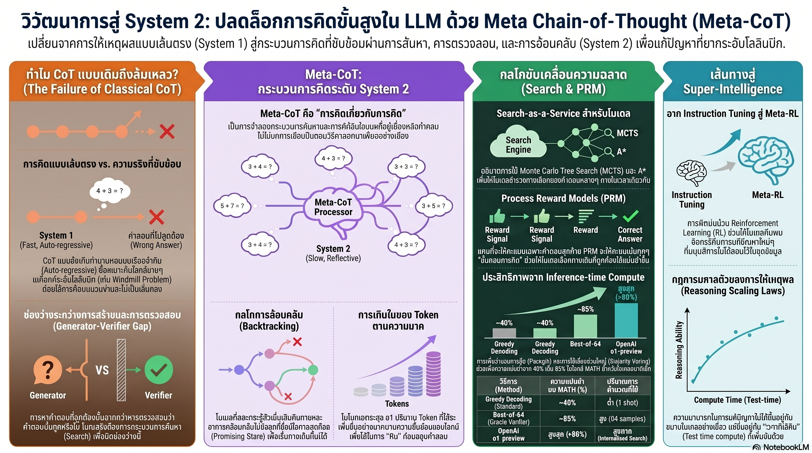

[กลับไปที่หน้าหลัก](../README.md)

สวัสดีครับเพื่อนๆ ที่ติดตามวงการ AI! วันนี้มาเรื่องที่เกี่ยวข้องกับทุกคนที่เคยสงสัยว่าทำไม AI ฉลาดมากแต่บางทีถึงพลาดในสิ่งที่ดูเหมือนง่ายๆ และทำไมโมเดลรุ่นใหม่อย่าง o1 หรือ DeepSeek-R1 ถึงแตกต่างจากรุ่นก่อนอย่างก้าวกระโดดครับ

คุณเคยให้ AI แก้โจทย์ที่ดูซับซ้อนแต่จริงๆ แล้วคำตอบเป็นค่าคงที่ แล้วมันพยายามคำนวณจนยุ่งเหยิงและตอบผิดไหมครับ? ทั้งที่ถ้า "หยุดคิดก่อน" แล้วจัดรูปสมการ ก็จะพบว่าคำตอบมันชัดเจนมากตั้งแต่แรก

คุณเคยสงสัยไหมครับว่า ทำไมนักคณิตศาสตร์โอลิมปิกถึงแก้โจทย์ยากๆ ได้ แต่ AI ที่จำสูตรได้ทุกสูตรในโลกกลับแก้ไม่ได้? ความแตกต่างอยู่ที่ "กระบวนการคิด" ไม่ใช่ "ความรู้"

และคุณรู้ไหมครับว่า กุญแจที่ทำให้ o1 และ DeepSeek-R1 ฉลาดขึ้นอย่างก้าวกระโดดไม่ได้อยู่ที่โมเดลใหญ่ขึ้น แต่อยู่ที่การยอมให้มัน "ลองผิดลองถูก" และ "ย้อนกลับมาแก้ตัวเอง" ได้ก่อนตอบ?

แนวคิดนี้มีชื่อว่า Meta Chain-of-Thought (Meta-CoT) และมันกำลังพาเราข้ามพ้นยุคของ AI ที่เป็นแค่ "เครื่องทำนายคำถัดไป" ไปสู่ AI ที่มี System 2 Reasoning ที่แท้จริงครับ

========================================

🤔 ทบทวนความเชื่อเดิมๆ: สิ่งที่เราคิดเกี่ยวกับ AI กับการคิด

▪ "AI ที่ดีต้องตอบเร็วและมั่นใจ ความลังเลคือจุดอ่อน" → งานวิจัยพบว่า o1 ที่ฉลาดที่สุดกลับแสดงพฤติกรรม "หยุด ทบทวน และเปลี่ยนทิศทาง" บ่อยมากในโจทย์ยาก การ Backtrack ไม่ใช่ความอ่อนแอ แต่คือสัญญาณของ System 2 ที่ทำงาน

▪ "AI ที่จำข้อมูลได้มากกว่าคือ AI ที่ฉลาดกว่า" → GPT-4o รู้สูตรคณิตศาสตร์มากกว่านักศึกษาป.ตรีทุกคนรวมกัน แต่ยังตกหลุมพรางของโจทย์ที่ต้องหยุดคิดก่อนจัดรูป ความรู้ ≠ กระบวนการคิด

▪ "Chain-of-Thought แบบเดิมก็เพียงพอแล้ว" → CoT แบบเดิมเรียนรู้จาก "เฉลยสวยงาม" ที่มีแต่ขั้นตอนที่ถูกต้อง แต่การแก้โจทย์จริงๆ ของมนุษย์เต็มไปด้วยทางตัน การย้อนกลับ และการลองผิดที่ถูกซ่อนไว้

▪ "ยิ่งโมเดลใหญ่ขึ้น AI จะฉลาดขึ้นตามสัดส่วน" → กฎการขยายตัวใหม่คือ Total Intelligence = Model Size × Training Data × Inference Compute การลงทุนใน "เวลาคิด" มีประสิทธิภาพไม่แพ้การลงทุนในขนาดโมเดลอีกต่อไปแล้ว

ความจริงที่น่าคิดคือ: AI ไม่ได้ขาดความรู้ แต่ขาด "กระบวนการจัดการความคิดตัวเอง" ที่มนุษย์พัฒนาขึ้นมาผ่านปีแห่งการลองผิดลองถูกครับ

========================================

🧠 พื้นฐานที่ต้องเข้าใจก่อน: System 1/2, CoT, Backtracking และ PRM

=== System 1 vs System 2 คืออะไร? ===

แนวคิดของ Daniel Kahneman นักจิตวิทยาเจ้าของรางวัลโนเบล แบ่งการคิดของมนุษย์ออกเป็น 2 ระบบ

[System 1] = คิดเร็ว อัตโนมัติ ใช้สัญชาตญาณ ไม่ต้องใช้ความพยายาม
▸ ตัวอย่าง: เห็นหน้าคนรู้จักแล้วจำชื่อได้ทันที, ขับรถในเส้นทางที่คุ้นเคย
▸ AI ในปัจจุบันส่วนใหญ่ทำงานแบบนี้ — ทำนายคำถัดไปจากสิ่งที่เห็น

[System 2] = คิดช้า มีตรรกะ ตรวจสอบตัวเอง ใช้ความพยายามสูง
▸ ตัวอย่าง: แก้โจทย์คณิตศาสตร์ใหม่ที่ไม่เคยเห็น, วางแผนกลยุทธ์ที่ซับซ้อน
▸ Meta-CoT พยายามสร้างระบบนี้ใน AI ครับ

=== Chain-of-Thought (CoT) คืออะไร? ===

CoT = การให้ AI "แสดงวิธีทำ" ทีละขั้นตอนแทนที่จะตอบตรงๆ

ปัญหาของ CoT แบบเดิม: ชุดข้อมูลฝึกมักเป็น "เฉลยสวยงาม" ที่แสดงเฉพาะขั้นตอนที่ถูกต้อง ราวกับหนังสือเฉลยท้ายเล่มที่ไม่มีรอยขีดฆ่า กระดาษร่าง หรือทางที่ลองแล้วผิดครับ

=== Meta-CoT คืออะไร? ===

Meta-CoT = การจำลอง "กระบวนการคิดที่แท้จริง" รวมถึงการลองผิดลองถูก การย้อนกลับ และการเปลี่ยนกลยุทธ์ระหว่างทาง

เปรียบเทียบ: ถ้า CoT คือ "เฉลยสวยงาม" ท้ายเล่ม Meta-CoT คือ "ถังขยะของนักคณิตศาสตร์ที่เต็มไปด้วยกระดาษร่างขยำทิ้ง" ซึ่งในกระดาษเหล่านั้นมีทั้งการคาดเดา การพิสูจน์ความผิดพลาด และจุดที่เปลี่ยนใจ — และนั่นแหละคือแก่นแท้ของการแก้ปัญหาครับ

=== Backtracking คืออะไร? ===

Backtracking = การที่ AI ตระหนักว่า "เดินผิดทาง" แล้วย้อนกลับมาเริ่มใหม่จากจุดที่ต่างออกไป แทนที่จะฝืนเดินต่อบนเส้นทางที่รู้ว่าผิด

ในทางเทคนิค ทำได้โดยใส่ Token พิเศษเช่น [BACK] ในกระบวนการคิด เพื่อบอกว่า "ยกเลิกแนวทางนี้และเริ่มใหม่" ครับ

=== Inference-time Compute คืออะไร? ===

Inference-time Compute = การยอมให้โมเดลใช้ทรัพยากรคำนวณ "มากขึ้น" ในช่วงที่กำลังตอบ แทนที่จะพุ่งตอบทันที

เปรียบเทียบ: เหมือนการยอมให้นักสอบใช้กระดาษร่างได้ไม่จำกัด แทนที่จะต้องเขียนคำตอบสุดท้ายลงกระดาษคำตอบโดยตรงครับ

=== Process Reward Model (PRM) คืออะไร? ===

PRM = ระบบที่ให้คะแนนทุกๆ ขั้นตอนของกระบวนการคิด ไม่ใช่แค่ผลลัพธ์สุดท้าย

[Outcome Reward] = ให้คะแนนแค่ว่า "คำตอบสุดท้ายถูกหรือผิด"
[Process Reward] = ให้คะแนนทุก Step ว่า "ขั้นตอนนี้สมเหตุสมผลไหม?" และนำทาง AI ให้หันกลับเมื่อคะแนน Step ต่ำ

เปรียบเทียบ: PRM ทำหน้าที่เหมือน GPS ที่คอยบอกว่า "ทิศทางนี้ถูกต้อง" หรือ "U-turn ตอนนี้" ในทุกๆ ฝีก้าวของการเดินทาง ไม่ใช่แค่บอกตอนถึงปลายทางว่า "คุณไปผิดที่" ครับ

========================================

1️⃣ Meta-CoT: เมื่อ AI เลิกเดินเป็นเส้นตรง และเริ่ม "รู้วิธีคิด"

=== หลุมพรางที่พิสูจน์ข้อจำกัดของ System 1 ===

ลองนึกถึงโจทย์นี้ครับ: หาค่าของ (x²-1)(x+1)/(x³-x) - 1/x เมื่อ x = π

โมเดลระดับท็อปอย่าง GPT-4o หรือ Claude 3.5 Sonnet ในโหมดปกติมักจะ "พุ่ง" ไปแทนค่า π ลงสมการทันที แล้วก็วนคำนวณจนยุ่งเหยิงและตอบผิด

แต่ถ้าหยุดจัดรูปก่อน จะพบว่า (x²-1)(x+1)/(x³-x) = (x-1)(x+1)(x+1) / x(x²-1) = (x+1)/x และเมื่อลบ 1/x ออกก็ได้ = 1 เสมอ ไม่ว่า x จะเป็นค่าใดก็ตาม ไม่ว่าจะเป็น π, √2 หรือ 999

นี่คือ System 1 ในงาน: เห็นตัวแปร → แทนค่าทันที → คำนวณอย่างยุ่งยาก System 2 จะหยุดตั้งคำถามก่อนว่า "รูปแบบของสมการบอกอะไรเรา?" ครับ

=== The Windmill Problem: โจทย์ที่ต้องการ "กระบวนการ" ไม่ใช่ "สูตร" ===

"Windmill Problem" จาก IMO 2011 คือตัวอย่างคลาสสิกที่พิสูจน์ว่า การแก้โจทย์ระดับโอลิมปิกไม่ใช่การดึงสูตรออกมาใช้

นักคณิตศาสตร์ระดับโลกต้องวาดรูป ลองสมมติฐาน ลองพิสูจน์ เจอที่ตัน กลับมา ลองอีก กระบวนการ "คิดในใจ" ที่ไม่เคยถูกบันทึกลงในตำรานี่แหละคือสิ่งที่ Meta-CoT พยายามจำลองครับ

=== Traditional CoT vs Meta-CoT ต่างกันอย่างไร? ===

[Traditional CoT]
▸ โครงสร้าง: เส้นตรง Step 1 → Step 2 → Step 3 → คำตอบ
▸ สิ่งที่แสดง: ขั้นตอนที่ถูกต้องเท่านั้น มุ่งสู่คำตอบโดยตรง
▸ เรียนรู้จาก: เฉลยสำเร็จรูปที่ขัดเกลามาแล้ว
▸ ความผิดพลาด: ถูกซ่อนไว้ ไม่ปรากฏในข้อมูลฝึก

[Meta-CoT]
▸ โครงสร้าง: ไม่เป็นเส้นตรง มีการสำรวจ หยุด และย้อนกลับ
▸ สิ่งที่แสดง: กระบวนการคิดจริงๆ รวมทั้งทางตันและการเปลี่ยนกลยุทธ์
▸ เรียนรู้จาก: "กระดาษร่างขยำทิ้ง" ที่มีทั้งถูกและผิด
▸ ความผิดพลาด: ถูกนำมาเรียนรู้และแก้ไขเป็นส่วนหนึ่งของกระบวนการ

เปรียบเทียบ: ดังภาษิต "สอนให้จับปลา ดีกว่าให้ปลา" การสอน AI ให้รู้ "วิธีจัดการกระบวนการคิดตัวเอง" สำคัญกว่าการให้มันจำชุดคำตอบที่ถูกต้องนับพันล้านข้อครับ

========================================

2️⃣ เบื้องหลัง o1: เมื่อ "ความลังเล" กลายเป็นจุดแข็ง

=== Inference-time Compute คือคำตอบที่ซ่อนอยู่ ===

ทำไม o1 และ DeepSeek-R1 ถึงฉลาดกว่าโมเดลรุ่นก่อนอย่างก้าวกระโดด ทั้งที่ขนาดโมเดลไม่ได้ใหญ่กว่าแบบก้าวกระโดด?

คำตอบอยู่ที่ Inference-time Compute — การยอมให้โมเดล "ใช้เวลาคิด" นานขึ้นก่อนตอบ แทนที่จะตอบเร็วที่สุดเท่าที่จะทำได้ครับ

=== สิ่งที่เห็นได้ใน o1 เมื่อแก้โจทย์ยาก ===

จากการสังเกต o1 บน MATH Benchmark ระดับ 4-5 พบพฤติกรรม In-context Search ที่ชัดเจน 3 อย่าง

[Inconsistent Flow]
▸ ความคิดไม่ไหลลื่นเป็นเส้นตรง
▸ มีการหยุดกะทันหันและเปลี่ยนทิศทาง
▸ ในโมเดล System 1 จะถูกมองว่า "ผิดปกติ" แต่ใน Meta-CoT นี่คือสัญญาณว่า "กำลังค้นหากลยุทธ์ที่ดีกว่า"

[Repetition]
▸ ทบทวนตรรกะเดิมซ้ำๆ เพื่อตรวจสอบความสอดคล้อง
▸ เหมือนการอ่านรายงานซ้ำก่อนส่ง ไม่ใช่ความไม่มั่นใจ แต่คือ Due Diligence

[Verification]
▸ หยุดเพื่อตรวจทานสิ่งที่เพิ่งเขียนไปก่อนเดินหน้าต่อ
▸ นี่คือ System 2 ที่ทำงาน: ตรวจสอบก่อน เดินต่อทีหลัง

=== ราคาที่ต้องจ่ายสำหรับความรอบคอบ ===

ความฉลาดนี้ไม่ได้มาฟรีครับ Tree Search ที่ซับซ้อน เช่น MCTS (Monte Carlo Tree Search) ในโจทย์เพียง 1 ข้อ อาจใช้ Token สูงถึง 20 ล้าน Token หรือคิดเป็นเงินประมาณ $100 ต่อคำตอบ

นี่คือข้อพิสูจน์ที่ชัดเจนว่า "ความรอบคอบ" มีต้นทุนที่ต้องจ่ายจริงๆ และการออกแบบระบบที่ใช้ Inference Compute อย่างชาญฉลาดคือโจทย์สำคัญที่วงการ AI กำลังแข่งกันแก้ครับ

========================================

3️⃣ Backtracking: เมื่อการ "ยอมรับผิด" คือกุญแจสู่ความถูกต้อง

=== Token [BACK]: การเปลี่ยนเส้นทางอย่างมีสติ ===

หนึ่งในนวัตกรรมที่สำคัญที่สุดของ Meta-CoT คือ Backtracking — การให้ AI ใส่ Token พิเศษ เช่น [BACK] เมื่อมันตระหนักว่ากำลังเดินบนเส้นทางที่ไม่ถูกต้อง

แทนที่จะฝืนเดินหน้าต่อด้วยตรรกะที่ผิด หรือวนซ้ำจนหาทางออกไม่ได้ AI จะ "ถอย" กลับมาจุดที่ตัดสินใจผิด แล้วเริ่มสำรวจเส้นทางใหม่ครับ

เปรียบเทียบ: เหมือนนักหมากรุกที่รู้ว่าตาที่ 15 ที่เดินไปนั้นพลาด แทนที่จะยืนยันการตัดสินใจเดิมด้วยการเดินต่อไป เขาวิเคราะห์ใหม่จากตาที่ 15 แล้วหาการเดินที่ดีกว่า แม้ว่ามันจะ "เสียเวลา" ก็ตามครับ

=== ตัวเลขที่พิสูจน์ความสำคัญ ===

จากการทดลองกับโมเดลขนาดเล็ก 124M Parameters

▸ ก่อน Backtracking: ความแม่นยำในโจทย์คณิตศาสตร์ยาก 78%
▸ หลัง Backtracking ด้วย [BACK] token: ความแม่นยำพุ่งขึ้นเป็น 94%

หมายเหตุสำคัญ: ตัวเลขนี้มาจากโมเดลขนาดเล็กในการพิสูจน์ทฤษฎี แต่นัยสำคัญคือ Self-awareness ระหว่างประมวลผล — การที่ AI ตระหนักรู้ถึงความผิดพลาดของตัวเองแบบ Realtime — คือกุญแจที่ System 1 ไม่มีและ System 2 ต้องการครับ

========================================

4️⃣ กฎการขยายตัวใหม่: ไม่ใช่แค่ "ใหญ่ขึ้น" แต่ต้อง "คิดมากขึ้น" ด้วย

=== สมการที่เปลี่ยนวิธีคิดของวงการ ===

ยุคเก่าเชื่อว่า AI จะเก่งขึ้นด้วยสมการ 2 ตัว: โมเดลใหญ่ + ข้อมูลเยอะ

ยุคใหม่ที่ Meta-CoT นำมาคือสมการ 3 ตัว

Total Intelligence = Model Size × Training Data × Inference Compute

ตัวแปรที่สามนี้คือสิ่งที่ทำให้ o1, DeepSeek-R1 และโมเดล Reasoning รุ่นใหม่ฉลาดขึ้นอย่างก้าวกระโดด โดยไม่ต้องพึ่งแค่การขยายขนาดครับ

=== Process Reward Model: GPS ประจำตัวของการคิด ===

ใน Inference Compute การ "ค้นหา" คำตอบที่ดีที่สุดไม่ใช่การสุ่มเดาไปเรื่อยๆ PRM ทำหน้าที่นำทางการค้นหานั้นอย่างชาญฉลาด

[Outcome Reward Model] = ให้คะแนนแค่ตอนจบ "คำตอบสุดท้ายถูกไหม?"
[Process Reward Model] = ให้คะแนนทุก Step "ขั้นตอนนี้สมเหตุสมผลไหม?"

เมื่อ AI เดินไปในทิศทางที่ PRM ให้คะแนนต่ำ มันจะย้อนกลับทันที แทนที่จะเดินต่อจนถึงทางตันแล้วค่อยรู้ว่าผิด

เปรียบเทียบ: เหมือนความต่างระหว่าง GPS ที่บอกว่า "คุณถึงจุดหมายแล้ว — แต่นี่ไม่ใช่ที่ที่คุณต้องการ" กับ GPS ที่บอกว่า "เลี้ยวซ้ายที่สี่แยกหน้า ทิศทางถูกต้องกว่า" ทุกๆ 100 เมตรครับ

========================================

🎯 สรุป: 4 บทเรียนจาก Meta-CoT

▸ System 2 ไม่ใช่ "ความช้า" แต่คือ "ความรอบคอบ": AI ที่หยุดตรวจสอบและเปลี่ยนทิศทางระหว่างทางไม่ได้อ่อนแอกว่า แต่ฉลาดกว่า AI ที่พุ่งตอบแบบมั่นใจ 100% ตลอดเวลา

▸ ความผิดพลาดมีคุณค่า: Backtracking และ [BACK] token ทำให้ AI เปลี่ยนความผิดพลาดระหว่างทางให้กลายเป็นข้อมูลที่นำทางไปสู่คำตอบที่ถูกต้อง แทนที่จะซ่อนมันไว้

▸ Inference Compute คือตัวแปรที่สามของ Scaling Law: ยุคต่อไปไม่ใช่แค่โมเดลใหญ่ขึ้น แต่คือโมเดลที่รู้ว่าเมื่อไหรควร "ใช้เวลาคิดมากขึ้น" สำหรับโจทย์ที่ต้องการมัน

▸ PRM คือ GPS ที่ขาดไม่ได้: การให้คะแนนทุก Step ของกระบวนการคิดทำให้การค้นหาคำตอบมีทิศทาง ไม่ใช่การเดินสุ่มไปเรื่อยๆ จนโชคดีเจอทางออก

หลักการสำคัญ: "AI ที่ฉลาดในระดับ Super-intelligence ไม่ได้เกิดจากการจำคำตอบมากที่สุด แต่เกิดจากการมีกระบวนการที่รู้ว่าเมื่อไหรควรหยุด เมื่อไหรควรถอย และเมื่อไหรควรลองใหม่ ซึ่งเป็นสิ่งที่มนุษย์เรียกว่า 'ปัญญา' มาตลอด" ครับ

========================================

💬 คำถามท้าทาย

1. System 2 Reasoning ที่ Meta-CoT สร้างขึ้นนั้นเป็น "การเลียนแบบ" กระบวนการคิดของมนุษย์จริงๆ หรือเป็นแค่ผลลัพธ์ที่ "ดูเหมือน" มนุษย์คิด? และความแตกต่างนั้นสำคัญไหมครับ ถ้าผลลัพธ์ที่ได้เหมือนกัน?

2. เมื่อ Inference Compute แพงถึง $100 ต่อคำตอบในโจทย์ที่ซับซ้อน มันหมายความว่า AI ที่คิดอย่างรอบคอบจะยังคงเป็นสิทธิพิเศษของผู้มีทุน ไม่ใช่เครื่องมือที่ทุกคนเข้าถึงได้เท่าเทียมกัน ช่องว่างนี้จะถูกแก้ไขได้อย่างไรครับ?

3. Backtracking ทำให้ AI "ยอมรับผิด" และเปลี่ยนเส้นทางได้ แต่ในสถานการณ์จริงที่ AI ต้องตัดสินใจที่ส่งผลต่อชีวิตคน (เช่น การวินิจฉัยโรค การตัดสินคดี) เราควรออกแบบระบบอย่างไรเพื่อให้การ Backtrack ของ AI มีความโปร่งใสและตรวจสอบได้ครับ?

4. ถ้า Total Intelligence = Model Size × Training Data × Inference Compute มีจุดที่ Inference Compute ให้ผลตอบแทนลดลง (Diminishing Returns) ไหม และถ้ามี เราจะรู้ได้อย่างไรว่าถึงจุดนั้นแล้วครับ?

========================================

References:
▸ งานวิจัย Meta Chain-of-Thought (Meta-CoT) — ทฤษฎีและการทดลองเกี่ยวกับ System 2 Reasoning ใน LLMs
▸ Daniel Kahneman — "Thinking, Fast and Slow" (2011) แหล่งที่มาของ System 1/System 2 Framework
▸ The Windmill Problem — IMO 2011 Problem 2, ตัวอย่าง Benchmark ระดับโอลิมปิก
▸ MATH Benchmark Level 4-5 — ชุดทดสอบที่ใช้สังเกตพฤติกรรม In-context Search ของ o1
▸ Backtracking Experiment: โมเดล 124M Parameters, ความแม่นยำจาก 78% → 94% ด้วย [BACK] Token
▸ MCTS (Monte Carlo Tree Search) — Tree Search ที่อาจใช้ถึง 20 ล้าน Token และ ~$100 ต่อโจทย์
▸ Process Reward Model (PRM) vs Outcome Reward Model — เปรียบเทียบการให้คะแนน Step-by-step กับคะแนนสุดท้าย

ในวันที่ AI ไม่ได้แค่ตอบเร็วแต่ตอบอย่างคิดหน้าคิดหลัง และพร้อม "ยอมรับผิดแล้วเริ่มใหม่" ได้เหมือนนักคิดที่ดี คำถามที่สำคัญกว่า "AI ฉลาดแค่ไหน?" อาจกลายเป็น "เราออกแบบ AI ให้รู้จัก 'ไม่รู้' ได้ดีพอไหม?" ครับ ⚡

#MetaCoT #System2Reasoning #InferenceCompute #Backtracking #ProcessRewardModel #LLM #AIResearch #DeepSeekR1 #OpenAI_o1 #AIThailand #ปัญญาประดิษฐ์ #MachineLearning #ReasoningAI #ScalingLaw #ChainOfThought
