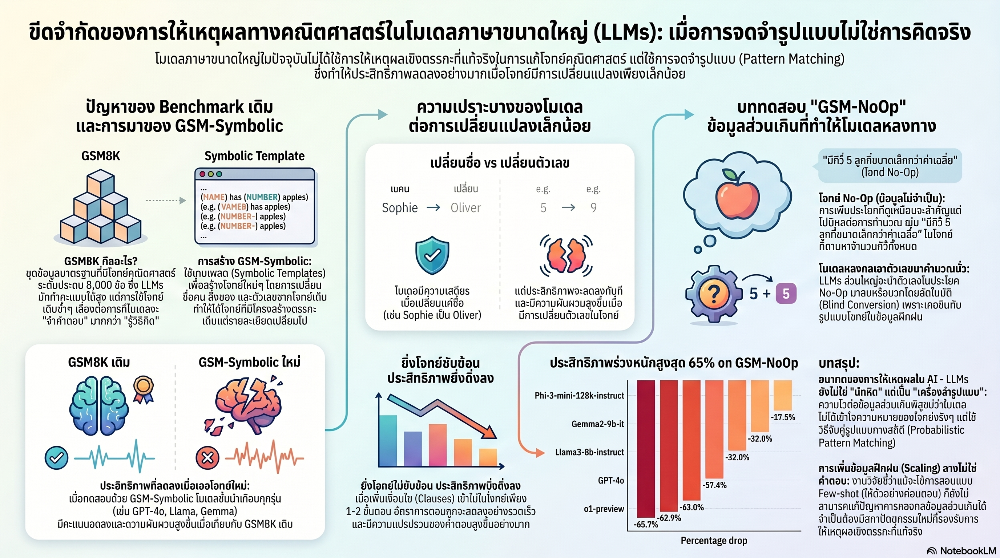

[กลับไปที่หน้าหลัก](../README.md)

สวัสดีครับเพื่อนๆ ที่ติดตามวงการ AI! วันนี้มาเรื่องที่ท้าทายคำถามพื้นฐานที่สุดว่า "AI เข้าใจ หรือแค่จำ?" จากงานวิจัย GSM-Symbolic ของ Apple ที่ใช้โจทย์เลขประถมเปิดโปงจุดอ่อนที่ซ่อนอยู่ใต้คะแนน Benchmark สวยหรูของ LLMs ครับ

คุณเคยสงสัยไหมครับว่า AI ที่ทำคะแนน GSM8K ได้เกิน 90% นั้น "เข้าใจ" คณิตศาสตร์จริงๆ หรือแค่จำรูปแบบโจทย์ที่เคยเห็นมาแล้วนำตัวเลขไปใส่ในสูตรที่จำได้?

คุณรู้ไหมครับว่า การเพิ่มประโยคที่ไม่มีผลต่อการคำนวณเลย เช่น "กีวี่ 5 ลูกมีขนาดเล็กกว่าค่าเฉลี่ย" ลงในโจทย์ธรรมดา ทำให้ Phi-3-mini ตกลงถึง 65% และแม้แต่ o1-preview ที่ขายจุดเด่นเรื่อง Reasoning ก็ยังตกลง 17.5%?

และคุณเคยนึกไหมครับว่า ถ้า AI "ใช้เหตุผลจริงๆ" การเปลี่ยนชื่อตัวละครจาก "Sophie" เป็น "Olivia" ในโจทย์เลขประถมไม่ควรเปลี่ยนคำตอบเลย แต่ความจริงคือ Gemma2-9B แกว่งถึง 12% และ Phi-3.5-mini แกว่งถึง 15% เพียงแค่เปลี่ยนชื่อครับ?

งานวิจัย GSM-Symbolic ของ Apple กำลังพูดถึงความแตกต่างที่สำคัญที่สุดในวงการ AI: ระหว่าง "ดูเหมือนฉลาด" กับ "คิดเป็นจริงๆ" ครับ

========================================

🤔 ทบทวนความเชื่อเดิมๆ: สิ่งที่เราคิดเกี่ยวกับความสามารถของ LLMs

▪ "AI ที่ทำคะแนน GSM8K สูงแสดงว่ามีความสามารถในการใช้เหตุผลทางคณิตศาสตร์จริงๆ" → GSM-Symbolic พิสูจน์ว่าคะแนน GSM8K ของโมเดลส่วนใหญ่สูงกว่าค่าเฉลี่ยของ GSM-Symbolic เกิน 1 Standard Deviation ซึ่งเป็น "Smoking Gun" ทางสถิติที่ชี้ไปที่ Data Contamination มากกว่า True Reasoning ครับ

▪ "โมเดลที่ใหม่กว่าและใหญ่กว่าจัดการข้อมูลส่วนเกินได้ดีกว่า เพราะมีความสามารถในการวิเคราะห์สูงกว่า" → o1-preview ที่ถูก Market เรื่อง Reasoning ก็ยังตกลง 17.5% เมื่อเจอ GSM-NoOp ส่วน Phi-3-mini ตกลงถึง 65% ไม่มีโมเดลใดที่ Immune ต่อ Irrelevant Information อย่างสมบูรณ์ครับ

▪ "ความแม่นยำของ AI ลดลงเป็นสัดส่วนกับความซับซ้อนของโจทย์ เพิ่มขั้นตอนหนึ่งลดความแม่นยำหนึ่งหน่วย" → Complexity Barrier แสดงว่าความแม่นยำตกแบบ Exponential ไม่ใช่ Linear เพิ่มเงื่อนไขเพียงนิดเดียวอาจทำให้ระบบ "พัง" ทันทีโดยไม่มีสัญญาณเตือนล่วงหน้าครับ

▪ "AI ทำโจทย์คณิตศาสตร์ได้ดีเพราะเข้าใจตัวเลขและความสัมพันธ์เชิงตรรกะ ไม่ใช่แค่จำ" → งานวิจัยพิสูจน์ว่า AI ใช้ Probabilistic Pattern Matching เป็นหลัก ดังนั้นเมื่อโจทย์เปลี่ยนไปนิดเดียวจนไม่ตรงกับ Pattern ที่จำมา ระบบก็สับสนทันทีแม้ตรรกะเบื้องหลังจะเหมือนเดิมทุกประการครับ

ความจริงที่น่าคิดคือ: ปัญหาของ AI ในปัจจุบันไม่ใช่ว่า "ไม่ฉลาดพอ" แต่คือ "ฉลาดผิดประเภท" สิ่งที่ดูเหมือนการใช้เหตุผลอาจเป็นแค่การจำที่แม่นยำมากพอจนแยกไม่ออกครับ

========================================

🧠 พื้นฐานที่ต้องเข้าใจก่อน: GSM8K vs GSM-Symbolic, Pattern Matching, Formal Reasoning และ Data Contamination

=== GSM8K คืออะไร? และ GSM-Symbolic ต่างกันอย่างไร? ===

GSM8K = ชุดโจทย์คณิตศาสตร์ระดับประถมที่ใช้เป็นมาตรฐานวัดความสามารถ AI มานาน ปัจจุบันโมเดลรุ่นท็อปทำคะแนนได้ 90%+

GSM-Symbolic = ระบบที่ Apple สร้างขึ้นเพื่อ Generate โจทย์ใหม่ที่มี "โครงสร้างตรรกะเหมือนกัน" กับ GSM8K แต่เปลี่ยนชื่อ ตัวเลข และบริบทออกไป

GSM-NoOp = ชุดโจทย์พิเศษที่เพิ่ม "ข้อมูลที่ดูเหมือนเกี่ยวข้องแต่ไม่มีผลต่อการคำนวณ" เข้าไปเพื่อทดสอบว่า AI อ่านโจทย์จริงหรือแค่เก็บตัวเลขทุกตัวมาใส่สูตรครับ

=== True Reasoning vs Probabilistic Pattern Matching ===

[True Reasoning (Formal Reasoning)]
▸ ใช้กฎตรรกะที่เป็นทางการอย่างเป็นขั้นตอน
▸ ผลลัพธ์ไม่ขึ้นกับ "รูปร่างหน้าตา" ของโจทย์ แต่ขึ้นกับโครงสร้างตรรกะ
▸ เปลี่ยนชื่อตัวละคร → ผลลัพธ์ไม่เปลี่ยน
▸ Variance = 0 เมื่อโครงสร้างตรรกะเหมือนกันครับ

[Probabilistic Pattern Matching]
▸ จำ "รูปแบบ" ที่เคยเห็นในข้อมูลฝึก
▸ ผลลัพธ์ขึ้นกับว่าโจทย์นี้ "คล้าย" กับอะไรที่เคยเห็นมากที่สุด
▸ เปลี่ยนชื่อตัวละคร → อาจหา Pattern ที่ตรงน้อยลง → คำตอบผิด
▸ Variance > 0 แม้โครงสร้างตรรกะเหมือนกันครับ

เปรียบเทียบ: เหมือนความต่างระหว่างนักคณิตศาสตร์ที่เข้าใจทฤษฎีบท กับนักเรียนที่ท่องจำตัวอย่างในหนังสือมาแล้วเอาตัวเลขไปแทน ถ้าโจทย์ใหม่ไม่เหมือนตัวอย่างพอ นักเรียนคนหลังจะตอบผิดครับ

=== Data Contamination คืออะไร? ===

Data Contamination = ภาวะที่โจทย์ทดสอบ (Benchmark) ถูกรวมอยู่ในข้อมูลฝึกของโมเดล ทำให้โมเดล "จำคำตอบ" แทนที่จะ "คิดคำตอบ"

ผลกระทบ: คะแนน Benchmark สูงเกินจริง ไม่สะท้อนความสามารถในการ Generalize ไปยังโจทย์ใหม่

เปรียบเทียบ: เหมือนนักเรียนที่ได้เห็นข้อสอบจริงก่อนสอบ ทำได้ 95% แต่พอเจอข้อสอบชุดใหม่ที่เนื้อหาเหมือนกันทุกอย่างแค่เปลี่ยนตัวเลข ทำได้แค่ 75% ส่วนต่าง 20% คือหลักฐานว่าท่องจำครับ

=== Standard Deviation ในฐานะหลักฐานทางสถิติ ===

ถ้าโมเดลทำ GSM8K ได้ 90% แต่ทำ GSM-Symbolic ได้ 78% คำถามคือ ช่องว่างนั้น "มากเกินไป" ไหม?

ทางสถิติ: ถ้าโจทย์ทั้งสองชุดมีความยากเท่ากัน คะแนนควรอยู่ใกล้เคียงกัน ถ้า GSM8K สูงกว่าค่าเฉลี่ยของ GSM-Symbolic มากกว่า 1 Standard Deviation อย่างสม่ำเสมอทุกโมเดล โอกาสที่มันจะเกิดขึ้นโดยบังเอิญมีน้อยมาก ซึ่งคือ "Smoking Gun" ที่ชี้ไปที่ Contamination ครับ

========================================

1️⃣ เปลี่ยนชื่อ + เปลี่ยนตัวเลข = ผลลัพธ์เปลี่ยน: Variance Test ที่เปิดโปงทุกอย่าง

=== หลักการพื้นฐาน: True Reasoner มี Variance = 0 ===

ถ้า AI เข้าใจตรรกะจริงๆ การเปลี่ยน "Sophie" เป็น "Olivia" หรือเปลี่ยน "31 บล็อก" เป็น "45 บล็อก" ไม่ควรทำให้คำตอบเปลี่ยน เพราะโครงสร้างตรรกะ "ถ้า A แล้ว B" ยังเหมือนเดิมทุกประการครับ

[การทดสอบของ Apple]
▸ สร้างชุดโจทย์ที่มีตรรกะเหมือนกัน 100% แต่เปลี่ยนชื่อ ตัวเลข และบริบท
▸ ทดสอบโมเดลหลายตัวกับโจทย์แต่ละ "Instance"
▸ วัดว่าคะแนน "แกว่ง" มากแค่ไหนระหว่าง Instance ต่างๆ ของโจทย์เดียวกัน

[ผลลัพธ์ที่น่าตกใจ]
▸ Gemma2-9B: Performance Gap ถึง 12% ระหว่าง Instance ที่ง่ายที่สุดกับยากที่สุด
▸ Phi-3.5-mini: Performance Gap ถึง 15%
▸ ทุกโมเดลที่ทดสอบมี Variance มากกว่าศูนย์ ไม่มีข้อยกเว้นครับ

[ความหมายของตัวเลขเหล่านี้]
▸ 12-15% Gap หมายความว่า โมเดลตอบผิดในโจทย์ที่มีตรรกะเหมือนกันเพียงเพราะ "ชื่อ" หรือ "ตัวเลข" ต่างกัน
▸ นั่นไม่ใช่การใช้เหตุผล แต่คือการ "จับรูปแบบ" ที่ผิดพลาดครับ

เปรียบเทียบ: เหมือนแพทย์ที่วินิจฉัยโรคได้ถูกต้องเมื่อผู้ป่วยชื่อ "สมชาย" แต่กลับวินิจฉัยผิดเมื่อผู้ป่วยชื่อ "สมศักดิ์" ทั้งที่อาการเหมือนกันทุกประการ นั่นไม่ใช่แพทย์ที่ใช้วิทยาศาสตร์การแพทย์ แต่คือแพทย์ที่จำรายชื่อผู้ป่วยเก่ามาครับ

========================================

2️⃣ GSM-NoOp: เมื่อ "ข้อมูลขยะ" หนึ่งประโยคทลาย AI ระดับท็อป

=== กีวี่ที่เล็กกว่าค่าเฉลี่ย: โจทย์ที่เปลี่ยนทุกอย่าง ===

นักวิจัย Apple เพิ่มสิ่งที่เรียกว่า "NoOp" (No Operation) ลงในโจทย์ปกติ ซึ่งคือข้อมูลที่ดูเหมือนเกี่ยวข้องแต่ไม่มีผลต่อการคำนวณจริงๆ ครับ

[ตัวอย่างโจทย์ GSM-NoOp]
▸ โจทย์เดิม: "Oliver เก็บกีวี่ 44 ลูกวันศุกร์, 58 ลูกวันเสาร์, วันอาทิตย์เป็นสองเท่าของวันศุกร์ รวมเท่าไร?"
▸ โจทย์ NoOp: "Oliver เก็บกีวี่ 44 ลูกวันศุกร์, 58 ลูกวันเสาร์, วันอาทิตย์เป็นสองเท่าของวันศุกร์ แต่มีกีวี่ 5 ลูกที่มีขนาดเล็กกว่าค่าเฉลี่ย รวมเท่าไร?"

[สิ่งที่ควรเกิดขึ้น]
▸ "ขนาดของกีวี่" ไม่มีผลต่อจำนวนรวม → ตอบเหมือนเดิม
▸ True Reasoner จะตัดข้อมูลนี้ทิ้งทันที

[สิ่งที่เกิดขึ้นจริง]
▸ โมเดลส่วนใหญ่ "สติหลุด" โดยเอาตัวเลข 5 ไปลบจากผลรวม
▸ เพราะ Pattern ที่จำมาบอกว่า "ตัวเลขในโจทย์มักต้องใช้ทุกตัว"

[ผลกระทบเชิงตัวเลข]
▸ Phi-3-mini: ประสิทธิภาพตกลง 65% (จาก Baseline)
▸ o1-preview: ตกลง 17.5% แม้จะเป็นโมเดลที่ขายความสามารถด้าน Reasoning

เปรียบเทียบ: เหมือนโจทย์คณิตศาสตร์ระดับประถมที่ใส่ "กับดัก" เพื่อทดสอบว่าเด็กอ่านโจทย์จริงหรือแค่เก็บตัวเลขทุกตัวมารวมกัน ที่น่าตกใจคือ AI ตกกับดักประถมนี้ในอัตราสูงกว่าที่คาดมากครับ

=== นัยสำคัญ: AI ที่ "ยัดตัวเลขทุกตัวเข้าสูตร" ===

รูปแบบที่พบคือโมเดลมีแนวโน้มนำตัวเลขทุกตัวที่เห็นในโจทย์มา "ยัด" เข้าไปในสมการ เพราะนั่นคือ Pattern ที่เคยสังเกตเห็นในข้อมูลฝึก: โจทย์คณิตศาสตร์ปกติมักใช้ตัวเลขทุกตัวที่กล่าวถึงครับ

เมื่อโจทย์มีตัวเลขที่ไม่ต้องใช้ ระบบไม่ได้ "คิด" ว่าตัวเลขนั้นเกี่ยวข้องหรือไม่ แต่ "เดา" ตาม Pattern ที่เคยได้ผลมาก่อนครับ

========================================

3️⃣ Complexity Barrier: เมื่อโจทย์ยาวขึ้นนิดเดียว AI พังทันที

=== Exponential Drop ที่ไม่มีสัญญาณเตือน ===

งานวิจัยทดสอบโมเดลกับโจทย์ที่มีความซับซ้อนเพิ่มขึ้นเป็นลำดับ ตั้งแต่ GSM-M1 (1 ขั้นตอนพิเศษ) ไปถึง GSM-P2 (2 ขั้นตอนพิเศษ)

[สิ่งที่คาดหวัง]
▸ เพิ่ม 1 ขั้นตอน → ความแม่นยำลดลงสม่ำเสมอ (Linear)
▸ สามารถทำนายได้ว่าเมื่อโจทย์ยากขึ้น X เท่า ความแม่นยำจะลด Y%

[สิ่งที่เกิดขึ้นจริง]
▸ Exponential Drop: เพิ่มเงื่อนไขเล็กน้อย → ความแม่นยำตกแบบก้าวกระโดด
▸ ไม่มีสัญญาณเตือนล่วงหน้า ระบบที่เพิ่งทำงานได้ดีอาจ "พัง" ทันทีที่ขั้นตอนเพิ่มขึ้น
▸ GPT-4o และ o1-mini: Variance เพิ่มสูงขึ้นตามความซับซ้อน สัญญาณว่าหันไปใช้ "การเดาตาม Pattern" แทน "การคิดเชิงตรรกะ"

=== ทำไม Exponential จึงน่ากังวลกว่า Linear ===

ถ้าความแม่นยำลดแบบ Linear เราสามารถ "วางแผน" ได้ว่า AI จะทำได้ดีแค่ไหนกับงานระดับไหน แต่ถ้าเป็น Exponential Drop เราไม่รู้ว่า "จุดพัง" อยู่ตรงไหนจนกว่าจะถึงจุดนั้นครับ

เปรียบเทียบ: เหมือนสะพานที่รับน้ำหนักได้ 10 ตัน แต่เมื่อน้ำหนักถึง 10.1 ตันก็พังทันที แทนที่จะค่อยๆ โค้งงอลงก่อน สำหรับ Critical Systems ความแตกต่างนี้สำคัญมากครับ

========================================

4️⃣ Data Contamination: "Smoking Gun" ที่ซ่อนอยู่ในตัวเลขสถิติ

=== หลักฐานทางสถิติที่ชี้ไปที่การท่องจำ ===

คำถามที่ Apple ตั้งคือ: "ทำไมโมเดลทุกตัวทำ GSM8K ได้ดีมาก แต่พอเปลี่ยนเป็น GSM-Symbolic กลับแย่ลงอย่างสม่ำเสมอ?"

[การวิเคราะห์ทางสถิติ]
▸ คะแนน GSM8K ของโมเดลส่วนใหญ่อยู่สูงกว่าค่าเฉลี่ยของ GSM-Symbolic มากกว่า 1 Standard Deviation
▸ ถ้าทั้งสองชุดโจทย์มีความยากเทียบเท่ากัน โอกาสที่คะแนนจะห่างกันมากขนาดนี้อย่างสม่ำเสมอทุกโมเดลมีน้อยมากทางสถิติ
▸ Smoking Gun: ผลลัพธ์ที่สม่ำเสมอนี้ชี้ไปที่ Systematic Bias ไม่ใช่ความบังเอิญ

[สองกรณีที่อธิบายได้]
▸ กรณีที่ 1: โจทย์ GSM8K (หรือโจทย์ที่คล้ายมาก) อยู่ในข้อมูลฝึก → โมเดลจำคำตอบมาได้
▸ กรณีที่ 2: โมเดลถูก Fine-tune มาเพื่อ GSM8K โดยเฉพาะ (Over-optimization)
▸ ทั้งสองกรณีหมายความว่าคะแนน GSM8K ไม่สะท้อนความสามารถ Generalize ที่แท้จริงครับ

=== นัยสำคัญต่อการพัฒนา AI ===

[ปัญหาที่ใหญ่กว่า GSM8K]
▸ ถ้า Benchmark มาตรฐาน "ปนเปื้อน" ในข้อมูลฝึก เราวัดความสามารถจริงไม่ได้
▸ Benchmark ใหม่ที่ Generate ได้ไม่สิ้นสุด (เช่น GSM-Symbolic) คือทิศทางที่ถูกต้องกว่า
▸ แต่ถ้า AI มีทรัพยากรพอ มันอาจ "เรียนรู้" ที่จะทำ GSM-Symbolic ได้ดีเช่นกัน — วงจรนี้ไม่มีจุดสิ้นสุดถ้า AI ยังใช้ Pattern Matching เป็นหลักครับ

[สิ่งที่ต้องเปลี่ยน]
▸ ไม่ใช่แค่ Benchmark ใหม่ แต่ต้องเปลี่ยน Architecture ไปสู่ Formal Reasoning / Neurosymbolic Systems ที่ใช้กฎตรรกะที่เป็นทางการ
▸ เพิ่มขนาดโมเดลไม่ใช่คำตอบ เพราะ GPT-4o และ o1 ก็ยังมีปัญหาเดิม

เปรียบเทียบ: เหมือนการแก้ปัญหาด้วยการทำข้อสอบยากขึ้นทุกปี แต่นักเรียนก็ท่องจำแนวข้อสอบยากขึ้นไปด้วยทุกปีเช่นกัน คำตอบที่แท้จริงคือการสอนให้เข้าใจ ไม่ใช่ท่องจำ ซึ่งต้องการการเปลี่ยนวิธีการสอนทั้งหมดครับ

========================================

🎯 สรุป: ระหว่าง "ดูเหมือนฉลาด" กับ "คิดเป็นจริงๆ"

GSM-Symbolic สรุปด้วย 4 การค้นพบหลัก: Variance Test พิสูจน์ว่าเปลี่ยนชื่อ/ตัวเลขทำให้ Performance แกว่ง 12-15% (True Reasoner ควรแกว่ง 0%), GSM-NoOp ทำให้ Phi-3-mini ตก 65% และ o1-preview ตก 17.5% จากข้อมูลไม่เกี่ยวข้องหนึ่งประโยค, Complexity Barrier แสดง Exponential Drop แทน Linear, และ Statistical Smoking Gun ชี้ Data Contamination บน GSM8K

สิ่งที่งานวิจัยนี้เปิดเผยไม่ใช่แค่จุดอ่อนของโมเดลเฉพาะตัว แต่คือจุดอ่อนของ Paradigm ทั้งหมด ตราบใดที่ LLMs ทำงานโดยใช้ Probabilistic Pattern Matching เป็นหลัก การใช้ AI ในงานที่ต้องการความน่าเชื่อถือสูงและผิดพลาดไม่ได้ ยังคงต้องมีมนุษย์ตรวจสอบอยู่เสมอครับ

========================================

💬 คำถามท้ายทาย: ลองคิดดูนะครับ

▪ ถ้า True Reasoning ต้องมี Variance = 0 เมื่อโครงสร้างตรรกะเหมือนกัน และ AI ยังทำไม่ได้ ระบบ AI ที่เราใช้ในการตัดสินใจทางการแพทย์ กฎหมาย หรือการเงินในปัจจุบัน ควรต้องมีระดับการตรวจสอบโดยมนุษย์แค่ไหนครับ?

▪ Data Contamination เป็นปัญหาที่แก้ยากเพราะข้อมูลอินเทอร์เน็ตมี Benchmark ทุกชุดอยู่แล้ว ถ้าเราไม่มีวิธีแยก "ความเข้าใจ" ออกจาก "การท่องจำ" ได้จริงๆ เราจะรู้ได้อย่างไรว่า AI ตัวไหน "ฉลาดจริง" ในที่สุดครับ?

▪ Complexity Barrier แสดงว่าโมเดลพังแบบ Exponential เมื่อโจทย์ซับซ้อนขึ้นนิดเดียว ถ้าเราใช้ AI ในงานที่ Complex มากพอ เราจะรู้ได้อย่างไรว่ากำลังอยู่ใกล้ "จุดพัง" ก่อนที่มันจะพังจริงๆ ครับ?

▪ งานวิจัยนี้มาจาก Apple ซึ่งก็พัฒนา AI เองเช่นกัน การ "เปิดโปง" จุดอ่อนของ LLMs ในแง่นี้ เป็นการทำวิทยาศาสตร์อย่างซื่อสัตย์ หรือมีนัยทางยุทธศาสตร์ว่า Apple กำลังจะเสนอแนวทางที่ต่างออกไปสำหรับ AI ของตัวเองครับ?

========================================

References:
- GSM-Symbolic: Understanding the Limitations of Mathematical Reasoning in Large Language Models (Apple Research)
- GSM8K Original Benchmark
- GSM-NoOp: Irrelevant Information Test
- Models tested: Gemma2-9B, Phi-3.5-mini, Phi-3-mini, GPT-4o, o1-preview, o1-mini
- Statistical Analysis: Standard Deviation comparison as Data Contamination indicator

ถ้าคำถามที่สำคัญที่สุดในวงการ AI คือ "มันเข้าใจหรือแค่จำ" งานวิจัยนี้บอกเราว่า เราอาจยังไม่มีเครื่องมือที่ดีพอแม้แต่จะตอบคำถามนั้นได้อย่างแม่นยำครับ

#AI #ArtificialIntelligence #LLM #GSMSymbolic #Apple #MachineLearning #Reasoning #Benchmark #DataContamination #PatternMatching #FormalReasoning #AILimitations #GPT4o #NLP #AIResearch
