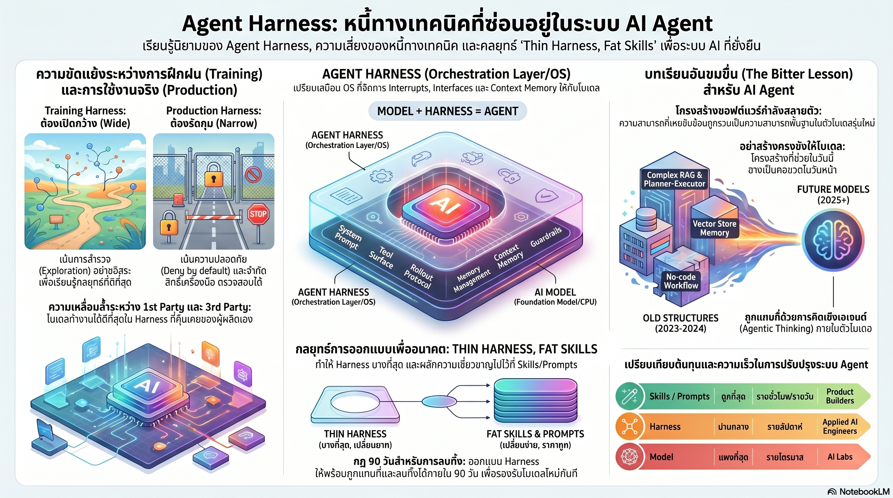

[กลับไปที่หน้าหลัก](../README.md)

สวัสดีครับเพื่อนๆ ที่ติดตามวงการ AI! ถ้าคุณใช้เวลา 12 เดือนที่ผ่านมาเขียน System Prompts, Retry Policies, และ Workflow ซับซ้อนรอบๆ LLM ครับ บทความนี้มีข่าวที่อาจทำให้ปวดหัวได้ครับ มี "กฎ 90 วัน" ที่บอกว่าโค้ดใดๆ ที่คุณเขียนเพื่ออุดรอยรั่วของโมเดลในวันนี้ จะกลายเป็นขยะทางเทคนิคที่ต้องรื้อทิ้งภายในหนึ่งไตรมาส เมื่อโมเดลรุ่นถัดไป "ดูดกลืน" ความสามารถนั้นเข้าไปเป็นส่วนหนึ่งของตัวมันเองครับ

คุณเคยสังเกตไหมครับว่า สิ่งที่เราเรียกว่า "นวัตกรรม" ใน AI Engineering เมื่อสองปีก่อนครับ อย่าง Planner-executor scaffolds, Tool routing logic, หรือ Multi-agent orchestrator ที่ซับซ้อนครับ วันนี้หลายอย่างกำลัง "สลายหายไป" กลายเป็น Native Behavior ที่อยู่ข้างใน Model ไปเรียบร้อยแล้วครับ แล้วทีมที่ทุ่มเทเขียนโค้ดพวกนั้นกำลังทำอะไรอยู่กับมันครับ?

คุณรู้ไหมครับว่า Claude Code ซึ่งเป็น First-party Harness ของ Anthropic ทำคะแนนบน Opus 4.5 ได้เพียง 41.6% ครับ ในขณะที่ Letta ซึ่งเป็น Third-party Harness เอาชนะได้ที่ 59.1% บนโมเดลตัวเดียวกันครับ แปลว่า Harness สำคัญกว่าโมเดลได้จริงๆ แต่เฉพาะเมื่อลงทุนในจุดที่ถูกต้องเท่านั้นครับ ไม่ใช่ทุก Feature ครับ?

และคุณเคยนึกไหมครับว่า ทุกครั้งที่เราเขียน Retry Logic, Error Handler, หรือ Tool Router ในโค้ด Python ครับ เรากำลังแก้ปัญหาที่ "โมเดลยังทำเองไม่ได้" ครับ แต่ถ้าโมเดลรุ่นหน้าทำได้เองแล้ว โค้ดเหล่านั้นไม่ได้แค่ไร้ประโยชน์ครับ มันกลายเป็นคอขวดที่ขัดขวางความสามารถที่โมเดลมีอยู่จริงครับ?

งานวิจัยนี้กำลังบอกว่า: "Agent Harness ที่คุณสร้างวันนี้คือนั่งร้านชั่วคราวที่รอการรื้อถอนครับ ไม่ใช่ผลิตภัณฑ์ถาวรครับ สถาปัตยกรรมที่ไร้วันหมดอายุไม่มีจริงในยุค AI ครับ โค้ด Harness ส่วนใหญ่ที่เราเขียนอยู่เพื่อให้สอดคล้องกับขีดจำกัดของโมเดลในวันนั้นเท่านั้นครับ เมื่อโมเดลเก่งขึ้น โครงสร้างเหล่านั้นจะกลายเป็นภาระที่ขัดขวางประสิทธิภาพครับ"

========================================

🤔 ทบทวนความเชื่อเดิมๆ: สิ่งที่เราคิดเกี่ยวกับ Harness Engineering

▪ "การสร้าง Harness ที่ซับซ้อนและครอบคลุมคือการลงทุนที่คุ้มค่าครับ เพราะมันเพิ่ม Capability ให้โมเดลในระยะยาวครับ" → ทุก Capability ที่คุณยัดใส่ Harness วันนี้มีอายุการใช้งาน ~90 วันก่อนโมเดลจะ Absorb ความสามารถนั้นเข้าไปเองครับ Tool routing ที่ใช้เวลา 3 สัปดาห์เขียนในปี 2024 กลายเป็น Native Function Calling ในปี 2025 ครับ Planner scaffold ที่ภูมิใจมากกลายเป็น Built-in CoT ครับ Architectural Obsolescence ไม่ใช่ความเสี่ยงในอนาคตครับ มันเกิดขึ้นแล้วทุกไตรมาสครับ

▪ "Harness ที่ดีควร Handle ทุก Edge case ให้ครบครับ เพราะ Model ไม่น่าไว้วางใจพอที่จะจัดการด้วยตัวเองครับ" → Over-shackling ใน Training Phase คือการทำให้โมเดล "โง่ลง" อย่างแท้จริงครับ ถ้า Retry Logic ถูกจัดการจากภายนอกตลอดครับ โมเดลไม่เคยเรียนรู้ที่จะ Recover จาก Error ด้วยตัวเองครับ เป้าหมายจริงๆ คือ Inside-out Alignment ครับ ฝึกให้โมเดลมี Internal Policy ที่ฉลาดพอจนไม่ต้องพึ่ง "รั้วกั้น" หนาๆ จากภายนอกครับ รั้วกั้นหนาๆ ที่ Training วันนี้คือเพดานที่ Production พรุ่งนี้ทลายไม่ได้ครับ

▪ "First-party Harness จาก Labs ดีกว่า Third-party เสมอครับ เพราะมัน Optimize กับโมเดลมาตั้งแต่ต้นครับ" → Letta 59.1% vs Claude Code 41.6% บน Opus 4.5 พิสูจน์ว่า Third-party ชนะได้ครับ แต่ต้องลงทุนในจุดที่ First-party มองข้ามครับ ไม่ใช่ลงทุนซ้ำในสิ่งที่ First-party ทำอยู่แล้วครับ Letta ชนะเพราะโฟกัสที่ Memory Layer อย่างลึกครับ ซึ่งตอนนั้น Claude Code ยังไม่ได้ลงทุนครับ Third-party มีโอกาสก็ต่อเมื่อหา Whitespace จริงๆ ได้ครับ ไม่ใช่แค่ Wrap โมเดลเดิมในรูปทรงอื่นครับ

▪ "No-code workflow builder และ Orchestration platform คือการลงทุนที่ปลอดภัยในระยะยาวครับ เพราะแยก AI logic ออกจาก Code ได้ครับ" → การลากเส้นต่อโหนดใน Visual workflow กำลังถูกแทนที่ด้วย Agentic Thinking ที่โมเดลวางแผนและรัน Loop ภายในตัวเองครับ Self-healing Harness อย่าง Browser Use อ่าน OpenAPI spec แล้วเขียน Helper code เองโดยตรงครับ ไม่ต้องให้คนลากโหนดครับ Platform ที่เพิ่ม Abstraction Layer บน Abstraction Layer คือ Technical Debt ที่ซ่อนตัวเองในรูปแบบของ "ความสะดวก" ครับ

ความจริงที่น่าคิดคือ: "จงเพิ่มโครงสร้างตามระดับ Compute ที่คุณมีครับ แล้วจงรื้อทิ้งเมื่อ Compute สูงขึ้นครับ"

========================================

🧠 พื้นฐานที่ต้องเข้าใจก่อน: Architectural Obsolescence, Inner/Outer Harness, Distribution Mismatch, Over-shackling Trap, และ Thin Harness Fat Skills

=== Agent System Equation: ทำความเข้าใจ Harness ในสมการ ===

ระบบ AI Agent สมบูรณ์ประกอบด้วย 5 ส่วนครับ ได้แก่ (T, H, V, S, C) ครับ T คือ Tasks ที่ต้องทำครับ H คือ Harness หรือเลเยอร์การจัดการครับ V คือ Verifier ที่ตรวจสอบผลลัพธ์ครับ S คือ State ที่เก็บสถานะครับ และ C คือ Configuration ทั้งหมดครับ

H หรือ Harness คือเลเยอร์ที่เชื่อม Model กับโลกภายนอกครับ ทำหน้าที่เหมือน "ระบบปฏิบัติการ" ของ Agent ครับ แต่ Harness ไม่ใช่บล็อกเดียวกันทั้งหมดครับ ต้องแยกเป็นสองชั้นครับ

Inner Harness คือสิ่งที่ผู้ผลิตโมเดล (Labs) ส่งมอบมาครับ เช่น Anthropic SDK, OpenAI App Server, Tool Schema ที่ถูก Fine-tune มาคู่กับโมเดลครับ

Outer Harness คือสิ่งที่คุณสร้างทับลงไปเองครับ เช่น MCP Servers, Custom Skills, Workflow เฉพาะทางขององค์กร, Retry Policies ที่เขียนเองครับ

ปัญหาคือ Outer Harness นี้เองที่อยู่ภายใต้ 90-day artifact rule ครับ เพราะมันสร้างขึ้นมาเพื่อ "อุด" สิ่งที่โมเดลทำไม่ได้ในวันนั้นครับ

=== Distribution Mismatch: ทำไม First-party ถึงได้เปรียบโดยธรรมชาติ ===

ในขั้นตอน Post-training ครับ Labs ปรับ Policy ของโมเดลให้เข้ากับ Tool Schema, Context Layout, และ Interaction Pattern เฉพาะของ Harness ตัวเองครับ โมเดลถูก "สอน" ให้รู้จักวิธีที่ Harness ของ Labs ทำงานครับ

เมื่อคุณนำโมเดลเดียวกันมาใส่ใน Third-party Harness ครับ โมเดลทำงานใน Out-of-distribution Environment ครับ หมายความว่ามันอยู่นอกจุดที่ Post-training Optimize ไว้ครับ ประสิทธิภาพจึงต่ำลงโดยธรรมชาติครับ

แต่นี่ไม่ได้หมายความว่า Third-party ชนะไม่ได้เลยครับ Letta ชนะ Claude Code ได้ในเรื่อง Memory Management ครับ เพราะ Letta ลงทุนใน Architecture ที่ First-party ยังไม่ได้ทำ Distribution Mismatch เป็นอุปสรรคที่เอาชนะได้ แต่ต้องชนะด้วย Genuine Capability Gap ครับ ไม่ใช่แค่ Wrapper ที่ดูดีกว่าครับ

=== Over-shackling Trap: เมื่อนั่งร้านกลายเป็นกรงขัง ===

Training Harness และ Production Harness ต้องการ Philosophy ที่ตรงข้ามกันอย่างสิ้นเชิงครับ

Training Harness ต้องการ Maximal Action Space ครับ ให้โมเดลได้ลองผิดลองถูก พบ Failure Mode ด้วยตัวเอง เรียนรู้วิธี Recover โดยไม่มีใคร Intervene ครับ ถ้าคุณยัด Retry Logic จากภายนอกใน Training ครับ โมเดลไม่เคยรู้ว่าตัวเองผิดพลาด และไม่เคยพัฒนา Internal Recovery Strategy ครับ

Production Harness ต้องการ Minimal Action Space ครับ จำกัดสิ่งที่โมเดลทำได้ในสภาพแวดล้อมจริงให้แคบที่สุดเพื่อความปลอดภัยครับ

Over-shackling Trap คือการเอา Production Constraints ไปใส่ใน Training ครับ เปรียบเหมือนสอนนักว่ายน้ำโดยสวมชูชีพตลอดเวลาครับ เขาไม่เคยรู้สึกว่าจะจมน้ำ ดังนั้นก็ไม่เคยเรียนรู้ว่าต้องว่ายอย่างไรครับ

เป้าหมายสุดท้ายคือ Inside-out Alignment ครับ ฝึกให้โมเดลมี Internal Policy ที่ฉลาดพอจนต้องการ External Constraint น้อยที่สุดในการทำงานจริงครับ

=== The Bitter Lesson ของ Harness Engineering ===

Hyung Won Chung สรุปไว้ว่า "Add structure to the level of compute you have. Remove structure when compute grows." ครับ

ในปี 2022-2023 ครับ โมเดลทำ Multi-step Reasoning ไม่ได้ครับ จึงต้องมี Planner-executor scaffold ช่วยครับ โมเดลเรียก Tool ไม่ถูกครับ จึงต้องมี Tool routing logic ครับ โมเดลจำ Context ข้ามบทสนทนาไม่ได้ครับ จึงต้องมี External memory system ครับ

ในปี 2025-2026 ครับ สิ่งเหล่านั้นกำลัง Dissolve เข้าไปอยู่ข้างใน Model ทีละอย่างครับ ทีมที่ลงทุนหนักกับ Scaffolding เหล่านั้นกำลังนั่งจ้องโค้ดที่ตัวเองเขียนและถามว่าจะทำอะไรกับมันดีครับ

Bitter Lesson ไม่ใช่ว่า Harness ไม่มีประโยชน์ครับ มันมีประโยชน์มากในช่วงเวลาที่โมเดลยังไม่พร้อมครับ แต่การสร้างมันโดยไม่มีแผน Exit Strategy คือหนี้ที่ไม่มีวันหมดดอกครับ

=== Thin Harness, Fat Skills: สถาปัตยกรรมที่ไม่กลัวการรื้อทิ้ง ===

Thin Harness หมายความว่าเลเยอร์การจัดการต้องบางที่สุดครับ ใช้ Primitive ที่เรียบง่ายครับ ไม่ใส่ Decision Logic ซับซ้อนในโค้ด Python ครับ ออกแบบให้พร้อมถูกถอดเปลี่ยนโดยไม่ทำลายระบบที่เหลือครับ ถ้ารื้อ Harness ใช้เวลาเกินหนึ่งสัปดาห์ครับ นั่นคือ Warning Sign ว่ามัน "หนา" เกินไปแล้วครับ

Fat Skills หมายความว่าความเชี่ยวชาญใน Domain ไม่ได้ถูกเขียนลง Code ครับ แต่ถูกใส่ลงในรูปของ Data และ Skills ที่แก้ไขได้ผ่าน Text edits ครับ ไม่ต้อง Recompile ครับ ไม่ต้อง Redeploy ครับ เมื่อโมเดลฉลาดขึ้นครับ Skills ถูกปรับได้ทันทีครับ แต่ถ้าความรู้ถูกฝังใน Code ครับ ต้องเสียเวลา Refactor ทุกครั้งครับ

Evaluation Harness คือส่วนเดียวที่ควรลงทุนหนักโดยไม่ต้องกลัวครับ เพราะมันเป็นสะพานที่บอกว่าเมื่อ Harness เปลี่ยนหรือโมเดลเปลี่ยนครับ พฤติกรรมของ Agent ยังถูกต้องอยู่หรือเปล่าครับ Evaluation ยังมีคุณค่าอยู่เสมอไม่ว่าโมเดลจะฉลาดแค่ไหนครับ เพราะต้องการพิสูจน์ว่า "ฉลาดจริง" ครับ ไม่ใช่แค่ "ดูฉลาด" ครับ

========================================

🎯 ประเด็นที่ควรคิดต่อ

— กฎ 90 วันเปลี่ยนคำถามจาก "สร้างอะไร" เป็น "รื้อทิ้งอะไรได้เร็วแค่ไหน" ครับ: วงการ Software Engineering สอนให้เราภูมิใจกับโค้ดที่ซับซ้อนและครอบคลุมครับ แต่ใน Agentic Computing ความสามารถในการ Decommission โค้ดเก่าออกเร็วที่สุดกลายเป็น Competitive Advantage ครับ ทีมที่ "รื้อได้เร็ว" คือทีมที่พร้อม Adopt Model Capability ใหม่ๆ ได้ก่อนใครครับ ทีมที่ "รื้อช้า" เพราะ Harness หนาเกินไปคือทีมที่แพ้ก่อนแข่งครับ

— Distribution Mismatch ระหว่าง Training และ Production เป็นหนึ่งใน Failure Mode ที่มองไม่เห็นชัดที่สุดในการ Deploy AI Agentครับ: เมื่อ Agent ทำงานผิดพลาดใน Production ครับ คนมักโทษโมเดลก่อนครับ แต่บ่อยครั้งปัญหาคือ Harness ที่ Production ต่างจากสภาวะที่โมเดลถูก Fine-tune มาครับ เหมือนสอบปลายภาคด้วยข้อสอบรูปแบบที่ไม่เคยฝึก ไม่ว่าจะฉลาดแค่ไหนก็ทำคะแนนได้ต่ำครับ Before blaming the model ครับ ควร Audit ว่า Outer Harness ที่สร้างเองนั้น Consistent กับ Training Distribution แค่ไหนครับ

— การ Shift งบประมาณจาก Harness Code ไปที่ Data, Evaluation, และ Environments คืองานเชิงกลยุทธ์ที่ ROI สูงที่สุดในปี 2026 ครับ: Data ที่ดีทำให้ Fine-tuning ได้ผลลัพธ์ที่ Robust กว่า Harness Logic ที่ซับซ้อนครับ Evaluation Framework ที่ครอบคลุมทำให้รู้เมื่อต้องเปลี่ยนโมเดลหรือรื้อ Harness ครับ Sandbox Environment ที่ดีทำให้ Training ได้ Signal จากความผิดพลาดจริงๆ ครับ สิ่งเหล่านี้ไม่ Obsolete เมื่อโมเดลฉลาดขึ้น แต่กลับมีคุณค่ามากขึ้นเรื่อยๆ ครับ

#AgentHarness #TechnicalDebt #AIPlatform #LLMEngineering #AIStrategy #AgenticAI #HarnessEngineering #AIArchitecture #90DayArtifact #ThinHarness #FatSkills #ArchitecturalObsolescence #InsideOutAlignment #DistributionMismatch #EvaluationHarness #AILeadership
