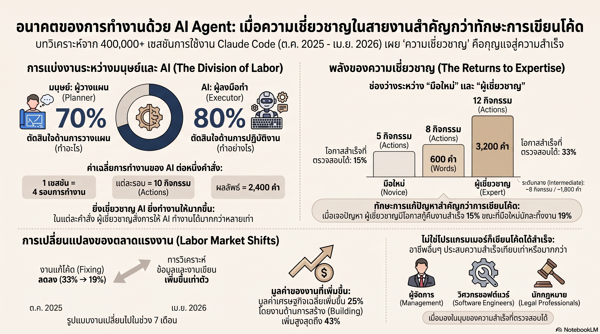

[กลับไปที่หน้าหลัก](../README.md)

สวัสดีครับเพื่อนๆ ที่ติดตามวงการ AI! Anthropic เพิ่งปล่อยรายงานวิจัยที่ถือเป็น Ground Truth ชิ้นแรกของวงการ AI Coding ครับ — วิเคราะห์การใช้งาน Claude Code จริงกว่า 400,000 เซสชัน ตลอด 7 เดือน ผ่านระบบ Clio ที่รักษาความเป็นส่วนตัวของผู้ใช้ครับ ผลลัพธ์ที่ได้ไม่ใช่แค่ตัวเลขครับ — มันกำลังเขียนกฎใหม่ว่าใครจะประสบความสำเร็จในยุคที่ AI เขียนโค้ดแทนมนุษย์ได้แล้ว

คุณเคยสังเกตไหมครับว่า ในองค์กรที่เริ่มใช้ AI Coding Agents คนที่สร้างเครื่องมือได้ดีที่สุดมักไม่ใช่วิศวกรซอฟต์แวร์ครับ แต่เป็นผู้จัดการ, นักวิเคราะห์, หรือฝ่ายกฎหมายที่รู้ปัญหาของตัวเองลึกที่สุด ซึ่งข้อมูลจาก 400,000 เซสชันนี้กำลังยืนยันสัญชาตญาณนั้นด้วยตัวเลขครับ?

คุณรู้ไหมครับว่า อัตราความสำเร็จในการสร้างโค้ดของกลุ่มบริหารและจัดการอยู่ที่ ~35-36% สูงกว่ากลุ่มคอมพิวเตอร์และคณิตศาสตร์ที่ ~34% ครับ? และงานประเภท "ซ่อมโค้ด" ที่เคยกินเวลาวิศวกร 33% ลดเหลือเพียง 19% ในเวลา 7 เดือน เพราะ AI เข้ามาแบกรับภาระนั้นไปแล้วครับ?

และคุณเคยนึกไหมครับว่า ผู้เชี่ยวชาญในสายงาน (Expert) สั่งงาน AI เพียงครั้งเดียวแล้วได้ Action Chains ยาว 12 ขั้นตอน / 3,200 คำ ในขณะที่มือใหม่ได้เพียง 5 ขั้นตอน / 600 คำ จากคำสั่งเดียวกัน ครับ — ความแตกต่าง 5 เท่านี้ไม่ได้มาจากการรู้ Python มากกว่า แต่มาจากการรู้ว่าปัญหาที่แท้จริงอยู่ตรงไหนครับ?

งานวิจัยนี้กำลังบอกว่า: "ในยุคที่ AI เขียนโค้ดได้ กำแพงที่แยกคนสำเร็จและไม่สำเร็จไม่ใช่ Syntax อีกต่อไปแล้วครับ — มันคือความเข้าใจในปัญหาที่คุณกำลังแก้อยู่ครับ"

========================================

🤔 ทบทวนความเชื่อเดิมๆ: สิ่งที่เราคิดเกี่ยวกับการสร้างซอฟต์แวร์

▪ "ถ้าไม่รู้จัก Python, JavaScript หรือ SQL คุณก็แตะ Software Development ไม่ได้ — ต้องเรียนโค้ดก่อน" → ข้อมูล 400,000 เซสชันพิสูจน์ตรงข้ามครับ กลุ่มกฎหมาย ~30%, ฝ่ายขาย, และฝ่ายการเงิน ~29% มีอัตราความสำเร็จสูงกว่าที่ใครคาดครับ เพราะ AI รับหน้าที่แปล "สิ่งที่ต้องการ" เป็น "วิธีทำ" ให้แล้วครับ

▪ "วิศวกรซอฟต์แวร์ที่มีทักษะเทคนิคสูงจะได้เปรียบมากที่สุดเมื่อใช้ AI Coding Agents — เพราะพวกเขาเข้าใจโค้ดที่ AI สร้าง" → การแบ่งงานจริงในโลก Real-world คือมนุษย์ตัดสินใจ What to do 70% และ AI ตัดสินใจ How to do it 80% ครับ ความได้เปรียบของวิศวกรอยู่ที่ "How" แต่ Domain Expert ได้เปรียบที่ "What" ซึ่งสำคัญกว่าครับ

▪ "งานของโปรแกรมเมอร์จะหายไป เพราะ AI ทำแทนได้ทั้งหมด" → สิ่งที่เกิดจริงคือ "งานซ่อมโค้ด" ลดจาก 33% → 19% แต่งานวิเคราะห์และสร้างสรรค์เพิ่มขึ้น 2 เท่า และมูลค่าเฉลี่ยของงานที่ทำผ่าน Claude Code พุ่งขึ้น 25% ครับ AI ไม่ได้ขโมยงาน — AI ขโมยเฉพาะงานที่น่าเบื่อไปครับ แล้วเอางานที่มีคุณค่าสูงกว่าคืนมาให้ครับ

▪ "คุณต้องเป็น Expert ระดับสูงมากถึงจะใช้ AI ได้อย่างเต็มประสิทธิภาพ — มือใหม่ได้ประโยชน์น้อยมาก" → จุดตัดที่สำคัญอยู่ระหว่าง Novice กับ Intermediate ครับ ช่องว่างระหว่าง Intermediate และ Expert นั้นเล็กมากครับ ถ้าคุณรู้ปัญหาของตัวเองในระดับที่ใช้งานได้จริง คุณก็ดึงพลังของ AI ออกมาได้เกือบเทียบเท่าระดับสูงสุดแล้วครับ

ความจริงที่น่าคิดคือ: "กำแพงที่ถูกทลายไปไม่ใช่กำแพงระหว่างมนุษย์กับโค้ด แต่คือกำแพงระหว่างความคิดสร้างสรรค์กับการลงมือทำครับ"

========================================

🧠 พื้นฐานที่ต้องเข้าใจก่อน: Clio, Division of Labor, Returns to Expertise, และ Task Value Shift

=== Clio: ระบบที่ทำให้เห็น Ground Truth โดยไม่ละเมิด Privacy ===

ก่อนหน้านี้ไม่มีใครรู้จริงๆ ว่า AI Coding Agents ถูกใช้ทำอะไรในโลกจริงครับ เพราะ Session Data ของผู้ใช้เป็นข้อมูลส่วนตัวครับ

Clio แก้ปัญหานี้ด้วย Privacy-Preserving Pipeline ครับ แทนที่จะดูเนื้อหา Session โดยตรง Clio ใช้ AI อีกตัวสรุป Session แต่ละอันให้กลายเป็น Abstract Cluster ก่อนครับ จากนั้นจึงวิเคราะห์ Pattern จาก Cluster เหล่านั้น ทำให้ได้ข้อมูลเชิงสถิติโดยไม่เห็นเนื้อหาของใครเลยครับ

ผลลัพธ์คือ 400,000 เซสชันตลอด 7 เดือน (ตุลาคม 2025 - เมษายน 2026) กลายเป็น Dataset ที่ใหญ่ที่สุดเท่าที่เคยมีมาสำหรับทำความเข้าใจพฤติกรรมจริงของผู้ใช้ AI Coding Agents ครับ

=== Division of Labor: มนุษย์วางแผน AI ลงมือทำ ===

Pattern ที่ชัดเจนที่สุดจากข้อมูลคือการแบ่งบทบาทที่เกิดขึ้นเองตามธรรมชาติครับ

มนุษย์ตัดสินใจเชิงกลยุทธ์ (What to do) 70% ของการตัดสินใจทั้งหมด ครอบคลุมทั้งการกำหนดเป้าหมาย การเลือกวิธีแก้ปัญหา และการนิยามว่างานเสร็จหมายความว่าอะไรครับ

AI ตัดสินใจเชิงปฏิบัติ (How to do it) 80% ครอบคลุมทั้งการเลือกไฟล์ที่จะแก้ไข การเลือก Library และการ Implement รายละเอียดครับ

สัดส่วนนี้ทำให้ต้นทุนของการ "ลองผิดลองถูก" ลดลงมหาศาลครับ เพราะ AI รับความเสี่ยงของการ Implement ไปแทน มนุษย์แค่ตรวจว่าผลลัพธ์ตรงกับเจตนาหรือไม่ครับ — คล้ายกับการที่สถาปนิกไม่ต้องวางอิฐเองครับ แค่ต้องรู้ว่าอาคารที่ดีควรมีหน้าตาเป็นอย่างไรครับ

=== Returns to Expertise: ทำไม Domain Expert ชนะ ===

ความแตกต่างระหว่าง Novice และ Expert ในการใช้ AI Coding ไม่ได้อยู่ที่การรู้โค้ดมากกว่าครับ แต่อยู่ที่ความสามารถ 3 ด้านครับ

ประการแรก การตั้งคำถามที่แม่นยำครับ Expert รู้ว่า Edge Case คืออะไร รู้ว่า Requirement ไหนสำคัญกว่า ทำให้ AI ทำงานยาว 12 ขั้นตอนจากคำสั่งเดียวครับ ในขณะที่ Novice ต้องสั่งหลายรอบเพื่อให้ได้ผลลัพธ์เดียวกันครับ

ประการที่สอง การจับข้อผิดพลาดเชิงเนื้อหา (Recovery from Errors) ครับ AI อาจสร้างโค้ดที่ Run ได้แต่ตอบโจทย์ผิดครับ Domain Expert มองเห็น Gap นี้ทันที ในขณะที่คนที่ไม่รู้เนื้องานอาจเข้าใจว่างานเสร็จแล้วครับ

ประการที่สาม การขยาย Scope ครับ Expert รู้ว่าจะต่อยอดจากผลลัพธ์ที่ได้ไปทางไหนต่อ ทำให้วงจรการสร้างสะสมคุณค่าได้เร็วขึ้นครับ

=== Task Value Shift: งานที่น่าเบื่อหายไป งานที่มีคุณค่าเพิ่มขึ้น ===

ข้อมูล 7 เดือนแสดง Trend ที่ชัดเจนมากครับ งานประเภท Fixing (ซ่อมโค้ด) ลดจาก 33% เหลือ 19% ครับ นั่นหมายความว่า AI กำลังทำงาน Maintenance แทนมนุษย์ได้มากขึ้นเรื่อยๆ ครับ

ในขณะเดียวกัน งานวิเคราะห์ข้อมูลและเขียนเอกสารสำคัญเพิ่มขึ้น 2 เท่าครับ และมูลค่าเฉลี่ยของ Task ที่ทำผ่าน Claude Code พุ่งขึ้น 25% ครับ โดยเฉพาะงาน Building และ Operating ระบบที่มีมูลค่าเพิ่มขึ้นกว่า 1 ใน 3 ครับ

ผลลัพธ์คือ Cognitive Budget ของมนุษย์ถูก Reallocate ครับ แทนที่จะใช้เวลา Debug Error Messages มนุษย์ใช้เวลาวางโครงสร้างระบบและตัดสินใจเชิงธุรกิจแทนครับ — ซึ่งเป็นงานที่ AI ยังทำแทนได้น้อยกว่ามากครับ

=== อัตราความสำเร็จตามอาชีพ: ทำไม Management จึงมาก่อน ===

ผลที่น่าประหลาดใจที่สุดครับ กลุ่มบริหารและจัดการมีอัตราความสำเร็จสูงที่สุดที่ ~35-36% แซงกลุ่มคอมพิวเตอร์ที่ ~34% ครับ

คำอธิบายที่สมเหตุสมผลที่สุดคือ ทักษะการบริหารคือทักษะการสื่อสารเป้าหมายที่ชัดเจน การจัดลำดับความสำคัญ และการ Delegate งานอย่างมีประสิทธิภาพครับ — ซึ่งทุกทักษะเหล่านี้แปลตรงมาสู่การ Prompt AI ได้อย่างแม่นยำครับ

ผู้จัดการที่เคย Delegate งานให้ทีมมานานปีนั้นรู้ดีว่า ต้องอธิบาย Context เท่าไหร่ ต้องระบุ Success Criteria ชัดแค่ไหน และต้องตรวจผลงานอย่างไร ครับ — และนั่นคือทักษะเดียวกันกับที่ใช้กับ AI ครับ

========================================

🎯 ประเด็นที่ควรคิดต่อ

— "Syntax ตายแล้ว แต่ Domain Expertise ไม่ตาย" คือสัญญาณที่ทุกวงการควรอ่านให้ขาดครับ: ถ้า Management และ Legal มีอัตราความสำเร็จสูงกว่า Computer/Math ในการสร้างซอฟต์แวร์ แล้วอะไรจะเกิดขึ้นในอีก 5 ปีข้างหน้า เมื่อ AI Coding Agents ดีขึ้นอีก 10 เท่า ครับ? คำตอบน่าจะไม่ใช่ "ทุกคนต้องเรียนโค้ด" แต่คือ "ทุกคนต้องรู้ปัญหาของตัวเองให้ลึกที่สุดครับ"

— Skill Gap ที่หายไปนี้มีผลต่อการศึกษาและการ Hiring อย่างมหาศาลครับ: ถ้าช่องว่างระหว่าง Intermediate และ Expert ในการใช้ AI เล็กมากตามที่รายงานระบุ หลักสูตร Bootcamp 3 เดือนที่เคยสอน Syntax อาจต้องถูก Redesign ใหม่ทั้งหมดครับ และ JD ที่เขียนว่า "ต้องมีประสบการณ์เขียน Python 3 ปีขึ้นไป" อาจกำลัง Filter ออกคนที่เหมาะสมที่สุดสำหรับงานนั้นโดยไม่รู้ตัวครับ

— คำถามที่งานวิจัยยังไม่ได้ตอบคือเรื่องของ Ceiling ครับ: Returns to Expertise บอกว่า Expert ได้ Action Chains ยาว 12 ขั้นตอน แต่ไม่ได้บอกว่า Ceiling ของมนุษย์คือเท่าไหร่ครับ ถ้า AI สามารถ Chain Actions ได้ยาวขึ้นเรื่อยๆ โดยอัตโนมัติ มีจุดหนึ่งไหมที่ความแตกต่างระหว่าง Novice และ Expert จะแทบหายไปครับ? หรือ Domain Expertise จะยิ่งสำคัญมากขึ้นยิ่งกว่าเดิมเพราะ AI ที่ฉลาดขึ้นต้องการ Direction ที่แม่นยำขึ้นด้วยครับ?

#ClaudeCode #AIAgents #DomainExpertise #AICoding #Anthropic #Clio #FutureOfWork #SoftwareDevelopment #AIProductivity #NoCode #LLM #AgenticAI #Management #TechTrends
