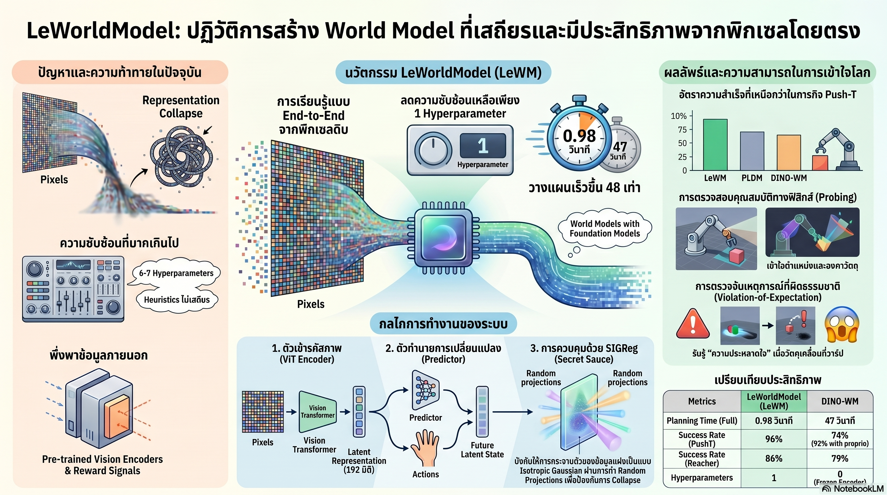

[กลับไปที่หน้าหลัก](../README.md)

สวัสดีครับเพื่อนๆ ที่ติดตามวงการ AI และหุ่นยนต์! วันนี้มาเรื่องที่ฟังดูเหมือนนิยายวิทยาศาสตร์ แต่กำลังเกิดขึ้นจริง เรื่องของการสอน AI ให้ "จินตนาการ" ผลลัพธ์ในหัวก่อนลงมือทำจริง และการทำให้มันเร็วขึ้น 48 เท่าในการวางแผนครับ

คุณเคยสงสัยไหมครับว่า ทำไมมนุษย์ถึงสามารถจินตนาการได้ว่า "ถ้าหยิบแก้วนั้นด้วยมือซ้ายแล้วเอียงมากเกินไป มันจะหกลงพื้น" โดยไม่ต้องลองทำจริง แต่ AI หุ่นยนต์กลับยังทำแบบนี้ได้ยากมาก?

คุณเคยสงสัยไหมครับว่า ทำไมการสอน AI ให้มี "สัญชาตญาณทางฟิสิกส์" ถึงต้องแลกมากับโมเดลที่ซับซ้อนมหาศาล จนต้องจูน Hyperparameter 6 ตัวและยังเสี่ยงล่มสลายอยู่ดี?

และคุณรู้ไหมครับว่า มีงานวิจัยที่พิสูจน์ว่า โมเดลขนาดเพียง 15 ล้านพารามิเตอร์ ที่ฝึกบน GPU ตัวเดียวในไม่กี่ชั่วโมง สามารถเข้าใจกฎฟิสิกส์และวางแผนได้เร็วกว่า Foundation Model ยักษ์ใหญ่ถึง 48 เท่า?

LeWorldModel (LeWM) คือหลักฐานที่ทรงพลังที่สุดในช่วงนี้ว่า "Simplicity is the ultimate sophistication" — ความเรียบง่ายที่ออกแบบมาอย่างชาญฉลาดเอาชนะความซับซ้อนได้เสมอครับ

========================================

🤔 ทบทวนความเชื่อเดิมๆ: สิ่งที่เราคิดเกี่ยวกับ World Models

▪ "AI ที่เข้าใจฟิสิกส์ได้ต้องการโมเดลขนาดใหญ่และซับซ้อน" → LeWM มีพารามิเตอร์เพียง 15 ล้านตัว ฝึกบน GPU ตัวเดียว แต่เข้าใจกฎทางกายภาพได้เหนือกว่า DINO-WM ที่ใหญ่กว่ามากในหลาย Benchmark

▪ "ต้องมีระบบ 'รางวัล' หรือ Pre-trained Encoder เพื่อป้องกัน AI โกงในการเรียนรู้" → LeWM เรียนรู้แบบ Reward-free และไม่พึ่ง Pre-trained Encoder เลย ใช้แค่ Loss function 2 ตัวก็เพียงพอในการป้องกัน Representation Collapse

▪ "World Model ที่เร็วต้องแลกกับความแม่นยำ" → LeWM วางแผนใน 0.98 วินาที เทียบกับ DINO-WM 47 วินาที (48 เท่า) แต่ยังทำคะแนน Push-T ได้ 90% เทียบกับ DINO-WM ที่ได้เพียง 13% ในเงื่อนไขทรัพยากรเดียวกัน

▪ "AI เรียนรู้จากพิกเซลดิบได้ยาก จำเป็นต้องมีการ Encode ข้อมูลล่วงหน้า" → LeWM คือ JEPA ตัวแรกที่ฝึกแบบ End-to-End จากพิกเซลดิบได้อย่างเสถียรอย่างสมบูรณ์ โดยไม่ต้องมีการประมวลผลล่วงหน้าใดๆ

ความจริงที่น่าคิดคือ: ความซับซ้อนของโมเดลในอดีตส่วนหนึ่งเกิดจากการแก้ปัญหาที่ไม่ควรจะมีอยู่ตั้งแต่แรก ถ้าออกแบบ Loss function ให้ถูกต้องตั้งแต่ต้นครับ

========================================

🧠 พื้นฐานที่ต้องเข้าใจก่อน: World Models, JEPA, Latent Space และ Representation Collapse

=== World Model คืออะไร? ===

World Model = แบบจำลองภายในของ AI ที่ทำหน้าที่เป็น "พื้นที่แห่งจินตนาการ" ให้ AI ทดลองจำลองผลลัพธ์ของการกระทำในหัวก่อนจะลงมือทำจริง

เปรียบเทียบ: เหมือนสมองของมนุษย์ที่สามารถ Simulate ได้ว่า "ถ้าเดินทางด้วยเส้นทาง A จะติดรถมาก แต่เส้นทาง B ไกลกว่านิดหน่อยแต่ว่างกว่า" โดยไม่ต้องขับจริงทั้งสองเส้นทางเพื่อเปรียบเทียบครับ

=== JEPA คืออะไร? ===

JEPA = Joint-Embedding Predictive Architecture สถาปัตยกรรมที่เรียนรู้โดยการ "ทำนายอนาคตในพื้นที่แฝง" (Latent Space) แทนที่จะพยายามสร้างภาพอนาคตออกมาเป็นพิกเซลจริงๆ

ความแตกต่างสำคัญ: JEPA ไม่ต้องวาดภาพอนาคตออกมาทั้งหมด แค่ต้องทำนาย "ใจความสำคัญ" ของภาพอนาคตในรูปแบบนามธรรม ซึ่งง่ายกว่าและมีประสิทธิภาพมากกว่ามากครับ

=== Latent Space คืออะไร? ===

Latent Space = "พื้นที่แฝง" ที่ AI ใช้เก็บข้อมูลในรูปแบบนามธรรม แทนที่จะเก็บพิกเซลดิบ

เปรียบเทียบ: แทนที่จะจำภาพแมวเป็นพิกเซลหลายล้านจุด สมองมนุษย์จำแมวเป็นชุดคุณสมบัตินามธรรม เช่น "มีหู 2 ข้าง หางยาว เดิน 4 ขา" Latent Space ของ AI ทำงานในลักษณะเดียวกันครับ

=== Representation Collapse คืออะไร? ===

Representation Collapse = ภาวะที่ AI "โกง" ในการเรียนรู้ด้วยการบีบข้อมูลทุกอย่างให้กลายเป็นค่าเดียวกันหมดใน Latent Space

เปรียบเทียบ: เหมือนนักเรียนที่ถูกให้จำหน้าคนหลาย 100 คน แต่แทนที่จะพยายามจำแต่ละคน กลับตอบว่า "หน้าคนทุกคน" สำหรับทุกคำถาม คำตอบผ่านได้บ้างแต่ไร้ประโยชน์จริงๆ ครับ

=== SIGReg คืออะไร? ===

SIGReg = Regularizer ที่ LeWM ใช้ป้องกัน Representation Collapse โดยบีบให้การกระจายตัวของข้อมูลใน Latent Space เป็น Isotropic Gaussian (กระจายสม่ำเสมอทุกทิศทาง)

หลักการทางคณิตศาสตร์: ใช้ Cramér-Wold theorem ฉาย (Project) ข้อมูลไปยังทิศทางสุ่มหลายๆ ทิศทาง แล้วทดสอบความเป็นปกติด้วย Epps-Pulley test ถ้าข้อมูลกระจายตัวดีในทุกทิศทาง แปลว่า Latent Space มีความหลากหลายเพียงพอ ไม่ Collapse ครับ

=== Violation-of-Expectation (VoE) คืออะไร? ===

VoE = กรอบการทดสอบที่ใช้วัดว่า AI มี "สัญชาตญาณทางฟิสิกส์" หรือเปล่า โดยแสดงเหตุการณ์ที่ "ผิดธรรมชาติ" แล้วดูว่า AI แสดงค่า Surprise สูงขึ้นหรือไม่

เปรียบเทียบ: เหมือนการทดสอบทารกทางจิตวิทยาที่ทารกจะจ้องนานกว่าปกติเมื่อเห็นสิ่งที่ "ไม่ควรเกิดขึ้น" เช่น ลูกบอลที่ผ่านกำแพงทึบ ครับ

========================================

1️⃣ ปัญหาที่ LeWM ถูกสร้างขึ้นมาแก้: เมื่อ AI โกงและล่มสลาย

=== ฝันร้ายของ World Model Researchers ===

ก่อน LeWM งานวิจัย World Models เผชิญกับศัตรูหมายเลข 1 คือ Representation Collapse ที่เกิดขึ้นเมื่อ AI ค้นพบ "ทางลัดในการโกง" ในระหว่างการเรียนรู้

กระบวนการโกงนั้นง่ายมากครับ: AI ทำนายอนาคตในรูปของ Latent Space → แต่ถ้ามัน "บีบ" ค่าทุกอย่างให้เท่ากันหมด → การทำนายอนาคตก็แม่นยำโดยอัตโนมัติ เพราะ "อนาคต" และ "ปัจจุบัน" มีค่าเดียวกันเสมอ → Loss ต่ำมาก ดูเหมือนฝึกได้ดี แต่นำไปใช้จริงไม่ได้เลย

เปรียบเทียบ: เหมือนนักพยากรณ์อากาศที่บอก "พรุ่งนี้จะร้อน" ทุกวัน วัดความแม่นยำระยะสั้นได้ดีเพราะส่วนใหญ่ไม่ผิด แต่ไม่ได้บอกอะไรที่มีประโยชน์จริงๆ เลยครับ

=== วิธีแก้แบบเดิมที่ซับซ้อนเกินไป ===

โมเดลคู่แข่งอย่าง PLDM แก้ปัญหา Representation Collapse โดยเพิ่มข้อจำกัดและ Hyperparameters จำนวนมาก

▸ ต้องจูน Hyperparameters ถึง 6 ตัวพร้อมกัน
▸ ยังคงเสี่ยงต่อการ Collapse ถ้าจูนไม่ดีพอ
▸ ต้องการ Pre-trained Encoder ที่ฝึกมาจากข้อมูลอื่น

LeWM แก้ปัญหาเดิมด้วยวิธีที่ต่างกันโดยสิ้นเชิง: แทนที่จะเพิ่มข้อจำกัดมากขึ้น ออกแบบ Loss function ที่ถูกต้องตั้งแต่ต้น ทำให้ Collapse เป็นไปได้ยากในทางคณิตศาสตร์ครับ

========================================

2️⃣ ความเรียบง่ายที่ทรงพลัง: JEPA ตัวแรกที่ฝึกได้จากพิกเซลดิบ

=== Loss function เพียง 2 ตัว ===

LeWM ฝึกด้วย Loss function เพียง 2 ตัวเท่านั้น

[Prediction Loss]
▸ วัดความแม่นยำในการทำนายอนาคตใน Latent Space
▸ บอกว่า "สิ่งที่คิดว่าจะเกิดขึ้น" ใกล้เคียงกับ "สิ่งที่เกิดขึ้นจริง" แค่ไหน

[SIGReg — Stochastic Isotropic Gaussian Regularizer]
▸ บีบให้ข้อมูลใน Latent Space กระจายตัวสม่ำเสมอทุกทิศทาง (Isotropic Gaussian)
▸ ทำให้ Collapse เป็นไปได้ยากในเชิงคณิตศาสตร์
▸ มีตัวแปรที่ต้องจูนเพียงตัวเดียว: ค่า λ

=== ความหรูหราของ SIGReg ===

ที่น่าทึ่งคือ SIGReg ไม่ได้แค่ "ป้องกันการโกง" แบบหยาบๆ แต่ใช้ Cramér-Wold theorem ซึ่งเป็นทฤษฎีทางคณิตศาสตร์ที่บอกว่า ถ้าข้อมูลที่ฉายไปทุกทิศทางสุ่มมีการกระจายแบบปกติ แล้วข้อมูลทั้งหมดก็จะมีการกระจายแบบ Gaussian โดยอัตโนมัติ

ผลจากการออกแบบที่ถูกต้องนี้ทำให้หา λ ที่ดีที่สุดได้ด้วย Bisection Search แบบลอการิทึม แทนที่จะต้องลอง Grid Search ค่าหลายสิบชุดเหมือนโมเดลอื่นครับ

เปรียบเทียบ: เหมือนความต่างระหว่างหาหนังสือที่ต้องการในห้องสมุดที่ไม่มีระบบ (ต้องดูทุกชั้น) กับห้องสมุดที่มีระบบ Dewey (รู้ทันทีว่าต้องไปชั้นไหน) ครับ

========================================

3️⃣ เร็วกว่า 48 เท่า: เมื่อ "น้อยคือมาก" ในระดับ Token

=== ความลับของความเร็วอยู่ที่ Token ===

ความเร็วที่ LeWM ทำได้นั้นไม่ได้มาจาก Hardware ที่ดีกว่า แต่มาจากการออกแบบที่ฉลาดกว่าครับ

LeWM ใช้จำนวน Token ในการเข้ารหัสภาพ (Image Encoding) น้อยกว่า DINO-WM ถึง 200 เท่า เมื่อต้องทำ Planning หลายพันรอบ ความแตกต่าง 200 เท่านี้สะสมกลายเป็น 48 เท่าในเวลาจริง

[ตัวเลขจากการวัดจริง บน Push-T Task]
▸ DINO-WM Planning Time: 47 วินาที
▸ LeWM Planning Time: 0.98 วินาที (เร็วกว่า 48 เท่า)

=== ผลลัพธ์บน Benchmark ===

[Push-T — งานผลักบล็อกไม้ให้เข้าที่กำหนด]
▸ LeWM: 90% ✓
▸ DINO-WM (ทรัพยากรเท่ากัน): 13% ✗
▸ ชนะขาดทั้งที่โมเดลเล็กกว่ามาก

[Reacher — งานควบคุมแขนหุ่นยนต์สัมผัสเป้าหมาย]
▸ LeWM: 86% ✓
▸ เหนือกว่าทุกโมเดลในการเปรียบเทียบ

[OGBench-Cube — สภาพแวดล้อม 3D ที่ซับซ้อน]
▸ DINO-WM / GCBC: 84-86%
▸ LeWM: 74%
▸ คะแนนต่ำกว่าเล็กน้อยในสภาพแวดล้อม 3D แต่แลกมาด้วยความเร็วที่เหนือกว่ามากเท่าตัว

เปรียบเทียบ: เหมือนรถสปอร์ตขนาดเล็กที่ใช้น้ำมันน้อยกว่า 200 เท่า แต่ยังแซงหน้า SUV ใหญ่ในสนามแข่งส่วนใหญ่ได้ ยกเว้นเส้นทาง Off-road ที่ต้องการขนาดพิเศษครับ

========================================

4️⃣ เมื่อ AI เริ่ม "ตกใจ" กับสิ่งที่ไม่ควรเกิด: สัญชาตญาณทางฟิสิกส์

=== การทดสอบ Violation-of-Expectation ===

นักวิจัยใช้กรอบ VoE เพื่อพิสูจน์ว่า LeWM เข้าใจ "กฎของโลก" จริงๆ ไม่ใช่แค่จำรูปแบบภาพ

[เหตุการณ์ที่ 1: Teleport — วัตถุกระโดดข้ามตำแหน่งทันที]
▸ LeWM แสดงค่า Surprise พุ่งสูงอย่างรุนแรง
▸ โมเดลรู้ว่า "วัตถุไม่ควรกระโดดข้ามอวกาศได้"
▸ ตรงกับสัญชาตญาณทางฟิสิกส์ของมนุษย์

[เหตุการณ์ที่ 2: เปลี่ยนสีวัตถุ — วัตถุเปลี่ยนสีกะทันหัน]
▸ LeWM แสดงค่า Surprise ต่ำ ไม่มีนัยสำคัญทางสถิติ
▸ โมเดลถือว่า "ไม่ใช่เรื่องใหญ่" เพราะสีไม่ใช่กฎทางกายภาพ
▸ AI สนใจ Physics มากกว่า Visual Appearance

นัยสำคัญคือ: LeWM ไม่ได้แค่จำพิกเซล แต่เรียนรู้ความแตกต่างระหว่างสิ่งที่ "เป็นกฎ" กับสิ่งที่ "แค่เป็นลักษณะ" ของวัตถุ ซึ่งเป็นรากฐานของ Physical Reasoning จริงๆ ครับ

=== Probing Latent Space: ส่องดูว่า AI จำอะไรไว้ ===

นักวิจัยแอบดูข้อมูลใน Latent Space ของ LeWM โดยตรงและพบว่า

▸ จำตำแหน่ง (Location) ของวัตถุได้แม่นยำกว่า PLDM
▸ จำมุม (Angle) ของวัตถุได้แม่นยำกว่า PLDM
▸ Latent Space ของมันเก็บ "โครงสร้างของโลก" ไม่ใช่แค่ "รูปภาพของโลก"

เปรียบเทียบ: เหมือนความต่างระหว่างคนที่จำแผนที่โดยรู้ว่า "ศาลากลางอยู่ทางทิศเหนือของตลาด 500 เมตร" กับคนที่จำแผนที่โดยจำรูปภาพแผนที่ทั้งใบ คนแรกใช้พื้นที่ความจำน้อยกว่า แต่ Navigate ได้ดีกว่าในสถานการณ์ใหม่ครับ

========================================

5️⃣ การเรียนรู้จากน้อยไปมาก: เมื่อ AI ค้นพบ "โครงสร้างโลก" ก่อนรายละเอียด

=== Slow Features: เรียนรู้สิ่งที่เปลี่ยนแปลงช้าก่อน ===

สิ่งที่น่าสนใจที่นักวิจัยพบเมื่อส่อง Latent Space ของ LeWM ในช่วงการเรียนรู้ต่างๆ คือลำดับของการเรียนรู้ที่คล้ายกับพัฒนาการมนุษย์ครับ

[ช่วงแรกของการเรียนรู้]
▸ LeWM จับ "Slow Features" ก่อน ซึ่งคือโครงสร้างหลักของภาพที่เปลี่ยนแปลงช้า
▸ เช่น ตำแหน่งของวัตถุหลัก โครงสร้างพื้นหลัง รูปร่างโดยรวม
▸ เปรียบเหมือนทารกที่เรียนรู้ว่า "มีวัตถุอยู่ตรงนั้น" ก่อนที่จะเรียนรู้ว่า "วัตถุนั้นมีผิวเป็นยังไง"

[ช่วงหลังของการเรียนรู้]
▸ รายละเอียดที่ซับซ้อนและเปลี่ยนแปลงเร็วกว่าค่อยๆ ถูกเพิ่มเข้ามา
▸ Latent Space มีความเข้มข้นของข้อมูลสูงพอที่จะสร้างภาพอนาคตที่สมจริงได้

=== Reward-free Learning: เรียนรู้โดยไม่ต้องมีรางวัล ===

สิ่งที่ทำให้ LeWM น่าทึ่งมากขึ้นไปอีกคือมันเรียนรู้ทั้งหมดนี้โดยไม่ต้องมีระบบรางวัลใดๆ ไม่มีคนบอกว่า "คำตอบนี้ถูก" หรือ "คำตอบนั้นผิด"

มันเรียนรู้ความเป็นไปได้ของโลกจากการดูว่า "อะไรที่เกิดขึ้นจริงหลังการกระทำ" แล้วเปรียบเทียบกับสิ่งที่มัน "คาดว่าจะเกิด" โดยอัตโนมัติครับ

เปรียบเทียบ: เหมือนเด็กที่เรียนรู้ว่า "ถ้าปล่อยของจากมือมันจะตก" โดยไม่มีครูมาบอก แค่ทำซ้ำหลายครั้งแล้วสังเกตผลที่เกิดขึ้น ครับ

========================================

🎯 สรุป: 4 บทเรียนจาก LeWorldModel

▸ Simplicity ที่ออกแบบมาอย่างชาญฉลาดชนะ Complexity ที่สะสมขึ้นมาเรื่อยๆ: LeWM พิสูจน์ว่าการแก้ปัญหาที่ถูกจุด (Representation Collapse) ด้วยวิธีที่ถูกต้อง (SIGReg) ให้ผลดีกว่าการเพิ่ม Hyperparameter และ Constraint มากขึ้นเรื่อยๆ

▸ Token Efficiency คือ "ความเร็ว" ที่แท้จริง: การลด Token 200 เท่าส่งผลให้ Planning เร็ว 48 เท่า ซึ่งใน Real-world Robotics ความแตกต่างระหว่าง 1 วินาทีกับ 47 วินาทีคือความแตกต่างระหว่าง "ใช้งานได้จริง" กับ "ใช้ได้แค่ในห้องทดลอง"

▸ AI เรียนรู้ Physics ได้โดยไม่ต้องมีคนสอน: VoE Framework พิสูจน์ว่า LeWM สร้าง "สัญชาตญาณทางฟิสิกส์" ขึ้นมาเองจากการดูวิดีโอ โดยไม่ต้องมีใครบอกว่า "วัตถุโทรพอร์ตไม่ได้"

▸ World Models ที่ถูกต้องคือ "โครงสร้างโลก" ไม่ใช่ "ภาพโลก": การที่ Latent Space เก็บตำแหน่งและมุมมากกว่าสีและพื้นผิว แสดงว่าโมเดลกำลังเรียนรู้สิ่งที่ถูกต้อง

หลักการสำคัญ: "ปัญหาของ World Models ในอดีตไม่ใช่ว่าแนวคิดผิด แต่เพราะเราพยายามแก้ Symptom (การ Collapse) แทนที่จะแก้ Root Cause (การออกแบบ Loss ที่ไม่ป้องกัน Collapse ตั้งแต่แรก) LeWM เป็นตัวอย่างว่าการเข้าใจปัญหาอย่างถ่องแท้คือ Solution ที่ดีที่สุดครับ"

========================================

💬 คำถามท้ายทาย

1. LeWM พิสูจน์ว่าโมเดล 15 ล้านพารามิเตอร์ฝึกบน GPU ตัวเดียวสามารถแข่งกับ Foundation Model ได้ในงาน Physical Reasoning ถ้าแนวโน้มนี้ดำเนินต่อไป มันหมายความว่าอะไรกับโมเดลยักษ์ใหญ่ที่ต้องการ Cluster ขนาดใหญ่และงบประมาณมหาศาลครับ? Domain-specific Small Models จะเริ่มแทนที่ General Foundation Models ในงานบางประเภทได้เมื่อไหร่?

2. การที่ LeWM เรียนรู้ Physical Reasoning โดยไม่มีรางวัล แต่แค่ดูวิดีโอและเปรียบเทียบ Prediction กับ Reality ฟังดูคล้ายกับวิธีที่ทารกมนุษย์เรียนรู้เกี่ยวกับโลกมาก มีอะไรที่ทารกทำได้แต่ LeWM ยังทำไม่ได้ในการเรียนรู้ทางฟิสิกส์ครับ?

3. World Models เช่น LeWM ถูกออกแบบให้หุ่นยนต์ใช้ "จินตนาการ" ก่อนลงมือ ถ้าเทคโนโลยีนี้เติบโตเต็มที่ มันจะเปลี่ยนความสัมพันธ์ระหว่างมนุษย์กับหุ่นยนต์อย่างไรครับ? หุ่นยนต์ที่ "คาดเดาได้" ว่าเราต้องการอะไรก่อนที่เราจะบอกจะน่าไว้วางใจหรือน่ากลัวกว่าครับ?

4. SIGReg ใช้ Cramér-Wold theorem เพื่อบีบให้ Latent Space กระจายตัวอย่างสม่ำเสมอ แต่ในความเป็นจริงโลกไม่ได้กระจายตัวแบบ Isotropic Gaussian เสมอ มีสถานการณ์ไหนบ้างครับที่ข้อสมมติฐานนี้อาจทำให้ LeWM ล้มเหลวและเราควรระวังอะไรเมื่อนำไปใช้งานจริง?

========================================

References:
▸ งานวิจัย LeWorldModel (LeWM) — Joint-Embedding Predictive Architecture แบบ End-to-End จากพิกเซลดิบ
▸ PLDM — โมเดลเปรียบเทียบที่ต้องจูน 6 Hyperparameters
▸ DINO-WM — Foundation Model เปรียบเทียบหลัก, Planning 47 วินาที vs LeWM 0.98 วินาที
▸ Benchmark: Push-T (90% vs 13%), Reacher (86%), OGBench-Cube (74% vs 84-86%)
▸ SIGReg — ใช้ Cramér-Wold theorem, Random Univariate Projections, Epps-Pulley test
▸ Violation-of-Expectation (VoE) Framework — ทดสอบ Physical Intuition ผ่านค่า Surprise
▸ Figure 8 ในงานวิจัย: วิวัฒนาการของ Latent Space จาก Slow Features สู่รายละเอียด

ในวันที่ AI เริ่มสร้าง "แผนที่ของโลก" ขึ้นในหัวจากการดูพิกเซลเพียงไม่กี่ชั่วโมง และสามารถจินตนาการอนาคตได้เร็วกว่าที่มนุษย์จะกระพริบตา คำถามสำคัญที่สุดอาจไม่ใช่ "AI เรียนรู้ฟิสิกส์ได้แค่ไหน?" แต่คือ "ฟิสิกส์ที่มันเรียนรู้มาจากโลกของเราจริงๆ หรือเปล่า?" ครับ ⚡

#LeWorldModel #WorldModels #JEPA #PhysicsAI #Robotics #RepresentationLearning #AIResearch #AIThailand #ปัญญาประดิษฐ์ #MachineLearning #SIGReg #ViolationOfExpectation #HumanoidRobotics #LatentSpace
