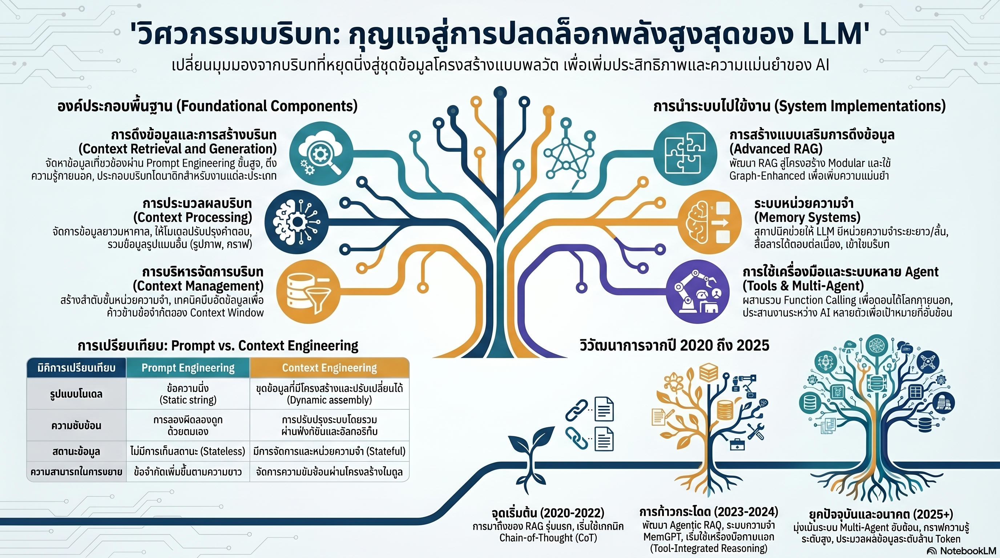

[กลับไปที่หน้าหลัก](../README.md)

สวัสดีครับเพื่อนๆ ที่ติดตามวงการ AI! วันนี้มาเรื่องที่กำลังเปลี่ยนวิธีที่นักพัฒนามองการทำงานกับ LLM: "Context Engineering ศาสตร์ใหม่ที่บอกว่าปัญหาของ AI ไม่ใช่โมเดลไม่ฉลาดพอ แต่คือเราจัดการ 'ข้อมูลที่ส่งให้' ได้แย่เกินไปครับ"

คุณเคยสังเกตไหมครับว่า เวลาคุยกับ AI นานๆ แล้ว AI เริ่ม "หลงลืม" สิ่งที่คุยกันตอนต้น หรือตอบผิดพลาดแม้ว่าคุณเพิ่งส่งเอกสารยาวให้อ่าน ปัญหาเหล่านั้นไม่ได้เกิดเพราะโมเดลโง่ แต่เพราะโมเดลรับข้อมูลผิดชุด ผิดเวลา หรือข้อมูลที่สำคัญที่สุดบังเอิญอยู่ตรงกลางพอดี ซึ่งงานวิจัยพิสูจน์ว่า AI มักจะ "หลงลืม" ส่วนกลางเสมอครับ?

คุณรู้ไหมครับว่า Context Window ที่ยาวขึ้นเป็นล้าน Token ไม่ได้แก้ปัญหา Lost-in-the-Middle แต่กลับสร้างปัญหาใหม่คือ Quadratic Complexity O(n²) ที่ทำให้ต้นทุนการประมวลผลพุ่งขึ้นเป็นกำลังสองตามความยาว Input — เหมือนการแก้ปัญหาบ้านที่ごちゃกวนด้วยการซื้อตู้เก็บของเพิ่มโดยไม่เคยจัดของเลยครับ?

และคุณเคยนึกไหมครับว่า AI ที่อ่านหนังสือทั้งเล่มได้ และ AI ที่เขียนบทความยาวคุณภาพสูงได้ นั้นต้องการทักษะที่ต่างกันโดยสิ้นเชิง — และวงการ AI ปัจจุบันเก่งอย่างแรกมากกว่าอย่างหลังอย่างไม่สมดุล ซึ่งถือเป็น Critical Research Gap ที่ Context Engineering กำลังพยายามถมอยู่ครับ?

งานวิจัยนี้กำลังบอกว่า: ยุคของ "เดาใจโมเดลด้วยการลองผิดลองถูก" กำลังสิ้นสุด และยุคของ "ออกแบบโลจิสติกส์ข้อมูลอย่างเป็นวิทยาศาสตร์" กำลังเริ่มต้น — และนั่นเปลี่ยนบทบาทของคนที่ทำงานกับ AI จาก "ผู้ใช้งาน" เป็น "วิศวกรระบบข้อมูล" ครับ

========================================

🤔 ทบทวนความเชื่อเดิมๆ: สิ่งที่เราคิดเกี่ยวกับ Prompt Engineering และ LLM Context

▪ "Context Window ที่ยาวขึ้นแก้ปัญหา AI ลืมข้อมูลได้ — ใส่ข้อมูลทั้งหมดเข้าไปเลยแล้วจบ" → Lost-in-the-Middle พิสูจน์ว่าไม่จริงครับ AI จำได้ดีที่ต้นและท้าย แต่ข้อมูลตรงกลางของ Context ยาวๆ จะถูกให้ความสำคัญน้อยลงอย่างมีนัยสำคัญ และ Quadratic Complexity ยังทำให้ต้นทุนพุ่งขึ้นเป็นกำลังสองด้วยครับ

▪ "Prompt Engineering คือทักษะสำคัญที่สุดในการทำงานกับ AI — เขียน Prompt เก่งก็พอ" → Prompt Engineering เป็น Stateless ครับ มันไม่มี c_mem และ c_state ทำให้ทำซ้ำได้ยาก ขยายยาก และ Debug ยาก Context Engineering ยกระดับสิ่งนี้เป็น System-level optimization ที่มีโครงสร้างครับ

▪ "ยิ่งให้ข้อมูลมาก AI ยิ่งตอบได้ดี — ใส่ข้อมูลเข้าไปเยอะๆ ไว้ก่อน" → หลักการ Information-Theoretic Optimality บอกตรงข้ามครับ เป้าหมายไม่ใช่การหาข้อมูลที่ "เยอะที่สุด" หรือ "คล้ายที่สุด" แต่คือการเลือกข้อมูลที่ Maximize Mutual Information กับคำตอบที่ต้องการ ข้อมูลที่ไม่เกี่ยวข้องไม่ได้ช่วย แต่สร้าง Noise ที่รบกวนครับ

▪ "AI ที่อ่านและเข้าใจบริบทซับซ้อนได้ดีก็จะเขียนผลลัพธ์ที่ซับซ้อนและยาวได้ดีเช่นกัน — ทักษะสองอย่างนี้ไปด้วยกัน" → นี่คือ Fundamental Asymmetry ที่งานวิจัยระบุเป็น Critical Gap ครับ โมเดลปัจจุบันเก่งการ Understand มากกว่าการ Generate ผลลัพธ์ยาวๆ ที่ซับซ้อนอย่างไม่สมดุล

ความจริงที่น่าคิดคือ: ปัญหาส่วนใหญ่ที่เราโทษว่า "AI ฉลาดไม่พอ" อาจแก้ได้ด้วยการจัดการข้อมูลที่ดีขึ้น ก่อนที่จะต้องไปขอโมเดลที่ใหญ่กว่าครับ

========================================

🧠 พื้นฐานที่ต้องเข้าใจก่อน: Context Assembly Function, Lost-in-the-Middle, Memory Hierarchy, Fundamental Asymmetry

=== Prompt Engineering vs Context Engineering: ต่างกันระดับไหน? ===

Prompt Engineering คือการออกแบบ "คำพูด" ที่ใช้คุยกับ AI ครับ มันทำงานได้ดีในงานที่ง่ายและไม่ต้องการ State — ถามคำถาม ได้คำตอบ จบครับ แต่ในงาน Agentic ที่ต้องทำงานหลายขั้นตอน จำสิ่งที่คุยไปแล้ว และปรับตัวตามสถานการณ์ที่เปลี่ยนไป Prompt Engineering เริ่มแสดงข้อจำกัดครับ

Context Engineering คือการออกแบบ "ระบบส่งข้อมูล" ให้ AI ในแต่ละ Moment ครับ มองบริบทเป็นหน่วยข้อมูลที่มีวงจรชีวิต มีโครงสร้าง และถูกจัดการอย่างมีกลยุทธ์ เหมือนความต่างระหว่างการ "พูดคุยกับคนที่จำทุกอย่างไม่ได้" กับการ "ออกแบบระบบ Briefing ที่ทำให้คนๆ นั้นได้รับข้อมูลที่ถูกต้องในเวลาที่ถูกต้องเสมอ" ครับ

ความแตกต่างสามมิติที่สำคัญ:

มิติ Statefulness: Prompt Engineering เป็น Stateless ครับ ทุก Conversation เริ่มใหม่หมด ส่วน Context Engineering ถูกออกแบบให้ Stateful โดยมีองค์ประกอบชัดเจนสำหรับ Memory (c_mem) และ State ปัจจุบัน (c_state) ซึ่งทำให้ AI มี "บุคลิกภาพ" ที่ต่อเนื่องและสอดคล้องกับ Brand ของธุรกิจได้ครับ

มิติ Scalability: Prompt ยาวขึ้นมักหักง่ายครับ เพิ่มความซับซ้อนแล้วระบบพัง ส่วน Context Engineering ใช้ Modular Composition — แต่ละส่วนของบริบทเป็น Module ที่เพิ่มลดได้โดยไม่ทำให้ส่วนอื่นพังครับ

มิติ Error Analysis: แทนที่จะนั่งแก้ Prompt ด้วยมือแบบลองผิดลองถูก Context Engineering ช่วยให้ Debug ฟังก์ชันการเลือกข้อมูลแต่ละส่วนได้อย่างเป็นระบบ ช่วยลดต้นทุน Token ในระยะยาวอย่างมีนัยสำคัญครับ

=== Context Assembly Function: สมการเบื้องหลังคำตอบที่แม่นยำ ===

ในมุมมองวิศวกรรม บริบท (C) ที่ AI ได้รับในแต่ละ Turn ไม่ใช่แค่ "ข้อความที่พิมพ์" แต่คือผลลัพธ์ของ Assembly Function ที่รวมส่วนประกอบหลายชิ้นเข้าด้วยกันครับ:

C = A(c_instr, c_know, c_tools, c_mem, c_state, c_query)

c_instr (System Instructions): กฎเหล็กที่กำหนดบทบาท ขอบเขต และจริยธรรมของ AI ในระบบนั้นครับ ส่วนนี้ควรมั่นคงและไม่ควรเปลี่ยนบ่อยครับ

c_know (External Knowledge): ความรู้จากภายนอกที่ดึงมาตอนนั้น เช่น ข้อมูลจาก RAG, Knowledge Graph หรือ Database ครับ นี่คือส่วนที่ "ตอบโจทย์เฉพาะ" ของคำถามนั้นๆ

c_tools (Tool Definitions): รายชื่อ API และ Tool ที่ AI สามารถเรียกใช้ได้ในงานนั้นครับ ไม่ควรใส่ Tool ทุกตัวเข้าไปเสมอ เพราะเพิ่ม Token โดยไม่จำเป็นครับ

c_mem (Memory): ความจำที่ถูกคัดสรรมาจากการสนทนาและการทำงานในอดีตครับ ไม่ใช่ประวัติทั้งหมด แต่คือส่วนที่ "น่าจะเกี่ยวข้อง" กับงานปัจจุบัน

c_state (Dynamic State): สถานะปัจจุบันของโลกในช่วงนั้น เช่น งานที่ทำอยู่, ผลลัพธ์ที่ได้ไปแล้ว หรือแผนที่วางไว้ครับ

หลักการ Information-Theoretic Optimality คือหัวใจของการเลือกข้อมูลใส่ใน c_know ครับ เป้าหมายไม่ใช่หาข้อมูลที่ "คล้ายคำถาม" แต่คือหาข้อมูลที่ "Maximize Mutual Information กับคำตอบที่ต้องการ" ซึ่งต่างกัน ครับ

ตัวอย่างเข้าใจง่าย: ถ้าถามว่า "ยา A กับยา B ทานร่วมกันได้ไหม" ข้อมูลที่ "คล้ายคำถาม" อาจเป็นรายการยาทั้งหมด แต่ข้อมูลที่ Maximize Mutual Information คือ Drug Interaction Table ของยาทั้งสองตัวโดยเฉพาะครับ

=== Lost-in-the-Middle: ทำไม Context ยาวถึงไม่ใช่คำตอบ ===

งานวิจัย Lost-in-the-Middle แสดงให้เห็นรูปแบบที่ชัดเจนมากครับ: เมื่อให้ AI อ่านเอกสารยาว ข้อมูลที่อยู่ตอนต้นและตอนท้ายจะถูกจำได้ดีกว่าข้อมูลตรงกลางอย่างมีนัยสำคัญ

เหมือนความจำของมนุษย์ที่มี "Primacy Effect" (จำสิ่งแรก) และ "Recency Effect" (จำสิ่งหลังสุด) แต่ข้อมูลตรงกลางหลุดหายครับ สำหรับ LLM ปัญหานี้ซับซ้อนกว่าเพราะเกิดจากโครงสร้างของ Attention Mechanism เองครับ

ปัญหาที่สองคือ Quadratic Complexity ครับ ความยาว Context ที่เพิ่มขึ้น 2 เท่า ทำให้ต้นทุนการคำนวณเพิ่มขึ้น 4 เท่า ถ้า Context ยาว 10 เท่า ต้นทุนจะ 100 เท่า ซึ่งนี่คือเหตุผลที่ "ใส่ข้อมูลทุกอย่างเข้าไปเลย" ไม่ใช่กลยุทธ์ที่ Scalable ในระยะยาวครับ

Context Engineering แก้ปัญหานี้ด้วยการคัดกรองข้อมูลก่อนใส่เข้าไปครับ ให้เฉพาะข้อมูลที่ "ต้องการจริงๆ" เข้าถึง Context Window แทนที่จะยัดทุกอย่างที่อาจเกี่ยวข้องเข้าไป

=== Memory Hierarchies กับ Ebbinghaus Forgetting Curve ===

หนึ่งในแนวคิดที่ล้ำลึกที่สุดใน Context Engineering คือการนำ Ebbinghaus Forgetting Curve จากจิตวิทยามาออกแบบระบบความจำของ AI ครับ

Hermann Ebbinghaus ค้นพบว่ามนุษย์ลืมข้อมูลตาม Exponential Decay ครับ ถ้าไม่ทบทวน ข้อมูลที่เรียนรู้มาจะหายไปอย่างรวดเร็ว แต่ถ้าทบทวนในเวลาที่เหมาะสม การจำจะยาวนานขึ้นมากโดยใช้ความพยายามน้อยลง

ระบบ MemoryBank ใช้หลักการนี้กับ AI ครับ:

Deduplication & Merging: ข้อมูลซ้ำซ้อนถูกรวมหรือลบออก ทำให้ Memory ที่เก็บไว้มีความหนาแน่นของสารสนเทศสูงครับ เหมือนการจัดห้องสมุดที่รวมหนังสือที่เหมือนกันออกแทนที่จะซ้ำหลายเล่ม

Conflict Resolution: เมื่อข้อมูลใหม่ขัดแย้งกับข้อมูลเก่า ระบบต้องตัดสินใจว่าจะเก็บอันไหนและทิ้งอันไหนครับ ไม่เช่นนั้น AI จะตอบด้วยข้อมูลที่ล้าสมัย เหมือนแผนที่เมืองที่ไม่ได้อัปเดตถนนใหม่ครับ

Memory Hierarchies: แบ่งความจำออกเป็นระยะสั้น (Short-term) ที่พร้อมใช้งานทันทีใน Context Window และระยะยาว (Long-term) ที่เก็บอยู่ใน Vector Database และดึงขึ้นมาเฉพาะเมื่อเกี่ยวข้องครับ เหมือนความต่างระหว่าง RAM ที่ประมวลผลอยู่ กับ Hard Drive ที่เก็บข้อมูลระยะยาวครับ

=== Fundamental Asymmetry: ช่องว่างที่ใหญ่ที่สุดของ AI ปัจจุบัน ===

นี่คือประเด็นที่ผมคิดว่าน่าสนใจและนำไปคิดต่อได้มากที่สุดในงานวิจัยนี้ครับ งานวิจัยระบุว่า AI ปัจจุบันมี Fundamental Asymmetry ที่ชัดเจนระหว่างสองทักษะ:

Input/Understanding: AI อ่านและเข้าใจบริบทซับซ้อนได้ดีมาก โมเดลปัจจุบันสามารถอ่านหนังสือทั้งเล่ม เข้าใจ Nuance ของภาษา และตอบคำถามละเอียดจาก Context ยาวๆ ได้อย่างน่าประทับใจครับ

Output/Generation: แต่การเขียนผลลัพธ์ยาวๆ ที่มีคุณภาพสม่ำเสมอ มีโครงสร้างซับซ้อน และสอดคล้องตลอดเล่ม ยังเป็นปัญหาที่ยังแก้ได้ไม่สมบูรณ์ครับ AI มักเขียนดีในช่วงต้น แต่คุณภาพและความสอดคล้องจะลดลงในส่วนหลัง

ช่องว่างนี้ไม่ได้มีสาเหตุจากโมเดลไม่ฉลาดพอ แต่มาจาก Autoregressive Generation ที่ต้องเขียน Token ทีละตัวโดยไม่สามารถ "ย้อนกลับ" ไปแก้ส่วนต้นได้อย่างเป็นระบบเหมือนที่มนุษย์ทำตอน Revise เอกสารครับ Context Engineering จะเป็นกุญแจสำคัญในการถมช่องว่างนี้ด้วยการออกแบบกลไก Self-consistency และ Long-form Planning ที่ดีขึ้นครับ

========================================

🎯 ประเด็นที่ควรคิดต่อ

Context Engineering เปิดประเด็นที่น่าสนใจหลายระดับครับ:

— โลจิสติกส์ข้อมูลคือทักษะใหม่ที่มีมูลค่าสูง: ในโลกที่โมเดล AI ทุกค่ายฉลาดพอๆ กัน คนที่รู้ว่าจะจัดการข้อมูลอย่างไรจะเป็นคนที่ได้ผลลัพธ์ต่างออกไปครับ ทักษะ Context Engineering จึงไม่ใช่แค่ "วิธีใช้ AI" แต่คือ Information Architecture ระดับระบบครับ

— Fundamental Asymmetry คือโอกาสสำหรับผู้พัฒนา: ช่องว่างระหว่าง Understanding และ Generation ยังใหญ่มากครับ ทีมที่แก้ปัญหา Long-form Generation ได้ดีกว่า ไม่ว่าจะด้วย Better Context Management, Hierarchical Planning หรือ Iterative Refinement จะมีข้อได้เปรียบสูงมากครับ

— คำถามที่สำคัญที่สุด: ถ้า Context Engineering ทำให้ AI ฉลาดขึ้นไม่ใช่จากโมเดลที่ดีขึ้น แต่จากการจัดการข้อมูลที่ดีขึ้น — ในอนาคตที่ AI สามารถจัดการ Context ของตัวเองได้อัตโนมัติ (Self-context Managing) บทบาทของมนุษย์ในการ "กำหนดว่า AI ควรรู้อะไร" จะยังสำคัญอยู่ไหม หรือ AI จะตัดสินใจสิ่งนั้นได้ดีกว่าเราเองครับ?

#ContextEngineering #PromptEngineering #LargeLanguageModels #AgenticAI #MemoryHierarchy #InformationRetrieval #RAG #AIResearch #LLMOptimization #AIEngineering #ContextWindow #FundamentalAsymmetry
