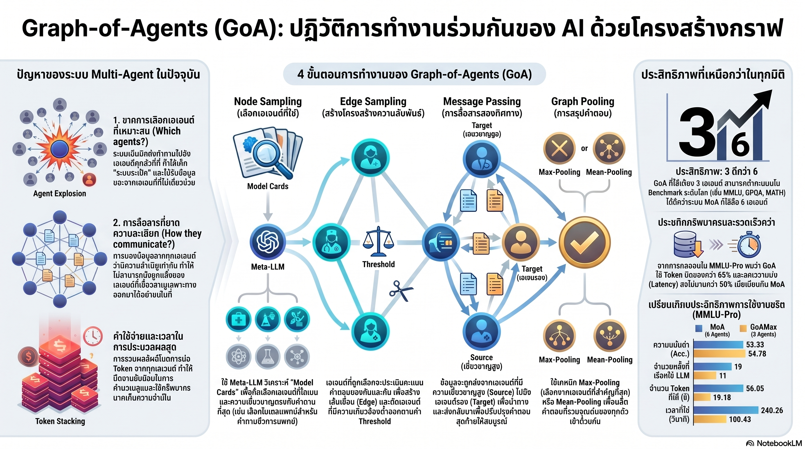

[กลับไปที่หน้าหลัก](../README.md)

สวัสดีครับเพื่อนๆ ที่ติดตามวงการ AI! วันนี้มาเรื่องที่ตอบคำถามสำคัญของยุค "LLM Zoo" ว่า ถ้ามีโมเดลให้เลือกมากมาย วิธีจัดทีม AI ที่ฉลาดที่สุดคืออะไร? คำตอบของ Graph-of-Agents (GoA) อาจพลิกความเชื่อเรื่อง Collective Intelligence ทั้งหมดครับ

คุณเคยสงสัยไหมครับว่า ถ้า AI ทีมหนึ่งใช้ 6 โมเดลประชุมพร้อมกัน แต่อีกทีมใช้แค่ 3 โมเดลที่คัดสรรแล้ว ทีมไหนจะฉลาดกว่า? คำตอบที่ฟังดูสวนทาง Intuition คือ 3 ตัวชนะครับ

คุณรู้ไหมครับว่า การเชิญ AI ทุกตัวมาตอบคำถามพร้อมกันอาจด้อยกว่าการ "เลือกแค่คนที่เกี่ยวข้อง" เพราะโมเดลที่ไม่เชี่ยวชาญสร้าง "คำตอบลวง" ที่ปนเปื้อนการใช้เหตุผลของทั้งทีมได้ เช่น AI สาย Math ที่ตอบคำถามกายวิภาคว่า "Answer: 1" แล้วทุกคนสับสน?

และคุณเคยนึกไหมครับว่า GoA ลดการเรียก API ลง 40% ลด Token ลงกว่า 60% และเร็วขึ้น 2 เท่า โดยที่ความแม่นยำสูงกว่าระบบ 6 เอเจนต์เดิมด้วย — นั่นคือทำน้อยลงแต่ได้มากขึ้นจริงๆ ครับ?

แนวคิดนี้คือ Graph-of-Agents และมันกำลังเปลี่ยนจาก "เราจะใช้ AI กี่ตัว" เป็น "เราจะบริหารทีม AI อย่างไรให้เกิด Collective Intelligence ที่แท้จริง" ครับ

========================================

🤔 ทบทวนความเชื่อเดิมๆ: สิ่งที่เราคิดเกี่ยวกับ Multi-Agent AI

▪ "AI ทีมที่ใหญ่กว่าและมีโมเดลมากกว่าย่อมฉลาดกว่าและให้คำตอบที่ดีกว่าเสมอ" → GoA 3 ตัวเอาชนะ MoA 6 ตัวในทุก Benchmark (MMLU: 79.18 vs 75.71, GPQA: 40.54 vs 32.83) เพราะ Agent Explosion สร้าง Cognitive Overhead และ Noise มากกว่า Signal ที่ได้ครับ

▪ "การให้ AI ทุกตัวตอบคำถามเดียวกันแล้วเอามาเฉลี่ยหรือรวมกันคือ Collective Intelligence ที่ดีที่สุด" → MoA Concatenation นำคำตอบทุกตัวมาวางรวมกัน ทำให้โมเดลที่ไม่เชี่ยวชาญสร้าง Distractors ปนเปื้อนกระบวนการคิดส่วนรวม GoA ใช้ Graph Structure กรอง Noise ออกก่อนด้วย Score Matrix และ Pruningครับ

▪ "ระบบ Multi-Agent ที่ดีต้องใช้โมเดลที่ใหญ่และแพงที่สุดเป็น Orchestrator" → Meta-LLM ของ GoA ใช้เพียง Qwen2.5-7B-Instruct เป็น Manager ที่วิเคราะห์ Model Cards ตัดสินใจว่าโมเดลไหนเหมาะกับโจทย์ แสดงว่าโมเดลขนาดกลางทำ Orchestration ได้ดีถ้า Context ชัดเจนครับ

▪ "ระบบ Multi-Agent ยิ่งซับซ้อนยิ่งแพงและช้า ไม่คุ้มค่าสำหรับองค์กรทั่วไป" → GoA บน MMLU-Pro ลด LLM Calls จาก 19 เป็น 11-12 (-40%), ลด Tokens จาก 56k เป็น 19-22k (-65%), ลด Latency จาก 240s เป็น 100-118s (-58%) โดยที่ Accuracy สูงกว่าด้วยครับ

ความจริงที่น่าคิดคือ: ปัญหาของ Multi-Agent ในปัจจุบันไม่ใช่ "ไม่มีโมเดลดีพอ" แต่คือ "ไม่มีระบบบริหารที่รู้ว่าเมื่อไหรควรฟังใคร" ซึ่งคือสิ่งที่ GoA แก้ได้ครับ

========================================

🧠 พื้นฐานที่ต้องเข้าใจก่อน: LLM Zoo, MoA, Cognitive Overhead, Score Matrix และ Consensus

=== LLM Zoo คืออะไร? ===

LLM Zoo = ภาวะที่มีโมเดล AI จำนวนมหาศาลให้เลือกใช้จนเลือกไม่ถูก ไม่ใช่ปัญหาว่าไม่มี AI ที่ดีพอ แต่เพราะมีมากเกินไปจนไม่รู้จะจัดการอย่างไร

เปรียบเทียบ: เหมือนร้านอาหารที่มีเมนู 500 รายการ แทนที่จะช่วยให้ตัดสินใจง่ายขึ้น กลับทำให้สับสนมากขึ้น คำถามจึงเปลี่ยนจาก "จะกินอะไร" เป็น "จะบริหารเมนูอย่างไรให้คนสั่งถูก" ครับ

=== MoA vs GoA ===

[MoA (Mixture-of-Agents)]
▸ เชิญโมเดลทุกตัวมาตอบคำถามเดียวกันพร้อมกัน
▸ รวบรวมคำตอบทั้งหมดแบบ Concatenation
▸ ทุกโมเดลมีสิทธิ์เท่ากัน ไม่ว่าจะเชี่ยวชาญหรือไม่
▸ ปัญหา: โมเดลที่ไม่เกี่ยวข้องสร้าง Noise และ Distractors ครับ

[GoA (Graph-of-Agents)]
▸ Meta-LLM คัดเลือกเฉพาะโมเดลที่เกี่ยวข้องกับโจทย์
▸ ใช้โครงสร้างกราฟสื่อสารแบบ Bidirectional
▸ Score Matrix กรอง Agent ที่ไม่เหมาะออกอัตโนมัติ
▸ ผลลัพธ์: คุณภาพสูงขึ้น ต้นทุนลดลงครับ

=== Cognitive Overhead คืออะไร? ===

Cognitive Overhead = ภาระที่เกิดขึ้นเมื่อโมเดลต้องประมวลผลข้อมูลที่ไม่เกี่ยวข้องจำนวนมาก ก่อนจะถึงข้อมูลที่มีประโยชน์จริงๆ

เปรียบเทียบ: เหมือนการประชุมที่เชิญ 20 คนมาพูดแม้จะมีเพียง 3 คนที่รู้เรื่องจริงๆ ทุกคนต้องฟังความเห็นที่ไม่เกี่ยวข้อง 17 ชิ้นก่อนจะได้ยินสิ่งที่สำคัญ ประสิทธิภาพตกลงทันทีครับ

=== Score Matrix และ Pruning Threshold (τ) ===

Score Matrix = เมทริกซ์ที่เอเจนต์แต่ละตัวให้คะแนนความเกี่ยวข้องของกันและกันกับโจทย์ที่ถาม

Pruning Threshold (τ = 0.05) = เกณฑ์ขั้นต่ำ ถ้าเอเจนต์ตัวไหนได้คะแนนต่ำกว่า 0.05 จะถูกตัดออกจากการสื่อสารอัตโนมัติ

เปรียบเทียบ: เหมือน Peer Review ของวารสารวิชาการ ที่ไม่ใช่แค่ Editor ตัดสินว่าใครเหมาะ แต่ผู้เชี่ยวชาญในสายนั้นประเมินกันเองว่าใครควรอยู่ในการอภิปรายครับ

=== Iterative Consensus คืออะไร? ===

Iterative Consensus = กระบวนการที่โมเดลแลกเปลี่ยนและขัดเกลาคำตอบซ้ำๆ ผ่านโครงสร้างกราฟแบบสองทิศทาง จนได้ข้อสรุปที่ดีที่สุด

ต่างจาก Concatenation: ไม่ใช่การนำคำตอบมาวางกองรวมกัน แต่คือการประชุมจริงๆ ที่มีการโต้ตอบและปรับปรุงครับ

========================================

1️⃣ GoA เป็น Superset ของ MoA: 3 ตัวชนะ 6 ตัวด้วย Proposition 1

=== ทำไม "มากกว่า" จึงไม่ใช่ "ดีกว่า" ===

งานวิจัยพิสูจน์ผ่าน Proposition 1 ว่า GoA เป็น "Evolutionary Superset" ของ MoA ซึ่งหมายความว่า MoA แบบเดิมคือกรณีพิเศษกรณีหนึ่งของ GoA ที่เลือกใช้ทุกโมเดลเท่ากันโดยไม่กรองครับ

[สาเหตุที่ MoA เสียเปรียบ]
▸ Agent Explosion: ยิ่งโมเดลมากยิ่ง Cognitive Overhead สูง
▸ Concatenation: รวมคำตอบทุกชิ้นไว้ในบริบทเดียว โมเดลที่ไม่เชี่ยวชาญ "เข้ามาแทรก"
▸ ไม่มี Feedback Loop: ไม่มีการตรวจสอบย้อนกลับว่าคำตอบที่ได้ถูกต้อง

=== ผลลัพธ์บน Benchmark จริง ===

[MMLU (องค์ความรู้ทั่วไป)]
▸ GoAMax: 79.18
▸ MoA 6 เอเจนต์: 75.71 (ต่ำกว่า 3.47 คะแนน)

[GPQA (วิทยาศาสตร์ระดับบัณฑิตศึกษา)]
▸ GoAMean: 40.54
▸ MoA 6 เอเจนต์: 32.83 (ต่ำกว่าถึง 7.71 คะแนน)

[HumanEval (การเขียนโค้ด)]
▸ GoAMean: 84.98

[MedMCQA (การแพทย์)]
▸ GoAMax: 60.04

เปรียบเทียบ: เหมือนทีมแพทย์เฉพาะทาง 3 คนที่เลือกมาอย่างถูกต้อง ย่อมวินิจฉัยโรคได้แม่นยำกว่าคณะกรรมการ 6 คนที่มีทั้งแพทย์และทนายความและวิศวกรที่ไม่เกี่ยวข้อง ซึ่ง "ตัดสินใจโดยเสียงส่วนใหญ่" ครับ

========================================

2️⃣ Node Sampling + Score Matrix + Pruning: ระบบ HR ของทีม AI

=== Meta-LLM ในฐานะ Intelligent Orchestrator ===

GoA ใช้ Meta-LLM (Qwen2.5-7B-Instruct) เป็น "ผู้จัดการทีม" ที่ทำหน้าที่วิเคราะห์ว่าโจทย์แต่ละข้อต้องการผู้เชี่ยวชาญสายไหนครับ

[กระบวนการ Node Sampling]
▸ Meta-LLM อ่าน Model Cards ของโมเดลทุกตัวที่มีใน Pool
▸ วิเคราะห์โจทย์ว่าต้องการทักษะอะไร (เช่น Biomedical + Math)
▸ คัดเลือกเฉพาะโมเดลที่ตรงกับ Domain ออกมา
▸ ตัดโมเดลที่ไม่เกี่ยวข้องออกก่อนเริ่มกระบวนการครับ

ตัวอย่างจริง: คำถามด้าน "Biomedical + Math" → เลือกโมเดลสาย Medical และ Scientific Reasoning → ตัดโมเดลสาย Legal/Creative ออกทันที

=== Score Matrix: Peer Review อัตโนมัติ ===

หลังจากคัดเลือกเบื้องต้นแล้ว GoA ยังมีกลไกตรวจสอบซ้ำอีกชั้นผ่าน Score Matrix ครับ

[กลไก Score Matrix]
▸ เอเจนต์แต่ละตัวประเมินความเกี่ยวข้องของกันและกัน
▸ สร้างเมทริกซ์คะแนนที่สะท้อนว่าใครควรสื่อสารกับใคร
▸ Pruning: ถ้าคะแนน < τ (0.05) → ตัดออกจากกราฟการสื่อสารทันที

[ผลของ Automated Pruning]
▸ กราฟการสื่อสารสะอาดและมีเฉพาะ Edge ที่มีความหมาย
▸ ลด Noise จากโมเดลที่ไม่เชี่ยวชาญ
▸ แต่ละโมเดลทำงานใน Domain ที่ตัวเองถนัดจริงๆ ครับ

เปรียบเทียบ: เหมือนองค์กรที่มีทั้ง Job Description (Model Cards) และ 360-degree Feedback (Score Matrix) ก่อนตัดสินใจว่าใครควรนั่งในห้องประชุมโจทย์นั้นๆ ครับ

========================================

3️⃣ Iterative Consensus Building: เมื่อกราฟสื่อสารแทนการ "วางกองรวมกัน"

=== โครงสร้างสองทิศทางที่สร้าง Alignment ===

แทนที่จะให้ทุกคนตอบพร้อมกันแล้วเอามารวม GoA ออกแบบการสื่อสารให้มี "ทิศทาง" และ "ความหมาย" ที่ชัดเจนครับ

[ทิศทางที่ 1: Source-to-Target (Confidence Propagation)]
▸ โมเดล Top-tier (Source) ที่มี Confidence สูงในโดเมนนั้นส่งคำตอบเบื้องต้นให้โมเดลรอง (Target)
▸ Target รับข้อมูลนี้เป็น "แนวทาง" ในการปรับปรุงคำตอบของตัวเอง
▸ ประสิทธิภาพสูง: ผู้เชี่ยวชาญ "ลีด" ให้ทีมครับ

[ทิศทางที่ 2: Target-to-Source (Iterative Refinement)]
▸ Target ปรับปรุงคำตอบแล้ว ส่งกลับไปให้ Source ตรวจสอบ
▸ Source รับ Feedback และปรับปรุงข้อสรุปสุดท้าย
▸ ผลลัพธ์: Consensus ที่ผ่านการตรวจสอบซ้ำ (Verified Answer) ครับ

=== ความแตกต่างจาก MoA Concatenation ===

[MoA แบบเดิม]
▸ Agent A ตอบ + Agent B ตอบ + Agent C ตอบ → รวมกันเป็น Block ข้อความยาว
▸ โมเดลสรุปต้องอ่านทั้งหมดแล้วตีความเอง
▸ ถ้า Agent B ไม่เชี่ยวชาญ คำตอบของมันยังคงอยู่ใน Context ครับ

[GoA แบบใหม่]
▸ Flow ชัดเจน: Top-tier → Secondary → (Refined) → Top-tier
▸ Pruning ตัด Agent ที่ไม่เกี่ยวข้องออกก่อน
▸ ทุก Edge ในกราฟมีความหมายและมีทิศทางครับ

เปรียบเทียบ: เหมือนความต่างระหว่าง "กล่องรับข้อเสนอแนะที่ทุกคนหยอดความเห็นลงไป" กับ "การประชุม Board ที่มีระเบียบวาระ ผู้เชี่ยวชาญพูดก่อน แล้วถามความเห็นที่เหลือ แล้วสรุปร่วมกัน" ครับ

========================================

4️⃣ Efficiency Stats + Case Study: ทำน้อยลงแต่ได้ผลมากขึ้นจริงๆ

=== ตารางเปรียบเทียบประสิทธิภาพ (MMLU-Pro) ===

[Accuracy (ความแม่นยำ)]
▸ MoA: 53.33
▸ GoA: 54.78 (+1.45 คะแนน พร้อมลดต้นทุนลงมหาศาล)

[LLM Calls (จำนวนการเรียก API)]
▸ MoA: 19 ครั้ง
▸ GoA: 11-12 ครั้ง (ลดลง ~40%)

[Token Usage]
▸ MoA: ~56,050 tokens
▸ GoA: 19,180-22,580 tokens (ลดลง ~60-65%)

[Latency (เวลาประมวลผล)]
▸ MoA: 240.26 วินาที
▸ GoA: 100.43-118.52 วินาที (เร็วขึ้น ~2 เท่า)

เปรียบเทียบ: เหมือนทีมที่ใช้คนน้อยลงครึ่งหนึ่ง ใช้เวลาน้อยลงครึ่งหนึ่ง ประชุมน้อยลง 40% แต่ได้ผลงานที่ดีกว่า นั่นคือสัญญาณที่ชัดเจนว่าปัญหาเดิมไม่ได้อยู่ที่ "ขาดคน" แต่อยู่ที่ "บริหารไม่เป็น" ครับ

=== Case Study: บทเรียนจาก Anatomy + Distractors ===

งานวิจัยยกกรณีศึกษาที่ชี้ให้เห็นอันตรายของ MoA แบบเดิมอย่างชัดเจนครับ

[สถานการณ์]
▸ โจทย์: คำถามด้านกายวิภาค (Anatomy)
▸ ทีม MoA: ประกอบด้วยโมเดลสาย Medical + Math + Code

[สิ่งที่เกิดขึ้นกับโมเดล Math และ Code]
▸ ไม่ได้แค่ "ตอบไม่ตรงประเด็น" แต่สร้าง Distractors
▸ โมเดล Math ตอบสั้นๆ ว่า "Answer: 1" ซึ่งเป็น Pattern ปกติของ Math แต่ผิดบริบทกายวิภาค
▸ คำตอบลวงนี้เข้าไป Pollute Context ของโมเดลอื่นที่ต้องอ่านทุกคำตอบก่อนสรุป
▸ ผลสุดท้าย: คำตอบผิดแม้จะมีโมเดล Medical ที่รู้คำตอบถูกอยู่ในทีมครับ

[GoA แก้อย่างไร]
▸ Score Matrix ตรวจพบว่าโมเดล Math และ Code ไม่เกี่ยวข้องกับ Anatomy
▸ Pruning ตัดทั้งสองออกก่อนเริ่มกระบวนการ
▸ โมเดล Medical สื่อสารกับโมเดลที่มีความรู้กว้างขวางเท่านั้น
▸ ผลลัพธ์: กระบวนการคิดสะอาด คำตอบถูกต้องครับ

เปรียบเทียบ: เหมือนการตัดสินคดีที่ไม่ใช่แค่ "ใครมีความเห็นมากกว่า" แต่ "ใครเป็นพยานผู้เชี่ยวชาญที่เกี่ยวข้องกับคดีนี้จริงๆ" ทนายที่ดีไม่เรียกพยานทุกคนที่รู้จัก แต่เรียกเฉพาะคนที่รู้เรื่องที่พิจารณาอยู่ครับ

========================================

🎯 สรุป: จาก LLM Zoo สู่ AI Management

GoA สรุปได้ด้วย 4 นวัตกรรมหลัก: Proposition 1 (GoA เป็น Superset ของ MoA, 3 ตัวชนะ 6 ตัวในทุก Benchmark), Node Sampling + Score Matrix + Pruning (τ=0.05) ที่กรอง Noise อัตโนมัติ, Iterative Consensus ผ่าน Source↔Target Bidirectional Communication, และ Efficiency ที่ลด LLM Calls -40%, Tokens -65%, Latency -58% พร้อม Accuracy สูงกว่า

สิ่งที่น่าสนใจกว่าตัวเลขคือนัยสำหรับอนาคตของ AI Management ครับ ในยุคที่ทุกองค์กรเข้าถึง AI ระดับเดียวกันได้ ความได้เปรียบไม่ได้อยู่ที่ "ใครมีโมเดลที่ดีกว่า" แต่อยู่ที่ "ใครบริหารทีม AI ได้ฉลาดกว่า" GoA คือหลักฐานว่า Graph Structure + Smart Pruning คือ Framework ที่ทำให้ Collective Intelligence เกิดขึ้นได้จริง ไม่ใช่แค่คำในสไลด์ Presentation ครับ

========================================

💬 คำถามท้ายทาย: ลองคิดดูนะครับ

▪ GoA พิสูจน์ว่า "น้อยแต่เลือกมาดี" ดีกว่า "มากแต่ไม่คัดกรอง" หลักการนี้นำไปใช้กับการบริหารทีมมนุษย์ได้ไหม และองค์กรส่วนใหญ่กำลังทำผิดพลาดแบบ MoA โดยไม่รู้ตัวหรือเปล่าครับ?

▪ Meta-LLM ใช้ Qwen2.5-7B เป็นผู้จัดการที่วิเคราะห์ Model Cards ถ้าในอนาคต AI Manager กลายเป็น Standard สำหรับทุกองค์กร บทบาท CTO และ AI Strategy Lead จะเปลี่ยนไปอย่างไรครับ?

▪ Score Matrix ให้เอเจนต์ประเมินกันเองก่อน Pruning ถ้า AI ประเมินว่าตัวเองไม่เกี่ยวข้อง แล้ว "ยอมถูกตัดออก" นั่นคือ Alignment ที่แท้จริงหรือแค่ Optimization ที่ขาดความเป็นตัวตนครับ?

▪ GoA ลด Token Usage ลง 65% โดยไม่เสียคุณภาพ ถ้าทุก Multi-Agent System ย้ายไปใช้ GoA-style Architecture ผลกระทบต่อ Carbon Footprint ของ AI Industry โดยรวมจะเป็นอย่างไรครับ?

========================================

References:
- Graph-of-Agents (GoA): A Framework for Collective Intelligence in LLM Systems
- Proposition 1: GoA as Evolutionary Superset of MoA
- MMLU, GPQA, HumanEval, MedMCQA Benchmark Comparison
- MMLU-Pro Efficiency Analysis: LLM Calls, Token Usage, Latency
- Node Sampling, Score Matrix, and Automated Pruning (τ = 0.05)
- Meta-LLM: Qwen2.5-7B-Instruct as Orchestrator
- Case Study: Anatomy + Distractor Pollution in MoA

ถ้า Wisdom of Crowds คือหลักการว่าคนหมู่มากฉลาดกว่าผู้เชี่ยวชาญคนเดียว GoA บอกว่า "คนที่เลือกมาอย่างถูกต้องและสื่อสารกันอย่างมีโครงสร้าง" ฉลาดกว่าคนหมู่มากที่ไม่ได้รับการจัดการเสมอครับ

#AI #ArtificialIntelligence #GraphOfAgents #MultiAgent #CollectiveIntelligence #LLM #MixtureOfAgents #AIManagement #LLMZoo #Orchestration #MMLU #GPQA #NLP #AgentAI #AIStrategy
