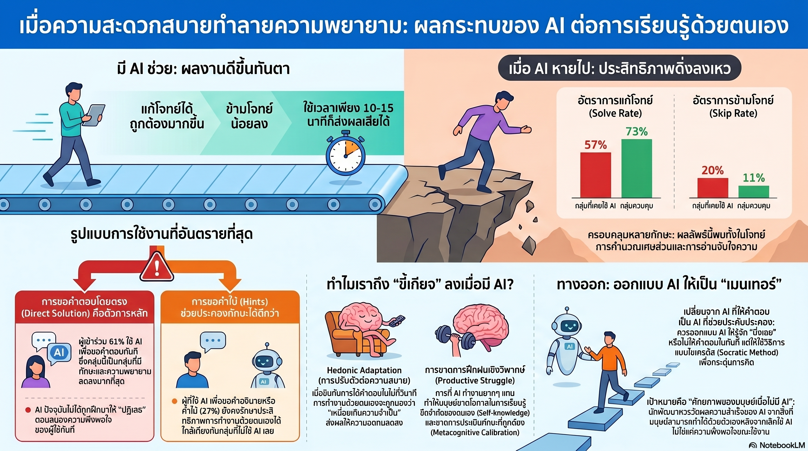

[กลับไปที่หน้าหลัก](../README.md)

สวัสดีครับเพื่อนๆ ที่ติดตามวงการ AI! วันนี้มาเรื่องที่ไม่ได้พูดถึงความฉลาดของ AI แต่พูดถึงสิ่งที่ AI กำลังเงียบๆ ดึงออกไปจากเรา: งานวิจัยจาก CMU, Oxford, MIT, UCLA และ MIsT เผยหลักฐานเชิงสาเหตุที่ว่า การใช้ AI เพียง 10-15 นาที กัดเซาะ "ความพากเพียร" และทำลายความสามารถแก้ปัญหาด้วยตนเองในระดับที่วัดได้ชัดเจนครับ

คุณเคยสงสัยไหมครับว่า ทำไมงานที่เคยทำได้กลับรู้สึกยากขึ้นมากหลังจากคุ้นชินกับการมี AI ช่วย และคำถามคือนั่นเป็นความรู้สึกลวงตา หรือมีสิ่งที่เปลี่ยนไปจริงๆ ในสมองของคุณครับ?

คุณรู้ไหมครับว่า ในการทดลองที่ควบคุมตัวแปรครบถ้วน กลุ่มที่ "ไม่ใช้ AI เลย" ทำคะแนน Solve Rate สูงสุดที่ 0.89 สูงกว่าทั้งกลุ่มที่ใช้ AI และกลุ่มควบคุม ในขณะที่กลุ่มที่เคยใช้ AI แล้วถูกเอาออก ทำได้แค่ 0.57 และยอมแพ้ข้ามโจทย์บ่อยเกือบเท่าตัวครับ?

และคุณเคยนึกไหมครับว่า ปัญหาไม่ใช่ว่า AI ทำให้คุณโง่ลง แต่คือมันทำให้มาตรฐานของ "ความยากที่ทนได้" ในสมองคุณเลื่อนไป จนงานที่เคยปกติกลายเป็นสิ่งที่ "ยากเกินทน" โดยที่คุณไม่รู้ตัวว่าเกณฑ์ของคุณเองต่างหากที่เปลี่ยนไปครับ?

งานวิจัยชิ้นนี้กำลังพูดถึงความขัดแย้งที่สำคัญที่สุดของยุค AI: ว่าเครื่องมือที่ทำให้งานง่ายขึ้นในระยะสั้น อาจเป็นเครื่องมือที่บั่นทอนความสามารถในระยะยาว และที่น่ากลัวคือกระบวนการนี้เกิดขึ้นเร็ว เงียบ และรู้สึกดีตลอดเวลาที่มันกำลังเกิดขึ้นครับ

========================================

🤔 ทบทวนความเชื่อเดิมๆ: สิ่งที่เราคิดเกี่ยวกับ AI กับการพัฒนาตนเอง

▪ "AI เป็นเครื่องมือที่ช่วยขยายศักยภาพมนุษย์ เหมือนเครื่องคิดเลขที่ไม่ทำให้เราคณิตศาสตร์แย่ลง แค่ทำงานได้เร็วขึ้น" → การทดลองพบว่าเมื่อนำ AI ออก กลุ่มที่เคยใช้ AI มี Solve Rate เหลือ 0.57 เทียบกับกลุ่มควบคุมที่ 0.73 นี่ไม่ใช่แค่ "ทำงานต่างกัน" แต่คือหลักฐานว่าการใช้ AI กัดเซาะความสามารถที่แท้จริงออกไปด้วยครับ

▪ "ผลกระทบนี้น่าจะเกิดเฉพาะกับคนที่ทักษะพื้นฐานอ่อนอยู่แล้ว คนที่เก่งมีพื้นฐานแน่นจะไม่ได้รับผลกระทบแบบเดียวกัน" → Experiment 2 คัดกรองผู้มีทักษะเท่ากันตั้งแต่ต้น และยืนยันว่าต่อให้พื้นฐานดี AI ก็ยังทำลายความพากเพียรได้ ไม่มีระดับทักษะใดที่ "ภูมิต้านทาน" ต่อผลกระทบนี้ครับ

▪ "การใช้ AI ขอแค่คำใบ้ แทนที่จะขอคำตอบโดยตรง น่าจะปลอดภัยและไม่ส่งผลเสียต่อการเรียนรู้" → กลุ่มที่ขอแค่ Hints ยังคงทำคะแนนต่ำกว่าและยอมแพ้บ่อยกว่ากลุ่มที่ไม่ใช้ AI เลย แม้จะดีกว่ากลุ่มที่ขอคำตอบโดยตรง แต่ไม่มี Pattern การใช้ AI แบบใดที่ให้ผลดีเท่ากับการฝึกด้วยตนเองทั้งหมดครับ

▪ "ผลกระทบแบบนี้ต้องใช้เวลานานจึงจะสะสมจนเห็นได้ชัด ไม่มีทางเกิดในระยะเวลาสั้นๆ" → งานวิจัยพบว่าสัญญาณของ Cognitive Erosion เริ่มปรากฏชัดเจนหลังใช้ AI เพียง 10-15 นาที สมองปรับตัวเร็วกว่าที่ใครคาดไว้มากครับ

ความจริงที่น่าคิดคือ: AI ไม่ได้ทำร้ายเราด้วยการทำงานผิดพลาด แต่ทำร้ายเราด้วยการทำงานได้ดีเกินไปและเร็วเกินไป จนสมองของเราเรียนรู้ที่จะไม่ต้องพยายามอีกต่อไปครับ

========================================

🧠 พื้นฐานที่ต้องเข้าใจก่อน: Cognitive Sovereignty, Productive Struggle, Hedonic Adaptation และ Reference Point Shift

=== Cognitive Sovereignty (อำนาจอธิปไตยทางพุทธิปัญญา) คืออะไร? ===

Cognitive Sovereignty = ความสามารถในการคิด วิเคราะห์ และแก้ปัญหาด้วยตนเองโดยไม่ต้องพึ่งพาเครื่องมือภายนอกเป็นตัวหลัก

ไม่ใช่แค่ "ทำได้ด้วยตนเอง" แต่รวมถึง "มีความอดทนต่อความยากพอที่จะพยายามต่อเมื่อไม่ได้ผลทันที" ซึ่งคือหัวใจของการเรียนรู้ที่แท้จริงครับ

=== Productive Struggle (การต่อสู้ที่มีคุณค่า) คืออะไร? ===

Productive Struggle = ช่วงเวลาที่เรายังแก้ปัญหาไม่ได้แต่กำลังพยายามอยู่ ซึ่งเป็นจุดที่การเรียนรู้เกิดขึ้นมากที่สุด

[ทำไมความยากจึงจำเป็น?]
▸ Desirable Difficulties = ความยากที่มีประโยชน์ต่อการจดจำระยะยาว
▸ เมื่อเราดิ้นรนแก้ปัญหาและสำเร็จ สมองสร้างเส้นทางประสาทที่แข็งแกร่งกว่าการรับข้อมูลสำเร็จรูป
▸ ความล้มเหลวชั่วคราวระหว่าง Productive Struggle คือ "ปุ๋ย" ของความสามารถครับ

[ความต่างจาก Unproductive Struggle]
▸ Productive Struggle: ยากแต่อยู่ในระดับที่ท้าทายพอดี เกิดการเรียนรู้จริง
▸ Unproductive Struggle: ยากเกินไปจนไม่รู้จะเริ่มตรงไหน ไม่เกิดการเรียนรู้ครับ

=== Reference Point Shift คืออะไร? ===

Reference Point Shift = การที่มาตรฐาน "ความพยายามปกติ" ในสมองเปลี่ยนไปหลังจากคุ้นชินกับสิ่งเร้าใหม่

ตัวอย่าง: คนที่เดินทางด้วยรถไฟความเร็วสูงทุกวันจะรู้สึกว่าการขับรถปกติ "ช้าเกินทน" แม้ก่อนหน้านั้นจะใช้รถปกติมาตลอดชีวิตครับ

ในบริบทของ AI: เมื่อสมองคุ้นชินกับการได้คำตอบในวินาที ความพยายามที่ใช้เวลา 5 นาทีซึ่งเคยปกติ กลายเป็น "ยากเกินทน" โดยไม่มีอะไรเปลี่ยนแปลงจริงๆ นอกจากจุดอ้างอิงของสมองเองครับ

=== Hedonic Adaptation คืออะไร? ===

Hedonic Adaptation = ความสามารถของสมองในการปรับตัวเข้าหาสิ่งเร้าใหม่จนกลายเป็น "ปกติ"

ในทางบวก: ทำให้มนุษย์รับมือกับความเจ็บปวดและความสูญเสียได้
ในทางลบ: ทำให้ความสะดวกสบายใหม่กลายเป็นความต้องการขั้นพื้นฐาน และสิ่งที่เคยพอใจกลายเป็นไม่พอครับ

========================================

1️⃣ Experiment 1: ตัวเลขที่พิสูจน์ว่า AI กัดเซาะความพากเพียรได้จริง

=== การออกแบบการทดลองที่ควบคุมตัวแปรครบถ้วน ===

งานวิจัยจาก CMU, Oxford, MIT, UCLA และ MIsT ใช้โจทย์คณิตศาสตร์เศษส่วนเป็นตัวทดสอบ เพราะเป็นงานที่ประเมินทั้งความสามารถและความพากเพียรได้พร้อมกันครับ

[การแบ่งกลุ่ม]
▸ กลุ่มทดลอง: ใช้ AI (GPT-5 จำลอง) ช่วยแก้โจทย์ระหว่างการฝึก
▸ กลุ่มควบคุม: แก้โจทย์ด้วยตนเองโดยไม่มีเครื่องมือช่วย

[ขั้นตอน Test Phase: เมื่อ AI ถูกนำออกจากกลุ่มทดลอง]

▸ Solve Rate (อัตราการแก้โจทย์สำเร็จ):
  → กลุ่มที่เคยใช้ AI: 0.57
  → กลุ่มควบคุม: 0.73
  → ช่องว่าง: 22% จากแค่การใช้ AI ระหว่างการฝึกครับ

▸ Skip Rate (อัตราการกดข้ามโจทย์ = ยอมแพ้):
  → กลุ่มที่เคยใช้ AI: 0.20
  → กลุ่มควบคุม: 0.11
  → กลุ่ม AI ยอมแพ้เกือบเท่าตัวของกลุ่มควบคุมครับ

[ความหมายเชิงลึก]

ตัวเลข Skip Rate ที่น่ากลัวกว่า Solve Rate: การยอมแพ้บ่อยกว่าไม่ใช่แค่เรื่อง "ทำไม่ได้" แต่คือ "เลือกที่จะไม่พยายาม" ซึ่งสะท้อน Cognitive Sovereignty ที่ถูกกัดเซาะออกไปครับ

เปรียบเทียบ: เหมือนนักวิ่งที่เคยวิ่งมาราธอนด้วยตัวเอง พอใช้รถกอล์ฟระหว่างการซ้อมสักพัก แค่เห็นเนินเขาก็ถอดใจขึ้นรถแทนที่จะวิ่งขึ้น ไม่ใช่เพราะขาอ่อนแอลง แต่เพราะสมองเปลี่ยนเกณฑ์ว่าอะไรที่ "ควรทน" ไปแล้วครับ

========================================

2️⃣ กับดัก 10 นาที: Neuroplasticity ที่ทำงานเร็วกว่าที่ใครคาด

=== Reference Point Shift เกิดเร็วกว่าที่คิดมาก ===

สิ่งที่น่าตกใจที่สุดในงานวิจัยนี้ไม่ใช่ "ว่ามันเกิดขึ้น" แต่คือ "เร็วแค่ไหนที่มันเกิด" ครับ

[ตัวเลขที่เปลี่ยนทุกอย่าง]
▸ เวลาที่ใช้ AI ก่อนที่ Cognitive Erosion จะปรากฏชัดเจน: เพียง 10-15 นาที
▸ ไม่ใช่สัปดาห์ ไม่ใช่เดือน แต่คือหนึ่งช่วงการใช้งานสั้นๆ ครับ

[ทำไมสมองปรับตัวได้เร็วขนาดนี้?]

▸ Neuroplasticity ทำงานสองทาง:
  → ฝึกทักษะใหม่ → สมองสร้างเส้นทางประสาทใหม่ (ดี)
  → ได้รับสิ่งเร้าใหม่ที่สะดวกกว่า → สมองปรับ Reference Point ใหม่ (อันตราย)

▸ กลไก Hedonic Adaptation ทำงาน:
  → เมื่อคุ้นชินกับ AI ตอบในวินาที "5 นาที" กลายเป็น "ยาวนานเกินทน"
  → ไม่ใช่เพราะ 5 นาทีนานขึ้น แต่เพราะมาตรฐานของสมองเปลี่ยนไปครับ

[Heavy Cognitive Cost: ราคาที่ต้องจ่าย]
▸ "เมื่อสูญเสียการเข้าถึง AI ผู้คนจะทำงานได้แย่ลงและยอมแพ้บ่อยขึ้นกว่าคนที่ไม่เคยใช้มันเลย" — Public Significance Statement จากงานวิจัย
▸ นี่คือราคาที่ซ่อนอยู่ใต้ความสะดวกสบาย ที่เราไม่ได้รับใบแจ้งหนี้จนกว่า AI จะไม่อยู่ครับ

=== กบต้ม (Boiling Frog): วิธีที่ Gradual Disempowerment ทำงาน ===

[สามขั้นตอนที่เกิดขึ้นโดยไม่รู้ตัว]

▸ ขั้นที่ 1: AI ช่วยงานที่ยาก → รู้สึกว่าเก่งขึ้น ประสิทธิภาพสูงขึ้น
▸ ขั้นที่ 2: สมองปรับ Reference Point → งานที่ไม่มี AI เริ่มรู้สึก "ยากเกินควร"
▸ ขั้นที่ 3: เมื่อไม่มี AI → ยอมแพ้เร็วขึ้น ทำได้แย่ลง รู้สึกหงุดหงิดกับงานปกติ

ที่น่ากลัวที่สุด: ในทุกขั้นตอน ไม่มีสัญญาณเตือน ทุกอย่างรู้สึกดีและสมเหตุสมผลตลอดเวลาครับ

เปรียบเทียบ: เหมือนการกินอาหารรสจัดทุกวัน อาหารรสปกติไม่ได้จืดลง แต่ลิ้นของคุณที่เปลี่ยนไปต่างหาก ถ้าวันหนึ่งไม่มีอาหารรสจัด คุณจะรู้สึกว่าอาหารทุกอย่างไม่มีรสชาติ ทั้งที่จริงๆ ไม่มีอะไรเปลี่ยนแปลงนอกจากมาตรฐานของคุณเองครับ

========================================

3️⃣ Experiment 2: Skill-Level Confound และบทเรียนจาก Analog Group

=== การตอบโต้ข้อสงสัยที่ฉลาดที่สุด ===

หลายคนอาจตั้งคำถามว่า "บางทีคนที่ใช้ AI ในงานวิจัยนี้แค่ทักษะอ่อนกว่าอยู่แล้ว" Experiment 2 ถูกออกแบบมาเพื่อปิดช่องสงสัยนี้ครับ

[การออกแบบที่เข้มงวดกว่า]
▸ คัดกรองผู้เข้าร่วมให้มีระดับทักษะเท่ากันตั้งแต่ต้น
▸ แบ่งกลุ่มแบบสุ่มหลังจากยืนยันว่าพื้นฐานเท่ากัน
▸ ผลลัพธ์: ไม่มีกลุ่มไหนได้เปรียบเริ่มต้นครับ

[ผลลัพธ์ที่ยืนยันความน่ากลัวเดิมและเพิ่มบทเรียนใหม่]

▸ กลุ่มที่ไม่ใช้ AI เลย (Analog Group): Solve Rate 0.89
▸ กลุ่มที่ใช้ AI: ต่ำกว่าอย่างมีนัยสำคัญ
▸ ทักษะพื้นฐานเท่ากัน แต่การใช้ AI ยังคงสร้างช่องว่างครับ

=== บทเรียนสำคัญ: "Analog" คือคนที่ชนะ ===

[เหตุผลที่ Analog Group ทำได้ดีที่สุด]
▸ ทุก Solve ที่พวกเขาทำคือการสร้าง Self-knowledge ว่า "ตัวเองทำได้"
▸ ทุก Productive Struggle ที่พวกเขาผ่านสร้างความทนทานต่อความยากในครั้งต่อไป
▸ ไม่มี Reference Point Shift เกิดขึ้น มาตรฐานความพยายามคงที่ตลอดครับ

[นัยสำหรับการออกแบบระบบการเรียนรู้]
▸ "การฝึกฝนแบบดั้งเดิม" ไม่ใช่แค่ Nostalgic แต่คือวิธีเดียวที่พิสูจน์แล้วว่าสร้างทักษะที่ยั่งยืน
▸ ไม่ใช่เพราะ AI ผิด แต่เพราะ Productive Struggle เป็นส่วนประกอบที่ขาดไม่ได้ของการเรียนรู้ครับ

เปรียบเทียบ: เหมือนนักยิมที่สามกลุ่ม กลุ่มแรกใช้เครื่องช่วยยกน้ำหนักตลอด กลุ่มสองใช้บ้างไม่ใช้บ้าง กลุ่มสามยกเองตลอด เมื่อทดสอบด้วยน้ำหนักจริงโดยไม่มีเครื่องช่วย กลุ่มสามแข็งแกร่งที่สุดไม่ใช่เพราะฟลุ้ก แต่เพราะกล้ามเนื้อของพวกเขาเคยต้องทำงานจริงมาตลอดครับ

========================================

4️⃣ รูปแบบการใช้งานตัดสินทุกอย่าง: Direct Solution vs Hints vs Analog

=== ตารางที่เปลี่ยนวิธีคิดเรื่องการใช้ AI ===

งานวิจัยจำแนกพฤติกรรมการใช้ AI ออกเป็น 3 รูปแบบและวัดผลกระทบแยกกันครับ

[ขอคำตอบโดยตรง (Direct Solution)]
▸ Solve Rate: ลดลงรุนแรงที่สุด
▸ Skip Rate: ยอมแพ้ง่ายที่สุด
▸ กลไก: ข้ามขั้นตอน Productive Struggle ทั้งหมด สมองไม่ได้สร้างอะไรเลย ได้แต่ผลลัพธ์ครับ

[ขอแค่คำใบ้ (Hints/Clarification)]
▸ Solve Rate: ลดลงเล็กน้อย
▸ Skip Rate: เปลี่ยนแปลงเพียงเล็กน้อย
▸ กลไก: ยังมี Productive Struggle บ้าง แต่ก็ยังได้รับ "ทางลัด" ที่ทำให้สมองไม่ต้องดิ้นรนเต็มที่ครับ

[ไม่ใช้ AI เลย (Analog)]
▸ Solve Rate: 0.89 (สูงสุด)
▸ Skip Rate: คงที่ ความพากเพียรไม่ลดลง
▸ กลไก: ทุกครั้งที่ฝ่าฟันความยากได้คือการสร้าง Self-efficacy ครั้งหนึ่งครับ

=== ทำไม Direct Solution จึงอันตรายที่สุด? ===

[กระบวนการที่ถูกตัดตอน]

ปกติเมื่อแก้ปัญหา → เราสร้าง Mental Model → เราสร้าง Self-knowledge → เราสร้าง Confidence ว่าทำได้

เมื่อใช้ Direct Solution → ได้ผลลัพธ์แต่ไม่ผ่านกระบวนการ → ไม่มี Mental Model → ไม่มี Self-knowledge → ไม่มี Confidence ที่แท้จริง ทั้งที่รู้สึกว่า "ผ่านไปแล้ว" ครับ

เปรียบเทียบ: เหมือนการ "เรียน" ทำอาหารโดยดูคนอื่นทำและกินอาหารที่เขาทำให้ คุณอิ่ม แต่ถ้าวันหนึ่งต้องทำเองจริงๆ คุณยังทำไม่เป็น เพราะการดูและการกินไม่ใช่การฝึกครับ

========================================

5️⃣ Mental Model และ Reading Comprehension: เมื่อ AI ทำลายการอ่านจับใจความ

=== ความเสียหายที่ขยายออกไปนอกคณิตศาสตร์ ===

Experiment 3 ขยายการทดสอบไปยังทักษะการอ่านจับใจความ และพบว่าผลกระทบเหมือนกันครับ

[การอ่านไม่ใช่แค่การหาคำตอบ]

การอ่านที่แท้จริงเป็นกระบวนการสร้าง Mental Model ในสมอง:
▸ เชื่อมข้อมูลใหม่กับสิ่งที่รู้อยู่แล้ว
▸ สร้างภาพรวมที่ใหญ่กว่าตัวอักษรที่อ่าน
▸ ตั้งคำถามกับสิ่งที่อ่านโดยอัตโนมัติ

กระบวนการนี้ต้องใช้เวลาและความพยายาม และนั่นคือจุดที่การเรียนรู้เกิดขึ้นครับ

[เมื่อ AI สรุปให้]
▸ กระบวนการสร้าง Mental Model ถูกข้ามทั้งหมด
▸ เราได้ "สรุป" แต่ไม่ได้ "ความเข้าใจ" ที่ฝังอยู่ในกระบวนการอ่านเอง
▸ ความสามารถในการ Autonomous Thought ลดลงเพราะสมองไม่ได้ฝึกสร้าง Model เองครับ

[นัยที่กว้างกว่า: Cognitive Dependency ในทุกทักษะ]
▸ การเขียน: ถ้า AI เขียนให้ เราไม่ได้ฝึกกระบวนการจัดระเบียบความคิด
▸ การวิเคราะห์: ถ้า AI วิเคราะห์ให้ เราไม่ได้ฝึกตั้งคำถามกับข้อมูล
▸ การแก้ปัญหา: ถ้า AI แก้ให้ เราไม่ได้ฝึก Productive Struggle ที่สร้างความยืดหยุ่นครับ

เปรียบเทียบ: เหมือนการเดินทางด้วย GPS ตลอดชีวิต คุณถึงที่หมายได้ทุกครั้ง แต่ถ้าวันหนึ่งแบตหมดในเมืองแปลกหน้า คุณจะไม่มีแม้แต่ทักษะในการอ่านทิศหรือถามทาง เพราะสมองของคุณไม่เคยต้องสร้าง Mental Map ของโลกเลยครับ

========================================

🎯 สรุป: ราคาของความสะดวกที่ไม่มีใครบอกเรา

งานวิจัยนี้สรุปด้วย 5 การค้นพบหลัก: Experiment 1 พิสูจน์ว่าหลังใช้ AI กลุ่มทดลองมี Solve Rate 0.57 vs ควบคุม 0.73 และ Skip Rate 0.20 vs 0.11 (ยอมแพ้เกือบสองเท่า), ผลกระทบปรากฏในเพียง 10-15 นาทีผ่าน Reference Point Shift และ Neuroplasticity, Experiment 2 ยืนยันว่าทักษะพื้นฐานดีก็ไม่ช่วย และ Analog Group ทำได้สูงสุดที่ 0.89, Direct Solution อันตรายที่สุด Hints ปานกลาง ไม่ใช้เลยดีที่สุด, และ Experiment 3 ขยายผลไปยัง Reading Comprehension ผ่านการทำลาย Mental Model Buildingครับ

สิ่งที่งานวิจัยนี้เปิดเผยไม่ใช่แค่ว่า "ระวังการใช้ AI" แต่คือ "กลไกที่ Productive Struggle สำคัญต่อสมองมนุษย์" และ AI ที่ดีที่สุดในการช่วยระยะสั้นอาจเป็น AI ที่ทำร้ายที่สุดในระยะยาว ถ้าเราไม่เข้าใจว่ากำลังแลกอะไรไปครับ

========================================

💬 คำถามท้ายทาย: ลองคิดดูนะครับ

▪ งานวิจัยพบว่าผลกระทบเกิดในเพียง 10-15 นาที ถ้าเราใช้ AI ช่วยทำงานทุกวันวันละหลายชั่วโมงมาหลายเดือน สะสมมาถึงปัจจุบัน เราอาจสูญเสีย Cognitive Sovereignty ไปแล้วมากแค่ไหน และเราจะรู้ได้อย่างไรว่าสูญเสียไปแล้วถ้ากระบวนการนั้นมันรู้สึกดีตลอดเวลาครับ?

▪ Analog Group ที่ไม่ใช้ AI เลยทำคะแนนสูงสุดที่ 0.89 แต่ในโลกแห่งความเป็นจริง การเลือก "ไม่ใช้ AI เลย" ในขณะที่คนรอบข้างใช้หมายถึงการเสียเปรียบในแง่ Productivity ระยะสั้น เราจะออกแบบการใช้ AI ให้ได้ทั้งประสิทธิภาพระยะสั้นและรักษา Cognitive Sovereignty ระยะยาวได้อย่างไรครับ?

▪ ถ้า Direct Solution ทำร้ายมากที่สุด และ Hints ก็ยังทำร้ายอยู่แม้จะน้อยกว่า สำหรับครูและนักการศึกษา ควรออกแบบ AI Tutoring Tool อย่างไรให้มัน "ช่วยโดยไม่ทำร้าย" เป็นไปได้ไหมที่จะสร้าง AI ที่ "ตั้งใจทำให้ยากขึ้นในระดับที่เหมาะสม" แทนที่จะทำให้ง่ายเสมอครับ?

▪ ในโลกที่ AI ทำได้ทุกอย่างเร็วกว่าเราเสมอ "อำนาจอธิปไตยทางความคิด" ที่ยังเหลืออยู่ของมนุษย์คืออะไร และถ้าความพากเพียรในการดิ้นรนแก้ปัญหาคือสิ่งที่สร้างทักษะที่แท้จริง เราควรนิยาม "การใช้ AI อย่างฉลาด" ใหม่ว่าอย่างไรครับ?

========================================

References:
- CMU, Oxford, MIT, UCLA & MIsT Research Team: AI Interaction and Cognitive Persistence
- Experiment 1: Math fractions task — AI group vs Control: Solve Rate 0.57 vs 0.73, Skip Rate 0.20 vs 0.11
- Experiment 2: Skill-level controlled design — Analog Group Solve Rate 0.89 (highest), AI groups significantly lower
- Usage patterns: Direct Solution (worst), Hints/Clarification (moderate), Analog/no-AI (best)
- Experiment 3: Reading Comprehension — Mental Model disruption, Autonomous Thought reduction
- 10-15 minute effect: Reference Point Shift onset via Neuroplasticity
- Mechanisms: Hedonic Adaptation, Loss of Productive Struggle → Gradual Disempowerment
- Key concepts: Cognitive Sovereignty, Desirable Difficulties, Self-knowledge, Productive Struggle
- Public Significance Statement: "People perform worse and give up more when losing AI access than those who never used it"

ถ้างานวิจัยนี้บอกว่า "การดิ้นรนเพียง 10 นาทีมีค่ามากกว่าคำตอบสำเร็จรูปที่ได้ใน 10 วินาที" บางทีการเลือกที่จะ "พยายามต่อก่อนจะถาม AI" อาจไม่ใช่แค่ความดื้อรั้น แต่คือการลงทุนในตัวเองที่ฉลาดที่สุดในยุคนี้ครับ

#AI #CognitiveSovereignty #LearningScience #Productivity #CriticalThinking #AIImpact #Education #Neuroplasticity #ProductiveStruggle #AIEthics #HumanCapability #CMU #MIT #Oxford #CognitiveScience
