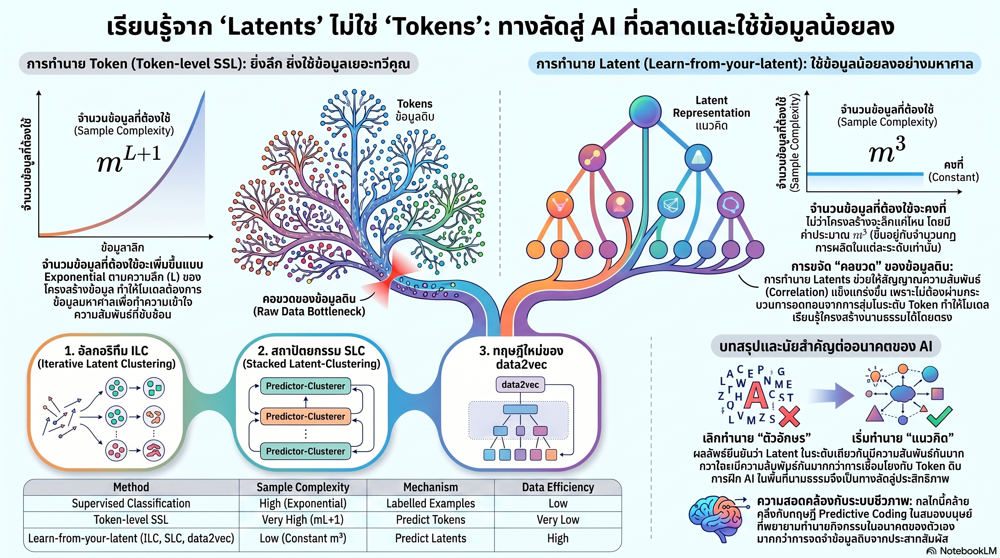

[กลับไปที่หน้าหลัก](../README.md)

สวัสดีครับเพื่อนๆ ที่ติดตามวงการ AI! LLM ชั้นนำต้องใช้ข้อมูล 10^13-10^14 tokens ครับ แต่เด็กทารกคนหนึ่งบรรลุทักษะภาษาระดับผู้ใหญ่ด้วยข้อมูลน้อยกว่านั้น 100,000 เท่า ครับ งานวิจัยล่าสุดใช้ Random Hierarchy Model พิสูจน์ด้วยคณิตศาสตร์ว่าเหตุผลคือ Next-token Prediction ต้องการ Sample Complexity ระดับ m^(L+1) ที่เพิ่มแบบ Exponential ตามความลึกของภาษา ครับ แต่ถ้าเปลี่ยนเป้าหมายจากการทำนาย Token เป็นการทำนาย Latent Representation จะลดลงเหลือเพียง m^3 ครับ — แทบคงที่ไม่ว่าภาษาจะซับซ้อนแค่ไหนครับ

คุณเคยสังเกตไหมครับว่า Next-token Prediction ที่เป็นหัวใจของ LLM ทั้งโลกนั้นเปรียบเหมือนการพยายามเข้าใจวิศวกรรมของรถยนต์จากการสังเกตสีตัวถังที่เปลี่ยนตามแสงแดดครับ มันเป็น Surface-level Signal ที่มี Variance สูงมากครับ — แต่ AI ต้องเห็นสีตัวถังหลายล้านล้านครั้งจึงจะ "เดา" โครงสร้างที่ซ่อนอยู่ข้างในออกมาได้ครับ?

คุณรู้ไหมครับว่า data2vec และ JEPA ที่เป็น State-of-the-art ในหลาย Domain นั้น กำลังทำ Hierarchical Latent Prediction โดยไม่รู้ตัวผ่านกลไก Teacher-Student ครับ Teacher สร้าง Latent Representation แล้วส่งให้ Student ทำนายครับ ไม่ใช่ให้ Student ทำนาย Token ดิบครับ — และนั่นคือเหตุผลที่มันเก่งกว่า ไม่ใช่เพราะสถาปัตยกรรมที่ซับซ้อนกว่าครับ?

และคุณเคยนึกไหมครับว่า ถ้า m^3 vs m^(L+1) คือความจริง ช่วงเวลาที่ข้อมูลบนอินเทอร์เน็ตหมดลงซึ่งกำลังจะมาถึงอาจไม่ใช่ "วิกฤต" ครับ แต่คือแรงบีบที่จะทำให้วงการต้องเปลี่ยนมาเรียนรู้จาก Latent แทน Token ครับ — เหมือนพลังงานแสงอาทิตย์ที่ถูกบีบให้เกิดเมื่อน้ำมันแพงพอครับ?

งานวิจัยนี้กำลังบอกว่า: "ข้อจำกัดของ AI ไม่ได้อยู่ที่ว่าโลกมีข้อมูลให้เรียนรู้น้อยเกินไปครับ แต่อยู่ที่เราบังคับให้ AI เรียนจากชั้นผิวเผินของข้อมูลนั้น ทั้งที่โครงสร้างแห่งความหมายอยู่ลึกกว่านั้นมากครับ"

========================================

🤔 ทบทวนความเชื่อเดิมๆ: สิ่งที่เราคิดเกี่ยวกับ Data และการเรียนรู้ของ AI

▪ "AI ต้องการข้อมูลมากขึ้นเรื่อยๆ เพื่อฉลาดขึ้น — Scaling Data คือวิธีเดียวที่พิสูจน์แล้วว่าได้ผลครับ" → Sample Complexity ของ Next-token Prediction เพิ่มแบบ m^(L+1) ที่ Exponential ตามความลึก L ของโครงสร้างภาษาครับ ยิ่งภาษาซับซ้อนขึ้น Data ที่ต้องใช้เพิ่มขึ้นทวีคูณโดยไม่มีที่สิ้นสุดครับ Scaling Data ภายใต้ Token Prediction จึงไม่ใช่ทางออก แต่คือการวิ่งบนลู่วิ่งที่เร็วขึ้นเรื่อยๆ ครับ

▪ "เด็กเรียนรู้ภาษาได้เร็วเพราะสมองมนุษย์มีโครงสร้างที่วิวัฒนาการมาเฉพาะสำหรับภาษาครับ — AI เรียนรู้ต่างกันครับ" → RHM พิสูจน์ว่าความแตกต่างสำคัญไม่ได้อยู่ที่ Architecture แต่อยู่ที่ Learning Objective ครับ ถ้า AI เรียนจาก Latent (m^3) แทน Token (m^(L+1)) ช่องว่าง 100,000 เท่านั้นจะแคบลงอย่างมีนัยสำคัญครับ Brain Efficiency ไม่ใช่ Magic ของ Biological Neural Network แต่เป็น Mathematical Property ของการเรียนรู้จาก Abstraction ที่ถูกต้องครับ

▪ "H-JEPA ที่ Stack หลาย Layer ของ Latent Space เป็นทิศทางที่ถูกต้องสำหรับ Hierarchical Learning ครับ — ยิ่งซับซ้อนยิ่งดีครับ" → งานวิจัยพบว่า data2vec ที่ดูเรียบง่ายกว่าทำ Hierarchical Latent Prediction อยู่แล้ว Implicitly ผ่าน Teacher-Student ครับ การ Stack Layers อย่างชัดเจนใน H-JEPA อาจเป็นการทำงานซ้ำซ้อนถ้า Latent Prediction Target ถูกต้องอยู่แล้วครับ ความซับซ้อนไม่ใช่คำตอบถ้า Learning Objective ที่เรียบง่ายกว่าครอบคลุมสิ่งเดียวกันแล้วครับ

▪ "Next-token Prediction ที่ใช้อยู่ทุกวันนี้ให้ผลดีพอแล้ว — มีหลักฐานพิสูจน์จาก Scaling Law ที่ชัดเจนครับ" → Scaling Law ของ Token Prediction พิสูจน์ว่าถ้าเพิ่ม Data และ Compute ผลดีขึ้นครับ แต่ไม่ได้พิสูจน์ว่ามันเป็น Objective ที่ Optimal ครับ m^(L+1) ที่เพิ่ม Exponential บอกว่า Token Prediction ยิ่งเจ็บปวดขึ้นเรื่อยๆ เมื่อภาษาซับซ้อนขึ้น ในขณะที่ m^3 ของ Latent Prediction แทบคงที่ครับ Scaling Law ที่ดีกว่าอาจรอเราอยู่ที่ Latent Space ครับ

ความจริงที่น่าคิดคือ: "เราไม่ได้ขาดข้อมูลครับ เราขาด Learning Objective ที่ถูกต้องครับ"

========================================

🧠 พื้นฐานที่ต้องเข้าใจก่อน: Signal Dilution, Random Hierarchy Model, m^3 vs m^(L+1), Latent Prediction, และ Teacher-Student Mechanism

=== Signal Dilution: ทำไม Token ถึงเป็น Noisy Teacher ===

ภาษามนุษย์มีโครงสร้างแบบ Hierarchical ครับ คำรวมกันเป็นวลี วลีรวมกันเป็นประโยค ประโยครวมกันเป็น Paragraph แต่ละชั้นมี Semantic Structure ที่ต่างกันครับ

Next-token Prediction บอก AI ว่า "จงทำนายคำถัดไป" ครับ แต่คำแต่ละคำมี Variance สูงมากครับ ประโยคเดียวกันพูดได้หลายสิบวิธีด้วยคำที่ต่างกันโดยสิ้นเชิงครับ AI ต้องเห็น Variation ของทุกคำในทุก Context เพื่อ "เดา" ว่า Underlying Structure คืออะไรครับ นั่นคือสิ่งที่งานวิจัยเรียกว่า Signal Dilution ครับ

เปรียบเหมือนครูที่ไม่เคยอธิบายหลักการทางคณิตศาสตร์ แต่แค่ให้นักเรียนท่องสมการตัวอย่างล้านข้อแล้วหวังว่านักเรียนจะสกัด Pattern เองครับ มันได้ผล แต่ต้องใช้ตัวอย่างมากมหาศาลครับ

=== Random Hierarchy Model: คณิตศาสตร์ที่อธิบาย Gap 100,000 เท่า ===

RHM คือ Mathematical Framework ที่ Formalize ความคิดเรื่อง Hierarchical Language Structure ครับ ในโมเดลนี้ภาษามีความลึก L ชั้นและ Vocabulary ขนาด m ในแต่ละชั้นครับ

ผลลัพธ์ที่ได้จาก RHM ชัดเจนมากครับ

Token-level SSL Sample Complexity ครับ ระบุว่า AI ต้องการตัวอย่างระดับ m^(L+1) ครับ ถ้า m=10 และ L=3 (ภาษาที่มีความลึก 3 ชั้น) ต้องการตัวอย่าง 10,000 ครับ แต่ถ้า L=6 ต้องการ 10,000,000 ครับ Exponential Growth ที่ไม่มีที่สิ้นสุดครับ

Latent Prediction Sample Complexity ครับ ระบุว่า AI ต้องการเพียง m^3 (หรือ vm^3 ที่ v คือขนาด Vocabulary สำหรับ Prediction) ครับ ถ้า m=10 ต้องการ 1,000 ตัวอย่างครับ และตัวเลขนี้แทบไม่เปลี่ยนตาม L ครับ ไม่ว่าภาษาจะมีความลึก 3 ชั้นหรือ 10 ชั้น m^3 ยังคงอยู่ที่ 1,000 ครับ

นี่คือการอธิบายทางคณิตศาสตร์ว่าทำไมเด็กถึงเรียนได้ด้วยข้อมูลน้อยกว่าครับ สมองมนุษย์ไม่ได้ Predict ว่าคำถัดไปจะเป็นอะไรครับ มัน Predict สภาวะของ Neural Representation ตัวเองในอนาคตครับ ซึ่งเป็น Latent-level Prediction นั่นเองครับ

=== Predictive Coding: เมื่อสมองพิสูจน์ทฤษฎีก่อน AI ===

Predictive Coding เป็นทฤษฎีทางประสาทวิทยาที่เสนอว่า Cortex ทำงานด้วยการทำนายอยู่ตลอดเวลาครับ ไม่ใช่รอรับ Sensory Input แล้วค่อย Process แบบ Bottom-up ครับ แต่สร้าง Internal Prediction ว่าสภาวะต่อไปจะเป็นอะไร และอัปเดตเมื่อ Prediction Error เกิดขึ้นครับ

สิ่งที่สำคัญคือ Prediction เหล่านี้ทำในระดับ Latent Representation ไม่ใช่ระดับ Sensory Pixel ครับ สมองไม่ Predict ว่า "Pixel ตรงนี้จะเปลี่ยนสีเป็นอะไร" แต่ Predict ว่า "Object ที่ฉันกำลังดูอยู่คืออะไรและจะเคลื่อนที่อย่างไร" ครับ

งานวิจัยแสดงว่า RHM พิสูจน์ว่า Predictive Coding ที่ระดับ Latent ให้ Sample Efficiency ดีกว่า Sensory-level Prediction อย่างมีนัยสำคัญทางคณิตศาสตร์ครับ ซึ่งสอดคล้องกับวิธีที่สมองจริงๆ ทำงานครับ

=== data2vec และ JEPA: Latent Prediction ในทางปฏิบัติ ===

data2vec ใช้ Teacher-Student Self-Distillation ครับ Teacher เป็น Slow-moving Average ของ Student Network ครับ Teacher ประมวลผล Input ที่สมบูรณ์และสร้าง Latent Representation ครับ Student รับ Input ที่มี Masking และต้องทำนาย Latent ของ Teacher ครับ

สิ่งที่งานวิจัยค้นพบคือ data2vec กำลังทำ Hierarchical Latent Prediction อยู่แล้ว Implicitly ครับ Teacher Network ที่ Update ช้ากว่าจะสร้าง Representation ที่ Smooth และ Abstract กว่า Student ครับ ทำให้ Student เรียนรู้โครงสร้างที่ลึกกว่าระดับ Token โดยธรรมชาติครับ

JEPA (Joint Embedding Predictive Architecture) ของ Yann LeCun ทำในทิศทางเดียวกันอย่างชัดเจนมากขึ้นครับ ทำนาย Embedding ใน Latent Space แทนที่จะ Reconstruct Pixel หรือ Tokenครับ ทั้งสองยืนยันว่า Latent Prediction เป็น Learning Objective ที่ Generalizes ได้ดีกว่าครับ

=== H-JEPA และข้อสรุปที่น่าสนใจ ===

H-JEPA (Hierarchical JEPA) เสนอการ Stack หลาย Layer ของ JEPA เพื่อ Model ลำดับชั้นต่างๆ ของ Abstraction ครับ แนวคิดดูสมเหตุสมผลมากครับ ถ้า Latent ชั้นที่ 1 แทน Phoneme, ชั้นที่ 2 แทน Word, ชั้นที่ 3 แทน Phrase ก็ Stack 3 JEPA ใน Pipeline ครับ

แต่ RHM ชี้ให้เห็นว่า Teacher-Student Mechanism ใน data2vec ทำสิ่งนี้ Implicitly อยู่แล้วครับ Teacher ที่ Update ช้ากว่าธรรมชาติสร้าง Abstraction ที่ Higher-level กว่า Student ทำให้เกิด Implicit Hierarchy โดยไม่ต้องออกแบบ Stack อย่างชัดเจนครับ

นัยสำคัญคือ Architectural Complexity ของ H-JEPA อาจเป็น Redundancy ถ้า Implicit Mechanism ใน data2vec-style Training ครอบคลุมสิ่งเดียวกันแล้วครับ บางครั้ง Implicit Emergence ฉลาดกว่า Explicit Design ครับ

========================================

🎯 ประเด็นที่ควรคิดต่อ

— m^3 vs m^(L+1) อาจเป็น Mathematical Justification สำหรับ "Data Wall" ที่วงการ AI กำลังพูดถึงครับ: ถ้า Token Prediction ต้องการ Data แบบ Exponential และข้อมูลบนอินเทอร์เน็ตกำลังหมดลง นั่นหมายความว่าขีดจำกัดไม่ได้อยู่ที่ว่า "มีข้อมูลพอหรือเปล่า" แต่ที่ว่า "Learning Objective ที่ใช้อยู่ Scale ได้ถึงจุดไหน" ครับ Latent Prediction ที่ m^3 อาจเป็น Paradigm Shift ที่ทำให้ AI ยุคถัดไปไม่ต้องพึ่ง Internet Scale Data อีกต่อไปครับ

— Teacher-Student ที่ทำ Implicit Hierarchical Learning คือ Evidence ที่น่าสนใจว่า Emergence สำคัญพอๆ กับ Design ในสถาปัตยกรรม AI ครับ: วงการ AI มักให้ Credit กับ Architecture Innovation เช่น Transformer, MoE, State Space Models ครับ แต่ data2vec แสดงว่า Training Objective สามารถ Elicit Emergent Behaviors ที่เทียบเท่ากับการออกแบบ Architecture โดยตรงได้ครับ นั่นหมายความว่าอาจมี Simple Architectures จำนวนมากที่ยังไม่ถูก Unlock เพราะใช้ Training Objective ที่ไม่เหมาะสมอยู่ครับ

— ถ้า Latent Prediction ให้ Data Efficiency สูงกว่า มันอาจ Democratize AI Training ได้จริงครับ: วันนี้ความสามารถในการ Pre-train LLM จาก Scratch ถูก Concentrate อยู่ที่กลุ่มองค์กรที่มีงบมหาศาลครับ ถ้า m^3 แทนที่ m^(L+1) เป็นความจริง ขนาดของ Dataset ที่ต้องการจะลดลงอย่างมหาศาลครับ และนั่นอาจเปลี่ยน Competitive Landscape ของ AI ได้อย่างรุนแรงครับ — ความได้เปรียบจะไม่ใช่ "ใครมีข้อมูลมากที่สุด" แต่ "ใครมี Latent Prediction Architecture ที่ดีที่สุดครับ"

#LatentPrediction #TokenPrediction #RandomHierarchyModel #data2vec #JEPA #SelfSupervisedLearning #PredictiveCoding #DataEfficiency #SignalDilution #TeacherStudent #DataWall #AIResearch #SampleComplexity #HierarchicalLearning #CognitiveAI
