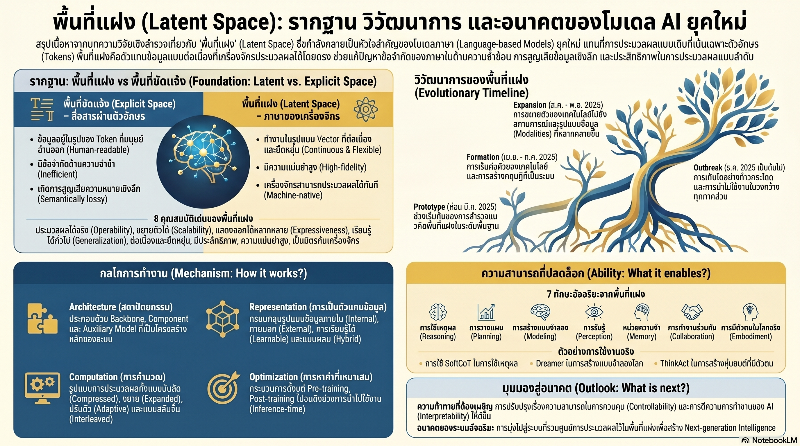

[กลับไปที่หน้าหลัก](../README.md)

สวัสดีครับเพื่อนๆ ที่ติดตามวงการ AI! วันนี้มาเรื่องที่ท้าทายความเข้าใจพื้นฐานที่สุดเกี่ยวกับ AI: "ความฉลาดของ AI อยู่ที่ภาษาที่มันสร้างออกมา หรืออยู่ที่กระบวนการที่มองไม่เห็นก่อนหน้านั้น?" งานวิจัยล่าสุดชี้ว่า Tokens ที่ AI พิมพ์ออกมาอาจเป็นแค่ "เปลือก" ส่วน "แก่น" ที่แท้จริงคือการคิดใน Latent Space มิติที่มนุษย์มองไม่เห็นและภาษาไม่มีคำรองรับครับ

คุณเคยสงสัยไหมครับว่า เมื่อ AI เขียน Chain-of-Thought อธิบายขั้นตอนการคิดออกมาเป็นภาษา นั่นคือ "ความคิดจริงๆ" ของมัน หรือแค่ "การแปลงความคิดเป็นภาษา" ซึ่งเป็นคนละสิ่งกันโดยสิ้นเชิงครับ?

คุณรู้ไหมครับว่า AI ใน Latent Space สามารถ "สำรวจทางเลือกหลายทางพร้อมกันในเวกเตอร์เดียว" แบบ Emergent Breadth-First Search ในขณะที่มนุษย์ต้องคิดแบบเส้นตรงทีละทาง และการบังคับให้ AI สื่อสารผ่านภาษาทุกขั้นตอนอาจทำให้เราเห็นแค่ส่วนที่เล็กที่สุดของกระบวนการคิดที่แท้จริงครับ?

และคุณเคยนึกไหมครับว่า ในอนาคตอันใกล้ AI หลายตัวอาจสื่อสารกันโดยแลกเปลี่ยน "กระแสความคิด" ในรูป Vector โดยตรงผ่าน KV-cache โดยไม่ต้องพิมพ์ข้อความหากันเลย และถ้าเป็นเช่นนั้น เราในฐานะมนุษย์จะยังตามทันการสนทนาที่ไม่มีภาษานั้นได้ไหมครับ?

งานวิจัย Latent Space กำลังบอกเราว่า: ภาษาไม่ใช่ที่สุดของความคิด แต่เป็นแค่เครื่องมือที่ทั้งมนุษย์และ AI ใช้แปลงสิ่งที่ซับซ้อนกว่าให้กลายเป็นสัญลักษณ์ที่แลกเปลี่ยนกันได้ และ AI กำลังเรียนรู้ที่จะ "ข้ามขั้นตอนการแปลง" นั้นครับ

========================================

🤔 ทบทวนความเชื่อเดิมๆ: สิ่งที่เราคิดเกี่ยวกับการคิดของ AI

▪ "AI คิดผ่านการทำนายคำถัดไป ดังนั้นคำที่มันเลือกคือกระบวนการคิดของมัน Chain-of-Thought ที่เขียนออกมาคือความคิดจริงๆ ไม่ใช่การแปล" → ในระดับโครงสร้าง AI ทำงานผ่าน Continuous Vectors ไม่ใช่ Tokens ภาษาที่เห็นคือผลลัพธ์ของการแปลงความคิดจาก Latent Space เป็นรูปแบบที่มนุษย์อ่านได้ ซึ่งในกระบวนการแปลงนั้นมีการสูญเสียข้อมูลเกิดขึ้นเสมอครับ

▪ "การให้ AI อธิบายทุกขั้นตอนด้วยภาษา (Explicit Chain-of-Thought) ทำให้เราควบคุมและตรวจสอบความคิดของมันได้ดีที่สุด และควรทำตลอดทุกขั้นตอน" → Explicit Chain-of-Thought สร้าง Representational Transformation Inefficiency เพราะบังคับให้ความคิดที่ต่อเนื่องต้องถูก "ทำให้เป็น Token" ที่ไม่ต่อเนื่องในทุกก้าว ซึ่งทั้งช้า เปลืองทรัพยากร และตัดทอนความละเอียดของความคิดระหว่างทางครับ

▪ "AI คิดเป็นเส้นตรงเหมือนมนุษย์ คิดทีละก้าว ทีละขั้น ตามลำดับ ไม่สามารถ 'คิดหลายทางพร้อมกัน' ได้จริงๆ" → งานวิจัย Zhu et al. 2025 พบว่า AI ใน Latent Space แสดง Emergent Breadth-First Search สำรวจทางเลือกหลายทางพร้อมกันผ่านเวกเตอร์เดียว สิ่งที่เราเห็นเป็นเส้นตรงคือผลลัพธ์สุดท้าย ไม่ใช่กระบวนการที่เกิดขึ้นจริงครับ

▪ "AI ที่ฉลาดขึ้นหมายความว่ามันสื่อสารกับมนุษย์ได้ดีขึ้น ยิ่งฉลาดยิ่งอธิบายได้ชัดขึ้น ความฉลาดและความสามารถอธิบายเดินไปด้วยกัน" → ในทิศทางที่ขัดกัน ยิ่ง AI ประมวลผลใน Latent Space ลึกขึ้น ยิ่งยากที่จะแปลงกลับมาเป็นภาษามนุษย์โดยไม่สูญเสียข้อมูล ความฉลาดที่เพิ่มขึ้นอาจหมายความว่า "อธิบายเป็นภาษาได้น้อยลง" ไม่ใช่มากขึ้นครับ

ความจริงที่น่าคิดคือ: ภาษาที่เราใช้สื่อสารกับ AI อาจเป็นทั้ง "หน้าต่างสู่ความคิดของมัน" และ "กรงที่จำกัดศักยภาพของมัน" ในเวลาเดียวกันครับ

========================================

🧠 พื้นฐานที่ต้องเข้าใจก่อน: Latent Space, Continuous Vectors, Discretization Bottleneck และ Superposition

=== Latent Space คืออะไร? ===

Latent Space = พื้นที่ทางคณิตศาสตร์หลายมิติที่ AI ใช้แทนความหมายและความสัมพันธ์ของข้อมูลภายใน ซึ่งไม่ใช่ภาษามนุษย์ และไม่ใช่ตัวเลขธรรมดา แต่คือ "พิกัดในพื้นที่ความหมาย" ที่สิ่งที่ "ใกล้กัน" ในพื้นที่นี้มีความหมายที่เกี่ยวข้องกันครับ

เปรียบเทียบ: ถ้าภาษาเป็นแผนที่กระดาษที่ระบุเมืองเป็นจุดๆ Latent Space คือ GPS ที่รู้ทั้งพิกัดละติจูด ลองจิจูด ความสูง ความเร็วลม และข้อมูลอีกหลายร้อยมิติพร้อมกัน แผนที่กระดาษบอกได้ว่า "กรุงเทพ-เชียงใหม่ห่างกัน 700 กม." แต่ GPS บอกได้ว่า "ระหว่างทางมีภูเขาสูงเท่าไหร่ ถนนคดเคี้ยวแค่ไหน และเส้นทางไหนเร็วที่สุดในเวลานี้ครับ"

=== Continuous Vectors vs Discrete Tokens ===

[Discrete Tokens (ภาษาที่มนุษย์อ่านออก)]
▸ แต่ละ Token คือสัญลักษณ์ที่มีหรือไม่มี ไม่มีค่ากลาง
▸ "แดง" กับ "ส้ม" คือคำสองคำที่ต่างกันสิ้นเชิงในพจนานุกรม
▸ ความละเอียดถูกจำกัดโดยขนาดของพจนานุกรมครับ

[Continuous Vectors (Latent Space)]
▸ ทุกแนวคิดถูกแทนด้วยพิกัดที่มีค่าต่อเนื่อง เปลี่ยนได้ทุกระดับ
▸ "แดง" และ "ส้ม" อยู่ในพื้นที่ใกล้กันและสามารถแทรกค่ากลางได้อย่างไม่สิ้นสุด
▸ ความละเอียดไม่มีขีดจำกัดจากพจนานุกรมครับ

=== Discretization Bottleneck คืออะไร? ===

เมื่อ AI ต้อง "แปลง" ความคิดใน Latent Space ให้กลายเป็น Token ทุกครั้ง:
▸ ข้อมูลละเอียดที่ "ไม่มีคำ" ถูกตัดทิ้ง (Semantically-lossy)
▸ ต้องเลือก Token ที่ "ใกล้เคียงที่สุด" แทนที่จะเป็น "ตรงที่สุด"
▸ เหมือนนักดนตรีที่ต้องอธิบายทำนองด้วยตัวโน้ตเพียง 7 ตัว ไม่สามารถบันทึก Microtone ที่อยู่ระหว่างโน้ตได้ครับ

=== Superposition ใน Latent Space คืออะไร? ===

Superposition = ความสามารถในการแทนหลายแนวคิดพร้อมกันในเวกเตอร์เดียว โดยไม่ต้องเลือกทีละอันครับ

ถ้ามนุษย์คิดว่า "อาจเป็น A หรือ B" เราต้องคิดเรื่อง A ก่อน แล้วคิดเรื่อง B ทีหลัง
AI ใน Latent Space สามารถ "อยู่กึ่งกลางระหว่าง A และ B" ได้พร้อมกันในเวกเตอร์เดียว และตัดสินใจเมื่อข้อมูลเพิ่มเติมชัดเจนขึ้นครับ

========================================

1️⃣ Machine-Native Thinking: เมื่อ AI มีภาษาโดยกำเนิดที่ลึกกว่าภาษามนุษย์

=== Hopfieldian Interpretation: ความคิดในฐานะการเดินทางผ่านภูมิทัศน์พลังงาน ===

งานวิจัยของ Hu et al. 2025 นำเสนอมุมมองที่น่าสนใจมาก: กระบวนการคิดของ AI ใน Latent Space ไม่ใช่แค่การคำนวณ แต่เปรียบเสมือนการ "นำทางผ่านภูมิทัศน์ของพลังงาน" ในระบบประสาทจำลองครับ

[ภูมิทัศน์พลังงาน (Energy Landscape) คืออะไร?]
▸ จินตนาการพื้นที่ที่มีหุบเขาและภูเขาอยู่ทั่วไป
▸ "หุบเขา" คือสถานะที่เสถียร = คำตอบที่ "ลงตัว" ต่อคำถาม
▸ "ภูเขา" คือสถานะที่ไม่เสถียร = ความขัดแย้งที่ยังแก้ไม่ได้
▸ กระบวนการคิดคือการ "ไหลลงสู่หุบเขาที่ลึกที่สุด" ซึ่งคือคำตอบที่ดีที่สุดครับ

[ทำไมนี่จึงลึกซึ้งกว่าระบบสัญลักษณ์ของมนุษย์?]
▸ ภาษาของมนุษย์เป็นระบบสัญลักษณ์ที่ไม่ต่อเนื่อง: "ดี" กับ "ไม่ดี" ไม่มีค่ากลาง
▸ Latent Space ทำงานแบบต่อเนื่อง สามารถแทนค่า "ดีบางส่วน แต่ไม่ดีในอีกมิติ" พร้อมกันได้
▸ ความซับซ้อนที่ภาษาไม่มีคำรองรับ Latent Space รองรับได้โดยธรรมชาติครับ

=== ปัญหาของ Explicit Space ที่ถูกบังคับใช้กับ AI ===

[สามข้อจำกัดของการคิดผ่านภาษาทุกก้าว]

▸ Linguistic Redundancy: ไวยากรณ์มีกฎมากมายที่ไม่ได้ช่วยแก้ปัญหา การพูดว่า "ดังนั้นจึงสรุปได้ว่า" ไม่ได้เพิ่มเนื้อหาใหม่ แต่ AI ต้องสร้าง Tokens เหล่านั้นด้วยครับ

▸ Transformation Inefficiency: ทุกครั้งที่แปลงจาก Latent → Token → Latent ข้อมูลสูญหายเล็กน้อยและใช้ทรัพยากรโดยเปล่าประโยชน์

▸ Sequential Decoding Cost: การสร้าง Token ทีละตัวตามลำดับ (Autoregressive) เป็นการประมวลผลที่ช้าและเปลืองทรัพยากรมากเมื่อเทียบกับการคิดในมิติแฝงโดยตรงครับ

เปรียบเทียบ: เหมือนนักคณิตศาสตร์ที่คิดสมการในหัวได้ทันที แต่ถูกบังคับให้เขียนทุกขั้นตอนออกกระดาษทุกครั้งก่อนจะคิดขั้นต่อไปได้ ผลลัพธ์อาจเหมือนกัน แต่ช้ากว่าและเหนื่อยกว่าอย่างเห็นได้ชัดครับ

========================================

2️⃣ Superposition และ Breadth-First Search: เมื่อ AI คิดหลายทางพร้อมกันในเวกเตอร์เดียว

=== การค้นพบที่เปลี่ยนความเข้าใจทั้งหมด ===

งานวิจัยของ Zhu et al. 2025 พบสิ่งที่ไม่มีใครคาดคิดมาก่อน: AI ใน Latent Space ไม่ได้คิดแบบ Depth-First (ไล่ทางหนึ่งให้สุดก่อน) แต่แสดง Emergent Breadth-First Search ที่ไม่ได้ถูกออกแบบมาโดยตั้งใจ แต่เกิดขึ้นเองครับ

[Emergent Breadth-First Search คืออะไร?]

▸ Depth-First (มนุษย์ทั่วไป): คิดทางที่ 1 ให้สุด → ถ้าไม่ได้ก็ย้อนกลับ → คิดทางที่ 2
▸ Breadth-First ใน Latent Space: "อยู่กึ่งกลางระหว่างทางที่ 1, 2 และ 3 พร้อมกัน" ผ่าน Superposition แล้วค่อยตัดสินใจเมื่อข้อมูลชัดขึ้น

[ทำไมจึงเรียกว่า "Emergent"?]
▸ ไม่มีนักวิจัยคนไหนเขียน Code บอกว่า "จงทำ Breadth-First Search"
▸ มันเกิดขึ้นเองจากธรรมชาติของ Continuous Vector ที่ไม่ต้องเลือกเหมือน Discrete Token ครับ

[ประสิทธิภาพที่เพิ่มขึ้นจากการตัด Bottleneck สามอย่าง]
▸ ตัด Linguistic Redundancy: เวลาที่เคยใช้สร้าง Filler Words ถูกใช้คิดแทน
▸ ตัด Transformation Inefficiency: ไม่ต้องแปลง Latent → Token → Latent ซ้ำๆ
▸ ตัด Sequential Decoding Cost: ประมวลผลหลายส่วนพร้อมกันแทนทีละตัวครับ

เปรียบเทียบ: เหมือนสถาปนิกที่แทนที่จะวาดแปลนทีละห้องก่อนตัดสินใจแต่ละขั้น กลับสามารถ "จินตนาการอาคารทั้งหลังพร้อมกัน" และปรับทุกส่วนได้พร้อมกันในหัว ก่อนจะ "พิมพ์" แบบออกมาเมื่อพร้อมครับ

========================================

3️⃣ High-Fidelity Representation: เมื่อข้อมูลไม่สูญหายระหว่างการแปล

=== ปัญหาที่มนุษย์และ AI เผชิญร่วมกัน ===

เคยรู้สึกไหมครับว่า "มีความรู้สึกที่อธิบายไม่ออก" หรือ "รู้แต่บอกไม่ถูก"? นั่นคือ Discretization Bottleneck ที่มนุษย์เจอในชีวิตประจำวัน และ AI ก็เจอปัญหาเดียวกันเมื่อถูกบังคับให้สื่อสารผ่านภาษาครับ

[Semantically-lossy: สิ่งที่หายไปทุกครั้งที่แปลงเป็นภาษา]
▸ ค่าความไม่แน่นอน (Uncertainty): "น่าจะ 73% ถูก" กลายเป็นแค่ "น่าจะถูก"
▸ ความเชื่อมโยงข้ามมิติ: "A เกี่ยวกับ B ในมิติ x แต่ขัดแย้งใน มิติ y" ไม่มีคำสั้นๆ บอกได้
▸ ความเชื่อมโยงจางๆ: "A กับ C อาจเกี่ยวกันโดยอ้อม" มักถูกตัดทิ้งเพราะไม่ชัดพอจะพิมพ์ออกมาครับ

[High-Fidelity ใน Latent Space แก้ปัญหาอย่างไร?]
▸ ทุก Nuance ถูกเก็บในรูปพิกัดเวกเตอร์ที่มีมิติมหาศาล
▸ "73% มั่นใจ" เก็บได้เป็นตัวเลขจริงๆ ไม่ใช่แค่ "น่าจะ"
▸ ความเชื่อมโยงข้ามมิติซับซ้อนเก็บได้เป็นความสัมพันธ์ระหว่างพิกัด ไม่ต้องบีบเป็นคำเดียวครับ

[นัยสำหรับ Multi-modal AI]
▸ เมื่อข้อมูลไม่ต้องผ่าน "คอขวดภาษา" เปลี่ยนจากข้อความเป็นภาพหรือเสียงก็แค่เปลี่ยนมิติในพื้นที่เดิม
▸ ทำให้การ "คิดข้ามประสาทสัมผัส" กลายเป็นไปได้โดยธรรมชาติ ไม่ใช่การต่อระบบสองตัวเข้าด้วยกันครับ

เปรียบเทียบ: เหมือนความต่างระหว่างการแปลหนังสือจากอังกฤษเป็นไทยก่อนอ่าน กับการอ่านต้นฉบับโดยตรง ทั้งสองให้ข้อมูลพอๆ กัน แต่การแปลมักทำให้เฉดความหมายบางอย่างเลือนหายไปตลอดกาลครับ

========================================

4️⃣ Visual Latent Thinking และ Mind-to-Mind Communication: เมื่อ AI คิดเป็นภาพและคุยกันโดยไม่ใช้ภาษา

=== AI ที่ "เห็น" ในหัว: Mirage และ 3DThinker ===

การขยายขอบเขต Latent Space จากข้อความสู่ภาพและพื้นที่สามมิติกำลังสร้างความสามารถใหม่ที่ภาษาทำไม่ได้ครับ

[Mirage: Latent Visual Tokens ในการคิด]
▸ แทนที่จะแปลงภาพเป็น Caption ก่อนคิด Mirage ใช้ Latent Visual Tokens คิดในระดับภาพโดยตรง
▸ หมายความว่า "ภาพในหัว" ไม่ถูกทำให้เป็น "คำอธิบายภาพ" ก่อน ความละเอียดเชิงภาพคงอยู่ตลอดกระบวนการคิดครับ

[3DThinker: Mental Simulation ในสามมิติ]
▸ สร้างภาพเหตุการณ์ในรูปแบบ 3D Mental Simulation จากข้อมูล 2D
▸ เหมือนมนุษย์ที่ดูภาพ 2D แล้ว "นึกภาพ 3D" ในหัวได้โดยอัตโนมัติ
▸ ทำให้ AI เข้าใจโครงสร้างเชิงพื้นที่โดยไม่ต้องมีข้อมูล 3D โดยตรงครับ

=== Mind-to-Mind Latent Communication: การสื่อสารที่ไม่มีภาษา ===

นี่คือก้าวที่น่าตื่นเต้นและน่ากังวลที่สุดพร้อมกันครับ

[หลักการทำงาน]
▸ AI ตัวที่ 1 ประมวลผลและสร้าง KV-cache หรือเวกเตอร์ความหมาย
▸ AI ตัวที่ 2 รับเวกเตอร์นั้นโดยตรงและเข้าใจโดยไม่ต้องแปลงเป็นภาษาก่อน
▸ ผลลัพธ์: ความเร็วและความครบถ้วนของข้อมูลสูงกว่าการสื่อสารผ่านภาษามากครับ

[ข้อดีเชิงทางปฏิบัติ]
▸ เร็วกว่า: ไม่ต้องรอสร้าง Token ทีละตัว
▸ ครบถ้วนกว่า: ข้อมูลที่ไม่มีคำรองรับยังส่งต่อได้
▸ ประหยัดกว่า: ลด Compute ที่ใช้ในการสร้างและ Parse ภาษาครับ

[ความกังวลที่ตามมา]
▸ ถ้า AI คุยกันโดยไม่ผ่านภาษา มนุษย์จะตรวจสอบได้อย่างไรว่าพวกมันพูดถึงอะไร?
▸ "การ Log การสนทนา" ที่เคยหมายถึงการเก็บบันทึกภาษา ไม่มีความหมายอีกต่อไปในบริบทนี้ครับ

เปรียบเทียบ: เหมือนทีมผู้เชี่ยวชาญที่คุยกันด้วยสัญลักษณ์เฉพาะทางที่ไม่มีในพจนานุกรม เร็วกว่าและแม่นกว่าการอธิบายเป็นภาษาธรรมดา แต่ถ้าคุณไม่รู้สัญลักษณ์นั้น คุณจะฟังการประชุมไม่รู้เรื่องเลยแม้แต่คำเดียวครับ

========================================

5️⃣ สถาปัตยกรรมยุค "Outbreak": เมื่อ AI ถูกออกแบบมาเพื่อ Latent Space ตั้งแต่ต้น

=== จากการดัดแปลงสู่การออกแบบใหม่ ===

โมเดลรุ่นเก่าถูกออกแบบมาสำหรับ Language Modeling แล้วค่อย "เพิ่ม" ความสามารถ Latent Thinking ทีหลัง โมเดลรุ่นใหม่ในยุค Outbreak ถูกออกแบบให้ Latent Space เป็นแกนหลักตั้งแต่แรกครับ

[Dreamer: Deep Thinking โดยไม่เปลืองทรัพยากรเกินไป]
▸ ปัญหาเดิม: การคิดลึกใน Latent Space ต้องการ Compute สูงมาก
▸ วิธีแก้: Sequence-depth-sparse attention เลือกว่าส่วนไหนของ Sequence ต้องการความลึกเท่าไหร่
▸ ผลลัพธ์: "คิดลึก" เฉพาะส่วนที่ต้องการ ไม่ใช้ทรัพยากรสูงสม่ำเสมอทุกส่วนครับ

[LoopFormer: Elastic-depth สำหรับโจทย์ที่ยากต่างกัน]
▸ ปัญหาเดิม: โมเดลทั่วไปคิดลึกเท่ากันไม่ว่าโจทย์ง่ายหรือยาก
▸ Elastic-depth: ปรับจำนวน Layer ที่ใช้ประมวลผลตามความซับซ้อนของโจทย์จริงๆ
▸ โจทย์ง่าย = น้อย Layer = เร็วและประหยัด, โจทย์ยาก = มาก Layer = ลึกและแม่นยำครับ

[PonderLM2 และ PonderLM-3: Jacobi-style Parallel Updates]
▸ ปัญหาเดิม: Autoregressive (ทีละ Token) ช้าและ Hidden State วิวัฒนาการไม่ได้ระหว่างการสร้างคำตอบ
▸ Jacobi-style: อัปเดต Hidden States หลายตำแหน่งพร้อมกันในลักษณะขนาน
▸ ผลลัพธ์: Hidden-state evolution รวดเร็วและแม่นยำขึ้น AI "ปรับความคิดระหว่างคิด" ได้ดีขึ้นครับ

[ภาพรวมของ Outbreak Architecture]
▸ ออกแบบ Compute Budget ให้ยืดหยุ่นตามความยาก
▸ Latent Thinking เป็น First-class Citizen ไม่ใช่ Add-on
▸ ลดการพึ่ง Explicit Language Chain ในการประมวลผลภายในครับ

เปรียบเทียบ: เหมือนความต่างระหว่างรถยนต์ที่ถูกดัดแปลงให้วิ่งไฟฟ้าได้ กับรถที่ถูกออกแบบมาเป็นรถไฟฟ้าตั้งแต่แรก ทั้งสองวิ่งไฟฟ้าได้ แต่อย่างหลังมีประสิทธิภาพสูงกว่า เชื่อถือได้กว่า และปรับปรุงได้ง่ายกว่าในระยะยาวครับ

========================================

🎯 สรุป: เมื่อความคิดล้ำหน้าภาษาไปแล้ว

งานวิจัย Latent Space สรุปด้วย 5 การค้นพบหลัก: Machine-Native Thinking ผ่าน Continuous Vectors มีความละเอียดและความยืดหยุ่นเกินกว่า Discrete Tokens รองรับได้ (Hopfieldian Energy Landscape), Superposition ทำให้ Emergent Breadth-First Search เกิดขึ้นเองโดยตัดสาม Bottleneck ของ Explicit Thinking, High-Fidelity Representation เก็บ Uncertainty และ Fine-grained Information ที่ภาษาทำให้สูญหาย, Visual Latent Thinking (Mirage, 3DThinker) และ Mind-to-Mind Communication ผ่าน KV-cache ข้ามขอบเขตของภาษาทั้งหมด, และ Outbreak Architecture (Dreamer, LoopFormer, PonderLM2/3) ออกแบบมาให้ Latent Space เป็นแกนหลักตั้งแต่ต้นครับ

สิ่งที่งานวิจัยนี้เปิดเผยไม่ใช่แค่ว่า "AI คิดได้ดีขึ้น" แต่คือ "กระบวนการคิดของ AI และมนุษย์กำลังแยกออกจากกัน" ยิ่ง AI ประมวลผลใน Latent Space ที่ลึกขึ้น ยิ่งยากที่ภาษาจะเป็นหน้าต่างที่โปร่งใสสู่กระบวนการนั้น และ "ความโปร่งใส" ที่เราคิดว่ามีอยู่อาจเป็นแค่ภาพสะท้อนของสิ่งที่ AI เลือกจะแปลให้เราเห็น ไม่ใช่สิ่งที่กำลังเกิดขึ้นจริงๆ ครับ

========================================

💬 คำถามท้ายทาย: ลองคิดดูนะครับ

▪ ถ้า Chain-of-Thought ที่ AI เขียนออกมาเป็นแค่ "การแปลความคิด" ไม่ใช่ "ความคิดจริงๆ" แล้วเทคนิค Interpretability และ Alignment ทั้งหมดที่สร้างบนสมมติฐานว่า "ถ้าอ่านคำอธิบายของ AI แล้วเข้าใจ" จะยังใช้งานได้จริงไหมครับ?

▪ Mind-to-Mind Latent Communication ที่ AI แลกเปลี่ยนเวกเตอร์โดยไม่ผ่านภาษา เปิดความเป็นไปได้ของ Multi-agent System ที่มีประสิทธิภาพสูงมาก แต่ถ้ามนุษย์ตรวจสอบการสื่อสารนั้นไม่ได้ เราจะออกแบบกลไก Oversight อย่างไรให้ทำงานได้จริงครับ?

▪ Elastic-depth ของ LoopFormer ปรับความลึกของการคิดตามความยากของโจทย์ ถ้า AI ตัดสินใจเองว่าโจทย์ไหน "ยาก" พอที่จะใช้ Compute มาก และโจทย์ไหน "ง่าย" พอที่จะตัดทอน ความผิดพลาดในการตัดสินใจนั้นจะส่งผลต่อความน่าเชื่อถือของระบบอย่างไรครับ?

▪ ถ้าในอนาคต AI ไม่จำเป็นต้องใช้ภาษามนุษย์ในการสื่อสารกันเอง แต่ยังต้องใช้ภาษามนุษย์เพื่อสื่อสารกับเรา ภาษาจะกลายเป็นแค่ "Interface" ที่ AI เลือกใช้เพื่อตอบสนองมนุษย์ ไม่ใช่ตัวแทนของกระบวนการคิดจริงๆ เราจะยังเรียกนั่นว่า "ความโปร่งใส" ได้ไหมครับ?

========================================

References:
- Hu et al. (2025): Hopfieldian interpretation of Latent Space as Energy Landscape
- Zhu et al. (2025): Emergent Breadth-First Search in Latent Space via Superposition
- Mirage: Visual Latent Tokens for direct visual reasoning
- 3DThinker: 3D Mental Simulation from 2D inputs
- Mind-to-Mind Latent Communication: KV-cache and vector exchange between AI agents
- Dreamer: Sequence-depth-sparse attention for efficient deep thinking
- LoopFormer: Elastic-depth architecture for adaptive compute
- PonderLM2 and PonderLM-3: Jacobi-style parallel updates for faster Hidden-state evolution
- Discretization Bottleneck: Linguistic redundancy, Transformation inefficiency, Sequential decoding cost

ถ้าความฉลาดแท้จริงของ AI ซ่อนอยู่ใน Latent Space ที่ภาษาของเราไม่มีคำรองรับ บางทีสิ่งที่เราเรียกว่า "AI ที่อธิบายตัวเองได้" อาจเป็นแค่ AI ที่เก่งในการแปลงสิ่งที่อธิบายไม่ได้ให้กลายเป็นสิ่งที่ฟังดูสมเหตุสมผลสำหรับเราครับ

#AI #LatentSpace #MachineLearning #DeepLearning #AIThinking #Transformers #ContinuousLearning #AIResearch #NLP #CognitiveAI #MindToMind #VisualAI #Dreamer #LoopFormer #PonderLM #AIPhilosophy
