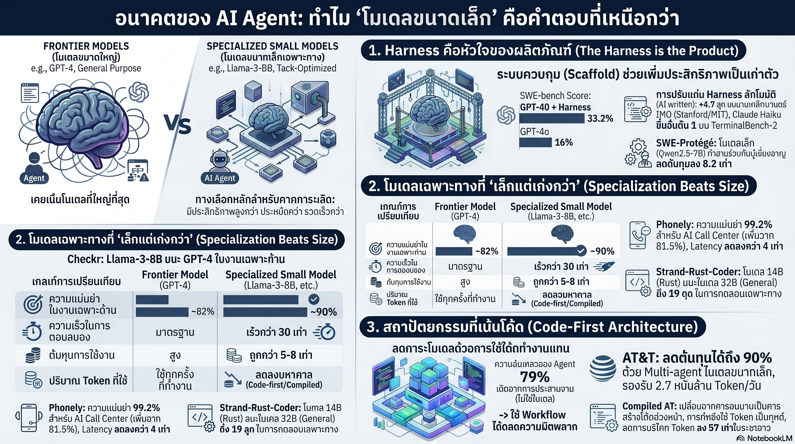

[กลับไปที่หน้าหลัก](../README.md)

สวัสดีครับเพื่อนๆ ที่ติดตามวงการ AI! ตลอด Series นี้เราคุยเรื่อง Harness, Memory, และ Self-improvement กันมาตลอดครับ วันนี้มาถึงบทสรุปเชิงกลยุทธ์ที่สำคัญที่สุดครับ — ทำไมในปี 2026 โมเดลจิ๋วที่หุ้มด้วย Harness ที่ดีถึงชนะโมเดลยักษ์ได้ครับ Claude Haiku 4.5 ใน Harness ที่เหมาะสมได้ #1 บน TerminalBench-2 ครับ Llama-3-8B ที่ Fine-tune เฉพาะทางชนะ GPT-4 ที่ 90% vs 82% ด้วยความเร็ว 30 เท่า ถูกกว่า 5 เท่าครับ และ AT&T ประหยัดงบ 90% ด้วยกลยุทธ์ "โมเดลใหญ่วางแผน โมเดลเล็กทำงาน" ครับ

คุณเคยสังเกตไหมครับว่า สัญชาตญาณแรกของทีม AI เกือบทุกทีมเมื่อ Performance ไม่ดีพอคือ "เปลี่ยนโมเดลใหญ่กว่า" ครับ แต่ข้อมูลจาก OpenAI พบว่า GPT-4o กระโดดจาก 16% → 33.2% บน SWE-bench Verified แค่เพราะเพิ่ม Scaffold เข้าไปครับ โดยที่โมเดลไม่เปลี่ยนเลยครับ?

คุณรู้ไหมครับว่า Salesforce พบว่า Success Rate ของ AI Agent ตกจาก 58% ในการโต้ตอบครั้งแรกเหลือแค่ 35% เมื่อต้องทำงานหลายขั้นตอนครับ ไม่ใช่เพราะโมเดลไม่ฉลาดพอ แต่เพราะ Coordination พัง ครับ? และ Code-first Architecture ที่ให้ LLM เป็น Compiler สร้าง JSON Blueprint ครั้งเดียวแล้วรัน Deterministically ลดต้นทุน Token ได้ 99% และลดข้อผิดพลาดเหลือศูนย์ครับ?

และคุณเคยนึกไหมครับว่า Compiled AI ที่ LLM สร้าง Executable Code ล่วงหน้าแทนที่จะ Reason ทุก Transaction คุ้มทุนเมื่อเทียบกับ Runtime Inference ที่ Transaction เพียง 17 รายการ ครับ — และในระยะยาวประหยัด Token ได้ 57 เท่าครับ? นั่นหมายความว่าโมเดล 7B รัน Compiled Pattern ให้ผลดีกว่าโมเดล 70B ที่ต้อง Reason ใหม่ทุกครั้งครับ?

งานวิจัยนี้กำลังบอกว่า: "โมเดลคือ Commodity ครับ แต่ Harness คือ IP และ Product ที่แท้จริงครับ — อนาคตของ Agentic AI ไม่ได้ตัดสินกันที่ใครมีโมเดลฉลาดที่สุด แต่ที่ใครใช้ Small Models + Modern Infrastructure ได้แหลมคมที่สุดครับ"

========================================

🤔 ทบทวนความเชื่อเดิมๆ: สิ่งที่เราคิดเกี่ยวกับขนาดโมเดลและประสิทธิภาพ

▪ "โมเดลที่ใหญ่กว่าคือคำตอบเมื่อ Performance ไม่พอครับ — Parameter มากกว่า = ฉลาดกว่า = ผลดีกว่า" → GPT-4o จาก 16% → 33.2% บน SWE-bench Verified โดยที่โมเดลไม่เปลี่ยนเลยครับ แค่เพิ่ม Scaffold ครับ ถ้าผลต่าง 17pp มาจาก Harness ไม่ใช่โมเดล แสดงว่า Bottleneck ส่วนใหญ่ไม่ได้อยู่ที่ความฉลาดของโมเดลครับ แต่อยู่ที่ระบบที่ห่อหุ้มมันอยู่ครับ

▪ "โมเดลเฉพาะทางขนาดเล็กอาจถูกกว่า แต่ความแม่นยำจะสู้โมเดลใหญ่ไม่ได้ — เป็น Trade-off ที่ต้องยอมรับ" → Checkr Fine-tuned Llama-3-8B ทำ 90% accuracy ชนะ GPT-4 ที่ 82% ในงานคัดกรองประวัติอาชญากรรมครับ Phonely ทำ 99.2% accuracy ชนะ GPT-4o ที่ 81.5% ในงานเสียงครับ เมื่อโมเดลรู้จัก Domain ลึกพอ ขนาดไม่ใช่ตัวตัดสินอีกต่อไปครับ

▪ "AI Agent ควรให้ LLM คิดและตัดสินใจทุกขั้นตอนครับ — ความยืดหยุ่นของ LLM คือจุดแข็งที่ไม่ควร Hardcode ทิ้ง" → Salesforce พบ Success Rate ตกจาก 58% → 35% ใน Multi-turn เพราะ Coordination ที่ขึ้นอยู่กับ LLM ครับ Code-first Architecture ที่ให้ LLM เป็น Compiler สร้าง Blueprint ครั้งเดียวแล้วรัน Deterministically ลดข้อผิดพลาดเหลือศูนย์ครับ LLM ที่ "คิดน้อยลงแต่ถูกต้องเสมอ" ดีกว่า LLM ที่ "คิดทุกครั้งแต่ผิดบ่อยขึ้น" ครับ

▪ "การ Fine-tune โมเดลเฉพาะทางต้องใช้ Data มาก เวลานาน และผลที่ได้ไม่คุ้มค่าเมื่อเทียบกับ Prompting โมเดลใหญ่" → SWE-Protégé ใช้ Qwen2.5-Coder-7B กับ Selective Collaboration ที่เรียกโมเดลใหญ่เฉพาะเมื่อจำเป็น ทำ 42.4% บน SWE-bench Verified ด้วยต้นทุนต่ำกว่าการใช้โมเดลใหญ่รันทั้งหมดถึง 8.2 เท่าครับ Hybrid Strategy ที่ฉลาดให้ทั้ง Performance และ Efficiency พร้อมกันได้ครับ

ความจริงที่น่าคิดคือ: "ในโลก Agentic AI ความฉลาดของระบบสำคัญกว่าความฉลาดของโมเดลเสมอครับ"

========================================

🧠 พื้นฐานที่ต้องเข้าใจก่อน: Harness as IP, Specialization Economics, Code-first Architecture, และ Compiled AI

=== Harness คือ Product ไม่ใช่ Wrapper ===

ผู้พัฒนา AI Agent รุ่นใหม่เริ่มมองโมเดลเป็น Commodity ครับ เหมือน CPU ที่ทุกคนเข้าถึงได้ในราคาใกล้เคียงกัน สิ่งที่แยกผลิตภัณฑ์ออกจากกันคือ Harness ที่ห่อหุ้มโมเดลนั้นครับ

หลักฐานเชิงตัวเลขที่ชัดที่สุดครับ Meta-Harness จาก Stanford/MIT/KRAFTON ที่ให้ Agent เขียน Harness ใหม่ให้ตัวเอง ทำให้ระบบชนะ SOTA เดิมในการจำแนกข้อความได้ 7.7 จุด โดยไม่แตะ Model Weights เลยครับ และใช้ Context Token น้อยลงถึง 4 เท่าครับ

Claude Haiku 4.5 ใน Harness ที่เหมาะสมขึ้นอันดับ #1 บน TerminalBench-2 แซงโมเดลที่ใหญ่กว่าได้ครับ นี่คือ Empirical Proof ว่า "ความแข็งแกร่งของระบบรอบโมเดล" สำคัญกว่า "ความแข็งแกร่งของโมเดลเอง" ในงาน Agentic ครับ

นัยสำหรับองค์กรครับ: แทนที่จะจ่ายค่า API Premium สำหรับโมเดลใหญ่ขึ้น การลงทุนใน Harness Engineering ให้ Return on Investment ที่สูงกว่าในระยะยาวครับ เพราะ Harness ที่ดีใช้ได้กับโมเดลหลายรุ่น แต่ค่า API โมเดลใหญ่กว่าเป็นต้นทุนที่ไม่หยุดวิ่งครับ

=== Specialization Economics: เมื่อความลึกชนะความกว้าง ===

ทำไมโมเดลเฉพาะทาง 8B ถึงชนะ Generalist 70B ในงานที่ตรง Domain ได้ครับ มีสามเหตุผลเชิงเทคนิคครับ

Parameter Efficiency ครับ โมเดลใหญ่ต้อง Allocate Capacity สำหรับ Domain ทุกอย่างในโลกครับ โมเดลเล็กที่ Fine-tune เฉพาะทางใช้ Parameter ทั้งหมดสำหรับ Domain เดียวครับ Representation ที่ได้จึง Dense และแม่นยำกว่าครับ

Noise Reduction ครับ Generalist Model รู้มากเกินไปครับ ความรู้ที่ไม่เกี่ยวข้องสร้าง Interference ที่ทำให้ Output ไม่ Precise ครับ Specialized Model ไม่มี Noise นั้นครับ

Latency ครับ โมเดลเล็กกว่า Inference เร็วกว่าเสมอครับ ใน Real-time Application เช่น Voice AI ความล่าช้า 100ms สร้างความรู้สึก "หุ่นยนต์" ทันทีครับ Phonely ลด Time-to-first-token ลง 3.7x-4.26x ทำให้ลูกค้าแยกไม่ออกว่ากำลังคุยกับ AI ครับ — นั่นคือ Product Differentiation ที่แท้จริงครับ

Strand-Rust-Coder-14B ที่ชนะโมเดล 32B ในงาน Rust Coding ได้ 19 จุดบน Framework-specific Benchmark แสดงว่าการ Specialize ลึกพอสามารถทะลุขีดจำกัดของขนาดโมเดลได้ครับ

=== Code-first Architecture: LLM ในฐานะ Compiler ===

แนวคิดนี้เปลี่ยนวิธีคิดเรื่อง AI Agent ไปอย่างสิ้นเชิงครับ

แนวทางเดิม (LLM as Runtime) ครับ LLM คิดและตัดสินใจทุก Transaction ครับ ยืดหยุ่นสูงครับ แต่ Salesforce พบว่า Multi-turn Coordination ทำให้ Success Rate ตกจาก 58% → 35% ครับ ยิ่งงานซับซ้อนขึ้น โอกาสพลาดสะสมมากขึ้นเรื่อยๆ ครับ

แนวทาง Code-first (LLM as Compiler) ครับ LLM ทำงานครั้งเดียวในการสร้าง JSON Blueprint หรือ Executable Code ที่ระบุ Step, Condition, และ Tool Calls ทั้งหมดครับ จากนั้น Workflow Engine รันตาม Blueprint นั้น Deterministically ครับ ไม่มี LLM ใน Loop อีกต่อไปครับ

ผลครับ: ลดต้นทุน Token 99%, ลดข้อผิดพลาดเหลือศูนย์สำหรับ Pattern ที่ Compile แล้วครับ และ Task ที่เคยต้องโมเดล 70B รับมือ ตอนนี้โมเดล 7B รัน Blueprint เดิมได้สบายๆ ครับ

=== Compiled AI: Break-even ที่ 17 Transactions ===

งานวิจัย Compiled AI นำแนวคิด Code-first ไปสู่ขั้นต่อไปครับ แทนที่จะให้ LLM Generate Blueprint ใหม่ทุก Task ให้ Compile Pattern ที่ซ้ำกันบ่อยๆ ให้กลายเป็น Executable Code ที่รันได้โดยตรงโดยไม่ผ่าน LLM เลยครับ

Break-even ที่ 17 Transactions ครับ ถ้า Pattern เดียวกันถูกเรียกใช้ 17 ครั้งขึ้นไป การ Compile ล่วงหน้าคุ้มทุนกว่า Runtime Inference ทันทีครับ ในระยะยาวประหยัด Token ได้ 57 เท่าครับ

AT&T นำ Principle เดียวกันนี้ไปใช้ในระดับองค์กรครับ โมเดลใหญ่เป็น "Super Agent" วางแผนและ Route งานครับ โมเดลเล็กเป็น "Worker Agent" รัน Pattern เฉพาะทางตาม Blueprint ที่กำหนดครับ ผลคือประหยัดงบ 90% และยังได้ Predictability ที่สูงกว่าการให้โมเดลใหญ่รันทั้งหมดครับ

=== SWE-Protégé: Blueprint สำหรับ Hybrid Strategy ===

SWE-Protégé คือตัวอย่างที่ดีที่สุดของการผสม Small Model กับ Large Model อย่างชาญฉลาดครับ Qwen2.5-Coder-7B เป็น Primary Agent ที่รับงาน Software Engineering ทั่วไปครับ เมื่อ Primary ไม่แน่ใจหรือเจอ Edge Case ยากเกินไปจึงส่งเฉพาะ Sub-task นั้นไปให้ Large Model เป็น Expert Advisor ครับ

ผลครับ: 42.4% บน SWE-bench Verified ด้วยต้นทุนต่ำกว่าการใช้ Large Model รันทั้งหมด 8.2 เท่าครับ และ Large Model ถูกใช้เฉพาะเมื่อ Small Model ไม่พอครับ ไม่ได้ Invoke ทุก Step ครับ

Pattern นี้ Generalize ได้กว้างมากครับ ระบบใดก็ตามที่มี Common Case (80% ของงาน) และ Edge Case (20% ที่ยากครับ) สามารถออกแบบให้ Small + Specialized จัดการ Common Case ส่วน Large รับเฉพาะ Edge Case ครับ ต้นทุนลด แต่ Quality ใกล้เคียงกัน หรือดีกว่าด้วยครับ

========================================

🎯 ประเด็นที่ควรคิดต่อ

— "Commodity Model + Premium Harness" กำลังกลายเป็น Business Model ใหม่ของ AI Industry ครับ: ถ้าโมเดลเป็น Commodity ที่ราคาจะลดลงเรื่อยๆ ตาม Competition มูลค่าที่แท้จริงจะถูก Capture โดยใครก็ตามที่สร้าง Harness ที่ดีที่สุดสำหรับ Vertical นั้นๆ ครับ Checkr ใน Background Check, Phonely ใน Voice AI ครับ Pattern นี้จะซ้ำในทุก Industry ที่ Specialized Data และ Domain Expertise มีคุณค่าครับ

— Code-first Architecture ทำให้ "ความเร็วในการพัฒนา" และ "ความน่าเชื่อถือ" ไม่ต้อง Trade-off กันอีกต่อไปครับ: แบบเดิม ถ้าต้องการ Reliability ต้องเขียน Logic ด้วยมือ (ช้า) หรือถ้าจะเร็วต้องให้ LLM Reason ทุกขั้น (เชื่อถือไม่ได้ครับ) Compiled AI Pattern ที่ LLM Generate Blueprint แล้ว Engine รัน Deterministically ให้ทั้งสองพร้อมกัน ครับ — และนั่นอาจเป็น Architecture ที่ Engineer ทุกคนที่สร้าง Agentic System ควรรู้จักก่อนออกแบบ Pipeline ครั้งถัดไปครับ

— ถ้า Small + Harness ชนะ Large + Default การ Evaluate โมเดลด้วย Raw Benchmark อาจกำลัง Mislead การตัดสินใจขององค์กรทั้งวงการครับ: Leaderboard ที่เรียง โมเดลตาม Score วัดความสามารถของโมเดลในสภาพแวดล้อม Benchmark ที่กำหนดมาครับ แต่ใน Production จริงที่ Harness ต่างกัน ลำดับนั้นอาจกลับหัวกลับหางได้ครับ Claude Haiku 4.5 ขึ้น #1 บน TerminalBench-2 ด้วย Harness ที่ดีกว่า คือหลักฐานที่ชัดว่า "Evaluate System ไม่ใช่แค่ Model" ควรเป็น Standard ใหม่ของการตัดสินใจเลือกเทคโนโลยีครับ

#SmallModels #HarnessEngineering #AgenticAI #CodeFirst #CompiledAI #SpecializedModels #SWEBench #ClaudeHaiku #LlamaFineTuning #ATT #Phonely #Checkr #ModelEfficiency #AIStrategy #LLMInference
