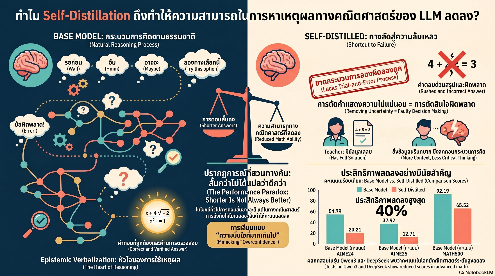

[กลับไปที่หน้าหลัก](../README.md)

ทำไม AI ยิ่งสอนตัวเองยิ่ง 'ฉลาดน้อยลง'? เจาะลึกความลับของ Self-Distillation ที่อาจทำลายตรรกะคณิตศาสตร์

ในแวดวงการวิจัย AI เรามักจะถูกสอนให้เชื่อว่า "ความกระชับคือตัวแทนของความฉลาด" (Conciseness is a proxy for intelligence) โมเดลที่สามารถสรุปเหตุผลได้สั้น ตรงประเด็น และรวดเร็ว มักถูกมองว่ามีประสิทธิภาพสูงกว่า แนวคิดนี้เองที่นำไปสู่ความนิยมของเทคนิค Self-Distillation (SD) ซึ่งเป็นการให้โมเดล AI รุ่นพี่ (Teacher) สอนโมเดลรุ่นน้อง (Student) ที่เป็นตัวมันเอง เพื่อให้ได้คำตอบที่แม่นยำและกระชับขึ้นโดยไม่ต้องพึ่งพาข้อมูลจากภายนอก

อย่างไรก็ตาม งานวิจัยล่าสุดจากทีมวิจัยชั้นนำพบความย้อนแย้งที่น่ากังวล: ในขณะที่การสอนตัวเองช่วยให้ AI ทำงานด้านวิทยาศาสตร์บางอย่างได้ดีขึ้น แต่ในโดเมน คณิตศาสตร์ เทคนิคนี้กลับส่งผลเสียอย่างรุนแรง โดยเฉพาะในโมเดลตระกูล Qwen3-8B และ DeepSeek-Distill-Qwen-7B ที่พบว่าประสิทธิภาพบนชุดทดสอบมาตรฐานอย่าง AIME24 ดิ่งลงอย่างน่าตกใจถึง 40% อะไรคือความลับที่ซ่อนอยู่ภายใต้ความกระชับที่อาจกำลังทำลายตรรกะของ AI?

--------------------------------------------------------------------------------

1. เมื่อความสั้นไม่ได้แปลว่าฉลาดเสมอไป (The Conciseness Paradox)

จากการวิจัยเชิงลึก พบว่าผลลัพธ์ของ Self-Distillation ในแต่ละโดเมนนั้นแตกต่างกันอย่างสิ้นเชิง:

* โดเมนเคมี (Chemistry): เมื่อใช้โมเดลอย่าง Olmo3-7B-Instruct ผลลัพธ์กลับดูน่าทึ่ง เพราะโมเดลสามารถลดความยาวของคำตอบลงได้มากในขณะที่ประสิทธิภาพเพิ่มขึ้นอย่างรวดเร็ว
* โดเมนคณิตศาสตร์ (Math): เมื่อทดสอบกับโมเดลอย่าง DeepSeek-Distill-Qwen-7B และ Qwen3-8B แม้จะเปิด "Thinking Mode" (โหมดที่เน้นการคิดวิเคราะห์) ไว้ก็ตาม แต่กระบวนการ Self-Distillation กลับทำให้โมเดล "หลงทาง" ยิ่งโมเดลพยายามตอบให้สั้นลง คะแนนความถูกต้องกลับดิ่งลงสวนทางกัน

ความน่าฉงนนี้ถูกบันทึกไว้ในงานวิจัยว่า:

"ในโดเมนคณิตศาสตร์ แม้ว่าความยาวของการตอบจะลดลงอย่างต่อเนื่องตามกระบวนการฝึกฝน แต่ประสิทธิภาพกลับลดลงอย่างมีนัยสำคัญ ซึ่งตรงกันข้ามกับสิ่งที่เคยพบมาก่อนหน้านี้ในโดเมนอื่นๆ"

--------------------------------------------------------------------------------

2. พลังของคำว่า "อืม..." และ "ตรวจสอบอีกครั้ง" (The Power of Epistemic Verbalization)

ความลับสำคัญที่ถูกทำลายไประหว่างการสอนตัวเองคือสิ่งที่นักวิจัยเรียกว่า Epistemic Verbalization หรือการที่โมเดล "คิดดังๆ" ออกมาเพื่อแสดงความไม่มั่นใจ เช่น การใช้คำว่า "Wait" (เดี๋ยวนะ), "Hmm" (อืม...), "Maybe" (อาจจะ) หรือแม้แต่ "Check" (ตรวจสอบ)

คำเหล่านี้ไม่ใช่ขยะทางภาษา (Verbosity) แต่เป็น "สมอเรือ" ทางความคิด:

* ป้องกันการด่วนสรุป (Premature Commitment): หากไม่มีคำเหล่านี้ โมเดลจะเปรียบเสมือนตัวละครที่ "วิ่งตกเหว" (ดังรูปที่ 2a) คือรีบกระโจนเข้าหาขั้นตอนถัดไปทันทีโดยไม่ดูว่าเส้นทางนั้นผิดหรือไม่
* การประเมินทางเลือก (Evaluating Branching Paths): ในทางกลับกัน การแสดงความไม่มั่นใจช่วยให้โมเดลหยุดคิดที่ทางแยก ตรวจสอบสมมติฐาน และปรับปรุงเส้นทางการแก้โจทย์ (Hypothesis Adjustment) ก่อนจะก้าวต่อไป

การบังคับให้ AI ตัดคำว่า "อืม..." หรือ "เดี๋ยวก่อน" ออกไป เพื่อให้ได้คำตอบที่สั้นและดูมั่นใจ จึงเท่ากับการทำลายกลไกการตรวจสอบตัวเอง (Self-Correction) ของมัน

--------------------------------------------------------------------------------

3. กับดักของ "ครูที่รู้เฉลย" (The Teacher's Answer Trap)

หัวใจสำคัญของปัญหานี้อยู่ที่ระดับข้อมูลที่ "ครู" (Teacher Model) ถืออยู่ในมือ ซึ่งเราวัดได้ด้วยค่าความสัมพันธ์ของข้อมูล หรือ I(y; c | x)

ในกระบวนการ Self-Distillation ครูจะได้รับข้อมูลที่เหนือกว่า (Rich Context) เช่น มีเฉลยหรือวิธีการคิดที่ถูกต้องอยู่แล้ว ทำให้ครูมองโจทย์จากมุมมองที่เรียกว่า "Teacher's Oracle View" เมื่อครูรู้เฉลย ครูย่อมไม่มีความลังเลและสอนให้ศิษย์เลียนแบบสไตล์การตอบที่มั่นใจและกระชับเกินไป ตามหลักการ Data Processing Inequality ที่ยิ่งมีข้อมูลชี้นำมาก ความไม่มั่นใจ (Uncertainty) ยิ่งถูกกดทับไว้

ตารางที่ 1: การหายไปของความไม่มั่นใจเมื่อข้อมูลชี้นำเพิ่มขึ้น

| รูปแบบการสร้างคำตอบ | ระดับข้อมูลชี้นำ I(y; c | x) | จำนวนคำที่แสดงความไม่มั่นใจ (Epistemic Tokens) | คะแนนประสิทธิภาพ | | :--- | :--- | :--- | :--- | | ความจริงของศิษย์ (Unguided) | ต่ำสุด | 182.5 | 0.30 | | มุมมองของครู (Solution-Guided) | สูงสุด | 8.8 | 0.98 |

หมายเหตุ: เมื่อ I(y; c | x) สูงขึ้น คำที่แสดงความไม่มั่นใจจะหายไปเกือบหมด (จาก 182.5 เหลือเพียง 8.8)

อันตรายจะเกิดขึ้นเมื่อศิษย์ (Student Model) นำ "ความมั่นใจแบบปลอมๆ" นี้ไปใช้ในสถานการณ์จริงที่ไม่มีเฉลยประคอง ศิษย์จะตอบผิดอย่างมั่นใจและไม่สามารถกู้คืนตรรกะที่ผิดพลาดได้เลย

--------------------------------------------------------------------------------

4. ความหลากหลายของโจทย์คือตัวตัดสิน (Task Coverage and Generalization)

ทำไมเทคนิคนี้ถึงได้ผลในเคมีแต่ล้มเหลวในคณิตศาสตร์? คำตอบคือ ความหลากหลายของโจทย์ (Task Coverage)

* โจทย์ที่จำเจ (เช่น เคมี): จากข้อมูลพบว่าโจทย์เคมี (ScienceQ&A) มีรูปแบบหลักเพียง 6 ประเภท เมื่อโมเดลจำรูปแบบ (Pattern) ได้หมดแล้ว การสอนให้ตอบสั้นคือการเพิ่มประสิทธิภาพ
* โจทย์ที่ต้องประยุกต์สูง (เช่น คณิตศาสตร์): ชุดข้อมูลอย่าง DAPO-Math-17k ประกอบด้วยโจทย์ที่แตกต่างกันถึง 14,000 ข้อ ซึ่งต้องใช้การแก้ปัญหาแบบที่โมเดลไม่เคยเห็นมาก่อน (Out-of-Distribution - OOD)

การทดลองปรับขนาดจำนวนคำถาม |D| แสดงให้เห็นว่า:

* เมื่อ |D| มีค่าน้อย (โจทย์ซ้ำๆ): Self-Distillation ดูเหมือนจะได้ผลดีเพราะโมเดลเรียนรู้ "ทางลัด"
* เมื่อ |D| มีค่ามาก (โจทย์หลากหลาย): "ความไม่มั่นใจ" กลายเป็นกล้ามเนื้อสำคัญที่ช่วยให้โมเดลปรับตัวเข้ากับโจทย์ใหม่ๆ ได้ การตัดความไม่มั่นใจทิ้งไปจึงเท่ากับการทำลายความสามารถในการแก้โจทย์ยากๆ ที่ไม่เคยเห็น

--------------------------------------------------------------------------------

บทสรุป: อนาคตของการฝึก AI ที่ต้องเน้น 'วิธีคิด' มากกว่า 'คำตอบ'

บทเรียนสำคัญจากงานวิจัยนี้คือ เป้าหมายของการพัฒนา AI ไม่ควรเป็นการกำจัดความเยิ่นเย้อเพื่อความสวยงามเพียงอย่างเดียว แต่ต้องรักษา "กระบวนการคิดที่ตระหนักถึงความไม่มั่นใจ" (Uncertainty-aware reasoning) ไว้เป็นหัวใจสำคัญ

การพัฒนา Post-training strategy ในอนาคตจำเป็นต้องเปลี่ยนปรัชญาจากการเน้นความถูกต้องของคำตอบ (Answer Correctness) มาเป็นการส่งเสริมสไตล์การคิดที่เหมาะสม (Reasoning Style) เพราะความไม่มั่นใจไม่ใช่จุดอ่อน แต่เป็นเครื่องมือสำคัญสำหรับการเอาชีวิตรอดของ AI ในโลกของข้อมูลที่ซับซ้อนและไม่แน่นอน

ในวันที่เราต้องฝากงานสำคัญไว้กับ AI คำถามที่เหล่านักวิจัยต้องตอบให้ได้คือ: เราต้องการ AI ที่ตอบไวและมั่นใจแต่เดินตกเหว หรือ AI ที่รู้จักหยุดคิด "อืม..." เพื่อหาทางข้ามสะพานที่ปลอดภัยที่สุดให้กับเรา? บางครั้งความฉลาดที่แท้จริงอาจซ่อนอยู่ในความไม่มั่นใจนั้นเอง
