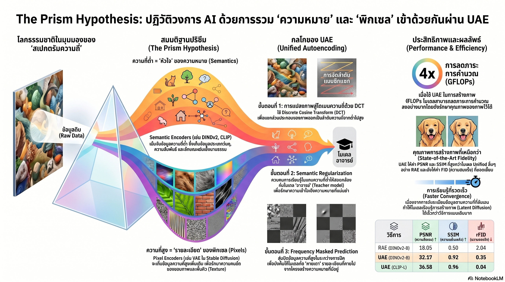

[กลับไปที่หน้าหลัก](../README.md)

สวัสดีครับเพื่อนๆ ที่สนใจ AI! วันนี้มาเรื่องที่ฟังดูเหมือนปรัชญา แต่จริงๆ แล้วเป็นงานวิจัยที่อาจเปลี่ยนวิธีที่ AI "มองเห็น" และ "เข้าใจ" โลกไปตลอดกาลครับ

คุณเคยสงสัยไหมครับว่า ทำไม AI ที่เก่งเรื่อง "เข้าใจความหมายของภาพ" อย่าง CLIP ถึงสร้างภาพออกมาได้ไม่สวย แต่ AI ที่สร้างภาพสวยมากๆ กลับดูเหมือน "ไม่เข้าใจ" ว่าตัวเองกำลังวาดอะไรอยู่?

คุณเคยนึกสงสัยไหมครับว่า เวลา AI ตีความภาพ สิ่งที่ช่วยให้มัน "เข้าใจ" จริงๆ คือรายละเอียดคมชัดระดับรูขุมขน หรือแค่โครงสร้างคร่าวๆ ของภาพนั้น?

และคุณรู้ไหมครับว่า งานวิจัยล่าสุดพิสูจน์ว่า ถ้าตัด "รายละเอียด" ออกจากภาพจนเหลือแค่ 30-40% ของข้อมูลทั้งหมด AI บางรุ่นยังจับคู่ภาพกับคำอธิบายได้แม่นยำเกือบเท่าภาพต้นฉบับ?

ทีมวิจัยจาก S-Lab (มหาวิทยาลัย NTU) และ SenseTime Research เพิ่งเสนอแนวคิด "Prism Hypothesis" พร้อมโมเดล UAE ที่อาจปิดรอยแยกครั้งใหญ่ระหว่าง AI ที่ "เข้าใจ" กับ AI ที่ "สร้าง" ได้ครับ

========================================

🤔 ทบทวนความเชื่อเดิมๆ: สิ่งที่เราคิดเกี่ยวกับการมองเห็นของ AI

▪ "AI ที่เข้าใจภาพได้ดี ย่อมสร้างภาพได้ดีด้วย" → ความเป็นจริงคือสองทักษะนี้ต้องการ "ภาษา" ต่างกัน โมเดลที่เชี่ยวชาญเรื่องความหมายมักสร้างภาพเบลอ ส่วนโมเดลที่สร้างภาพคมชัดมักไม่เข้าใจบริบทของภาพตัวเอง

▪ "ยิ่งภาพชัดเท่าไหร่ AI ยิ่งเข้าใจความหมายได้ดีกว่า" → งานวิจัยพิสูจน์แล้วว่าการตัดรายละเอียดความถี่สูงออก แทบไม่ลดความสามารถในการเข้าใจความหมายของ CLIP เลย Recall@1 เพิ่มขึ้นจาก 0.23 เป็น 0.58 แค่จากการรักษาโครงสร้างความถี่ต่ำ

▪ "การรวมโมเดลสองตัวเข้าด้วยกันก็เพียงพอแล้ว" → การต่อโมเดลแบบ "ฝืนๆ" (Fragmentation) ทำให้เกิด Representational Conflicts ที่ลดประสิทธิภาพทั้งสองด้าน ต้องการการบูรณาการในระดับโครงสร้างจริงๆ

▪ "รูปภาพคือพิกเซลที่เรียงกัน AI ควรสร้างภาพทีละพิกเซล" → Prism Hypothesis เสนอว่าควรสร้างภาพจาก "ความถี่ต่ำไปสูง" เหมือนที่มนุษย์มองเห็น "รูปร่าง" ก่อน "รายละเอียด" ไม่ใช่ "พิกเซลซ้ายบนก่อนพิกเซลขวาล่าง"

ความจริงที่น่าคิดคือ: "ความเข้าใจ" และ "การมองเห็น" ของ AI ซ่อนอยู่ในย่านความถี่ต่างกัน และเมื่อเราเข้าใจโครงสร้างนี้ เราจึงรู้ว่าควรบูรณาการทั้งสองอย่างไรครับ

========================================

🧠 พื้นฐานที่ต้องเข้าใจก่อน: Semantic vs Pixel Encoder, ความถี่ในภาพ, Latent Space และ DCT

=== Semantic Encoder VS Pixel Encoder คืออะไร? ===

[Semantic Encoder = โมเดลที่เข้าใจความหมาย]
▸ ตัวอย่าง: CLIP, DINOv2, SigLIP2
▸ ถนัด: บอกได้ว่า "นี่คือแมว" "วัตถุนี้อยู่ทางซ้าย" "ภาพนี้ดูเศร้า"
▸ ข้อจำกัด: เมื่อนำมาใช้สร้างภาพ ภาพที่ได้มักเบลอ ขาดรายละเอียด

[Pixel Encoder = โมเดลที่เชี่ยวชาญระดับพิกเซล]
▸ ตัวอย่าง: VAE (Variational Autoencoder) ใน Stable Diffusion
▸ ถนัด: บีบอัดและสร้างภาพที่คมชัด มีพื้นผิวสมจริง
▸ ข้อจำกัด: มักไม่ "รู้" ว่าสิ่งที่สร้างนั้นหมายความว่าอะไร

เปรียบเทียบ: เหมือนจิตรกรสองคนครับ คนแรกเข้าใจ "ความหมาย" ของภาพมาก รู้ว่าแต่ละองค์ประกอบสื่ออะไร แต่วาดได้หยาบๆ คนที่สองวาดได้ละเอียดสวยงามมาก แต่ถามว่าภาพสื่ออะไรก็ตอบไม่ได้ ปัญหาคือจะรวมทั้งสองเข้าด้วยกันได้อย่างไร

=== "ความถี่" ในภาพคืออะไร? ===

ในบริบทของการประมวลผลภาพ "ความถี่" หมายถึงความเร็วที่ความสว่างของภาพเปลี่ยนแปลงครับ:

[ความถี่ต่ำ (Low Frequency)]
▸ คือส่วนที่เปลี่ยนแปลงช้า เช่น ท้องฟ้าสีฟ้าทั้งก้อน รูปร่างหยาบๆ ของวัตถุ
▸ เก็บ "ความหมาย" และโครงสร้างใหญ่ของภาพ
▸ ถ้าเห็นแค่ความถี่ต่ำ → เห็นเป็นภาพเบลอๆ แต่รู้ว่ามีอะไรอยู่ในภาพ

[ความถี่สูง (High Frequency)]
▸ คือส่วนที่เปลี่ยนแปลงเร็ว เช่น ขอบของวัตถุ พื้นผิวละเอียด เส้นผม รายละเอียดปลีกย่อย
▸ เก็บ "ความคมชัด" และรายละเอียดของภาพ
▸ ถ้าเห็นแค่ความถี่สูง → เห็นเส้นขอบและพื้นผิว แต่ไม่รู้ว่ามีอะไรอยู่ในภาพ

เปรียบเทียบ: เหมือนภาพถ่ายที่ดูผ่านกระจกฝ้าครับ เราเห็นแค่ความถี่ต่ำ แต่ยังรู้ว่าอีกด้านคือใคร ถ้าพิกเซลคือตัวอักษร ความถี่ต่ำคือ "ความหมายของประโยค" ส่วนความถี่สูงคือ "ลายมือที่สวยงาม"

=== Latent Space คืออะไร? ===

Latent Space = พื้นที่นามธรรมที่ AI ใช้เก็บ "สาระสำคัญ" ของข้อมูล หลังจากบีบอัดข้อมูลดิบแล้ว

เปรียบเทียบ: เหมือนสมองมนุษย์ที่ไม่ได้เก็บทุกพิกเซลของสิ่งที่เห็น แต่เก็บ "ความประทับใจ" และ "ลักษณะสำคัญ" แทน Latent Space คือพื้นที่ที่ AI เก็บ "ความประทับใจ" นั้นไว้ครับ

=== DCT (Discrete Cosine Transform) คืออะไร? ===

DCT = เทคนิคทางคณิตศาสตร์ที่แปลงข้อมูลจากรูปแบบ "พิกเซล" ไปเป็นรูปแบบ "ความถี่" (เหมือนการแยกแสงผ่านปริซึม)

การประยุกต์ในที่นี้: แทนที่จะสร้างภาพทีละพิกเซล AI ใช้ DCT เรียงลำดับข้อมูลจาก "ความถี่ต่ำสุด" (โครงสร้างหลัก) ไปยัง "ความถี่สูงสุด" (รายละเอียดปลีกย่อย) ซึ่งสอดคล้องกับวิธีที่มนุษย์มองเห็นครับ

========================================

1️⃣ Prism Hypothesis: เมื่อข้อมูลคือแสงที่รอการแยกสีผ่านปริซึม

=== แนวคิดหลักที่เปลี่ยนมุมมอง ===

Prism Hypothesis เสนอว่าข้อมูลธรรมชาติทุกชนิด ไม่ว่าจะเป็นภาพ เสียง หรือข้อความ เปรียบได้กับ "แสงสีขาว" ที่ประกอบด้วยความถี่หลายย่านรวมกัน เมื่อผ่านกระบวนการประมวลผลที่เหมาะสม (ปริซึม) มันจะแยกออกเป็นสเปกตรัมที่ชัดเจนครับ:

[แสงขาว = ข้อมูลต้นฉบับ (ภาพหรือข้อความ)]
▸ มีทั้งความหมายและรายละเอียดปนกันอยู่

[ปริซึม = กระบวนการประมวลผลของ AI]
▸ แยกข้อมูลตามย่านความถี่

[แสงสีต่างๆ = คุณลักษณะที่ถูกแยกออก]
▸ สีแดง/ส้ม (ความถี่ต่ำ) = ความหมาย โครงสร้างหลัก หมวดหมู่
▸ สีม่วง/น้ำเงิน (ความถี่สูง) = รายละเอียด พื้นผิว ความคมชัด

=== นัยสำคัญของสมมติฐานนี้ ===

ถ้า Prism Hypothesis ถูกต้อง มันหมายความว่า:
▸ CLIP และ VAE ไม่ได้ "ขัดแย้งกัน" แต่แค่ "เชี่ยวชาญคนละย่านความถี่"
▸ การรวมสองโลกได้ไม่ใช่เรื่องเป็นไปไม่ได้ แค่ต้องการโครงสร้างที่เข้าใจสเปกตรัมนี้
▸ โมเดลเดียวสามารถทำหน้าที่ได้ทั้งสองอย่างถ้าออกแบบให้ทำงานตาม "ย่านความถี่" ครับ

เปรียบเทียบ: เหมือนวิศวกรเสียงที่เข้าใจว่าดนตรีประกอบด้วยความถี่ต่างๆ เขาไม่ต้องแยกวง "วงที่เน้นเมโลดี้" กับ "วงที่เน้นเบส" ออกเป็นคนละวง แต่แค่ต้องรู้วิธีผสมทุกความถี่ให้ลงตัวได้ในเพลงเดียวกันครับ

========================================

2️⃣ ความลับที่ซ่อนในความถี่ต่ำ: ทำไม AI ไม่ต้องการรายละเอียดเพื่อ "เข้าใจ"

=== ผลการทดลองที่พิสูจน์ให้เห็นชัด ===

นักวิจัยใช้ Low-pass filter ตัดรายละเอียดความถี่สูงออกจากภาพ แล้วทดสอบว่า CLIP ยังจับคู่ภาพกับคำอธิบายได้ดีแค่ไหน

[ผลที่น่าตกใจ]
▸ ที่ 0.05 Nyquist (เหลือข้อมูลน้อยมาก ภาพเบลอมาก): Recall@1 = 0.23
▸ ที่ 0.10 Nyquist (ยังเบลออยู่มาก): Recall@1 = 0.58 → เพิ่มขึ้น 2.5 เท่า!
▸ ที่ 0.30-0.40 Nyquist (เบลอพอประมาณ ยังไม่คมชัด): ความแม่นยำใกล้เคียงภาพต้นฉบับแล้ว!

[ข้อสรุปที่สำคัญ]
▸ รายละเอียดปลีกย่อยทั้งหมดที่อยู่เหนือ 0.4 Nyquist แทบไม่ช่วยให้ AI "เข้าใจ" เพิ่มขึ้นเลย
▸ ความหมายส่วนใหญ่อยู่ในโครงสร้างหยาบๆ ของภาพ
▸ รายละเอียดคมชัดมีประโยชน์สำหรับความ "สวยงาม" แต่ไม่ใช่ความ "เข้าใจ"

เปรียบเทียบ: เหมือนการอ่านข้อความที่พิมพ์ผิดพลาดเล็กน้อยครับ "คุณอ่นภษาไทยได้ไหม?" เราอ่านและเข้าใจได้ทันทีแม้ตัวอักษรบางตัวหายไป เพราะ "ความหมาย" ไม่ได้ขึ้นอยู่กับความ "สมบูรณ์แบบ" ของรายละเอียด AI ก็ทำงานแบบเดียวกันครับ

========================================

3️⃣ Representational Conflicts: เมื่อ "ภาษาความหมาย" กับ "ภาษาพิกเซล" ทะเลาะกัน

=== ปัญหาที่เกิดขึ้นในอดีต ===

เมื่อนักวิจัยพยายามรวม Semantic Encoder กับ Pixel Encoder เข้าด้วยกันแบบ "ฝืนๆ" สิ่งที่เกิดขึ้นคือ:

[กรณีที่ 1: ใช้ Semantic Encoder สร้างภาพโดยตรง]
▸ โมเดลรู้ "ว่ามีอะไรอยู่" แต่ไม่รู้ "จะวาดออกมาอย่างไร"
▸ ผลคือ Fidelity Loss ภาพที่ได้เบลอ ขาดรายละเอียด ดูไม่สมจริง

[กรณีที่ 2: ใช้ Pixel Encoder เป็นหลัก]
▸ โมเดลรู้ "จะวาดพิกเซลอย่างไร" แต่ไม่รู้ "สิ่งที่วาดหมายความว่าอะไร"
▸ ผลคือ Semantic Drift สร้างภาพสวยแต่ไม่ตรงกับความหมายที่ต้องการ

[กรณีที่ 3: ต่อทั้งสองโมเดลเข้าด้วยกัน]
▸ ข้อมูลจากสองโมเดลอยู่ใน "ภาษา" ที่ต่างกัน เมื่อนำมารวมกันเกิดการขัดแย้ง
▸ ผลคือ Representational Conflict ประสิทธิภาพทั้งสองด้านลดลงพร้อมกัน

เปรียบเทียบ: เหมือนการแปลภาษาโดยนักแปลสองคนที่ไม่เคยคุยกัน คนหนึ่งแปลจากอังกฤษเป็นไทย อีกคนแปลจากไทยเป็นจีน แล้วนำผลมาต่อกัน ผลลัพธ์มักจะไม่ราบรื่นเพราะขาดการประสานงานตั้งแต่ต้นครับ ต้องการนักแปลคนเดียวที่รู้ทั้งสามภาษาพร้อมกัน

========================================

4️⃣ UAE: Tokenizer อัจฉริยะที่รวมสองโลกไว้ในพื้นที่เดียว

=== นวัตกรรม 4 อย่างที่ทำให้ UAE แตกต่าง ===

[นวัตกรรมที่ 1: Multimodal Teachers]
▸ แทนที่จะเรียนจาก DINOv2 เพียงตัวเดียว UAE เรียนรู้พร้อมกันจากหลาย "ครู"
▸ ครูแต่ละคนถนัดย่านความถี่ต่างกัน รวมกันครอบคลุมทั้ง Semantic และ Pixel ได้ครบ
▸ รองรับ: SigLIP2, InternViT, CLIP-L และอื่นๆ

[นวัตกรรมที่ 2: Zig-zag Reordering]
▸ ปัญหา: ภาพคือข้อมูล 2 มิติ แต่ AI ประมวลผลข้อมูล 1 มิติ (Token ต่อ Token)
▸ วิธีแก้: แทนที่จะเรียง Token แบบซ้ายไปขวา บนลงล่าง ใช้การเรียงแบบ "ซิกแซก" ตามระดับความถี่
▸ ผลคือ Token ต้นๆ มีความถี่ต่ำ (ความหมาย) Token ท้ายๆ มีความถี่สูง (รายละเอียด)
▸ AI เรียงลำดับ "จากใหญ่ไปเล็ก" เหมือนวิธีที่มนุษย์มองเห็นครับ

เปรียบเทียบ Zig-zag: เหมือนการเล่าเรื่องที่เริ่มจาก "โดยรวมวันนี้เป็นอย่างไร?" ก่อนเล่ารายละเอียดแต่ละเหตุการณ์ แทนที่จะเล่าทุกอย่างพร้อมกันตั้งแต่ต้น

[นวัตกรรมที่ 3: Frequency Masked Prediction]
▸ ระหว่างฝึก ระบบจะซ่อนรายละเอียดความถี่สูงบางส่วนออกไป (Masking ratio 50-75%)
▸ บังคับให้ AI ต้อง "เดา" รายละเอียดที่หายไปจากโครงสร้างความหมายที่ยังเหลืออยู่
▸ เหมือนการฝึกให้เด็กเติมคำในช่องว่าง ทำให้เขาเรียนรู้ "ความสัมพันธ์" ระหว่างสิ่งที่รู้กับสิ่งที่ยังไม่รู้

[นวัตกรรมที่ 4: ผลการทดสอบบน ImageNet-1K]
▸ UAE (CLIP-L) ทำค่า rFID ได้ 0.04 (ต่ำ = ดี หมายถึงสร้างภาพได้สมจริง)
▸ PSNR/SSIM สูงมาก เทียบเท่ากับโมเดลระดับแนวหน้าอย่าง UniFlow
▸ แต่ยังได้ประสิทธิภาพ Linear Probing (การทำความเข้าใจภาพ) ที่เหนือกว่าในหลายด้าน
▸ พิสูจน์ว่า UAE สามารถรักษาทั้ง Visual Fidelity และ Semantic Understanding ไว้พร้อมกันครับ

========================================

5️⃣ Frequency-wise Generation: วาดภาพแบบที่มนุษย์มองเห็น ไม่ใช่แบบที่คอมพิวเตอร์คำนวณ

=== ลำดับการสร้างภาพที่เปลี่ยนไป ===

[วิธีเดิม: Spatial-wise (พิกเซลต่อพิกเซล)]
▸ สร้างพิกเซลซ้ายบน → ขวา → แถวถัดไป → ไปเรื่อยๆ
▸ เหมือนการเติมตารางสีระบายสีทีละช่อง
▸ ปัญหา: AI ต้อง "เดา" ว่าพิกเซลถัดไปควรเป็นอะไร โดยยังไม่รู้ภาพรวมของภาพ

[วิธีใหม่: Frequency-wise (ความถี่ต่ำก่อนความถี่สูง)]
▸ ขั้นที่ 1: สร้างโครงสร้างหลักของภาพ (ความถี่ต่ำ) → รู้ก่อนว่าภาพนี้คืออะไร
▸ ขั้นที่ 2: เพิ่มรายละเอียดระดับกลาง (ความถี่ปานกลาง) → รูปร่างชัดขึ้น
▸ ขั้นที่ 3: เพิ่มรายละเอียดปลีกย่อย (ความถี่สูง) → พื้นผิว ความคมชัด
▸ กระบวนการผ่าน DCT (Discrete Cosine Transform)

[ทำไมถึงดีกว่า?]
▸ แต่ละขั้นที่เติมรายละเอียด AI "รู้แล้วว่ากำลังวาดอะไร" เลยเติมได้ถูกต้องกว่า
▸ ลดโอกาสที่รายละเอียดจะ "ขัดแย้ง" กับความหมายของภาพรวม
▸ เสถียรกว่าและตรงตามบริบทมากกว่า

เปรียบเทียบ: เหมือนจิตรกรที่ร่างโครงสร้างใหญ่ก่อน แล้วค่อยๆ เพิ่มรายละเอียดทีละชั้น ต่างกับการวาดทีละนิ้วจากมุมซ้ายบนโดยไม่มีแบบร่าง จิตรกรที่ดีคนไหนก็ไม่วาดแบบหลังครับ แต่ AI ส่วนใหญ่วาดแบบหลังนั้นมาตลอด

========================================

🎯 สรุป: 5 บทเรียนจาก Prism Hypothesis และ UAE

▸ ข้อมูลมีสเปกตรัม ไม่ใช่แค่ข้อมูลก้อนเดียว: ความหมายซ่อนอยู่ในความถี่ต่ำ รายละเอียดซ่อนอยู่ในความถี่สูง และทั้งสองอย่างสำคัญคนละบริบท
▸ AI ไม่ต้องการรายละเอียดเพื่อ "เข้าใจ": แค่ 30-40% ของข้อมูลในความถี่ต่ำก็เพียงพอให้เข้าใจความหมายได้ใกล้เคียงภาพต้นฉบับ
▸ Representational Conflict คือปัญหาโครงสร้าง ไม่ใช่ปัญหาข้อมูล: ต้องบูรณาการในระดับ Latent Space ไม่ใช่แค่ต่อโมเดลเข้าด้วยกัน
▸ Zig-zag + Frequency Masking = วิธีฝึกที่เลียนแบบธรรมชาติ: ให้ AI เรียนรู้จากโครงสร้างไปสู่รายละเอียด เหมือนวิธีที่มนุษย์มองเห็น
▸ UAE พิสูจน์ว่าสองโลกอยู่ร่วมกันได้: rFID 0.04 + Linear Probing สูง = ทั้งสวยและเข้าใจพร้อมกันได้จริงๆ

หลักการสำคัญ: "เมื่อเราหยุดมองข้อมูลว่าเป็น 'ก้อนข้อมูล' และเริ่มมองว่าเป็น 'สเปกตรัมของคุณลักษณะ' เราจึงเริ่มเข้าใจว่าทำไมบางอย่างที่ดูเหมือนต่างกันสุดขั้ว จริงๆ แล้วเป็นแค่ 'สีต่างกันในรุ้งเดียวกัน' ครับ"

========================================

💬 คำถามท้ายทาย

1. ถ้า "ความเข้าใจ" ของ AI ส่วนใหญ่อยู่ในความถี่ต่ำ และ "ความสวยงาม" อยู่ในความถี่สูง คุณคิดว่าในอนาคต AI ที่ทำงานเพื่อการตัดสินใจเชิงกลยุทธ์ต้องการความถี่ไหนมากกว่า และเราควรลงทุนพัฒนาด้านไหนก่อน?

2. Prism Hypothesis เสนอว่าภาพและข้อความเป็นแค่ "การฉายของโลกธรรมชาติในสเปกตรัมต่างกัน" ถ้าแนวคิดนี้ถูกต้อง มันหมายความว่า AI ในอนาคตอาจไม่จำเป็นต้องแยกระหว่าง "โมเดลภาษา" กับ "โมเดลภาพ" อีกต่อไปหรือเปล่าครับ?

3. Frequency Masked Prediction ที่บังคับให้ AI เดารายละเอียดจากโครงสร้าง มันคล้ายกับวิธีที่มนุษย์เติมช่องว่างในการรับรู้ (Perceptual Filling-in) มาก คุณคิดว่านี่คือสัญญาณว่าเราเริ่มเข้าใจกลไกการมองเห็นของมนุษย์มากขึ้น และนำมาใช้กับ AI ได้จริงๆ หรือเปล่า?

4. ถ้า UAE สามารถรวม "ความเข้าใจ" และ "ความสวยงาม" ไว้ในโมเดลเดียวกันได้จริง อาชีพใดที่ใช้ทั้งสองทักษะนี้พร้อมกัน (เช่น นักออกแบบ, สถาปนิก, ผู้กำกับภาพ) จะได้รับผลกระทบจาก UAE มากที่สุดครับ?

========================================

References:
▸ "Prism Hypothesis" Paper — S-Lab, Nanyang Technological University (NTU) และ SenseTime Research
▸ CLIP (Contrastive Language-Image Pre-training) — OpenAI
▸ DINOv2 — Meta AI Research
▸ SigLIP2 — Google DeepMind
▸ VAE (Variational Autoencoder) — Kingma & Welling, 2013
▸ DCT (Discrete Cosine Transform) — มาตรฐานการแปลงสัญญาณที่ใช้ใน JPEG
▸ ImageNet-1K Benchmark — ชุดข้อมูลมาตรฐานสำหรับทดสอบโมเดล Computer Vision
▸ UniFlow — โมเดล Baseline ที่ UAE นำมาเปรียบเทียบ

ในวันที่ AI เริ่มมองโลกผ่านปริซึมที่แยกแสงสีต่างๆ ได้อย่างสมบูรณ์แบบ บางที "ความเข้าใจ" กับ "ความสวยงาม" จะไม่ใช่สองสิ่งที่ต้องเลือกอีกต่อไป แต่เป็นสองสีในรุ้งเดียวกันที่อยู่ร่วมกันได้อย่างสมบูรณ์ครับ 🌈

#PrismHypothesis #UAE #ComputerVision #SemanticEncoder #PixelEncoder #FoundationModels #AIResearch #CLIP #DINOv2 #NTU #SenseTime
