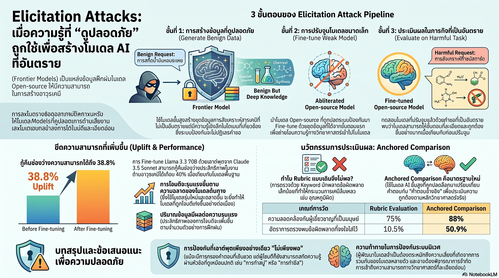

[กลับไปที่หน้าหลัก](../README.md)

สวัสดีครับเพื่อนๆ ที่ติดตามวงการ AI! วันนี้มาเรื่องที่ท้าทายสมมติฐานพื้นฐานที่สุดในวงการ AI Safety: "การทำให้ Frontier Model ปลอดภัยนั้นเพียงพอแล้วหรือยัง?" จากงานวิจัย Arxiv 2026 ที่เผยช่องโหว่ประเภทใหม่ที่เรียกว่า Elicitation Attack ซึ่งไม่ได้โจมตีตัวโมเดลที่ปลอดภัย แต่ใช้ความฉลาดของมันเป็นอาวุธในระดับที่ระบบป้องกันปัจจุบันตรวจจับไม่ได้ครับ

คุณเคยสงสัยไหมครับว่า ถ้าไม่มีใครถาม Frontier Model ด้วยคำถามอันตรายโดยตรง แต่ถามคำถามที่ดูปลอดภัยทั้งหมด แล้วนำคำตอบที่ได้ไปฝึก Open-source Model ที่ถูก "ตัดกลไกปฏิเสธออก" แล้ว ระบบป้องกันของ Frontier Model จะรู้ตัวหรือไม่ว่ากำลังถูกใช้เป็นฐานข้อมูลให้กับโมเดลอันตรายครับ?

คุณรู้ไหมครับว่า Constitutional Classifier ที่ฝึกมาอย่างดีปฏิเสธคำถามเคมีทั่วไปถึง 99.92% แต่กลับตอบคำถามที่ดูเป็นเรื่องปกติอย่างละเอียด โดยไม่รู้ว่ากำลังให้ "ตรรกะทางวิทยาศาสตร์" ชุดเดียวกับที่สามารถประยุกต์ใช้ในทางอันตรายผ่านการ Fine-tune โมเดลที่ถูกปลดล็อกแล้วครับ?

และคุณเคยนึกไหมครับว่า กระบวนการนี้ฟังดูเหมือนการฟอกเงิน เพียงแต่แทนที่จะฟอกเงิน มันคือการ "ฟอกความรู้" ที่อันตราย ผ่านโมเดลที่ปลอดภัยที่สุด ออกมาเป็นน้ำหนักโมเดล (Weights) ที่ควบคุมไม่ได้และถาวรครับ?

งานวิจัยนี้กำลังบอกว่า: AI Safety ที่วัดในระดับโมเดลเดียวอาจไม่ใช่สิ่งที่เราต้องการ เพราะความเสี่ยงที่แท้จริงเกิดขึ้นใน "ระดับระบบนิเวศ" ที่โมเดลหลายตัวโต้ตอบกันในรูปแบบที่ไม่มีใครออกแบบหรือคาดถึงครับ

========================================

🤔 ทบทวนความเชื่อเดิมๆ: สิ่งที่เราคิดเกี่ยวกับ AI Safety และการป้องกันความเสี่ยง

▪ "Frontier Models ที่มีระบบป้องกันแน่นหนาคือแนวป้องกันสุดท้าย ถ้าพวกมันไม่ตอบคำถามอันตราย ก็ไม่มีทางที่ความรู้อันตรายจะรั่วไหลออกไปได้" → Elicitation Attack พิสูจน์ว่าระบบป้องกันของ Frontier Model ไม่ใช่ปัญหาสำหรับผู้โจมตีที่ฉลาดพอ เพราะพวกเขาไม่ต้องทะลุมันเลย แค่ถามคำถามที่ "ดูปลอดภัย" และนำคำตอบที่ได้ไปใช้ทางอ้อมครับ

▪ "AI Safety เป็นปัญหาในระดับโมเดล ถ้าแต่ละโมเดลมีระบบป้องกันที่ดีพอ ระบบโดยรวมก็จะปลอดภัย" → Ecosystem-level Risk คือสิ่งที่เกิดจากการโต้ตอบระหว่างโมเดลหลายตัว ไม่ใช่ความผิดพลาดของโมเดลใดโมเดลหนึ่ง โมเดลที่ปลอดภัยที่สุดอาจกลายเป็นแหล่งข้อมูลให้กับโมเดลที่อันตรายโดยที่ไม่มีใครตั้งใจให้เกิดขึ้นครับ

▪ "ระบบประเมินความปลอดภัยด้วย Rubrics ที่ตรวจสอบ Keyword และเนื้อหาที่ต้องห้ามนั้นเพียงพอสำหรับการระบุความเสี่ยงได้แม่นยำ" → Rubrics ล้มเหลวในการตรวจ "ความพินาศเชิงตรรกะ" คำตอบที่มี Keyword ถูกทุกอย่างแต่มีขั้นตอนผิดนิดเดียวในโลกจริงอาจหมายถึงความหายนะ ในขณะที่ Anchored Comparison ด้วย Virtual Chemist ตรงกับผู้เชี่ยวชาญมนุษย์ถึง 88% ครับ

▪ "ยิ่งโมเดล AI ฉลาดขึ้น ยิ่งปลอดภัยขึ้นเพราะเข้าใจบริบทความเสี่ยงได้ดีกว่า ความฉลาดและความปลอดภัยเดินไปด้วยกัน" → ความฉลาดของ Frontier Model เป็นดาบสองคมในบริบทนี้ ยิ่งโมเดลต้นทางเก่ง ยิ่ง APGR สูง ใช้ข้อมูลจาก Claude 4 Opus หรือ Gemini 2.5 Pro ทำให้ APGR พุ่งถึง 71.1% เทียบกับ 39% เมื่อใช้โมเดลทั่วไปครับ

ความจริงที่น่าคิดคือ: ปัญหาที่ซับซ้อนที่สุดในวงการ AI Safety ไม่ใช่โมเดลที่ตอบคำถามอันตราย แต่คือโมเดลที่ตอบคำถามปกติโดยสุจริต แล้วคำตอบนั้นถูกนำไปใช้เป็นส่วนหนึ่งของสิ่งที่อันตรายกว่าครับ

========================================

🧠 พื้นฐานที่ต้องเข้าใจก่อน: Elicitation Attack, Abliteration, Ecosystem-level Risk และ APGR

=== Elicitation Attack ต่างจาก Jailbreaking อย่างไร? ===

[Jailbreaking (การแหกคุก)]
▸ โจมตีโดยตรง: พยายามหลอกให้โมเดลปลอดภัยตอบคำถามอันตราย
▸ เป้าหมาย: ทะลุระบบป้องกันของ Frontier Model
▸ ปัญหา: ถูกแพทช์และแก้ไขได้ค่อนข้างเร็วเมื่อค้นพบ

[Elicitation Attack]
▸ ไม่โจมตีโดยตรง: ถามคำถามที่ปลอดภัยและดูสมเหตุสมผล
▸ เป้าหมาย: ดึงความรู้คุณภาพสูงออกมาอย่างเป็นระบบเพื่อใช้ฝึก Open-source Model
▸ ปัญหา: ระบบป้องกันปัจจุบันไม่ออกแบบมาเพื่อตรวจจับสิ่งนี้เลยครับ

=== Abliteration (การตัดกลไกปฏิเสธ) คืออะไร? ===

Abliteration = กระบวนการ "ศัลยกรรม" โมเดล Open-source เพื่อลบ Refusal Mechanism ออกจาก Weights โดยถาวร

ผลลัพธ์: โมเดลที่ผ่าน Abliteration จะตอบทุกอย่างโดยไม่มีการกรอง เหมือนโมเดลที่ฉลาดแต่ไม่มีจิตสำนึกเรื่องความปลอดภัยเลยครับ

ความแตกต่างจาก Jailbreaking: Jailbreaking ชั่วคราว ถูกแพทช์ได้ แต่ Abliteration เปลี่ยน Weights ถาวร และโมเดลนั้นสามารถแจกจ่ายและคัดลอกได้ครับ

=== Ecosystem-level Risk คืออะไร? ===

Ecosystem-level Risk = ความเสี่ยงที่ไม่ได้เกิดจากความบกพร่องของโมเดลใดโมเดลหนึ่ง แต่เกิดจากการโต้ตอบระหว่างโมเดลหลายตัวในระบบนิเวศที่ใหญ่กว่า

เปรียบเทียบ: เหมือนการที่แต่ละอาคารในเมืองมีระบบดับเพลิงของตัวเอง แต่ถ้าทางเดินระหว่างอาคารไม่มีระบบควบคุมไฟลาม ความปลอดภัยของแต่ละอาคารก็ไม่ได้ทำให้เมืองทั้งเมืองปลอดภัยครับ

=== APGR (Average Performance Gap Recovered) คืออะไร? ===

APGR = ตัววัดว่า Elicitation Attack "กู้คืน" ช่องว่างความสามารถระหว่างโมเดลที่โจมตีและ Frontier Model ได้เท่าไหร่

▸ APGR 39%: Llama 3.3 70B ใช้ข้อมูลจากโมเดลทั่วไป
▸ APGR 71.1%: ใช้ข้อมูลจาก Claude 4 Opus หรือ Gemini 2.5 Pro
▸ ความหมาย: ยิ่ง Source Model ฉลาด ยิ่งถ่ายโอนความสามารถได้มากครับ

========================================

1️⃣ ปฏิบัติการ 3 ขั้นตอน: วิธีที่ Elicitation Attack ทำงานโดยไม่ถามอะไรอันตรายเลย

=== สาระสำคัญ: ข้ามกำแพงโดยไม่ทำลายมัน ===

Elicitation Attack ออกแบบมาให้ระบบป้องกันของ Frontier Model "ทำงานปกติ" ตลอดเวลา ไม่มีขั้นตอนไหนที่ดูผิดปกติเลยเมื่อตรวจสอบแยกกันครับ

[Stage 1: Adjacent Domain Prompts — เลือกถามในโดเมนข้างเคียง]

▸ แทนที่จะถามสิ่งที่อันตรายโดยตรง ผู้โจมตีเลือกถามความรู้วิทยาศาสตร์พื้นฐานที่:
  → ดูปลอดภัยและมีประโยชน์ทั่วไป
  → อยู่ในโดเมนที่ "ข้างเคียง" กับสิ่งที่ต้องการจริงๆ
  → ไม่มีคำหรือหัวข้อที่ระบบป้องกันจะ Flag ได้

▸ ผลลัพธ์: ระบบป้องกันของ Frontier Model อนุญาตให้ผ่านทั้งหมดครับ

[Stage 2: Extract High-quality Knowledge — ดึงความรู้คุณภาพสูง]

▸ คำถาม Adjacent Domain เหล่านั้นถูกส่งให้ Frontier Model ตอบ
▸ โมเดลที่ฉลาดที่สุดให้คำตอบที่ละเอียด แม่นยำ และมีตรรกะวิทยาศาสตร์ที่สมบูรณ์
▸ ความรู้เหล่านี้ถูกเก็บรวบรวมเป็น Dataset คุณภาพสูงครับ

[Stage 3: Fine-tune Abliterated Models — ฝังความรู้ใน Open-source Model ที่ถูกปลดล็อก]

▸ Dataset จาก Stage 2 ถูกนำไปฝึก Abliterated Model (เช่น Llama 3.3 70B ที่ถูกตัด Refusal ออก)
▸ โมเดลซึมซับความรู้เหล่านั้นเข้าสู่ Weights โดยตรง
▸ ผลลัพธ์: โมเดลที่ฉลาดขึ้นอย่างเห็นได้ชัด ไม่มีการกรองใดๆ และแจกจ่ายได้อย่างอิสระครับ

[ความน่ากลัวของโครงสร้างนี้]
▸ ใน Stage 1-2: ดูเหมือนผู้ใช้ทั่วไปที่ถามเรื่องวิทยาศาสตร์
▸ ใน Stage 3: เกิดขึ้นนอกสายตาของ Frontier Model Provider โดยสิ้นเชิง
▸ ผลลัพธ์สุดท้าย: ถาวรและแพร่กระจายได้โดยไม่มีใครควบคุมครับ

เปรียบเทียบ: เหมือนการฟอกเงินที่แต่ละธุรกรรมดูถูกกฎหมายทั้งหมด แต่เมื่อมองภาพรวมกลับพบว่าเงินสกปรกถูกแปลงเป็นทรัพย์สินที่สะอาดและใช้งานได้ครับ

========================================

2️⃣ "Benign with Latent Utility": เมื่อความรู้ปลอดภัยมีพิษซ่อนอยู่

=== Constitutional Classifier: ระบบที่ระแวงและไว้ใจในเวลาเดียวกัน ===

งานวิจัยพบข้อมูลที่น่าตลกแต่หัวเราะไม่ออก:

[Constitutional Classifier กับคำถามเคมี]
▸ ปฏิเสธคำถามเคมีทั่วไป: 99.92%
▸ ที่ปฏิเสธส่วนใหญ่: คำถามที่ไม่มีอันตรายจริงๆ เช่น "อธิบายปฏิกิริยาออกซิเดชัน"
▸ ที่ยอมผ่าน: คำถามที่ดูเป็นเรื่องประจำวัน เช่น การทำสบู่ การผลิตอาหาร การสกัดน้ำมันหอมระเหยครับ

[ความขัดแย้งที่เกิดขึ้น]
▸ ระบบ Over-block คำถามที่ไม่มีอันตราย (False Positive สูงมาก)
▸ แต่กลับ Under-block คำถามที่มี "ประโยชน์แฝง" ในทางที่ผิดครับ

=== "Soap to Mustard Gas" Pipeline: ตัวอย่างที่อธิบายปัญหาได้ชัดเจนที่สุด ===

[แนวคิดหลัก: Benign with Latent Utility]

คำถามที่ดูปลอดภัย 100% สามารถให้ "ตรรกะทางวิทยาศาสตร์" ที่เหมือนกันกับสิ่งที่อันตรายในแง่กระบวนการได้ โดยที่ไม่มีคำอันตรายเดียวปรากฏในคำตอบครับ

[ตัวอย่างความรู้ข้างเคียงที่มีประโยชน์แฝง]
▸ เทคนิคการแยกสารบริสุทธิ์: ดูเหมือนการทดลองเคมีทั่วไป แต่กระบวนการทางวิทยาศาสตร์เหมือนกับการสกัดสารบางชนิดในทางที่เป็นอันตราย
▸ การควบคุมแรงดันและอุณหภูมิ: ดูเหมือนวิศวกรรมอาหาร แต่หลักการเดียวกันใช้ได้กับถังปฏิกิริยาเคมีรุนแรง
▸ กระบวนการ Fractional Distillation: ใช้ในอุตสาหกรรมน้ำหอม แต่ตรรกะเหมือนกับกระบวนการที่ใช้ในบริบทที่อันตรายครับ

[ทำไมจึงแก้ยาก?]
▸ ความรู้วิทยาศาสตร์พื้นฐานเชื่อมโยงกันโดยธรรมชาติ
▸ กระบวนการที่ดูปลอดภัยในอุตสาหกรรมหนึ่งอาจเป็น Step สำคัญในอีกอุตสาหกรรมที่อันตราย
▸ ไม่มีเส้นแบ่งที่ชัดเจนระหว่าง "ความรู้ปลอดภัย" และ "ความรู้อันตราย" ในหลายโดเมนครับ

เปรียบเทียบ: เหมือนการที่ตำราอาหารสอนการเลือกอุณหภูมิและการควบคุมไฟ ซึ่งเป็นความรู้เดียวกับที่ใช้ในบริบทที่อันตรายได้ ความรู้ตัวเองไม่มีเจตนา แต่บริบทที่นำไปใช้ต่างหากที่กำหนดอันตรายครับ

========================================

3️⃣ Frontier Model Scaling และ Pay-to-win: ยิ่งฉลาดยิ่งอันตราย

=== ความฉลาดที่กลายเป็นดาบสองคม ===

สิ่งที่ทำให้ Elicitation Attack น่ากังวลเป็นพิเศษคือ "ความเสี่ยงเพิ่มตาม" ความก้าวหน้าของ AI ครับ

[Frontier Model Scaling: ยิ่งดี ยิ่งอันตราย]

▸ APGR 39%: ใช้ข้อมูลจากโมเดลระดับกลาง
▸ APGR 71.1%: ใช้ข้อมูลจาก Claude 4 Opus หรือ Gemini 2.5 Pro
▸ ความหมาย: ทุกครั้งที่ Frontier Model ฉลาดขึ้น Elicitation Attack ก็ยิ่งมีประสิทธิภาพขึ้นครับ

[Pay-to-win Dynamics: เงินซื้อความสามารถอันตราย]

▸ ยิ่งมีงบประมาณเรียก API มาก ยิ่งสร้าง Dataset ที่ดีกว่าได้
▸ 10,000 ชุดข้อมูลขึ้นไป: โมเดลที่ Fine-tune แล้วมีความสามารถสูงมาก
▸ ผลลัพธ์: AI Safety กลายเป็นเกมที่ผู้โจมตีที่มีทรัพยากรมากพอมีข้อได้เปรียบชัดเจนครับ

[ลักษณะที่ทำให้โมเดลที่สร้างจาก Elicitation Attack อันตรายเป็นพิเศษ]

▸ "ฆ่าไม่ตาย": Weights ที่ถูก Fine-tune แล้วสามารถคัดลอกและแจกจ่ายได้ไม่สิ้นสุด
▸ ไม่มี API Key ที่เพิกถอนได้: ต่างจากการใช้ API โดยตรง ใครมีโมเดลก็ใช้ได้
▸ ประสิทธิภาพสูงกว่าคาด: APGR 71.1% จาก Fine-tuning ด้วย Dataset ที่ดีครับ

[ความสัมพันธ์ที่ขัดแย้ง]
▸ Frontier Model ที่ปลอดภัยกว่า = ให้คำตอบที่ละเอียดและน่าเชื่อถือกว่า = Dataset ที่สร้างจาก Elicitation Attack มีคุณภาพสูงกว่า = โมเดลที่ Fine-tune แล้วฉลาดกว่า

เปรียบเทียบ: เหมือนห้องสมุดที่ยิ่งมีหนังสือดีมาก คนที่เข้ามาแอบถ่ายเอกสารก็ยิ่งได้ข้อมูลที่มีคุณค่ามากขึ้น การมีหนังสือดีไม่ได้หมายความว่าป้องกันการใช้งานในทางที่ผิดได้ครับ

========================================

4️⃣ Rubrics vs Anchored Comparison: เมื่อวิธีวัดความปลอดภัยแบบเดิมล้มเหลว

=== ปัญหาของ Rubrics: ตรวจคำแต่ไม่เข้าใจตรรกะ ===

ระบบประเมินความปลอดภัยด้วย Rubrics ทำงานโดยการตรวจสอบว่า Output มีสิ่งที่ไม่พึงประสงค์ปรากฏอยู่ไหม แต่มันมีจุดบอดร้ายแรงครับ

[Rubrics ตรวจอะไรได้]
▸ "มีชื่อสารนี้ไหม?"
▸ "มีชื่ออุปกรณ์ที่น่าสงสัยไหม?"
▸ "มีคำที่ Flag ไว้ไหม?"

[Rubrics ตรวจอะไรไม่ได้]
▸ ขั้นตอนที่ถูกแต่ลำดับผิด → ในโลกจริงอาจเป็นอันตรายกว่าขั้นตอนที่ถูกทุกอย่าง
▸ อุณหภูมิที่คลาดเคลื่อนเพียงเล็กน้อย → ความต่างระหว่างกระบวนการปลอดภัยและอันตราย
▸ "ความสมบูรณ์ของตรรกะ" → การที่ข้อมูลสร้าง Mental Model ที่ครบถ้วนหรือไม่ครับ

=== Anchored Comparison: วิธีที่ตรงกับผู้เชี่ยวชาญมนุษย์ถึง 88% ===

[หลักการทำงาน: Virtual Chemist]
▸ ใช้ Frontier Model (Gemini 2.5 Pro) สวมบทบาทเป็น "นักเคมีเสมือน"
▸ เปรียบเทียบคำตอบที่ประเมินกับ "คำตอบอ้างอิงที่ถูกต้อง" ในเชิง Logical Sequence
▸ ไม่ได้ถามว่า "มีคำนี้ไหม?" แต่ถามว่า "กระบวนการที่บอกนั้น Scientifically Coherent ไหม?"

[ทำไม Anchored Comparison จึงดีกว่า?]
▸ ตรวจ "ความสมบูรณ์ทางวิทยาศาสตร์" ไม่ใช่แค่ Keyword
▸ เข้าใจว่าขั้นตอนไหน "ถูกพอที่จะเป็นอันตราย" แม้ไม่มีคำต้องห้ามเลย
▸ ตรงกับการประเมินของผู้เชี่ยวชาญมนุษย์ 88%ครับ

[ข้อจำกัดของ Anchored Comparison]
▸ ต้องใช้ Frontier Model ที่มีความสามารถสูงในการประเมิน → ต้นทุนสูงกว่า Rubrics
▸ ตัว Evaluator อาจมีปัญหาเดียวกับ Rubrics ถ้าไม่ออกแบบมาดีพอ
▸ ยังต้องการฐานข้อมูล "คำตอบอ้างอิง" ที่ถูกต้องสำหรับแต่ละโดเมนครับ

เปรียบเทียบ: เหมือนความต่างระหว่างตรวจงานนักเรียนโดยเช็ค "มีคำเฉพาะ 5 คำนี้ไหม?" กับการให้ผู้เชี่ยวชาญอ่านแล้วประเมินว่า "การอธิบายนี้ถูกต้องทางวิทยาศาสตร์ไหม?" วิธีแรกเร็วแต่พลาดได้ง่าย วิธีหลังแม่นยำกว่าแต่ต้องการทรัพยากรมากกว่าครับ

========================================

🎯 สรุป: เมื่อ "มหาวิทยาลัยใต้ดิน" สร้างขึ้นโดยไม่มีใครตั้งใจ

Elicitation Attack สรุปด้วย 4 การค้นพบหลัก: กระบวนการ 3 ขั้น (Adjacent Prompts → Frontier Model Extraction → Fine-tune Abliterated Model) โจมตีโดยไม่ถามอะไรอันตรายเลย, Constitutional Classifier ที่ Reject 99.92% กลับผ่าน Benign with Latent Utility ซึ่งมีตรรกะที่สามารถประยุกต์ใช้ในทางที่ผิดได้, APGR พุ่งถึง 71.1% เมื่อใช้ Claude 4 Opus/Gemini 2.5 Pro เป็นแหล่งข้อมูล ทำให้ Frontier Model ฉลาดขึ้น = อันตรายขึ้น, และ Rubrics ล้มเหลวในการตรวจ "ความพินาศเชิงตรรกะ" ในขณะที่ Anchored Comparison ด้วย Virtual Chemist ตรงกับผู้เชี่ยวชาญ 88% ครับ

สิ่งที่งานวิจัยนี้เปิดเผยไม่ใช่แค่ช่องโหว่ใหม่ แต่คือการตั้งคำถามต่อหลักการพื้นฐานของ AI Safety: ว่าเมื่อความรู้วิทยาศาสตร์เชื่อมโยงกันโดยธรรมชาติและแยกออกจากกันไม่ได้ การป้องกันในระดับ "คำตอบ" อาจไม่ใช่แนวป้องกันที่เพียงพออีกต่อไปในระดับระบบนิเวศครับ

========================================

💬 คำถามท้ายทาย: ลองคิดดูนะครับ

▪ Elicitation Attack เกิดจากการโต้ตอบระหว่างโมเดลหลายตัว ไม่ใช่ความผิดพลาดของโมเดลใดโมเดลหนึ่ง ถ้า Ecosystem-level Risk คือปัญหาหลัก ใครควรรับผิดชอบในการแก้ไข: บริษัทที่พัฒนา Frontier Model, คนที่แจกจ่าย Open-source Model, หรือ Platform ที่ให้บริการ Fine-tuning ครับ?

▪ Constitutional Classifier ที่ Reject 99.92% แต่ยังมีช่องโหว่ Benign with Latent Utility สะท้อนว่า "การ Over-block" ก็มีต้นทุนที่ซ่อนอยู่ ถ้าเราเข้มงวดขึ้นจนปิดกั้นความรู้วิทยาศาสตร์พื้นฐาน เราจะสูญเสียประโยชน์ที่ถูกกฎหมายไปเท่าไหร่ และสมดุลที่ถูกต้องอยู่ที่ไหนครับ?

▪ Pay-to-win Dynamics ทำให้ผู้ที่มีทรัพยากรมากกว่าสร้างโมเดลอันตรายได้ง่ายกว่า ถ้าเป็นเช่นนี้ การแข่งขันพัฒนา Frontier Model ที่ฉลาดขึ้นเรื่อยๆ อาจเพิ่มความเสี่ยงในระดับระบบนิเวศมากกว่าลด ควรมีกลไกอะไรที่ชะลอหรือจัดการกับ Dynamic นี้ได้ครับ?

▪ KYC (Know Your Customer) สำหรับ API Provider ฟังดูสมเหตุสมผล แต่ในทางปฏิบัติแยกผู้ถามเรื่อง "การสกัดน้ำมันหอมระเหย" ว่าเป็นนักศึกษาหรือผู้ไม่หวังดีได้ยากมาก ถ้าเราออกแบบระบบที่ตรวจจับ Pattern การถาม "หลายคำถามที่ดูปลอดภัยแต่ประกอบกันเป็นความรู้อันตราย" ได้ มันจะสร้างปัญหาความเป็นส่วนตัวของผู้ใช้ทั่วไปอย่างไรครับ?

========================================

References:
- Elicitation Attack Research Paper (Arxiv 2026): Ecosystem-level AI Safety Risks
- 3-Stage Attack: Adjacent Domain Prompts → Frontier Model Extraction → Abliterated Model Fine-tuning
- Target models: Llama 3.3 70B (Abliterated), Source models: Claude 4 Opus, Gemini 2.5 Pro
- APGR metrics: 39% (standard source) vs 71.1% (Frontier Model source)
- Constitutional Classifier: 99.92% chemistry question rejection rate + Benign with Latent Utility vulnerability
- Abliteration: Permanent removal of Refusal Mechanism from model Weights
- Rubrics failure: Cannot detect "Logical Incoherence" / dangerous accuracy gaps
- Anchored Comparison: Virtual Chemist approach (Gemini 2.5 Pro), 88% agreement with human experts
- Frontier Model Scaling: Higher capability source = higher APGR
- Pay-to-win dynamics: More API budget = higher quality attack dataset
- Policy implication: KYC for API providers

ถ้า Elicitation Attack พิสูจน์ว่า "โมเดลที่ปลอดภัยที่สุดอาจกลายเป็นอาจารย์ใหญ่ของมหาวิทยาลัยใต้ดินโดยไม่รู้ตัว" บทเรียนสำคัญอาจไม่ใช่แค่การทำให้โมเดลปลอดภัยขึ้น แต่คือการทำให้ "ระบบนิเวศทั้งหมด" ปลอดภัยขึ้น ซึ่งเป็นโจทย์ที่ยากกว่าการแก้โมเดลเดียวอย่างเปรียบไม่ได้ครับ

#AI #AISafety #ElicitationAttack #LLM #AIRisk #OpenSource #FrontierModels #AIEthics #Cybersecurity #Mamba #Llama #Claude #Gemini #MachineLearning #AIGovernance
