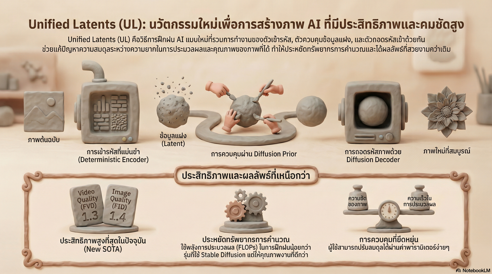

[กลับไปที่หน้าหลัก](../README.md)

สวัสดีครับเพื่อนๆ! วันนี้เรามาคุยเรื่องที่น่าตื่นเต้นมากๆ จาก Google DeepMind กันครับ นั่นก็คือ "Unified Latents"!

คุณเคยสงสัยไหมครับว่า AI สร้างภาพหรือวิดีโอได้ยังไง? ทำไมบางทีภาพที่ได้สวยงามมาก แต่บางทีกลับมีรอยหยักแปลกๆ?

ปัญหาใหญ่ของการสร้างภาพด้วย AI คือการต้องเลือกระหว่าง "คุณภาพความคมชัด" กับ "ประสิทธิภาพในการประมวลผล" เหมือนต้องเลือกระหว่างรถที่สวยแต่กินน้ำมันเยอะ กับรถที่ประหยัดแต่ไม่สวย!

หัวใจของปัญหานี้อยู่ที่ Latent Representation หรือ "รหัสลับ" ที่ AI ใช้บีบอัดข้อมูลภาพจริงให้เป็นดิจิทัล แต่ที่ผ่านมา การออกแบบรหัสเหล่านี้ใช้วิธี "ลองผิดลองถูก" ไม่มีทฤษฎีรองรับที่ชัดเจน!

ล่าสุด Google DeepMind Amsterdam ได้เผยแพร่งานวิจัย Unified Latents (UL) ที่เปลี่ยนการออกแบบ Latent จาก "เดา" ให้เป็น "คำนวณ" ที่แม่นยำ!

วันนี้เรามาดู 5 จุดเปลี่ยนสำคัญของ Unified Latents กันครับ

========================================

🤔 ทบทวนพื้นฐาน: Latent คืออะไร?

ก่อนที่เราจะไปดู Unified Latents มาทำความเข้าใจพื้นฐานก่อนนะครับ

=== Latent Representation คืออะไร? ===

Latent = ซ่อนอยู่, แฝงอยู่

Latent Representation = การแทนค่าข้อมูลในรูปแบบที่บีบอัดแล้ว ซ่อนอยู่ภายใน

เปรียบเทียบ:
▸ ภาพจริง = ไฟล์ภาพขนาด 10 MB
▸ Latent = รหัสลับขนาด 1 KB ที่บอกว่าภาพนี้มีอะไรบ้าง

=== ทำไมต้องมี Latent? ===

เพราะ:
▸ ภาพจริงมีข้อมูลเยอะมาก ประมวลผลช้า
▸ ต้องบีบอัดให้เล็กลง
▸ แต่ยังคงรักษาข้อมูลสำคัญไว้

กระบวนการ:

ขั้นที่ 1: Encoder (ตัวเข้ารหัส)
▸ รับภาพจริงเข้ามา
▸ บีบอัดเป็น Latent (รหัสลับ)

ขั้นที่ 2: AI ประมวลผล Latent
▸ ทำงานกับรหัสลับ (เล็ก เร็ว)

ขั้นที่ 3: Decoder (ตัวถอดรหัส)
▸ แปลง Latent กลับเป็นภาพ
▸ ได้ภาพที่สร้างขึ้นใหม่

=== ปัญหาของ Latent แบบเดิม ===

[ปัญหาที่ 1: Trade-off]
▸ Latent เล็ก = ประมวลผลเร็ว แต่คุณภาพแย่
▸ Latent ใหญ่ = คุณภาพดี แต่ประมวลผลช้า

[ปัญหาที่ 2: ไม่เสถียร]
▸ การฝึก AI ไม่เสถียร
▸ บางครั้งได้ผลดี บางครั้งแย่

[ปัญหาที่ 3: ไม่มีทฤษฎี]
▸ ออกแบบ Latent แบบลองผิดลองถูก
▸ ไม่รู้ว่าอะไรดีที่สุด

นี่คือปัญหาที่ Unified Latents มาแก้ไข!

========================================

1. 🎯 การหลอมรวม Noise และความแม่นยำ: สยบความไม่เสถียร

จุดเปลี่ยนแรกคือการแก้ปัญหาความไม่เสถียรในการฝึก!

=== ปัญหาของ VAE แบบเดิม ===

VAE (Variational AutoEncoder) = โมเดลแบบเดิมที่ใช้สร้าง Latent

วิธีทำงาน:
▸ Encoder เรียนรู้การกระจายตัวของข้อมูล (Distribution)
▸ พยายามให้ยืดหยุ่น ปรับตัวได้

ปัญหา:
▸ ยืดหยุ่นเกินไป!
▸ การคำนวณค่า Entropy (ความไม่แน่นอน) ยาก
▸ เกิด Training Instability = การฝึกไม่เสถียร
▸ บางครั้งดี บางครั้งแย่

=== วิธีของ Unified Latents: Deterministic Encoder ===

Unified Latents แก้ปัญหาด้วยวิธีใหม่!

[Deterministic Encoder]
▸ Deterministic = แน่นอน ไม่สุ่ม
▸ Encoder ส่งผลลัพธ์เป็นค่าเดียวที่แม่นยำ
▸ ไม่พยายามเรียนรู้การกระจายตัว

[เติม Fixed Gaussian Noise]
▸ แทนที่จะให้ Encoder สุ่ม
▸ เราเติมสัญญาณรบกวนคงที่ (Fixed Gaussian noise) เข้าไปเอง!
▸ กำหนดระดับความชัดเจนไว้ที่ log-SNR level of 5

ประโยชน์:
▸ AI ไม่ต้องพะวงกับการคาดเดาความแปรปรวน
▸ โฟกัสที่การรักษาแก่นของข้อมูลได้อย่างมั่นคง
▸ การฝึกเสถียรกว่า!

=== การเชื่อมโยงกับ Diffusion Prior ===

Unified Latents เชื่อมโยงสัญญาณรบกวนของ Encoder เข้ากับ Diffusion Prior อย่างเป็นระบบ!

"คำถามสำคัญที่เราตอบคือ: Latent ควรถูกควบคุมอย่างไร เมื่อจะถูกใช้โดย Diffusion model? คำตอบของเรา: ฝึกร่วมกับ Diffusion prior"

ผลลัพธ์:
▸ ได้ขอบเขตของข้อมูล (Upper bound on latent bitrate) ที่ชัดเจน
▸ คำนวณได้จริงผ่าน Evidence Lower Bound (ELBO)

========================================

2. 🖼️ Diffusion Decoder: เก็บรายละเอียดความถี่สูง

จุดเปลี่ยนที่สองคือการเลือกใช้ Diffusion Decoder!

=== ปัญหาของ GAN-based Decoder ===

Decoder แบบเดิมมักใช้ GAN (Generative Adversarial Network)

ปัญหา:
▸ Mode Collapse = สร้างภาพได้แค่บางแบบ ไม่หลากหลาย
▸ ภาพดู "ปลอม" ในรายละเอียดเชิงลึก
▸ มีรอยหยักแปลกๆ (Artifacts)

=== ข้อดีของ Diffusion Decoder ===

Diffusion Decoder ทำงานต่างออกไป!

[ทำนายการกระจายตัว (Distribution)]
▸ ไม่ได้สร้างภาพเดียว
▸ แต่ทำนายการกระจายตัวของข้อมูลทั้งหมด
▸ รู้ว่าภาพที่เป็นไปได้มีอะไรบ้าง

[รักษา High-frequency Details]
▸ High-frequency details = รายละเอียดความถี่สูง เช่น ขอบคม เส้นผม
▸ Diffusion Decoder เก็บรายละเอียดเหล่านี้ได้ดีเยี่ยม!
▸ ป้องกันการเกิด Artifacts (รอยหยักที่ไม่พึงประสงค์)

=== ผลการทดสอบ ===

พิสูจน์ได้จากค่า PSNR (Peak Signal-to-Noise Ratio):
▸ PSNR สูงขึ้นอย่างชัดเจน
▸ ภาพมีความอิ่มตัวและคมชัดใกล้เคียงต้นฉบับมากที่สุด!

เปรียบเทียบ:

[GAN-based Decoder]
▸ สร้างภาพเร็ว
▸ แต่มีรอยหยัก รายละเอียดไม่ดี

[Diffusion Decoder]
▸ สร้างภาพช้ากว่าหน่อย
▸ แต่รายละเอียดสมบูรณ์ ไม่มีรอยหยัก!

========================================

3. 🔄 Two-Stage Training: หัวใจของภาพที่สมบูรณ์

จุดเปลี่ยนที่สามคือกระบวนการฝึก 2 ขั้นตอน!

=== Paradox ของการฝึก Prior ===

Prior = โมเดลที่เรียนรู้ว่า Latent ที่ดีควรเป็นยังไง

ปัญหาที่พบ:
▸ ถ้าฝึก Prior ด้วย loss แบบ ELBO เพียงอย่างเดียว
▸ ให้น้ำหนักข้อมูลความถี่ต่ำและสูงเท่ากัน
▸ วัดผลได้ดี แต่ภาพที่ Sample ออกมาไม่มีคุณภาพ!

นี่คือ Paradox (ความขัดแย้ง) ที่น่าสนใจ!

=== Two-Stage Training Process ===

Unified Latents แก้ปัญหาด้วยการฝึก 2 ขั้นตอน:

[Stage 1: ฝึก Encoder-Decoder และ Prior]

ขั้นตอน:
▸ ฝึก Encoder และ Decoder ร่วมกับ Prior
▸ จนได้ Latent ที่เหมาะสม
▸ จากนั้น "แช่แข็ง" (Freeze) ตัว Encoder และ Decoder ไว้

ผลลัพธ์:
▸ ได้ Latent ที่ดี
▸ Encoder-Decoder ถูกล็อคแล้ว ไม่เปลี่ยนแปลง

[Stage 2: ฝึก Base Model]

ขั้นตอน:
▸ ฝึก Base Model ขนาดใหญ่บน Latent ที่ได้
▸ ใช้การถ่วงน้ำหนักแบบ Sigmoid Weighting
▸ เน้นย้ำคุณภาพในการสร้างภาพ (Generation Quality)

ผลลัพธ์:
▸ ได้ภาพที่มีคุณภาพยอดเยี่ยม!

=== ทำไมถึงต้องแยก 2 Stage? ===

เพราะ:
▸ Stage 1: โฟกัสที่การสร้าง Latent ที่ดี
▸ Stage 2: โฟกัสที่การสร้างภาพที่สวยงาม
▸ แยกกันทำได้ดีกว่า ไม่ปะปนกัน

เปรียบเทียบ:
▸ เหมือนการทำอาหาร แยกเตรียมวัตถุดิบก่อน แล้วค่อยปรุง
▸ ดีกว่าเตรียมไปปรุงไป

========================================

4. 🏆 SOTA: มาตรฐานใหม่ที่มาพร้อมความประหยัด

จุดเปลี่ยนที่สี่คือผลการทดสอบที่ทำลายสถิติ!

=== SOTA คืออะไร? ===

SOTA = State-of-the-Art = มาตรฐานใหม่ที่ดีที่สุดในขณะนั้น

Unified Latents สร้าง SOTA ใหม่ได้สำเร็จ!

=== ผลการทดสอบ ===

[Kinetics-600] ← วิดีโอ

ค่า FVD (Fréchet Video Distance):
▸ FVD ต่ำ = วิดีโอที่สร้างใกล้เคียงของจริงมาก
▸ Unified Latents: 1.3 (ต่ำเป็นประวัติการณ์!)
▸ โมเดลเดิม: สูงกว่ามาก

[ImageNet-512] ← ภาพ

ค่า gFID (Generation FID):
▸ gFID ต่ำ = ภาพที่สร้างมีคุณภาพสูง
▸ Unified Latents: 1.4 (ระดับสูงสุด!)
▸ โมเดลเดิม: สูงกว่า

=== ความประหยัดที่น่าทึ่ง ===

สิ่งที่น่าทึ่งกว่าคือ การทำลายสถิตินี้ใช้พลังงานน้อยกว่ามาก!

เปรียบเทียบ Training FLOPs (พลังประมวลผล):

Unified Latents:
▸ ใช้พลังประมวลผลน้อยกว่า

โมเดลเดิม (W.A.L.T, MAGVIT-v2):
▸ ใช้พลังประมวลผลเยอะกว่ามาก!

นี่คือเครื่องพิสูจน์ว่า:
▸ Unified Latents = ทางลัดที่สั้นและประหยัดกว่า
▸ ได้ผลลัพธ์ดีกว่า แต่ใช้ทรัพยากรน้อยกว่า!

สรุป:
▸ ดีกว่า + ประหยัดกว่า = สุดยอด!

========================================

5. ⚖️ Bitrate และจุดสมดุล Modeling-Reconstruction

จุดเปลี่ยนสุดท้ายคือการควบคุม Bitrate!

=== Bitrate คืออะไร? ===

Bitrate = ปริมาณข้อมูลใน Latent

เปรียบเทียบ:
▸ Bitrate สูง = Latent มีข้อมูลเยอะ
▸ Bitrate ต่ำ = Latent มีข้อมูลน้อย

=== Modeling-Reconstruction Trade-off ===

นี่คือความสมดุลที่สำคัญมาก!

[High Bitrate] ← Latent มีข้อมูลเยอะ

ผลลัพธ์:
▸ Decoder ทำงานง่าย (ข้อมูลครบ)
▸ ได้ rFID (Reconstruction FID) ที่ดีมาก
▸ แต่ Base Model ต้องเรียนรู้ความซับซ้อนมหาศาล
▸ gFID (Generation FID) แย่ลง!

[Low Bitrate] ← Latent มีข้อมูลน้อย

ผลลัพธ์:
▸ Decoder ทำงานยาก (ข้อมูลไม่ครบ)
▸ rFID แย่กว่า
▸ แต่ Base Model เรียนรู้ง่ายกว่า
▸ gFID ดีขึ้น!

[The Sweet Spot] ← จุดที่เหมาะสมที่สุด

Unified Latents ช่วยให้เราหาจุดที่สมดุลที่สุด!

กฎทั่วไป:
▸ โมเดลขนาดเล็ก → ทำงานได้ดีกว่าบน Bitrate ที่ต่ำกว่า
▸ เพราะไม่ถูกถาโถมด้วยข้อมูลที่เกินความสามารถ

▸ โมเดลขนาดใหญ่ → รับมือกับ Bitrate ที่สูงขึ้นได้
▸ เพราะมีความสามารถในการเรียนรู้มากกว่า

=== การควบคุม Bitrate ===

Unified Latents ให้เราควบคุม Bitrate ได้ผ่าน Loss Factor!

วิธีการ:
▸ ปรับค่า Loss Factor
▸ Bitrate เปลี่ยนตาม
▸ หาจุดที่เหมาะสมที่สุดสำหรับโมเดลของเรา

ประโยชน์:
▸ ไม่ต้องเดาอีกต่อไป
▸ คำนวณได้ว่า Bitrate ไหนดีที่สุด!

========================================

สรุป: ก้าวสู่ Scaling Laws ของ Generative AI

หลังจากที่เราได้เห็น 5 จุดเปลี่ยนของ Unified Latents แล้ว มาสรุปกันครับ

=== สิ่งที่เราได้เรียนรู้ ===

[1] การหลอมรวม Noise และความแม่นยำ
▸ ใช้ Deterministic Encoder
▸ เติม Fixed Gaussian Noise
▸ การฝึกเสถียรกว่า

[2] Diffusion Decoder
▸ รักษา High-frequency Details ได้ดี
▸ ไม่มี Artifacts
▸ ภาพคมชัด สมบูรณ์

[3] Two-Stage Training
▸ Stage 1: สร้าง Latent ที่ดี
▸ Stage 2: สร้างภาพที่สวยงาม
▸ แยกทำได้ผลลัพธ์ดีกว่า

[4] SOTA ที่ประหยัด
▸ ทำลายสถิติ FVD และ gFID
▸ ใช้พลังประมวลผลน้อยกว่า
▸ ดีกว่าและประหยัดกว่า!

[5] ควบคุม Bitrate ได้
▸ หาจุดสมดุลที่เหมาะสมที่สุด
▸ ไม่ต้องเดา คำนวณได้!

=== การเปลี่ยนแปลงที่แท้จริง ===

Unified Latents ไม่ใช่แค่โมเดลใหม่ แต่คือ:
▸ การปูรากฐานสู่ Scaling Laws สำหรับ Latent ในอนาคต!

Scaling Laws = สูตรสำเร็จที่บอกว่าต้องใช้อะไรเท่าไหร่ถึงจะได้ผลลัพธ์ที่ดีที่สุด

=== สูตรสำเร็จในอนาคต ===

ทีมนักวิจัยเชื่อว่าเรากำลังเข้าใกล้จุดที่สามารถสร้าง "Recipe" (สูตรสำเร็จ) ที่บอกได้ทันทีว่า:

"ถ้าคุณมีงบประมาณในการประมวลผล (Compute Budget) เท่านี้ คุณควรใช้ Bitrate ที่ระดับใดจึงจะได้ AI ที่ฉลาดที่สุด"

นี่คือการเปลี่ยนผ่านที่สำคัญ!

[จากเดิม: ลองผิดลองถูก]
▸ ไม่รู้ว่าอะไรดีที่สุด
▸ ต้องทดลองเยอะ
▸ เสียเวลาและทรัพยากร

[อนาคต: คำนวณได้]
▸ รู้ทันทีว่าต้องใช้อะไร
▸ ไม่ต้องทดลอง
▸ ประหยัดเวลาและทรัพยากร!

=== ผลกระทบต่ออุตสาหกรรม ===

Unified Latents จะเปลี่ยนแปลงอุตสาหกรรม AI:

[การสร้างภาพ]
▸ ภาพที่สร้างมีคุณภาพสูงขึ้น
▸ ไม่มีรอยหยัก
▸ ใช้ทรัพยากรน้อยลง

[การสร้างวิดีโอ]
▸ วิดีโอที่สร้างเหมือนจริงมากขึ้น
▸ ไหลลื่น ไม่กระตุก
▸ ประมวลผลเร็วขึ้น

[เกม VR/AR]
▸ โลกเสมือนที่สมจริงมากขึ้น
▸ รายละเอียดสมบูรณ์
▸ ประสิทธิภาพดีขึ้น

=== คำถามท้ายทาย ===

"เมื่อเราสามารถบีบอัดความจริงลงในรหัสที่สมบูรณ์แบบได้แล้ว ขีดจำกัดต่อไปของโลกเสมือนจะอยู่ที่ตรงไหน?"

คำถามนี้น่าคิดมาก!

เพราะ:
▸ ถ้าเรา encode (เข้ารหัส) โลกจริงได้อย่างสมบูรณ์
▸ และ decode (ถอดรหัส) กลับมาได้เหมือนเดิมทุกประการ
▸ เราจะสร้างโลกเสมือนที่แยกไม่ออกจากความจริงได้!

ขีดจำกัดต่อไปคือ:
▸ จินตนาการของเรา
▸ ความคิดสร้างสรรค์
▸ การนำไปใช้ให้เกิดประโยชน์

=== มุมมองส่วนตัว ===

Unified Latents เป็นก้าวสำคัญที่แสดงให้เห็นว่า:

AI กำลังเปลี่ยนจาก "ศิลปะ" ไปสู่ "วิทยาศาสตร์":
▸ จากการเดา → การคำนวณ
▸ จากการลองผิดลองถูก → สูตรสำเร็จ
▸ จากไม่แน่นอน → แน่นอน

นี่คือความก้าวหน้าที่แท้จริงของ AI!

========================================

อ้างอิง:
• Unified Latents by Google DeepMind Amsterdam
• Deterministic Encoder with Fixed Gaussian Noise
• Diffusion Decoder
• Two-Stage Training Process
• Scaling Laws for Latent Representations

หวังว่าบทความนี้จะช่วยให้ทุกคนเห็นว่า Unified Latents ไม่ใช่แค่เทคนิคใหม่ แต่เป็นการเปลี่ยนวิธีคิดของเราเกี่ยวกับ Latent Representation ไปตลอดกาล!

จากการเดาสู่การคำนวณ จากศิลปะสู่วิทยาศาสตร์ นี่คือก้าวสำคัญของ Generative AI!

ถ้ามีคำถามหรือความคิดเห็นเกี่ยวกับ Unified Latents มาคุยกันได้เลยนะครับ 😊
