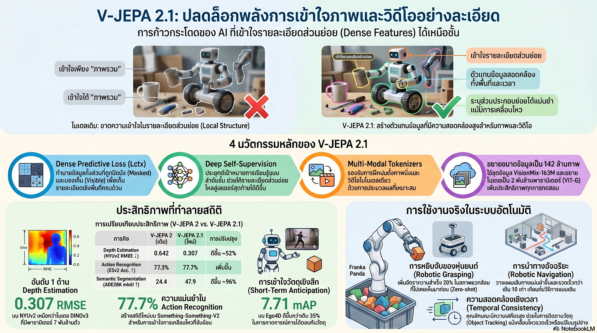

[กลับไปที่หน้าหลัก](../README.md)

สวัสดีครับเพื่อนๆ ที่ติดตามวงการ AI! วันนี้มาเรื่องที่เปลี่ยนคำถามจาก "AI เข้าใจวิดีโอได้ไหม?" เป็น "AI เข้าใจกฎของโลกกายภาพได้จริงไหม?" ซึ่งนั่นคือสิ่งที่ Meta FAIR กำลังทำด้วย V-JEPA 2.1 ล่าสุดครับ

คุณเคยสังเกตไหมครับว่า AI ที่ "เข้าใจวิดีโอ" ในปัจจุบันส่วนใหญ่รู้ว่า "ใครกำลังทำอะไร" แต่กลับไม่รู้ว่า "ของชิ้นนั้นอยู่ห่างแค่ไหน มีพื้นผิวอย่างไร หรือจะหยิบจับได้จากทิศทางใด" ซึ่งคือทุกสิ่งที่หุ่นยนต์ต้องรู้?

คุณรู้ไหมครับว่า โมเดลขนาด 2 พันล้านพารามิเตอร์ (2B) ของ Meta สามารถประเมินความลึกของภาพได้แม่นยำกว่าโมเดลที่ใหญ่กว่าถึง 3.5 เท่า (7B) ด้วยเทคนิค Dense Predictive Loss ที่บังคับให้โมเดล "มองเห็นต้นไม้" ไม่ใช่แค่ "มองเห็นทั้งป่า"?

และคุณเคยนึกไหมครับว่า ถ้า AI มี "สัญชาตญาณทางกายภาพ" เหมือนมนุษย์ที่รู้ว่าของตกต้องตกลงพื้น แก้วน้ำกลมจับลื่นกว่ากล่องสี่เหลี่ยม และพื้นเปียกต้องระวังมากกว่า โดยไม่มีใครสอน หุ่นยนต์ที่ทำงานในโรงงานหรือบ้านของเราจะเปลี่ยนไปอย่างไร?

แนวคิดนี้คือ World Model และ V-JEPA 2.1 กำลังพิสูจน์ว่ามันไม่ใช่แค่ทฤษฎีอีกต่อไปแล้วครับ

========================================

🤔 ทบทวนความเชื่อเดิมๆ: สิ่งที่เราคิดเกี่ยวกับ AI กับการเข้าใจโลกกายภาพ

▪ "AI ที่เข้าใจวิดีโอได้ดี ย่อมเข้าใจโลกกายภาพได้ดีโดยอัตโนมัติ" → Global Aggregator Problem พิสูจน์ว่าการเข้าใจ Semantic (ใครทำอะไร) ≠ การเข้าใจ Dense Features (ระยะ พื้นผิว โครงสร้าง) โมเดลอาจรู้ว่ามีคนกำลังหยิบแก้ว แต่ไม่รู้ว่าแก้วอยู่ห่างเท่าไหร่หรือมีพื้นผิวลื่นแค่ไหนครับ

▪ "โมเดลที่ใหญ่กว่าย่อมเข้าใจโลกกายภาพได้ดีกว่าโมเดลเล็กเสมอ" → V-JEPA 2.1 ขนาด 2B เอาชนะ DINOv3 ขนาด 7B ใน Depth Estimation (0.307 vs 0.309 RMSE บน NYUv2) เพราะ Architecture และ Loss Function ที่ออกแบบมาอย่างถูกต้องสำคัญกว่าขนาดพารามิเตอร์เสมอครับ

▪ "Loss function ควรวัดแค่ผลลัพธ์สุดท้าย ส่วนกลางทางไม่จำเป็นต้องตรวจสอบ" → Deep Self-Supervision พิสูจน์ว่าการใช้ Loss ในหลายเลเยอร์ระหว่าง Encoder ทำให้ mIoU กระโดดจาก 22.2 → 47.9 บน ADE20K เพราะรายละเอียดระดับท้องถิ่นไม่สูญหายระหว่างทางอีกต่อไปครับ

▪ "หุ่นยนต์ต้องฝึกซ้ำในสภาพแวดล้อมใหม่ทุกครั้งก่อนใช้งานจริงได้ เพราะแต่ละที่ไม่เหมือนกัน" → Zero-shot capabilities ของ V-JEPA 2.1 ทำให้อัตราความสำเร็จในการหยิบจับ (Grasping) เพิ่มขึ้น +20% และ Navigation Planning เร็วขึ้น 10 เท่า ในสภาพแวดล้อมที่โมเดลไม่เคยเห็นมาก่อนเลยครับ

ความจริงที่น่าคิดคือ: ปัญหาที่กั้น AI กับโลกกายภาพมาตลอดไม่ได้อยู่ที่โมเดลฉลาดไม่พอ แต่อยู่ที่การออกแบบ Loss Function ที่บังคับให้โมเดลเรียนรู้รายละเอียดเชิงพื้นที่ ไม่ใช่แค่ภาพรวม Semanticครับ

========================================

🧠 พื้นฐานที่ต้องเข้าใจก่อน: World Model, Global Aggregator Problem, Dense Loss และ mIoU

=== World Model คืออะไร? ===

World Model = โมเดล AI ที่ไม่แค่ "เห็น" โลก แต่ "เข้าใจกฎเกณฑ์" ของโลกกายภาพ

ความต่าง:
▸ โมเดลทั่วไป: เห็นลูกบอลบินอยู่ → รู้ว่ามีลูกบอล
▸ World Model: เห็นลูกบอลบินอยู่ → คาดเดาได้ว่ามันจะตกตรงไหน, เร็วแค่ไหน, กระดอนสูงแค่ไหน

เปรียบเทียบ: เหมือนความต่างระหว่างดูภาพถ่ายของนักกีฬา กับการเป็นนักกีฬาที่รู้สึกได้ว่าลูกบอลจะไปทางไหนก่อนที่จะบินมาถึงครับ

=== Global Aggregator Problem คืออะไร? ===

Global Aggregator Problem = ปัญหาที่ Token ที่โมเดล "มองเห็น" ในระบบ Masked Learning ทำหน้าที่รวบรวมข้อมูลภาพรวมจนละเลยรายละเอียดเชิงพื้นที่

เปรียบเทียบ: เหมือนดูป่าจากเครื่องบิน มองเห็นได้ว่าเป็นป่าไม้เขตร้อน แต่ไม่รู้ว่าต้นไม้แต่ละต้นมีเปลือกเรียบหรือหยาบ มีหนามหรือไม่ และลำต้นใหญ่แค่ไหน ซึ่งคือข้อมูลที่หุ่นยนต์ต้องรู้ก่อนจะปีนหรือจับครับ

=== Dense Predictive Loss vs Sparse Masking ===

สองแนวทางในการบังคับให้โมเดลเรียนรู้

[Sparse Masking (แบบเดิม)]
▸ ปิดบังบางส่วนของภาพ → ให้โมเดลทำนายเฉพาะส่วนที่ปิด
▸ Token ที่มองเห็นมักรวบรวมข้อมูลภาพรวม
▸ Global Aggregator Problem เกิดขึ้น รายละเอียด Dense ถูกละเลยครับ

[Dense Predictive Loss (V-JEPA 2.1)]
▸ กำกับดูแล (Supervise) โทเคนทุกตัว ทั้งที่มองเห็นและที่ปิดบัง
▸ บังคับให้โมเดลรักษา Spatial + Temporal Structure ครบถ้วน
▸ Explicit spatial and temporal grounding เกิดขึ้นในทุกโทเคนครับ

=== mIoU และ Semantic Segmentation คืออะไร? ===

Semantic Segmentation = การแบ่งภาพออกเป็นส่วนๆ โดยระบุว่าแต่ละพิกเซลคืออะไร (นี่คือผนัง นี่คือเก้าอี้ นี่คือมือมนุษย์)

mIoU (mean Intersection over Union) = ค่าวัดความแม่นยำในการแบ่งส่วนภาพ ยิ่งสูงยิ่งแม่น (0-100)

เปรียบเทียบ: เหมือนการให้คะแนนว่า AI วาดเส้นขอบรอบวัตถุแต่ละชิ้นในภาพได้แม่นยำแค่ไหน โดย mIoU 47.9 เทียบกับ 22.2 คือความแตกต่างระหว่างรู้คร่าวๆ ว่ามีคนอยู่ กับรู้ว่าแต่ละนิ้วมืออยู่ตรงไหนครับ

=== Deep Self-Supervision คืออะไร? ===

Deep Self-Supervision = การใช้ Loss Function ในหลายระดับชั้นของ Encoder (Hierarchical approach) แทนที่จะตรวจสอบแค่ชั้นสุดท้าย

เปรียบเทียบ: เหมือนครูที่ตรวจการบ้านทุกขั้นตอนของการแก้โจทย์ ไม่ใช่แค่ดูคำตอบสุดท้าย ทำให้นักเรียนไม่สามารถ "เดาคำตอบ" ได้ต้องเข้าใจกระบวนการจริงๆ ครับ

========================================

1️⃣ Dense Predictive Loss: แก้ปัญหา "มองแต่ป่า ไม่เห็นต้นไม้"

=== ที่มาของ Global Aggregator Problem ===

ในระบบ Masked Learning แบบดั้งเดิม AI ถูกฝึกให้ "เติมส่วนที่ขาดหายไป" ซึ่งฟังดูดี แต่มีผลข้างเคียงที่ร้ายแรงครับ

[ปัญหาที่เกิดขึ้น]
▸ Token ที่มองเห็นได้มักรวบรวมข้อมูล Semantic (ภาพรวม) เพื่อทำนายส่วนที่ปิดบัง
▸ รายละเอียดเชิงพื้นที่ (พื้นผิว ระยะ โครงสร้าง) ถูกมองว่าไม่จำเป็นสำหรับการทำนาย
▸ โมเดลเรียนรู้ที่จะ "เดาอย่างฉลาด" แทนที่จะ "เข้าใจอย่างละเอียด"ครับ

=== วิธีที่ Dense Predictive Loss แก้ปัญหา ===

[กลไกหลัก]
▸ Supervise โทเคนทุกตัว: ทั้งส่วนที่มองเห็นและส่วนที่ถูกปิดบัง ต่างต้องรับผิดชอบความแม่นยำ
▸ Spatial Structure Preservation: โมเดลต้องรักษาโครงสร้างเชิงพื้นที่ไว้ทั้งหมด ไม่ใช่แค่เนื้อหา
▸ Temporal Grounding: ความสัมพันธ์ระหว่างเวลาต้องถูกรักษาไว้ในทุกโทเคนด้วยครับ

[ผลลัพธ์ที่ได้]
▸ Semantically coherent features: ฟีเจอร์ที่เรียนรู้มีความหมายสอดคล้องกันทั้งภาพ
▸ High spatial precision: ความแม่นยำเชิงพื้นที่สูงขึ้นในทุกงาน

เปรียบเทียบ: เหมือนการสอนให้เด็กวาดรูปโดยไม่แค่ให้เดาว่า "ตรงนี้ควรมีอะไร" แต่บังคับให้ "เข้าใจโครงสร้างทั้งหมดก่อนแล้วค่อยลงรายละเอียดทุกจุด" ผลลัพธ์ที่ได้คือภาพที่ถูกต้องทั้งภาพ ไม่ใช่แค่ถูกในจุดที่ขาดหายครับ

========================================

2️⃣ Deep Self-Supervision: เมื่อ Loss ทำงานทุกชั้น ไม่ใช่แค่ปลายทาง

=== ปัญหาของการตรวจสอบแค่ชั้นสุดท้าย ===

ใน Architecture แบบ Transformer ข้อมูลไหลผ่านหลายเลเยอร์ก่อนถึงเลเยอร์สุดท้าย ถ้าตรวจสอบเฉพาะชั้นสุดท้าย ข้อมูลระดับท้องถิ่นที่ละเอียดสูงมักสูญหายระหว่างทางครับ

[ปัญหาที่เกิดขึ้น]
▸ เลเยอร์กลาง: ข้อมูล Local (รายละเอียดพื้นผิว ขอบ โครงสร้างเล็กๆ) เริ่มถูกนามธรรมออก
▸ เลเยอร์สุดท้าย: เหลือเฉพาะ Semantic สูงๆ (ใครทำอะไร) แต่ Dense features หายไปแล้ว
▸ ผลลัพธ์: โมเดลดีในงาน High-level แต่แย่ในงาน Dense Prediction ครับ

=== Hierarchical Loss ของ V-JEPA 2.1 ===

[กลไก Deep Self-Supervision]
▸ Loss function ถูกใช้ในหลายระดับชั้นของ Encoder พร้อมกัน
▸ แต่ละเลเยอร์ต้องรับผิดชอบทั้ง Local features และ Global context
▸ ข้อมูลละเอียดระดับท้องถิ่นไม่ถูกปล่อยให้สูญหายระหว่างการประมวลผลครับ

[ผลลัพธ์เชิงตัวเลข บน ADE20K Semantic Segmentation]
▸ V-JEPA (เดิม): mIoU = 22.2
▸ V-JEPA 2.1 (Linear probe): mIoU = 38.6 (+16.4 จากโมเดลเดิม)
▸ V-JEPA 2.1 (Full fine-tuning): mIoU = 47.9 (+25.7 จากโมเดลเดิม)

เปรียบเทียบ: เหมือนโรงเรียนที่เปลี่ยนจาก "สอบปลายภาคอย่างเดียว" เป็น "สอบทุกบทเรียนระหว่างทาง" นักเรียนต้องเข้าใจจริงๆ ในทุกขั้นตอน ไม่สามารถ Cram เฉพาะก่อนสอบปลายภาคได้อีกต่อไปครับ

========================================

3️⃣ 2B เอาชนะ 7B: หุ่นยนต์ที่ "ฉลาดทันที" ในโลกที่ไม่เคยเห็น

=== Depth Estimation: เล็กกว่าแต่แม่นกว่า ===

ผลลัพธ์ที่ท้าทายความเชื่อเรื่อง "ใหญ่กว่าดีกว่า" ที่ชัดเจนที่สุดในวงการ AI มาจาก Depth Estimation บน NYUv2 ครับ

[การเปรียบเทียบโดยตรง]
▸ DINOv3 (7B พารามิเตอร์): RMSE = 0.309
▸ V-JEPA 2.1 (2B พารามิเตอร์): RMSE = 0.307 (แม่นกว่า ด้วยขนาด 3.5 เท่าที่เล็กกว่า)

RMSE (Root Mean Square Error) ในที่นี้ = ค่าเฉลี่ยความผิดพลาดในการประเมินระยะทาง ยิ่งต่ำยิ่งแม่น

เปรียบเทียบ: เหมือนรถขนาดเล็กที่บรรทุกน้ำหนักได้มากกว่ารถใหญ่กว่า เพราะได้รับการออกแบบโครงสร้างมาอย่างเหมาะสมกว่า ไม่ใช่แค่ใหญ่กว่าครับ

=== Zero-shot Robotics: ไม่ต้องฝึกใหม่ก็ทำงานได้ทันที ===

ความสามารถที่สำคัญที่สุดสำหรับการใช้งานจริงคือ Zero-shot Performance ซึ่งหมายถึงการทำงานในสภาพแวดล้อมที่ไม่เคยเห็นมาก่อนได้ทันทีครับ

[ผลการทดสอบ]
▸ Grasping (การหยิบจับ): อัตราความสำเร็จเพิ่มขึ้น +20% ในสภาพแวดล้อมใหม่
▸ Navigation Planning (การวางแผนเส้นทาง): เร็วขึ้น 10 เท่าเทียบกับ NWM Baseline
▸ ไม่ต้องฝึกโมเดลใหม่ก่อนนำไปใช้ในพื้นที่ที่ไม่คุ้นเคย

เปรียบเทียบ: เหมือนความต่างระหว่างช่างที่ต้องสำรวจโรงงานใหม่หลายสัปดาห์ก่อนเริ่มงาน กับช่างที่เดินเข้ามาแล้วเข้าใจสภาพแวดล้อมได้ทันทีเพราะมี "สัญชาตญาณทางกายภาพ" ที่แข็งแกร่งพอครับ

========================================

4️⃣ Unified Multi-Modal และ VisionMix163M: World Model ที่สมบูรณ์แบบ

=== Multi-Modal Tokenizer: ภาพและวิดีโอในระบบเดียว ===

ความท้าทายเดิมของโมเดลที่รองรับทั้ง Image และ Video คือการที่ทั้งสองรูปแบบมีโครงสร้างข้อมูลต่างกัน (2D vs 3D) ทำให้ต้องใช้ระบบแยกกันหรือยอมรับ Bias จากการแปลงข้อมูลครับ

[วิธีของ V-JEPA 2.1]
▸ Multi-Modal Tokenizer จัดการทั้ง 2D Images และ 3D Video แบบ Native
▸ ภาพนิ่งถูกประมวลผลในรูปแบบของมันเอง ไม่ต้องแปลงเป็นวิดีโอ 1 เฟรม
▸ ลด Modality-specific Bias ที่เคยทำให้โมเดลประเมินข้อมูลผิดพลาดครับ

=== VisionMix163M: ข้อมูลที่ใหญ่พอสำหรับ World Model ===

[ขนาดชุดข้อมูล]
▸ ภาพนิ่ง: 142 ล้านภาพ
▸ วิดีโอ: 1.6 ล้านชั่วโมง
▸ รวม: VisionMix163M ที่ออกแบบมาให้โมเดลเห็นโลกกายภาพในทุกมุมมองครับ

=== ผลลัพธ์ SOTA ทั่วทุก Benchmark ===

[Action Recognition — SSv2]
▸ คะแนน: 77.7% (Something-Something v2: เน้นทดสอบว่าโมเดลเข้าใจ "ทิศทาง" และ "สาเหตุ-ผลลัพธ์" ของการกระทำ ไม่ใช่แค่ชื่อวัตถุ)

[Global Understanding — Diving-48]
▸ คะแนน: 89.2% (ทดสอบการเข้าใจท่าดำน้ำที่แตกต่างกันเล็กน้อยในรายละเอียด)

[Global Understanding — K400]
▸ คะแนน: 87.7% (Kinetics-400: ทดสอบการรับรู้กิจกรรมมนุษย์ใน 400 ประเภท)

[Object-Interaction Anticipation — Ego4D]
▸ คะแนน: 7.71 mAP → SOTA ของวงการ
▸ งานนี้คือการ "ทำนายล่วงหน้า" ว่ามือมนุษย์จะไปหยิบวัตถุชิ้นไหนในอีก 1 วินาทีข้างหน้า ซึ่งตรงที่สุดกับการใช้งานจริงของหุ่นยนต์ที่ต้องคาดเดาพฤติกรรมมนุษย์ครับ

เปรียบเทียบ: เหมือนผู้ช่วยที่ไม่แค่รู้ว่าคุณกำลังทำอะไร แต่รู้ว่าคุณกำลังจะทำอะไรต่อไป และเตรียมของไว้ให้ล่วงหน้าได้ครับ

========================================

🎯 สรุป: รากฐานของ Autonomous Industry กำลังถูกวางอยู่ตรงหน้าเรา

V-JEPA 2.1 สรุปได้ด้วย 3 นวัตกรรมหลัก: Dense Predictive Loss ที่แก้ Global Aggregator Problem, Deep Self-Supervision ที่ทำให้ mIoU พุ่งจาก 22.2 → 47.9 และ Unified Multi-Modal Tokenizer ที่จัดการทั้งภาพและวิดีโอแบบ Native ผลลัพธ์คือโมเดล 2B ที่เอาชนะ 7B ใน Depth Estimation, Grasping +20%, Navigation 10x และ SOTA บน Ego4D

สิ่งที่น่าสนใจกว่าตัวเลขคือนัยต่อโลกข้างหน้าครับ เมื่อ AI มี "สัญชาตญาณทางกายภาพ" ที่แม่นยำพอ ประตูที่เปิดไม่ใช่แค่หุ่นยนต์ที่หยิบของได้แม่นขึ้น แต่คือระบบที่เรียนรู้ Physical Laws จากการสังเกตโลกเหมือนที่มนุษย์เรียนรู้ตั้งแต่เป็นทารก โดยไม่ต้องมีใครโปรแกรมกฎฟิสิกส์ให้ครบทุกข้อครับ

ก้าวต่อไปที่น่าจับตาคือ เมื่อ World Model ที่สมบูรณ์แบบพบกับ Robotics Hardware ที่ก้าวหน้าพอ เส้นแบ่งระหว่าง "หุ่นยนต์อุตสาหกรรม" กับ "ผู้ช่วยอัจฉริยะ" จะเลือนหายไปครับ

========================================

💬 คำถามท้ายทาย: ลองคิดดูนะครับ

▪ Dense Predictive Loss บังคับให้โมเดลเรียนรู้ทุกรายละเอียด ไม่ใช่แค่ภาพรวม ถ้าเราใช้หลักการเดียวกันนี้กับการศึกษามนุษย์ เราควรออกแบบหลักสูตรที่ "ตรวจสอบทุกรายละเอียด" แทนที่จะ "สอบปลายภาคอย่างเดียว" อย่างไรดีครับ?

▪ V-JEPA 2.1 ขนาด 2B เอาชนะ DINOv3 ขนาด 7B ในงาน Depth Estimation พิสูจน์ว่า Architecture ที่ถูกต้องสำคัญกว่าขนาด ในชีวิตจริงเราควรเลือก "คนเก่งที่ถูกงาน" หรือ "คนที่มีประสบการณ์มากที่สุด" เมื่อต้องเลือกระหว่างสองอย่างนี้ครับ?

▪ Zero-shot Robotics ทำให้หุ่นยนต์ทำงานในสภาพแวดล้อมใหม่ได้ทันที ถ้าหุ่นยนต์ไม่ต้องฝึกสภาพแวดล้อมเฉพาะ ธุรกิจประเภทไหนจะถูก Disrupt ก่อนและเร็วที่สุดครับ?

▪ Ego4D วัดความสามารถในการทำนายล่วงหน้าว่ามือมนุษย์จะหยิบอะไรต่อไป ถ้า AI ทำนายพฤติกรรมของเราได้ก่อนที่เราจะรู้ตัว เส้นแบ่งระหว่าง "ผู้ช่วยที่เข้าใจเรา" กับ "ระบบที่ควบคุมเรา" อยู่ตรงไหนครับ?

========================================

References:
- V-JEPA 2.1: Advancing Self-Supervised Video Representations (Meta FAIR)
- NYUv2 Depth Estimation Benchmark
- ADE20K Semantic Segmentation Benchmark
- Something-Something v2 (SSv2) Action Recognition
- Diving-48 and Kinetics-400 (K400) Video Understanding
- Ego4D Object-Interaction Anticipation Benchmark
- DINOv3 Baseline Comparison

ถ้า World Model ที่สมบูรณ์คือ AI ที่เข้าใจกฎของโลกกายภาพได้เหมือนมนุษย์ V-JEPA 2.1 อาจไม่ใช่จุดหมายปลายทาง แต่คือก้าวแรกที่พิสูจน์ว่า "เส้นทางนั้นมีอยู่จริง" ครับ

#AI #ArtificialIntelligence #VJEPA #WorldModel #ComputerVision #MetaAI #FAIR #Robotics #DenseLoss #SelfSupervision #VideoUnderstanding #DepthEstimation #ZeroShot #SemanticSegmentation #Ego4D
