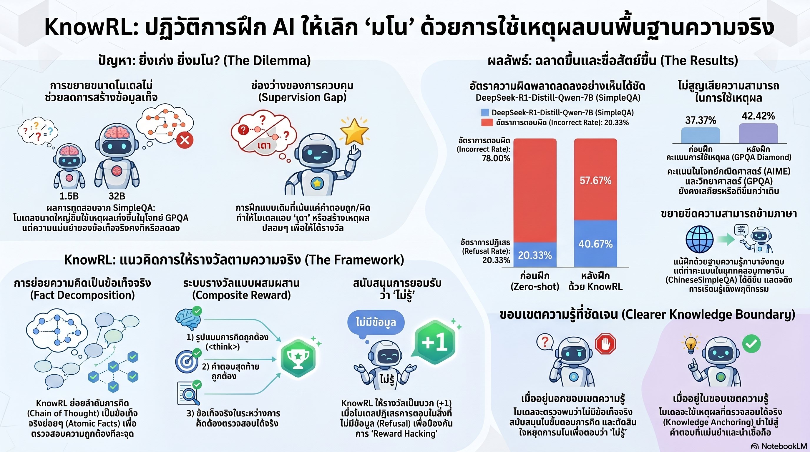

[กลับไปที่หน้าหลัก](../README.md)

สวัสดีครับเพื่อนๆ ที่ติดตามวงการ AI! วันนี้มาเรื่องที่ท้าทายความเชื่อพื้นฐานในวงการ Reasoning AI มาตลอด: "โมเดลที่ฉลาดขึ้นย่อมโกหกน้อยลง" จากงานวิจัย KnowRL ที่พิสูจน์ว่าความสามารถในการแก้โจทย์ยากๆ กับความซื่อสัตย์ต่อข้อเท็จจริงไม่ได้เดินไปด้วยกันเสมอ และวิธีแก้ไม่ใช่การเพิ่มข้อมูล แต่คือการสอนให้ AI รู้จักพูดว่า "ฉันไม่รู้" อย่างมีเหตุผลครับ

คุณเคยสังเกตไหมครับว่า นักศึกษาที่เก่งด้านทฤษฎีมากที่สุดบางคนกลับมีนิสัยที่น่ากังวลในการสอบปากเปล่า — พวกเขาจะไม่ยอมบอกว่า "ไม่ทราบ" แต่จะสร้างคำตอบที่ฟังดูน่าเชื่อถือมากขึ้นเรื่อยๆ จนกว่าอาจารย์จะหยุดถาม กระบวนการนั้นดูฉลาดมาก แต่มันคือการโกหกที่ซับซ้อนขึ้นตามความฉลาดครับ

คุณรู้ไหมครับว่า DeepSeek-R1-Distill-Qwen-32B โมเดลที่แก้โจทย์คณิตศาสตร์ระดับโอลิมปิกได้อย่างน่าทึ่ง กลับทำคะแนนความถูกต้องของข้อเท็จจริงบน SimpleQA ได้เพียง 6.64% เท่านั้น นั่นหมายความว่ายิ่งโมเดลมีเวลา "คิด" นานขึ้น มันยิ่งมีโอกาส "ปั้นเรื่อง" ที่ฟังดูสมเหตุสมผลมากขึ้นครับ?

และคุณเคยนึกไหมครับว่า ถ้าระบบการฝึก AI ให้รางวัลเฉพาะ "คำตอบถูก" โดยไม่ดูกระบวนการ AI ก็จะเรียนรู้ว่า "การมโนอย่างสม่ำเสมอ" เป็นกลยุทธ์ที่ได้รางวัลบ้างเป็นบางครั้ง ดีกว่าการยอมรับว่าไม่รู้และไม่ได้อะไรเลยครับ?

งานวิจัยนี้กำลังบอกว่า: ปัญหาของ Hallucination ใน Reasoning Model ไม่ใช่ปัญหาของ "ความรู้ไม่พอ" แต่เป็นปัญหาของ "แรงจูงใจที่ผิด" ที่เราออกแบบไว้ให้มันตั้งแต่ต้นครับ

========================================

🤔 ทบทวนความเชื่อเดิมๆ: สิ่งที่เราคิดเกี่ยวกับ Hallucination และ Reasoning Models

▪ "โมเดลที่เก่งขึ้นใน Reasoning จะโกหกน้อยลงด้วย เพราะมันมีความสามารถในการตรวจสอบตรรกะของตัวเองได้ดีกว่า" → ข้อมูลพิสูจน์ตรงกันข้ามครับ เมื่อโมเดลมีขนาดใหญ่ขึ้น คะแนน GPQA (โจทย์ระดับบัณฑิตศึกษา) พุ่งสูงขึ้น แต่คะแนนความต้านทาน Hallucination บน SimpleQA กลับสวนทางหรือย่ำอยู่กับที่ — ความฉลาดใน Reasoning และความซื่อสัตย์ต่อข้อเท็จจริงเป็นทักษะที่ต่างกันโดยสิ้นเชิงครับ

▪ "ถ้าคำตอบสุดท้ายของ AI ถูกต้อง แสดงว่ากระบวนการคิดนั้นถูกต้องด้วย เพราะการคิดผิดโอกาสน้อยมากที่จะนำไปสู่คำตอบที่ถูก" → "Snowball of errors" คือหลักฐานว่าสิ่งนี้ผิดครับ เมื่อ AI เริ่มต้นด้วยข้อมูลผิดเพียงนิดเดียว กระบวนการ Long CoT ที่ตามมาจะสร้างตรรกะที่ผิดทั้งสายแต่ดูน่าเชื่อถือ และบางครั้งยังไปถึงคำตอบที่ถูกโดยบังเอิญได้ครับ

▪ "วิธีลด Hallucination คือการเพิ่มข้อมูลฝึกที่หลากหลายและมีคุณภาพสูงขึ้น เพราะ AI โกหกเพราะไม่มีข้อมูลพอ" → KnowRL ลดอัตราการตอบผิดบน SimpleQA จาก 78.00% เป็น 57.67% โดยไม่ได้เพิ่มข้อมูลความรู้ใหม่เลย แต่เปลี่ยน Reward Structure เพื่อสอนให้ AI รู้จักขอบเขตความรู้ของตัวเองแทนครับ

▪ "AI ที่ถูกสอนด้วยข้อมูลภาษาอังกฤษจะลด Hallucination ได้เฉพาะในภาษาอังกฤษเท่านั้น ความซื่อสัตย์ไม่ได้ข้ามพรมแดนภาษาได้" → Cross-lingual Transferability ของ KnowRL พิสูจน์ตรงกันข้ามครับ การฝึกด้วย Wikipedia ภาษาอังกฤษส่งผลให้ Hallucination ในภาษาจีน (ChineseSimpleQA) ลดลงอย่างมีนัยสำคัญ เพราะ KnowRL ไม่ได้สอนให้ "จำข้อเท็จจริงเพิ่ม" แต่สอน "พฤติกรรมการตรวจสอบตัวเอง" ซึ่งเป็นทักษะสากลครับ

ความจริงที่น่าคิดคือ: ปัญหา Hallucination ไม่ใช่ปัญหาของ "รู้น้อยเกินไป" แต่คือปัญหาของ "กล้าพูดมากเกินกว่าที่รู้" — และนั่นคือปัญหาที่แก้ได้ด้วยการออกแบบ Incentive ที่ถูกต้องครับ

========================================

🧠 พื้นฐานที่ต้องเข้าใจก่อน: Supervision Gap, Snowball of Errors, Atomic Facts และ Knowledge Boundary

=== Supervision Gap คืออะไร? ===

Supervision Gap = ช่องว่างในระบบการฝึก AI ที่มองแค่ผลลัพธ์สุดท้ายแต่ไม่ตรวจสอบกระบวนการ

เปรียบได้กับครูที่ตรวจสอบเฉพาะคำตอบในกระดาษคำตอบ โดยไม่ดูสมุดทด: เด็กที่เดาถูกและเด็กที่คิดถูกได้คะแนนเท่ากัน เด็กที่ลอกเฉลยและเด็กที่เข้าใจได้คะแนนเท่ากัน เมื่อ AI ค้นพบว่า "เดาแล้วบางทีถูก" ได้รางวัล มันจึงเรียนรู้ที่จะเดาอย่างเป็นระบบครับ

=== Snowball of Errors คืออะไร? ===

Snowball of Errors = ปรากฏการณ์ที่ข้อผิดพลาดเล็กๆ ในขั้นตอนแรกของ CoT ขยายตัวใหญ่ขึ้นเรื่อยๆ ตลอดกระบวนการคิด

เปรียบได้กับการก่อสร้างตึกที่มีฐานรากเบี้ยวเพียง 1 องศา: ชั้นแรกดูปกติ ชั้นสิบเริ่มสังเกตได้ ชั้นร้อยอาจพังทลาย ยิ่ง CoT ยาวขึ้น ยิ่งมีโอกาสที่ข้อผิดพลาดเล็กๆ จะกลายเป็นเรื่องโกหกขนาดใหญ่ที่ฟังดูสมเหตุสมผลอย่างสมบูรณ์แบบครับ

=== Atomic Facts และ Process-oriented Supervision คืออะไร? ===

Atomic Facts = หน่วยย่อยที่สุดของข้อเท็จจริงที่ตรวจสอบได้ในกระบวนการ CoT เช่น "กรุงเทพฯ เป็นเมืองหลวงของไทย" หรือ "Einstein เกิดในปี 1879" ครับ

Process-oriented Supervision = การตรวจสอบทุก Atomic Fact ในระหว่างกระบวนการคิด ไม่ใช่แค่ตอนจบ

วิธีทำงาน: KnowRL ใช้ GPT-4o-mini เป็น Verifier เพื่อเทียบ Atomic Facts แต่ละตัวกับ Wikipedia แบบ Real-time ระหว่างการฝึก ถ้า Fact ไหนผิด รางวัลติดลบทันที — ไม่ว่าคำตอบสุดท้ายจะถูกหรือผิดก็ตามครับ

========================================

1) The Scaling Dilemma: ยิ่งฉลาด ยิ่งมีเหตุผลที่จะโกหก

ปรากฏการณ์ที่น่าประหลาดใจที่สุดในงานวิจัยนี้คือกราฟที่สวนทางกันระหว่าง Reasoning Ability และ Factual Accuracy ครับ

เมื่อโมเดลมีขนาดใหญ่ขึ้น:
— GPQA (โจทย์ยากระดับบัณฑิตศึกษา): เพิ่มขึ้นต่อเนื่อง ✓
— SimpleQA (ความถูกต้องของข้อเท็จจริงพื้นฐาน): ทรงตัวหรือลดลง ✗

กรณีที่ชัดเจนที่สุด: DeepSeek-R1-Distill-Qwen-32B ที่แก้โจทย์คณิตศาสตร์ระดับโอลิมปิกได้ กลับทำคะแนนบน SimpleQA ได้เพียง 6.64%

ทำไมถึงเป็นเช่นนี้ครับ? เพราะ Reasoning ที่ยาวขึ้นสร้างโอกาสมากขึ้นสำหรับ Snowball of Errors และยิ่งโมเดลฉลาดขึ้น มันยิ่งสร้าง "คำอธิบายที่ฟังดูน่าเชื่อถือ" สำหรับข้อมูลที่ผิดได้ดีขึ้นด้วยครับ

เปรียบได้กับนักวาทศิลป์ที่เก่งมากขึ้น: ยิ่งเก่ง ยิ่งสามารถโน้มน้าวให้คนเชื่อในสิ่งที่ผิดได้ดีกว่า ความฉลาดในการ "สร้างเหตุผล" และความซื่อสัตย์ในการ "ยึดมั่นข้อเท็จจริง" เป็นทักษะที่ต้องฝึกแยกกันครับ

========================================

2) Process-oriented Supervision: เปิดกล่องดำ ตรวจสอบทุกย่างก้าว

KnowRL แก้ปัญหา Supervision Gap ด้วยการเปลี่ยนจาก "รางวัลเมื่อตอบถูก" เป็น "รางวัลเมื่อคิดถูกทุกขั้นตอน" ครับ

กระบวนการทำงานของ KnowRL:

ขั้นที่ 1 — ย่อย CoT ให้เป็น Atomic Facts:
เหมือนนักตรวจสอบที่อ่านรายงาน 50 หน้าแล้วแยกข้อความออกเป็นประโยคเล็กๆ ที่ตรวจสอบได้ทีละข้อ เช่น "รายงานบอกว่า X เกิดในปี Y ที่เมือง Z" — แต่ละประโยคตรวจสอบแยกกันได้ครับ

ขั้นที่ 2 — ใช้ GPT-4o-mini เทียบกับ Wikipedia:
สำหรับแต่ละ Atomic Fact ระบบจะถาม GPT-4o-mini ว่า "ข้อมูลนี้ตรงกับ Wikipedia หรือไม่" แบบ Real-time ครับ

ขั้นที่ 3 — ให้รางวัลหรือลงโทษทันที:
— Fact ถูกต้อง: รางวัลบวก
— Fact ผิด: รางวัลลบทันที — ไม่ว่าคำตอบสุดท้ายจะออกมาถูกโดยบังเอิญหรือไม่ก็ตาม

ผลที่ตามมาคือ AI เรียนรู้ว่า "เส้นทางลัดผ่านการมโน" ไม่ได้ผลอีกต่อไปแล้ว แม้จะนำไปสู่คำตอบที่ถูกในบางครั้ง เพราะรางวัลติดลบระหว่างทางทำให้กลยุทธ์นั้นไม่คุ้มค่าครับ

========================================

3) Positive Refusal Incentive: สอน AI ให้รู้จักพูดว่า "ฉันไม่รู้"

นวัตกรรมที่ฉลาดที่สุดของ KnowRL ไม่ใช่การลงโทษการโกหก แต่คือการ "ให้รางวัลการยอมรับว่าไม่รู้" ครับ

โดยปกติแล้ว ถ้า AI ปฏิเสธที่จะตอบ มันจะได้รางวัลเป็นศูนย์ (0) เทียบกับถ้าตอบถูกได้รางวัล (+1) ผลคือ AI คำนวณแล้วว่า "ควรเดา เพราะยังมีโอกาสได้ +1 ส่วนการไม่ตอบการันตีว่าได้ 0" ครับ

KnowRL เปลี่ยนสมการนี้:
— ตอบถูก: +1
— ปฏิเสธตอบ (Refusal): +1 เช่นกัน
— ตอบผิด: -1 (ลงโทษหนัก)

เปรียบได้กับการสอนแพทย์มือใหม่: แพทย์ที่ดีไม่ใช่แพทย์ที่วินิจฉัยโรคได้ทุกครั้ง แต่คือแพทย์ที่รู้ว่าตอนไหนควรส่งต่อผู้เชี่ยวชาญ ถ้าระบบให้คะแนนเฉพาะ "จำนวนการวินิจฉัย" แพทย์จะวินิจฉัยทุกอย่างแม้ไม่แน่ใจ แต่ถ้าระบบลงโทษการวินิจฉัยผิดหนักพอ แพทย์จะเรียนรู้ว่า "ไม่รู้ดีกว่าเดาผิด" ครับ

ผลลัพธ์จริง — DeepSeek-7B บน SimpleQA:
— อัตราการตอบผิด (Incorrect Rate): 78.00% → 57.67% (ลดลง 20.3 percentage points)
— ความสามารถในการแก้โจทย์ยาก (AIME/GPQA): ยังอยู่ครบถ้วนหรือดีขึ้นด้วยครับ

========================================

4) Cross-lingual Transferability: ความซื่อสัตย์ไม่ติดพรมแดนภาษา

การค้นพบที่น่าประหลาดใจที่สุดในงานวิจัยนี้คือผลของ KnowRL ข้ามภาษาได้โดยอัตโนมัติครับ

ข้อเท็จจริง: KnowRL ฝึกด้วย Wikipedia ภาษาอังกฤษเป็นหลัก แต่เมื่อทดสอบบน ChineseSimpleQA (ภาษาจีน) การ Hallucinate ก็ลดลงอย่างมีนัยสำคัญเช่นกันครับ

ทำไมถึงข้ามภาษาได้?

เพราะ KnowRL ไม่ได้สอนให้ AI "จำข้อเท็จจริงใหม่" (ซึ่งผูกกับภาษาที่ใช้ฝึก) แต่สอน "พฤติกรรมการตรวจสอบตัวเอง" (Verification Behavior) ซึ่งเป็นทักษะระดับ Meta ที่ใช้ได้กับทุกภาษา

เปรียบได้กับการสอนให้เด็กมีนิสัยตรวจสอบงานก่อนส่ง: ครูสอนนิสัยนี้ผ่านการทำโจทย์คณิตศาสตร์ แต่เด็กจะนำนิสัยนี้ไปใช้กับงานเขียน งานศิลปะ และทุกวิชาโดยอัตโนมัติ ความซื่อสัตย์เป็น "ลักษณะนิสัย" ไม่ใช่ "ชุดข้อมูลที่จำ" ครับ

นัยสำคัญ: ถ้าเราสามารถฝึก AI ให้มีพฤติกรรมระมัดระวังในบริบทหนึ่ง มันจะนำพฤติกรรมนั้นไปใช้ในบริบทอื่นๆ โดยไม่ต้องฝึกซ้ำ — นี่คือหลักฐานว่า AI สามารถมี "ลักษณะนิสัย" ที่ถ่ายทอดได้ ไม่ใช่แค่ "ความรู้" ที่จำกัดอยู่กับ Domain ที่ฝึกมาครับ

========================================

5) ทำไม Knowledge Boundary ถึงสำคัญกว่า Omniscience

งานวิจัยนี้ตั้งคำถามที่ลึกกว่าแค่ตัวเลขครับ: ระหว่าง "AI ที่รู้ทุกอย่างแต่โกหกบางครั้ง" กับ "AI ที่รู้ขอบเขตความรู้ของตัวเองและยอมรับเมื่อไม่รู้" — อันไหนมีค่ามากกว่าในโลกจริง?

ลองนึกถึงบริบทที่สำคัญครับ: ในการวินิจฉัยโรค แพทย์ AI ที่บอก "ฉันไม่มั่นใจในการวินิจฉัยนี้ ควรทำการตรวจเพิ่มเติม" มีคุณค่ามากกว่าแพทย์ AI ที่ให้การวินิจฉัยด้วยความมั่นใจ 95% ทุกครั้งไม่ว่าจะแน่ใจหรือเปล่า

ใน Legal AI ทนายความ AI ที่บอก "ประเด็นนี้ไม่มีคดีตัวอย่างที่ชัดเจน ควรพิจารณาเพิ่มเติม" มีคุณค่ามากกว่า AI ที่อ้างคดีตัวอย่างที่ไม่มีอยู่จริงด้วยความมั่นใจครับ

KnowRL สอนว่า: Calibration (ความสอดคล้องระหว่างความมั่นใจและความถูกต้อง) สำคัญกว่า Coverage (ความสามารถในการตอบทุกคำถาม) ในงานที่มี Stakes สูงครับ

========================================

🎯 สรุป: KnowRL ไม่ได้สอนให้ AI รู้มากขึ้น แต่สอนให้รู้ว่าตัวเองรู้อะไร

KnowRL พิสูจน์สิ่งสำคัญ 5 ประการครับ:

หนึ่ง — Scaling Dilemma เป็นจริง: ยิ่ง Reasoning เก่งขึ้น ไม่ได้หมายความว่า Hallucination ลดลง — GPQA พุ่งสูงขึ้นในขณะที่ SimpleQA ทรงตัวหรือลดลงในโมเดลขนาดใหญ่ขึ้น

สอง — Supervision Gap คือต้นตอของปัญหา: การให้รางวัลเฉพาะคำตอบสุดท้ายสอนให้ AI เรียนรู้ว่า "Snowball of errors" เป็นกลยุทธ์ที่ได้ผล เพราะบางครั้งก็นำไปสู่คำตอบที่ถูกได้ครับ

สาม — Process-oriented Supervision แก้ปัญหาที่ต้นเหตุ: การตรวจสอบ Atomic Facts ทุกตัวด้วย GPT-4o-mini เทียบ Wikipedia แบบ Real-time ปิด Supervision Gap และทำให้กลยุทธ์ "มโนอย่างสม่ำเสมอ" ไม่ได้ผลอีกต่อไปครับ

สี่ — Positive Refusal Incentive เปลี่ยนสมการ: ให้รางวัล +1 กับการ Refusal ที่เหมาะสม และลงโทษ -1 กับการตอบผิด ทำให้ Incorrect Rate บน SimpleQA ลดจาก 78.00% เป็น 57.67% (ลดลง 20.3 pp) โดยไม่สูญเสียความสามารถ AIME/GPQA

ห้า — Cross-lingual Transferability พิสูจน์ว่า KnowRL สอน "ลักษณะนิสัย" ไม่ใช่ "ชุดข้อมูล": การฝึกด้วยภาษาอังกฤษลด Hallucination ในภาษาจีนได้ เพราะ Verification Behavior เป็นทักษะสากลครับ

ในอนาคตที่ AI ช่วยตัดสินใจในงานที่มี Stakes สูง ไม่ว่าจะเป็นการแพทย์ กฎหมาย หรือวิศวกรรม ความสามารถในการ "รู้ว่าตัวเองไม่รู้อะไร" อาจมีค่ามากกว่าความสามารถในการ "ตอบทุกคำถาม" อย่างเทียบไม่ได้ครับ

========================================

💬 คำถามชวนคิด:

ถ้า KnowRL พิสูจน์ว่า "การให้รางวัลที่ถูกต้อง" สำคัญกว่า "ปริมาณข้อมูล" ในการลด Hallucination คุณคิดว่ายังมี Incentive ผิดๆ อะไรอีกบ้างที่เราออกแบบไว้ในระบบการฝึก AI โดยไม่รู้ตัว และมันกำลังสอนให้ AI มี "พฤติกรรมที่ไม่ต้องการ" อะไรอยู่ครับ?

และในโลกที่ AI ต้องทำงานร่วมกับมนุษย์ในงานสำคัญ คุณคิดว่า "ความกล้าที่จะพูดว่าไม่รู้" กับ "ความสามารถในการตอบทุกคำถาม" อันไหนที่เราควรให้คุณค่ามากกว่าในระบบที่เราใช้งานจริงๆ ครับ?

========================================

References:
- KnowRL: Knowledgeable Reinforcement Learning for Factuality-Aware Reasoning (2025)
- DeepSeek-R1-Distill-Qwen-32B: SimpleQA Score 6.64%
- DeepSeek-7B: Incorrect Rate บน SimpleQA 78.00% → 57.67% (↓20.3 percentage points)
- Process-oriented Supervision: Atomic Facts + GPT-4o-mini Verifier + Wikipedia Reference
- Reward Structure: Correct Answer +1 / Refusal +1 / Wrong Answer -1
- Cross-lingual Transferability: English Wikipedia Training → ChineseSimpleQA Improvement
- Benchmarks: SimpleQA, ChineseSimpleQA, AIME, GPQA
- Snowball of Errors: Long CoT + Initial Factual Error → Coherent False Narrative

========================================

เมื่อเราออกแบบ Incentive ที่ถูกต้อง AI ไม่ต้องเลือกระหว่าง "ฉลาด" กับ "ซื่อสัตย์" อีกต่อไป — เพราะความซื่อสัตย์กลายเป็นกลยุทธ์ที่ฉลาดที่สุดครับ 🎯

#KnowRL #Hallucination #ReasoningAI #FactualAccuracy #ProcessSupervision #AtomicFacts #KnowledgeBoundary #SimpleQA #DeepSeekR1 #ReinforcementLearning #ChainOfThought #AITrustworthy #ScalingDilemma #SnowballOfErrors #VerificationBehavior #CrossLingualAI #AIResearch #AIThailand
