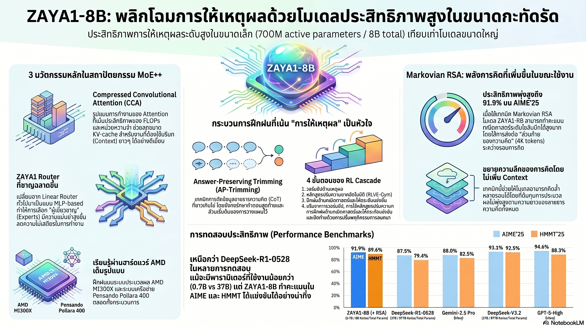

[กลับไปที่หน้าหลัก](../README.md)

สวัสดีครับเพื่อนๆ ที่ติดตามวงการ AI! วันนี้มาเรื่องที่ท้าทาย Scaling Laws ที่เราเชื่อกันมานานว่า "ยิ่งใหญ่ยิ่งเก่ง" อย่างรุนแรง: ZAYA1-8B จาก Zyphra โมเดลที่ใช้ Active Parameters จริงๆ แค่ 700M — น้อยกว่า DeepSeek-R1 ถึง 50 เท่า แต่ทำคะแนนคณิตศาสตร์และโค้ดได้ระดับเดียวกันหรือเหนือกว่าครับ

คุณเคยสังเกตไหมครับว่า ตัวเลข "จำนวนพารามิเตอร์" ที่เราใช้เปรียบเทียบโมเดล AI กันนั้น มักเป็นตัวเลข "รวม" ที่ไม่ได้สะท้อนการใช้งานจริง เพราะในโมเดล MoE พารามิเตอร์ส่วนใหญ่ "นอนหลับ" อยู่โดยไม่ได้ทำงาน ความแตกต่างที่แท้จริงคือ Active Parameters ที่ทำงานต่อ Token — และนั่นคือสนามแข่งขันที่ ZAYA1-8B ชนะอย่างขาดลอยครับ?

คุณรู้ไหมครับว่า วิธีที่ดีที่สุดในการสอนให้ AI "คิด" ไม่ใช่การเพิ่ม Parameters แต่คือการฝัง DNA แห่งการให้เหตุผลไว้ตั้งแต่ Pretraining — ก่อนที่จะทำ RLHF ด้วยซ้ำ เทคนิคที่เรียกว่า AP-Trimming ตัดส่วนท้ายของ Reasoning Trace ที่ยืดยาวออก แต่เก็บส่วน "วางแผน" และ "คำตอบ" ไว้ ทำให้โมเดลเรียนรู้โครงสร้างการคิดที่มีประสิทธิภาพตั้งแต่ต้นครับ?

และคุณเคยนึกไหมครับว่า ปัญหาของ Test-Time Compute ที่ทำให้โมเดลคิดนานขึ้นคือ Context บวมขึ้นจนหน่วยความจำเต็ม แต่ถ้าสามารถ "ส่งต่อเฉพาะส่วนท้ายของความคิด" ในแต่ละรอบแทนที่จะส่งทั้งหมด โมเดลก็จะคิดได้นานเท่าที่ต้องการโดยไม่มีขีดจำกัดด้านหน่วยความจำครับ — นี่คือหลักการ Markovian ที่ ZAYA1 นำมาใช้จนทำ AIME'25 ได้ 91.9% ครับ?

งานวิจัยนี้กำลังบอกว่า: "Intelligence Density" หรือความฉลาดต่อหน่วย Compute คือตัวชี้วัดที่สำคัญกว่าจำนวนพารามิเตอร์ทั้งหมด — และโมเดลที่ออกแบบ Architecture ได้ฉลาด สามารถ "แพ็คความฉลาด" ได้มากกว่าโมเดลที่ใหญ่กว่าหลายเท่าครับ

========================================

🤔 ทบทวนความเชื่อเดิมๆ: สิ่งที่เราคิดเกี่ยวกับ AI Scaling และ Efficiency

▪ "Reasoning ระดับ Frontier ต้องการพารามิเตอร์ระดับ Hundred-billion ขึ้นไป — โมเดลเล็กทำได้แค่งานทั่วไป" → ZAYA1-8B ที่มี Active Parameters เพียง 700M ทำคะแนนเทียบเท่าหรือเหนือ DeepSeek-R1 (37B active) ในหลาย Math/Code Benchmark และทำ AIME'25 ได้ 91.9% ครับ — Active Parameters 50x น้อยกว่า แต่ผลลัพธ์เทียบเท่าครับ

▪ "สอน AI ให้ใช้เหตุผลได้ดีต้องทำใน Post-training ผ่าน RL — Pretraining เป็นแค่การสอนภาษาพื้นฐาน" → AP-Trimming พิสูจน์ว่าการฝัง Reasoning Structure ตั้งแต่ Pretraining ให้ผลดีกว่าการ Patch ทีหลังครับ โมเดลที่เรียนรู้โครงสร้างการวางแผนตั้งแต่ต้นจะใช้ RL ได้มีประสิทธิภาพกว่ามากครับ

▪ "Test-Time Compute ที่เพิ่มขึ้นหมายถึง Context ที่ยาวขึ้น ซึ่งต้องการหน่วยความจำมากขึ้นตามไปด้วย — มีขีดจำกัดที่แน่นอน" → Markovian RSA แก้ปัญหานี้ด้วยการส่งต่อเฉพาะ 4K-token tail แทนที่จะส่ง Full Context ในแต่ละรอบ ทำให้สามารถคิดได้นานขึ้นเรื่อยๆ โดยไม่มีขีดจำกัดด้านหน่วยความจำครับ

▪ "Router ใน MoE ควรเป็น Lightweight Component — ลงทุนที่ Expert จะคุ้มกว่า" → ZAYA1 Router พิสูจน์ตรงข้ามครับ การใช้ MLP-based Router พร้อม EDA และ PID Controller ให้ผลดีกว่า Linear Router มาก เพราะ Router ที่ดีทำให้ Expert แต่ละตัวได้รับงานที่ตรงกับความเชี่ยวชาญจริงๆ ซึ่งมีค่ามากกว่าการเพิ่ม Expert ที่ด้อยคุณภาพครับ

ความจริงที่น่าคิดคือ: ในยุคที่ GPU ราคาแพงและพลังงานมีต้นทุน "ความฉลาดต่อ FLOP" กำลังกลายเป็นตัวชี้วัดที่สำคัญกว่า "ความฉลาดสูงสุดที่เป็นไปได้" สำหรับการนำ AI ไปใช้งานจริงในโลกครับ

========================================

🧠 พื้นฐานที่ต้องเข้าใจก่อน: MoE++ Architecture, AP-Trimming, Markovian RSA, Cascaded RL

=== MoE++ Architecture: สามนวัตกรรมที่ทำให้ 700M Active เทียบเท่า 37B ===

ความสำเร็จของ ZAYA1-8B ไม่ได้มาจากการเพิ่มพารามิเตอร์ แต่มาจากการออกแบบสถาปัตยกรรมสามส่วนที่ทำงานร่วมกันอย่างลงตัวครับ

Compressed Convolutional Attention (CCA): หัวใจของการจัดการ Long Context ครับ แทนที่จะทำ Attention ใน Full-dimensional space ซึ่งมี Quadratic Complexity, CCA ทำ Sequence Mixing ใน Compressed Latent Space ที่มีมิติน้อยกว่า

ผลลัพธ์สองอย่างที่เกิดขึ้นพร้อมกันครับ:
— KV-Cache เล็กลงอย่างมีนัยสำคัญ ซึ่งหมายถึงหน่วยความจำที่ใช้น้อยลงในการ Serve
— FLOPs ในช่วง Prefill ลดลง ซึ่งหมายถึงการรอคำตอบแรกสั้นลง
— แต่ความสามารถในการจำข้อมูลระยะไกลยังคงเดิมครับ

เหมือนการบีบอัดรูปภาพด้วย JPEG ที่ฉลาด — ขนาดเล็กลงมากแต่ตาคนมองแทบไม่เห็นความต่างครับ

ZAYA1 Router — ลงทุนที่คนจัดงานไม่ใช่คนทำงาน: ใน MoE ปกติ Router เป็นแค่ Linear Layer ที่ตัดสินว่าจะส่ง Token ไปให้ Expert ไหนครับ แต่ ZAYA1 Router เป็น MLP (Multi-Layer Perceptron) ที่ซับซ้อนกว่า พร้อมสองเทคนิคเสริมครับ:

EDA (Exponential Depth Averaging): รวมข้อมูลจาก Layer ก่อนหน้าเพื่อให้ Router ตัดสินใจได้ฉลาดขึ้น ไม่ใช่แค่ดู Token ปัจจุบันครับ เหมือนผู้จัดการที่รู้ประวัติก่อนมอบหมายงานครับ

PID Controller สำหรับ Expert Balance: ปัญหาคลาสสิกของ MoE คือ Expert บางตัวได้งานมากเกินไปในขณะที่บางตัวว่างงานครับ PID Controller (ที่ปกติใช้ในระบบควบคุมอุตสาหกรรม) ถูกนำมาคุมสมดุลนี้แบบ Real-time ทำให้ Expert แต่ละตัวพัฒนาความเชี่ยวชาญเฉพาะด้านได้อย่างแท้จริงครับ

Residual Scaling: โมเดลที่มี 40 Layer อาจประสบปัญหา Gradient Vanishing หรือค่าตัวเลขพุ่งสูงจนควบคุมไม่ได้ครับ Learned Residual Scaling เพิ่ม Parameter เล็กน้อยเพื่อควบคุม Residual-norm ในแต่ละ Layer ทำให้การส่งผ่านข้อมูลราบรื่นตลอด 40 Layer ทั้งหมดครับ

=== AP-Trimming: ปลูก "DNA การคิด" ตั้งแต่วันแรก ===

แนวคิดเบื้องหลัง AP-Trimming เริ่มจากการสังเกตครับว่า Reasoning Trace ที่ดีมีโครงสร้างที่ชัดเจน:

ส่วนต้น — Planning & Decomposition: ส่วนที่มีค่าที่สุด ครับ เป็นจุดที่โมเดลวิเคราะห์ปัญหา แบ่งย่อยงาน และวางแผนแนวทาง ส่วนนี้กำหนดทิศทางทั้งหมดที่ตามมาครับ

ส่วนกลาง — การคำนวณและสำรวจ: ยาวที่สุดแต่ไม่ได้มีค่าต่อหน่วยเท่าส่วนต้น

ส่วนท้าย — Local Consolidation: รวบรวมผลลัพธ์ระดับท้องถิ่นก่อนสรุปคำตอบ

AP-Trimming ตัดส่วนกลางและส่วนท้ายส่วนมากออก แต่เก็บ "ต้น" และ "คำตอบสุดท้าย" ไว้ครับ ทำให้โมเดลเรียนรู้จาก Example ที่ฝึก "โครงสร้างการคิด" มากกว่า "ความยาวของการคิด"

ประโยชน์สำคัญคือสามารถใส่ Example ที่หลากหลายกว่าได้ใน Context Length เดียวกันครับ ทำให้ Data Efficiency ของ Pretraining สูงขึ้น และโมเดลเรียนรู้ "วิธีวางแผน" จากตัวอย่างจำนวนมากตั้งแต่ช่วงต้นของการเทรนครับ

=== Markovian RSA: คิดได้ไม่จำกัดโดยไม่เปลือง Memory ===

ปัญหาใหญ่ของ Long Reasoning ในโมเดลปัจจุบันคือ Context บวม ครับ ถ้าให้โมเดลคิด 100,000 Token ก็ต้องเก็บ 100,000 Token ไว้ใน Memory ตลอดเวลา ซึ่งแพงมาก

Markovian RSA แก้ปัญหานี้ด้วยการยืมหลักการจาก Markov Chain ครับ: ในการทำนายอนาคต คุณต้องรู้แค่สถานะปัจจุบัน ไม่จำเป็นต้องรู้ประวัติทั้งหมด

ในทางปฏิบัติระบบทำงานเป็นรอบครับ:

รอบที่ 1: โมเดลคิดใน Context ที่กำหนด สร้าง Reasoning Trace ยาวๆ
รอบที่ 2: แทนที่จะใส่ Reasoning Trace ทั้งหมดเข้าไปต่อ ระบบส่งต่อเฉพาะ "4K-token tail" (ส่วนท้ายของการคิดในรอบที่แล้ว) เป็น Context ของรอบถัดไป
รอบที่ 3, 4, 5... ทำซ้ำโดยที่ Context size ไม่เพิ่มขึ้นเลยครับ

เหมือนนักแก้ปัญหาที่จดโน้ตสรุปไว้บนกระดาษแผ่นเดียวระหว่างคิด แทนที่จะเก็บกระดาษทุกแผ่นตั้งแต่เริ่มต้นไว้หน้าตาครับ ผลลัพธ์คือโมเดลสามารถ "คิดลึก" ได้เท่าที่ต้องการโดย Memory Footprint คงที่

ผลการทดสอบด้วย Markovian RSA ในโหมดคิดนานสูงสุด:
— AIME'25: 91.9%
— HMMT'25: 89.6%
— APEX-shortlist Extra-high: 51.8%

ตัวเลขที่แข่งได้กับโมเดลระดับโลกอย่าง Gemini-2.5 Pro จากโมเดลที่มี Active Parameters ไม่ถึง 1B ครับ

=== Cascaded RL: หลักสูตรสี่ขั้นที่สร้าง Reasoner ระดับ Frontier ===

แทนที่จะทำ RL รอบเดียวแล้วหวังผล ZAYA1-8B ผ่านการฝึกแบบ Curriculum ที่มีโครงสร้างสี่ขั้นตอนครับ:

ขั้นที่ 1 — Reasoning Warmup: เน้นโจทย์คณิตศาสตร์และปริศนาเพื่อสร้างความคุ้นเคยกับ Long Chain-of-Thought ครับ ไม่ใช่การสอนคำตอบ แต่สอนการ "รู้สึกสบาย" กับการคิดยาวๆ

ขั้นที่ 2 — RLVE-Gym Curriculum: สภาพแวดล้อมจำลองกว่า 400 รูปแบบที่ปรับความยากตาม Capability ของโมเดลแบบ Real-time (Adaptive Difficulty) ครับ เหมือน Video Game ที่ปรับความยากตามฝีมือผู้เล่น — ไม่ง่ายจนน่าเบื่อ ไม่ยากจนท้อแท้ ครับ

ขั้นที่ 3 — Math + Code RL: ฝึกกับ Verifiable Rewards ในสภาพแวดล้อมสังเคราะห์สำหรับงานที่ตรวจสอบได้ชัดเจน ครับ คณิตศาสตร์มีคำตอบถูกผิดชัดเจน โค้ดทดสอบได้ด้วย Test Case — ทั้งสองอย่างให้ Reward Signal ที่คมชัดมากครับ

ขั้นที่ 4 — Behavioral RL: ขัดเกลา "บุคลิกภาพ" ครับ ทำให้โมเดลตอบอย่างเป็นธรรมชาติ มีความสอดคล้องกันตลอดการสนทนา และตรงกับสิ่งที่ผู้ใช้จริงๆ ต้องการ

ตลอดทั้งสี่ขั้น ใช้ Muon Optimizer แบบ momentum-free ซึ่งมีความเสถียรสูงกว่าในการเทรนแบบ Asynchronous — สำคัญมากเมื่อใช้ Cluster ขนาดใหญ่ที่ Worker ทำงานไม่พร้อมกันทั้งหมดครับ

=== AMD MI300X: เปิดประตูทางเลือกใหม่ ===

ข้อค้นพบที่สำคัญทางวิศวกรรมอีกอย่างคือ ZAYA1-8B ถูกเทรนบน AMD MI300X ไม่ใช่ NVIDIA H100/H200 ครับ พร้อมเครือข่าย Pollara 400 และรองรับ Context Length สูงถึง 131K

นัยยะคือ Frontier Reasoning Model ไม่ได้ผูกติดกับ NVIDIA Stack อีกต่อไปแล้วครับ ซึ่งเปิดประตูการแข่งขันของฝั่ง Hardware ที่อาจเปลี่ยนโครงสร้างอุตสาหกรรมในระยะยาวครับ

========================================

🎯 ประเด็นที่ควรคิดต่อ

ZAYA1-8B ตั้งคำถามที่สำคัญหลายระดับครับ:

— Intelligence Density คือ Metric ใหม่ที่วงการต้องจับตา: การวัด "คะแนน Benchmark ต่อ Active Parameter" หรือ "คะแนนต่อ FLOP" จะกลายเป็นตัวชี้วัดที่สำคัญกว่า Raw Score อย่างเดียวครับ เพราะในโลกจริงที่ต้นทุน Compute สำคัญ โมเดลที่ "ฉลาดกว่าต่อ FLOP" คือโมเดลที่ชนะได้ยั่งยืนกว่าครับ

— Markovian Thinking เป็นหลักการที่ Generalize ได้กว้าง: แนวคิดว่า "ส่งต่อเฉพาะสิ่งที่จำเป็นสำหรับการตัดสินใจครั้งต่อไป" ไม่ใช่แค่เทคนิคสำหรับ LLM แต่อาจเป็น Architecture Pattern ที่ใช้ได้กว้างขึ้นกับ AI Agent ที่ต้องทำงาน Long-horizon ครับ

— คำถามที่สำคัญที่สุด: ถ้าโมเดล 700M Active Parameters ทำ AIME'25 ได้ 91.9% วันนี้ — เมื่อเทคนิคเหล่านี้ถูก Apply กับโมเดลที่ใหญ่ขึ้น 10-100 เท่าในอนาคต ขีดจำกัดของ "Intelligence Density" คืออะไร? และถ้าขีดจำกัดนั้นยังห่างไกลมาก เราอาจกำลังอยู่ในจุดเริ่มต้นของยุคที่ AI ฉลาดขึ้นเร็วกว่าที่เราคาดการณ์ไว้มากครับ

#ZAYA1 #MixtureOfExperts #ReasoningModels #TestTimeCompute #MarkovianRSA #APTrimming #AIEfficiency #SmallLanguageModels #IntelligenceDensity #AIME #AIResearch #Zyphra
